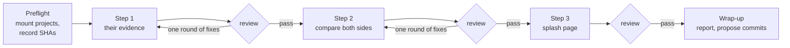

## Why Care?

Earlier today we opened [[2026-10-03_01|collaboration studies]]: putting a
friend's agentic-coding silo beside ours to see what each side can learn.
An idea like that tends to die as a good exploration doc that nobody runs.
So we turned it into something an agent can run.

The interesting part is the question we're asking. We're not reviewing
anyone's product or code quality. We're asking **how a person works with
coding agents**: what instructions they leave, what context they feed in,
what memory carries from one session to the next, how they check the
agent's work. Most of that is never written down as a method. It shows up
as traces in a repo: a `CLAUDE.md`, a folder of skills, a `TODO.md` that
really serves as a changelog, commit messages that read like an agent wrote
them. These plans teach an agent to read those traces.

## What's New?

Three plans and a kickoff prompt, all in `studies/context-v/`:

| Step | Plan | Produces |
|---|---|---|
| 1 | Analyze harness-like evidence in the collaborator's codebase | An inventory with paths and dates, and their inferred workflow loop |
| 2 | Compare and contrast harness artifacts, Lossless against the collaborator | Shared, similar, different and missing buckets, with insights and recommendations both ways |
| 3 | Generate an HTML page in the AI Labs splash | A visual-first public page, anonymized |

The **kickoff prompt** runs them. Each plan takes parameters (which
collaborator, which Lossless projects), so the same three plans work for
the next collaborator too.

## How it Works

### A relay, not a swarm

Each step depends on the one before, so the steps run strictly in order:

The orchestrating agent plays **VP of Engineering**. It doesn't write the
analysis. It prepares the ground, writes each subagent a brief that stands
on its own, and reviews each output before releasing the next step. In
review it checks the "done when" list itself, opens five cited paths to
confirm they say what's claimed, and checks the guardrails held. One round
of fixes goes back to the *same* subagent, which keeps its context. After
that, the problem comes to a human.

### What step 1 hunts for

Nine kinds of evidence: instruction files (`CLAUDE.md`, `AGENTS.md`,
`.cursorrules` and others), harness config (settings, hooks, MCP servers),
skills and slash commands, context docs, specs and plans, memory (a
changelog, or whatever plays that role), git history as evidence,
verification, and stack choices that help or fight agents. An absence is
recorded too. Every claim is labeled *observed* (with a cited path) or
*inferred* (with the reasoning shown).

### What step 2 weighs

Step 2 builds the Lossless inventory itself, from two layers: the projects
(augment-it and memopop-ai, both monorepos) and what they inherit from the
tree above them (the shared skills repo, `context-v/`, changelog
conventions, the Chroma corpus over past sessions). We suspect the
collaborator built a monolith, so architecture is part of the comparison:
where do instructions and context end up when the code is one app rather
than many?

Every artifact lands in exactly one bucket: **shared**, **similar** (same
job, different form; usually the richest), **different** (a deliberate fit
for its context) or **missing** (the other side would likely benefit).
Insights and recommendations are written separately for each side. Two
rules keep it honest:

- At least one recommendation for Lossless has to come from something the
  collaborator does better.
- The collaborator gets **five recommendations at most**, each the smallest
  useful version of the idea. A single-app repo doesn't need a
  27-project pseudomonorepo's machinery.

## Under the Hood

### The public page stays anonymous

The AI Labs splash deploys to GitHub Pages on every push and gets indexed.
So step 3's page uses a placeholder name, describes their system by kind
rather than by name, links to neither their repo nor our notes, and ends
with a search over the built HTML that must find zero mentions of them.
It's the same reason this entry doesn't name them.

### Nothing ships without a human

None of the three subagents commits or pushes, and each writes only its
own output; the collaborator's repo is never touched. Step 3 builds the page and drives it in a
real browser (all three theme modes, phone width) but leaves it unpushed,
because a push makes it public. The VP proposes the commits and waits.

### Diagrams without new dependencies

Step 2 writes Mermaid (or Archify, if that skill is cloned). The splash has
no Mermaid integration, and the Astro Knots rules keep runtime libraries
out. So step 3 redraws each diagram as inline SVG styled with the splash's
own design tokens, so the diagrams follow the mode toggle.

## What's Next?

The first run, done together with Michael: mount augment-it and memopop-ai,
hand step 1 to a subagent, and see what the review gates catch.
