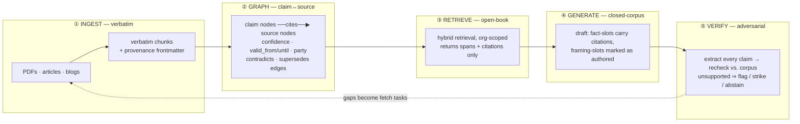

# Corpus-Grounded Generation of Decks and Memos

> Companion to [[Memory-Layers-for-the-In-App-Chat-Package]] (the *chat* read of the study) and [[Funder-Fit-Engine-Org-Corpora-and-the-Story-Unlock-Cycle]] (the *substrate* read — how an org corpus gets built and converged). This is the third read of the same machinery: the **generation** side. It reads against `ai-labs/studies/memory-layers-for-agents/` and its per-system profiles. Where Funder-Fit answers *"build the corpus and reason over it,"* this answers *"now generate a deliverable from it without the model lying."*

## Why this question now

The whole bet behind [[The-Moat-Is-Grounded-Deliverable-Production-Not-Chat]] is that the value isn't chat — it's **knowledge → cited deliverable** (a deck, a memo). We have the raw material for that: hundreds of fetched PDFs, extracted articles and blogs, hand-confirmed facts and claims, increasingly anchored to an org graph (the Funder-Fit work). In theory an LLM over that pile should compress the content-development cycle from days to hours.

In practice the operator hits a wall that has a name: **drift**. The model invents research. It cites a study that doesn't exist, attributes a real-sounding statistic to the wrong source, or states as current fact something the corpus says was true in 2019. It does this *most* when the corpus is silent on exactly the point the slide needs — the model would rather smoothly fill the gap from its parameters than say "we don't have this."

This is not a prompt-wording problem you can scold away. It's structural: a general LLM is a **closed-book** machine by default — it answers from parameters — and we are asking it to behave as a strict **open-book** machine that answers *only* from a supplied corpus and *abstains* otherwise. The gap between those two behaviors is exactly where memory and graph layers earn their keep. This doc is about engineering that gap closed across the whole pipeline, not patching it at the prompt.

## The honest framing

We're early, and so is the field. The eight-plus systems in [[Memory-Layers-for-the-In-App-Chat-Package|the study]] have collectively mapped the option space for *agent memory*; almost none of them are *about* grounded long-form generation specifically. So we're recombining their primitives for a use they weren't built for. What follows is a synthesis, not a citation of settled practice. The point is to name the failure modes precisely enough that each one gets a *mechanism* assigned to it, instead of a vibe ("be more careful").

## What "drift" actually is — five distinct failure modes

"Hallucination" is too coarse to engineer against. The operator's experience decomposes into at least five failures, each with a *different* root cause and therefore a different fix:

| # | Failure mode | What it looks like | Root cause | Where it's fixed |
|---|---|---|---|---|
| 1 | **Parametric leakage** | Model asserts a "fact" or "study" that is nowhere in the corpus | Closed-book default: gap-filling from training params | Retrieval contract + cite-or-abstain (Stage 3–4) |
| 2 | **Unattributed synthesis** | Output blends real chunks into a new claim that no single source supports | Generation collapses N sources into one sentence with no span trace | Span-level citation + verification (Stage 4–5) |
| 3 | **Ingest distortion** | The fact is subtly wrong vs. the original PDF — a number rounded, a hedge dropped | Summarizing/extracting *at ingest* lost or altered the original | Verbatim ingest (Stage 1) |
| 4 | **Stale fact** | A fact true in the source's time is stated as current | No temporal validity on the stored fact | Bi-temporal metadata (Stage 2) |
| 5 | **Confidence flattening** | A source's hedge ("preliminary," "in one small study") becomes a flat assertion | The source's own epistemic stance wasn't carried onto the stored claim | Confidence labels on claims (Stage 2) |

The reason this table is the most important thing in the doc: **you cannot fix all five with one knob.** Verbatim ingest does nothing for parametric leakage. A cite-or-abstain prompt does nothing for a number that was already corrupted at ingest. Each stage of the pipeline below owns one or two of these rows, and the system is only as grounded as its weakest stage.

## The reframe that makes it tractable: facts are *retrieved*, framing is *generated*

A deck or a memo is not one kind of content. It is two, interleaved:

- **Facts / claims** — "reach-edu placed 1,200 learners in 2025"; "Hewlett's stated K-12 priority is systems change." These are *retrieved*. They must trace to a corpus span. The model has **no license to invent here** — only to quote, paraphrase-faithfully, and cite.
- **Framing / narrative / argument** — "this is why apprenticeship is the wedge"; the ordering of slides; the rhetorical arc. This is *generated*. It's the operator's story, and the model is genuinely useful as a writing partner here. Invention is the *job*, not the bug.

The single most useful discipline this exploration proposes: **keep these two separable at every layer** — in storage, in the prompt, and in the output's own structure. Drift is, almost always, the model letting *generated framing borrow the authority of retrieved fact* — stating its narrative connective tissue in the same confident register as a sourced statistic. If the pipeline keeps fact-slots and framing-slots structurally distinct, then "is this grounded?" becomes a checkable question asked only of the fact-slots, and the framing is free to be as generative as the operator wants.

This is the same shape Funder-Fit drew between **first-party stated thesis** (what they say they want — the language to mirror) and **third-party reality** (what's actually going on). Here the cut is between **sourced fact** (must ground) and **authored framing** (may generate). Both docs are really arguing the same thing: *label the epistemic status of every piece of text and let the machinery treat each status differently.*

## The pipeline



Five stages. Each owns specific rows from the failure table. The through-line: **a factual sentence cannot exist in the final deliverable unless it can name the span it came from**, and the system would rather leave a hole (and tell the operator) than fill it from parameters.

### Stage 1 — Ingest verbatim (owns failure #3)

**Pick: store the source text as-written. Do not LLM-summarize or "extract facts" at ingest time.**

This is the [[Memory-Layers-for-the-In-App-Chat-Package|MemPalace discipline]] (`../../studies/memory-layers-for-agents/context-v/profiles/Profile__MemPalace.md`), and it's counterintuitive enough to state plainly: the temptation is to run each PDF through the LLM at ingest and store a tidy list of "extracted facts." **Don't.** Extraction at ingest is exactly where failure #3 (ingest distortion) is born — the model rounds 1,247 to "about 1,200," drops the "in a pilot cohort" qualifier, and now the corrupted version is the *only* thing downstream can retrieve. MemPalace's published margin (≈92.9% vs Mem0's 30–45% on ConvoMem) is attributed directly to this: extraction loses information; verbatim preserves it.

For us this is *already* the convention — the Funder-Fit corpus is markdown with frontmatter under `clients/<client>/corpus/<org-slug>/`, fetched through Jina/Firecrawl, body preserved. The discipline to *hold* is: the markdown body is sacrosanct and quotable; any structured extraction (Stage 2) is a *derived layer that points back at spans*, never a replacement for them. The chunk you retrieve must be quotable verbatim so the deck can cite it as written.

Provenance is stamped here, not later. Every chunk carries (aligning toward Dublin Core / W3C PROV-O per Funder-Fit's standards set): `exact_url`, `published_at`, `fetched_at`, `source` (the observation that produced it), `record_uuid` (lineage-stable chunk id), `party` (first/third-party). **A chunk without provenance is not ingested** — it can never be cited, so it can never legitimately appear in a deliverable.

### Stage 2 — Build the claim↔source graph (owns failures #4, #5; enables #2)

**Pick: layer a knowledge graph over the verbatim corpus whose two load-bearing node types are `claim` and `source`, joined by a `cites` edge.**

This is the part the study handed us almost for free, and it's the reason this is **KAG, not just RAG** (Funder-Fit's term). [[Profile__Understand-Anything|Understand-Anything]] (`../../studies/memory-layers-for-agents/context-v/profiles/Profile__Understand-Anything.md`) ships, in its `kind: "knowledge"` mode, exactly the vocabulary a grounded-generation system needs and that no other study entry has: five **knowledge node types** — `article`, `entity`, `topic`, `claim`, `source` — and knowledge **edges**: `cites`, `contradicts`, `builds_on`, `exemplifies`, `categorized_under`, `authored_by`. That edge set is a *fact-provenance graph* sitting ready-made. The generation contract becomes a graph property:

> **A `claim` node is eligible to appear in a deliverable only if it has at least one `cites` edge to a `source` node backed by a verbatim span.** A claim with no `cites` edge is suppressed — that's a parametric-leakage candidate by construction.

Three more attributes ride on the graph, each killing a failure mode:

- **Confidence label on every claim** (failure #5). Borrow [[Profile__Graphify|Graphify]]'s three-level scheme (`EXTRACTED` / `INFERRED` / `AMBIGUOUS`, `../../studies/memory-layers-for-agents/context-v/profiles/Profile__Graphify.md`) — except here it carries the *source's own epistemic stance*: a claim the source stated flatly is `EXTRACTED`; one the source hedged is `INFERRED`; one we synthesized across sources is `AMBIGUOUS` and may never be stated without a hedge in the output. The label propagates into the deck: a flat claim can be a headline number; a hedged claim must be rendered as "early evidence suggests…".
- **Bi-temporal validity** (failure #4). Borrow [[Profile__Graphiti|Graphiti]]'s model (`valid_at`/`invalid_at` for real-world time, `created_at`/`expired_at` for system time, `../../studies/memory-layers-for-agents/context-v/profiles/Profile__Graphiti.md`). A claim retrieved for a 2026 deck that was `valid_until: 2020` gets flagged stale, not silently asserted as current.
- **`contradicts` / `supersedes` edges** (anti–#2 at the graph level). When two sources disagree, the graph *holds the disagreement* rather than averaging it into a smooth lie. A claim that is `contradicted` by another source cannot be stated flatly — the generator must either surface the tension or pick the higher-trust source and footnote the conflict. This is also where the corpus's own [[Profile__Understand-Anything|LLM-extraction repair discipline]] matters: because the *claim graph itself* may be LLM-authored, it needs Understand-Anything's normalization-and-review posture (the `graph-reviewer` agent, the Zod alias maps) so the graph doesn't itself become a drift source.

Note the honest cost: building this graph is itself an LLM extraction step, and extraction can hallucinate. The mitigation is that **every claim node must point at a verbatim span** (Stage 1's product) — so a fabricated claim node is catchable by checking whether its `cites` span actually contains it. The graph is *derived and auditable*, never authoritative over the text.

### Stage 3 — Retrieve open-book, org-scoped, citations-attached (owns failure #1, half)

**Pick: hybrid retrieval (cosine + BM25) over the verbatim chunks, filtered to the org/project, returning spans *with* their citations — and nothing the model can mistake for license to free-associate.**

Mechanics are settled by [[Best-Way-to-RAG-Over-the-Corpus]] and the Funder-Fit update: single Chroma collection, metadata filter on `org_slug`, chunk identity by `record_uuid`, `n_results` capped (our CLAUDE.md convention caps at 5). The grounding-specific moves on top:

- **Retrieve spans, not summaries.** What lands in context is the verbatim chunk plus its citation handle, so the generator can quote and attribute, not paraphrase from a lossy digest.
- **The graph join is the KAG step.** Pull `claim` nodes whose embeddings match the slide's need, then traverse to their `cites` sources, their confidence, their validity window, their contradictions — so the generator sees not just "here's a relevant passage" but "here's a claim, here's how sure the source was, here's whether anyone disputes it." This is precisely the Direction-1 retrieval Funder-Fit sketches, pointed at a slide instead of a brief.
- **Empty retrieval is a first-class result.** When the corpus has nothing for the slide's point, the retriever returns *empty*, and the contract (Stage 4) is that empty → the model abstains and emits a **gap marker**, not a guess. Half of failure #1 dies right here: the model can only leak from parameters if we let "no retrieval" silently pass through to "generate anyway."

### Stage 4 — Generate against retrieved spans only (owns failures #1, #2)

**Pick: a closed-corpus generation contract where fact-slots must carry citations and framing-slots are explicitly marked as authored.**

The prompt-level discipline that operationalizes the fact-vs-framing reframe:

1. **Closed-corpus instruction.** The system prompt states, in load-bearing terms, that the model may assert a fact *only* if a retrieved span supports it, must attach the citation handle inline, and must emit a `[[GAP: <what's missing>]]` marker rather than invent when no span supports the needed point. "Use your own knowledge to fill in" is the forbidden behavior, named explicitly.
2. **Structured output that separates the two registers.** The draft isn't free prose; it's slots. A fact-slot has `{ text, citations[], confidence }` and is *rejected at parse time if `citations` is empty*. A framing-slot has `{ text, kind: "authored" }` and carries no citation because it claims no fact. This makes failure #2 (unattributed synthesis) structurally hard: there is no slot shape for "a confident factual sentence with no source."
3. **Confidence-aware rendering.** A `INFERRED`/hedged claim cannot be rendered in the flat register; the generator must use the source's hedge. An `AMBIGUOUS` (cross-source synthesized) claim must either be dropped or explicitly framed as the operator's interpretation.
4. **Prompt caching** for the static spine (instructions + capability schemas + any always-loaded org reminders) per [[Memory-Layers-for-the-In-App-Chat-Package|the chat-memory doc's]] caching note — grounded generation does *more* retrieval round-trips, so the cost discipline matters more, not less.

The output of this stage is a draft that is *self-auditing*: every factual sentence already names its source, and every gap is already marked. That is what makes Stage 5 cheap.

### Stage 5 — Verify adversarially (owns failure #2; backstops all)

**Pick: a post-generation pass that extracts every claim from the draft and independently re-checks it against the corpus, flagging anything unsupported — separate from the generator, ideally a different agent.**

This is the enforcement stage, and it's where a multi-agent / workflow harness pays off. The pattern is the study's `graph-reviewer` (Understand-Anything's integrity-check agent) crossed with the adversarial-verify discipline: the generator is optimistic; the verifier's *only job is to refute*. Concretely:

```
for each fact-slot in the draft:
    re-retrieve against the corpus for that exact claim
    a verifier agent (NOT the generator) judges:
        SUPPORTED   — span entails the claim  → keep
        WEAK        — span is related but doesn't entail → downgrade/hedge or strike
        UNSUPPORTED — no span entails it       → strike + emit GAP marker
        STALE       — span entails but valid_until < deck horizon → flag
        CONTRADICTED— another span disputes it  → surface tension or pick higher-trust + footnote
```

Because the draft already carries citations (Stage 4), the verifier isn't re-deriving provenance from scratch — it's *checking a claimed citation against the span it names*, which is a bounded, cheap entailment judgment. The verdicts feed two places: the deliverable (strikes/hedges applied), and the operator's review surface (the GAP and CONTRADICTED markers are exactly the "you need to go fetch this / decide this" worklist). Drift that survived Stages 1–4 dies here, and what can't be auto-resolved is *surfaced, not buried*.

The loop closes back to ingest: a `[[GAP]]` is a fetch task. The deck that can't be fully grounded today tells you precisely which sources to add to the corpus — the same Phase-0/Phase-1 reconcile-and-augment loop Funder-Fit describes, now *driven by an actual deliverable's needs* instead of speculative breadth.

## Mapping the study to the pipeline

Which pinned system informs which stage — so the next reader knows where to go deep:

| Stage | Primary study input | What we take |
|---|---|---|
| ① Ingest verbatim | [MemPalace](../../studies/memory-layers-for-agents/context-v/profiles/Profile__MemPalace.md) | Verbatim-not-extracted discipline; quotability; "extraction loses information" |
| ② Claim↔source graph | [Understand-Anything](../../studies/memory-layers-for-agents/context-v/profiles/Profile__Understand-Anything.md) | `claim`/`source`/`cites`/`contradicts` knowledge vocabulary; graph-reviewer + Zod-normalization so the graph isn't itself a drift source |
| ② Confidence labels | [Graphify](../../studies/memory-layers-for-agents/context-v/profiles/Profile__Graphify.md) | `EXTRACTED`/`INFERRED`/`AMBIGUOUS` per-claim trust label |
| ② Temporal validity | [Graphiti](../../studies/memory-layers-for-agents/context-v/profiles/Profile__Graphiti.md) | Bi-temporal `valid_at`/`invalid_at`; stale-fact detection; supersession |
| ② Typed-fact supersession | [Neo](../../studies/memory-layers-for-agents/context-v/profiles/Profile__Neo.md) / [RetainDB](../../studies/memory-layers-for-agents/context-v/profiles/Profile__RetainDB.md) | Deterministic `superseded_by` chains for the "fact changed" case |
| ③ Retrieve | [[Best-Way-to-RAG-Over-the-Corpus]] + Chroma | Hybrid retrieval, org-scoped filter, KAG graph join |
| ⑤ Verify | Understand-Anything `graph-reviewer` + adversarial-verify | Independent refutation pass; entailment-check claimed citations |

## Where the graph earns its keep (and why this isn't a generic RAG-over-PDFs tool)

Funder-Fit's sharpest line applies verbatim here: **the graph is the differentiator.** A generic "chat with your PDFs" tool does Stage 1 + Stage 3 and stops — verbatim chunks, vector retrieval, generate. That gets you failure modes #2, #4, #5 in full, because flat vector RAG has nowhere to *put* a contradiction, a validity window, or a confidence level. The claim↔source graph is what lets the system:

- **Refuse to flatten a contradiction** — `contradicts` edges mean the deck surfaces "sources disagree on X" instead of confidently picking one.
- **Catch a stale fact** — validity windows mean a 2019 number doesn't become a 2026 headline.
- **Carry the source's hedge** — confidence labels mean "preliminary evidence" survives into the slide instead of hardening into fact.
- **Answer relationship-weighted questions** — the same `affiliations`/`coverage`/`about` edges Funder-Fit builds let a memo say "this claim comes from a source the funder themselves published," which is a *trust* signal a deck reader cares about.

That's why this belongs in the augment-it/Funder-Fit lineage and not in a generic tool: we already built the graph. Grounded generation is the graph's highest-value consumer.

## What we're explicitly betting on

1. **Drift is five failure modes, not one** — and the system is only as grounded as its weakest stage. The table is the spec; a single anti-hallucination prompt is not.
2. **Facts are retrieved; framing is generated** — and keeping them structurally separable (storage, prompt, output slots) is the highest-leverage discipline. Drift is generated framing borrowing retrieved authority.
3. **Verbatim beats extracted at ingest** — derive the claim graph as an *auditable pointer layer*, never as a replacement for the source text.
4. **Empty retrieval must produce a gap marker, not a guess** — the abstain path is the single most important behavior, and it has to be wired end-to-end (retriever returns empty → generator emits GAP → verifier confirms → operator sees a fetch task).
5. **Verification is a separate, adversarial pass** — the generator is optimistic by design; a different agent whose only job is to refute is what makes "every factual sentence is checkable" real rather than aspirational.

We can be wrong on any of these. Writing them down is so we know where to look when a deck still drifts.

## Open questions

1. **How rich a claim graph, how soon?** Stage 1 + 3 + 5 (verbatim + retrieve + verify) is buildable now and kills three of five failure modes without a graph. Is the full claim↔source graph (Stage 2) a fast-follow, or the whole point that should lead? (Bias: Funder-Fit argues the graph is the moat — under-using it makes this generic.)
2. **Who extracts the claim graph, and how is *it* verified?** The graph is LLM-built and can hallucinate. The "every claim must cite a verbatim span" rule makes nodes auditable — but is that audit a one-time build-time pass, a continuous reconcile (Funder-Fit Phase 0 shape), or both?
3. **Span granularity.** Is a citation a whole chunk, a paragraph, or an exact sentence span? Finer granularity makes entailment-checking sharper but ingest and storage heavier. Where's the knee?
4. **Fact vs. framing — operator-marked or model-marked?** Does the operator declare which slots are "authored framing," or does the model propose the split and the operator corrects? (Echoes Funder-Fit Q1: web-research isn't accurate enough to auto-accept; operator drives. Same instinct may apply to the fact/framing cut.)
5. **Where does the verifier's verdict surface?** Inline strikes in the draft, a separate "groundedness report" alongside the deck (the StateBench-style "we cited correctly 94% of the time" number), or both? The report is what turns "the deck feels sourced" into "the deck *is* sourced, measurably."
6. **Deck vs. memo asymmetry.** A memo is mostly prose and tolerates inline citations naturally; a deck is sparse and visual, and a slide with eight footnotes is a bad slide. Does the citation discipline render differently per deliverable type (memo: visible cites; deck: cites in speaker notes / an appendix, with the *verification* still strict)?
7. **Where does the pipeline live?** Script-first to prove the retrieve→generate→verify loop (like the Funder-Fit export scripts), then a chat verb / a "Grounded Draft" lens in dididecks or memopop? Probably script-first.

## What forks from this

- A **spec** once the stage shape is agreed — likely `Grounded-Generation-Pipeline` or split into `Claim-Source-Graph` (Stage 2 substrate) + `Grounded-Draft-and-Verify` (Stages 4–5 application).
- A **blueprint** for the **fact-slot / framing-slot output schema** (the structured-generation contract) — reusable across decks (dididecks) and memos (memopop).
- A **blueprint** for the **claim↔source graph schema** — adapting Understand-Anything's knowledge node/edge vocabulary to our corpus + SurrealDB org graph.
- A first consumer for the **verification-as-adversarial-pass** pattern — a small workflow harness (generator agent → independent verifier agents → operator worklist).
- Feeds [[The-Moat-Is-Grounded-Deliverable-Production-Not-Chat]]: this is the *how* under that thesis's *what*.

## References

- [[Memory-Layers-for-the-In-App-Chat-Package]] — the *chat* read of the same study; source of the trust-split and prompt-caching discipline reused here.
- [[Funder-Fit-Engine-Org-Corpora-and-the-Story-Unlock-Cycle]] — the *substrate* read: org-anchored corpus, KAG-not-RAG, provenance-as-entity, the open-standards set (PROV-O, Dublin Core, Schema.org, 360Giving). This doc is its generation-side sibling.
- [[The-Moat-Is-Grounded-Deliverable-Production-Not-Chat]] — the strategic frame: value is knowledge → cited deliverable, not chat. This is the engineering of that.
- [[Best-Way-to-RAG-Over-the-Corpus]] — read-side retrieval mechanics (Chroma, chunking, hybrid filter) that Stage 3 builds on.
- [[ChromaDB-as-Context-Improvement-Across-Everything-Everyone]] — the exploration that produced the Chroma integration this rides on.
- `../../studies/memory-layers-for-agents/context-v/profiles/Profile__MemPalace.md` — verbatim-not-extracted ingest discipline (Stage 1).
- `../../studies/memory-layers-for-agents/context-v/profiles/Profile__Understand-Anything.md` — `claim`/`source`/`cites`/`contradicts` knowledge graph + graph-reviewer + Zod normalization (Stage 2, Stage 5).
- `../../studies/memory-layers-for-agents/context-v/profiles/Profile__Graphify.md` — `EXTRACTED`/`INFERRED`/`AMBIGUOUS` confidence labels (Stage 2).
- `../../studies/memory-layers-for-agents/context-v/profiles/Profile__Graphiti.md` — bi-temporal validity / supersession (Stage 2).
- `../../studies/memory-layers-for-agents/context-v/profiles/Profile__Neo.md`, `Profile__RetainDB.md` — deterministic typed-fact supersession (Stage 2, the "fact changed" case).
- `clients/reach-edu/corpus/` (augment-it) — the verbatim corpus this pipeline consumes; the Stage 1 product already exists.
- `services/content-ingest/src/{jina,corpus,handlers}.ts` (augment-it) — the fetch→markdown pipeline the Stage-5 gap-loop re-enters.
