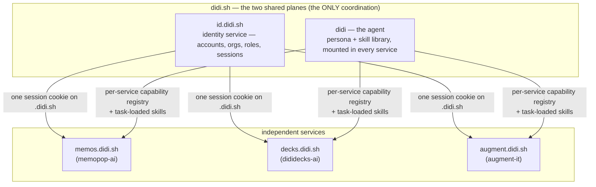

# didi.sh — One Login, One Agent, Three Services

## What changed

We own **`didi.sh`**. And with it, a posture decision: the three tools we've
been building organically for venture-capital work — each with obvious generic
demand beyond VC — get built out as **both independent services and
coordinated services**:

| Service | Repo today | What it is |
|---|---|---|
| **memos** | `memopop-ai` | multi-agent investment-memo orchestration |
| **decks** | `dididecks-ai` | slide-deck operating system for due-diligence-grade content |
| **augment-it** | `augment-it` | corpus curation + entity augmentation + grounded research workspace |

"Independent" means each ships alone, on its own repo, its own deploy, its own
capability registry, usable without the others. "Coordinated" means exactly
**two** things converge on didi.sh — no more:

1. **Shared auth.** Logging into *any* of the three requires an account on the
   shared identity service. One account, all three services. No per-service
   accounts exist.
2. **Shared agent.** One agent, named **didi**, present in all three services,
   loading specific agent skills based on what it is performing.

Everything else stays per-service. This doc maps what the domain purchase
changes architecturally (a lot, for auth; a naming-and-tier decision, for the
agent), what survives from the prior art unchanged (most of it), and what
forks next.

## The shape

Subdomain names are provisional (`id.` vs `auth.`, `augment.` vs `it.`, and
whether the apex hosts a landing/console) — flagged in open questions. The
structure is the commitment: **two planes, three services, apex domain owned.**

## Plane 1 — identity: the domain flips Fork 1

[[Shared-Auth-for-Applied-AI-Labs]] chose its Fork 1 as **Option A** — shared
library, per-app DB, *no central service* — and explicitly deferred SSO with
the note: *"B becomes attractive if we hit a wall where the
JOIN-by-`lossless_id` roll-up isn't enough (e.g., we want true SSO where
signing into memopop signs you into dididecks)."* One common login **is** that
wall, named in advance. Fork 1 flips to **B: a central identity service**.

### What the apex domain buys (why B just got cheap)

The original exploration was designed without a shared origin — three apps on
three unrelated domains, where SSO genuinely requires heavy machinery
(redirects, token exchange, a directory protocol). Under one apex domain the
hard part mostly dissolves:

- **One session cookie, scoped to `.didi.sh`** (HTTP-only, `Secure`,
  `SameSite=Lax`), issued by the identity service, readable by every
  `*.didi.sh` backend. Signing in anywhere = signed in everywhere, with no
  token-exchange choreography. This is the standard first-party-suite pattern
  (the reason google.com properties share a login).
- **Session validation is one shared check.** Each service's gate — augment-it's
  workspace token check on WS upgrade + per-capability authorization
  ([[../../augment-it/context-v/blueprints/Auth-Patterns-following-Astro-Knots-Patterns|Auth-Patterns-following-Astro-Knots-Patterns]]),
  dididecks' middleware, memopop's FastAPI dependency — validates the same
  session, either by a signed token it can verify locally (no network hop on
  hot paths) or by consulting the identity service (simplest v0). The
  session-table-as-contract idea from the original doc survives; the table
  just lives in one place now.
- **The roll-up seam collapses into the service.** Auth events are born
  central instead of outboxed per-app and ingested later — the cross-app
  dashboard the outbox was stubbed for becomes a query. (Per-app
  `auth_events_outbox` remains the right pattern for *app* events; it's no
  longer needed for *auth* events.)

### What survives from the prior architecture unchanged

Nearly everything below the topology line — the 2026-05-17 exploration's
choices were deliberately service-agnostic and move into the central service
intact:

- **The credential pathways:** OAuth (GitHub + Google Workspace, via
  `arctic`), magic-link email, pre-shared invite tokens (WhatsApp/1Password
  delivery). Invite-only; no self-serve signup; no passwords.
- **The org model:** one `organizations` table, **domain-as-id**, optional
  `firm_profile` extension, the personal-email bucket, the
  `@lossless.group` superuser fast-path.
- **Roles:** `superuser` / `org_owner` / `org_admin` / `editor` / `viewer` —
  org-wide, no per-resource ACLs. Authorization stays **per-service**: the
  identity service says *who you are and what orgs/roles you hold*; each
  service decides what that role may do against its own capabilities. (For
  augment-it, org ≈ workspace per
  [[../../augment-it/context-v/specs/Workspaces-as-Tenant-Primitive|Workspaces-as-Tenant-Primitive]].)
- **The stable person id** (`lossless_id`, UUIDv7 — possibly renamed
  `didi_id`; open question) — now minted in one place, which deletes the
  lazy-email-restitch problem between apps entirely.
- **The scale posture:** tens of people, a handful of client firms, code we
  own (~800 lines), no Auth0/Clerk. A central service does NOT mean a big
  service. It means the same small auth core **deployed once** instead of
  vendored three times — which is *less* total surface than Option A's
  three-copies-drifting problem.
- **The calmstorm inventory** (`dididecks-ai/context-v/specs/Calmstorm-Auth-Inventory.md`)
  remains the audited reference implementation for the session/token/invite
  mechanics.

### What stays hard (unchanged by the domain)

- **Tauri (memopop desktop).** No cookie jar worth trusting; system-browser
  OAuth against the identity service, deep-link back, refresh token in the OS
  keychain, bearer token on sidecar calls. Same design as before, now pointed
  at one endpoint.
- **Published client subdomains** (`memos.acmevc.com/deal-name`). A different
  origin, so the `.didi.sh` cookie does nothing there — the public-preview +
  magic-link viewer-auth design from the original exploration is untouched,
  still forks to its own doc when it gets real.
- **The superuser boundary, deletion policy, email provider** — all the
  original "deliberately left open" items remain open, just answered once
  instead of three times.

### Relation to the two-client convergence

[[Two-Clients-One-Flow-Corpora-Auth-and-Deployment-Converge]] left "where does
the first auth implementation land" as its open question #1 (augment-it's
workspace service vs resuming the calmstorm extraction). **didi.sh answers it
differently than either option:** the first implementation is the identity
service itself, and augment-it — the deploy target with two live client teams
waiting — is its **first consumer**. reach-edu and humain-vc logins become
didi.sh accounts with `editor`/`viewer` roles in their orgs, enforced at
augment-it's capability gate. calmstorm's code is the quarry to extract *into
the service* rather than into a vendored package; memos and decks wire in as
consumers two and three.

## The GTM constraint — every service is its own front door

Added 2026-07-06, same day, after the naming sketch above: **nobody searches
for a one-source-fits-all platform.** They search for a deck designer, a memo
generator, a research tool — point solutions whose names match the query. So
the platform posture inverts the usual suite pattern, and the inversion is a
hard requirement on the identity service's shape:

- **The apex is not the front door.** `didi.sh` (and any account console on
  it) is connective tissue, not a landing page users get routed through. Each
  service owns its marketing surface, its positioning, and its signup moment.
- **Accounts are created FROM the app the user is in.** A user who arrives at
  decks signs up *in decks* — the service renders its own branded signup/login
  UI (its theme, its copy), and the didi.sh account is created underneath,
  with no visible "now leaving for the platform" hop. Invites land the same
  way: an invite link opens the service's own access page, not `id.didi.sh`.
- **Therefore the identity service is headless-first.** Its primary interface
  is an API the services call — create-account, start-oauth, redeem-invite,
  redeem-magic-link, session issue/verify — not a hosted login page the
  services redirect to. A hosted fallback page can exist, but the contract is:
  **the service owns the pixels; the identity service owns the record and the
  session.** The OAuth dance still round-trips through the identity host
  (provider callbacks need one stable redirect URI), styled thin enough to
  read as a blink, landing back in the app that started it.
- **Marketing domain ≠ app domain — and only the app domain must be didi.sh.**
  The `.didi.sh` cookie is what makes SSO free, so the *running apps* live on
  `*.didi.sh`. Each service's discoverable marketing site can live wherever
  its GTM wants (a product-named domain, SEO'd for its query), funneling into
  its app subdomain at signup. Point-solution GTM and cheap SSO don't
  conflict — as long as nobody puts an app itself on a non-didi.sh domain.
- **The family is discovered later, from inside.** "Your account also works on
  memos" is an in-product moment — and a natural line for didi to deliver —
  *after* the point solution has proven its value. Cross-service is expansion,
  not acquisition.

## Plane 2 — didi, the agent

The agent architecture is already specced and the didi decision keeps all of
it: [[In-App-Agent-Chat-Core-Package]] (chat UI package, capability registry
as the only side-effect surface, BYOK routing, transcripts, Chroma tenancy)
and [[Remote-Mount-Contract-for-In-App-Agent]] (chat is UI-only; state and
capabilities live in per-app `@<app>/workspace` packages; the chat reaches
each app only through a typed `WorkspaceAdapter`). That contract is exactly
what makes "one agent, three services" possible without coupling: **didi has
zero domain knowledge; each service's registry is what didi can do there.**

What didi adds on top of that spec is three things it deferred or didn't name:

### 1. A persona

One name, one voice, one presence across memos, decks, and augment-it. The
character-cast pattern (memopop's `Character-Cast-for-Live-Agent-Indication`)
gets an anchor character: didi is the one you talk to; the cast are the
workers didi dispatches. The brand seed was already there — **Didi**Decks —
now promoted from one product's name to the family's agent.

### 2. A shared skill library, loaded per task

"Didi loads specific agent skills based on what it is performing." This is
the trigger-shape discipline we already live in Claude Code, operationalized
for the in-app agent — and it slots into the core spec's existing prompt
architecture rather than changing it:

- **Skills ≠ capabilities.** A *capability* is a typed, gated side-effect
  (`slide.variant`, `source.add`, `agent.run`) owned by a service's workspace.
  A *skill* is method-knowledge — how Lossless does deck iteration, source
  curation, memo citation discipline — loaded into didi's context when the
  task matches. Capabilities bound what didi *can do*; skills shape how didi
  *does it well*. The precedent is already in-tree: augment-it's
  `context-v/agent-skills/decile-hub-interface` is an agent skill in exactly
  this sense, and the operator-facing `context-v/skills/` library is the
  authoring pattern to mirror (SKILL.md, trigger description, references).
- **Placement in the prompt stack:** the core spec's cache-slab design holds —
  static spine (didi's persona + guardrails), capability schemas, per-org
  reminders, then volatile context. Skills load in the volatile zone via
  retrieval (the spec's "hybrid spine" recommendation) or as an explicitly
  fetched slab when the task declares itself (user opens the curator → the
  source-curation skill loads). Which loading mechanism — retrieval-scored vs
  surface-declared vs both — is an open fork.
- **One library, service-scoped exposure.** The skill library is shared
  didi-wide (that's half the point of one agent), but what's *loadable* is
  scoped per service + per org tier, same as capabilities.

### 3. Cross-service continuity

The core spec scoped cross-app chat out of v1 ("cross-app belongs at the
roll-up tier"). didi.sh **is** the roll-up tier, named. One identity + one
agent means the continuity question is now *when*, not *where*: didi in decks
knowing what you curated in augment-it this morning is a
`(didi_id, org)`-scoped memory read across service transcripts — the Chroma
tenancy design (`client__{org_slug}` tenants, `client-app-sessions`
collection) already isolates it correctly per client. Still not v1; no longer
homeless.

### The runtime-placement fork (open, sharpened)

The core spec said per-app agent runtime for v1, "factor out only if
duplication hurts." didi.sh sharpens the alternative: a shared didi runtime
(`agent.didi.sh` or similar) that fronts the model call, persona, skill
loading, and BYOK routing once, while **capability invocation still goes
through each service's workspace** (auth, policy, and audit enforced where the
state lives — the Remote-Mount contract's invariant). Lean: keep v1 per-app
per the spec, but implement the persona + skill-library as a shared package
didi-wide from day one, so the runtime consolidation later is an ops change,
not a rewrite.

## Independent AND coordinated — the discipline

The both/and posture has teeth, mostly already written down:

- **No chat-required apps.** The Remote-Mount contract's anti-pattern list
  says it: every service must ship and function without didi mounted. didi is
  a multiplier, not a load-bearing wall.
- **Auth is the one hard dependency, by design.** No service grows its own
  account system, ever — that's the coordination bet. Mitigation for the SPOF
  this creates: signed sessions each service can verify locally, so a brief
  identity-service outage degrades new-login only, not every request.
- **Capabilities stay home.** No shared business logic, no shared domain
  state. The only didi-wide contracts are the `WorkspaceAdapter` interface,
  the skill format, and the identity claims.
- **Repos stay independent** (pseudomonorepo discipline unchanged); didi.sh
  is deploy topology + two shared packages/services, not a merge.

## What this does to the near-term sequence

The [[Two-Clients-One-Flow-Corpora-Auth-and-Deployment-Converge]] sequencing
survives with its auth thread re-targeted:

1. **Thread 1 (domain-type UI)** — untouched, still first, still local.
2. **Auth spec** — now the **didi.sh identity service spec** (see forks):
   central service, `.didi.sh` cookie, org/role claims, augment-it as first
   consumer for the reach-edu + humain-vc logins.
3. **Deployment** — gains its concrete target: augment-it deploys *as*
   `augment.didi.sh`, and the identity service deploys beside it. DNS, TLS,
   and subdomain topology stop being abstract questions in the deploy plan.
4. **didi the agent** — not on the client-login critical path. The curator
   and corpus flow ship agent-less; didi's first mount follows the core
   spec's rollout order (decks first, memos, then augment-it) *or* flips to
   augment-it-first since that's where the deployed surface and the client
   users are — decide when the identity service is real.

## Open questions

1. **Subdomain names.** `id.didi.sh` vs `auth.didi.sh` vs `login.didi.sh`;
   `augment.didi.sh` vs `it.didi.sh` (the pun) vs renaming the service to
   match `memos`/`decks` vocabulary (`corpus.didi.sh`? `research.didi.sh`?).
   The apex-as-front-door half of this question is answered by the GTM
   section — the apex is never the acquisition path; at most it hosts a
   secondary account console ("your account, your orgs, your services")
   reached from inside the apps.
2. **`lossless_id` → `didi_id`?** The stable person id is about to be minted
   by the didi.sh service; naming it after the platform reads better in every
   downstream schema. Decide before the first row exists, not after.
3. **Is didi the platform brand or just the agent?** "didi.sh services" vs
   "the didi platform, with didi the agent as its face." Affects marketing
   copy, the apex page, and whether `dididecks` reads as redundant. The GTM
   section tilts this: the *services* carry the searchable product brands;
   didi.sh is connective tissue plus the agent's name — so didi is probably
   the agent (and the quiet account footer), not the headline.
4. **Skill loading mechanism** — retrieval-scored triggers, surface-declared
   packs, or both (lean: both — declare by surface, retrieve within).
5. **Agent runtime placement** — per-app v1 with shared persona/skill
   packages (the lean above), or straight to a shared runtime service.
6. **BYOK × central identity.** Keys hang off the user record — which now
   lives in the identity service. Does key storage centralize with it (web
   tier), or stay per-service? (Tauri keychain storage is unaffected.)
7. **White-label later.** Client-facing surfaces on client domains
   (`memos.acmevc.com`) were always a separate auth problem; a didi.sh
   account behind them is now the *authoring* identity either way. Unchanged,
   but worth restating so nobody expects the apex cookie to cover it.

## What forks from this

- **ai-labs spec: `Didi-Identity-Service.md`** — supersedes the
  package-extraction plan in [[Shared-Auth-for-Applied-AI-Labs]] §Decisions:
  schema (carried over nearly verbatim), the **headless-first API contract**
  (services own the signup pixels; the GTM section above is a hard
  requirement, not a preference), the `.didi.sh` session contract,
  signed-token verification for services, the consumer wiring order
  (augment-it → decks → memos incl. Tauri), and what calmstorm's code
  contributes.
- **ai-labs blueprint: `Didi-Agent-Skills-Convention.md`** — the skill
  format, the library layout, service-scoped exposure, loading mechanics,
  and the relationship to `context-v/skills/` and `context-v/agent-skills/`
  precedents.
- **A naming decision record** (short, in this doc's next revision or the
  identity spec) — subdomains, `didi_id`, platform-vs-agent branding.
- **Amendments landed with this doc:** Fork-1 revision note in
  [[Shared-Auth-for-Applied-AI-Labs]]; auth-thread re-target in
  [[Two-Clients-One-Flow-Corpora-Auth-and-Deployment-Converge]].

## Related

- [[Shared-Auth-for-Applied-AI-Labs]] — the auth architecture didi.sh
  re-topologizes; everything below Fork 1 carries over.
- [[Two-Clients-One-Flow-Corpora-Auth-and-Deployment-Converge]] — the
  near-term convergence this gives a domain and an identity-service answer to.
- [[In-App-Chat-as-Agent-Surface-for-Client-Apps]] — the chat-as-menu
  exploration didi personifies.
- [[In-App-Agent-Chat-Core-Package]] — the package spec didi rides on
  (capability registry, BYOK, transcripts, Chroma tenancy, cache slabs).
- [[Remote-Mount-Contract-for-In-App-Agent]] — the WorkspaceAdapter contract
  that makes one agent across three services non-coupling.
- `dididecks-ai/context-v/specs/Calmstorm-Auth-Inventory.md` — the audited
  session/invite mechanics the identity service extracts from.
- `memopop-ai/context-v/specs/Character-Cast-for-Live-Agent-Indication.md` —
  the personification pattern didi anchors.
- `augment-it/context-v/agent-skills/decile-hub-interface/` — the in-tree
  precedent for an agent skill.
