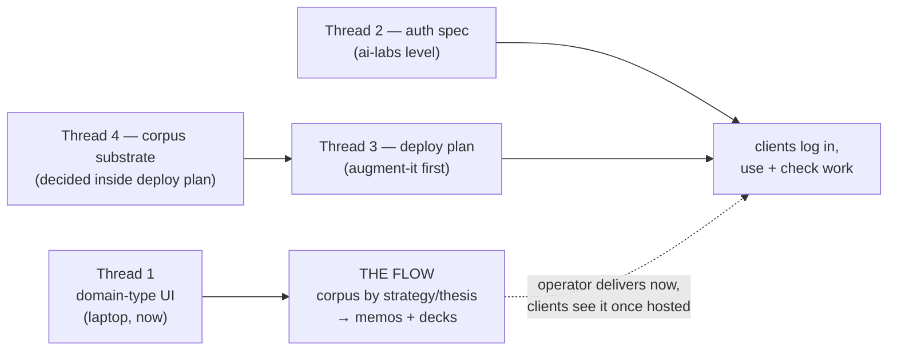

# Two Clients, One Flow — Corpora by Domain-Type, Auth, and Deployment Converge

## Why Care?

For over a month we've been laying pipe for things that "would matter later":
the domain catalog is generic-and-typed even though only strategies existed;
every canonical write carries a client slug even though only reach-edu existed;
an auth architecture was explored ([[Shared-Auth-for-Applied-AI-Labs]]) even
though nobody could log in; R2 was stood up ([[JuiceFS-Pinned-Path-Off-Local-Substrate]])
even though the corpus fits on a laptop. In the same week, all of the deferred
halves came due:

1. **A second client workspace exists.** `augment-it/clients/humain-vc/` is
   scaffolded next to `reach-edu/`, and its corpus already holds its first
   domain (`consumer-immunology`) — mis-filed under `strategies/`, because
   the curator UI can only speak that one noun.
2. **Both client teams want in.** reach-edu and humain-vc people want to use
   the tools and/or check the work. That is decision-forcing function #2 from
   [[../../augment-it/context-v/explorations/Per-Client-Privacy-and-the-Path-Off-Local|Per-Client-Privacy-and-the-Path-Off-Local]]
   ("a client wants a login URL") — fired twice at once. Path A (defer
   everything) is over.
3. **The flow both clients need is the same flow.** Develop corpus content by
   domain, then author memos and decks grounded in that domain's corpus. This
   is [[The-Moat-Is-Grounded-Deliverable-Production-Not-Chat]] arriving as a
   client deliverable schedule instead of a thesis.

This exploration maps the four threads that converged, what each already has
on disk (verified, not remembered), and a sequencing that gets the operator to
the flow ASAP without letting the slow threads (auth, deployment) block the
fast one (corpus by domain-type).

## The target flow

Identical shape, different vocabulary, per client:

| Client | Domain type | Count | Deliverables |
|---|---|---|---|
| `reach-edu` | **strategy** | 6, going on 7 — `adult-literacy-numeracy`, `agent-workflow-maxxing`, `frontier-job-demand`, `ncad-forge`, `rural-income-boosts`, `workforce-development` | memos + decks per strategy |
| `humain-vc` | **thesis** | 4+, first is `consumer-immunology` | memos + decks per thesis |

The flow per domain: **curate sources → build the domain corpus (verbatim,
provenanced) → author memos and decks grounded in that corpus**. The
curation half is the Strategy Curator, working and runtime-verified
([[../../augment-it/context-v/specs/Strategy-Curator-Entry-Point-for-Augment-It|Strategy-Curator-Entry-Point-for-Augment-It]]).
The generation half is mapped in [[Corpus-Grounded-Generation-of-Decks-and-Memos]]
(ingest → graph → retrieve → generate → verify) and lands in memopop-ai (memos)
and dididecks-ai (decks) — worked in their own sessions, but consuming the same
per-client corpus this doc has to place.

## Thread 1 — domain-type becomes operator-facing (smallest, first)

**The gap is one constant.** The backend is already fully generic: the
`domains` table is typed and unique on `(type, slug)`; content-ingest's
`DOMAIN_FOLDERS` map already knows `thesis → theses` (plus topics, categories,
market-segments, with a `+s` fallback); every capability carries `type`. The
UI is the only place the vocabulary is pinned — `DOMAIN_TYPE = 'strategy'` in
`apps/strategy-curator/src/curation.svelte.ts:19`, plus "Strategy" copy
throughout.

What the curator needs:

- **A domain-type selector/creator in the picker.** Select from the known
  types; creating a genuinely new type is deliberate (same instinct as the
  tag-vocabulary discipline — suggest, don't free-form).
- **A per-workspace default type + noun.** reach-edu opens to "Strategy",
  humain-vc opens to "Thesis" — same dual-vocabulary move as
  [[Shared-Auth-for-Applied-AI-Labs]]'s firm/org ("domain" is the system noun,
  the workspace picks the client-facing rendering). Likely a field on the
  workspace record, threaded the same way `client_slug` already is.
- **Copy follows the type.** Headers, buttons, empty-states render the active
  type's noun, singular and plural (the `DOMAIN_FOLDERS` map is the plural
  authority; mirror it client-side or echo it from the backend).
- **One migration.** `consumer-immunology` moves `strategies/` → `theses/`
  (file move + DB row retype + `source_usages.domain_type` update). Worth a
  tiny `domain.retype` capability rather than a hand-move, because mis-typed
  domains will happen again.

No auth or deployment dependency — this ships on the laptop and unblocks
humain-vc thesis curation immediately.

Also queued in the curator (recorded in the spec, corrected 2026-07-06):
**`content_url` still downloads.** The optional second URL removes the
manual-download step, never the download itself — fetched bytes are stored
locally as the `binary_asset` sibling because download URLs rot over months
and years. The local copy is the durable artifact.

## Thread 2 — auth/admin, standardized at the ai-labs level

**Where the prior art actually stands (verified on disk 2026-07-06):**

- [[Shared-Auth-for-Applied-AI-Labs]] (2026-05-17) settled the architecture:
  shared library + per-app DB (libSQL/Turso), `arctic` for OAuth, magic-link +
  invite tokens, one `organizations` table with **domain-as-id**, roles
  (`superuser`/`org_owner`/`org_admin`/`editor`/`viewer`), `lossless_id`
  UUIDv7 everywhere, `auth_events_outbox` as the roll-up seam. It then chose
  code-first via calmstorm extraction in three sessions.
- **Session 1 happened.** `dididecks-ai/context-v/specs/Calmstorm-Auth-Inventory.md`
  exists, and calmstorm-decks' auth code is real (`src/lib/auth/{passcode,session,token,types}.ts`
  + middleware) — the ~70%-of-v1 reference implementation.
- **Sessions 2–3 did not.** No `lossless-auth-core` package or repo exists
  anywhere in the tree. OAuth, Organizations, `lossless_id`, and the
  extraction are all still unbuilt.
- **augment-it today** has a minimal gate: `services/workspace/src/auth.ts`
  holds a flat token map in `sessions.json` — pre-shared tokens, no identity,
  no orgs, no roles. The translation layer for the microservice stack is
  stubbed in [[../../augment-it/context-v/blueprints/Auth-Patterns-following-Astro-Knots-Patterns|Auth-Patterns-following-Astro-Knots-Patterns]]:
  the gate is the workspace service's **token check on WS upgrade +
  per-capability authorization**, and the failure family to design against is
  the silent bypass — a capability handler that forgets the per-request check.

**What the two clients actually asked for maps cleanly onto the role model:**
"use the tools" = `editor` in their org's workspace; "check the work" =
`viewer`. Nobody asked for self-serve signup, SSO, or compliance — the
Shared-Auth scale assumptions ("tens of people at a handful of client firms",
invite-only) still hold exactly.

**The open fork this doc names but doesn't decide:** where does the first real
implementation land now? The 2026-05-17 answer was "finish calmstorm, then
extract." But augment-it is now the deploy target with two live clients — it
may have become the better forcing site: implement identity + org + roles
against the workspace service (whose per-capability authorization is the
natural enforcement point, and whose workspace-tenant primitive already *is*
the org boundary — see [[../../augment-it/context-v/specs/Workspaces-as-Tenant-Primitive|Workspaces-as-Tenant-Primitive]]),
then extract to the shared package with calmstorm as the second consumer. The
standardization goal is unchanged either way: **one auth pattern, ai-labs-wide,
documented at this level** — augment-it first, memopop-ai and dididecks-ai
fast-follow.

Auth also can't be specced apart from Thread 3: a login is only meaningful on
a hosted URL.

> **Update 2026-07-06:** the implementation-site fork is resolved by a domain
> purchase — **`didi.sh`** — and the decision to converge memos (memopop-ai),
> decks (dididecks-ai), and augment-it on one shared identity service (one
> account, SSO via a `.didi.sh` session cookie). The first implementation is
> the identity service itself, with **augment-it as its first consumer** for
> the reach-edu + humain-vc logins. See
> [[Didi-sh-One-Login-One-Agent-Three-Services]].

## Thread 3 — deployment: augment-it goes first, the others fast-follow

augment-it is ai-labs' first true container/microservice/microfrontend
deployment: ~11 services behind NATS, a shell + federated Svelte remotes, and
a corpus filesystem volume. Two things make the lift smaller than it looks:

- **The canonical DB is already off-local.** SurrealDB runs in Cloud
  ([[../../augment-it/context-v/plans/Canonical-Entity-Registry-on-SurrealDB-Cloud|Canonical-Entity-Registry-on-SurrealDB-Cloud]]);
  the resolver just needs its connection string wherever it runs.
- **The stack is already compose-shaped.** `pnpm stack up` is
  `docker compose up --build -d`; the deployment question is mostly "which
  host runs compose (or its equivalent), and how do secrets, TLS, and the
  corpus volume get there" — not a re-architecture.

What deployment must answer (feeding a dedicated plan, not decided here):

1. **Host.** Per [[../../augment-it/context-v/explorations/Per-Client-Privacy-and-the-Path-Off-Local|Per-Client-Privacy]]'s
   candidate paths: Railway-per-client (Path B, fast) vs one multi-tenant
   deployment (Path C, durable). augment-it's workspace-tenant design was
   built multi-client from the start, which argues for **one deployment,
   Path C-shaped**, with auth as the isolation enforcement — but a
   single-tenant-per-client posture remains the fallback if a client demands
   structural isolation.
2. **The transport caveat already on record:** file uploads ride base64 over
   NATS (`max_payload` 48MB); the curator spec notes that off-box the right
   evolution is a direct HTTP upload endpoint. Deployment is when that note
   becomes real.
3. **The corpus volume** — which is Thread 4.
4. **The fast-follow contract.** Whatever augment-it's deploy teaches
   (compose-on-host vs managed, secrets discipline, TLS, per-client domains)
   gets written as an ai-labs-level blueprint so memopop-ai (Tauri + FastAPI
   sidecar — a different animal) and dididecks-ai (Astro sites, mostly
   static + auth) inherit a pattern, not a memory.

## Thread 4 — where corpora live

Current state: per-client corpus as verbatim markdown + binary siblings under
`augment-it/clients/<client>/corpus/`, local filesystem, git-lfs for binaries.
The curator spec's Decision 1 deliberately deferred R2 behind "a thin storage
interface so the migration is a backend swap." Standing decisions from
2026-06-18: **R2 is the cloud home** (bucket + credential recipe verified,
zero egress), reached by **automated rclone sync, local-first**; JuiceFS was
set aside as the wrong access pattern *for one person on one laptop*.

**Deployment reopens exactly the clause JuiceFS was deferred under.** The
deferral note says JuiceFS stays relevant if "many machines/containers
reading-writing the same files at once" — a deployed content-ingest container
plus a laptop needing local-first copies is that situation arriving. The
candidate shapes at deploy time:

- **A. Host volume + rclone sync to R2.** The deployed stack reads/writes a
  volume on its host; rclone keeps R2 (and the operator's laptop) in sync.
  Simplest; single-writer discipline required (who owns a file when both the
  laptop and the container write?).
- **B. R2-native behind the storage interface.** content-ingest reads/writes
  R2 directly (S3 API); the laptop keeps a local mirror via rclone for
  authoring and offline work. The "thin storage interface" from the curator
  spec is the seam this was designed for. No shared-filesystem semantics
  needed — but every corpus read in the service layer becomes a network call.
- **C. JuiceFS mounted in the containers.** Linux FUSE in containers is
  routine (no macFUSE pain); laptop stays rclone-local-first. Real POSIX
  semantics for services that want to treat the corpus as files. Cost: the
  metadata service dependency and cache discipline.

Per-client isolation rides along: the `lossless-core` R2 volume is tree-wide;
[[../../augment-it/context-v/explorations/Per-Client-Privacy-and-the-Path-Off-Local|Per-Client-Privacy]]'s
instinct (per-client repo/bucket as a *structural* boundary, not a policy
one) suggests **bucket-per-client or prefix-per-client with separate
credentials** the moment client corpora leave the laptop. Both clients treat
this material as highly sensitive; "your corpus is a separate bucket only your
workspace's services can read" is the legible answer.

Lean (for discussion): **B** — it's what the storage interface was built to
receive, it needs no new infrastructure genus, and rclone already covers the
laptop's local-first needs. A is the pragmatic bridge if B's interface work
lags the deploy. C only if services genuinely need POSIX over the corpus.

## How the threads interlock — sequencing

1. **Thread 1 ships first and alone.** It's a UI + one capability + one
   migration, all local. humain-vc thesis curation starts immediately;
   reach-edu is untouched.
2. **The flow proceeds operator-driven in parallel.** Corpus development for
   both clients doesn't wait on auth or hosting — the operator runs it
   locally, per the standing posture. Memo/deck generation develops in
   memopop-ai / dididecks-ai sessions against the same client corpora.
3. **Auth gets its spec next** (ai-labs `specs/`, superseding the
   "spec-after-Session-3" plan the extraction stall left behind), resolving
   the where-does-the-first-implementation-land fork. Its v0 target is
   deliberately modest: invited `editor`/`viewer` identities, org-per-client,
   enforced at the workspace capability gate.
4. **The deploy plan is authored with Thread 4 inside it** — the corpus
   substrate is the only genuinely hard part of the deploy, so they're one
   decision document (augment-it `plans/`).
5. **Fast-follow blueprints land at this level** once augment-it is hosted:
   the deployment pattern and the auth package extraction, consumed by
   memopop-ai and dididecks-ai.

A note on what "clients check the work" might mean for v0 scope: the fastest
credible hosted artifact may be a **read-only corpus/domain browsing surface
behind viewer auth** — smaller than deploying the full authoring shell with
multi-user write semantics. Worth holding as a scope release valve when the
deploy plan gets real.

## Open questions

1. **First auth implementation site** — *resolved 2026-07-06 by
   [[Didi-sh-One-Login-One-Agent-Three-Services]]*: neither option as posed.
   The first implementation is the **didi.sh identity service** itself;
   augment-it wires in as its first consumer, calmstorm's audited code is the
   quarry, and decks/memos follow as consumers two and three.
2. **Hosting target.** Railway vs a Hetzner/DO box vs other. Narrows Thread 4
   (a persistent host volume makes option A trivial; ephemeral/managed pushes
   toward B).
3. **Full shell vs scoped surface for client users.** Do editors get the
   whole rotation of remotes, or a curator + corpus-reader subset per
   workspace?
4. **Per-client bucket vs shared-bucket-with-prefixes** for corpus isolation
   on R2 — and whether either client will ask the "where does our data
   physically sit" question that forces the explicit conversation flagged in
   Per-Client-Privacy.
5. **Domain-type creation policy.** Operators pick from the five known types,
   or mint new types freely? (Bias: pick-from-known plus a deliberate add
   flow, mirroring the tag-vocabulary discipline.)
6. **Does `workspace.*` grow the org/role model, or does auth stay a
   separate layer the workspace consults?** The tenant primitive and the org
   boundary are the same thing today; keeping them the same row (the
   firm==org move from Shared-Auth) is probably right.

## What forks from this

- **augment-it spec increment** — domain-type selection UI + `domain.retype`
  + per-workspace default noun (amends
  [[../../augment-it/context-v/specs/Strategy-Curator-Entry-Point-for-Augment-It|Strategy-Curator-Entry-Point-for-Augment-It]];
  small enough to live there, not a new spec).
- **ai-labs spec: shared auth v0** — supersedes the stalled session plan;
  pins schema, the workspace-gate enforcement contract, and the extraction
  path. Draws on [[Shared-Auth-for-Applied-AI-Labs]] + the calmstorm
  inventory.
- **augment-it plan: deploy-off-local** — host choice, secrets/TLS, the HTTP
  upload endpoint, and the Thread-4 corpus substrate decision, in one
  document.
- **ai-labs blueprint: deployment pattern for container apps** — written
  *after* augment-it ships, for memopop-ai and dididecks-ai to inherit.

## Related

- [[Shared-Auth-for-Applied-AI-Labs]] — the auth architecture + the stalled three-session plan this revives.
- [[Corpus-Grounded-Generation-of-Decks-and-Memos]] — the generation half of the target flow.
- [[The-Moat-Is-Grounded-Deliverable-Production-Not-Chat]] — the strategic frame the flow serves.
- [[../../augment-it/context-v/explorations/Per-Client-Privacy-and-the-Path-Off-Local|Per-Client-Privacy-and-the-Path-Off-Local]] — the option axes and decision-forcing functions; #2 fired.
- [[../../augment-it/context-v/explorations/JuiceFS-Pinned-Path-Off-Local-Substrate|JuiceFS-Pinned-Path-Off-Local-Substrate]] — the R2 plumbing (live) and the deferral this doc partially reopens.
- [[../../augment-it/context-v/specs/Strategy-Curator-Entry-Point-for-Augment-It|Strategy-Curator-Entry-Point-for-Augment-It]] — the working curation surface Thread 1 extends.
- [[../../augment-it/context-v/specs/Workspaces-as-Tenant-Primitive|Workspaces-as-Tenant-Primitive]] — the tenant model auth will enforce against.
- [[../../augment-it/context-v/blueprints/Auth-Patterns-following-Astro-Knots-Patterns|Auth-Patterns-following-Astro-Knots-Patterns]] — the augment-it translation layer for the auth gate.
- `dididecks-ai/context-v/specs/Calmstorm-Auth-Inventory.md` — the audited reference implementation.
- [[../../augment-it/context-v/explorations/Augment-It-Has-Outgrown-One-Flow-The-Choose-A-Flow-Front-Door|Augment-It-Has-Outgrown-One-Flow]] — the shell-navigation-level version of this doc's "one flow" framing: argues `ROTATION` is CSV-row-augmentation's shape specifically, and Thread 1's domain-type work (strategy-curator, now thesis-curator) needs its own header-level "Build Corpora" entry point rather than a splice onto that array's head.
