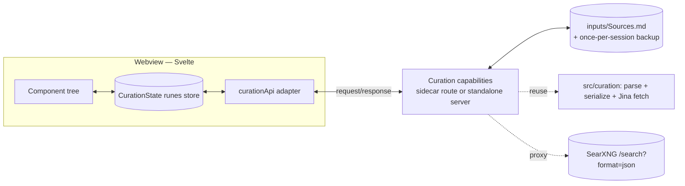
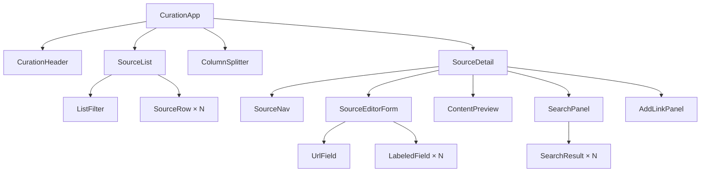
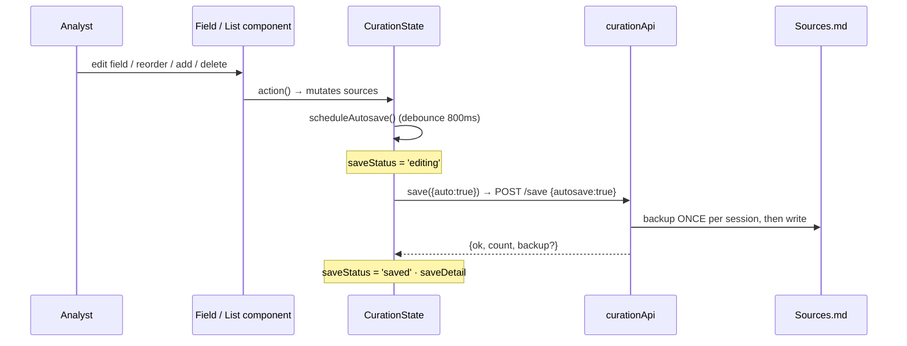
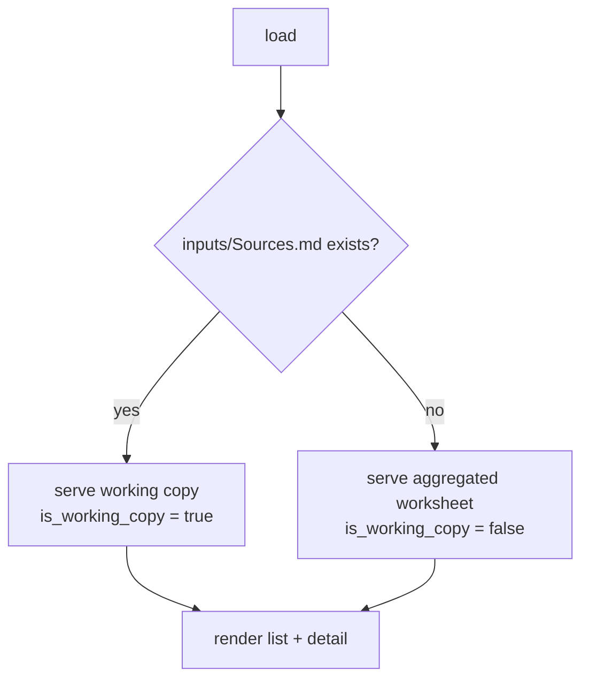
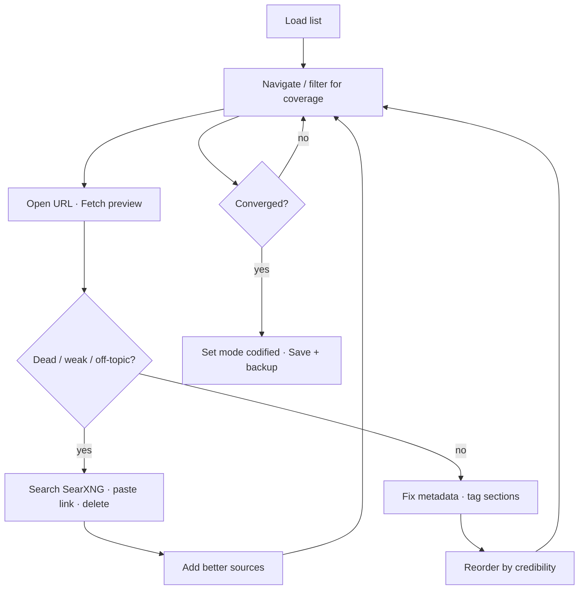

# The Source Curation Surface

A research analyst sits with a machine-generated list of ~60 web sources for a deal and has to converge it into a trustworthy, ranked set: open each link, fix its metadata, prune the dead ones, search for better ones, reorder by credibility, and save. The **reference implementation** of this surface already runs — a deliberately disposable single-file tool (`memopop-orchestrator/tools/curate_sources.py`, FastAPI + embedded vanilla JS), built and refined live against a real deal (humain / ImmuneCo). This spec captures **what that tool does, as a component-based architecture**, so the next build is a clean Svelte surface following the [[Per-App-Workspace-Conventions]] rather than a 700-line HTML string.

> **Why a spec now, not just "port it":** the single-file tool was the right shape for *discovering* the interactions. They've now stabilized enough to write down. This is the prep-mode artifact that lets the Svelte rebuild be component-first, testable, and ready to live inside memopop-native (or augment-it) as a real surface — and eventually behind chat verbs ([[In-App-Chat-Surface-for-Memopop-Native]]). The running tool is the behavioral oracle: when in doubt, match it.

## Scope

**In:** the full behavior of the current tool — load a `Sources(-aggregated).md`, navigate/filter/reorder a source list, edit per-source metadata, open URLs, fetch+preview content (Jina), search (SearXNG) and add results, paste arbitrary links, autosave with once-per-session backup, and persist a codified `inputs/Sources.md` (frontmatter + preserved body).

**Out (named in *Future* below):** streams / `stream-index.md` ([[Streams-and-a-Stream-Index-for-the-Curation-UI]]), per-source extracts ([[source-with-extracts-md]]), polling/freshness, chat-verb integration, multi-deal/global pools.

## Architecture overview

The surface is a **webview component tree over a thin capability/API layer**. In a memopop-native rebuild the four endpoints become FastAPI sidecar routes reached through the existing two-method `Transport` (`request()` for the verbs; no streaming needed here) — the key-holding/LLM-gateway invariant is irrelevant for this surface since it makes no model calls. As a standalone tool the same contract is served by a small server. Either way, **components never touch the filesystem; they call capabilities.**



## The data model

One source is the unit. The document wraps the source list with the frontmatter scalars and the human-authored body.

```ts
type Sensitivity = 'citable_externally' | 'internal_only';

interface Source {
  url: string;
  title: string;
  publisher: string;
  published_date: string;        // ISO date or ""
  sections: string[];            // deliverable-section tags this source serves
  rank: number;                  // 1 = primary; drives downstream hedge calibration
  sensitivity: Sensitivity;
  verdict: string;               // validator verdict, e.g. "HTTP 403", "verified-accessible"
  verdict_error: boolean;        // derived server-side: is the verdict a dead/blocked state
  note: string;                  // analyst rationale
}

interface CurationDoc {
  file: string;                  // path actually loaded
  is_working_copy: boolean;      // true = inputs/Sources.md (saved progress); false = pristine worksheet
  meta: Record<string, unknown>; // frontmatter scalars: mode, deal, firm, dates, curated_by, …
  sources: Source[];
  body: string;                  // markdown body: "How this list was built" / "Excluded" / "gaps"
}
```

**Invariants carried from the reference tool:**
- Parse from the *full* frontmatter (keep `title`/`publisher`/`published_date`), not the lossy loader.
- `verdict` is extracted even when it lives as a YAML *comment* in the worksheet, and written back as a real field.
- The body is preserved verbatim on every save.

## State — `CurationState` (Svelte 5 runes, class singleton)

Single source of truth, per [[Per-App-Workspace-Conventions]]. Components read `$derived` values and call actions; **no component mutates another's state directly.**

```ts
class CurationState {
  // raw state
  sources = $state<Source[]>([]);
  focusIdx = $state(0);
  listFilter = $state('');
  meta = $state<Record<string, unknown>>({});
  body = $state('');
  file = $state(''); isWorkingCopy = $state(false);
  mode = $state<'aggregated' | 'codified'>('aggregated');
  target = $state<'inputs' | 'inplace'>('inputs');
  saveStatus = $state<'idle' | 'editing' | 'saving' | 'saved' | 'error'>('idle');
  saveDetail = $state('');                 // e.g. "✓ autosaved 62 · backup made"
  columnWidth = $state<number>(360);        // px; persisted to localStorage

  // derived
  focused = $derived(this.sources[this.focusIdx] ?? null);
  filtered = $derived.by(() => filterRows(this.sources, this.listFilter)); // returns [{source, index}]
  errorCount = $derived(this.sources.filter(s => s.verdict_error).length);

  // actions (each that mutates sources schedules an autosave)
  load(): Promise<void>;
  setField(key: keyof Source, value: unknown): void;
  move(from: number, to: number): void;         // keeps focus on the same source object
  addBlank(): void;
  addFromResult(r: SearchResult): void;          // append, inherit focused.sections
  addLink(url: string): Promise<void>;           // append + Jina title fetch
  remove(): void;
  search(query: string): Promise<SearchResult[]>;
  fetchPreview(url: string): Promise<Preview>;
  save(opts?: { auto?: boolean }): Promise<void>; // auto=true → no per-write backup
  // private: scheduleAutosave() — debounced 800ms → save({auto:true})
}
```

**Autosave** is a debounced `$effect`-free method (explicit `setTimeout` is fine, or an `$effect` keyed on a `dirtyTick` counter). **Column width** persists via an `$effect` writing `columnWidth` to `localStorage`. Filtering is `$derived` — never mutate `sources` to filter.

## Component tree



### Component responsibilities

| Component | Responsibility | Reads (store) | Calls (actions) |
|---|---|---|---|
| **CurationApp** | Two-column grid + splitter layout; mounts children; owns `--listw` via `columnWidth` | `columnWidth` | `load()` on mount |
| **CurationHeader** | File label + working-copy badge, source count, error count, `mode` + `target` selects, save-status indicator, **Save + backup**, **Reload** | `file`, `isWorkingCopy`, counts, `mode`, `target`, `saveStatus`, `saveDetail` | `save()`, `load()` |
| **ColumnSplitter** | Drag to resize the two columns; clamp; persist | `columnWidth` | sets `columnWidth` |
| **SourceList** | Left column: filter + scrollable list + "showing N of M" | `filtered`, `sources.length` | — |
| **ListFilter** | Bound filter input (coverage check) | `listFilter` | sets `listFilter` |
| **SourceRow** | One row: error dot, title, meta (publisher · date · sections · `rank N`), ▲/▼ buttons, drag handle, drag-and-drop | row's `source`, `focusIdx` | `focusIdx=`, `move()` |
| **SourceDetail** | Right column container for the focused source; empty state | `focused` | — |
| **SourceNav** | prev / next / up / down / delete | `focusIdx`, `sources.length` | `focusIdx=`, `move()`, `remove()` |
| **SourceEditorForm** | Lays out the editable fields | `focused` | — |
| **LabeledField** | Reusable controlled field (text / number / select / textarea) with a label; emits change | value via prop | `setField()` |
| **UrlField** | URL as a **clickable link** by default; ✎ edit toggle → input; disabled when not http(s) | `focused.url` | `setField('url', …)` |
| **ContentPreview** | "Fetch & preview content (Jina)" → renders truncated markdown + provenance | — | `fetchPreview()` |
| **SearchPanel** | SearXNG query box + results; graceful "set SEARXNG_URL" notice | — | `search()` |
| **SearchResult** | One result (title, link, engine, snippet) + **add to sources**; marks ✓ added | — | `addFromResult()` |
| **AddLinkPanel** | Paste any URL → add (bare domain → https), Jina title auto-fetch | — | `addLink()` |

**Best-practice notes for the rebuild:**
- **Controlled fields, not scattered `bind:`.** `LabeledField` takes `value` + an `onChange` that calls `setField` → the store stays the single source of truth and autosave fires uniformly. (Two-way `bind:` to local copies is the anti-pattern that made the vanilla version's "is it saved?" confusion.)
- **`filtered` is `$derived`** returning `{source, index}` pairs so rows keep their *true* index for editing/reorder even while filtered.
- **Reorder keeps focus on the same source object** (`indexOf` after splice), and does **not** re-render the detail pane — only the list. Same discipline as the reference tool's `addFromResult`/`move`.
- **Adds append to the end and never steal focus** (so you can add several from one search) and inherit the focused source's `sections`.
- **Accessibility:** rows are keyboard-focusable; ▲/▼ are real buttons; URL is a real anchor (cmd-click works).
- **No prop-drilling:** provide the store via Svelte context (or a module singleton); children import it.

## Key interaction flows

### Autosave (the load-bearing UX fix)



### Load: prefer saved progress over the pristine worksheet



### The curation loop (the analyst's actual session)



## Persistence & API contract

Four capabilities. Request/response shapes are the contract the Svelte adapter codes against; the server reuses `src/curation` (parse, serialize, Jina) and proxies SearXNG.

| Capability | Request | Response |
|---|---|---|
| `sources.load` (`GET /api/sources`) | — | `CurationDoc` (working copy if present, else worksheet) |
| `sources.save` (`POST /api/save`) | `{ meta, sources, body, mode, target, autosave }` | `{ ok, written, backup\|null, count, mode }` |
| `search.run` (`POST /api/search`) | `{ query }` | `{ ok, results[] }` or `{ ok:false, reason }` (SearXNG off) |
| `content.fetch` (`POST /api/fetch`) | `{ url }` | `{ ok, title, via, markdown(truncated), … }` or `{ ok:false, reason }` |

**Serialization rules (must match the tool):** canonical per-source field order (`url, title, publisher, published_date, sections, rank, sensitivity, verdict, note`); top-level meta scalars preserved in order; body preserved verbatim; bare-date YAML values coerced to strings for JSON; **backup once per session on autosave, always on manual save.** Save **target** defaults to `inputs/Sources.md` (the convergence output), never overwriting the aggregated worksheet unless `target: 'inplace'`.

> When this surface lands inside memopop-native, prefer expressing the four as `entity.verb` capabilities (`sources.*`, `search.run`, `content.fetch`) on the workspace registry per [[Chat-As-Verb-Surface-Patterns]], so the same surface is later drivable from chat — but the REST shape above is a faithful v1.

## Acceptance criteria (parity with the reference tool)

1. Loads all sources from a working copy when present (else the worksheet), with a visible which-file indicator and error-verdict dots.
2. Resizable columns; width persists across reloads.
3. Per-source editing of every field; the URL is a clickable link with an edit toggle.
4. Reorder via per-row ▲/▼ **and** drag-and-drop; focus stays on the worked source.
5. Filter the list (title/publisher/url/section/note/verdict) with a `showing N of M` count.
6. Fetch & preview content (Jina); search SearXNG and add results; paste a link and add (title auto-fetched). All adds append without stealing focus and inherit the focused source's sections.
7. **Every mutation autosaves** (debounced) with a live status; backup made once per session; **Save + backup** forces a checkpoint and can set `codified` mode.
8. Saved `inputs/Sources.md` re-parses through the orchestrator's own loader (`is_codified` true when set) — i.e. the output is pipeline-consumable.

## Future (explicitly out of this spec)

- **Streams tab** + `stream-index.md` — [[Streams-and-a-Stream-Index-for-the-Curation-UI]].
- **Per-source extracts** (LFM `:::quote/:::claim/:::stat` in a body) — [[source-with-extracts-md]].
- **Chat-verb drive** — surface the capabilities as `sources.*` verbs in [[In-App-Chat-Surface-for-Memopop-Native]].
- A **ranking/classification schema** beyond manual order + `rank` (credibility tiers).
- Stream **polling/freshness** (unshipped tree-wide).

## Related

- Reference implementation: `memopop-orchestrator/tools/curate_sources.py` (the behavioral oracle).
- [[Sources-Curation-UI-Tool]] — the plan the tool was built from (memopop).
- [[Per-App-Workspace-Conventions]] — the runes-store / capability-registry conventions this follows.
- [[Source-Curation-Gate]] — the broader pattern this surface is one face of.
- [[sources-md-curation]] / [[source-with-extracts-md]] — the file conventions the persistence layer honors.
- [[Chat-As-Verb-Surface-Patterns]] — where the four capabilities go when this becomes a verb surface.
