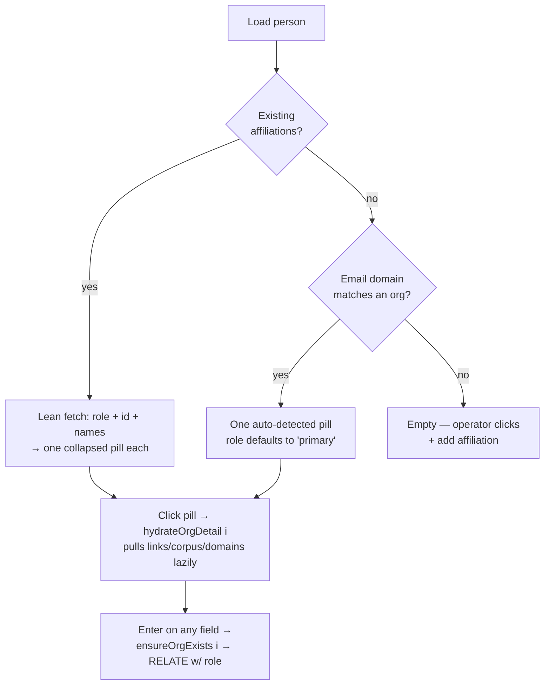

# Affiliations go many-per-person

## Why Care?

A person is not affiliated with *an* organization. They're affiliated with several, in different shapes, over time: the company that signs their paycheck, the two boards they sit on, the startup they advise, the place they used to be CFO. Yesterday's [[2026-06-16_01_Person-Enrichment-Surface-Ships-Pulse-Pattern-And-Auto-Detected-Orgs|person-enrichment surface]] modeled exactly one of those and called it "the org." Every operator filling out an attendee had to pick *which* affiliation mattered and drop the rest on the floor.

Tonight that single slot becomes a stack. The operator can add as many affiliations as the person actually has, give each one a role in plain words ("board", "advisor", "past CFO", "primary"), and that exact word lands on the `affiliations` graph edge so the relationship carries its own meaning. The org behind each card finds-or-creates the same way it always did — but now it also **autocompletes from canonical** as you type, so the fourth attendee from the same firm reuses the org row you already enriched instead of spawning a near-duplicate.

This is the difference between a contact database that says "works somewhere" and one that can answer "who in this room sits on a Stand Together board and used to run a fintech." We're building the second one.

## What's New?

- **Many affiliations per person.** The old single-org section (`OrgCreate`) is retired in favor of an open-ended list of **`AffiliationCard`** components. `+ add affiliation` appends a card; each renders collapsed as a `role · conventional_name` pill and expands to a full edit card on click.
- **Free-text role on the graph edge.** Each card's role string is written directly to `affiliations.kind` on the `RELATE`, replacing the hardcoded `"operator-confirmed"`. Empty role falls back to `"other"`. No dropdown — same flexibility ethos as link `kind`.
- **Org autocomplete + pick-existing.** Typing ≥2 chars into the complete-name field fires a debounced, sequence-guarded lookup (`lookupOrgs`) that matches `complete_name` / `conventional_name` / `slug` case-insensitively and returns up to 8 hits. Clicking one (`pickOrg`) fully hydrates the card and flips it to a RELATE-only save — no new org row.
- **Orgs own many email domains.** New `OrgDomain` type and **`DomainList`** sub-dimension: an org carries an array of `{ domain, kind }` rows. IHS gets both `theihs.org` and `ihs.gmu.edu`. Domain-based auto-detect now checks `domains.*.domain` first, then falls back to the old `org_links` / `org_corpus` domain scan.
- **Lazy per-org hydration.** Loading a person's existing affiliations does a *lean* fetch — just role + org id + names, enough for the pill. The heavy fields (`org_links`, `org_corpus`, `domains`) hydrate on first expand via `hydrateOrgDetail(i)`, idempotently. A person with a dozen affiliations still loads fast.
- **Defensive SurrealDB auth retry.** The WebSocket can drop on idle and auto-reconnect *without* re-signing in, so the next query comes back `Anonymous access not allowed`. `getDb()` now wraps `.query` to catch that one failure mode and retry once after a fresh signin/use. Real credential errors still bubble up.
- **Slugifier no longer mints "The…" duplicates.** `slugify()` now strips a leading `the ` so "The Institute for Humane Studies" and "Institute for Humane Studies" collapse to one slug — and one org row.
- **Three new scripts** turning the canonical layer into deliverables and cleaning up after the slug bug (below).

## How it Works

### The affiliation card, top to bottom

The state for one card lives in a single `AffiliationState` object (`lib/types.ts`) — the per-card identity (`uiId` for the `#each` key), UI state (`expanded`), the role string, the org id + name fields, the three org sub-arrays, and the two booleans that used to be component-level globals: `affiliationCreated` (guards against duplicate edges) and `autoDetectedFrom`.

That last move is the structural heart of the change. Yesterday those were three top-level `$state` values — fine when there was one org. To go many-per-person they had to move *inside* each card's state, and every saver in `App.svelte` grew an `i` parameter naming which affiliation it's committing:

```
ensureOrgExists(i)      appendOrgLink(i, link)
appendOrgCorpus(i, …)   appendOrgDomain(i, domain)
```



### Autocomplete that doesn't race

The lookup is debounced *and* sequence-guarded. Each keystroke schedules a timer and bumps a monotone `lookupSeq`; when a response lands, it's dropped unless its seq is still the latest. So a slow query for "Inst" can't clobber the fresh results for "Institute" — the classic autocomplete race, closed.

### Auth retry, precisely scoped

The retry only fires on `NotAllowedError` / `Anonymous access not allowed`. Anything else — wrong password, malformed query — throws straight through. After one fresh `signin` + `use`, it retries the original query exactly once; a second failure propagates. Narrow on purpose: we want to paper over the reconnect gap, not mask real auth problems.

## The scripts

| Script | What it does |
|---|---|
| `export-event-attendees-csv.mjs` | Flat, one-row-per-person CSV of **every** attendee — name, emails, affiliations (org + role), LinkedIn, links, corpus. The raw roster, blanks left blank, for a client to sort/filter in Sheets. |
| `export-event-briefing.mjs` | Operator-style markdown briefing for one event — honest about gaps (unfindable bucket, named-but-no-affiliation bucket) so the team knows what to chase next. |
| `surreal-merge-ihs-duplicate.mjs` | One-shot, idempotent consolidation of the duplicate "The Institute for Humane Studies" row into the canonical one — copies `org_links`/`org_corpus`/`domains`, re-RELATEs every affiliation edge, stamps `merged_from_dup` for audit, deletes the orphan. Cleans up the data the slug bug already created. |

## Also captured: a pattern, not yet built

`context-v/explorations/Forced-One-By-One-Tag-Selector.md` names a reusable pulse-dimension that surfaced at the end of the session: a tag selector that forces **one (tag, entity) decision at a time** instead of a bulk checkbox column, because bulk-tick produces lazy, half-considered tags. First concrete instance is a "high-value under-the-radar lead" flag on the worklist; abstracted to instantiate with any tag set + entity ref + onApply callback. Drafted, not implemented — flagged as the next pulse-dimension to build.

## What's Next

- Build the forced one-by-one tag selector from the exploration.
- The slug fix prevents *new* "The…" duplicates; run `surreal-merge-ihs-duplicate.mjs` against any that already exist beyond IHS.
- Affiliation edges now carry meaningful roles — the query lenses that exploit them ("who advises and used to be a founder") are the payoff still to wire up.
