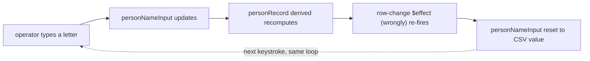

## Why Care?

`person-db-resolver` [[2026-07-07_03_Person-DB-Resolver-A-Sibling-Remote-For-People-Not-Orgs|shipped earlier tonight]]
with the right shape — person and org as independent match-or-create
decisions — but the first live click-through against real FreedomFest 2026
records surfaced two dead ends: the person-name input looked editable but
reset itself after every keystroke, and the "add observation" button stayed
disabled unless you typed something into a `predicate` field the UI never
explained. Both are fixed now. The **Improve a CSV of People** flow is at
basic-functioning: an operator can run a real record through match/create/
skip for both person and org, and leave a note, without fighting the form.

## What's New?

- **The person-name field is actually editable.** A CSV's mapped name column
  isn't always what should get written — a "Lyn" needs to become "Lynette
  Ulbricht," a title needs trimming out of a name column. That's now a real
  input, not a read-only echo of the mapped value.
- **Observations no longer require a predicate.** The form asked for
  `predicate` + `value` with no explanation of what a predicate even was;
  half the time the operator just wants to jot a note. The value field alone
  now unlocks the button — `predicate` is optional and defaults to `note`.

## The Story

The name-field bug was the interesting one. It didn't fail loudly — the
input rendered, accepted keystrokes, and then silently reverted to the
CSV's original value on every single one, making it look broken rather than
explaining why.

The cause was a feedback loop hiding inside Svelte 5's fine-grained
reactivity. The effect that resets the name field when the operator moves to
a new record also kicked off the person-candidate search — and that search
function read a `$derived` value (`personRecord`) that itself read the very
input the effect was about to reset. Svelte's dependency tracking doesn't
care where in a function body a read happens, only that it happened during
the effect's synchronous execution — so that one transitive read got
attributed to the row-change effect, not to the keystroke that actually
should have triggered it. Every keystroke re-ran the row-change effect,
which reset the field it was just typed into.

The fix: split the one function that read `personRecord` into two. The
row-change effect now calls `loadPersonCandidatesFor(rec)`, which only ever
touches the plain `record` the effect is already watching — no transitive
read of the input. A separate `loadPersonCandidates()` (no arguments) is
wired to the input's own `onchange`, where reading `personRecord` is exactly
what should happen. Same split applied to the org-name input, which had the
identical latent bug waiting to bite the next person who typed into it.

## What's Next

Basic-functioning isn't done-functioning — the flow still doesn't
retroactively `RELATE` an affiliation if the org gets resolved before the
person on the same row (documented as an open question in the prior entry).
The next real step, per
[[../context-v/plans/SurrealDB-MCP-Plus-Skill-for-Canonical-Layer-Verification|the SurrealDB MCP + verification-skill plan]],
is standing up direct query access to the canonical layer so tonight's
FreedomFest batch (and every batch after it) can be checked for coherence
without another disposable Node script.

## Related

- [[2026-07-07_03_Person-DB-Resolver-A-Sibling-Remote-For-People-Not-Orgs]] — the remote this flow lives in
- `context-v/plans/Person-Aware-Canonical-Resolver-Extension.md` — the design this implements
- `context-v/plans/SurrealDB-MCP-Plus-Skill-for-Canonical-Layer-Verification.md` — the next step
