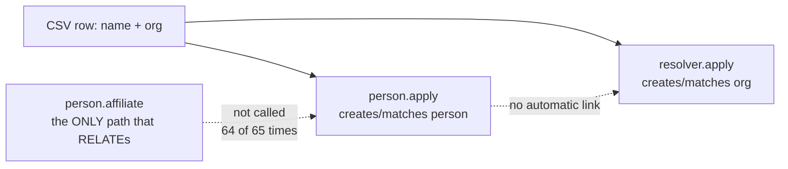

## Why Care?

The person-db-resolver work from earlier tonight
([[2026-07-07_03_Person-DB-Resolver-A-Sibling-Remote-For-People-Not-Orgs]],
[[2026-07-07_04_People-CSV-Flow-Goes-From-Wired-Up-To-Actually-Usable]])
wrote real data into the canonical layer, and the natural next question —
"did it actually land right?" — used to mean writing a fresh throwaway
script every time. That's now a solved problem: SurrealDB Cloud is directly
queryable from Claude Code, and the first thing that query access surfaced
is a real gap worth knowing about before it compounds across more events.

## What's New?

- **The `surrealdb` MCP server is live**, project-scoped in `.mcp.json`,
  running the official `surrealmcp` via Docker
  (`surrealdb/surrealmcp:latest`) — no submodule, no build step. A wrapper
  script (`scripts/mcp-surrealdb.sh`) sources `.env` from its own location
  rather than depending on the launching shell already having `SURREAL_*`
  exported, since that's not this repo's habit.
- **A companion skill** (`surrealdb-canonical-layer`, in the lossless-skills
  tree) carries the schema knowledge and the verification discipline going
  forward — most importantly, that client tagging has to be checked
  explicitly per row, never inferred from a query that already filters by
  client.
- **First real verification pass, on tonight's FreedomFest 2026 batch:**
  - **Client tagging: clean.** All 65 `persons` rows and 40 `organizations`
    rows created tonight carry `client_access: ["reach-edu"]` correctly —
    including on the re-check that deliberately didn't filter by client
    first, which is the check that would catch a row created without the
    tag.
  - **Person↔org affiliation: mostly missing.** Only Ethan Akimoto (the
    very first hand-test) has an actual `affiliations` edge. The other 64
    people resolved through the batch run have `has_name` + `speaker_at`
    observations but no edge to an org — even though 39 more organizations
    got independently created/matched in the same run. Org and person got
    resolved as two disconnected actions per row.
  - **A duplicate-row finding, new tonight:** "Ethan Akimoto" and "Rudolfo
    Beltran" each have two separate `persons` rows, and "Lt Gov Stavros
    Anthony" / "Stavros Anthony" look like the same person split by
    title-stripping. Candidate matching should have caught these.

## The Story

The affiliation gap isn't a surprise, exactly — the prior changelog entry
already named the open question ("an org resolved before its person is
resolved doesn't retroactively RELATE"). What direct query access adds is
the actual *scale* of it: not a theoretical edge case, but 64 out of 65
people in a single batch. Timestamps make the mechanism visible — "Lt Gov
Stavros Anthony" (person, 09:01:27) and "State of Nevada" (org, 09:01:22)
were created five seconds apart, clearly the same operator pass through the
same CSV row, and still no edge connects them.



Without a query surface, this would have stayed invisible until someone
went looking for a specific person's org in the UI and found nothing. With
one, it's a known, scoped, three-sentence finding instead of a surprise
discovered piecemeal later.

## Under the Hood

`.mcp.json`:

```json
{
  "mcpServers": {
    "surrealdb": {
      "command": "${CLAUDE_PROJECT_DIR:-.}/scripts/mcp-surrealdb.sh"
    }
  }
}
```

`scripts/mcp-surrealdb.sh` sources `.env` relative to its own path
(`$(dirname "${BASH_SOURCE[0]}")`), not `$PWD`, so it works regardless of
where a Claude Code session was started — and independent of whether the
launching shell happens to have `SURREAL_*` exported, since Claude Code's
`${VAR}` expansion in `.mcp.json` reads only the launching shell's
environment, never `.env` files directly.

**Still full read-write, not scoped down.** The Docker container runs with
the same credentials the app services already use, and `surrealmcp`
additionally exposes SurrealDB Cloud instance management (create/pause/
resume) — more capability than a verification connector needs. Flagged in
the skill as a standing caution, not yet resolved with an actual scoped
role.

## What's Next

- Not fixing the People-CSV UI right now — this pass was diagnostics first,
  iteration later, per the user's explicit call.
- When UI iteration resumes: the affiliation-gap question (does org-first
  resolution need a retroactive RELATE step, or is "resolve person before
  org" just the documented right order?) and the duplicate-person question
  (why did candidate matching miss Ethan Akimoto and Rudolfo Beltran the
  second time through) are both live threads to pick up.
- A scoped read-only SurrealDB Cloud role, before this MCP connection
  becomes routine infrastructure rather than an occasional tool.

## Related

- [[2026-07-07_04_People-CSV-Flow-Goes-From-Wired-Up-To-Actually-Usable]] — the flow this batch ran through
- `context-v/plans/SurrealDB-MCP-Plus-Skill-for-Canonical-Layer-Verification.md` — the plan, updated with these findings
- `context-v/skills/surrealdb-canonical-layer/SKILL.md` (lossless-skills repo) — the shipped skill
