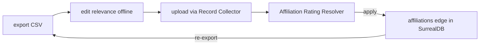

## Why Care?

`context-v/specs/Augment-From-Affiliations.md` shipped as a design doc
earlier tonight. This entry is the doc becoming a real, clickable screen —
new capability, new microfrontend, a live write against the actual
FreedomFest 2026 batch, and (per the operator's own call) a fresh "Rate
Affiliations" entry in the shell's Flow picker.

## What's New?

- **`affiliation.rate` capability** — `services/record-surrealdb-resolver/src/person-resolver.ts`,
  registered end to end through `person-handlers.ts` and
  `services/workspace/src/capabilities.ts`. Given `(person_uuid, org_slug,
  relevance, relevance_note)`, looks up the live `affiliations` edge fresh
  and writes the rating. Validates the five allowed relevance labels
  (`Very Relevant` / `Highly Relevant` / `Relevant` / `Skip` / `Irrelevant`)
  case-insensitively and **throws on anything else** rather than coercing —
  confirmed live via three NATS-level test calls (a real write, an
  unrecognized-value rejection, a no-matching-edge rejection).
- **`scripts/export-affiliation-ratings-csv.mjs`** (new) — one row per
  `affiliations` edge for a given event, not one row per person (a person
  with two orgs gets two independently-rateable rows). Confirmed against
  live data: 61 affiliations for `freedomfest-2026`.
- **`apps/affiliation-rating-resolver`** (new remote, port 3012) — reimport
  the edited CSV through Record Collector, confirm the column mapping,
  then apply ratings one row at a time or all at once. Registered as its
  own **"Rate Affiliations"** entry in the shell's Flow picker
  (`recordCollector` → `affiliationRatingResolver`), not just a
  reachable-by-navigate extra.
- **`person-enrichment`'s event lock-in removed.** It was hardcoded to one
  event (`2026-05-21-turning-jobs-into-degrees`) and its worklist only
  showed people missing a `full_name` — both assumptions specific to the
  Gatsby-invite person shape. FreedomFest speakers (`person-db-resolver`-
  sourced, `.name` field, no `full_name`) would have shown up as a
  permanently-empty worklist or a broken form. Fixed: event picker, the
  attendee query no longer filters by a fixed predicate allowlist (any
  observation pointing at the event counts), the worklist is every
  attendee not just unnamed ones, and the UI falls back to `.name` when
  `full_name` is absent.

## The Story

Every step of getting this actually working in a browser surfaced a real
bug, not a cosmetic one:

- The reimport resolver never picked up a fresh upload from Record
  Collector — missing the `augment-it:active-record-set-changed` listener,
  the *exact* bug class `record-db-resolver` already hit and fixed once.
  Should have copied that the first time.
- The Flow-step picker was a bare numbered circle with a hover-only
  tooltip — real usability gap, not specific to this flow. Added a visible
  text label next to the number.
- The column-mapping screen had no way to back out to a different record
  set once opened, which is exactly how an operator gets stuck staring at
  the wrong CSV's columns wondering where `person_uuid` went. Added a
  "wrong file? pick a different record set" link plus a loud warning when
  the loaded file has neither `person_uuid` nor `org_slug` at all.
- Restarting one dev server by killing its port turned out to kill the
  *entire* `pnpm --parallel` batch it belonged to (pnpm's fail-fast
  default), taking the whole shell down twice. Lesson: don't surgically
  restart a member of a batch — restart the batch.

## What's Next

Real gap flagged by the operator after seeing the screen live: this
surface only rates — it doesn't yet let the operator add canonical links
or corpus content inline, the way `record-db-resolver` /
`person-db-resolver` let you edit a record in place. The spec currently
routes that work to `person-enrichment` as a separate screen; whether that
split holds up against how the operator actually wants to work it is an
open question being revisited now.

## Related

- `context-v/specs/Augment-From-Affiliations.md` — the spec this implements
- `context-v/plans/Person-Aware-Canonical-Resolver-Extension.md` — the
  affiliation schema this writes onto
