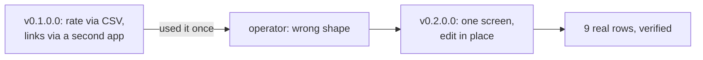

## Why Care?

Ship, use, learn, fix — same day. `apps/affiliation-rating-resolver` went from spec to a live screen to real operator feedback to a real architecture reversal to a verified working milestone, all in one session. The version that actually stuck looks different from either draft: not the original all-in-one worklist, not the CSV-only split — a per-affiliation screen where relevance, links, and corpus content all get edited in the same place, because that's what using the first version revealed the job actually is.

## What's New?

- **The screen now edits, not just rates.** Relevance is an editable dropdown + note field, pre-filled from a CSV import but changeable right there. Below it, four sections — person links, person corpus, org links, org corpus — each showing what already exists and a one-line add form for what's missing.
- **Five new capabilities**, all through the same NATS-gated discipline every other write in this app uses:
  - `affiliation.detail` — fetches the *current* canonical state (not a stale CSV snapshot) whenever the operator lands on a row.
  - `person.links.add` / `person.corpus.add` — single-entry additive writes to `persons.personal_links` / `personal_corpus`.
  - `organization.links.add` / `organization.corpus.add` — the org-side siblings, narrower than `resolver.apply`'s whole-record batch path.
- **9 real rows, worked end to end and verified.** John Goodman, Marc Lichtenfeld, Tim Van Milligan, David T. Phillips, Peter Lipsett, Alexander McCobin, and Ahmed Mousa all got real relevance ratings with real reasoning notes and real canonical links/corpus pulled from actual research — not test data. Rand Paul and Jessie Markell got links/corpus added with a rating still pending. Every one of these checked out correct on direct query against SurrealDB: right values, right client tagging, right actor attribution.

## The Story

The reversal came from watching someone actually try to use v0.1.0.0: "you're supposed to give me the kind of UI that's in record-db-resolver — I'm supposed to be able to edit the record and add links." That's a different shape than the CSV-round-trip-plus-a-separate-app split the earlier draft settled on. The fix wasn't a patch — it meant reviving capabilities cut from the very first draft (`person.links.add` etc., dropped in v0.0.0.2 in favor of routing through `person-enrichment`) and building them properly this time, gated the same way as everything else instead of `person-enrichment`'s direct-SurrealDB pattern.

Along the way: a query that accidentally swept the entire pre-existing 882-person `humain-vc` dataset while trying to verify just tonight's work (a scoping mistake caught and corrected, not a data problem), and a stale-browser-tab scare where a screenshot showed an old error message and placeholder text even though a direct database query confirmed every single edit had landed correctly — the fix was a hard refresh, not a data recovery.

## What's Next

Rand Paul and Jessie Markell still need their ratings applied (links/corpus already saved). The known duplicate-person rows (Ethan Akimoto, Rudolfo Beltran) from earlier tonight are still on the list, untouched by this work. The CEO-brief export that turns rated affiliations into something shareable is still the next real spec, now with real rating data to design against instead of guesses.

## Postscript (2026-07-08)

Three loose ends closed the morning after, before merging `feature/augment-affiliations` into `rebuild/turbo-rsbuild`:

- **The relevance-dropdown pre-select bug**, found immediately after this milestone, is fixed in `965173e`: the stored value is snake_case (`highly_relevant`) but the `<option value>` was the Title Case label, so a previously-rated row's dropdown rendered blank on reload even though the rating had saved correctly. Fixed at the root — `normalizeRelevance` now accepts its own snake_case output, and the dropdown carries the machine value explicitly.
- **The on-disk CSV was stale.** The only `affiliation-ratings.csv` in the repo was a 17:53 export that predated most of this night's live-edit work — reloading it would have shown 3 rated rows, not 57. Re-ran `scripts/export-affiliation-ratings-csv.mjs` fresh against SurrealDB and committed the current snapshot (57 of 61 rated) plus the branded HTML/PDF relevance report generated the same night, in the `reach-edu` submodule (`6490adc`) — the 61-row rating pass now has a durable artifact, not just live DB state.
- **The spec is updated to `status: Shipped`, MVP confirmed**, with a "Next desired features" section naming what's deferred: observation visibility/editing in the same screen, and concurrent updates across persons/organizations/observations.

## Related

- `context-v/specs/Augment-From-Affiliations.md` — now at v0.2.1.0, MVP confirmed
- [[2026-07-07_06_Augment-From-Affiliations-Initial-Build-Live-Rating-Loop-Working]] — the v0.1.0.0 entry this one reverses part of
