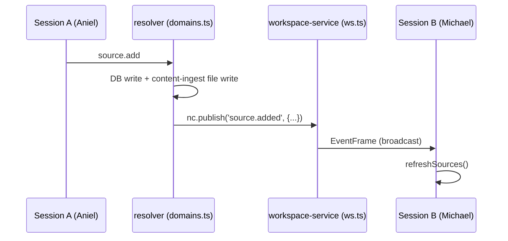

## Why Care?

Flow 1's whole point is two people working the same thesis corpus side by side. Without this step, "Aniel adds a link → Michael's screen updates" required a manual refresh — fine solo, friction the moment two people are actually in the room together. Step 6 closes that gap the cheap way: broadcast-to-all-sessions within one tenant, no presence, no cursors, no CRDTs — just an event and a refetch.

## What's New?

- **Six mutations now broadcast on commit**: `domain.created`, `domain.retyped`, `source.added`, `source.updated`, `source.removed`, `extract.added`. All owned by `services/record-surrealdb-resolver/src/domains.ts`'s `registerDomainHandlers` — the single service that already runs each mutation's full DB-plus-filesystem lifecycle, so it's the one place that actually knows a mutation succeeded before announcing it. Payload carries the domain/source slugs, `client_slug` (or `client_slugs` for retype, which can span clients), and `actor`.
- **`services/workspace/src/ws.ts`** forwards those six subjects to every connected session alongside the existing `record_set.*` / `prompt.*` / `response.*` / `workspace.active.changed` broadcasts — no new plumbing needed there, just six more subject strings.
- **`apps/strategy-curator/src/App.svelte`** watches `workspace.events`, dedups by `seq` (record-collector's App.svelte set this precedent — a naive `$effect` re-fires on every reactive dependency, not just new events), and calls `loadStrategies()` for domain events or the new `refreshSources()` for source/extract events — scoped to the viewer's active client + domain so a broadcast from someone else's workspace or thesis is a no-op.
- **`refreshSources()`** is new on the curator's state singleton: re-fetches the active domain's sources without resetting focus or the tag vocabulary, unlike `select()` (the user-driven "switch domain" path, which resets both on purpose).

## The Story

Verifying this without two literal browser windows: added a `LIVENESS=1` mode to `scripts/prove-didi-auth.mjs`, following the same pattern as step 3's `GATE=1` and step 4's `ATTRIBUTION=1`. Two independently-authenticated WS sessions open against the live local stack — session A invokes `domain.create` then `source.add`; session B, which never invokes anything, is asserted to receive the `domain.created` and `source.added` broadcast frames with matching payloads, no polling. Both passed against `docker compose`'s live `workspace-service` + `record-surrealdb-resolver` containers (rebuilt for this change). Test domain and source cleaned up from SurrealDB and the humain-vc filesystem afterward — same discipline step 4 established.

`apps/strategy-curator` (`svelte-check`) and both touched services (`tsc --noEmit`) are clean.

## What's Next

Step 7 — instance posture + sign-in wall: when the workspace-service reports `DIDI_AUTH=required` and the session has no `didi_id`, the shell should render the sign-in panel as a full pre-auth wall instead of mounting remotes, and hide the WorkspaceSwitcher when the instance is pinned to one client.

## Related

- `context-v/plans/Build-Order-Humain-VC-Unlock-Flow.md` — Step 6, now done
- `context-v/plans/Unlock-Humain-VC-Team-Access-To-Augment-It.md` (ai-labs level) — the scope of record, item 8
- `context-v/specs/Workspaces-as-Tenant-Primitive.md` — the tenant-aware envelope Step 4's actor attribution and this step's broadcasts both build on
