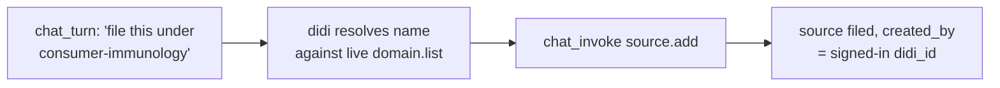

## Why Care?

Flow 1's fifth job is "DiDi assists" — the operator says "file this under consumer-immunology" and it just happens, attributed correctly, without a second click. Today that became real, and didi stopped being a generic "in-app assistant" with no face and became a character — the same one that'll eventually show up in dididecks and memopop too, just scoped to augment-it for now.

## What's New?

- **A persona.** `services/workspace/src/chat.ts`'s system prompt now introduces didi by name, states both of its jobs (enrichment + corpus curation), and is explicit that it's scoped to augment-it only — no cross-service claims, matching the [[Didi-sh-One-Login-One-Agent-Three-Services]] exploration's near-term posture (one shared persona *concept*, independent per-app runtimes, no shared code yet).
- **Curator verbs, chat-invokable.** New `CURATOR_CHAT_VERBS` slab wires `source.add`, `domain.create`, `extract.add`, and `tag.apply` into the same three-mode (answer/propose/invoke) discipline the enrichment verbs already use. A new live `existingCorporaSlab()` runs a `domain.list` read on every turn and hands didi the workspace's real corpora as `Title → type:slug` — so "consumer-immunology" resolves against what's actually there, never a guess.
- **The `inbox-curation` agent-skill**, `context-v/agent-skills/inbox-curation/SKILL.md` (the `decile-hub-interface` format precedent): the full decision tree — named + existing corpus → invoke directly; new corpus → propose first; unclear → propose-or-park — plus the never-fabricate-an-identifier rule and the boundary with `corpus.inbox.add` (untriaged parking, not filing).
- **A face.** The character headshot (transparent PNG, user-provided) composited with the shell's actual `--color-accent`/`--color-accent-2` tokens as a soft brand-duotone gradient — picked from four generated candidates. Cropped at higher resolution from the full character sheet than the original headshot alone offered. Now showing in `DidiBadge`, `SignInWall`, and the chat rail's own header ("didi · augment-it · \<status\>").

## The Story

The acceptance line for this step was always going to be the real test: "didi, file this link under consumer-immunology" typed into a live chat turn, with nothing hand-waved. Ran it against the actual local stack — didi correctly resolved the thesis name from the live corpora list, chose `chat_invoke` (not a proposal, since the corpus was named explicitly — exactly the discipline the skill doc describes), and the source landed in `thesis:consumer-immunology`, `created_by` matching the signed-in didi_id. Verified again in the browser itself: didi's very first greeting lists the workspace's three real corpora by name, pulled from the same live slab a curious operator would see if they asked "what corpora do I have?"

The character art took its own small detour — four background treatments generated against the shell's real theme tokens (solid dark, brand duotone, copper glow echoing the glasses' gears, and a punchier single-accent glow), reviewed side by side before picking brand duotone, then re-cropped from the high-resolution character sheet rather than the smaller original headshot for a crisper result everywhere it's used.

## What's Next

Steps 1–8 of the build order are now done. What's left is the deploy tail — Step 9 puts augment-it on the prepped DigitalOcean droplet, single-tenant for humain-vc.

## Related

- `context-v/plans/Build-Order-Humain-VC-Unlock-Flow.md` — Step 8, now done
- `context-v/agent-skills/inbox-curation/SKILL.md` — the new skill
- [[Didi-sh-One-Login-One-Agent-Three-Services]] (ai-labs level) — the cross-service vision this step is the augment-it-local first slice of
- [[2026-07-08_02_Pre-Auth-Sign-In-Wall-The-Anonymous-Visitor-Gap-The-Session-Frame-Couldnt-Close]] — Step 7, landed just before this one
