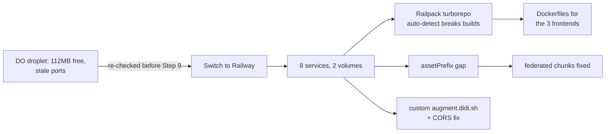

## Why Care?

The humain-vc flow needed a real, hosted URL — everything before this was local. It's live now: `https://augment.didi.sh`, single-tenant, behind the same didi.sh sign-in wall proven locally, with the cookie actually shared across the `.didi.sh` domain for real. Getting there meant switching platforms mid-plan and finding four real bugs that only exist once code leaves localhost.

## What's New?

- **augment-it is live at `https://augment.didi.sh`.** 8 services on Railway (`nats`, `workspace-service`, `record-surrealdb-resolver`, `content-ingest`, `prompt-runner`, `shell`, `strategy-curator`, `chat`), one project, verified with headless-browser checks against the real deployed URLs — anonymous visitor gets the full sign-in wall, zero unexpected console errors.
- **Platform: Railway, not the prepped DigitalOcean droplet.** Re-checked the DO box's live numbers before starting Step 9 and found ~112MB free RAM (before running anything of ours) and a leftover `coolify-proxy` container still squatting on ports 80/443 — the "prepped, ready to go" state from three days earlier had drifted. Given very few users and Railway's closer match to this repo's actual multi-service docker-compose shape, switched platforms rather than patch the drift.
- **Custom domain, cookie-correct.** `augment.didi.sh` (shell) and `ws.augment.didi.sh` (workspace-service — the one every federated remote connects to directly) both live under `*.didi.sh`, required for the `didi_session` cookie to actually attach. `id-didi-sh`'s production CORS allowlist — which turned out to have been silently empty since it first deployed, never surfaced until something tried to call it cross-origin — now includes `https://augment.didi.sh`.

## The Story

Four real bugs surfaced by actually deploying, none of which local dev would ever catch:

1. **Railway's Railpack builder auto-detected this repo as a turborepo** (`turbo.json` exists at root) and ran the root `pnpm build` script unconditionally for every frontend, ignoring per-service build-command overrides. `turbo` was never an actually-installed binary here — `dev.sh`'s own comments already knew this. Fixed by giving `shell`, `strategy-curator`, and `chat` their own Dockerfiles, matching the pattern already proven for the four backend services.
2. **A Docker `ARG` that's declared but never passed resolves to an empty string, not `undefined`** — `?? default` doesn't catch it. Caught locally (deliberately docker-built before pushing) as `TypeError: object null is not iterable` deep in rspack's Module Federation code — an empty remote URL, not a missing one. Switched four `??` fallbacks to `||`.
3. **Federated sub-chunks need their own `output.assetPrefix`, not just `dev.assetPrefix`.** Without it, `chat`'s and `strategy-curator`'s async chunks resolved as relative paths against the shell's origin instead of their own — 404ing into the shell's SPA-fallback HTML, which the browser then tried to `eval` as JavaScript (`SyntaxError: Unexpected token '<'`). This one only reproduces cross-origin; local federation dev never surfaces it. Found via a live browser check against the actual deployed `augment.didi.sh`, not a local test.
4. **`nats-server` genuinely does not accept `-max_payload` as a CLI flag** (this repo's own `nats.conf` comment already knew that, from months back) — needed an inline-generated config file, and the first attempt (`printf` with embedded `\n` escapes) corrupted somewhere across the Railway CLI → GraphQL → container `sh -c` chain. The fix that survived: a `echo` per line, no embedded newline escapes at all.

Also hit and worked around: Railway's CLI `environment edit --service-config` (dot-path form) silently no-ops in the version used this session — switched to the JSON-patch form, which works reliably. `railway volume add` panics outright — created volumes via a direct GraphQL mutation instead.

## What's Next

Step 12 — the dress rehearsal. Two things still open: Aniel's membership still isn't seeded on prod (his address was never confirmed, carried over from Step 2), and nobody has completed an actual human sign-in against `augment.didi.sh` yet — `id.didi.sh`'s dev-token echo is deliberately off in production, so this genuinely needs a person clicking a real magic-link email, not another script. Step 11 (corpus sync to R2) needs a Railway-native redesign before it's real — the plan as written assumed a DO box's filesystem a cron job could rclone from directly.

## Related

- `context-v/plans/Build-Order-Humain-VC-Unlock-Flow.md` — Steps 9-10, now done (revised in place — was DigitalOcean, now Railway)
- `context-v/plans/Unlock-Humain-VC-Team-Access-To-Augment-It.md` (ai-labs level) — item 4, "Deploy augment-it single-tenant"
