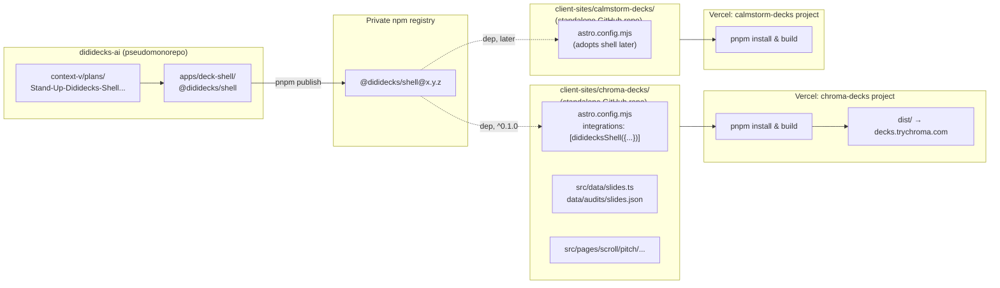
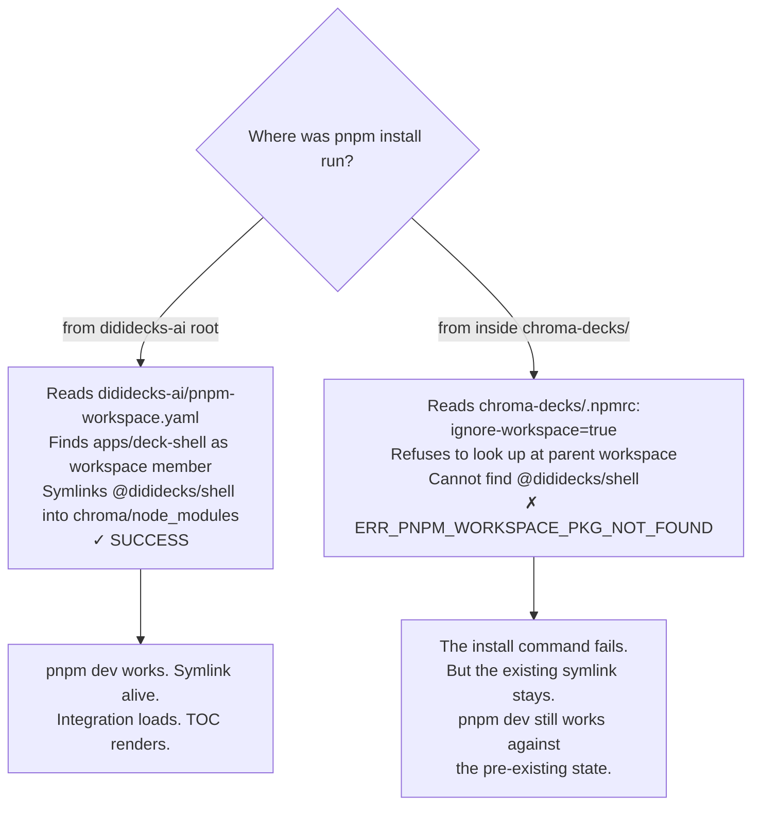

# `@dididecks/shell` ships — the first cross-client capability in the pseudomonorepo

## Why Care?

If you are building a family of client-facing sites that all share the same
shape — slides, navigation chrome, a way to rank and iterate content with the
people writing it — you eventually have to decide where the shared chrome
*lives.* DidiDecks's answer used to be "in each repo, copied." That answer
broke today: there are now three live engagements (`calmstorm-decks`,
`chroma-decks`, `reach-edu-hub`) and the cost of changing a single shared
behavior had become "edit it in N places, hope you found them all."

The fix: a single Astro integration published to a private package registry.
Each client-site installs it as one dep; the dep injects every shared route,
every shared layout, every shared API. Client-sites stay standalone repos
that deploy to their own Vercel projects. The chrome travels through the
package registry, not through copy-paste.

Today shipped the **first slice** of that pattern — the chrome a founder
needs to rank their own slides and decompose the ones they want to recreate
non-destructively. That sliver is small on purpose. It's the proof the
architecture works end-to-end before we lift bigger surfaces (the `/play`
runtime, auth + telemetry, the export pipeline) into the same package.

If you're a Lossless contributor or a client iterating with us on a deck, the
practical thing that changed: **`/toc/[deckSlug]/[variantSlug]/`** is now a
real route. Open it in `pnpm dev`, click the rank pills, click `scaffold`,
watch an empty per-slide file appear in your working tree. That's the
Phase 1 → Phase 2 transition from the `deck-iteration-workflow` skill, with
the friction removed.

## What's New?

- **A new package: `@dididecks/shell`** at `dididecks-ai/apps/deck-shell/`.
  Astro 6 integration, pnpm-managed, scoped, restricted publish access
  (publish itself blocked on an org-name decision — see *What's Next*).
- **Three injected routes** — the integration adds them to any consuming
  client-site via `astro:config:setup`:
  - `/toc/[deckSlug]/[variantSlug]/` — TOC with per-slot rank pills and a
    conditional `scaffold` button (static at build, hydrates dev mutations
    via fetch).
  - `/api/slide-rank` — GET registry, POST upsert. Dev-only
    (`prerender = false`).
  - `/api/slide-decompose` — POST writes an empty per-slide stub at the
    canonical path; refuses to overwrite (409). Dev-only.
- **Chroma is the first consumer.** `client-sites/chroma-decks/` registers
  the integration in `astro.config.mjs`, adds a hand-authored
  `src/data/slides.ts` slot registry for the 16-slot `enhanced-v3` variant,
  and initializes `data/audits/slides.json` with the new composite-key shape
  `{deckSlug}/{variantSlug}/{slot}`.
- **The Phase 1 → Phase 2 bridge is operational.** Rank a slot as
  `urgent-redo` (or `non-urgent-could-be-better`) and the `scaffold` button
  becomes clickable; a click writes
  `src/components/slides/{variant}/{slot}-{slug}.astro` as an empty stub. The
  single-page variant keeps rendering unchanged.
- **The plan and the exploration both updated.** A new plan
  `Stand-Up-Dididecks-Shell-and-Ship-Chroma-TOC-Ranking.md` executes Phase A
  of the exploration; the exploration's resolution section now matches the
  Path A architecture (workspace-scoped pnpm + standalone Vercel projects).
- **One concrete behavior change to the framework's pnpm posture:** the
  discipline is pnpm-strict in **dev**; on Vercel we let the platform
  auto-detect from the committed `pnpm-lock.yaml`. The plan and a new
  feedback memory both capture this.

## The Story

### Where it started — three engagements, no shared module

The exploration document from earlier today
([[../context-v/explorations/Chroma-Parity-and-the-Path-to-a-Shared-Deck-UI-Module]])
walked four options for how to close the parity gap between calmstorm-decks
(~40 UI feature-surfaces) and chroma-decks (almost none of them). The first
three options were the obvious ones: verbatim port, abstract-while-porting,
or flip the whole tree to a monorepo with `packages/`. The dialog landed on
a fourth: **publish the shell as a private npm package consumed by each
client-site's `astro.config.mjs`.** That keeps each client-site
deployable-as-it-is on Vercel while letting the shell evolve as one
coherent unit.



### What "Phase A" actually shipped

Phase A is the **minimum** slice that proves the architecture: the integration
exists, injects routes, reads the consumer's deck/slot registry at build
time, persists state into the consumer's working tree at dev time, and
generates per-slide stubs non-destructively. Eight commits' worth of
substance, sequenced in the plan as A.1 through A.8:

```mermaid
sequenceDiagram
    autonumber
    participant F as Founder
    participant TOC as /toc/&lbrace;deck&rbrace;/&lbrace;variant&rbrace;/
    participant API as /api/slide-rank (dev)
    participant Decomp as /api/slide-decompose (dev)
    participant FS as client-site working tree

    F->>TOC: Open TOC for variant
    TOC->>FS: Read decks.ts + slides.ts + audits/slides.json
    TOC-->>F: 16 slot rows + current ranks
    F->>API: Click "urgent-redo" on slot 05
    API->>FS: Upsert audits/slides.json
    API-->>F: 200 OK
    Note over F,TOC: "scaffold" button now enabled on slot 05
    F->>Decomp: Click scaffold
    Decomp->>FS: Write empty stub at<br/>src/components/slides/&lbrace;variant&rbrace;/05-bottleneck.astro
    Decomp-->>F: 200 OK (path written)
    Note over FS: Single-page variant unchanged.<br/>New empty file is dormant<br/>until founder recreates content.
```

The **deliberately empty** stub is the design decision worth explaining. The
shell does not parse the single-page variant to extract slot HTML. It does
not heuristically guess what the slot's content should look like. It just
writes:

```astro
---
// Generated by @dididecks/shell as a Phase 1 → Phase 2 decomposition stub.
// Recreate the slot content here; do not extract from the single-page variant.
---
<section data-slot="05" data-variant="enhanced-v3"></section>
```

Why empty? Because the deck-iteration-workflow's Phase 2 boundary exists
specifically so the founder *recreates* the slot at component-library
quality — extraction would freeze whatever inline shape happened to exist
into a per-slide file we'd then need to refactor anyway. The shell's job is
to set up the container; the founder's job is to fill it.

### The detour — what `ignore-workspace=true` taught us

The plan said: in dev, install the shell into chroma via pnpm's `workspace:*`
protocol; later, switch to a published version range. The plan was wrong
in a small but specific way. Look at chroma-decks's own `.npmrc`:

```
# pnpm settings for chroma-decks. Applies when pnpm runs from inside this
# directory directly — most importantly on Vercel, which deploys this repo
# standalone with no access to the parent dididecks-ai pseudomonorepo.

ignore-workspace=true
```

That setting is intentional. Chroma must remain Vercel-deployable as a
standalone repo, and Vercel doesn't see the parent `apps/deck-shell/` at
build time. `ignore-workspace=true` enforces the discipline.

But it also means: when you `cd` into chroma-decks and run `pnpm install`
locally, pnpm respects the same flag and refuses to look at the parent
workspace. Which means `"@dididecks/shell": "workspace:*"` cannot resolve —
the workspace pnpm would otherwise have searched is exactly the workspace
this flag is telling it to ignore. Catch-22.



The fix is the same fix the plan was always going to apply: **publish the
shell to a private registry; rewrite the chroma dep as a real version
range; both local dev and Vercel resolve from the registry.** Until then,
the workaround is "run `pnpm install` from the dididecks-ai root, never
from inside chroma-decks." Documented; flagged.

The deeper lesson worth carrying forward: a client-site's `.npmrc` is
load-bearing for its deploy story. Workspace-protocol deps are incompatible
with `ignore-workspace=true`. If a future client-site declares the same
discipline, the same constraint applies. The publish step isn't an
afterthought — it's the *only* way `@dididecks/shell` can stably appear in
a client-site's dep list.

### Audit registry shape — calmstorm's pattern, generalized

Calmstorm's existing `data/audits/slides.json` is a flat `{ slideId: status }`
map, keyed by `{NN}-{slug}-v{N}`. That key shape is specific to calmstorm's
51-file `src/slides/by-title/` layout. Chroma's variants are single-page
composites — same content concept, totally different file shape — so the
shell generalizes the key to `{deckSlug}/{variantSlug}/{slot}` and adds a
schema-versioned envelope so future shapes don't break older readers:

```json
{
  "schema": 1,
  "ranks": {
    "pitch/enhanced-v3/05": {
      "status": "urgent-redo",
      "rankedAt": "2026-05-12T08:59:32.916Z",
      "rankedBy": "founder",
      "notes": null
    }
  }
}
```

Calmstorm will migrate onto this shape (one-time key rewrite) when calmstorm
adopts the shell in Phase B. Until then both shapes coexist — calmstorm's
flat-map is local; chroma's composite-key registry is what `@dididecks/shell`
reads.

## How It Works (or "Under the Hood")

The integration's surface is tiny. Three lifecycle hooks plus three route
injections do all the work:

```ts
// apps/deck-shell/src/index.ts (abbreviated)
import type { AstroIntegration } from "astro";
import { resolveOptions } from "./options.js";

export default function dididecksShell(options: DididecksShellOptions): AstroIntegration {
  return {
    name: "@dididecks/shell",
    hooks: {
      "astro:config:setup": ({ injectRoute }) => {
        injectRoute({
          pattern: "/toc/[deckSlug]/[variantSlug]",
          entrypoint: new URL("./routes/toc.astro", import.meta.url).href,
        });
        injectRoute({
          pattern: "/api/slide-rank",
          entrypoint: new URL("./routes/api/slide-rank.ts", import.meta.url).href,
        });
        injectRoute({
          pattern: "/api/slide-decompose",
          entrypoint: new URL("./routes/api/slide-decompose.ts", import.meta.url).href,
        });
      },
      "astro:config:done": ({ config }) => {
        const projectRoot = fileURLToPath(config.root);
        // Stash resolved absolute paths on globalThis so the injected route
        // bodies (which run in the consumer's Astro process) can find the
        // consumer's decks.ts / slides.ts / audits/slides.json.
        globalThis.__dididecksShellOptions = resolveOptions(options, projectRoot);
      },
    },
  };
}
```

The consumer's side is one import, one integration entry:

```js
// client-sites/chroma-decks/astro.config.mjs
import { defineConfig } from "astro/config";
import vercel from "@astrojs/vercel";
import dididecksShell from "@dididecks/shell";

export default defineConfig({
  output: "static",
  adapter: vercel(),
  integrations: [
    dididecksShell({
      client: "chroma-decks",
      decksRegistryPath: "./src/data/decks.ts",
      slotsRegistryPath: "./src/data/slides.ts",
      auditsPath: "./data/audits/slides.json",
      slidesComponentsRoot: "./src/components/slides",
      distributionTier: "private",
    }),
  ],
});
```

Loading the consumer's TS registries (decks, slots) is the one piece of
non-trivial plumbing. The route lives in the shell package; the registry
files live in the consumer. We use `esbuild` (transitively available in
every Vite-based Astro project) to transform TS to ESM in-memory and import
via a data URL — no Vite path-resolution gymnastics, no requirement that
the consumer change file extensions:

```ts
// apps/deck-shell/src/registry-loader.ts (excerpted)
import fs from "node:fs/promises";

async function evalTsModule<T>(absPath: string): Promise<T> {
  const source = await fs.readFile(absPath, "utf-8");
  const { transform } = await import("esbuild");
  const { code } = await transform(source, {
    loader: "ts",
    format: "esm",
    sourcefile: absPath,
  });
  const dataUrl = `data:text/javascript;base64,${Buffer.from(code).toString("base64")}`;
  return (await import(dataUrl)) as T;
}
```

That single helper carries the integration's portability across any client
TS shape. Tomorrow's reach-edu-hub adoption requires no changes to this
loader — only that the consumer export `DECKS` / `SLOTS` in the contracted
shape.

## What's Next

Phase A.7 is **publish** — and it surfaces one decision only the user can
make: GitHub Packages scopes packages to GitHub orgs, so `@dididecks/shell`
literally requires a GitHub org named `dididecks`. There is none today;
only `lossless-group` exists. Three branches:

1. Create a `dididecks` GitHub org (~2 minutes).
2. Rename the package to `@lossless-group/dididecks-shell` and stay in the
   existing org.
3. Switch to a different private registry (npm-private paid, self-hosted
   Verdaccio) that doesn't tie scope to org.

Once that resolves, A.7 publishes v0.1.0, rewrites chroma's package.json
dep from `workspace:*` to `^0.1.0`, and chroma's Vercel build green-lights
end-to-end with the shell as a real published dep. Then A.8 (Vercel
preview verification) closes Phase A.

Phase B is the bigger pull: **lift calmstorm's mature primitives into the
shell.** `PageAsDeckWrapper`, `SlideCanvas`, `ContentFit`, tier-aware
`MetaTags`, `DeckHeader`, `DeckNav`, `GateScript`, the mode-switcher
behavior, the brand-mark slot pattern. Chroma deletes its lighter parallel
copies; calmstorm migrates second in a quiet window after the shell's API
has been stress-tested by one real consumer. The Phase B plan gets
authored once the user signs off on the org-name question and A.7
actually ships.

Phase C polishes the iteration affordances. Phase D pulls the `/play`
runtime + auth + telemetry. Phase E carries the export pipeline. Each
phase is its own plan; none are blocking the next.

## Related

- [[../context-v/explorations/Chroma-Parity-and-the-Path-to-a-Shared-Deck-UI-Module]] —
  the exploration that authored the Path A architecture. Section
  "Where the dialog landed (2026-05-12)" maps directly to this entry.
- [[../context-v/plans/Stand-Up-Dididecks-Shell-and-Ship-Chroma-TOC-Ranking]] —
  the Phase A plan this entry executes. A.1–A.6 complete; A.7 blocked on
  the org-name decision; A.8 is post-publish Vercel verification.
- [[../context-v/specs/Dididecks-AI-Slide-Decks-as-Code]] — the parent spec
  whose NS-1 "two-sided system" this shell is the architectural seed of.
- [[./2026-05-12_01.md]] — earlier today's REFLECT-phase entry on the four
  cross-site patterns ready to graduate out of calmstorm into the framework.
  The shell is where they will land.
- The `deck-iteration-workflow` skill — Phase 1 → Phase 2 boundary that the
  TOC + rank + scaffold flow operationalizes.
- The `pseudomonorepos` skill — `apps/` is the right home for this kind of
  parent-level capability.
