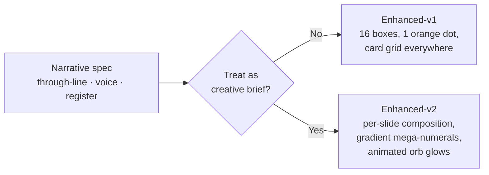

## Why Care?

A pitch deck for a Series A is the single highest-leverage artifact in a fundraise. Every claim on it is a load-bearing wall: numbers VCs will spot-check, framings they'll forward to partners, signals they'll pattern-match against their portfolio. The founder's live deck (Proto) was already strong, but it left the table flat in three places we could now actually fix:

1. **It didn't name the lead.** Quiet Capital led the seed in 2023, and they're leading the Series A again. A second consecutive lead from the same fund is one of the strongest conviction signals a Series A deck can carry — and the deck was silent on it.
2. **It didn't tell the capital-efficiency story.** Pinecone has raised ~$138M at $750M. Weaviate ~$68M at $200M+. Chroma will be at $30M total post-Series-A at a $120M post. That's the same story (open-source vector DB, AI-native infrastructure, frontier-AI customers) executed with ~22% of Pinecone's capital. The deck didn't say it. Nobody else was going to.
3. **It didn't tie the ask to the milestone.** "Raising $12M" is just a number until you say *what the money buys*. The founder had already named the answer — $10M run rate by Q4 2026 — but it lived in a single column of a single slide, not anywhere prominent.

Enhanced-v2 fixes all three, and gives the deck a visual personality that matches the technical-credible-but-not-shy posture Chroma already has on trychroma.com. The work also exposed how thin a "first enhanced pass" can be when the agent treats a narrative outline as a content spec rather than a creative brief — and what it takes to course-correct.

## What's New?

- **New whole-deck variant: Enhanced-v2** at `/scroll/pitch/enhanced-v2/`. 16 sections, inline Tailwind, single-file Astro page per the deck-iteration-workflow skill's Phase 1. Each slide composed independently — no template repeats. Live in the variant chooser at `/scroll/pitch/`.
- **New whole-deck variant: Enhanced-v1** at `/scroll/pitch/enhanced-v1/`. Structurally correct (all the right numbers, citations, founder-pending flags), but visually a tidied Proto. Kept as a reference variant for the founder review conversation — sometimes "exactly the same thing, sourced properly" is what the room asks for.
- **Reconciliation doc upgraded to v0.0.2.0** at `context-v/explorations/Discrepancy-Reconciliation__Founder-Deck-vs-MemoPop.md`. Now anchored on the founder call notes (2026-04-29) instead of solely on the MemoPop memo. Most "open escalations" closed. The memo's claim of an October-2025 $18M Series B is explicitly marked as hallucinated and dropped.
- **Narrative outline upgraded to v0.1.2.0** at `ai-labs/dididecks-ai/context-v/narratives/ChromaDB_Deck-Outline__Enhanced-v1.md`. Rewritten from a stub (verbatim duplicate of Proto) into a real three-movement spec: Premise → Insight → Defense.
- **`decks.ts` updated** to register both new variants alongside Proto. Status `draft` on both pending founder review.

## How we got here

This was a four-act journey:

### Act I — Ingest

We had three inputs to reconcile: the founder's live deck (PDF, May 2026), the MemoPop-generated investment memo (ChromaDB v0.0.7, May 2026, structured around Alpha Partners' "7 C's"), and live primary sources we could hit with `gh api` and `curl`. We read all three end-to-end first. The MemoPop fact-check pass classified 39 of its own claims as `unverifiable`, 3 as `contradicted`, 5 as needing `correction`. That set the tone: the memo is useful for *directional category framing*, not for sourcing specific Chroma numbers.

Then the founder shared his own call notes (2026-04-29) — financing history, current round mechanics, customer list, ASP, runway, board composition, product-cadence quotes ("frontier models — done. Search agent — done. Ingestion agent — next."). Those notes are now the operative source. The MemoPop memo retreats to background research.

### Act II — Reconcile

We initially classified every founder-vs-memo difference as a "contradiction." That was wrong. Walking the table row by row, most "contradictions" were actually one of four other things:

- **Unit conflations** — "14M monthly downloads" (founder, correct: PyPI 13.78M + npm 0.76M) vs "15M weekly npm" (memo, off by ~80×)
- **Different things measured** — "50K cloud teams" (founder, paying Cloud customers) vs "500K MAU" (memo, OSS user base)
- **Sequential events** — "$18M seed in April 2023" *and* "$12M Series A now" are both true; they're three years apart, not in conflict
- **Founder silent + memo asserts** — these aren't contradictions, they're addition questions: should the memo's analyst framing go on Chroma's deck or not?

Once we untangled those, the actual contradictions reduced to one (GitHub stars: 27k founder vs 12k memo) and a stale-data verdict for the memo (live GitHub at 27,915 confirmed the founder). The "$18M Series B in Oct 2025" claim from the memo's capital-efficiency section turned out to be sourced from a single weak signal (a SalesTools AI page) and contradicted everything else. We dropped it.

The funding picture, fully resolved from the call notes:

| | Seed (April 2023) | Series A (May 2026) |
|---|---|---|
| Round size | $18M | $12M · $10M committed · $2M available |
| Post-money | $93M (from $75M pre) | $120M |
| Lead | **Quiet Capital · Astasia Myers** | **Quiet Capital again · Astasia Myers** |
| Board | — | Jeff Huber + Alex Kvame (Quiet) |
| Operator angels | Kimball (CockroachDB), Tigani (MotherDuck), Rauch (Vercel), Masad (Replit), Kothari (Notion), Goldbloom (Kaggle), Naval, Altmans | "all institutional insiders participating" |

### Act III — The first design pass missed

We built Enhanced-v1 next. It was correct: every fact-bearing line carried a `data-source` attribute, every founder-pending item was flagged, the through-line was articulated in §§1–4 of the narrative as a creative brief, the three new slides (Market, Backed by, Use of Funds — later joined by Capital Efficiency) all had specs. And it looked like a tidied Proto.

The failure mode was specific: we read the narrative as a *content spec* (here are the words; render them in boxes) instead of as a *creative brief* (here is the through-line, voice, and visual register; now improvise a deck that earns the brand). The deck-iteration-workflow skill explicitly warns against this — its "Why holistic-first" paragraph exists because per-slide thinking produces fragmented design. We managed to produce fragmented design *in a single file*.

The user, correctly, said it was lame. The user was correct.

### Act IV — Improvisation finally happens

We looked at `astro-knots/sites/dark-matter` — same monorepo, same author, recent work the user was happy with. Dark-matter's design vocabulary is animated orbital rings, drifting gradient orbs, gradient-fill mega-numerals, eyebrow labels in wide-tracked uppercase, brand-domain visual abstractions (Mitochondria, Chromosome, DNA-DoubleHelix for a longevity fund). Every slide a distinct composition. Light/dark mode breaks for emphasis.

For Chroma the equivalent is:

- **The Chroma overlap-circles** (cobalt + amber) recast as a CSS atom appearing inline throughout, plus large blurred animated orb glows bleeding off the edges of every other slide
- **Gradient text fills** — cobalt-to-amber for the wordmark mark, orange-to-marigold for warm accents, cobalt-to-ocean for cool stats — applied to `27,915` at 18vw font, to `$113B` at 28vw, to `$10M` at 18vw, to `Quiet Capital` at 11vw
- **Dotted-grid texture** (currently only on cover/closer in Proto) used as a recurring background motif across most slides — the data-infrastructure metaphor made visible
- **A pulsing orange Chroma dot** on the competition matrix via `box-shadow` rings expanding outward — animated, literally drawing the eye to the one quadrant that matters
- **A customer marquee** animating across the bottom of the traction slide — `@keyframes marquee` translating `-50%` over 40s, doubled customer list for seamless loop
- **Brutalist black-luminous breaks** at slides 4 (Market — warm-black ground, amber + orange orbs), 8 (Case Study — black ground, "x/AI" wordmark at 40vw in 4% white watermark, the xAI quote at 5vw italic), 15 (The Ask — black ground, cobalt + amber orbs), 16 (Closing — three orbs)
- **A horizontal bar chart on the Capital Efficiency slide** where Pinecone's bar runs the full width (100%), Weaviate's at 49%, Chroma's at 22% — and Chroma's bar is the orange-to-amber gradient. The visual *is* the argument: the punchline is the size disparity, not the explanation underneath.
- **Names as typography** on the Team slide and Backed-by slide — no avatar circles, no card grid. Each operator angel sized to signal their relative weight (huge / big / med), arranged as a typographic constellation
- **Slide markers** top-left in IBM Plex Mono: `01 / 16 · Cover`, `04 / 16 · Market`, etc. Editorial-magazine feel.

The skill's actual prescription is "inline Tailwind utilities only — let the agent improvise around theme/layout boundaries." Enhanced-v2 does exactly that. Arbitrary values for brand hex (`bg-[#1a73e8]`, `text-[#27201c]`), `text-[clamp(7rem,18vw,18rem)]` for hero numerals, `font-mono text-[11px] tracking-[0.3em] uppercase` for eyebrow labels — the design system is whatever the slide needs.

A small CSS block at the top defines the four animation keyframes (`drift-slow`, `drift-slow-2`, `pulse-dot`, `marquee`), the four orb gradients, the two grid-dot textures, the three gradient-text utilities, and the Chroma-atom pseudo-element. Everything else is inline Tailwind.

## What we learned

**A narrative outline is a creative brief, not a content spec.** The §1 through-line, §2 voice, §3 visual register sections of `ChromaDB_Deck-Outline__Enhanced-v1.md` were the prompt the agent needed to read. We wrote them carefully; we then ignored them and produced templated layout. The skill's holistic-first prescription is correct precisely because the alternative — building slide-by-slide from a content list — is the failure mode we just demonstrated.

**Per-slide composition is the unit of creativity, not per-deck.** Enhanced-v2 has 16 distinct visual gestures. Some are full-bleed editorial (Opening, Closing). Some are dense and asymmetric (Traction, Competition). Some are brutalist comparative (Capital Efficiency). Some are quiet typographic constellations (Team, Backed by). The deck reads as one piece because the voice and the atoms are consistent, not because the layouts are.

**Pro-VC fast facts on the Ask slide are worth the line.** "$4M cash + AR · 9–12 months runway without raise (current burn, no cuts) · Board: Jeff Huber + Alex Kvame (Quiet) · Post-money $120M" preempts the standard first question. The `(current burn, no cuts)` qualifier specifically defuses inflated-runway figures pro VCs occasionally see. Saved as feedback memory so it carries to future client decks.

**The single most important number on the deck is the milestone, not the round size.** Enhanced-v2 makes `$10M` (the Q4 2026 run rate target) the visual anchor of the Use of Funds slide — bigger than the allocation percentages. The Series A buys one specific outcome. The slide is about the outcome; the allocation explains how.

## What's next

- Send both variants to Jeff for review. Default disclosure on the Ask slide is "middle" (named lead + insider commitment, no post-money) but Enhanced-v2 currently shows post-money in the fast-facts strip — easy edit if he wants it pulled.
- Source the real assets: 13 customer logos (slide 3), xAI mark (slide 8), 7 "also powering" logos (slide 8), 12 team headshots (slide 10), optional investor logos (slide 11). Crawl-fetch-ingest skill, separate sub-plan.
- Decide which variant is the canonical "send-to-LPs" Enhanced. The intuition is Enhanced-v2; the founder picks.
- Roll the reconciliation discipline (founder call notes as primary; memo as background) up to the parent `dididecks-ai/changelog/` as the cross-cutting Reflect → Publish phase of the lossless-loop. Future client engagements should inherit the pattern: founder calls are the source; AI-generated memos are research, not citation.

The Chroma scroll deck now has three variants on the variant chooser at `/scroll/pitch/`: Proto (recoverable baseline), Enhanced-v1 (numbers-disciplined but visually flat — kept as reference), Enhanced-v2 (the actual improvisation). All three render. Recovery from any one to any other is a single route change.
