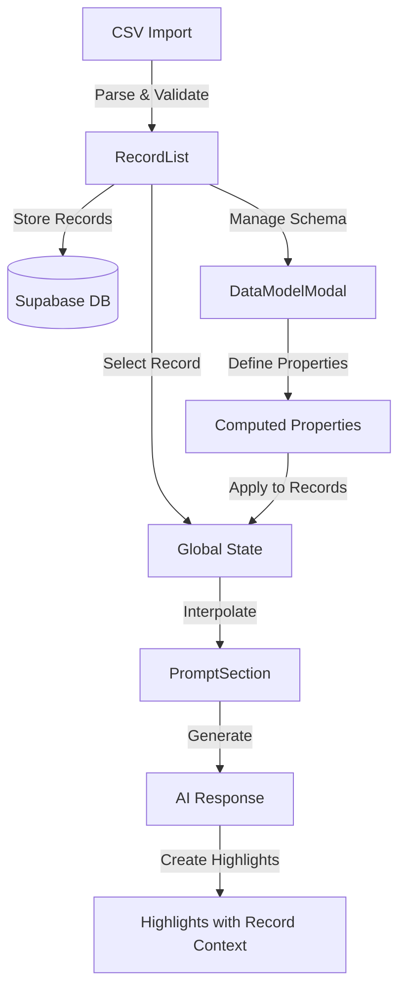
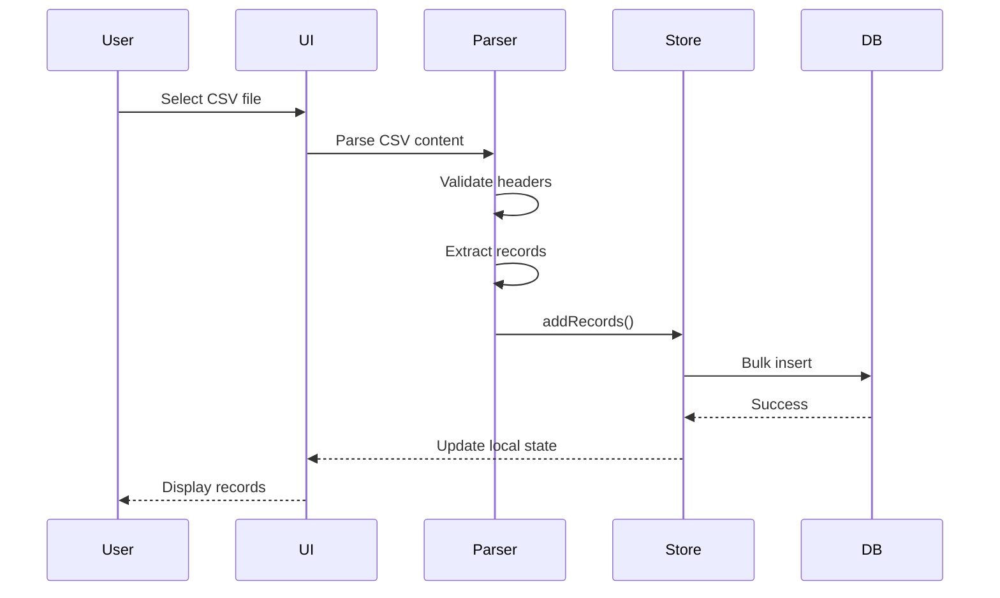
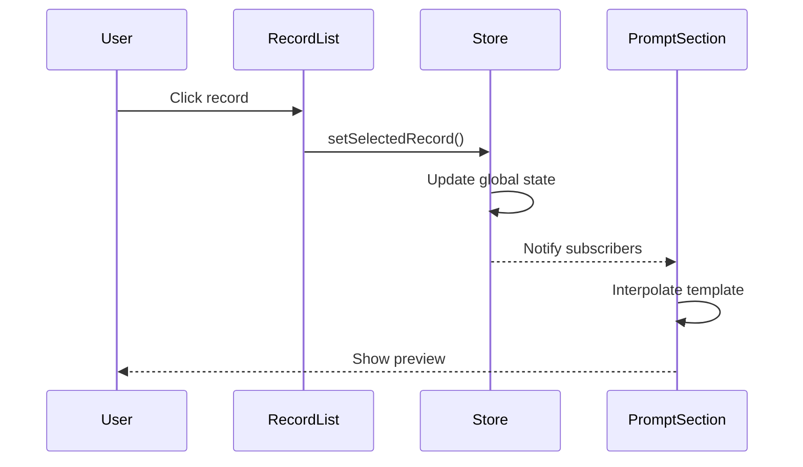
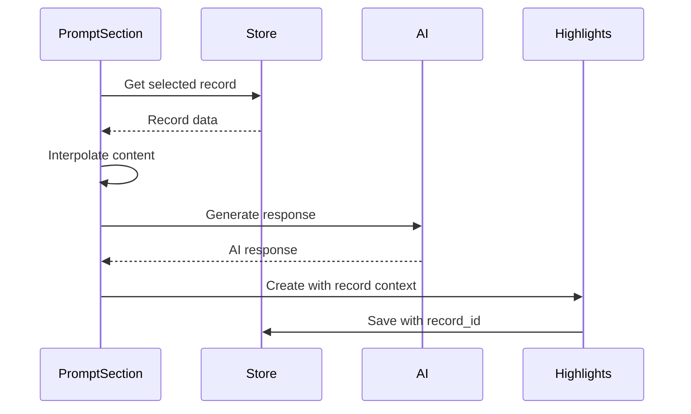

# RecordCollector Feature Analysis

## Overview
This document provides a comprehensive analysis of the RecordCollector feature set in the application. The RecordCollector system enables users to upload or connect to data sources and create records that can be integrated into prompt templates for dynamic AI content generation.

## Component Architecture

### 1. RecordList (Main Component)
The central component that manages the display and manipulation of records.

```typescript
interface RecordListProps {
  onOpenDataModel: () => void;
}
```

Key Features:
- Display list of records with search functionality
- CSV import with intelligent parsing
- Individual and bulk record deletion
- Record selection for template integration
- Empty state handling

### 2. DataModelModal
Manages the schema and computed properties for records.

```typescript
interface DataModelModalProps {
  isOpen: boolean;
  onClose: () => void;
}
```

Key Features:
- Display all record properties in tabular format
- Template syntax documentation
- Computed property management with JavaScript expressions
- Live preview of computed values
- Property descriptions and documentation

### 3. RecordHighlightsWrapper
Groups and displays highlights by record context.

```typescript
interface RecordHighlightsWrapperProps {
  recordId: string;
  recordName: string;
  highlights: Highlight[];
  onDeleteHighlight: (highlightId: string) => Promise<void>;
  onDeleteHighlightGroup: (recordId: string, sectionTitle: string) => Promise<void>;
}
```

## Data Flow



## UI Components and Layout

### RecordList Component
- **Left Sidebar Layout**: Fixed width with scrollable content
- **Search Bar**: Real-time filtering of records
- **Action Buttons**:
  - Import CSV (upload icon)
  - Data Model Settings (settings icon)
  - Delete All Records (eraser icon)
- **Record Cards**: Display name and all properties
- **Selection State**: Highlighted background for selected record

### DataModelModal Component
- **Modal Dialog**: Overlay with property table
- **Property Table**:
  - Property name column
  - Template syntax column (`{{record.property}}`)
  - Example values from actual records
- **Computed Properties Section**:
  - Add/Edit/Delete computed properties
  - JavaScript expression editor
  - Real-time preview

### Import Dialog
- **File Upload**: Accepts CSV files
- **Instructions**: Clear guidance on CSV format
- **Error Handling**: Validation feedback

## Key Functions

### 1. CSV Import and Parsing (RecordList)
```typescript
const parseCSVLine = (line: string): string[] => {
  const result: string[] = [];
  let current = '';
  let inQuotes = false;
  
  for (let i = 0; i < line.length; i++) {
    const char = line[i];
    
    if (char === '"') {
      if (inQuotes && line[i + 1] === '"') {
        // Handle escaped quotes
        current += '"';
        i++;
      } else {
        // Toggle quote mode
        inQuotes = !inQuotes;
      }
    } else if (char === ',' && !inQuotes) {
      // End of field
      result.push(current.trim());
      current = '';
    } else {
      current += char;
    }
  }
  
  result.push(current.trim());
  return result;
};
```

### 2. Record Creation from CSV (RecordList)
```typescript
const handleFileChange = async (event: React.ChangeEvent<HTMLInputElement>) => {
  const file = event.target.files?.[0];
  if (!file) return;

  const text = await file.text();
  const lines = text.split(/\r?\n/).filter(line => line.trim());
  const headers = parseCSVLine(lines[0]);
  
  const nameIndex = headers.indexOf('name');
  if (nameIndex === -1) {
    throw new Error("CSV must contain a 'name' column");
  }

  const newRecords: Record[] = lines
    .slice(1)
    .filter(line => line.trim())
    .map(line => {
      const values = parseCSVLine(line);
      const record: Record = {
        id: crypto.randomUUID(),
        name: values[nameIndex]
      };

      headers.forEach((header, index) => {
        if (header !== 'id' && header !== 'name') {
          const value = values[index];
          if (value !== undefined) {
            const numberValue = Number(value);
            record[header] = !isNaN(numberValue) && value !== '' ? numberValue : value;
          }
        }
      });

      return record;
    });

  await addRecords(newRecords);
};
```

### 3. Computed Properties System (DataModelModal)
```typescript
const handleAddProperty = () => {
  const newProperty: ComputedProperty = {
    id: crypto.randomUUID(),
    name: newPropertyName,
    expression: newPropertyExpression,
    description: newPropertyDescription
  };
  
  addComputedProperty(newProperty);
};

// Evaluation of computed properties
const evaluateExpression = (expression: string, record: Record): any => {
  try {
    const func = new Function('record', `return ${expression}`);
    return func(record);
  } catch (error) {
    return 'Error';
  }
};
```

### 4. Template Integration (PromptSectionPreview)
```typescript
const interpolateContent = (content: string) => {
  if (!selectedRecord) return content;
  
  let interpolated = content;
  const regex = /\{\{([\w.]+)\}\}/g;
  const matches = [...content.matchAll(regex)];
  
  for (const match of matches) {
    const [fullMatch, path] = match;
    if (path.startsWith('record.')) {
      const property = path.replace('record.', '');
      const value = selectedRecord[property];
      if (value !== undefined) {
        interpolated = interpolated.replace(fullMatch, String(value));
      }
    }
  }
  
  return interpolated;
};
```

## State Management

The application uses Zustand for centralized state management:

### Record State
```typescript
interface RecordState {
  records: Record[];
  selectedRecord: Record | null;
  computedProperties: ComputedProperty[];
  
  // Actions
  setSelectedRecord: (record: Record | null) => void;
  addRecords: (records: Record[]) => Promise<void>;
  deleteRecord: (recordId: string) => Promise<void>;
  deleteAllRecords: () => Promise<void>;
  addComputedProperty: (property: ComputedProperty) => void;
  updateComputedProperty: (id: string, updates: Partial<ComputedProperty>) => void;
  deleteComputedProperty: (id: string) => void;
}
```

## Database Schema

### Organizations Table (Records Storage)
```sql
CREATE TABLE organizations (
  id uuid PRIMARY KEY DEFAULT gen_random_uuid(),
  name text NOT NULL,
  properties jsonb DEFAULT '{}'::jsonb,
  created_at timestamptz DEFAULT now(),
  user_id uuid REFERENCES auth.users(id)
);

-- Row Level Security
ALTER TABLE organizations ENABLE ROW LEVEL SECURITY;

CREATE POLICY "Users can only see their own organizations"
  ON organizations FOR ALL
  USING (auth.uid() = user_id);
```

### Integration with Response Highlights
```sql
CREATE TABLE response_highlights (
  id uuid PRIMARY KEY DEFAULT gen_random_uuid(),
  record_id uuid REFERENCES organizations(id),
  record_name text,
  -- ... other fields
);
```

## Data Source Connection Capabilities

### 1. CSV Import
- **Supported Features**:
  - Automatic header detection
  - Dynamic property extraction
  - Quoted field handling (for commas in data)
  - Numeric type inference
  - Bulk import operations

- **Requirements**:
  - Must contain a 'name' column
  - All other columns become dynamic properties
  - UTF-8 encoding recommended

### 2. Manual Record Creation
- Currently not implemented in UI
- Could be added via form interface
- Store supports individual record addition

### 3. Potential Future Data Sources
Based on the architecture, the system could easily support:
- JSON file import
- API endpoint connections
- Database connections
- Excel file import
- Real-time data streams

## Record Lifecycle

### 1. Import Phase


### 2. Selection and Usage Phase


### 3. AI Integration Phase


## Error Handling

### Import Errors
- Missing 'name' column validation
- File format validation
- Parse error recovery
- User-friendly error messages

### Database Errors
- Transaction rollback on failure
- Retry logic for network issues
- User notification system

### Template Errors
- Graceful handling of missing properties
- Undefined property fallbacks
- Expression evaluation safety

## Performance Considerations

### Optimizations
- Virtual scrolling for large record lists
- Memoized computed properties
- Batch database operations
- Lazy loading of record details

### Scalability
- Pagination support in database queries
- Indexed search on record names
- Efficient CSV parsing for large files
- Background processing for imports

## Security Features

### Data Protection
- Row Level Security (RLS) enforcement
- User-scoped data isolation
- Secure file upload validation
- Input sanitization

### Access Control
- User authentication required
- API key protection for AI services
- CORS configuration
- Rate limiting on imports

## Integration Points

### 1. Prompt Templates
- Variable interpolation system
- Real-time preview updates
- Computed property support
- Multi-record batch processing

### 2. AI Response System
- Record context preservation
- Response-to-record linking
- Highlight association
- Audit trail maintenance

### 3. Highlight Collection
- Record-based grouping
- Cross-reference navigation
- Batch operations by record
- Export with record context

## Future Enhancements

### Planned Features
1. **Direct Database Connections**
   - PostgreSQL connector
   - MySQL connector
   - MongoDB integration
   - Real-time sync

2. **API Integration**
   - REST API connector
   - GraphQL support
   - Webhook receivers
   - OAuth authentication

3. **Advanced Import Options**
   - Excel file support
   - JSON/XML parsing
   - Custom delimiters
   - Data transformation rules

4. **Record Management**
   - Inline editing
   - Bulk updates
   - Version history
   - Duplicate detection

5. **Schema Evolution**
   - Property type definitions
   - Validation rules
   - Default values
   - Required fields

6. **Collaboration Features**
   - Record sharing
   - Team workspaces
   - Change tracking
   - Comments and annotations

## Dependencies

### Core Libraries
- React 18+ for UI components
- Zustand for state management
- Supabase for database and auth
- TypeScript for type safety
- Tailwind CSS for styling

### Utility Libraries
- Lucide React for icons
- UUID generation utilities
- CSV parsing utilities
- File API for uploads

## Conclusion

The RecordCollector system provides a robust foundation for data management and template integration. Its flexible architecture supports various data sources, dynamic schema management, and seamless integration with AI-powered prompt generation. The system's design allows for easy extension to support additional data sources and advanced features while maintaining security and performance.