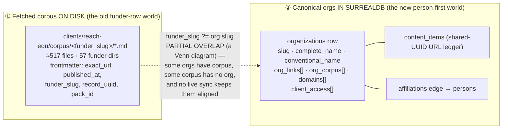

# Funder-Fit Engine

## Why this question now

reach-edu raises money from philanthropies. The work is not "write a grant application." It's a **two-direction matching problem** that repeats for every prospect on the pipeline:

- **Funder → Story.** *Understand what this funder is actually looking for, then shape a story and materials that answer it.* (Hewlett cares about K-12 systems change → frame reach-edu's apprenticeship work in systems-change language.)
- **Story → Funder.** *We're already committed to this story. Which funders' stated priorities does it unlock, and who do we already know there?* (We have a "jobs into degrees" narrative → which of our 100 tracked funders has published a thesis it satisfies, and which board member do we have an affiliation to?)

Both directions burn on the same fuel: **a trustworthy, per-organization corpus of what each funder publishes and believes.** Over the last weeks we built two halves of that fuel without yet connecting them — and we can't yet tell which orgs have a corpus worth reasoning over. This exploration is about closing both gaps so the cycle can actually run.

This is the *application* layer that [[Best-Way-to-RAG-Over-the-Corpus]] left for later. That doc nailed the read-side mechanics (hybrid retrieval, Chroma, chunking by `record_uuid`) but it predates the person-first pivot and anchors everything on the **funder-slug CSV row**. The world moved underneath it: the canonical anchor is now the **SurrealDB `organizations` row**. This doc reframes around that, and adds the part no prior exploration covers — the bidirectional funder-fit cycle itself.

## What we actually have right now

Two corpora that don't know about each other:



**① The fetched corpus** (≈517 `.md` files under `clients/reach-edu/corpus/<funder_slug>/`) was produced by the content-ingest pipeline (`services/content-ingest/src/{jina,corpus,handlers}.ts`) pulling URLs through Jina/Firecrawl into markdown. Each file carries `exact_url`, `published_at`, `funder_slug`, `record_uuid`, `pack_id`. This is the body of text a RAG would retrieve over.

**② The canonical orgs** (SurrealDB `organizations`) carry the operator's *hand-curated link inventory* — `org_links` (identity URLs), `org_corpus` (content URLs to build a corpus from), `domains` (email domains). These were enriched by hand on the person-enrichment surface. This is the *source list* — the set of URLs we believe are worth fetching. (As [[#three-kinds-of-link-identity-stream-corpus-item|the next-but-one section]] argues, `org_corpus` is currently muddy — it conflates *streams* like a blog index with *items* like a specific post; splitting those is part of the work.)

The CSV (`2026-06-10_Master-Pipeline-Tracker_v10.csv`, 100 funders) is the third artifact, carrying `corpus_count`, `corpus_funder_slug`, `corpus_last_updated`, `official_updates_index_url(s)` — a roll-up view, not a source of truth.

## The unit of provenance: each list is its own entity; aggregation rides on top

A framing the operator was explicit about, and it governs everything below: **every list / spreadsheet / observation is its own first-class entity, AND we must be able to aggregate across them.** The DC-event org list is not "the orgs" — it's *the orgs as observed at the DC event*. A funder pipeline CSV is *another* observation of (overlapping) orgs. The Schusterman corpus is *another*. The same real-world organization can appear in several observations, each with its own provenance, its own date, its own confidence.

This is already half-built in the canonical layer: every observation carries a `client` tag and a `source` field, and entities carry a materialized `client_access[]`. The discipline this exploration leans on:

- **Each observation/list keeps its identity.** Don't flatten the DC-event list into an anonymous org pool. Stamp `source` (e.g. `gatsby-events:dc-2026` or the import's name) on every row it produced, so "the DC-event orgs" stays a queryable set forever.
- **Aggregation is a query, not a merge.** "All orgs across all observations for reach-edu" = filter by `client_access`. "Just the DC-event orgs" = filter by `source`. The redundancy-over-normalization ethos applies — we keep per-observation rows and materialize roll-ups, rather than collapsing observations into one canonical record that loses where each fact came from.
- **The Venn is provenance-shaped.** An org in both the DC-event list and the funder CSV is one entity reached by two observations; a corpus dir with no org is an observation (a fetch) whose entity hasn't been reconciled yet.

This is what makes "treat each list as its own entity but aggregate across" tractable: the graph stores entities once, observations many times, and every read names the scope it wants.

## Three kinds of link: identity, stream, corpus item

The org link inventory has been treating every URL as the same kind of thing. It isn't — there are **three temporally-distinct kinds**, and conflating them is why `org_corpus` is currently muddy:

| Kind | What it is | Temporal behavior | Field | Example |
|---|---|---|---|---|
| **Identity link** | a fact about who the org *is* | static — fetch ~once | `org_links` | homepage, LinkedIn, Wikipedia, Crunchbase |
| **Stream** | a *recurring publisher* that emits content over time | polled on a cadence | `media_streams` *(new)* | blog index, RSS feed, newsroom, podcast feed, Substack, YouTube channel, a journalist's beat page, an outlet's topic-tag page |
| **Corpus item** | a single piece of *actual content* | fetched once, embedded, retrieved | `org_corpus` | a specific post, article, episode, PDF report |

The middle tier is the one we were missing. **A stream is not corpus** — it's the *generator* of corpus. The blog index isn't the content; it's the thing you poll to *discover* the content, and each poll yields N corpus items. This maps onto machinery we already have: a stream is exactly what `official-blog-pack` consumes (index in → items out), and each item it produces becomes a `content_items` ledger row.

Streams carry the fields that make freshness cheap and automatic:

```
media_streams: [{
  url, kind, party,
  has_rss, rss_url,        // RSS → cheap automatic poll; no RSS → scrape the index on a cadence
  cadence,                 // "daily" … "few-per-year" — sets poll frequency
  url_domain, last_polled_at, added_at,
}]
```

**This is the answer to the freshness questions in Problem A** ("are our orgs up to date? are we missing new content?"). You can't stay current by re-fetching a pile of corpus-item URLs — those are point-in-time. You stay current by **registering streams and polling them**. The stream layer *is* the freshness engine; the corpus is its output. (But first-party and third-party streams do **not** live in the same place — see *First-party streams live on the org; third-party streams are their own entities* below.)

### Provenance (first-party vs third-party) cuts across all three

`party` is an **orthogonal facet, not a quality ranking** — and third-party is emphatically *not* second-class:

- **First-party** (the org's own blog, press releases, podcast) tells you **what they say they want** — the stated thesis, the priorities, the *language to mirror* in a pitch. But it's PR-shaped: washed, flattering, silent on the inconvenient.
- **Third-party** (investigative journalism, news coverage, critical podcasts, analyst write-ups) tells you **what's actually going on** — leadership churn, controversies, real grant behavior vs stated priorities, how the field perceives them. It rarely tells the whole story, but it surfaces exactly what first-party omits.

You need **both, held in tension**: first-party for the language and the stated ask, third-party for the reality-check and the warm-path context. Both directions of the cycle consume both. So every stream *and* every corpus item carries a `party` field; retrieval can weight or filter by it, but neither side is ever discarded as "noise."

### First-party streams live on the org; third-party streams are their own entities

`party` is not just a tag — it changes *where the stream is stored*, because first- and third-party streams have different ownership cardinality. Compare:

- `standtogether.org/stories` — Stand Together **owns** it and it's **about** Stand Together. Owner == subject, 1:1. It belongs *on* the org, and its entries are Stand Together's own corpus.
- `nytimes.com/education` — the *New York Times* owns it; it covers the **entire education sector**, of which Stand Together is one subject among hundreds. Owner ≠ subject, and the stream is **many-to-many** with the orgs it covers.

Burying `nytimes.com/education` as a property of `stand-together` is wrong: the next time it covers Arnold Ventures you'd duplicate the whole stream under `arnold-ventures`, and you could never ask *"what has NYT Education published across all our orgs?"*

| | First-party stream | Third-party stream |
|---|---|---|
| Owner | the org itself | an outlet (itself an org) |
| Subject | the org | many orgs |
| Cardinality | 1:1 | **M:N** |
| Where it lives | array on the org (`media_streams`, `party=first_party`) | **its own `media_streams` entity** (e.g. `nytimes-education`) accumulating `entries` |

**Coverage is the org-anchored view, double-inserted.** A NYT-Education entry *about* Stand Together lands in two places, deliberately (redundancy over normalization):

1. `media_streams:nytimes-education.entries` — the **stream-anchored** record ("everything NYT Education published," reusable across every org it touches).
2. `organizations:stand-together.coverage` — the **org-anchored** record ("third-party coverage *of* Stand Together," materialized so it reads without a join).

In graph terms this is just two edges on one `content_item`:

```
content_item ─from_stream→ media_streams:nytimes-education     (who published it)
content_item ─about──────→ organizations:stand-together         (who it's about — can be several)
```

…and the two arrays above are the **materialized, denormalized read-views** of those edges. SurrealDB lets us keep both — the edges as truth, the arrays for fast reads — exactly the redundancy-over-normalization the project favors. The first-party case is the degenerate one where `from_stream`'s owner and `about` are the same org, so it collapses onto the org and needs no separate node.

This is where the **graph earns its keep again**: third-party coverage is inherently many-to-many (one article about three funders; one outlet covering eighty), and Direction 2's relationship-weighted ranking can now traverse `coverage` *and* `affiliations` — *"who's been written about alongside our story's themes, and where do we already know someone."*

## The task at hand: augment the DC-event orgs with source-of-truth content links

The concrete near-term job — the thing to do over the next few days, ahead of the full cycle — is narrow and clear:

> Take the **list of organizations generated from the DC-event observation** in SurrealDB, and augment each one with
1. valid links — **blog / news / stories / pillars / updates indexes** — *where we can pull content straight from the source's own mouth.* **More is generally better.**
2. valid links from media sources — **third-party coverage** — *to understand how the org is perceived and discussed.* More is generally better.

Concretely that means, per DC-event org:

1. Find the org's own publishing surfaces — not third-party coverage, the **first-party** ones: the blog index, the newsroom/press page, the "our work" / pillars pages, any RSS/updates feed.
2. Write them onto the org as `org_corpus` links (the affordance already exists from the affiliations work — `appendOrgCorpus`, with `url_domain` derived and a free-text `kind`).
3. Let the content-ingest pipeline (`jina.ts` / `corpus.ts`) pull each into markdown under `clients/reach-edu/corpus/<org-slug>/` — which immediately re-raises the **filesystem ↔ DB sync** contract in Problem A.

AND:

1. Find media sources that cover the org — not the funder, the org itself. This means searching for the org's name + domain + recent activity, and pulling in relevant articles, press releases, and coverage.
2. Write them onto the org as `org_corpus` links (the affordance already exists from the affiliations work — `appendOrgCorpus`, with `url_domain` derived and a free-text `kind`).
3. Let the content-ingest pipeline (`jina.ts` / `corpus.ts`) pull each into markdown under `clients/reach-edu/corpus/<org-slug>/` — which immediately re-raises the **filesystem ↔ DB sync** contract in Problem A.

**Streams vs items, concretely:** when a URL is an *index or feed* (the blog index, an RSS feed, a newsroom page, an outlet's tag page for this org), it goes in `media_streams`, not `org_corpus` — it's a publisher to poll, not content to embed. When a URL is a *specific piece* (one post, one article, one episode), it goes in `org_corpus` and gets fetched into a markdown file. Most "augment with links" work is actually *stream registration*; the corpus items then flow from polling those streams.

"More is better" here is a real heuristic, not hedging: for a publisher-class funder, breadth of streams — **first-party and third-party alike** — is exactly what makes Direction 1 (understand what they want) and Direction 2 (match our story to them) work later. First-party and third-party aren't ranked; they're complementary (stated ask vs. reality-check, per the section above). This task *is* Phase 0 + the publisher slice of Phase 1, pointed at one observation (the DC-event list) as the first concrete target.

## The two problems blocking the cycle

### Problem A — Convergence + sync: two stores that partially overlap and drift

The operator's hand-built `org_corpus` links on a SurrealDB org are *intentions to fetch*. The 517 files on disk are *fetches that happened*. They **partially overlap** — a Venn diagram, per the operator's framing: some orgs have a corpus, some corpus dirs have no canonical org, and the two sets are aligned by convention, not by a live mechanism. 

We can't currently answer, for one org:

- Which `org_corpus` links have been fetched into the corpus, and which are still just URLs?
- Which corpus files on disk belong to an org that no longer exists / was merged (the IHS dedup is a live example)?
- When the operator adds a link by hand, does it get fetched? (Today: no automatic path from `org_corpus` append → content-ingest fetch.)

We can't currently perform a fetch for any org and have a high degree of confidence it is robust and thorough.
- Are our orgs up to date? 
- Are we missing any important sources?
- Are we missing any new content?

The slug *should* be the join key (`funder_slug` on disk == `slug` on the org), both produced by the same slugifier — but that slugifier just changed (the "The…" strip), so even the join key has drift.

**This is fundamentally a filesystem ↔ database sync problem, and it's recurring, not one-shot.** The corpus content lives on the local filesystem (markdown files — the right home for LLM-ingestible text, git-trackable, greppable). The canonical entity + link inventory lives in SurrealDB. Neither is going to absorb the other: the filesystem is the natural store for *content*, the DB is the natural store for *entities, edges, and provenance*. So convergence isn't "merge them once" — it's **an ongoing reconciliation discipline** with a clear contract about which store is authoritative for which fact:

| Fact | Authoritative store | The other store holds |
|---|---|---|
| The org entity, its names, its edges | SurrealDB | corpus frontmatter stamps `org_slug` / org RecordId |
| The link inventory (`org_corpus`, `org_links`, `domains`) | SurrealDB | — |
| The fetched content (markdown body) | Filesystem | `content_items` ledger row points at it by URL/UUID |
| "Has this URL been fetched?" | Filesystem presence | SurrealDB `content_items` mirrors fetch status |

A reconcile pass (Phase 0) walks both, stamps the join key both directions, and reports the Venn: matched, corpus-without-org, org-link-without-corpus. It runs on a cadence (and after every merge/promote), not once. **Until the org row knows its own corpus and vice-versa, "RAG over this funder" has no clean addressable boundary.**

> **Where the corpus filesystem lives — settled 2026-06-18.** The "path off local" / portability question (a second machine or cloud job needing the corpus) is answered by **automated `rclone` sync to a Cloudflare R2 bucket** (`lossless-core`, zero egress, we own the data) — **local-first**: the markdown stays as genuine local files (fast to edit/grep/script, works offline, git-trackable), and a background sync mirrors it to R2. This deliberately is **not** a JuiceFS-style live mount — a network-drive-that-looks-local is the wrong shape for one-person local-first content development (and it needs a macOS kernel extension). The decision and the full why are in [[JuiceFS-Pinned-Path-Off-Local-Substrate]]. Net effect on this exploration: the **filesystem stays the authoritative store for content** above; rclone just gives it a durable cloud copy and cross-machine reach. R2 reads/writes are verified working.

### Problem B — Confirmation: not every org deserves a corpus

The operator's words: *"some organizations are either full-of-it (a person acting like an organization), or purposefully private. But the well-resourced organizations usually publish on the regular — they might have a whole content team. Like Stand Together or AEI."*

This is a real taxonomy and it should be **first-class metadata on the org**, not a gut feeling:

| Org corpus-class | Signal | What the engine does |
|---|---|---|
| **Publisher** (AEI, Stand Together, Hewlett) | Has a content team; regular dated posts; an updates index | Full corpus; high trust; primary funder-fit input |
| **Thin** | A site, a mission page, sporadic posts | Shallow corpus; lean on third-party coverage (Candid, Inside Philanthropy) |
| **Private-by-design** | Family foundation, no content footprint | No corpus expected; flag so we stop trying; reason over *relationships* instead |
| **Noise** | One person LARPing as an institution | Suppress; do not let it pollute retrieval |

Right now we have no field that records this, and no pass that assigns it. "I can't really confirm" is exactly the gap — the operator improved the dataset by hand but has no affordance that says *this org's corpus is good / thin / fake*. **Confirmation is a labeling pass, ideally human-in-the-loop** ([[Forced-One-By-One-Tag-Selector|one org at a time, deliberate]] — the forced-one-by-one pattern we just drafted is the natural UI for it), possibly pre-scored by a cheap heuristic (does the homepage have a dated blog index? how many corpus files? how recent?).

## The substrate: org-anchored, graph-grounded

[[Best-Way-to-RAG-Over-the-Corpus]] argued single Chroma collection + metadata filter, chunk IDs keyed by `record_uuid`. That mechanic still holds. Two updates given the SurrealDB world:

1. **Anchor on `organizations.slug`, not the CSV `funder_slug`.** The org row is now the canonical entity. The corpus metadata filter becomes `where={"org_slug": "..."}`. `record_uuid` stays as the lineage-stable chunk identity for files already stamped with it; new fetches stamp the org's RecordId too.
2. **Lean into the graph — this is KAG, not just RAG.** We didn't have a knowledge graph when Best-Way-to-RAG was written. Now we do: persons —`affiliations`→ organizations, orgs own domains, content_items is a shared-UUID ledger. The funder-fit cycle is *exactly* the kind of question that wants graph grounding, not just vector similarity:

   > *"Which funders have published a thesis my 'jobs into degrees' story satisfies, AND where do we already have a relationship?"*

   That's a vector retrieval (story ↔ funder-corpus similarity) **joined to** a graph traversal (which orgs have an `affiliations` edge to a person we know). Plain RAG answers the first half; KAG answers the whole question. **The graph is the differentiator** — it's why this is worth building in augment-it specifically and not in a generic RAG-over-PDFs tool.

## The cycle, both directions

### Direction 1 — Funder → Story (inbound understanding)

```
pick funder org → retrieve top-K corpus chunks (their stated priorities,
recent grants, language they use) → synthesize a "what they're looking
for" brief, cited → operator drafts/adjusts a story that answers it
```

The output is a **funder brief**: their thesis, their language, their recent moves, with citations back to corpus files. This is close to what `export-event-briefing.mjs` does for attendees, pointed at an org's corpus instead.

### Direction 2 — Story → Funder (outbound matching)

```
operator writes/pastes a committed story → embed it → retrieve across
ALL funder corpora for thesis-overlap → rank funders by fit → JOIN to
the graph: which ranked funders have an affiliations edge to someone we
know → ranked, relationship-weighted funder shortlist
```

This is the **Retrieval Lens inverted and graph-weighted** — the inverse view Best-Way-to-RAG sketched, plus the relationship join that only the SurrealDB graph can do. The payoff line: *"these 6 funders' published priorities overlap your story; 2 of them you already have a warm path into."*

Both directions share one retrieval index and one graph. That's the whole argument for building the substrate once.

## A phased path (sketch, not committed)

- **Phase 0 — Converge + keep-synced.** A `surreal-reconcile-corpus.mjs` pass: for each org, match `corpus/<slug>/*.md` to the org row, stamp the org's RecordId / `org_slug` into corpus frontmatter, mirror fetch-status into `content_items`, report the Venn (matched / corpus-without-org / org-link-without-corpus). Reuses the slug join; surfaces drift. **Runs on a cadence and after every merge/promote — it's a sync discipline, not a one-time migration.** *Prerequisite for everything else.*
- **Phase 1 — Register streams + augment + confirm + classify.** *First concrete target: the DC-event org list.* For each org, register `media_streams` (first- and third-party — blog/RSS/newsroom/podcast/journalist-beat/outlet-tag), poll them through content-ingest into `org_corpus` items, more-is-better for publisher-class. Split the existing muddy `org_corpus` — index/feed-shaped entries migrate to `media_streams`; actual-content entries stay. Then add a `corpus_class` field (`publisher` / `thin` / `private` / `noise`) plus a cheap pre-score (does it have a datable stream? file count? recency?). Operator labels via the forced-one-by-one selector. Auto-fetch hook: registering a stream (or appending an `org_corpus` item) enqueues a content-ingest fetch (closing the sync loop from Phase 0).
- **Phase 2 — Index.** Embed the *confirmed publisher + thin* corpora into a single Chroma collection (`augment-it-corpus-reach-edu`), `org_slug` as the filter facet, per Best-Way-to-RAG's mechanics. Skip `private` and `noise`.
- **Phase 3 — The cycle.** Funder-brief generation (Direction 1) and story→funder matching with graph-weighted ranking (Direction 2), surfaced wherever the operator works (chat verb, a Funder-Fit lens, or a script first).

## Open questions

These are the forks this exploration deliberately leaves open — they want operator judgment before a spec:

1. **Confirmation: heuristic-first or human-first?** Do we pre-score `corpus_class` with a cheap homepage probe and let the operator correct, or is corpus-quality judgment too contextual to pre-score and the operator should label cold? (Bias from [[../../changelog|recent memory]]: web-research isn't accurate enough to auto-accept — operator drives. But pre-scoring as a *suggestion* may still save time.)
2. **How much graph, how soon?** Is the relationship-weighted ranking (Direction 2's graph join) a Phase 3 feature, or is it the *whole point* and should lead? The graph is the moat; under-using it makes this a generic RAG tool.
3. **Story representation.** In Direction 2, is a "committed story" a pasted paragraph, a structured object (claims + audience + ask), or a corpus file of our own? The richer the representation, the better the match — but the heavier the operator input.
4. **Third-party corpus for thin/private orgs.** When an org publishes nothing, the funder-fit signal has to come from Candid / ProPublica 990s / Inside Philanthropy ([[Entity-Profile-Augmentation-Workflow|the Tier-2 sources]]). Is that in scope for v1, or do we accept that private funders are reasoned about purely through relationships?
5. **Where does the cycle live?** Script-first (like the export scripts), a new `apps/` lens, or a chat verb? Probably script-first to prove the retrieval+graph join, then a surface.
6. **Streams: how purist a graph?** Settled by the `standtogether.org/stories` vs `nytimes.com/education` example — first-party streams live on the org, third-party streams are their own M:N entities with an org-side `coverage` materialization (see *First-party streams live on the org* above). The remaining fork: do we make **all** streams entities for uniformity (purist graph — every stream a node, `owned_by` + `covers` edges, org arrays are pure views), or keep first-party denormalized on the org (operator's stated preference, degenerate-entity)? And is `coverage` a stored array (double-inserted), a pure graph traversal, or both? Lean: edges as truth + materialized arrays for read speed, decide the first-party-node question when the schema firms up.
7. **Who owns polling + freshness?** Streams imply a poller — a cron, a NATS cadence, a manual "refresh this org" button? RSS streams poll cheaply; no-RSS streams need a scrape budget. Where the cadence lives (and how aggressive it is per `corpus_class`) is unresolved.

## What forks from this exploration

- A **spec** once Phase 0/1 shape is agreed — likely `Funder-Fit-Engine` or split into `Org-Corpus-Convergence-and-Confirmation` (the substrate) + `Funder-Fit-Cycle` (the application).
- Possibly a **blueprint** for `corpus_class` as a reusable org-classification pattern (other clients/entity-types will want the publisher/thin/private/noise distinction).
- The **forced-one-by-one tag selector** ([[Forced-One-By-One-Tag-Selector]]) gets its first real consumer here — corpus-class labeling is exactly its deliberate-triage shape.

## Inspiration set: open standards & specs

We are not inventing the org-graph, the provenance model, the stream model, or the funder-data model from scratch — mature open standards already exist for every one of these, and we should consciously decide per standard whether to **build it in** (adopt the wire format / vocabulary directly), **comply with** it (stay interoperable at the edges), or just be **inspired by** it (borrow the conceptual model without the machinery). The example that prompted this — [[Web Ontology Language|OWL]] — is squarely an *inspire* for us: we want its class/relation rigor without an OWL reasoner. The set below is the curated shortlist relevant to *this* exploration. Entries with a [[wikilink]] already have a note in the Emergent-Innovation collection; the rest are candidates worth adding there.

### Knowledge graph & semantic modeling — *(mostly inspire; the model, not the machinery)*

Our `persons —affiliations→ orgs`, `content_item —about→ org`, `content_item —from_stream→ media_stream` edges *are* a knowledge graph. Prior art for how to model it well:

- **RDF** ([[Resource Description Framework]]) — the subject-predicate-object triple. Our edges are triples; if we ever export, RDF is the lingua franca. *(inspire / comply-at-export)* · <https://www.w3.org/RDF/>
- **OWL** ([[Web Ontology Language]]) — classes, relations, constraints, reasoning. Inspires the `corpus_class` taxonomy and the affiliation/coverage relation definitions; we skip the reasoner. *(inspire)* · <https://www.w3.org/OWL/>
- **SKOS** — Simple Knowledge Organization System. The right model for our *loose* controlled vocabularies (corpus_class, role kinds, stream kinds, tags) — broader/narrower/related without OWL's strictness. *(inspire / could-build-in)* · <https://www.w3.org/2004/02/skos/>
- **SPARQL** ([[SPARQL]]) / **GQL** ([[Graph Query Language]]) — graph query languages. SurrealQL is our analog; these inspire the traversal shapes (the Direction-2 join over `coverage` + `affiliations` is a graph pattern query). *(inspire)* · <https://www.w3.org/TR/sparql11-query/>
- **Wikidata** data model — items, statements, **qualifiers, and references**. The references-on-every-statement model is almost exactly our "observation-as-entity with provenance"; Wikidata Q-IDs are also an entity-resolution target for org dedup. *(inspire / comply-for-identity)* · <https://www.wikidata.org/>

### Provenance & metadata — *(comply where cheap; the observation model is core)*

Directly serves the "unit of provenance" section and the double-inserted `coverage`/`from_stream`/`about` edges:

- **W3C PROV-O / PROV-DM** — the provenance ontology: *Entity / Activity / Agent*, `wasDerivedFrom`, `wasGeneratedBy`, `wasAttributedTo`. Our `source`, `fetched_at`, `from_stream`, and observation-as-entity map onto PROV almost 1:1. **The standard to be inspired by for the provenance model.** *(inspire — strongly)* · <https://www.w3.org/TR/prov-o/>
- **Dublin Core Terms** — `creator`, `publisher`, `date`, `source`, `subject`. Our corpus frontmatter is informal Dublin Core; aligning field names is near-free interop. *(comply)* · <https://www.dublincore.org/specifications/dublin-core/dcmi-terms/>
- **Schema.org** ([[Schema.org]]) — the practical vocabulary: `Organization`, `NewsArticle`, `Article`, `Blog`, `PodcastEpisode`, and crucially `MonetaryGrant` / `FundingScheme` / `Grant`. The natural `kind`/type vocabulary for orgs, streams, corpus items, *and* grants. *(build-in for content typing)* · <https://schema.org/>
- **JSON-LD** — how Schema.org rides inside pages (and how a `content_item` could serialize). Many funder sites already embed JSON-LD we can harvest instead of scraping prose. *(build-in for harvest)* · <https://json-ld.org/>

### Content streams & syndication — *(build-in; this is the freshness engine)*

The `media_streams` tier and its polling/freshness contract:

- **RSS 2.0** / **Atom** (RFC 4287) / **JSON Feed** — the feed formats behind `media_streams.has_rss`. First-class build-in. *(build-in)* · <https://www.rfc-editor.org/rfc/rfc4287> · <https://www.jsonfeed.org/>
- **WebSub** (W3C, formerly PubSubHubbub) — *push* notification of feed updates. The freshness engine without polling: subscribe once, get pinged on new entries. *(build-in if streams scale)* · <https://www.w3.org/TR/websub/>
- **ActivityStreams 2.0 / ActivityPub** (W3C) — "an actor publishes activities over time" — the conceptual model for *stream-as-entity emitting entries*, which is exactly our M:N third-party stream. *(inspire)* · <https://www.w3.org/TR/activitystreams-core/>
- **Sitemaps protocol** + **robots.txt** — discovery of an org's publishing surfaces (find the blog index / news section to register as a stream). *(build-in for discovery)* · <https://www.sitemaps.org/>
- **IPTC NewsML-G2 / rNews** — news-content metadata standards; relevant to typing third-party `coverage` items. *(inspire / comply-if-available)* · <https://iptc.org/standards/newsml-g2/>

### LLM ingest & tool interop — *(build-in)*

Read-side; how the corpus is exposed and how reach-edu's own materials get found:

- **llms.txt** — emerging convention for exposing a site's primary content to LLMs. Two uses: a *discovery surface* on funder sites we ingest, and a thing **reach-edu itself should publish**. (See the `open-graph-share-seo-geo` skill, which already covers llms.txt.) *(build-in)* · <https://llmstxt.org/>
- **Model Context Protocol (MCP)** — already wired into the tree (the Chroma MCP). The protocol for exposing the funder corpus to other tools / agents — the `search-augment-it-corpus` analog of [[search-lossless-corpus]]. *(build-in)* · <https://modelcontextprotocol.io/>
- **Open Graph Protocol** ([[Open Graph Protocol]]) — per-content-item metadata (`og:title`, `article:published_time`, `og:type`). Cheap structured signal on most corpus-item pages. *(comply / harvest)* · <https://ogp.me/>

### Funder / nonprofit / grants data — *(the highest-leverage set; build-in + comply)*

Domain-specific standards that make thin/private orgs legible and the funder-fit signal concrete:

- **IRS Form 990 / 990-PF** (e-file XML; AWS open dataset) — structured funder financials, **grant lists, and board members**. Feeds the affiliations graph *and* gives a hard signal for private foundations that publish nothing. *(build-in — major source)* · <https://www.irs.gov/charities-non-profits/form-990-series-downloads>
- **ProPublica Nonprofit Explorer API** + **Candid / GuideStar API** — programmatic access to the 990 universe. *(build-in)* · <https://projects.propublica.org/nonprofits/api>
- **360Giving Data Standard** — the best open schema for grants data (*who funded whom, for what, how much, when*). Even if no US funder publishes to it, it's the model to borrow for how we represent funder→grantee→theme. *(inspire — schema model)* · <https://standard.threesixtygiving.org/>
- **EIN** (US nonprofit primary key), **ROR** (Research Organization Registry), **GLEIF LEI**, **Wikidata Q-IDs** — entity-identity registries for org dedup/resolution (the principled fix for the "The Institute…" duplicate problem). *(comply-for-identity)* · <https://ror.org/> · <https://www.gleif.org/>

## References

- [[The-Moat-Is-Grounded-Deliverable-Production-Not-Chat]] — the strategic frame this exploration is **instance #1** of: the value is knowledge → cited deliverable (deck/memo), not chat. Direction 1 here (understand funder → produce materials) is that thesis pointed at fundraising. First build: reach-edu → dididecks internal strategy deck.
- [[Best-Way-to-RAG-Over-the-Corpus]] — read-side retrieval mechanics (Chroma, chunking, hybrid filter). **Update its anchoring assumption in your head as you read it: `funder_slug` CSV row → `organizations.slug`.** Mechanics hold; the anchor moved.
- [[Entity-Profile-Augmentation-Workflow]] — the packs/bundles source model; the Tier-2 philanthropy sources (Candid, ProPublica, Inside Philanthropy) are how thin/private orgs get a corpus signal.
- [[Multi-Agent-Research-Fan-Out-Per-Row]] — the write-side fan-out that *fills* a corpus; this doc is the read+reason side that consumes it.
- [[In-App-Browser-Or-Plugin-For-Corpus-Add]] — the operator-driven manual corpus-add affordance; the human path for adding `org_corpus` links.
- [[Forced-One-By-One-Tag-Selector]] — the deliberate-triage UI for the confirmation/labeling pass (Problem B).
- [[Operator-Built-Flows-Beyond-The-Universal-Pipeline]] — the 17/55/24 prospect tiering maps onto publisher/thin/private corpus-classes.
- [[JuiceFS-Pinned-Path-Off-Local-Substrate]] — the storage-substrate decision (2026-06-18): the corpus's cloud home is **Cloudflare R2 via automated rclone sync** (local-first), **not** a JuiceFS mount. Verified R2 read/write; includes the non-obvious R2-credential recipe.
- `services/content-ingest/src/{jina,corpus,handlers}.ts` — the existing fetch→markdown pipeline Phase 1's auto-fetch hook would call.
- `apps/person-enrichment/src/lib/types.ts` — `Link`, `OrgDomain`, `OrgSuggestion`, organization shape the substrate anchors on.
- `clients/reach-edu/corpus/` — the ≈517-file fetched corpus, 57 funder dirs.
