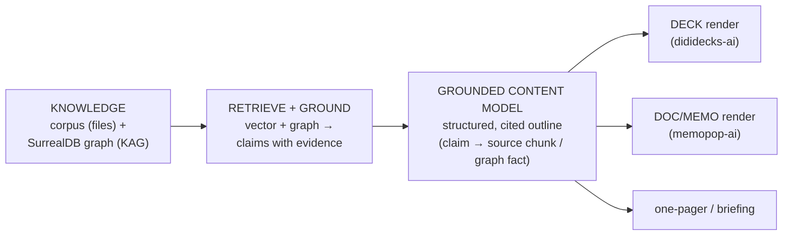

# The Moat Is Grounded Deliverable Production, Not Chat

## Why Care?

We set clients up for the AI era. The temptation is to give them "chat with your documents" — but that's about to be a checkbox in every SaaS (NotebookLM, ChatGPT, Claude, every vertical tool). It's **fungible**. The thing a client genuinely can't get off the shelf, and will pay for, is **the last mile: their own knowledge turned into the actual artifact they ship** — a fundraising deck, an investment memo, a board document, a briefing — *grounded*, *defensible*, in *their* voice, *owned* by them.

So the product isn't "RAG + a chat box." It's **RAG/KAG → deliverable, with every claim traceable back to the corpus.** Retrieval stops being a Q&A feature and becomes the thing that makes the *output* trustworthy enough to put in front of a CEO, a board, or an LP.

## The thesis, stated plainly

- **Chat is the commodity input method.** Useful, table stakes, not where value accrues.
- **The deliverable is the product.** A finished, branded, sourced deck/memo/document.
- **Grounding matters *more* for output than for Q&A.** A wrong answer in a chat is shrugged off; a hallucinated number in a board memo is a credibility event. High-stakes deliverables *must* cite their sources. That's exactly why RAG/KAG belongs here — in service of a trustworthy artifact, not a conversation.
- **NotebookLM gives you answers. It does not give you a shippable, branded, sourced deck your VP of Development puts in front of the board.** That gap is the moat.

## The architecture: one grounded content model, many renders

The client's deliverable is a **rendering of a grounded content model** — and the *same* model renders to both a document and a deck (you noted it's "almost always a document or a deck or both at the same time"). That's the load-bearing design choice:

The renderers are **output adapters over one model**, not separate apps. This is dididecks' own principle — *"source of truth is the content, not the PPT"* — generalized across formats.

## The differentiator: citations that survive *into* the deliverable

The non-fungible engineering, the part nobody gets for free: **every claim in the rendered deck/memo carries a link back to the corpus chunk or graph fact that grounds it.** Not a bibliography stapled on at the end — provenance threaded through the content model so it's there in the speaker notes, the appendix, the footnote, the hover.

This is the concrete gap today. The renderers already ship (dididecks produces per-client Astro deck sites; memopop produces memos) and the knowledge exists (corpus + graph) — **what's missing is the seam between them**: augment-it's corpus has **no vector retrieval yet**, and there's **no chunk→source mapping** to thread a citation from a generated claim back to its evidence. *Closing that seam is the moat work*, because it's what makes the output defensible.

**LFM is the natural home for the citation half.** dididecks decks are authored in Lossless Flavored Markdown, which already has a hex-code citation / link-preview system (see the `lossless-flavored-markdown` skill). So "citations that survive into the deck" isn't a new rendering problem — it's emitting LFM citations that point at corpus chunks / graph facts as we ground each claim.

## What already exists (this is assembly, not greenfield)

You're right that dididecks and memopop are already *ways this manifests* — they're the two renderers. Grounded inventory:

| Role | Asset | State (2026-06-18) |
|---|---|---|
| **Knowledge engine** | `augment-it` — corpus markdown (`clients/*/corpus/`) + SurrealDB graph (persons/orgs/affiliations/observations, per-client `client_access`) | Graph **shipped**; corpus ingest (Jina) shipped — **but no vector retrieval over the client corpus yet** |
| **Memo renderer** | `ai-labs/memopop-ai` — LangGraph orchestration + JobView cockpit (PhaseChecklist / LogStream / ArtifactBrowser) + SSE streaming | **Shipped — the most mature output engine; produces investment memos** |
| **Deck renderer** | `ai-labs/dididecks-ai` — decks-as-code: **per-client Astro + LFM + Tailwind sites, deployed to Vercel**, each a git submodule under `client-sites/` (`reach-edu-hub`, `humain-vc-decks`, `calmstorm-decks`, `chroma-decks`, `lossless-decks`), plus a `deck-shell` app and its own `corpus/` submodule | **Shipped and live — `reach-edu-hub` already exists.** The deck content is **hand-authored markdown; it just doesn't use RAG.** |
| **Retrieval substrate** | `ai-labs/context-vigilance-kit` — Chroma + `all-MiniLM-L6-v2` + MCP | Shipped, **but indexes `context-v/` docs, not client corpus** — the pattern to point at the corpus |
| **Briefings** | augment-it briefing templates | Hand-assembled today |

So this is squarely **assembly**: both renderers ship, the knowledge exists. The connective tissue — grounded-content-model + citations into the deck — is the only genuinely new build.

## Build #1: reach-edu → dididecks-ai (an internal fundraising-strategy deck)

The first concrete instance, operator-chosen: **add RAG/KAG grounding to the *already-working* `reach-edu-hub` deck site.** This is not building a renderer — `client-sites/reach-edu-hub` is a live Astro/LFM deck site today. Build #1 is grounding its content in the corpus + graph (with LFM citations) instead of hand-authoring it.

- **The real need is internal, not external.** reach-edu's **VP of Development wants to present a fundraising strategy to the CEO, execs, and the board** — leadership alignment *before* any outward-facing funder pitch. So deliverable #1 is an **internal strategy deck**, not an external memo. (This overrides the earlier "memo-first" lean — memopop is more mature, but the client's actual near-term need is a deck for an internal audience, and the deck site already exists.)
- **What grounds it** is the funder-fit work: the deck synthesizes both directions of [[Funder-Fit-Engine-Org-Corpora-and-the-Story-Unlock-Cycle]] —
  - *Direction 1 (inbound):* here's the funder landscape and what each cares about, from the corpus.
  - *Direction 2 (outbound):* here are our stories and which funders they unlock, plus where we already have relationships (the graph).
  - → rendered as a **leadership pitch**: "here's the landscape, here's our proposed strategy, here's the evidence."
- **Why this is the right first build:** the renderer already works and is deployed, so the only new work is the grounding seam itself — the smallest possible slice that proves the whole thesis. It turns the funder-fit engine's payoff into something a human actually presents, on a real client need, with a deck site that already exists and ships to Vercel.
- **Internal-first also lowers the citation bar *just* enough to ship while we harden grounding** — an internal strategy deck can footnote "per our corpus on Hewlett" where an external LP memo would need airtight sourcing. Good place to prove the seam before the stakes are maximal.

## Open questions

1. **The grounded content model's shape.** What's the schema of the "structured, cited outline"? Probably `sections → claims → {evidence: corpus_chunk_id | graph_fact, confidence}`. Needs to be render-agnostic (deck *and* doc consume it).
2. **How grounded content reaches the existing renderer.** `reach-edu-hub` already renders LFM slides — so the question is the *handoff*: does grounded content get written *as* LFM markdown into the deck site (citations as LFM hex-codes), or does dididecks gain a step that consumes our content model and emits the LFM? And how do augment-it's funder corpus and dididecks' own `dddecks-corpus` submodule relate?
3. **Citation UX in a deck.** Footnotes, speaker-notes provenance, a sources appendix, hover-to-source? Internal vs external decks want different visibility.
4. **AI-generated vs operator-driven strategy.** The [[Funder-Fit-Engine-Org-Corpora-and-the-Story-Unlock-Cycle|funder-fit]] memory holds: web-research and inference aren't accurate enough to auto-accept — the operator drives. The *strategy claims* in a leadership deck deserve at least as much human-in-the-loop. Where's the line between draft and assert?
5. **Is reach-edu's *internal* knowledge ingested?** The funder corpus exists; the deck also needs reach-edu's own stories/assets/numbers. Do we have those, or is that a parallel ingest?
6. **Retrieval-over-corpus is the prerequisite.** Build #1 needs vector/graph retrieval over the actual reach-edu corpus (the gap above) — that's [[Best-Way-to-RAG-Over-the-Corpus]]'s Phase 1, now with a forcing function.

## What forks from this exploration

- **A spec** for the grounded-content-model + the reach-edu→dididecks pipeline (the render-agnostic outline schema + the citation seam).
- **The grounding integration into `reach-edu-hub`** — the working deck site is the consumer; the new work is feeding its slides from the corpus/graph and emitting LFM citations, not building the renderer.
- **A retrieval-over-corpus task** (wire Chroma — or the funder-fit Phase 2 index — over the reach-edu corpus, with chunk→source IDs preserved so citations survive). Note dididecks already has its own `corpus/` submodule (`dddecks-corpus`) — open question how it relates to augment-it's funder corpus.
- The **funder-fit cycle becomes instance #1** of this general pattern, not a standalone idea.

## References

- [[Funder-Fit-Engine-Org-Corpora-and-the-Story-Unlock-Cycle]] — instance #1; the deck synthesizes its two directions for an internal audience.
- [[Best-Way-to-RAG-Over-the-Corpus]] — the retrieval substrate the grounding depends on; chunk IDs must survive into citations.
- [[JuiceFS-Pinned-Path-Off-Local-Substrate]] — the storage decision (R2 via rclone, local-first); plumbing, deliberately invisible to clients — the inverse lesson of this doc (the storage is the part clients never see; the deliverable is the part they do).
- [[Multi-Agent-Research-Fan-Out-Per-Row]] — the write-side that *fills* the knowledge the deliverables draw from.
- [[Entity-Profile-Augmentation-Workflow]] — the packs/bundles that enrich the graph behind the grounding.
- `ai-labs/dididecks-ai/` — the **working** deck renderer: per-client Astro/LFM sites under `client-sites/` (incl. live `reach-edu-hub`), a `deck-shell` app, and a `corpus/` submodule. Build #1 grounds its content; it is **not** unbuilt.
- `ai-labs/dididecks-ai/client-sites/reach-edu-hub/` — the existing reach-edu deck site (Astro 6 + `@lossless-group/lfm` + Tailwind 4 → Vercel); the concrete target for grounding.
- `ai-labs/memopop-ai/` — the memo renderer (shipped; the proven "knowledge → memo" engine and the JobView/SSE patterns to reuse).
- `ai-labs/context-vigilance-kit/` — the Chroma + MCP retrieval pattern to point at the client corpus.
