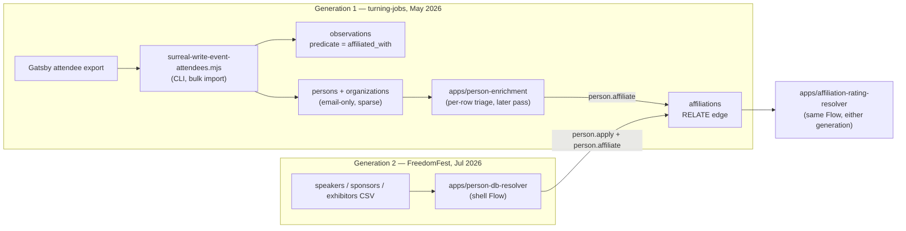
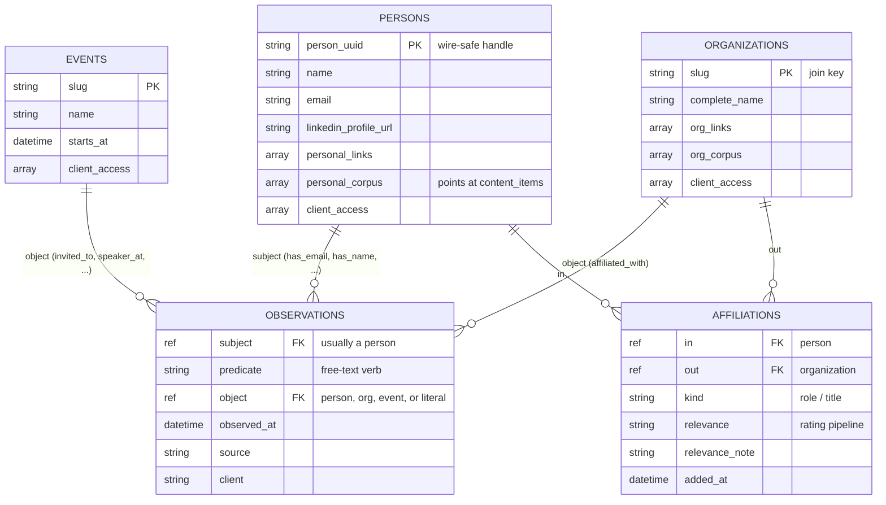

# Issue: How People, Organizations, and Their Relationships Actually Enter SurrealDB

## Why this exists

augment-it has been built one organic problem at a time — "solve the thing in front of me right now" — across many sessions, several apps, and a handful of one-off scripts. That's a good way to build, but it has a real cost: **the canonical SurrealDB layer can already do more than the operator remembers, or can currently find, in the shell UI.** Before improving the next event-attendee CSV for reach-edu, the ask was to stop and get oriented — scan `context-v/` (and the live DB, if useful) for how people and organizations actually get written to SurrealDB, how writes get tagged to a workspace, and how relationships between entities are preserved. "Tags" turned out not to be the right word for that last part — the operator's own framing, going in.

This is a special kind of issue: not a bug, not a symptom-and-root-cause hunt. It's a journey log of resolving genuine confusion about a system that already works, so no one has to re-derive this from scratch next time.

## The confusion, as stated going in

- Uncertainty about how the existing person/organization-into-SurrealDB pattern actually works, and whether "packs and bundles" (a name half-remembered) were part of it.
- Uncertainty about the exact mechanism behind workspace tagging (`reach-edu` vs other clients).
- Uncertainty about how relationships between entities are preserved — "tags" was the wrong word, but the right word wasn't obvious either.
- `clients/reach-edu/corpus/` has `funders/` and `strategies/` but no `people/` — is that a gap, and if so, what fills it?
- A working assumption that the DB capabilities outrun the UI — true in general for this codebase, but not verified for this specific slice.

## What the research resolved

Traced through `context-v/specs/`, `context-v/blueprints/`, `context-v/plans/`, the actual capability code in `services/record-surrealdb-resolver/src/person-resolver.ts`, the write scripts in `scripts/`, and live queries against the SurrealDB Cloud instance itself (ns=`main`, db=`main`) — not just what the docs claim.

### 1. Workspace tagging is one settled convention, not several

Spec of record: [[Client-Tagging-on-Canonical-Writes]]. Every canonical write carries a `client` field (the workspace slug, e.g. `reach-edu`) on the specific fact being written, and every entity row (`persons`, `organizations`, `events`) carries a **materialized `client_access: string[]`** array — the union of every workspace that has ever touched that row — plus `first_touched_by`, `last_touched_by`, `last_touched_at`. Confirmed identically in `scripts/surreal-write-persons.mjs`, `scripts/surreal-write-event.mjs`, `scripts/surreal-write-event-attendees.mjs`, and `person-resolver.ts`. One mechanism, applied consistently everywhere writes happen — CLI scripts and shell capabilities alike.

### 2. "Tagging relationships" is really two complementary primitives

Both real, both live in the same SurrealDB namespace, doing different jobs:

- **`observations`** — an append-only fact log. Every row is `{ subject, predicate, object, observed_at, source, client }`. The predicate vocabulary is free text, not an enum: `has_email`, `has_name`, `has_linkedin_url`, `invited_to`, `visited_event_page`, `email_bounced`, `affiliated_with`, `speaker_at`, `sponsor_of`, `exhibitor_at`, `attended`, `partner_of`, plus whatever an operator types via `person.add_observation`. This is the audit trail — it never gets edited, only added to.
- **`affiliations`** — an actual SurrealDB `RELATE` graph edge, `person->affiliations->organization`, separate from the observations log. It carries *mutable* state that a fact log can't: `kind` (role/title), and — the newer layer — `relevance` / `relevance_note` / `relevance_rated_by` / `relevance_rated_at` from the affiliation-rating pipeline. Queries that need "who's affiliated with whom, and how good is that lead" read `affiliations`, not `observations`.

Both get written together by the `person.affiliate` capability (`person-resolver.ts`'s `applyPersonAffiliation`) — an `affiliated_with` observation *and* the `affiliations` RELATE edge, in the same call.

### 3. Packs and bundles are a different subsystem — not the mechanism in question

Checked [[Packs-and-Bundles-Pattern]] directly. A **pack** is one source + one connector (SerpApi, Firecrawl, etc.) + one extraction schema — the unit of *finding candidate source URLs* for an entity. A **bundle** orchestrates several packs with dedup and carry-forward context. Neither writes a `persons` or `organizations` row — they produce candidate links a human (or a resolver capability) then accepts. Real system, wrong mechanism for this question. Ruled out, not a lead.

### 4. The write path already has real, shipped UI — this was the biggest surprise

`person.candidates`, `person.search`, `person.apply`, `person.affiliate`, `person.add_observation`, `affiliation.rate`, `affiliation.detail`, `person.links.add`, `person.corpus.add` all live in `person-resolver.ts` and are registered as workspace capabilities. They are **not** CLI-only or backend-only — they're wired into the shell's **Flows picker** (`shell/src/flows.svelte.ts`):

- **"Augment a CSV of People"** (`peopleRotation` → `recordCollector` + `personDbResolver`) — ingest a people CSV, match-or-create each person, then independently match-or-create their org and `RELATE` the affiliation with a role.
- **"Rate Affiliations"** (`affiliationRatingRotation` → `recordCollector` + `affiliationRatingResolver`) — reimport a relevance-rated CSV (from `scripts/export-affiliation-ratings-csv.mjs`) and write ratings back onto each `affiliations` edge.
- **"Augment a CSV of Event Attendees"** (`eventAttendeesRotation` → `recordCollector` + `recordDbResolver`) — the org-only sibling, for CSVs that are organization-centric rather than person-centric.

So for this specific slice — people, orgs, affiliations — the "DB can do more than the UI exposes" worry doesn't hold. It's built, shipped, and reachable. It just wasn't top of mind.

### 5. "A corpus folder on people" already has an answer — it just isn't files

`clients/<slug>/corpus/` has `funders/` and `strategies/` but no `people/`, and no other client has one either — confirmed, not a gap in searching. But persons already carry the DB-native equivalent: **`personal_corpus[]`** and **`personal_links[]`** array fields on the `persons` row (the same shape as `organizations.org_corpus[]` / `org_links[]`), where each `personal_corpus` entry is `{ url, kind, content_id }` pointing into the shared `content_items` table. Populated via the `person.corpus.add` / `person.links.add` capabilities, already wired into `apps/person-enrichment` and `apps/affiliation-rating-resolver`. The instinct that "some people have enough content to warrant their own corpus" was right — the system just expresses it as array fields on a canonical row instead of a directory tree.

## Verified live against SurrealDB, not just against the docs

Docs and code can describe intent that data doesn't match. Queried the live instance directly (ns=`main`, db=`main`) to check one specific worry: the turning-jobs-into-degrees event was originally bulk-imported by `scripts/surreal-write-event-attendees.mjs`, which only ever writes `observations` (predicate `affiliated_with`) — it never issues a `RELATE`. If the later, richer enrichment pass (`apps/person-enrichment`, used to work through those 177 attendees one at a time) never called `person.affiliate`, that event's data would be missing real `affiliations` edges entirely, while FreedomFest — ingested through the newer `person-db-resolver` capability path — would have them.

Checked directly:

```
turning-jobs attendees WITH an affiliations RELATE edge: 146
freedomfest people WITH an affiliations RELATE edge:      61
```

Both real. Turning-jobs actually has *more* affiliation edges now than the 122 the [turning-jobs briefing](../../clients/reach-edu/briefings/2026-05-21-turning-jobs/briefing.md) reported on 2026-06-17 — enrichment work continued after that briefing was generated, and it landed through `person-enrichment`'s calls to `person.affiliate`, not just the original bulk script. **Both ingestion paths — the CLI bulk-import-then-manually-enrich path, and the CSV-batch-through-person-db-resolver path — converge on the same canonical `affiliations` edge type.** No gap here; the two generations of tooling are compatible, not contradictory.



Same destination table, two different routes — one that started sparse and got enriched later, one that resolved fully on first pass. The rating step downstream (`affiliation.rate`) doesn't care which route a given edge took to get there.

## Decisions locked this session

- **People corpus stays DB-only.** No `clients/<slug>/corpus/people/` directory gets built. `personal_corpus[]` / `personal_links[]` on the `persons` row is the sufficient, already-working mechanism — matches how `organizations` already does it, zero new build required.
- **The confusion was both discoverability and mental model, not just one.** The capabilities and their UI flows already exist but weren't top of mind (discoverability) — and the two-primitive shape of `observations` vs. `affiliations` wasn't clear going in (mental model). This doc addresses both: the Flows-picker walkthrough above, and the schema section below.

## The data model, plainly

Five tables carry the weight:

- **`persons`** — one row per human. `id` (UUID v7), `person_uuid` (the wire-safe handle — never pass a raw SurrealDB `RecordId` across NATS/JSON, it doesn't survive the round trip), `name`, `email`, `linkedin_profile_url`, `headline`, `personal_links[]`, `personal_corpus[]`, plus the client-tagging fields.
- **`organizations`** — one row per org. `id`, `slug` (the join key), `complete_name`, `conventional_name`, `org_links[]`, `org_corpus[]`, plus client-tagging fields.
- **`events`** — one row per event. `id`, `slug`, `name`, `starts_at`/`ends_at`, `source`/`source_url`, plus client-tagging fields.
- **`observations`** — the append-only fact log described above.
- **`affiliations`** — the person↔org `RELATE` edge described above, the one place relevance ratings live.



`observations` is the append-only audit trail — every fact ever asserted, never edited. `affiliations` is the one relationship that also needs to be *mutable* (a role can change, a relevance rating gets set later), so it's a real graph edge, not just another observation row. Both point at the same `persons`/`organizations`/`events` rows; neither replaces the other.

Blueprint of record for the wider schema: [[Connecting-To-And-Using-SurrealDB]].

## Path forward

The people-corpus question is resolved and needs no build. What's still open is the actual next event CSV — not yet in the repo, so there's nothing concrete to sequence yet. Rather than block on that, this issue hands off to a plan stub that names the exact steps (which script or which Flow, in what order) to follow the moment that CSV shows up, so the answer is "run the stub" instead of "re-derive this again":

- [[Ingest-Next-Reach-Edu-Event-CSV-Into-Canonical-Layer]]

## Cross-references

- [[Client-Tagging-on-Canonical-Writes]] — the workspace-tagging spec
- [[Connecting-To-And-Using-SurrealDB]] — the DB schema blueprint
- [[Augment-From-Affiliations]] — the affiliation-rating CSV round-trip (shipped)
- [[Person-Aware-Canonical-Resolver-Extension]] — the plan that built `person.*` capabilities
- [[Sparse-Person-Enrichment-Surface]] — the per-person triage surface (`apps/person-enrichment`)
- [[Packs-and-Bundles-Pattern]] — ruled out as unrelated, documented here so it doesn't get re-suspected
- `services/record-surrealdb-resolver/src/person-resolver.ts` — ground truth for every capability named above
- `scripts/surreal-write-event.mjs`, `scripts/surreal-write-persons.mjs`, `scripts/surreal-write-event-attendees.mjs` — the original CLI-only path, still valid, now complemented (not replaced) by the shell capabilities
