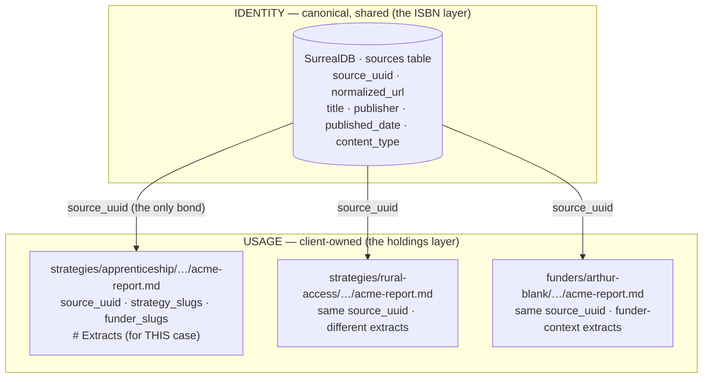
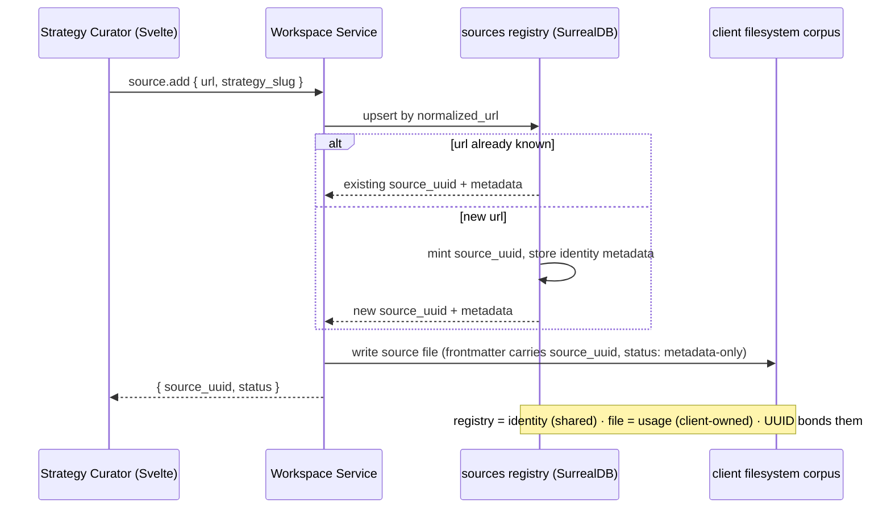
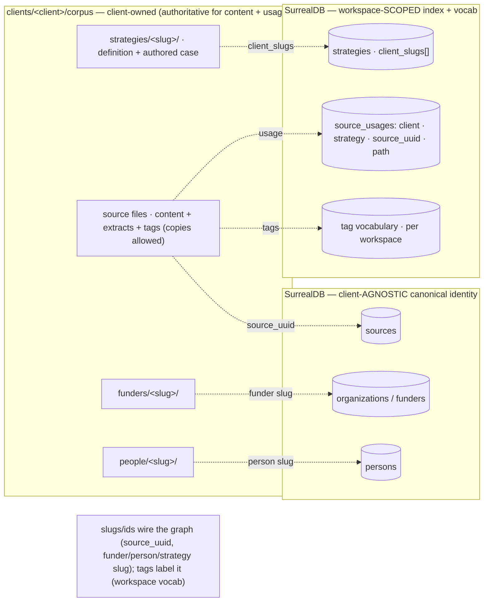
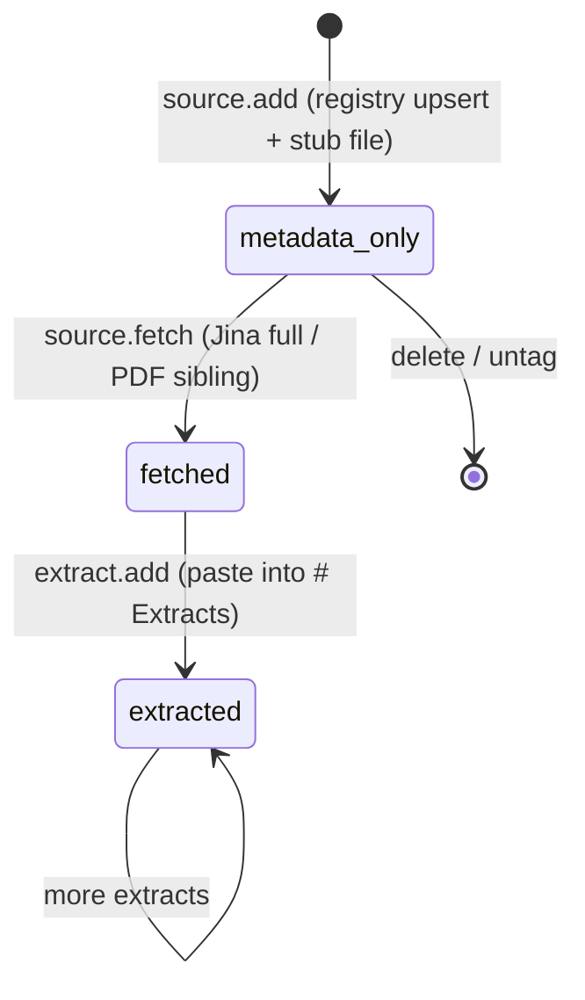
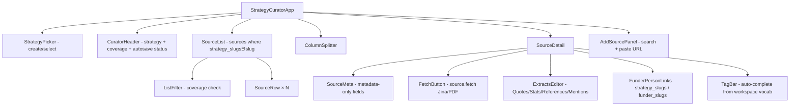

# Strategy Curator — An Entry-Point App for augment-it

> **Drift note (2026-07-06/07):** the UI now displays as **"Corpora
> Curator"** — the app stopped being strategy-specific once humain-vc
> needed the identical shape for "theses." The package/folder/remote id
> (`apps/strategy-curator`, `strategyCurator`) are unchanged; this is a
> display-copy rename only. More load-bearing: `DOMAIN_TYPE` is no longer
> a hardcoded `'strategy'` constant anywhere in this spec's code — it's
> operator-defined per domain via a "Type" field on the create form
> (`curation.svelte.ts`'s reactive `domainType`, free text), defaulting per
> *workspace* (`WorkspaceSummary.default_domain_type`, from each client's
> `DEFAULT_DOMAIN_TYPE` .env — humain-vc: `thesis`, reach-edu: `strategy`).
> Everywhere this doc says "the strategy" or assumes a single fixed type,
> read it as "the active domain type" instead. A `domain.retype` capability
> now exists too (DB + filesystem migration between types) —
> `consumer-immunology` has already been moved `strategy` → `thesis` with
> it. See [[../plans/Build-Order-Humain-VC-Unlock-Flow]] Step 5 (now done)
> for the full account; only singular/plural noun rendering through the
> rest of the UI copy remains open.

An operator working a client (today: reach-edu) starts from a **strategy** — a case
they're building — and gathers the *sources* that support it: web pages and PDFs, first
captured as just metadata, then downloaded in full on demand, then mined for **extracts**
(quotes, stats, references, mentions). The hard part isn't any one screen; it's keeping
the **strategy ↔ source ↔ funder ↔ person** graph coherent across independent
microfrontends, a remote database, and a per-client filesystem — *without getting lost or
decoupling.* This spec is the entry-point app that does that, built the augment-it way:
an independent Svelte remote that integrates into the shell, writing only through
workspace capabilities, over a spine that splits **identity** (canonical, shared) from
**usage** (client-owned).

> **Lineage.** This is the augment-it + SurrealDB realization of
> [[Source-Curation-Surface-Component-Spec]] (the framework-neutral component spec, itself
> distilled from the working `memopop-orchestrator/tools/curate_sources.py` tool). It
> honors the corpus conventions in `clients/reach-edu/corpus/AGENTS.md` and the
> `strategy_slugs` mapping in `clients/reach-edu/corpus/strategies/AGENTS.md`. The
> `curate_sources.py` tool remains the behavioral oracle for the source-list interactions.

## The resolving idea: identity vs. usage

A "source" is two concerns wearing one name. Splitting them is what makes everything else
fall into place — dedup, client ownership, redundant copies, and per-strategy extracts.



| Concern | What it holds | Where | Owner |
|---|---|---|---|
| **Identity** (ISBN) | `source_uuid`, `normalized_url`, bibliographic metadata (title, publisher, published_date, content_type, jina_status) | **`sources` table in SurrealDB** — the canonical registry | shared / canonical |
| **Usage** (holdings) | the local file copies, `strategy_slugs[]`, `funder_slugs[]`, the **extracts**, operator notes | **client filesystem** (per-client private repo, Path D) | the client |

**The UUID is the only bond.** A library never re-catalogs a book; it references the ISBN
and keeps its own holdings + margin notes. Here the registry says "this URL *is* this
document, here's its UUID"; the client keeps their own copies, tags, and extracts.

Three things this dissolves:

- **Client data ownership.** The shared registry holds only *identity* — public-web
  bibliographic data. Everything client-private (copies, tags, extracts, notes) stays in
  the client's owned scope. Nobody gives up anything that's actually theirs.
- **Scope-agnostic.** Shared-registry vs. per-client-registry is a *config* decision, not
  an architecture one — same `sources` schema, same write-flow. Default shared (free
  cross-client canonical UUIDs + "who else cites this"); a client demanding isolation
  points the same code at their own `sources` table.
- **Per-strategy extracts, for free.** Extracts are *usage*. Because **redundant copies
  are allowed** (same source, same UUID, many files), a source serving three strategies
  has three copies — each with its own `# Extracts` for that case. Different quotes for
  different cases falls out with zero extra machinery.

## Clients are the top scope

augment-it is multi-tenant by **client** (`clients/<client>/` — today only `reach-edu`).
The same identity/usage seam runs along the client boundary, one level up:

- **The canonical identity layer is client-AGNOSTIC.** A URL's identity, an organization,
  a person — none is owned by a client. The `sources` registry (and the existing
  `organizations` / `persons` tables) are shared across clients, keyed by natural keys
  (`normalized_url`, slug). reach-edu and a future client that both cite the same report
  get the **same `source_uuid`**.
- **Strategies and usage are workspace-SCOPED.** A client *is* a **workspace** — we reuse
  augment-it's existing `workspace.*` tenant model rather than add a `clients` table, so
  `client_slug` maps to a workspace id. A **strategy belongs to one or more workspaces**
  (`client_slugs[]` — **multi-client from the start**, because shared/cross-client
  strategies are coming soon). A workspace's instance lives at
  `clients/<client>/corpus/strategies/<slug>/`, and a *usage* (this client, in this
  strategy, uses this source, with these extracts) is keyed by
  **(client_slug, strategy_slug, source_uuid)**. The filesystem already encodes the client
  (the path), and content-ingest already stamps `client_id` into corpus frontmatter.

So the relationship reads top-down: **workspace(s) → strategies → usage of sources /
funders / people**, over a shared pool of canonical identities. A strategy shared by two
workspaces carries both slugs; each workspace's *usage* (its copies + extracts) stays its
own.

## Tags vs. slugs (don't conflate them)

These are two different things and the spec keeps them strictly apart:

- **Slugs** are *identifiers* — lowercase-kebab, structural, one canonical value per thing:
  `strategy_slug`, `funder_slug`, the workspace/client id, `source_uuid`. They wire the
  graph's edges. Not user-facing labels.
- **Tags** are *labels* — a controlled, workspace-level vocabulary for organizing and
  finding things. The conventions are **hard requirements**:
  - **Train-Case, no spaces** — `Workforce-Development`, `Apprenticeship`, `Rural-Access`.
    Normalized on write.
  - **Workspace-level vocabulary** — owned by the workspace (client), **not** in the
    canonical `sources` registry. Tags are *usage*; a URL's shared identity never carries a
    client's tags.
  - **Auto-complete, never free-form** — the UI suggests from the workspace's existing tag
    vocabulary, so you don't accumulate `workforce-dev` / `Workforce-Development` /
    `WorkforceDev` variants. A genuinely new tag is added deliberately, then reused.
  - **Universal** — every entity (sources, funders, people, strategies) carries `tags: []`.

Slugs wire the graph; tags label it. Keep tags out of the canonical registry and behind an
auto-complete that reads the workspace vocabulary.

## The write-flow (upsert-by-natural-key)

This is the same pattern augment-it already uses for organizations (`resolver.apply`
upserts an org by `slug`, returns a canonical `org_id`) — here keyed by `normalized_url`.



**Registry is queried first, always.** Identity is minted once per URL, reused everywhere.
The file is written second, with the canonical UUID stamped in. Redundant files are fine
and expected; they are never the source of canonical truth — the registry is.

## The domain catalog — strategy is one *type*

A "strategy" is one **type** of a more general entity: a **domain** — a typed grouping that
corpus content, funders, and people get organized under. The catalog is generic and `type`
discriminates: `strategy | topic | thesis | market-segment | category | …`. This is
**faceted classification** (a typed taxonomy), *not* Domain-Driven Design — "domain" is the
operator's chosen name and carries none of DDD's bounded-context semantics.

- One SurrealDB table **`domains`**, unique on **(type, slug)** — "apprenticeship" can be a
  strategy *and* a topic.
- Filesystem home is **`corpus/<type-plural>/<slug>/index.md`** (`strategies/`, `topics/`,
  `theses/`, `categories/`, `market-segments/`). The `strategies/` bucket is simply the
  `type=strategy` folder.
- **`strategy.*` is operationalized as `domain.*` with `type='strategy'`.** This app
  (strategy-curator) is the strategy-type *view*; the canonical capabilities are
  `domain.create / domain.list / domain.assemble`, always carrying `type`.
- `source_usages` keys on **(client_slug, domain_type, domain_slug, source_uuid)**; a
  content/funder/person file references domains as compact **`type:slug`** strings, e.g.
  `domains: [strategy:apprenticeship-wedge, topic:workforce-development]`.

Type-specific structure (a thesis's claim, a market-segment's sizing) lives in the `index.md`
body or optional per-type frontmatter — it doesn't force separate tables. The data model
below is written in strategy terms; read `strategy_slug` ≈ a domain's `slug` with
`type='strategy'`.

## Data model

### `strategy` (workspace-scoped, multi-client)

```ts
type Strategy = {
  strategy_slug: string;      // unique identifier
  client_slugs: string[];     // owning workspace(s) — multi-client from the start
  title: string;
  definition: string;         // statement of the case; lives in strategies/<slug>/
  tags: string[];             // Train-Case, from the workspace tag vocabulary
  created_at: string;
};
```

Belongs to one or more workspaces (`client_slugs[]`). A workspace's instance is homed at
`clients/<client_slug>/corpus/strategies/<strategy_slug>/`.

### `sources` (SurrealDB — canonical identity, client-agnostic)

```ts
type SourceIdentity = {
  source_uuid: string;        // canonical; minted once per normalized_url
  normalized_url: string;     // dedup key (query/hash-stripped, trailing-slash-removed)
  url: string;                // exact, as first seen
  title: string;
  publisher: string;
  published_date: string;     // ISO or ""
  content_type: string;       // text/html, application/pdf, …
  has_pdf: boolean;
  jina_status: number | null;
  first_seen_at: string;
};
```

Bibliographic metadata only — **never extracts, never strategy/usage data, never tags**
(tags are workspace-owned usage, not canonical identity).

### Local source file (filesystem — client-owned usage; copies allowed)

```markdown
---
source_uuid: 5f3a…            # from the registry — SAME across every copy
normalized_url: acme.org/research/2026-report
url: https://acme.org/research/2026-report
client_id: reach-edu          # owning client (existing corpus convention) — the client scope
title: "Acme 2026 Workforce Report"
publisher: "Acme"
published_date: 2026-03-01
strategy_slugs: [apprenticeship-as-wedge]   # this entity's strategies (many-to-many)
funder_slugs: [arthur-blank-foundation]      # which funders this source bears on
tags: [Workforce-Development, Apprenticeship] # Train-Case, from the workspace vocabulary
status: metadata-only        # metadata-only → fetched
content_pulled: false
binary_asset:                # present once a PDF is downloaded (see conventions)
fetched_at:
---

# Acme 2026 Workforce Report
<!-- full Jina markdown lands here on source.fetch; empty/excerpt while metadata-only -->

# Extracts
## Quotes
## Stats
## References
## Mentions
```

- `strategy_slugs[]` and `funder_slugs[]` carry the **many-to-many** mapping *on the
  entity* (content, funders, and people all carry `strategy_slugs[]`). A strategy is
  reconstructed by querying for everything whose `strategy_slugs` contains its slug —
  filesystem is source of truth, SurrealDB indexes it for fast queries.
- The four extract buckets — **Quotes** (verbatim), **Stats** (numbers/data points),
  **References** (sources the piece itself cites), **Mentions** (named people/orgs, which
  also feed the person↔strategy mapping). Plain markdown sections for v1; LFM directives
  (`:::quote{…}`) are a later enrichment, not v1.

### The spine — where each thing lives



## Capabilities (the only write path)

Every mutation is an `entity.verb` capability → workspace → NATS → a domain service.
No microfrontend touches SurrealDB or the filesystem directly — that is the discipline
that keeps registry and files in lockstep.

A "service" here is just an existing backend process that owns a slice of logic — e.g.
**content-ingest** owns Jina fetch + PDF + corpus file-writes; the **resolver** owns
SurrealDB and the upsert-by-natural-key pattern. We do **not** add a new service: strategy
and registry logic folds into the **resolver** (it already owns SurrealDB), file/content
logic stays in **content-ingest**. So the only genuinely new code is the Svelte remote plus
new capability *handlers* added to those two existing services.

| Capability | Does | Service |
|---|---|---|
| `domain.create` / `domain.list` / `domain.assemble` (carry `type`; `strategy` today) | CRUD a typed domain. **create** upserts the DB row *and* (cross-service) writes `<type-plural>/<slug>/index.md` — filesystem-authoritative | resolver (+ content-ingest via internal `corpus.domain.write_index`) |
| `source.add` | upsert registry by `normalized_url` → mint/reuse `source_uuid`; write a **metadata-only** file tagged with the current `strategy_slug`; record a `source_usages` row; if the source already exists, append the slug | resolver (registry + usages) + content-ingest (file) |
| `source.fetch` | pull **full** content via Jina into the file body; if PDF, download the binary sibling with the `binary_asset` convention | content-ingest |
| `extract.add` | append a pasted extract into *this copy's* `# Extracts` (`## Quotes/## Stats/## References/## Mentions`) | content-ingest |
| `strategy.tag` | append/remove a `strategy_slug` edge on an existing content/funder/person entity | resolver |
| `tag.suggest` | auto-complete tags from the **workspace** vocabulary (Train-Case) | resolver |
| `tag.apply` | add/remove a Train-Case tag on **any** entity (source/funder/person/strategy) | resolver + content-ingest (frontmatter) |
| `source.search` | SearXNG search to find candidate sources | social-search |
| `strategy.assemble` | query everything where `strategy_slugs` contains `<slug>` (content + funders + people) via the `source_usages` index | resolver |

**Reuse map — most of this already exists:** Jina fetch (`content_ingest.preview_url`),
full corpus write (`corpus.add`), PDF binary + `binary_asset` frontmatter + git-lfs
(`corpus.inbox.add` / `binary-asset.ts`), SearXNG connectors (`social-search`), and the
upsert-by-natural-key pattern (`resolver.apply`).

## The source lifecycle (metadata-first → fetch → extract)



**PDF convention (reuse exactly):** a fetched PDF is saved as a sibling of its markdown
with the same basename — `<basename>.md` + `<basename>.pdf` — with `binary_asset.filename`
in the markdown frontmatter and the file tracked via the per-client `.gitattributes`
git-lfs discipline. This is already implemented in content-ingest; do not reinvent it.

## The Svelte microfrontend

A new independently-runnable remote — **`strategy-curator`** — following the exact
`pack-runner` pattern, mounted into the shell, talking to augment-it only through the
workspace adapter.

**Seams (from the real architecture):**
- **Build:** `rsbuild.config.ts` → `pluginModuleFederation({ name:'strategyCurator',
  exposes:{ './mount':'./src/mount.ts' } })`, own port (~`:3017`), `dts:false`. Depends on
  `@augment-it/workspace` + `@augment-it/theme`. Standalone entry `src/index.ts` mounts
  `App` at `#root`; `src/mount.ts` exports `mountStrategyCurator(target)` returning
  `{ destroy }`.
- **Shell:** add to `shell/src/remotes.ts` `REMOTES` + one line in `shell/rsbuild.config.ts`
  `remotes`. As the **entry point**, it sits at the head of `ROTATION` (or its own landing).
- **Workspace:** every action is `workspace.invoke('strategy.*' | 'source.*' | 'extract.*' |
  'tag.*', args)`; state is a Svelte 5 runes singleton (per [[Per-App-Workspace-Conventions]]).

### Theming — hard requirement

The surface **must** use augment-it's theme/CSS discipline — **no hardcoded colors, no
ad-hoc inline color styles.** (The framework-neutral [[Source-Curation-Surface-Component-Spec]]
used inline CSS for brevity; that does **not** carry over here.) Concretely:

- Import `@augment-it/theme/theme.css` and `@augment-it/theme/mode-switcher` (exactly as
  `pack-runner`'s `src/index.ts` does).
- Style only through the **two-tier design tokens** (CSS custom properties) — never a
  literal hex value in a component.
- Support all **three modes** (light / dark / vibrant); verify the surface renders correctly
  in each.

See the `theme-system` skill and the `@augment-it/theme` package.



The component responsibilities, store shape (`CurationState`), controlled-field
discipline, derived filtering, and reorder/autosave behavior carry over verbatim from
[[Source-Curation-Surface-Component-Spec]] — adapted so the **entry is strategy
selection** and the **store keys on `strategy_slug`**.

## How it stays coupled (the answer to "juggle without decoupling")

1. **IDs are the spine.** `source_uuid` (registry-minted), strategy/funder/person slugs.
   A redundant copy is identifiably the same source because it carries the same UUID.
2. **Capabilities are the only write path.** `source.add` writes registry *and* file in
   one operation; they cannot drift. No surface writes storage directly.
3. **Identity vs. usage** keeps the shared part minimal (bibliographic) and the owned part
   local (copies, tags, extracts) — so independence and integration coexist.
4. **The strategy is a query, not a container.** Assembled by `strategy_slugs ∋ slug` over
   content + funders + people — nothing has to be kept in sync in two places.

## Decisions (resolved from the 2026-06-29 audit)

1. **Storage substrate — local filesystem now, R2 later.** A remote corpus filestore
   (Cloudflare R2) was nearly working but is **deferred** for deliverable time; v1 uses the
   **local filesystem**. Build the corpus access behind a thin storage interface so the R2
   migration is a backend swap, not a UI change. Source usage copies live under
   `strategies/<strategy-slug>/<source-slug>.md` (a copy may also exist under
   `funders/<funder-slug>/` — same `source_uuid`, different usage context).
2. **`source_usages` index — build it.** A SurrealDB table
   `{ source_uuid, client_slug, context (strategy|funder), corpus_path }`. Even though it
   takes discipline to keep accurate (write it inside the `source.add` / `extract.add`
   handlers), the queryability ("where does this source appear") is worth it. It's how
   `strategy.assemble` answers without walking the filesystem.
3. **Registry scope — shared `sources` table.** One canonical, client-agnostic registry,
   keyed by `normalized_url`.
4. **No new service.** ("strategy-store" was jargon — a "service" is just an existing
   backend process that owns a slice of logic.) Strategy + registry + usages + tag logic
   folds into the existing **resolver** service (it already owns SurrealDB); file/content
   logic stays in **content-ingest**. The only new code is the Svelte remote + new capability
   handlers in those two.
5. **People — `corpus/people/` bucket.** Add a `people/<person-slug>/` filesystem bucket,
   each carrying `strategy_slugs[]` + `tags[]`, bonded to the SurrealDB `persons` table by
   slug. Same shape as `funders/`.
6. **Multi-client from the start.** A strategy carries `client_slugs[]` (many-to-many to
   workspaces); shared/cross-client strategies are expected soon. Each workspace's *usage*
   (its copies + extracts) stays its own.
7. **Reuse `workspaces` as the tenant.** A client *is* a workspace; `client_slug` maps to a
   workspace id. No separate `clients` table.

**Resolved 2026-06-29:** a strategy's definition file is **`index.md`** inside its dir
(`strategies/<slug>/index.md`). Still genuinely open (small): the exact `source-slug`
formatting rule for per-source files.

## Implementation (as built — 2026-06-29)

Built in three increments. Everything below **typechecks** (UI `svelte-check` 0/0; resolver,
content-ingest, workspace `tsc` 0 errors) **and** — as of Increment 3 — is **runtime-verified
end-to-end against the live stack** (`pnpm stack up`): UI → workspace WS → NATS → resolver →
SurrealDB + content-ingest → corpus filesystem, exercised by firing each capability subject
directly over NATS and confirming the DB rows + corpus files that result.

### Increment 1 — the Svelte remote
`apps/strategy-curator/` — federation remote `strategyCurator` on `:3017`, the exact
pack-runner pattern (`./mount`, standalone `index.ts`, `@augment-it/theme` + tokens-only CSS
namespaced `.sc-app`, three modes). Runes store `curation.svelte.ts` is the single source of
truth; **all writes go through `workspace.invoke`**. Components: `StrategyPicker` (the create
form), `SourceList`, `SourceDetail`, `TagBar`. Registered in `shell/src/remotes.ts`
(`EXTRA_REMOTES`) + `shell/rsbuild.config.ts` — deliberately **not in `ROTATION` yet**.

### Increment 2 — the domain catalog + registry + `index.md`
- **Resolver** (`services/record-surrealdb-resolver/src/domains.ts`, `registerDomainHandlers`,
  wired in `server.ts`): strict-mode SurrealDB, so an `ensureDomainSchema` runs `DEFINE TABLE/INDEX
  IF NOT EXISTS` once. SCHEMALESS tables **`sources`** (canonical, by `normalized_url`, mints
  `source_uuid`), **`domains`** (typed; unique `(type, slug)`; multi-client `client_slugs[]` +
  `tags[]`), **`source_usages`** (`client_slug × domain_type × domain_slug × source_uuid` edge +
  `tags[]`), **`tag_vocab`** (per-workspace). Handlers: `domain.create/list/assemble`,
  `source.add`, `tag.suggest/apply`. `strategy` is just `type='strategy'`.
- **`domain.create` is filesystem-authoritative.** The resolver handler upserts the DB row, then
  issues a NATS request to content-ingest's **internal `corpus.domain.write_index`** subject,
  which writes `clients/<client>/corpus/<type-plural>/<slug>/index.md` (idempotent — never clobbers
  an authored body) and returns `corpus_path`. The domain's home is a real folder + definition
  file; the DB row is the rebuildable index. (Cross-service: resolver owns the DB, content-ingest
  owns the corpus volume.)
- **content-ingest** (`corpus.ts addDomainIndex` + a `DOMAIN_FOLDERS` type→plural map + handler):
  writes `index.md` with frontmatter `{ type, slug, title, client_slugs[], tags[], created_at }`.
- **workspace** (`capabilities.ts`): the 6 browser capabilities (`domain.*`, `source.add`,
  `tag.*`) → subjects + 30s timeouts. `corpus.domain.write_index` is internal
  (resolver→content-ingest), **not** a browser cap.
- **Active workspace threading:** `dispatch` passes args verbatim (does not inject the tenant),
  so the UI resolves the active workspace once via `workspace.active` and threads `client_slug`
  into every workspace-scoped call.
- **Error discipline:** handlers reply `{ ok:false, error }` on failure; the UI `call()` treats
  that as an error (surfaces it in the banner) and the create/add actions **no longer fabricate
  optimistic success** — so "created `…/index.md`" means it actually wrote.

### The create flow (as built)
`title` → **live-editable `slug`** (re-slugified, lowercase-kebab) → **tags** (`toDashed`,
casing preserved; workspace-vocab auto-complete) → **Create** → `domain.create { type:'strategy' }` → DB upsert
**+** `index.md` write → UI lists it + shows the `corpus_path`. (The UI carries `type='strategy'`
on every `domain.*` / `source.*` / `tag.*` call.)

### Increment 3 — the full per-source surface (runtime-verified)
`source.add` now writes a real metadata-only file, and the whole source lifecycle is operator-
controllable from `SourceDetail`. Every capability below was fired over NATS against the live
stack and confirmed on disk + in the DB.

- **`source.fetch`** — full Jina markdown into the file body; PDF URLs download the binary
  sibling (`binary_asset`). Preserves any existing `# Extracts` and analyst `tags:` across the
  rewrite.
- **`source.retry`** — re-fetch with a Jina **cache bypass** (`X-No-Cache: true`), for stale or
  interstitial captures.
- **`source.update`** — edit the bibliographic fields (`title` / `publisher` / `published_date`)
  in-form; writes both the SurrealDB registry **and** the file frontmatter. A `title` edit also
  **re-slugs and renames the file** so a source never stays stuck on a junk interstitial name
  (e.g. `just-a-moment` from a Cloudflare challenge). An explicit **`slug`** field renames the
  file directly (the Filename field) and wins over the title-derived slug.
- **`source.remove`** — drops the `(client, domain, source)` usage row + deletes the file (and
  binary sibling); the canonical `sources` registry row is kept (shared identity).
- **`source.attach`** — the **landing-page-vs-PDF** answer. When a source's `url` is a profile
  page (e.g. `gao.gov/products/…`) and the real report is a separate, often anti-bot PDF, the
  analyst downloads it and attaches it **in the source form**. Identity (`url`) is unchanged;
  the bytes hang underneath as `sources/<slug>.pdf`, status flips to `fetched`. The file rides
  base64 over the WS→NATS path the app already uses for CSV uploads. content-ingest then
  **Ghostscript-compresses** any PDF >3MB (`-dPDFSETTINGS=/ebook`), keeping the smaller of
  compressed/original (never inflates), and records `bytes` / `original_bytes` / `compressed` /
  `sha256` in the `binary_asset` block.
- **`extract.add`** — append a pasted extract under `## Quotes / ## Stats / ## References /
  ## Mentions`.
- **`tag.apply`** — updates the usage's `tags[]` in SurrealDB **and mirrors the list into the
  file frontmatter `tags:` block**. Tags now use **`toDashed`**: dashes-not-spaces, **casing
  preserved** (`Impact of AI` → `Impact-of-AI`, not `Impact-Of-Ai`) — this **supersedes** the
  earlier Train-Case rule, which mangled small words and acronyms.

**Transport limits (the upload path).** Browser→workspace→content-ingest sends file bytes as
base64 over NATS, so `nats.conf` `max_payload` gates it: bumped **8MB → 48MB** so a ~28MB report
(≈38MB base64) fits; the UI guards at 32MB. content-ingest's image now installs `ghostscript`.
If the backend ever moves off-box (no shared filesystem), the right evolution is a direct HTTP
upload endpoint that bypasses NATS entirely — noted, not built.

### Increment 4 — bibliographic capture (Jina JSON) + save UX
- **Jina JSON, not markdown.** content-ingest now requests `Accept: application/json` from
  `r.jina.ai`. The markdown preamble only carries title + published time; the JSON `data.metadata`
  block carries `author`, `og:site_name` (→ publisher), and `article:published_time` (→ date). We
  extract all three on `source.add` and `source.fetch` and write them to the file frontmatter
  **and** the SurrealDB `sources` registry. A re-fetch preserves analyst-corrected values when
  Jina omits a field. (Gotcha: a stale `Accept: 'text/markdown'` header silently routed every
  fetch through the markdown fallback for a while — all the JSON-metadata code was dead behind a
  failing `JSON.parse`. The header is the load-bearing line.)
- **`authors` is an array.** Jina returns author as a *string* for one author and an *array* for
  several; we normalize to `string[]` (one author → a one-element array). Stored as a YAML list
  in frontmatter, an array column in the registry, edited in the form as a comma-separated field.
- **Editable bib fields.** `SourceDetail` exposes Title / Filename / **Author(s)** / Publisher /
  Published date — all auto-filled on fetch, all hand-editable, each writing through to registry
  + file.
- **Paid Jina key** is read from `JINA_API_KEY` (compose env ← `augment-it/.env`); absent → free
  tier, which honors `Accept: application/json` less consistently.
- **Save-confirmation pulse.** A `commitOnEdit` Svelte action commits each field on Enter (blur)
  or change and pulses the border green (`--color-confidence-high`) on success, fading back over
  ~1.6s — "saved ✓" on the field itself. No green on error.
- **source_slug echo + fallback.** `source.add` / `fetch` / `retry` now echo `source_slug` so an
  in-session source connects to its on-disk file immediately (the Filename field + rename had been
  blank until a reload). The UI also derives the slug from `corpus_path` as a fallback, so the
  field never goes blank for a file that exists.

### Gotchas the live stack taught us (checklist for the next SurrealDB-over-NATS service)
1. **Strict mode → `DEFINE TABLE/INDEX IF NOT EXISTS` before any use** (run once via an
   `ensureDomainSchema` guard).
2. **`ORDER BY <field>` requires `<field>` in the `SELECT` projection** (SurrealDB 2.x idiom
   rule) — `created_at` bit us on `domain.list` / `assemble` / `tag.suggest`.
3. **Identity keys must be strings, never the SDK `uuid` type** — `rand::uuid::v7()` returns a
   `uuid` that does **not** survive JSON/NATS round-trips and won't match in `WHERE`; wrap with
   `type::string(...)`. Same lesson as the resolver's "identity is the slug, not the RecordId."
4. **"Is my change live?"** A backend code change is inert until its container is rebuilt.
   `pnpm stack up` = `docker compose up --build -d` (rebuilds all); a hand-run
   `docker compose up --build -d <svc>` only rebuilds that one. First debug step when a backend
   change "doesn't work": `docker compose ps` (fresh `Up Ns` vs `Up Nh`?), then `grep` the
   change inside the running container, then fire the NATS subject directly to isolate
   backend-correct from frontend-stale.
5. **UI reactivity:** mutating a nested `$state` property in place doesn't reliably re-render —
   replace the array element with a **new object** (`replaceSource({ …f, [field]: v })`).
6. **A disabled field that "won't accept input"** usually means its backing value is missing
   from stale data — reload to re-fetch, don't assume a broken handler.

### Not yet built (next increment)
- **Interstitial detector** — flag `Just a moment…` / `Preparing to download…` / soft-403
  captures at add/fetch time and refuse to derive a slug from the junk title.
- **Auto text-extraction from attached PDFs** — `source.attach` stores + marks fetched, but
  doesn't yet pull the PDF text into the body (local PDF→text needs a parser; Jina only does
  URLs). Extracts are added manually via the panel until then.
- **`content_url`** — an optional second URL for "the document is fetchable but lives
  elsewhere": `source.fetch` pulls from `content_url` instead of `url`, and **still downloads
  and stores the bytes locally** (same `binary_asset` sibling convention). Download URLs rot
  over months/years, so the local copy is the durable artifact — `content_url` removes the
  manual-download step, never the download itself. (Semantics corrected 2026-07-06.)
- **Domain-type selection in the UI** — the backend is fully generic (typed `domains` table;
  `DOMAIN_FOLDERS` already maps `thesis → theses` etc.), but the UI pins
  `DOMAIN_TYPE = 'strategy'` (`curation.svelte.ts`). Needed now that humain-vc curates by
  **thesis**: a type selector/creator in the picker, a per-workspace default type + noun
  (reach-edu → "Strategy", humain-vc → "Thesis") rendered through all copy, and a small
  `domain.retype` capability (humain-vc's `consumer-immunology` is already mis-filed under
  `strategies/`). See the ai-labs exploration
  [[../../../context-v/explorations/Two-Clients-One-Flow-Corpora-Auth-and-Deployment-Converge|Two-Clients-One-Flow-Corpora-Auth-and-Deployment-Converge]].
- `corpus/people/` bucket; promotion into `ROTATION`.

## Acceptance criteria

1. Create/select a strategy from the entry surface; the source list shows everything where
   `strategy_slugs ∋ slug`.
2. Add a source → registry upserts by `normalized_url` (same `source_uuid` returned for a
   known URL), a metadata-only file is written, tagged with the strategy slug.
3. "Download" fetches full content via Jina; a PDF is saved as a same-basename sibling with
   the `binary_asset` frontmatter + git-lfs convention.
4. Paste extracts into `## Quotes / ## Stats / ## References / ## Mentions`; they persist in
   *this copy's* body; a different strategy's copy of the same source keeps its own extracts.
5. The same source used by N strategies is **one `source_uuid`, N files** — never a second
   identity.
6. Runs standalone on its port **and** mounts in the shell; all writes go through
   `strategy.*` / `source.*` / `extract.*` capabilities (no direct FS/DB writes from the UI).
7. A strategy carries `client_slugs[]` (multi-client); the canonical `sources` / funders /
   persons identities are client-agnostic (a URL shared by two workspaces = one
   `source_uuid`), while strategies and usage are scoped to a workspace.
8. **Theme discipline:** the surface uses `@augment-it/theme` tokens only — no hardcoded
   colors — and renders correctly in all three modes (light / dark / vibrant).
9. **Tags:** every entity (source / funder / person / strategy) carries `tags[]`; tags are
   **dash-joined with casing preserved** (`toDashed` — `Impact of AI` → `Impact-of-AI`, *not*
   Train-Case), drawn from the **workspace** vocabulary via **auto-complete**, written through
   to the entity's file frontmatter `tags:` block, and never written into the canonical
   `sources` registry.
10. People live under `corpus/people/<slug>/` carrying `strategy_slugs[]` + `tags[]`,
    bonded to the SurrealDB `persons` table by slug.

## Related

- [[Source-Curation-Surface-Component-Spec]] — the framework-neutral component spec this realizes.
- `clients/reach-edu/corpus/AGENTS.md` · `clients/reach-edu/corpus/strategies/AGENTS.md` — corpus + `strategy_slugs` conventions.
- [[Per-App-Workspace-Conventions]] · [[Chat-As-Verb-Surface-Patterns]] — the runes-store + capability-registry conventions.
- [[Funder-Content-Corpus-Workflow]] · [[Download-PDFs-into-Corpus-Inbox]] — the Jina + PDF + git-lfs machinery to reuse.
- [[Canonical-Entity-Registry-on-SurrealDB-Cloud]] — the SurrealDB resolver this extends with a `sources` table.
- `memopop-orchestrator/tools/curate_sources.py` — the behavioral oracle for source-list interactions.
- [[../explorations/Augment-It-Has-Outgrown-One-Flow-The-Choose-A-Flow-Front-Door]] — questions whether this app's 2026-07-06 promotion to the head of shell `ROTATION` is the right long-term home, given it shares no data spine with the CSV-augmentation steps that follow it in that array; proposes a header-level "Build Corpora" jumbo popdown entry as the on-ramp instead.
