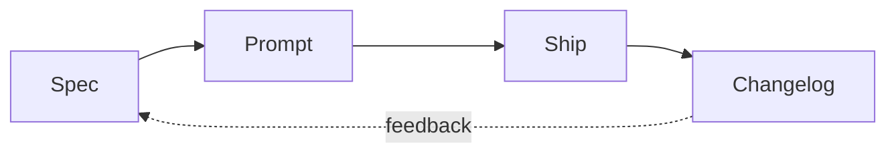

# Voice and Shape

How a Lossless changelog entry sounds, and how it's structured.

## Voice in one sentence

**We are moving fast and learning a ton and we are excited to share this with you. We speak human, we are human. But we are nerdy and we open our nerdy doors.**

## Voice in practice

### Do

- **First person plural** for team work: "we shipped", "we tried", "we learned"
- **First person singular** when accurate (a solo session, an individual decision)
- **Active verbs** — "we shipped X" not "X was shipped"
- **Present tense for what's now true**, past tense for the journey: "Skills now compose. We had to wire them by hand to get there."
- **Direct address** to the reader is welcome: "If you're new here, the short version is..."
- **Show the messy middle.** "We tried two approaches before this one. Here's why we didn't keep them."
- **Specifics over generics.** "Refactored the image pipeline" → no. "Replaced the cdn-fronted resizer with a build-time `astro:assets` flow because the old one failed on transparent PNGs" → yes.
- **Honest reaction.** "We were surprised this took as long as it did." Reads better than pretending it didn't.

### Don't

- ❌ Corporate filler: "various improvements", "enhanced experiences", "streamlined workflows"
- ❌ Faux-humility that hides the work: "Just a small update" when it isn't
- ❌ Faux-excitement that overpromises: "Game-changing" when it's incremental
- ❌ Marketing-speak that requires translation
- ❌ Comprehensive lists of every commit — that's `git log`, not a changelog

### Jokes

Jokes that land are welcome. Jokes that don't land are silently cut. The test: read it aloud. If you smile, keep it. If you wince, kill it.

## The shape: previewable head, deeper tail

List views and preview cards on the rendered site use the **first sections** of the body as preview content. Structure for that reality:

```
┌─────────────────────────────────────┐
│ Title                               │
│ Lede                                │  ← all in frontmatter or H1
├─────────────────────────────────────┤
│ ## Why Care?                        │
│                                     │  ← preview-friendly
│ Audience-facing answer.             │     (often shown in lists)
├─────────────────────────────────────┤
│ ## What's New?                      │
│                                     │  ← preview-friendly
│ Concrete summary.                   │     (often shown in lists)
├─────────────────────────────────────┤
│ ## (deeper sections)                │
│                                     │
│ Story, journey, technical detail,   │  ← clicked-through content
│ diagrams, code, retrospective.      │
│                                     │
└─────────────────────────────────────┘
```

The first two sections must be able to **stand alone** as a preview. The reader who never clicks through still gets the value. The reader who does click through gets the depth.

## Why "Why Care?" comes before "What's New?"

The audience cares about **impact** before **inventory**.

- "What's New?" answers: *what did you ship?* (inventory question)
- "Why Care?" answers: *why should I read further?* (impact question)

Contributors might prefer the inventory first. The audience won't. Default to the audience unless the entry is explicitly internal.

Both headings are phrased as **questions** because they *are* questions — questions the reader is silently asking when they land on a changelog entry. Answering the question by name signals that you know they're asking it, and that you respect them enough to address it directly.

## Story arcs that work

A changelog entry is a small journey. Not every journey is the same shape, but these arcs work:

### Arc 1: Problem → attempt → resolution

> "We had X. It hurt. We tried Y. It didn't work for reasons A, B, C. We landed on Z. Here's what Z looks like."

### Arc 2: Realization → reframing → shipped result

> "We thought we needed to build P. Working on it, we realized Q was the actual problem. Reframing changed everything. Here's what we shipped."

### Arc 3: Convergence

> "Three separate efforts (A, B, C) had been pulling in similar directions. This week they converged into D. Here's what D unlocks."

### Arc 4: Honest setback

> "We tried X. X didn't work. Here's what we learned and what we're trying instead."

(Yes, log setbacks. They build trust and they save future-you from re-running the failed experiment.)

## Story arcs that don't work as standalone entries

- **Yak shave with no resolution.** Combine with the work it was in service of.
- **List of disconnected fixes.** Either find the connecting thread, or skip the entry.
- **Status update.** "Worked on auth today" is a journal, not a changelog.
- **Pure announcement with no context.** "We shipped X." Why? For whom? What does it enable?

## Visuals: the third axis

Beyond voice and shape, visuals are the third tool. Use them.

### Code blocks

Always with a language tag:

```ts
// good
const skill = await loadSkill(name);
```

```
// bad — no language, no syntax highlighting
const skill = await loadSkill(name);
```

### Mermaid

For relationships, flows, and architectures:



### ASCII diagrams

For tree structures and simple shapes (renders everywhere, including in plain text contexts):

```
context-v/
├── specs/
└── blueprints/
```

### Tables

For comparisons and before/after:

| Before | After |
|---|---|
| `authors: [Michael, Claude]` | `authors: [Michael]` + `augmented_with: [Pi on Claude Sonnet 4.5]` |

### Screenshots

For UI work. Embed with relative paths so they render in the repo and on the published site.

## The two-pretend rule

When in doubt about how much to include:

> **Pretend you need to convince someone to care.**
> **Pretend that anyone who cares wants to follow along and learn something meaningful.**

If your draft fails the first test: tighten the lede and the "Why Care?".
If it fails the second: add the diagram, the code block, the honest aside.
