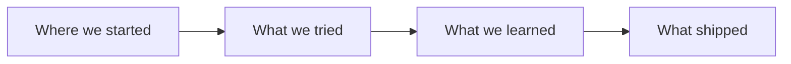

# TITLE HERE

## Why Care?

Audience-facing answer. One to three short paragraphs that work as a standalone preview. What does this enable, change, or unlock for someone who isn't on the team?

If you can't write this section without referring to internal jargon or prior context, the work might not be ready for a public changelog yet — or might need a different framing.

## What's New?

Concrete summary of what shipped. Bullet list or short paragraphs.

- Each item clear enough that an outside reader gets it
- Link to actual artifacts via `[[wikilinks]]` or standard Markdown links
- Specifics over generics

## The Story

> *(Optional but strongly encouraged.)* The journey behind the work. Problem → attempt → resolution. Realization → reframing → result. Convergence. Honest setbacks.

What happened. What was hard. What surprised you. What you tried that didn't work and why. The shape of the arc.



## How It Works (or "Under the Hood")

> *(Optional, for entries where readers will want to learn the technique.)* Show enough of the "how" that it clicks. Code blocks, diagrams, file structures.

```ts
// real code from what shipped
```

## What's Next

What this opens up. Either an immediate next step, or a longer-term arc this entry is one move toward.

## Related

- [[Spec or blueprint this implements]]
- [[Other recent changelog entries that connect]]
- [Public artifact link]
