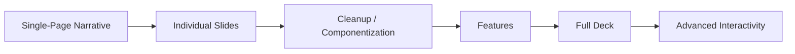

# Deck Iteration Workflow

A structured approach to developing slide decks for fundraise processes using the iterative methodology established in the calmstorm-decks project.

## When to use this skill

- Creating a new slides-only Astro site for fundraise processes
- Managing slide variants and iterations during development
- Implementing the phased workflow for slide deck development
- Working with the calmstorm-decks project patterns
- When the user mentions "deck iteration", "slide variants", or fundraise slide development workflows

## Overview

This workflow provides a structured approach to developing slide decks for fundraise processes based on the patterns and workflows discovered in the calmstorm-decks project. It emphasizes **starting from the whole narrative** as a single-page Astro scroll deck, *then* splitting to individual slides, *then* cleaning up and componentizing — followed by feature enhancement, full-deck completion, and advanced interactivity.

**Why holistic-first:** coding agents (Claude Code and generative AI generally) produce better creative flow and more coherent design when they can reason about the entire deck at once. An earlier version of this workflow started with plain wireframe HTML on a per-slide basis; that produced fragmented design and slow iteration. Building the whole narrative as one Astro page where each slide is a section component lets the agent improvise around theme/layout boundaries with the full arc visible.

## Core Principles

1. **Holistic before piecewise** - Start with the whole narrative on one page so the agent can reason about it as a coherent arc; split to individual slides only after the through-line is right
2. **Start fresh** - Break from established patterns that have proven arduous and time-consuming
3. **Iterative perfection** - Get something playable and clean before adding complexity
4. **Variant generation** - Create multiple variants to explore design options quickly
5. **Phase-based development** - Follow the structured progression: single-page narrative → individual slides → cleanup/componentization → features → full deck → advanced interactivity
6. **Design system foundation** - Build explicit design systems only after achieving aesthetic harmony

## Workflow Phases

### Phase 1: Single-Page Scroll Deck with Astro Sections and Tailwind

**Approach:**
- Build the entire deck as one Astro page with each slide as a section component
- Section components named by sequence and topic/role
- Inline Tailwind utilities only — let the agent improvise around theme/layout boundaries
- Use built-in Tailwind tokens only (no custom palettes yet)
- No JavaScript

**Why this comes first:** the agent reasons about the full narrative at once. Inline Tailwind keeps styling decisions local to each section and avoids premature lock-in. Calm/Storm visual defaults:
- Background: Pure white (`bg-white` / `#FFFFFF`)
- Borders: Thin (1px), mid grey (`border-gray-300` or `border-gray-400`)
- Primary text: Darker grey (`text-gray-800` or `text-gray-900`)
- Detail text: Lighter grey (`text-gray-500` or `text-gray-600`)
- Corner radius: Boxy-leaning, `rounded` or `rounded-sm` (2-4px)

**Goal:** a clean playable single-page scroll deck where the narrative arc reads end-to-end with aesthetic harmony.

### Phase 2: Individual HTML Slides with Inline Tailwind

**Approach:**
- Generate per-slide HTML pages by importing or referencing the Phase 1 section components
- Build a navigable menu so human clients can browse options on a per-slide basis
- Reason about vertical scroll vs. horizontal click/keyboard rendering animations — create variants where appropriate
- Deliver: a Table of Contents page and a dynamic variant selection page per slide

**Goal:** the deck is now navigable both as a continuous scroll (Phase 1) and as a click-through experience, with a menu surface for client review.

### Phase 3: Astro Conversion Cleanup

**Approach:**
1. Extract remaining text values from inline content into frontmatter or content collection files
2. Componentize repeating design elements into Astro components without changing rendered output
3. Build the initial design-system and brand-kit pages
4. Iterate toward stable use of semantic tokens

**Key Practices:**
- Move text values displayed in tags to frontmatter variables
- Keep a running list of all properties created to dedupe and reason about
- Only make components from consistently used design elements

### Phase 4: Feature Enhancement

**Approach:**
- Add dynamic features and interactions one slide at a time
- Prioritize advanced CSS features over JavaScript or libraries
- Use JavaScript when necessary, but avoid unnecessary frameworks
- Adopt libraries (GSAP) only with intention and purpose

**Key Constraints:**
- Avoid the neverending frustration of trying to make complex features work
- Keep focus on clean, stable rendered output
- Only adopt advanced features when clear necessity is demonstrated

### Phase 5: Full Deck Completion (Priority Theme / Chosen Slides)

**Approach:**
- Apply the same methodology to the full deck
- Leverage learnings from the teaser deck to inform full deck development
- Maintain consistency in design and approach across all slides

### Phase 6: Advanced Interactivity, Animations, and Data Visualization

**Approach:**
- Create variants of components, layouts, and pages rather than iterating on working files
- Add advanced animations and transitions
- Implement data visualization components
- Enhance user interaction patterns
- Current stack preferences: Svelte, GSAP, D3.js
- Exploring: ObservableHQ libraries, Vega-Lite

## Variant Management

### Naming Conventions:

1. **Base slide landing page:** Use slug string like `overview` to create `/overview/index.astro` for navigating variants
2. **Slide variants:** `pages/drafts/{slug}-{variant}.astro`
   - Example: `pages/drafts/overview/overview-v1.astro`

### Theme Organization:

When establishing themes:
- `pages/theme/{theme}/{slug}-{variant}-{theme}.astro`
- Example: `pages/modern/overview-v1-modern.astro`

### Canonical Promotion:

- Promote best variants to canonical status by removing variant suffix from filename
- Example: `overview-v1-modern.astro` becomes `overview-modern.astro`

### Variant Lifecycle:

1. Generate multiple variants without getting stuck (2-3 min creative burst)
2. Most variants shelved, but may be reused in client review processes
3. Promote best variants to canonical status
4. Prune "total losers" but preserve viable elements for future iterations

## Navigation System

### Core Requirements:
1. Next/previous buttons positioned in bottom right corner, low opacity by default, changes on hover
2. Key bindings for next/previous navigation
3. Slide counter (7 / 17)

### Implementation Guidelines:
- Start simple and evolve navigation system over time
- Maintain focus on getting something playable and functional first
- Only complex features added after basic functionality is established

## Design System & Brand Kit

### Timing:
- Begin building Design System and Brand Kit pages slowly
- Only add to design system after achieving aesthetic harmony
- Build it incrementally, not from the start

### Key Principle:
- Avoid the delays and struggles of creating robust design systems up front
- Build it in a way that doesn't cause delays and struggles during iteration

## Constraints & Considerations

### Technical Constraints:
1. **Performance Focus:** Focus on clean, functional decks rather than features
2. **Accessibility:** Maintain accessible navigation and content structure
3. **Cross-platform Compatibility:** Ensure decks work across different browsers and devices

### Business Constraints:
1. **Private Content:** Implement proper access controls for private decks
2. **Client Requirements:** Client needs "playable" decks that are clean and error-free
3. **Technology Savvy:** Balance complex authentication with simplicity for less tech-savvy users

### Avoiding Common Pitfalls:
1. **Reveal.js Avoidance:** Avoid repeated iterations with Reveal.js due to CSS conflicts and debugging issues
2. **Complex JavaScript:** Avoid premature use of JavaScript or animations that cause problems
3. **Design System Overhead:** Avoid getting stuck in design system creation without clear benefit

## AI Assistance Guidelines

### Creative Generation:
- Generate 2-10 variants per slide without getting stuck
- Use 2-3 minute bursts for creative generation
- Most variants will be shelved but may be useful in client reviews

### Pattern Application:
- Follow existing patterns from calmstorm-decks project
- Adapt patterns to each site's needs
- Copy and adapt rather than import and constrain

## Related Context

- [[context-v/specs/Develop-a-Slides-only-Astro-Site-for-a-Fundraise-Process]] - Core specification this workflow implements
- [[context-v/prompts/New-Site-Quickstart-Guide]] - New site setup guide for Astro-Knots projects
- [[astro-knots]] - Astro development conventions
- [[context-vigilance]] - Context management framework