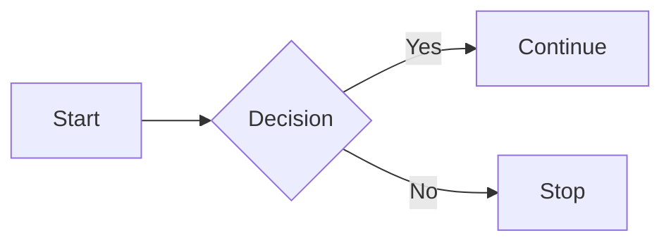

# LFM Syntax & Directives

Every directive form, callout alias, embed type, and code-fence component routing pattern. Use this when the user asks "how do I write X in LFM" or when authoring/reviewing markdown.

## Directive forms (the three flavours)

LFM uses [`remark-directive`](https://github.com/remarkjs/remark-directive) syntax, which has three forms by colon count:

```markdown
:text-directive[content]{attr="value"}        # 1 colon — inline, takes [content]
::leaf-directive{attr="value"}                  # 2 colons — block, no children
:::container-directive{attr="value"}            # 3 colons — block, takes children
Children content here.
:::
```

**Rule of thumb:** if it has a body, it's `:::container`. If it stands alone (image, badge, separator), it's `::leaf`. If it lives inside a sentence, it's `:text`.

## Callouts

Two equivalent syntaxes — pick one per document for readability.

### Directive form (preferred for Astro-first authors)

```markdown
:::callout{type="warning" title="Heads up"}
This is important information.
:::
```

### Obsidian form (preferred for Obsidian-first authors)

```markdown
> [!warning] Heads up
> This is important information.
```

Both render to the same `<Callout>` component. Supported `type`: `info`, `tip`, `warning`, `danger`, `note`, `success`. `title` is optional; the type capitalised is the default.

## Images

```markdown
::image{src="/chart.png" alt="Market sizing" float="right"
  caption="GLP-1 projection through 2030"
  source="Goldman Sachs Research" source-url="https://gs.com/research"}
```

**Required:** `src`, `alt` (use `alt=""` for decorative).
**Optional:** `float` (`left|right|none`), `caption`, `source`, `source-url`, `width`, `min-width`, `class`, `style`.

For floated images on tablets, set `min-width: 300px` (CSS, via class) to prevent collapse.

### Image gallery

```markdown
:::image-gallery{layout="grid" columns="3"}
::image{src="/g/1.jpg" alt="Q1"}
::image{src="/g/2.jpg" alt="Q2"}
::image{src="/g/3.jpg" alt="Q3"}
:::
```

## Citations

```markdown
Inline reference:
…aging is accelerating toward 2.1B people 60+ by 2050.[^1ucdcd]

Definition (anywhere in the doc, conventionally at the bottom):
[^1ucdcd]: 2025-09-21. [Population ageing](https://helpage.org/...). Published: 2024-07-11
```

**Hex codes only — never sequential `[^1]` / `[^2]`.** Why: sequential numbers break the moment content is reordered, split, or copy-pasted between documents. Hex codes are stable identifiers tied to *sources*, not to *positions in the current doc*.

### Hex-code generation rules

- **Length:** 6 characters.
- **Charset:** lowercase `[a-z0-9]` (letters reduce visual confusion: `0` vs `O`, `1` vs `l`).
- **Source-derived where possible.** When a citation points to a known source in the canonical Sources collection, reuse the source's existing hex ID — that's what lets the same citation render identically across documents.
- **Locally-generated otherwise.** For one-off citations not yet in the catalogue, generate a random 6-char hex. Source promotion (manual today) can later upgrade it to a catalogue entry.

### Definition format

After the hex marker, follow Lossless-recommended order:

1. Date accessed (`YYYY-MM-DD`)
2. `[Title](URL)` of the source
3. Optional metadata: `Published: YYYY-MM-DD`, `Author: …`, `Publisher: …`

For *what happens at render time* — the build-time OG fetch, the popover behaviour, the link-preview card path — see [triggers-to-component-pipeline.md](triggers-to-component-pipeline.md).

## Media embeds (zero-friction)

A bare URL on its own line auto-embeds:

```markdown
Watch the pitch:

https://www.youtube.com/watch?v=dQw4w9WgXcQ

(Renders as an embedded YouTube player. No syntax needed.)
```

**Auto-detected hosts:** YouTube, Vimeo, Loom, SoundCloud, Spotify, Twitter/X, plus any host registered in the trigger map.

**Opt out (keep as plain link):** prefix with backslash:

```markdown
Reference: \https://example.com/article
```

## Link previews (rich media cards)

For when you want a card-style preview, not an inline link or an embed:

```markdown
:::link-preview{type="article" format="card" aside="right-escape"}
https://example.com/some-article
:::
```

`format` options: `card`, `row`, `compact`. `aside` controls placement on wide layouts.

The build step fetches OG metadata and embeds it; the rendered card needs no client-side fetch. See [triggers-to-component-pipeline.md](triggers-to-component-pipeline.md) for the OG sub-pipeline and the `LinkPreviewData` schema.

## Link rollup (multiple sources, one block)

```markdown
:::link-rollup{title="Further reading"}
- https://example.com/source-1
- https://example.com/source-2
- https://example.com/source-3
:::
```

## Dialog / chat UI

```markdown
:::dialog{participants="Michael=human, Claude=ai"}
Michael: So I've been thinking about hex codes instead of numbers.

Claude: That solves portability — citations keep their ID when moved between documents.

Michael: Exactly.
:::
```

The `participants` attribute maps speaker names to a role (`human` | `ai` | `other`). The component uses the role to pick avatar / bubble styling.

## Badges

Inline:

```markdown
:badge[Stable]{variant="success"}
:badge[v0.1.2]{variant="version"}
:badge[2026-05-05]{variant="date"}
```

Variants: `default`, `success`, `warning`, `danger`, `date`, `version`.

## Details / collapsibles

```markdown
:::details{title="Show technical detail"}
The build step fetches OG metadata at compile time and embeds it
in the page bundle so popovers appear instantly on hover.
:::
```

## Slide separators

```markdown
First slide content.

---slide---

Second slide content.

---slide---

Third slide content.
```

Used in deck-iteration-workflow Astro sites. Renders to `<section data-slide>` boundaries.

## Code-fence component routing

A fenced code block with a recognised "language" can route to a component instead of being syntax-highlighted:

````markdown
```card-carousel
- title: First card
  body: Lorem ipsum.
- title: Second card
  body: Dolor sit amet.
```
````

Built-in fence-routed components: `card-carousel`, `image-grid`, `mermaid`, `code` (Shiki default), plus anything registered in `lfm-triggers.yaml`.

For Mermaid specifically:

````markdown

````

## Custom components

Any name registered in the trigger map becomes available as a directive:

```markdown
:::pricing-table{tiers="3" highlight="pro"}
:::

:::team-grid{layout="cards" department="engineering"}
:::
```

For how to register a new one, see [extensibility.md](extensibility.md).

## CSS-in-markdown (three layers)

```markdown
# Layer 1 — class annotation (recommended for most cases)
:::callout{type="info" class="hero-callout"}
Body
:::

# Layer 2 — inline style (for one-offs)
::image{src="/hero.jpg" style="border-radius: 1rem;"}
```

```markdown
# Layer 3 — scoped CSS block (for the page only)
```css scoped
.hero-callout {
  border-image: linear-gradient(135deg, #667eea, #764ba2) 1;
}
```
```

The renderer sandboxes layers 2 and 3: `url()`, `javascript:`, and `@import` are stripped.

## Wikilinks (Beta)

```markdown
[[Some Other Page]]                    # link by title
[[Some Other Page|Display Text]]       # link with custom display
![[some-file.md]]                       # transclusion (Wish List, not stable)
```

Wikilinks resolve against the same content collection by default. Cross-collection resolution is configurable in `lfm-triggers.yaml`.

## What's reserved (don't use as author attributes)

These attribute names are component-managed and silently ignored when set inline. See [extensibility.md](extensibility.md) for the full list, but the common ones:

- `format` (managed by link-preview, link-rollup)
- `type` on link-preview (it picks based on URL host)
- `id` (auto-generated for slug stability — set via Layer 1 class instead)
