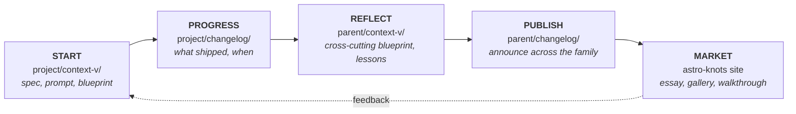

# Pseudomonorepos

> Not a true monorepo. Not loosely coupled either. A parent repo that adds children (often as git submodules) primarily so the parent can host a `context-v/` that aggregates context across them.

## When to use this skill

- Working **anywhere** under `~/code/lossless-monorepo/` or any of its descendants
- Starting any task — coding, writing a spec, drafting a prompt, debugging — that might overlap with prior work elsewhere in the tree
- Scaffolding a new sub-project (where does it go? does it deserve its own pseudomonorepo level?)
- User mentions "pseudomonorepo", "submodule", "the tree", or any of the named children
- Considering whether to add a folder/repo as a submodule vs. inline

## The behavioral core (this is the actual skill)

**Don't rush into creating.** Before writing a new spec, prompt, blueprint, doc, or substantial code:

1. **Walk the tree up.** Identify which pseudomonorepo level you're in. Walk to the root.
2. **Search prior work** at every level's `context-v/`:
   - Specs, blueprints, prompts, explorations, issues
   - Filenames (use grep/find by topic keywords)
   - Frontmatter tags
3. **Surface what you find** to the user. "I see related work in `astro-knots/context-v/blueprints/X.md` and `lossless-monorepo/context-v/explorations/Y.md` — should we extend those, link to them, or write something new?"
4. **Cross-reference, don't duplicate.** Link to prior work using `[[wikilinks]]`. Re-stating without linking is a smell.

### The escape hatch: ship fast

Sometimes assembling patterns, finding prior work, and writing context-v files **slows speed to ship**. That's a real tradeoff. When the user signals "just ship it":

- **Acknowledge** you're shortcutting the search-first discipline
- **Ship**
- **Log refactor debt** in the relevant `context-v/issues/` or `context-v/explorations/` as a one-liner: *"Shipped X without searching for prior patterns. Refactor candidate: connect to existing work in [[…]]?"*
- **Don't pretend you did the search.** Honesty about the shortcut is what makes the refactor possible.

We aspire to refactor afterwards — to make sense of things, connect them, write the missing blueprint, file the reminder. Speed-to-ship is granted; amnesia is not.

## What a pseudomonorepo looks like

```
pseudomonorepo/
├── .git
├── .gitmodules            # children referenced as submodules (sometimes)
├── context-v/             # PARENT-level context spanning children
│   ├── specs/
│   ├── blueprints/        # cross-cutting patterns across children
│   ├── prompts/
│   ├── reminders/
│   ├── explorations/
│   └── issues/
├── changelog/             # ship log — see Universal directories below
├── child-a/               # submodule, has its own context-v/ + changelog/
├── child-b/               # submodule, has its own context-v/ + changelog/
└── child-c/               # could itself be a pseudomonorepo (nested)
```

Each level is authoritative for its own scope. Children own their internals. The parent owns the *space between* children.

## Universal directories — every repo level should have both

**Aspiration:** every pseudomonorepo, true monorepo, *and* project repo has these two top-level siblings:

| Directory | Purpose |
|---|---|
| `context-v/` | Living documentation (specs, prompts, blueprints, reminders, explorations, issues). See `context-vigilance` skill. |
| `changelog/` | Ship log — dated records of what changed and when. The progress trail. |

**Reality:** placement of `changelog/` varies. Some projects have it nested at `context-v/changelog/`, some have it parallel at the repo root. **Aspiration is parallel.** When working in a project, respect the existing placement; only normalize when explicitly asked.

When scaffolding a new repo at any level, create both as siblings at the root.

## The 5-phase lifecycle workflow

The canonical loop for any meaningful unit of work in the Lossless ecosystem:

```
┌──────────┐    ┌──────────┐    ┌──────────┐    ┌──────────┐    ┌──────────┐
│  START   │ →  │ PROGRESS │ →  │ REFLECT  │ →  │ PUBLISH  │ →  │  MARKET  │
│          │    │          │    │          │    │          │    │          │
│ project/ │    │ project/ │    │ parent/  │    │ parent/  │    │ astro-   │
│ context- │    │ change-  │    │ context- │    │ change-  │    │ knots    │
│ v/       │    │ log/     │    │ v/       │    │ log/     │    │ site     │
└──────────┘    └──────────┘    └──────────┘    └──────────┘    └──────────┘
     ↑                                                                  │
     └──────────── feedback / next iteration ──────────────────────────────────────┘
```



**Phase definitions:**

| Phase | Where | What |
|---|---|---|
| **Start** | `project/context-v/` | Write the spec, prompt, or blueprint that frames the work |
| **Progress** | `project/changelog/` | Log what shipped and when, with links back to the spec |
| **Reflect** | `parent-pseudomonorepo/context-v/` | Lift learnings to the cross-cutting level: new blueprints, refined patterns |
| **Publish** | `parent-pseudomonorepo/changelog/` | Announce the change at the family level |
| **Market** | An [Astro Knots](https://www.lossless.group/projects/gallery/astro-knots) site | Public-facing essay, gallery entry, or walkthrough where it fits |

Not every unit of work runs the full loop. Small fixes might stop at Progress. Significant patterns should run all five. **The loop is aspiration, not mandate.** But every phase skipped is a candidate for refactor debt (see `references/search-first.md`).

A dedicated **`lossless-loop`** (working title) skill is forthcoming to fully encode this workflow.

## Content roll-up across the tree

A pseudomonorepo's splash, site, or gallery should surface not only its own `changelog/` and `context-v/` — it should **roll up** those of its submodules into one feed at the parent level. A reader landing on `content-farm/splash/` should see ship notes from `image-gin`, `cite-wide`, and the rest, not just from content-farm itself.

**Mechanism preference:** the **GitHub Content API**, authenticated, at build time. For each submodule registered in the parent's `.gitmodules`, derive the API endpoint from the `url =` line, query `/contents/changelog/` and `/contents/context-v/` against the configured `branch`, and merge results into the parent's content collections. This avoids cloning every submodule into CI and stays cheap under the 5000-req/hr authenticated rate limit.

**Provenance matters.** Every rolled-up entry should carry which submodule it came from as visible metadata, so a reader can filter to just one plugin's notes (`/changelog?from=image-gin`) and so the parent isn't pretending to have authored its children's work.

**Status:** aspirational. The first two splashes (`memopop-site`, `content-farm/splash`) render local-only content as of writing. When you scaffold a new splash, **log roll-up as Phase 2 work** in that splash's spec — don't pretend Phase 1 is "done" if roll-up is missing; it's done-with-a-known-follow-up.

The same pattern composes up the tree: a parent pseudomonorepo's splash rolls up its children's content, and *its* parent rolls up *its* children — eventually feeding the long-stated "Lossless Changelog" umbrella view at the org level (see the `changelog-conventions` skill).

See `references/content-rollup.md` for the full mechanism — endpoint shape, auth, failure modes, loader sketch.

## Edge case — moving a repo within the tree (HARD STOP)

It is **very common** in this tree to relocate a child repo from one parent
path to another. Examples:

- `astro-knots/sites/calmstorm-decks/` → `ai-labs/dididecks-ai/client-sites/calmstorm-decks/`
- a project graduates from an ai-labs exploration to a permanent astro-knots site
- a submodule moves between parents as the taxonomy of pseudomonorepos evolves

**This is the highest-risk operation in the tree.** When done wrong, it
silently destroys:

- unpushed local branches (lost)
- uncommitted work in the old directory (lost)
- gitignored `.env` / secrets (lost — `.env.example` is not authoritative)
- stashes (lost)

This actually happened on 2026-05-12: a calmstorm-decks move from
`astro-knots/sites/` to `ai-labs/dididecks-ai/client-sites/` produced a fresh
clone with no `.env`, on a stale `development` branch missing 19 commits of
auth/play work from `main`. The old directory had already been deleted.
Hours of recovery followed.

**Claude is under NO circumstances to "go along" with a relocation request
until all three preconditions are explicitly verified and acknowledged by
the user — one acknowledgment per precondition, not bundled.**

### Precondition 1 — every local branch synced to remote

For the repo about to move:

```bash
git fetch --all --prune
git branch -vv                                         # [ahead N] / [behind N] / [gone]
git log --branches --not --remotes --oneline           # local-only commits
git status                                              # working tree clean?
git stash list                                          # any parked work?
```

**Refuse to proceed if** any branch shows `[ahead N]`, any commits appear
in the `--not --remotes` query, the working tree is dirty, or any stash
exists. Surface exactly what is unsynced.

### Precondition 2 — every remote branch known, every local-only branch documented

```bash
git ls-remote --heads origin                            # authoritative remote list
git branch -a                                           # local + remote-tracking
diff <(git branch | tr -d ' *') \
     <(git ls-remote --heads origin | awk '{print $2}' | sed 's|refs/heads/||')
```

**Refuse to proceed if** local branches exist with no matching remote and
the user has not explicitly listed them as disposable.

### Precondition 3 — every gitignored secret backed up

```bash
cat .gitignore
ls -la
find . -maxdepth 2 \( -name ".env*" -o -name "*.local" -o -name ".secrets*" \) 2>/dev/null
# Plus: enumerate every var the SOURCE actually reads (not just .env.example,
# which lags behind code):
grep -rhoE '(process\.env|import\.meta\.env)\.[A-Z_][A-Z_0-9]*' src scripts db astro.config.* 2>/dev/null | sort -u
```

**Refuse to proceed if** any `.env*` or `.secrets*` exists and the user has
not confirmed a recovery path (password manager, separate `.env.backup` outside
the directory, 1Password, Vercel/Netlify env panel, deployed-host UI).

**`.env.example` is NOT authoritative** — it routinely lags behind. The grep
above against `process.env` / `import.meta.env` is the truth. The auth/db
stack in particular often has 3–5 historical names for the same value
(e.g., `ASTRO_DB_REMOTE_URL` / `ASTRO_DB_URL` / `TURSO_DB_URL` /
`DIDIDECKS_TURSO_DB_URL` all pointing at the same database). The source
shows them all; `.env.example` may show only one.

### How to respond when a user asks for a relocation

Default template:

> Before I touch this — moving a repo within the tree is the riskiest
> operation we do, and we've already lost env vars + unpushed work from
> exactly this kind of move. Three preconditions:
>
> 1. **Local branches synced.** [output of `git branch -vv` + status] —
>    branches X, Y are `[ahead]` by N commits. Push or document-as-lost?
> 2. **Remote branches catalogued.** Remote has A, B, C. Local has A, B, C, D.
>    Branch D is local-only — push it or confirm disposable?
> 3. **Env/secrets backed up.** Source reads vars: [list from grep]. Where
>    is the canonical copy you'd recover from?
>
> Each one gets its own acknowledgment. I won't bundle them.

**Do not** combine the three checks into a single "looks good, proceeding"
beat. Bundled confirmations are how vars get lost.

### Recovery — when this rule was already violated

If you arrive after the move (fresh clone, missing secrets, stale branch):

1. **Find any surviving working copy.**
   ```bash
   find ~ -type d -name '<repo>' 2>/dev/null | grep -v node_modules
   ls ~/.Trash | grep -i '<repo>'
   ls ~/.claude/projects/ | grep -i '<repo>'              # encoded old paths
   ls ~/Library/Caches/claude-cli-nodejs/ | grep -i '<repo>'
   ```
   Old paths are recoverable as session-cache directory names (the directory
   names encode the absolute path of the working copy).
2. **Reconstruct the env-var list from source.** Use the grep recipe in
   Precondition 3.
3. **Audit branch divergence.** `git log --all --pretty=format:'%h %ad %d %s'
   --date=iso` reveals where the lost work might be reachable on a different
   branch. The new clone may not be on the tip branch.

## Branch alignment across the tree

Pseudomonorepos and their submodules share a three-tier branch model: **`development` → `main` → `master`**.

- `development` is where most work lands.
- `main` is what `development` gets promoted to when it reaches something noteworthy.
- `master` is `stable` — updated only when the dust has settled.

**Aspiration:** when the parent is on a tier, every submodule is on the same tier. Parent on `development` → all submodules on `development`. Same for `main` and `master`. Look for root-level scripts like `switch-all-to-development-branch.sh` before writing your own.

**Reality:** humans get lazy. Work piles up in `development` and rarely gets promoted; `main` sometimes becomes the de-facto working branch; `master` is often the most stale branch in the repo. That's expected, not broken.

**When a submodule is missing a tier** (e.g. `development` doesn't exist), create it from the leading branch with a non-destructive push (`git branch development origin/master && git push origin development:development`). When `development` is *behind* `main`/`master`, fast-forward it up — don't roll the gitlink backwards by switching to a stale branch.

After changing a submodule's tracked branch: update `branch =` in the parent's `.gitmodules`, run `git submodule sync`, and commit both the `.gitmodules` change and the submodule pointer. An entry without a `branch =` line is a smell.

**Don't auto-realign as a side effect** of unrelated work. Same drift policy as everything else in this skill: observe, surface, get explicit authorization.

See `references/branch-alignment.md` for the full recipe (FF mechanics, divergence checks, push-to-default-branch caveats).

## Nested pseudomonorepos

The hierarchy can be:

```
root pseudomonorepo
└── theme-level pseudomonorepo
    └── collection-level pseudomonorepo
        └── true monorepo (npm workspaces, etc.)
            └── individual project / repo
```

Not every project sits at every level. The point is: **walk up until you stop finding `context-v/`** to be sure you've checked all relevant context.

## The current tree (snapshot)

The anchor pseudomonorepo is **`lossless-monorepo`** (<https://github.com/lossless-group/lossless-monorepo>), locally at `~/code/lossless-monorepo/` (paths vary on collaborators' machines).

Rank-ordered children (most relevant first):

| Path | Intent |
|---|---|
| `ai-labs/` | Work where we monkey with AI + Agents on complex workloads |
| `astro-knots/` | The family of websites — feature-rich, opinionated |
| `content-farm/` | Currently almost entirely Obsidian plugins (we use Obsidian for content) |
| `tidyverse/` | Tools, libs, scripts for cleaning up other things |

For details, current state, and intent-vs-reality notes, see `references/the-tree.md`.

> **Honest note:** The root and most pseudomonorepos are **imperfectly maintained**. Don't assume `context-v/` is complete or current. Search it; treat what you find as starting points; surface gaps when you see them.

> **Drift policy:** Walking the tree will reveal far more inconsistencies than consistencies. **Observe, note, surface — but do not auto-clean** as a side effect of unrelated work. Normalization is a separate, explicitly-authorized task. The user runs parallel agent sessions; silent fixes break others' work. Full policy in `~/.pi/agent/AGENTS.md`.

## Cross-skill ties

This skill is **not a silo** — it composes with the others:

- **`context-vigilance`** — pseudomonorepos exist primarily to host parent-level `context-v/`. The two are two halves of the same idea: this skill says *where* to look and *when* to look up; `context-vigilance` says *what* the docs you find should look like.
- **`astro-knots`** — `astro-knots/` is one of the four children. Working in any Astro Knots site means walking up to `lossless-monorepo/` for cross-site context.
- **`lfm`** (forthcoming) — likely lives within `astro-knots/` or as its own child.

When working in this tree, **multiple skills apply at once.** Don't pick one — let them all inform what you do.

## Typical flow when starting a task

1. **Locate yourself.** `pwd`. Walk up. Note which pseudomonorepo level(s) sit above you.
2. **Quick scan** of each level's `context-v/`:
   ```bash
   for dir in $(walk-up-to-root); do
     ls "$dir/context-v/" 2>/dev/null
   done
   ```
3. **Topic search** by keyword:
   ```bash
   grep -ril "keyword" $(find ~/code/lossless-monorepo -type d -name context-v 2>/dev/null)
   ```
4. **Report findings** to the user. Even if you find nothing — confirm the search ran.
5. **Ask:** extend / link / write new?
6. **Proceed**, applying `context-vigilance` conventions to whatever you write.
7. **If shipping fast,** note the skipped search as refactor debt.

## See also

- `references/anatomy.md` — what makes something a pseudomonorepo, identification heuristics
- `references/the-tree.md` — current state of the lossless-monorepo tree (living doc)
- `references/search-first.md` — concrete recipes for finding prior work
- `references/lifecycle-workflow.md` — the 5-phase Start → Progress → Reflect → Publish → Market loop, with diagrams
- `references/branch-alignment.md` — the development → main → master tier model and how to keep parent + submodules aligned
- `references/content-rollup.md` — how parent splashes/sites should aggregate `changelog/` and `context-v/` from their submodules via the GitHub Content API
- `context-vigilance/SKILL.md` — the documentation framework that `context-v/` follows
- `astro-knots/SKILL.md` — the websites child of the tree
