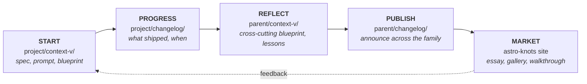

# The 5-Phase Lifecycle Workflow

The canonical loop for taking a unit of work from idea → ship → reflection → public artifact in the Lossless ecosystem. **A diagram and rationale for what will become its own skill.**

> **Status:** Working sketch. The full skill (working title `lossless-loop`) will encode automation, templates, and verification. For now: this doc is the spec.

## Universal directories

Every repo level — pseudomonorepo, true monorepo, project repo — should have both:

```
<any-repo>/
├── context-v/        # living documentation
└── changelog/        # ship log (dated records of change)
```

These are siblings at the repo root. Some legacy projects nest changelog inside context-v (`context-v/changelog/`); aspiration is parallel.

## The loop

```
┌──────────┐    ┌──────────┐    ┌──────────┐    ┌──────────┐    ┌──────────┐
│  START   │ →  │ PROGRESS │ →  │ REFLECT  │ →  │ PUBLISH  │ →  │  MARKET  │
│          │    │          │    │          │    │          │    │          │
│ project/ │    │ project/ │    │ parent/  │    │ parent/  │    │ astro-   │
│ context- │    │ change-  │    │ context- │    │ change-  │    │ knots    │
│ v/       │    │ log/     │    │ v/       │    │ log/     │    │ site     │
└──────────┘    └──────────┘    └──────────┘    └──────────┘    └──────────┘
     ↑                                                                  │
     └──────────────── feedback / next iteration ──────────────────────┘
```



## Phase 1 — Start

**Where:** `project/context-v/` (specs, prompts, blueprints)

**What:** Frame the work before doing it.

- Spec: what is being built and why
- Prompt: step-by-step plan referencing the spec
- Blueprint: pattern this work will follow (if known)

**Output:** at least one document the agent can load as context for the build.

## Phase 2 — Progress

**Where:** `project/changelog/`

**What:** Log what shipped and when.

- Dated entries (e.g., `2026-05-03_01.md`)
- Each entry links back to the spec/prompt it implemented
- Brief, factual: what changed, why, what's next

**Output:** a trail anyone (human or AI) can read to understand the project's evolution.

## Phase 3 — Reflect

**Where:** `parent-pseudomonorepo/context-v/` (often blueprints, sometimes specs or explorations)

**What:** Lift learnings to the cross-cutting level.

- "We solved X this way in `project-a` — should it be a blueprint for `project-b` and `project-c`?"
- "We hit Y in three projects — time for a reminder"
- "Our approach to Z is starting to consolidate — write it up as a blueprint"

**Output:** parent-level documents that aggregate insight from individual projects.

## Phase 4 — Publish

**Where:** `parent-pseudomonorepo/changelog/`

**What:** Announce the change at the family level.

- "New blueprint added: X"
- "All Astro Knots sites updated to pattern Y"
- "Pseudomonorepo-wide convention: Z"

**Output:** family-level visibility of a project-level change.

## Phase 5 — Market

**Where:** wherever it fits on an [Astro Knots](https://www.lossless.group/projects/gallery/astro-knots) site

**What:** Public-facing artifact.

- An essay on `lossless.group`
- A gallery entry under `/projects/gallery/`
- A walkthrough or "Lost in Public" entry
- A talk, a demo, a Loom — whatever the work calls for

**Output:** something an outsider can encounter, learn from, and link to.

## When to skip phases

Not every unit of work runs all five. Heuristics:

| Type of work | Realistic phases |
|---|---|
| Typo / one-line fix | Just Progress, maybe |
| Bug fix | Start (issue) → Progress |
| New feature in one project | Start → Progress |
| Pattern that affects 2+ projects | Start → Progress → Reflect |
| Significant new convention | Start → Progress → Reflect → Publish |
| Any of the above worth public discussion | All five |

**Skipping is allowed; forgetting is not.** When you skip, log the skip as refactor debt — same pattern as the ship-fast escape hatch in `search-first.md`.

## Composition with other skills

| This phase... | Activates these skills |
|---|---|
| Start | `context-vigilance` (writing in `context-v/`), `pseudomonorepos` (search-first) |
| Progress | `context-vigilance` (changelog conventions, TBD) |
| Reflect | `context-vigilance` (writing blueprints), `pseudomonorepos` (parent-level work) |
| Publish | `context-vigilance` (changelog) |
| Market | `astro-knots` (publishing), `lfm` forthcoming (content authoring) |

The loop is the spine; the other skills are the muscles.

## TBDs for the forthcoming `lossless-loop` skill

When this becomes its own skill, it should encode:

- [ ] Changelog entry frontmatter and naming convention (currently looks like `YYYY-MM-DD_NN.md`)
- [ ] Templates for each phase
- [ ] Automation: a `/loop start` command? A `/loop progress` to log a shipment?
- [ ] Verification: "have you reflected this work upward?"
- [ ] Cross-references: how Marketing-phase artifacts link back to Reflection-phase blueprints
- [ ] Where Marketing lives by site (gallery vs. essay vs. lost-in-public)
