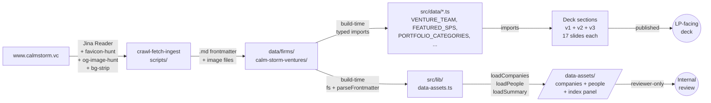

## Why Care?

A fundraise deck full of `LP / SU / EG` initial-circles and text-only company chips reads as "we ran out of time before we found their photos." It's a competence signal, and the wrong one. Every VC deck — every team page, every portco grid, every testimonial slide — has the same shape of work: collect a roster of names from a PDF or a website, find a real photo, find a real logo, find a real og:image, attach the right metadata, and render it cleanly. Doing this by hand for one firm is a half-day. Doing it for the next firm, and the next, scales linearly with people-cost and never gets faster.


So we built the round trip. A **reusable Claude Code skill** that takes a firm URL (or a deck PDF, or just a name) and produces a canonical directory of typed `.md` records — one per partner, one per advisor, one per supporting partner, one per portfolio company, one per portco CEO — plus the brand assets to back them. The skill is firm-agnostic: it ran on Calm/Storm Ventures end-to-end this week and produced 41 people, 30 companies, ~80 image assets, and the structured JSON to wire any of it into a deck. The next firm we run it on inherits the cascades, the bg-strip pipeline, the favicon cascade, the og:image capture, and the human-in-the-loop triage routine — same scripts, different `--firm` slug.

And because the *human* still has to look at the result and say "yes Apylon's Google-S2-fallback favicon is fine for now but Visible's is suspect," we shipped an `/data-assets` audit surface — two scrollable tables, one for companies and one for people, with thumbnails of every asset side by side. A wrong-cropped headshot or a 16×16 favicon hidden among well-resolved ones now jumps out in seconds.

## What's New?

### Agent skill — `crawl-fetch-ingest`

Lives at `~/.claude/skills/crawl-fetch-ingest/` (symlinked from `context-v/skills/crawl-fetch-ingest/` at the org-repo root).

- **The four-checkpoint cascade** is documented in `SKILL.md`: VC team → advisors → portfolio companies → portco CEOs. Each is a human-confirmation gate.
- **Helper scripts** that execute the cascades:
  - `scripts/jina-reader.ts` — URL → clean markdown (default first call)
  - `scripts/logo-hunt.sh` — tiers 1–3 of the SVG/wordmark cascade (inline SVG → site paths → press/brand pages)
  - `scripts/favicon-hunt.sh` — favicon cascade (`<link rel="apple-touch-icon">` → site icons → PWA manifest → Google S2 fallback that always returns *something*)
  - `scripts/og-image-hunt.sh` — extract `og:image` / `twitter:image` URL (no download; just records the URL)
  - `scripts/brandfetch.ts` — Brandfetch API wrapper (tier 4 of the logo cascade), with `--save-all` mode that writes assets using the role-prefixed `{role}__{Company-Name}.{ext}` naming convention
  - `scripts/bg-strip.sh` — ImageMagick flood-fill from each corner using the *sampled* corner color, falls back to `rembg` when needed; emits JSON describing what method ran and how much was stripped
  - `scripts/og-fetch.ts` — OpenGraph.io REST wrapper for any URL
  - `scripts/triage-classify.py` — auto-classify ingest output by quality across 6 axes (existence, format, bg-strip success, foreground luminance, resolution, file size)
- **`routines/triage-brand-assets.md`** — sub-workflow that walks the human through every ingested asset and assigns one of `good-to-go` / `not-urgent-passable` / `urgent-rework` / `deferred-for-now`, persisting the choice as `review_status:` in the company's frontmatter.
- **`schema/{firm,person,company}.md`** — canonical YAML frontmatter shapes. The `person` schema now formally recognizes nine `role_class` values (`vc-team`, `managing-partner`, `venture-partner`, `operating-partner`, `entrepreneur-in-residence`, `supporting-partner`, `advisor`, `portco-ceo`, `external`) with a disambiguation table for the fuzzy boundaries.

### Ingested data + assets for `calm-storm-ventures`

Per the canonical output layout:

```
data/firms/calm-storm-ventures/
├── firm.md + logo.svg
├── team/
│   ├── lucanus-polagnoli.md + .avif       (4 partners)
│   ├── stephanie-urbanski.md + .avif
│   ├── johannes-blaschke.md + .avif
│   ├── ekaterina-gianelli.md + .png
│   ├── paul-varga.md + .avif               (3 invest team)
│   ├── philippa-allen.md + .avif
│   ├── patricia-falagan-de-la-sierra.md + .avif
│   ├── philip-jungen.md + .avif            (3 LPAC advisors)
│   ├── regina-hodits.md + .avif
│   ├── lisa-pallweber.md + .avif
│   ├── joe-spector.md + .png               (3 supporting partners)
│   ├── nora-blum.md + .avif
│   └── sievert-weiss.md + .avif
└── portfolio/
    ├── {slug}.md           (28 portcos resolved + 2 *-FLAGGED stubs)
    ├── trademark__{Company-Name}.png  (27 wordmark logos, bg-stripped)
    ├── favicon__{Company-Name}.{png|svg}  (27 favicons)
    ├── {slug}-ceo.md + .avif  (27 portco CEOs)
    └── nelly-cpo.md + .avif   (1 other portco officer)
```

41 people, 30 company entries, ~80 image assets, all fetched in iterative passes from `www.calmstorm.vc` over the last 24 hours.

### Deck wiring across v1, v2, v3

Real assets replaced filler in every people-and-companies-bearing slide across the three deck variants:

- **T03 Venture Team** (v1, v2) — initials → real headshots; v3 stays typographic per the "magazine masthead, no avatars" design intent (data still wired through `VENTURE_TEAM`)
- **T10 Track Record** (v1, v2) — partner avatars now real photos; v1's broken vertical-line-through-year-text bug fixed by regenerating with a spine-on-the-left pattern
- **T11 Investment Team & LPAC** (v1, v2) — all 6 bench/LPAC people show real headshots from `data/lpac.ts`
- **T12 Competitive Advantage** (v1, v2, v3) — featured Supporting Partners (Sievert Weiss, Nora Blum, Joe Spector) show real headshots; v3 treats the sidebar as a magazine "Contributing Editors" panel
- **T13 Community** (v2, v3) — three founder testimonials (Frank Westermann, Eirini Rapti, Lukas Eicher) show real headshots beside their signed quotes; Lukas required a separate fetch (Nelly's CPO, distinct from Niklas Radner the CEO)
- **T15 Portfolio Snapshot** (v1, v2, v3) — text chips → favicon-prefixed chips; v3 renders them as a printed directory with leader-dot rules
- **T06 Opportunity** (v2, v3) — portfolio example chips now render with favicons; required a one-off fetch of Apylon (not in the deck's main T15 list, so it wasn't in the initial sweep)
- **T16 Offering** (v2) — vertical "Pre-Seed → Seed → Series A" step layout regenerated to fix a line-through-text bug analogous to the T10 timeline bug

The data-side payoff: three new typed data files that v1, v2, and v3 all import from, so a stage promotion or a portco add propagates everywhere with one edit:

```
src/data/
├── venture-team.ts          (4 partners, refactored from .ts to add headshot imports)
├── lpac.ts                  (NEW — 3 invest team + 3 advisors)
├── supporting-partners.ts   (NEW — 3 featured SPs)
└── portfolio-snapshot.ts    (NEW — 27 portcos with both favicons AND wordmarks)
```

### Reviewer surface — `/data-assets/`

Two new pages on the deck's index, fed by a build-time loader:

- **`/data-assets/companies`** — one row per portfolio company, sorted alphabetically. Columns: logo thumbnail, favicon thumbnail, name, homepage link, sector, description, og:image link, asset-cascade-tier-that-resolved-it ("strategy"), confidence/status. Flagged unresolved entries get an amber row.
- **`/data-assets/people`** — one row per person across all three sources (team / portco-ceo / portco-cpo). Columns: 48px round headshot, name, title (with deck-role-label drift surfaced), role_class as a colored pill, source, short bio, firm-bio link, status. Sorted: team first, portco-CEOs second, alphabetical within each group.

A new **Assets & Data** summary panel renders above the "Teaser Deck" heading on `/`, with two big tiles linking into each audit page.

```
┌──────────────────────────────┬──────────────────────────────┐
│ 30                           │ 41                           │
│  COMPANIES                   │  PEOPLE                      │
│ 28 resolved · 2 flagged      │ 13 team · 27 portco CEOs · 1 │
│                              │  other portco                │
│ See Companies →              │ See People →                 │
└──────────────────────────────┴──────────────────────────────┘
```

The whole audit surface reads from the canonical `.md` files at build time, so it can never drift from the source — change a frontmatter field and the next `pnpm build` reflects it.

## The Story

This shipped over the course of one weekend in roughly five passes. The first pass was small. Each subsequent pass added an axis the previous pass exposed.

### Pass 1 → "fetch the obvious 27 portcos and call it done"

The deck's portfolio snapshot lists 30 companies in 6 categories. The firm's site at `www.calmstorm.vc/portfolio/{slug}` has a structured page per company with `og:image` (logo), tagline, sector tags, founders, and "Visit Website" link. A 30-line Python extractor + a parallel `curl` loop produced typed `.md` files plus 27 logos in 90 seconds. T15 v1 lit up. We declared victory.

Then the user looked at the result and said: *"these logos are squeezed wordmarks in 22×22 squares — half of them are invisible."*

### Pass 2 → "match asset role to render context"

The architectural insight that was missing: **a single 'the logo' doesn't exist**. Every company has a wordmark (wide, for headers), a square icon / favicon (for tiles, chips, app icons), and an `og:image` (the 1.91:1 social card). Forcing one of those into the wrong rendering slot produces predictable failure modes — a wordmark squeezed into a square chip becomes invisible-tiny-text; a square favicon stretched to a wide header looks pixelated.

So `crawl-fetch-ingest` got two new sibling cascades to run in parallel with the wordmark cascade:

```mermaid
flowchart LR
    H[Company<br/>homepage] --> W[logo-hunt.sh<br/>wordmark cascade]
    H --> F[favicon-hunt.sh<br/>square-icon cascade]
    H --> O[og-image-hunt.sh<br/>social card]

    W -->|inline svg<br/>→ /logo.svg<br/>→ /press<br/>→ Brandfetch<br/>→ raster + bg-strip| WO[trademark__Name.svg<br/>or .png]
    F -->|apple-touch-icon<br/>→ link rel=icon<br/>→ /favicon.svg<br/>→ PWA manifest<br/>→ Google S2 fallback| FO[favicon__Name.png]
    O -->|meta property=og:image<br/>→ twitter:image| OO[og_image_url<br/>recorded in frontmatter]

    WO --> R[Each saved with the<br/>role-prefixed convention<br/>{role}__{Company-Name}.{ext}]
    FO --> R
    OO --> R
```

The favicon cascade has an interesting last-resort tier: `https://www.google.com/s2/favicons?domain={d}&sz=128`. Google's free favicon service almost always returns *something* for a resolvable domain, so `favicon-hunt.sh` essentially never fails to produce *some* tile asset. Apylon — a stealth-y portco whose Astro-built marketing site ships no favicon at any standard path — got a 16×16 PNG from Google. Small but workable; the triage routine flagged it for "manual upgrade later."

### Pass 3 → "the bg-strip is producing visible-but-wrong glyphs"

After bg-stripping the 27 logos via ImageMagick flood-fill, four of them (Aeon, aiomics, Circle Health, Holo) had foreground luminances near zero. Original logos were dark-glyphs-on-dark-canvas; stripping black pixels left the dark glyphs intact, but at insufficient contrast against any frame.

The fix had two parts. First, the chip rendering was hard-coded to a white frame, which made it impossible to put light-on-dark logos anywhere readable. We added an optional `bgColor` per portco — chips render with that background when set, default white otherwise. Second, the *real* fix in the next pass was the favicon cascade above: the favicons-not-wordmarks treatment makes the bg-strip step almost cosmetic, since favicons ship as proper square icons designed for small-tile rendering and don't need backgrounds removed.

### Pass 4 → "we need the human-in-the-loop triage as a routine, not an ad-hoc"

We had 30 companies × 3 asset roles each, plus 41 people, and no good way to scan for the inconsistent ones. Thus `routines/triage-brand-assets.md` and `scripts/triage-classify.py`:

```python
# Excerpt: per-asset rubric in scripts/triage-classify.py
def classify(frontmatter, signals, deck_frame_bg):
    axes = {}
    if not signals["exists"]: axes["existence"] = "urgent-rework"
    pct = signals.get("pct_transparent")
    if pct is not None and pct < 30: axes["bg_strip"] = "urgent-rework"
    elif pct is not None and pct < 60: axes["bg_strip"] = "not-urgent-passable"
    lum = signals.get("mean_fg_luminance")
    if lum is not None and lum > 200 and not deck_frame_bg:
        axes["foreground"] = "urgent-rework"  # light glyphs on default white frame
    longest = max(signals.get("width") or 0, signals.get("height") or 0)
    if longest and longest < 80: axes["resolution"] = "urgent-rework"
    # ... combine: worst-of-all-axes wins
    return overall, axes, rationale
```

The routine wraps that classifier in a conversational walk-through: present each ambiguous case with its full dossier (file path, source URL, bg-strip method, foreground luminance, deck-frame-bg if any), let the user type `g` / `n` / `u` / `d`, persist the decision to the .md `review_status:` field, move to next.

### Pass 5 → "we need the audit surface in the deck itself"

The triage routine works once. But for an ongoing review pass — picking up a fresh set of edits, eyeballing whether the new headshots fit the existing roster, deciding which portcos still need work — having a built-into-the-deck **audit surface** is more useful than a CLI walk-through. So the final pass added `src/lib/data-assets.ts` (a build-time loader that reads the canonical `.md` files via `process.cwd()`) plus `/data-assets/companies` and `/data-assets/people` pages that render the whole roster with thumbnails.



## How It Works (Under the Hood)

### One source of truth, two consumers

The canonical files live at `data/firms/calm-storm-ventures/`. Every `.md` is human-readable, version-controllable, and editable without touching code. The deck consumes a handful of these via *typed* TypeScript modules in `src/data/` (which import the asset files from `src/assets/` so Astro's image pipeline optimizes them). The audit page consumes *all* of them via a generic loader that reads the directory at build time:

```ts
// src/lib/data-assets.ts — excerpt
const DATA_DIR = path.resolve(process.cwd(), "data", "firms", FIRM_SLUG);

export function loadCompanies(): CompanyEntry[] {
  const portDir = path.join(DATA_DIR, "portfolio");
  return fs.readdirSync(portDir)
    .filter((f) => f.endsWith(".md") && !f.endsWith("-ceo.md") && !f.endsWith("-cpo.md"))
    .map((f) => {
      const text = fs.readFileSync(path.join(portDir, f), "utf-8");
      const fm = parseFrontmatter(text);
      const flagged = fm.confidence === "flagged" || fm.status === "unresolved" || f.includes("-FLAGGED");
      return { slug, name, homepage, description, sector,
               logoFile, faviconFile, ogImageUrl, ceoSlug,
               status, confidence, reviewStatus, flagged, /* ... */ };
    })
    .sort((a, b) => a.name.toLowerCase().localeCompare(b.name.toLowerCase()));
}

// Build-time glob over every asset under src/assets/, keyed by filename:
const portfolioGlob = import.meta.glob<{ default: ImageMetadata }>(
  "/src/assets/firms/calm-storm-ventures/portfolio/*.{png,jpg,jpeg,webp,avif,svg}",
  { eager: true },
);
export function getAsset(dir, filename) { /* lookup by filename */ }
```

Add a portco's `.md` file → it shows up in the next `pnpm build` of the audit page. Edit a `review_status:` from the triage routine → the audit reflects it. No double-bookkeeping.

### The favicon cascade in 30 lines

The five-tier cascade is deliberately defensive — the last tier is a guaranteed-something fallback so the script almost never returns empty:

```bash
# Excerpt: scripts/favicon-hunt.sh
set -uo pipefail   # NOT -e — many tiers contain "no match" conditions

# Tier 1: <link rel="apple-touch-icon">
href="$(printf '%s' "$HTML" | grep -oE '<link[^>]*rel="[^"]*apple-touch-icon[^"]*"[^>]*>' \
  | grep -oE 'href="[^"]+"' | head -1 | sed -E 's/href="([^"]+)"/\1/' || true)"
[ -n "${href:-}" ] && url_is_image "$(resolve_url "$href")" && {
  printf '{"tier":"site-apple-touch-icon",...}'; exit 0; }

# Tier 2-5: link rel=icon → common paths → PWA manifest → ...

# Tier 6: Google S2 — always returns *something* for resolvable domains
google_url="https://www.google.com/s2/favicons?domain=${DOMAIN}&sz=128"
printf '{"tier":"google-s2-fallback","url":"%s","format":"png"}\n' "$google_url"
exit 0
```

### Asset filename convention

The skill landed on a BEM-ish role-prefixed naming convention for brand assets, codified in `schema/company.md`:

```
{role}__{Company-Name}.{ext}

trademark__Foundation-Health.png    # default — primary mark
wordmark__Stripe.svg                # only when also have appIcon
appIcon__Stripe.svg                 # paired with wordmark
favicon__9am-Health.png             # always when available

Company-Name = Train-Case (Title-Case-Each-Word with hyphens)
              (handles diacritics, slashes, dots:
               "Béa Fertility" → "Bea-Fertility")
```

The `{role}` prefix lets one company own multiple kinds of assets without filename collision, and lets the renderer pick the right one for the slot it's filling.

## What's Next

- **The skill works on any firm.** The next deck site replicates the wiring in maybe an hour: edit the firm slug, run the four checkpoints, wire the resulting `data/firms/{firm}/` into the new site's `src/data/` and `src/assets/`. Documented in the skill's `SKILL.md` and `setup.md`.
- **The triage routine is the natural next user-action**, now that the audit surface exists. Open `/data-assets/companies`, scroll for the obvious holes (Foundation-Health's 16×16 favicon, Apylon's Google-S2 fallback), then run the triage to formally classify each.
- **Source-of-truth de-duplication** is on the skill's future-work list: today the same person appearing under two firms is duplicated. Eventually `~/.claude/skills/crawl-fetch-ingest/people/{global-slug}.md` will be a global index that firm-level files reference.
- **The audit surface generalizes.** The same `/data-assets/{companies,people}` shape works for any Astro Knots site that has a `data/firms/{slug}/` directory. Worth lifting into the `astro-knots` blueprint when the second site adopts the pattern.
- **The Assets-Data audit panel becomes part of the Build-a-Fundraise-Deck-Workspace blueprint.** It's not deck content — it's reviewer surface — but every fundraise site benefits from having it. It belongs in the playbook alongside the gate, the registry-driven nav, and the OpenGraph system.

## Files

```
data/firms/calm-storm-ventures/
  firm.md + logo.svg                                              (new)
  team/{slug}.md + headshots                                      (13 people, new)
  portfolio/{slug}.md + trademark__{Name}.png + favicon__{Name}.{png|svg}
                       + {slug}-ceo.md + {slug}-ceo.avif          (~80 files, new)
  portfolio/nelly-cpo.md + .avif                                  (new — Lukas Eicher)
  portfolio/{beyond-nature,motra}-FLAGGED.md                      (new — unresolved)

src/data/
  venture-team.ts                                                 (refactored; headshot imports)
  lpac.ts                                                         (new)
  supporting-partners.ts                                          (new)
  portfolio-snapshot.ts                                           (new)

src/assets/firms/calm-storm-ventures/
  team/*.{avif,png,svg}                                           (mirror of data/.../team)
  portfolio/*.{avif,png,svg}                                      (mirror of data/.../portfolio)

src/lib/data-assets.ts                                            (new — build-time loader)
src/components/basics/AssetsDataPanel.astro                       (new — index summary tile pair)
src/pages/data-assets/companies.astro                             (new — audit table)
src/pages/data-assets/people.astro                                (new — audit table)
src/pages/index.astro                                             (panel wired in above TOC)

src/layouts/sections/teaser/T03-VentureTeam.astro                 (initials → headshots)
src/layouts/sections/teaser/T10-TrackRecord.astro                 (timeline rebuild + headshots)
src/layouts/sections/teaser/T11-InvestmentTeamLPAC.astro          (initials → headshots)
src/layouts/sections/teaser/T12-CompetitiveAdvantage.astro        (SP headshots)
src/layouts/sections/teaser/T15-PortfolioSnapshot.astro           (text → favicon chips)

src/layouts/sections/teaser-v2/T03,T06,T10,T11,T12,T13,T15,T16.astro  (parallel wiring + bug fixes)
src/layouts/sections/teaser-v3/T06,T12,T13,T15.astro                  (selective enrichment, magazine aesthetic preserved)
```

Plus, in the parent context-v repo (org-level skill source):

```
~/.claude/skills/crawl-fetch-ingest/      (symlinked from context-v/skills/)
  SKILL.md                                                        (substantial revision)
  schema/{firm,person,company}.md                                 (revised; new fields)
  scripts/jina-reader.ts                                          (existing)
  scripts/og-fetch.ts                                             (existing)
  scripts/logo-hunt.sh                                            (new)
  scripts/favicon-hunt.sh                                         (new)
  scripts/og-image-hunt.sh                                        (new)
  scripts/brandfetch.ts                                           (new)
  scripts/bg-strip.sh                                             (new)
  scripts/triage-classify.py                                      (new)
  routines/triage-brand-assets.md                                 (new)
  setup.md                                                        (revised — new env vars + cli installs)
  future-work.md                                                  (revised — items moved to "done")
```

## Related

- [[High-Resolution-High-Fidelity-Deck-Exports-from-Code-to-Images-&-PDFs]] —
  the export pipeline this enriches; PDFs of `/thesis*` now contain real
  faces and real logos instead of monograms and text chips.
- [[Build-a-Fundraise-Deck-Workspace]] (parent astro-knots) — the deck-workspace
  pattern this contributes the asset-pipeline + audit-surface chapter to.
- The `crawl-fetch-ingest` skill at
  `context-v/skills/crawl-fetch-ingest/` — source of truth for the cascades,
  helper scripts, schema, and triage routine. The skill is firm-agnostic;
  this entry documents its first end-to-end run.
