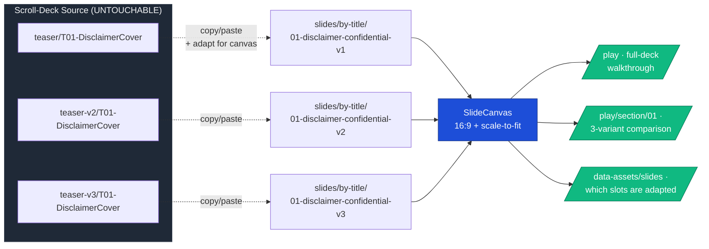

## Why Care?

Scroll decks are how a coding agent does its best creative work — agents reasoning about a whole-deck narrative produce coherent visual rhythm, harmonized density, and through-line typography that slide-by-slide design can't match. The three calmstorm-decks scroll variants (`/thesis`, `/thesis/version-2`, `/thesis/version-3`) are evidence: each was generated in a single creative burst and reads as one editorial composition end-to-end.

But humans don't *play* decks as scrolling web pages. They play them like Keynote and PowerPoint — left-to-right, fullscreen, fixed aspect ratio, scaled to the monitor. The two rendering modes are different in ways the agent can't infer from a `curl` response: a section authored against scroll-flow flexibility doesn't necessarily fit a 1920×1080 box, and there's no static analysis that tells you which sections survived the port and which got squished.

So we've been struggling with the "Scroll Deck → Slideshow" adaptation in cycles — frustrated each time we try to bulk-port, because the agent can't tell which ones broke. This entry captures the workflow that ended that cycle. Three pieces matter:

1. **The prompt doc that names the wrapper-import trap explicitly** — so future agents (and future-us) don't spend half an iteration discovering it for themselves.
2. **The smallest sustainable infrastructure** — `SlideCanvas`, a keyboard-driven `/play` player, a per-section `/play/section/{slot}` comparison route, and a `/data-assets/slides` audit surface. Built once, applied to every future slot.
3. **T01 as the first true adaptation** — three independent slide files, each a copy/paste of its source section with per-slide CSS tuning, none of which leaks into the scroll deck.

This isn't the full deck adapted. It's one slot, and the workflow to do the other sixteen iteratively without burning the human's attention on bulk-generated misses.

## What's New?

### Infrastructure (built once, reusable for all 17 slots)

- **`src/components/slides/SlideCanvas.astro`** — fixed-aspect 16:9 wrapper. Authoring resolution 1920×1080 by default; the canvas scales the stage to fit its container via a tiny inline JS using `ResizeObserver`. Force-resolves `[data-reveal]` animations and resets `.slide` height inside the canvas so scroll-mode CSS doesn't fight slide-mode rendering.
- **`src/pages/play/index.astro`** — keyboard-driven player that walks all 17 slides (defaulting to v1 of each slot). Bindings: `←` / `→` / `Space` / `PageUp` / `PageDown` navigate; `F` fullscreen; `C` toggle chrome (header + bottom nav hide for a true presentation view); `Esc` exits fullscreen; URL hash routing (`/play#7` jumps directly to slide 7). Cross-fades between slides via `aria-hidden` toggling + opacity transitions.
- **`src/pages/play/section/[slot].astro`** — Astro dynamic route that walks just one slot's variants (e.g., `/play/section/01` plays 01-v1 → 01-v2 → 01-v3). The reviewer-comparison surface. Uses `import.meta.glob` to discover which variants exist for the slot at build time, so slots with zero adaptations yet render an "empty" state pointing at the prompt doc.
- **`src/pages/data-assets/slides.astro`** — audit page in the family of `/data-assets/companies` and `/data-assets/people`. One row per slot. Each variant cell shows `adapted` (green pill) if the file is a true copy/paste, `stub` (gray pill) if it's still a wrapper that imports the scroll-deck section. Detection heuristic is grep for `import Section from "../../layouts/sections/"` in the file body — present means stub, absent means adapted. "▶ Play 3 variants" link per row.
- **Index TOC gets a third Assets-Data tile** — `17 Slide Slots → See Slides` joins `Companies` and `People` in the upper panel.

### T01 — first slot fully adapted

Three independent slide files, each a true copy/paste of its source scroll section:

- `src/slides/by-title/01-disclaimer-confidential-v1.astro` — warm cover, full-bleed wordmark
- `src/slides/by-title/01-disclaimer-confidential-v2.astro` — dark inverted, vertical wordmark on left edge
- `src/slides/by-title/01-disclaimer-confidential-v3.astro` — magazine cover with plate marks top/bottom and a two-column justified disclaimer

Each carries its own scoped CSS. Adjusting any one of them — bumping the hero font size, restructuring the grid, adding a primitive — affects only that slide. The scroll-deck source sections in `src/layouts/sections/teaser{,-v2,-v3}/T01-DisclaimerCover.astro` are untouched and continue to render the scroll decks at their previous fidelity.

### The prompt doc

- **`context-v/prompts/Port-Astro-Deck-Sections-to-Slides.md`** — captures, before we forget:
  - Why scroll → slide is genuinely hard (lived experience, not theory)
  - The naming convention (and the "theme axis" open question for later)
  - The section-by-section iterative workflow
  - **The wrapper-import trap, named and explained**, so it doesn't get re-discovered
  - Worked example for T01 with predicted adaptation needs per variant
  - Infrastructure status (what's built, what's still needed)
  - "See also" links into the other context files (the original deck-iteration-workflow skill, the export-pipeline changelog, the audit-page pattern)

## The Story

This is the second time we've tried to adapt scroll decks to slides. The first time, we got tangled in a wrapper-import approach that initially looked clever and turned out to leak adaptations back into the scroll deck. We were about to do it a third time today before catching the mistake mid-flight.

### Attempt 1, earlier in this session — the wrapper trap

After agreeing the smallest viable port was "wrap each scroll section in a 16:9 canvas," the obvious move was a thin wrapper file per (slot, variant) pair:

```astro
---
import SlideCanvas from "../../components/slides/SlideCanvas.astro";
import Section from "../../layouts/sections/teaser/T01-DisclaimerCover.astro";
---
<SlideCanvas>
  <Section />
</SlideCanvas>
```

Fifty-one of these. Minimal duplication. Single source of truth. Felt right.

It's wrong, and the wrongness is non-obvious until you try to *adapt* one of the slides. If T01 v1 needs a smaller hero font for the canvas, where do you put the rule? Adding it to the slide wrapper modifies how the imported section renders — and the section is rendered in the scroll deck too, where the original font was correct. There's no clean way to say "this CSS only applies when the section is wrapped in SlideCanvas" without flag-passing into the section, which defeats the simplicity that motivated the wrapper in the first place.

The deeper problem is conceptual: the scroll-deck section is **the agent's coherent design moment**, frozen and protected. The slide file is **the presentation moment**, an adaptation done by a different agent at a different time for a different rendering context. They are different artifacts. Sharing one file makes them collide.

### The pivot — copy/paste adaptations

A slide file is its own thing. It copies the source section's content (HTML, classes, prose) into a fresh file, then wraps that in SlideCanvas. Astro's automatic CSS scoping does the rest — both files can use a class called `.cover-grid`, and they don't collide because Astro adds a `data-astro-cid-*` attribute per file.

The mental model that landed:



The dotted arrows are the only place where scroll-deck content moves into the slide tier, and they're one-way at the moment of porting. After the port, the two sides have no relationship. The scroll decks keep working with no changes; the slide tier evolves independently.

### Decision rules captured in `context-v/prompts/`

The deeper lesson — and the part of this work that pays the most dividends — is that we *wrote down* the wrapper-import trap. Not in a code comment, not in this changelog, but in a context-v prompt doc that the next agent reads before starting:

> **Core constraint we keep getting wrong:** the act of "porting" a scroll-deck section to a slide is **not a wrapper around the original**. It's a **copy/paste adaptation** into a new file that lives independently and can be tuned for the 16:9 canvas without leaking edits back into the scroll deck. We have learned this the hard way. If a future agent thinks "I'll just import the existing section into a SlideCanvas wrapper," that agent is about to repeat a mistake we've made and noticed.

This is the kind of capture that compounds. The next time we (or a session-less agent) start this work, that paragraph short-circuits a wasted iteration.

The prompt also captures:

- **When to do the adaptation work** (not during initial design; not before the scroll deck feels done; trigger when there's a real need to play Keynote-style or export to PPT/PDF for an audience that expects fixed-aspect playback)
- **The naming convention** (`src/slides/by-title/{NN}-{slug}-v{N}.astro` — kebab-case slug, zero-padded slot, variant tag)
- **The "theme axis" open question** — scroll decks v1/v2/v3 currently double as both layout variants AND coherent visual treatments (warm/dark/magazine). When new variants are generated outside that initial coherence, tracking which theme they belong to gets harder. Flagged for later; "go with what feels natural for now."
- **The iterative workflow** — section by section, generate three variants, human inspects, status-tag with `urgent-redo` / `non-urgent-could-be-better` / `passable` / `perfect`, move on
- **What you must NOT do** — edit anything under `src/layouts/sections/teaser{,-v2,-v3}/`, bulk-generate all 17 slots before user inspection, or treat slide files as wrappers

## How It Works (Under the Hood)

### SlideCanvas — fixed-aspect 16:9 with scale-to-fit

The canvas wraps a "stage" sized at the design resolution (1920×1080 by default). JS calculates the scale factor for whatever container the canvas lives in and applies it via `transform: scale()`. Same model Reveal.js uses; we wrote it inline so it stays self-contained and exportable.

```ts
// Excerpt: src/components/slides/SlideCanvas.astro
function scaleSlideCanvas(el: HTMLElement) {
  const stage = el.querySelector<HTMLElement>(".slide-canvas__stage");
  if (!stage) return;
  const designW = Number(el.dataset.designWidth || 1920);
  const designH = Number(el.dataset.designHeight || 1080);
  const rect = el.getBoundingClientRect();
  if (rect.width === 0 || rect.height === 0) return;
  // Pick the smaller of width-fit and height-fit so the whole canvas always shows
  const scale = Math.min(rect.width / designW, rect.height / designH);
  stage.style.transform = `scale(${scale})`;
  el.dataset.scaled = "true";
}

// ResizeObserver per canvas → reacts to window resize, fullscreen toggle,
// and parent layout changes alike.
new ResizeObserver(() => scaleSlideCanvas(el)).observe(el);
```

Two global rules inside the canvas defang scroll-mode behaviors that would otherwise mis-render in the fixed canvas:

```css
/* Force [data-reveal] elements to their visible state — the intersection
   observer that fades them in during scroll mode never fires in a fixed
   canvas. */
.slide-canvas [data-reveal] {
  opacity: 1 !important;
  transform: none !important;
}

/* Scroll-mode sections use --deck-height (≈100vh) for min-height. Inside
   the canvas we want the slide to fill the stage's bounds. */
.slide-canvas .slide {
  min-height: 100% !important;
  height: 100% !important;
}
```

### The wrong way vs. the right way (file-level)

Wrong — adaptations leak into the scroll deck:

```astro
---
import SlideCanvas from "../../components/slides/SlideCanvas.astro";
import Section from "../../layouts/sections/teaser/T01-DisclaimerCover.astro";
---
<SlideCanvas><Section /></SlideCanvas>
```

Right — independent file, full content inline, scoped CSS, scroll deck untouchable:

```astro
---
import SlideCanvas from "../../components/slides/SlideCanvas.astro";
---
<SlideCanvas title="Slide 01 · Disclaimer / Confidential (v1 · warm cover)">
  <section class="slide slide-warm v1-cover">
    <div class="cover-grid">
      <header class="cover-meta">
        <span class="badge badge-confidential">Strictly Confidential</span>
        <span class="caption-cap">EuVECA · ...</span>
      </header>
      <div class="cover-mark">
        <h1 class="wordmark cover-wordmark">
          Calm<span class="wordmark-slash">/</span>Storm
        </h1>
        <!-- ... full content ... -->
      </div>
      <footer class="cover-disclaimer">...</footer>
    </div>
  </section>
</SlideCanvas>

<style>
  /* Tuned per-slide for the 16:9 canvas. Cannot leak — Astro's
     CSS scoping rewrites .cover-grid to .cover-grid[data-astro-cid-XXX]. */
  .v1-cover {
    width: 100%;
    height: 100%;
    padding: 5rem 6rem;
    display: flex;
    align-items: stretch;
  }
  .cover-wordmark { font-size: 9rem; line-height: 0.95; }
  /* ... */
</style>
```

### The audit page — heuristic for detecting wrapper vs adapted

```ts
// Excerpt: src/pages/data-assets/slides.astro
function inspectVariant(slot: string, slug: string, variant: string): VariantInfo {
  const filename = `${slot}-${slug}-${variant}.astro`;
  const fullPath = path.join(SLIDES_DIR, filename);
  const exists = fs.existsSync(fullPath);
  let isAdapted = false;
  if (exists) {
    const text = fs.readFileSync(fullPath, "utf-8");
    // Wrappers import a Section from layouts/sections/; adaptations only
    // import SlideCanvas. Heuristic but reliable for our convention.
    isAdapted = !/import\s+Section\s+from\s+["'][^"']*\/layouts\/sections\//.test(text);
  }
  return { label: variant, exists, isAdapted, /* ... */ };
}
```

So the audit page is honest about the state of the slide tier — green `adapted` pills for the 3 T01 cells, gray `stub` pills for the 48 cells from T02–T17 that are still my prior-attempt wrappers. As we adapt each subsequent slot, the green pills propagate through the table.

### Per-section player — Astro dynamic route + import.meta.glob

```astro
---
// src/pages/play/section/[slot].astro
export async function getStaticPaths() {
  return SLIDES.map((s) => ({
    params: { slot: String(s.number).padStart(2, "0") },
    props: { slide: s },
  }));
}

// Glob every slide at build time; module default = the Astro component.
const allSlides = import.meta.glob<any>(
  "/src/slides/by-title/*.astro",
  { eager: true },
);

// Filter to this slot's variants only, sort by variant tag.
const slotPrefix = `/src/slides/by-title/${slot}-`;
const variants = Object.entries(allSlides)
  .filter(([path]) => path.startsWith(slotPrefix))
  .map(([path, mod]) => ({ /* ... */ Comp: mod.default }))
  .sort((a, b) => a.label.localeCompare(b.label));
---
```

So `/play/section/01` plays T01's three variants; `/play/section/02` plays T02's three (currently all stubs); etc. Each route is statically generated, no runtime work.

## What's Next

The next moves are about pace, not architecture. The architecture is done; now we walk slot-by-slot.

- **T02 adaptation pass** — Vision & Mission. Probably the simplest after T01 (text-heavy, no people, no portcos). Generate three adaptations, user inspects, status-tag, move on.
- **Per-slide status persistence** — when several slots have been reviewed, we'll want the audit page to remember which variants are `urgent-redo` / `non-urgent-could-be-better` / `passable` / `perfect`. Likely lives in each slide file's frontmatter as `review_status:` (parallels the convention from `/data-assets/companies` and `/data-assets/people`), surfaced by the audit's heuristic loader.
- **A "canonical variant per slot" registry** — once T01 is reviewed and (say) v3 is declared `perfect`, the full-deck `/play` should walk that variant for slot 01 instead of the hardcoded v1. Candidate: `src/decks/canonical.ts` with `{ 1: "v3", 2: "v1", ... }`.
- **Slide-tier exporter** — once enough slots are `perfect`, the slide tier earns its own exporter that's much simpler than `scripts/export-decks.ts` (just screenshot each `/play/section/{slot}#N` at native 1920×1080). Three of the scroll-deck exporter's documented glitches go away the moment the slide tier is canon.
- **Promote the `port-scroll-to-pixel-slides` prompt into a sibling skill** — once five or six slots are adapted and the workflow is real, the prompt graduates from a planning doc into a skill at `~/.claude/skills/port-scroll-to-pixel-slides/SKILL.md` that any future session can invoke by name. The original `deck-iteration-workflow` gets a one-line pointer at the bottom of Phase 6.

## Files

```
src/components/slides/
  SlideCanvas.astro                                              (new)

src/slides/by-title/
  01-disclaimer-confidential-v1.astro                            (rewritten as copy/paste adaptation)
  01-disclaimer-confidential-v2.astro                            (rewritten as copy/paste adaptation)
  01-disclaimer-confidential-v3.astro                            (rewritten as copy/paste adaptation)
  02-vision-mission-v{1,2,3}.astro      ... 17-fund-terms-v{1,2,3}.astro
                                                                 (48 stub wrappers from prior attempt;
                                                                  flagged "stub" on audit page;
                                                                  await per-slot adaptation passes)

src/pages/play/
  index.astro                                                    (updated earlier; unchanged this entry)

src/pages/play/section/[slot].astro                              (new — per-section player)

src/pages/data-assets/slides.astro                               (new — slide-tier audit)

src/components/basics/AssetsDataPanel.astro                      (added third tile linking to /data-assets/slides;
                                                                  grid expanded from 2 to 3 columns)

src/pages/index.astro                                            (no edits this entry; panel updates surface automatically)
```

In the org context-v root:

```
context-v/prompts/Port-Astro-Deck-Sections-to-Slides.md          (new — decision rules,
                                                                  wrapper-trap warning,
                                                                  worked example for T01,
                                                                  open questions on theme-axis naming)
```

## Related

- [[2026-05-10_01]] — the prior entry, which shipped the data + asset pipeline and the `/data-assets/{companies,people}` audit surfaces. This entry's `/data-assets/slides` page extends the same audit pattern to a third entity type.
- [[High-Resolution-High-Fidelity-Deck-Exports-from-Code-to-Images-&-PDFs]] (this repo) — Path 3 from that exploration ("strict 16:9 canvas baked in from day one") is the architectural precondition for this work. SlideCanvas operationalizes it.
- `~/.claude/skills/deck-iteration-workflow/SKILL.md` (parent context-v) — the original forward-arc skill describing how to build a scroll deck. This entry adds the reverse-motion that picks up where that arc ends.
- `context-v/prompts/Port-Astro-Deck-Sections-to-Slides.md` (parent context-v) — the prompt doc that captures decision rules and the wrapper-import trap for a session-less agent. The most important artifact in this entry, because it compounds.
- The `crawl-fetch-ingest` skill at `context-v/skills/crawl-fetch-ingest/` — sibling skill in the same context-v skills directory; documents a similar "ingest pattern with human-in-the-loop triage" that this slide-tier workflow mirrors structurally.
