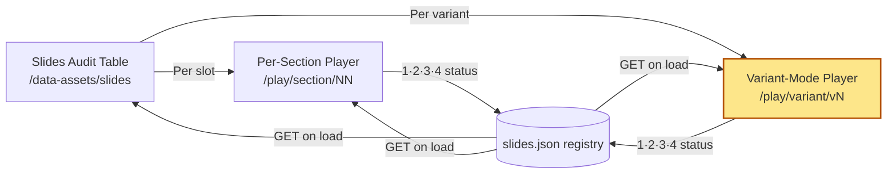

## Why Care?

We had 51 slides to review (17 sections × 3 variants), the status enum was wired up, and the per-section player let us walk slot-by-slot. That was *enough* to close the loop — but it wasn't the right shape for human attention. A reviewer who wants to evaluate "is v3 a coherent visual treatment across the whole deck?" doesn't want to bounce slot → slot → slot, watching the chrome switch from "Section 01 · Disclaimer" to "Section 02 · Vision & Mission" while the variant stays the same. They want to *see all the v3s in a row*, in narrative order, and judge them as a deck.

That's what shipped today. A single new route — `/play/variant/{v1|v2|v3}` — and a new mental mode that turned out to be the breakthrough we didn't know we needed. Within an hour of shipping it, every v3 issue we'd been chasing was either fixed or rated. The `/data-assets/slides` audit page now shows zero urgent across all 51 slides, and the path to "every variant ratable as passable or better" is clear.

## What's New?

- **`/play/variant/[variant].astro`** — full-deck player for one variant, walking 01 → 17 in section order with the same dark chrome and status fieldset as the per-section player.
- **Audit-table chips** — `▶ Play all` chips moved out of a paragraph above the table and into each `v1`/`v2`/`v3` column header, where they belong intuitively.
- **V3 chrome bug, finished off** — `T07-T17 v3` were missing the `.v3-plate` styles entirely (the source relies on a `<style is:global>` block in T02 that only applies in the assembled scroll deck). Fixed in the bulk adaptation script — every v3 slide now ships its own copy of the chrome treatment.
- **T09 + T10 v3 composition fix** — the injected `.v3-stage { max-width: 64rem }` was strangling content inside a 1920×1080 canvas. Pulled the stage out to `84rem`, tightened vertical rhythm, and on T10 specifically moved the `100+` keystone inline next to the header so the milestone list reclaims the width.
- **T13 v1 testimonial photos** — Frank Westermann, Eirini Rapti, and Lukas Eicher now show real headshots from `src/assets/firms/calm-storm-ventures/portfolio/` instead of `FW`/`ER`/`LE` initial chips. Same fix applied to the scroll-deck source.


## The Two-Mode Audit Loop

The mental model that emerged today:



Two players, one registry, one audit surface. The yellow node is what shipped today. Per-section asks *"of these three options for slide 07, which wins?"*; variant-mode asks *"is v3 a coherent treatment across the deck?"* Both modes update the same registry, so any decision made in one player is immediately visible in the other and on the audit page.

## The Variant-Mode Player

The route generates three pages at build time, one per variant, by globbing the slide tier and filtering by suffix:

```ts
export async function getStaticPaths() {
  return [
    { params: { variant: "v1" } },
    { params: { variant: "v2" } },
    { params: { variant: "v3" } },
  ];
}

const allSlides = import.meta.glob<any>(
  "/src/slides/by-title/*.astro",
  { eager: true }
);

const variantSuffix = `-${variant}.astro`;
const cards = Object.entries(allSlides)
  .filter(([path]) => path.endsWith(variantSuffix))
  .map(([path, mod]) => {
    const filename = path.replace(/^.*\/by-title\//, "")
                         .replace(/\.astro$/, "");
    const slotNum = parseInt(filename.match(/^(\d{2})-/)![1], 10);
    return { slideId: filename, slotNum, Comp: mod.default };
  })
  .sort((a, b) => a.slotNum - b.slotNum);
```

Each rendered slide carries `data-slide-id` (the registry key) and `data-slide-slot` / `data-slide-title` (so the chrome can update when you navigate). The status fieldset and keyboard handlers are lifted verbatim from the per-section player — copy-and-adapt, the way this codebase moves.

The same JS that drives per-section navigation drives variant-mode navigation. Number keys still set the active slide's status:

```ts
document.addEventListener("keydown", (e) => {
  switch (e.key) {
    case "ArrowRight": e.preventDefault(); next(); break;
    case "ArrowLeft":  e.preventDefault(); prev(); break;
    case "1": e.preventDefault(); setStatus("urgent-redo"); break;
    case "2": e.preventDefault(); setStatus("non-urgent-could-be-better"); break;
    case "3": e.preventDefault(); setStatus("passable"); break;
    case "4": e.preventDefault(); setStatus("perfect"); break;
    case "0": e.preventDefault(); setStatus("pending"); break;
  }
});
```

A reviewer can hold the right arrow and tap `4` whenever a slide deserves a Perfect — the registry catches every keystroke without breaking flow.

## The V3 Chrome Hunt

The first time we noticed something was wrong on v3 slides 7-17 was when *"CALM/STORM ESSAY · COMPETITIVE ADVANTAGE SPREAD 12/17"* ended up centered in the body of slide 12 instead of pinned to the top edge. Then *"MMXXVI Confidential"* showed up next to a paragraph on slide 7 instead of pinned to the bottom. The plate marks — the small Calmstorm contextual ribbons that frame every v3 slide — had no positioning context.

Why? Because the `.v3-plate` *markup* is in every v3 source, but the `.v3-plate` *styles* (the `position: absolute; top: 1.25rem; ...` rules) are defined in **T02-VisionMission.astro** under a `<style is:global>` block. In the scroll deck (`/thesis/version-3`), all 17 v3 sections live on one page, so the global from T02 applies to all of them. In the slide tier, each slide is loaded independently in the player — so any v3 slide that *isn't* T02 gets the markup with no styles.

Fix: the bulk adaptation script now injects a local copy of the v3 chrome stylesheet into every v3 slide it generates:

```python
v3_chrome_css = '''
  .v3-plate {
    position: absolute;
    left: 2.5rem;
    right: 2.5rem;
    display: flex;
    align-items: center;
    gap: 0.85rem;
    font-family: var(--font-display);
    font-size: 0.6rem;
    font-weight: 500;
    letter-spacing: 0.3em;
    text-transform: uppercase;
    color: var(--color-on-surface-faint);
  }
  .v3-plate--top    { top: 1.25rem; }
  .v3-plate--bottom { bottom: 1.25rem; }
  .v3-plate-rule { flex: 1; height: 1px; background: var(--color-outline); }
  /* ... .v3-stage, .v3-eyebrow, .v3-section-title, .v3-rule ... */
'''
if variant == "v3":
    shell_css = v3_chrome_css + shell_css
```

Re-ran the script across T07-T17, plates anchored correctly. One whole class of v3 issues went away in one rebuild.

## The Stage-Width Fix on T09 / T10

T09 and T10 v3 still looked broken even after the chrome fix — content was tall and narrow, like a column wedged into the center of the canvas with empty bands of margin on either side. Diagnosis was a one-line CSS rule:

```css
.v3-stage { max-width: 64rem; }
```

64rem is ~1024px. The slide canvas is 1920×1080, so usable width after padding is ~1760px. That cap, designed for a responsive scroll viewport, was forcing a narrow column inside a wide canvas — and because the row count is the same, content overflowed vertically. T09 has three "Parts" + a press list + 15 angels + 18 firms; T10 has six milestone rows + a keystone block. They were the densest v3 layouts, so they hit the wall first.

Pulled the stage to `84rem`, tightened paddings, and for T10 specifically restructured the layout with `grid-template-areas` so the `100+` keystone sits *inline* next to the header instead of stacking below it:

```css
.slide-10-v3-shell .v3-track {
  display: grid;
  grid-template-columns: minmax(0, 1fr) auto;
  grid-template-areas:
    "header keystone"
    "list   list";
  column-gap: 2rem;
  row-gap: 1rem;
}
.slide-10-v3-shell .v3-track > header        { grid-area: header; }
.slide-10-v3-shell .v3-track-keystone        { grid-area: keystone; align-self: center; }
.slide-10-v3-shell .v3-track-list            { grid-area: list; }
```

The milestone list now spans full canvas width below; the keystone numeral floats up beside the section heading where it belongs.

## T13 Headshots — Already On Disk

Last piece: Section 13 v1 (Community & Portfolio Service) was rendering testimonials with `FW` / `ER` / `LE` initials chips. Looked like a placeholder in search of a photo, and indeed the source was using `<div class="avatar-initials">{t.initials}</div>`.

First instinct was to reach for `crawl-fetch-ingest` to source the headshots. But before pulling the agent skill out, a quick `ls` on the portfolio assets directory:

```
src/assets/firms/calm-storm-ventures/portfolio/
├── 9am-health-ceo.avif    ← Frank Westermann
├── inne-ceo.avif          ← Eirini Rapti
└── nelly-ceo.avif         ← Lukas Eicher
```

All three already on disk from a prior round. Swapped initials for `<Image>` tags in both the slide-tier T13 v1 *and* the scroll-deck source, added a `.comm-quote-photo { width: 40px; height: 40px; border-radius: 50%; ... }` rule in both, done. Reminder to self: check what's already there before crawling.

## Where We Are Now

After today's session:

- **51 slides** across **17 sections × 3 variants**, every one adapted to the slide tier
- **Two audit-mode players** (per-section + variant-mode), both writing to the same `slides.json` registry
- **Audit page** at `/data-assets/slides` shows real-time status pills for every slide
- **Zero urgent** remaining; the rest of the path is `non-urgent → passable → perfect`

The audit loop closed in one sitting. The variant-mode player was the move that did it — looking at v3 as a deck instead of as 17 isolated slots changed what was easy to see and easy to fix.

## What's Next?

- Continue the rating pass through any remaining `non-urgent` and `passable` slides; promote what we can to `perfect`
- Decide which variant becomes the canonical promote-to-`/thesis` per slot
- Probably a third player mode: *"play only my favorites"* — walk just the slides currently rated `perfect` in section order, as a sanity check on the chosen deck shape
