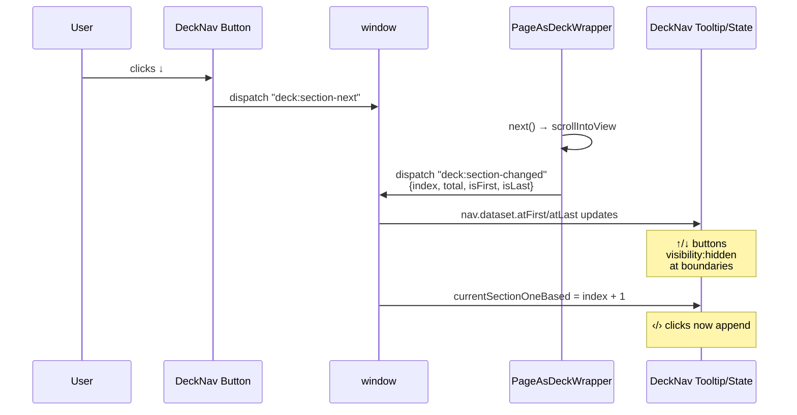

## Why Care?

Before today, the scroll-deck (`/thesis`, `/thesis/version-2`, `/thesis/version-3`) had two pieces of fixed chrome that didn't quite cooperate: a paginator badge in the bottom-right showing `3 / 17`, and right next to it a `‹ ›` button pair that cycled between design versions. The paginator overlapped the buttons. Worse, clicking `›` from "section 12 of v1" took you to "section 1 of v2" — losing your place every time you wanted to compare the same section across designs. And there was no UI affordance at all for *section* navigation; the only way to move within a deck was the keyboard.

Today we fixed all of it. The paginator moved to the top-right (clear of the lean header). The bottom-right became a proper four-button cross — `↑ ↓` walks sections within the current design version, `‹ ›` cycles between design versions while staying on the same section. Each button has a custom-styled tooltip that appears instantly on hover and names exactly what axis it moves along. The two boundary buttons (↑ on first section, ↓ on last) hide themselves so you never click into a wall.

The mental model — *up/down = section, left/right = version* — is now visible in the chrome and survives the click. You can audit one section across all three design versions in three clicks without losing position.

## What's New?

- **Paginator moved to top-right** — was bottom-right, overlapped DeckNav buttons. Settled at `top: 4.5rem` to clear the lean header strip.
- **Stale "Scroll Deck · vN · baseline (1 of 3)" badge removed from DeckNav** on the scroll decks — the lean header now carries that info, so the badge was double-counting.
- **Up/Down section-nav buttons added to DeckNav** (via `showSectionNav` prop) — wired to PageAsDeckWrapper through `deck:section-prev` / `deck:section-next` custom events.
- **Boundary-aware visibility** — `↑` is hidden on the first section, `↓` is hidden on the last. Driven by `data-at-first` / `data-at-last` attributes that mirror state from `deck:section-changed`.
- **Section preservation across version cycling** — clicking `‹` or `›` appends `#s-N` to the destination URL; the wrapper parses the hash on load and jumps to the matching section index.
- **Custom hover tooltips** replacing native `title=` (too slow, easy to miss) — instant 120ms fade-in, dark pill above the button with a small arrow, anchored to handle right-edge overflow.
- **Section-counter bug fix** — `wrapper.querySelectorAll('section')` was counting *all descendant* `<section>` tags, including decorative nested ones. v2 has 7 nested sections, v3 has 11 — so the counter was showing 17 / 24 / 28 instead of 17 / 17 / 17. Scoped to direct children of `.deck-content` only.
- **Tooltips right-anchored** so text flows leftward into the viewport — the rightmost button's tooltip was clipping off the right edge with the centered version.
- **`c` / `f` keyboard shortcuts** added to the scroll-deck wrapper — `c` toggles chrome, `f` toggles browser fullscreen. Same vocabulary as the slide player.

## The Two-Axis Mental Model

```
                        ↑
                  Previous section
                  (this design version)
                        ▲
                        │
   Previous version  ◀──┼──▶  Next version
   (same section)       │      (same section)
                        │
                        ▼
                  Next section
                  (this design version)
                        ↓
```

Two axes, two ways to move. Vertical (`↑ ↓`) keeps you inside one design version, walking the narrative. Horizontal (`‹ ›`) keeps you on the same point in the narrative, switching design treatments. Cross the two and you can audit any section across any version in two presses.

## How the Chrome and the Wrapper Talk

The DeckNav buttons live outside the deck wrapper (fixed-positioned), so they can't directly call into the wrapper's instance methods. Instead, they coordinate through window-scoped CustomEvents:



Three events, one shared state. The wrapper owns section navigation; the chrome owns the buttons; CustomEvents are the seam.

## Section Preservation Across Versions

The trickiest piece. Section IDs are *variant-prefixed* in the source (`community` / `v2-community` / `v3-community`), so they don't match across decks — a hash like `#community` would only resolve on v1. The reliable cross-version anchor is the section *index*, since all three decks render the same 17 sections in the same order.

DeckNav intercepts ‹ / › clicks, grabs the current 1-based index from the last `deck:section-changed` broadcast, and rewrites the destination URL:

```ts
let currentSectionOneBased = 1;
window.addEventListener("deck:section-changed", (e: any) => {
  if (typeof e.detail?.index === "number") {
    currentSectionOneBased = e.detail.index + 1;
  }
  // ...also flip data-at-first / data-at-last
});

document
  .querySelectorAll<HTMLAnchorElement>('a[data-nav="prev"], a[data-nav="next"]')
  .forEach((a) => {
    a.addEventListener("click", (ev) => {
      const base = a.getAttribute("href");
      if (!base || base === "#") return;
      ev.preventDefault();
      const sep = base.includes("#") ? "" : `#s-${currentSectionOneBased}`;
      window.location.href = base + sep;
    });
  });
```

PageAsDeckWrapper parses the hash on init and lands on the matching index *without* smooth scrolling (would feel laggy after a route change):

```ts
const hashMatch = location.hash.match(/^#s-(\d+)$/);
if (hashMatch) {
  const idx = Math.min(
    sections.length - 1,
    Math.max(0, parseInt(hashMatch[1], 10) - 1),
  );
  currentIndex = idx;
  sections[idx].scrollIntoView({ behavior: 'auto', block: 'start' });
  updateIndicator();
}
```

Now: section 14 of v1 → click ›  → section 14 of v2. The narrative arc stays put; only the design changes.

## The Bug We Almost Shipped — Counter Inflation

First pass at section preservation worked, but the counter started behaving strangely: 15 / 17 on v1, then 15 / 27 on v2, then 14 / 39 on v3. We froze the work in a `wip:` commit before debugging.

The diagnosis was a one-liner. The wrapper had:

```ts
const sections = wrapper.querySelectorAll<HTMLElement>('section');
```

That's a flat descendant query. Most T-files render a single outer `<section>`, but some have *nested* `<section>` elements as design containers. v1 sources have 17 outer + 0 nested = 17. v2 has 17 outer + 7 nested = 24. v3 has 17 outer + 11 nested = 28. The counter was correctly counting what it found — it just wasn't supposed to be finding the nested ones.

Scoping to direct children of `.deck-content` fixes it cleanly:

```ts
const deckContent = wrapper.querySelector<HTMLElement>(':scope > .deck-content');
const sections = deckContent
  ? deckContent.querySelectorAll<HTMLElement>(':scope > section')
  : wrapper.querySelectorAll<HTMLElement>('section');
```

Each T-component renders its `<section>` as the root of the slotted content, so it always lands as a direct child of `.deck-content`. The fallback to flat search is for any future deck that doesn't use the standard wrapper structure.

## The Tooltip Detail

Native `title=""` tooltips have a 1-2 second hover delay and pop with no styling. On a chrome that fades in only on hover, they were missing the moment — the user would hover, the tooltip wouldn't show, the hover would end before the tooltip resolved. We replaced them with CSS `::after` pseudo-elements:

```css
.deck-nav-btn::after {
  content: attr(data-tooltip);
  position: absolute;
  bottom: calc(100% + 0.5rem);
  left: 50%;
  transform: translateX(-50%) translateY(4px);
  background: rgb(15 23 42 / 0.95);
  color: white;
  font-size: 11px;
  padding: 0.4rem 0.65rem;
  border-radius: 4px;
  white-space: nowrap;
  pointer-events: none;
  opacity: 0;
  transition: opacity 120ms ease, transform 120ms ease;
  z-index: 200;
}
.deck-nav-btn:hover::after { opacity: 1; transform: translateX(-50%) translateY(0); }
```

Plus a `::before` arrow underneath. Plus a `:first-of-type` override that anchors the leftmost button's tooltip to the left so it doesn't clip off the right edge of the viewport. Tiny detail; matters when the chrome is the first thing the reviewer touches.

## The Tooltip Right-Anchor Fix

First version of the custom tooltips centered them above each button (`left: 50%; transform: translateX(-50%)`). That worked great for the leftmost buttons in the cluster — but for the rightmost button (`›`), pinned to the right edge of the viewport, the tooltip extended *off the right side of the page*. Half the text wasn't readable.

Fix was structural rather than special-cased: anchor every tooltip to the **right edge** of its button (`right: 0`) so text always flows leftward into the viewport, never outward. The little caret arrow (`::before`) sits at `right: 0.6rem` — under the right side of the button it belongs to, pointing down at it. No more `:first-of-type` override needed; one rule covers all four buttons uniformly.

```css
.deck-nav-btn::after {
  content: attr(data-tooltip);
  position: absolute;
  bottom: calc(100% + 0.5rem);
  right: 0;                /* was: left: 50%; transform: translateX(-50%) */
  transform: translateY(4px);
  /* ... */
}
.deck-nav-btn::before {
  /* arrow caret */
  bottom: calc(100% + 0.1rem);
  right: 0.6rem;            /* was: left: 50%; transform: translateX(-50%) */
  border: 4px solid transparent;
  border-top-color: rgb(15 23 42 / 0.95);
}
```

Tiny CSS change, big legibility win. Right-edge chrome wants right-anchored tooltips.

## Chrome-Off and Fullscreen — Keyboard Shortcuts From the Slide Player

The slide player at `/play/section/*` and `/play/variant/*` already had `c` to toggle chrome and `f` to toggle fullscreen. The scroll deck didn't. The asymmetry was annoying — same reviewing flow, same need for a clean canvas, different keystrokes per surface.

Lifted the same vocabulary into the scroll deck's keyboard handler. `c` toggles `body[data-chrome="off"]`; CSS rules fade out the lean header (`.deck-header`), the section paginator (`.section-indicator`), the DeckNav cross (`.deck-nav`), and any nav hints (`.nav-hint`). The deck wrapper also expands to a full `100vh` (no longer leaving room for the header strip), so the slide content takes the entire viewport. `f` calls `requestFullscreen()` / `exitFullscreen()` for the browser-native fullscreen toggle.

```ts
else if (e.key === 'c' || e.key === 'C') {
  e.preventDefault();
  document.body.dataset.chrome =
    document.body.dataset.chrome === 'off' ? 'on' : 'off';
}
else if (e.key === 'f' || e.key === 'F') {
  e.preventDefault();
  if (!document.fullscreenElement) document.documentElement.requestFullscreen?.();
  else document.exitFullscreen?.();
}
```

Press `c f` and you get a chromeless fullscreen scroll deck for showing a client. Press the keys again and the chrome comes back. Same shortcuts, same expectations across both surfaces.

The full keyboard map for `/thesis/*` is now:

| Key            | Action                                                  |
|----------------|---------------------------------------------------------|
| `↑` / `PageUp` | Previous section (this design version)                  |
| `↓` / `PageDown` | Next section (this design version)                    |
| `←`            | Previous design version (same section preserved)        |
| `→`            | Next design version (same section preserved)            |
| `Home`         | Jump to first section                                   |
| `End`          | Jump to last section                                    |
| `c`            | Toggle chrome (header + paginator + DeckNav)            |
| `f`            | Toggle browser fullscreen                               |

## What's Next?

- Apply the section-preservation pattern to the slide-by-slide variant chooser pages (`SlideLayout` callers) so audit-mode navigation between v1/v2/v3 of a single section also stays put
- Watch for view-transition DOM persistence under the new wrapper init — if multiple `.deck-wrapper` elements ever coexist, the chrome's `currentSectionOneBased` could read from the wrong one. Hasn't been observed yet but worth a guard
