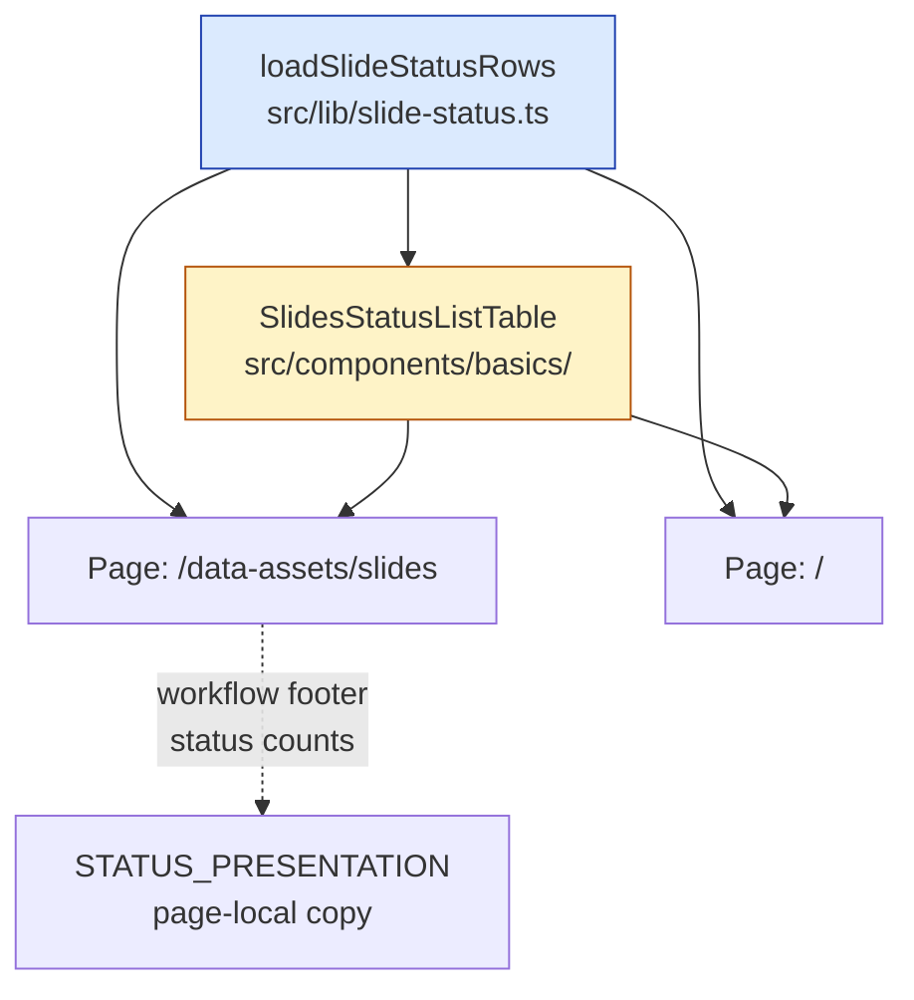

## Why Care?

The deck root used to be a thin table of contents — a numbered list of 17 slide titles, each linking to its variant chooser page. That was fine when the only thing the root needed to do was "let me jump to a slide." But after this week's audit infrastructure shipped — the four-status enum, the per-section player, the variant-mode player, the `/data-assets/slides` audit table — the deck root started looking *less* informed than every other surface in the app. You could see at a glance on `/data-assets/slides` which slides were urgent vs. perfect. On the root, the same 17 slides looked identical.


So today the root grew up. The bare TOC is gone; the same `<SlidesStatusListTable>` that powers the audit page now powers the root, drawing from the same data. The deck root is now an *audit dashboard*: every slot's status pills, the "▶ Play 3 variants" CTA per row, the "▶ Play all" chips under each variant column header — all of it, on the front door.

Plus the table header now sticks to the viewport while you scroll, the top status board got reordered into a more reviewer-friendly sequence, and each tile carries categorical breakdowns underneath the count. The root is now the densest, most useful surface in the app.

## What's New?

- **`SlidesStatusListTable.astro`** extracted as a standalone component — owns the sticky-header table, the status pill color map, and per-row rendering of variant cells, "Play 3 variants" CTAs, and "Play all" chips under each column header.
- **`src/lib/slide-status.ts`** added — exports `loadSlideStatusRows()` which encapsulates the filesystem walk over `src/slides/by-title/`, the adapted-vs-stub heuristic, and the join with the persisted review-status registry at `data/audits/slides.json`. One function, two callers.
- **Deck root (`/`)** swaps the bare `<ol>` TOC for `<SlidesStatusListTable rows={loadSlideStatusRows()} />`. Same component, same data, same audit affordances.
- **`/data-assets/slides`** drops its inline copy of the row-building logic and calls the shared lib instead. Page is ~80 lines smaller.
- **Sticky table header** — every `<th>` now carries `sticky top-0 z-10 bg-white shadow-[0_1px_0_0_#cbd5e1]`. Page-level scroll, header pinned to viewport top. Used `box-shadow` instead of `border-b` because `border-collapse` strips actual borders off sticky cells in most browsers.
- **Top status board reordered**: Design Variants → Slide Slots → Companies → People (was Companies → People → Slide Slots → Design Variants). Reads as "what shape is this thing? what slides? what entities?"
- **Categorical breakdowns** added under each count tile:
  - Companies: `30 portfolio` (with `· N organizations` line auto-rendering once any non-portfolio firm dirs land)
  - People: `7 partners · 3 SPs · 3 advisors · 26 portco CEOs` (LPAC slot in the schema, ready when role_class:lpac entries exist)
- **`AssetsDataSummary` schema extended** — added `portfolioCompanyCount`, `organizationCount`, `vcTeamCount`, `supportingPartnerCount`, `advisorCount`, `lpacCount`. Computed via `roleClass()` filter on the people array.
- **Right-rail boxes on `/` removed** — the dark "Play (next-gen slide tier)" card and the "Or scroll the assembled deck" card with three `/thesis/version-N` links. Both rolled into the new "Design Variants" tile in the top status board.

## The Two-Caller Pattern

When the same view shows up on two pages, you have three choices: copy the markup, copy the markup *and* the data-loading logic, or extract both into composable units. Today's work picked option three:



`loadSlideStatusRows()` is the data side. `SlidesStatusListTable` is the view side. Pages are thin and just compose them. The only deliberate duplication: the audit page's "Counts of reviewed variants" footer carries a copy of the `STATUS_PRESENTATION` color map, because it renders the same pills in a *different* container shape (count summary, not table cells). Each owner controls its own visual contract; if the colors ever drift, that's a small fix and a real signal that the contract should be moved into the lib.

## The Sticky Header Fix

`<th>` cells with `position: sticky; top: 0` is the classic pattern, but `border-collapse: collapse` (used on every table on the page) silently drops the bottom border off sticky cells in WebKit/Blink. Solution: a 1px `box-shadow` instead of a `border-b`:

```html
<th class="sticky top-0 z-10 bg-white shadow-[0_1px_0_0_#cbd5e1] ..."
```

`shadow-[0_1px_0_0_#cbd5e1]` — zero offset-x, 1px offset-y, zero blur, zero spread, slate-300. Renders as a hairline that survives sticky positioning. The `z-10` keeps the header layered above row contents. The `bg-white` ensures rows scrolling underneath stay invisible behind the header — without it the cells would be transparent and you'd see row content bleed through.

## The Categorical Breakdown Schema

The old `AssetsDataSummary` had `teamCount`, `portcoCeoCount`, `portcoCpoCount` — bucketed by *source dir* (which directory the .md file lives in). That's a structural fact, not a reviewer-meaningful fact. A reviewer wants to know "how many partners do we list? how many advisors? how many supporting partners?" — categories that come from `role_class` in the person frontmatter, not from the dirname.

Added the role-class filter:

```ts
const roleClass = (rc: string) => people.filter((p) => p.roleClass === rc).length;
return {
  // ...
  vcTeamCount: roleClass("vc-team"),
  supportingPartnerCount: roleClass("supporting-partner"),
  advisorCount: roleClass("advisor"),
  lpacCount: roleClass("lpac"),
};
```

Then the People tile renders only the non-zero buckets:

```astro
{s.vcTeamCount > 0 && (<><strong>{s.vcTeamCount}</strong> partners</>)}
{s.supportingPartnerCount > 0 && (<>{" · "}<strong>{s.supportingPartnerCount}</strong> SPs</>)}
{s.advisorCount > 0 && (<>{" · "}<strong>{s.advisorCount}</strong> advisors</>)}
{s.lpacCount > 0 && (<>{" · "}<strong>{s.lpacCount}</strong> LPAC</>)}
{s.portcoCeoCount > 0 && (<>{" · "}<strong>{s.portcoCeoCount}</strong> portco CEOs</>)}
```

Empty buckets stay quiet. As the data grows, the tile reveals more category counts automatically.

Same pattern for Companies — `portfolioCompanyCount` is the live count, `organizationCount` is `0` today (we only have one firm dir), and the tile suppresses the "0 organizations" line until any non-portfolio entries land.

## What's Next?

- Move `STATUS_PRESENTATION` into `src/lib/slide-status.ts` next time we touch the workflow footer — the duplication is small but it's a real coupling
- Promote `SlidesStatusListTable` to the `@knots/astro` pattern reference once another site needs the same audit shape
- Consider letting the table sort by status (currently sorted by slot number) — would help "show me the urgent ones first" reviewer flows
