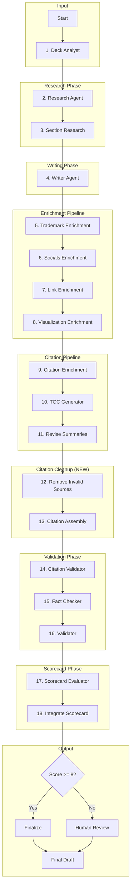

# Multi-Agent Orchestration for Investment Memo Generation

*An exploration into using AI supervisors and specialized agents to generate high-quality investment analysis documents that maintain analytical rigor, structural consistency, and distinctive voice*

# Ongoing Issues
Perplexity is still not following preferred format for citations `. [^1]`  
- Must always have a space before the first bracket. 
- Preference for adding the citation after the punctuation rather than before it.

## Context

Investment memos at [[moc/Hypernova|Hypernova]] follow a specific analytical format developed through deals like [[client-content/Hypernova/Portfolio/Aalo Atomics|Aalo Atomics]] (Series B, nuclear microreactors) and [[client-content/Hypernova/Portfolio/Star Catcher|Star Catcher]] (Pre-Series A, space power infrastructure). These memos balance:
- **Enthusiasm** for frontier technology and macro tailwinds
- **Skepticism** about execution risks and market uncertainties
- **Specificity** over generalization (exact metrics, named investors, dated milestones)

Traditional AI-assisted writing approaches struggle to maintain this balance across all sections while ensuring consistency with firm standards.

## Current Implementation (as of 2025-12-15)

The system has evolved significantly since initial design. Below is the **actual implemented workflow** with 18 specialized agents.

### Complete Agent Flow (ASCII)

```
┌──────────────────────────────────────────────────────────────────────────────┐
│                     IMPLEMENTED MEMO GENERATION PIPELINE                      │
│                            (18 agents via LangGraph)                          │
└──────────────────────────────────────────────────────────────────────────────┘

deck_analyst → research → section_research → draft → enrich_trademark →
enrich_socials → enrich_links → enrich_visualizations → cite → toc →
revise_summaries → remove_invalid_sources → assemble_citations →
validate_citations → fact_check → validate → scorecard → integrate_scorecard

┌──────────────┐
│  Supervisor  │ ← Coordinates workflow via LangGraph
└──────┬───────┘
       │
   ┌───┴──────────────────┐
   │ 1. Deck Analyst      │ ← Extract info from pitch deck PDF/PPTX
   └───┬──────────────────┘   Saves: 0-deck-analysis.json, 0-deck-analysis.md
       │
   ┌───┴──────────────────┐
   │ 2. Research          │ ← Web search (Tavily: 4 queries) + synthesis
   └───┬──────────────────┘   Saves: 1-research.json, 1-research.md
       │
   ┌───┴──────────────────┐
   │ 3. Section Research  │ ← Section-specific Perplexity research with citations
   └───┬──────────────────┘   Saves: 1-research/*.md (per-section research)
       │
   ┌───┴──────────────────┐
   │ 4. Writer            │ ← Draft memo (10 sections), polish section research
   └───┬──────────────────┘   Saves: 2-sections/*.md (10 files)
       │
   ╔═══╧═══════════════════════════════════════════════════════════╗
   ║               ENRICHMENT PIPELINE (4 agents)                  ║
   ╠═══════════════════════════════════════════════════════════════╣
   ║  5. Trademark   → 6. Socials → 7. Links → 8. Visualizations   ║
   ║     Insert logo    LinkedIn     Hyperlink    (disabled)       ║
   ║     in header      profiles     orgs/VCs                      ║
   ╚═══╤═══════════════════════════════════════════════════════════╝
       │              Updates 2-sections/*.md
       │
   ┌───┴──────────────────┐
   │ 9. Citation Enrich   │ ← Add inline citations (Perplexity Sonar Pro)
   └───┬──────────────────┘   Adds [^1], [^2], etc. per section
       │
   ┌───┴──────────────────┐
   │ 10. TOC Generator    │ ← Generate Table of Contents with anchor links
   └───┬──────────────────┘   Insert TOC after header, before first section
       │
   ┌───┴──────────────────┐
   │ 11. Revise Summaries │ ← Rewrite Executive Summary + Closing Assessment
   └───┬──────────────────┘   Extract metrics from body, ensure accurate bookends
       │
   ╔═══╧═══════════════════════════════════════════════════════════╗
   ║            CITATION CLEANUP PIPELINE (2 agents)               ║
   ║                  (NEW: added 2025-12-15)                      ║
   ╠═══════════════════════════════════════════════════════════════╣
   ║  12. Remove Invalid Sources    → 13. Citation Assembly        ║
   ║      - HTTP HEAD validation        - Renumber [^1][^2][^3]... ║
   ║      - Remove 404s/410s            - Consolidate to ONE block ║
   ║      - Detect hallucinations       - Remove per-section defs  ║
   ║        (example.com, XXXXX)        - Assemble final draft     ║
   ╚═══╤═══════════════════════════════════════════════════════════╝
       │              Cleans 1-research/ and 2-sections/
       │              Outputs: 6-{Company}-v0.0.x.md
       │
   ┌───┴──────────────────┐
   │ 14. Citation Validator│ ← Validate date accuracy, detect duplicates
   └───┬──────────────────┘   Check remaining URLs, ensure proper formatting
       │
   ┌───┴──────────────────┐
   │ 15. Fact Checker     │ ← Verify claims against research sources
   └───┬──────────────────┘   Identify unsourced metrics, hallucinated data
       │
   ┌───┴──────────────────┐
   │ 16. Validator        │ ← Score 0-10, identify issues
   └───┬──────────────────┘   Saves: 3-validation.json, 3-validation.md
       │
   ┌───┴──────────────────┐
   │ 17. Scorecard        │ ← Evaluate against firm's scorecard template
   └───┬──────────────────┘   Saves: 5-scorecard/12Ps-scorecard.md
       │
   ┌───┴──────────────────┐
   │ 18. Integrate Score  │ ← Integrate scorecard into section 8, reassemble
   └───┬──────────────────┘
       │
   ┌───┴───────────────┐
   │   Score >= 8?     │
   └───┬───────────┬───┘
       │           │
   ┌───┴────┐  ┌──┴──────────┐
   │Finalize│  │Human Review │
   └────────┘  └─────────────┘
```

### Complete Agent Flow (Mermaid)



### Agent Reference Table

| # | Agent | File | Purpose |
|---|-------|------|---------|
| 1 | Deck Analyst | `deck_analyst.py` | Extract info from pitch decks (PDF/PPTX) |
| 2 | Research | `research_enhanced.py` | Web search via Tavily/Perplexity |
| 3 | Section Research | `perplexity_section_researcher.py` | Section-specific research with citations |
| 4 | Writer | `writer.py` | Draft sections from outline/template |
| 5 | Trademark Enrichment | `trademark_enrichment.py` | Insert company logo into header |
| 6 | Socials Enrichment | `socials_enrichment.py` | Add LinkedIn links to team members |
| 7 | Link Enrichment | `link_enrichment.py` | Add hyperlinks to organizations/entities |
| 8 | Visualization Enrichment | `visualization_enrichment.py` | Add charts/graphs (currently disabled) |
| 9 | Citation Enrichment | `citation_enrichment.py` | Add inline citations via Perplexity Sonar Pro |
| 10 | TOC Generator | `toc_generator.py` | Generate Table of Contents with anchor links |
| 11 | Revise Summaries | `revise_summary_sections.py` | Rewrite Executive Summary + Closing Assessment |
| 12 | Remove Invalid Sources | `remove_invalid_sources.py` | Validate URLs, remove 404s and hallucinations |
| 13 | Citation Assembly | `citation_assembly.py` | Global citation renumbering & consolidation |
| 14 | Citation Validator | `citation_validator.py` | Validate citation accuracy and dates |
| 15 | Fact Checker | `fact_checker.py` | Verify claims against research sources |
| 16 | Validator | `validator.py` | Score memo quality (0-10 scale) |
| 17 | Scorecard Evaluator | `scorecard_evaluator.py` | Evaluate against firm's scorecard template |
| 18 | Integrate Scorecard | `workflow.py:integrate_scorecard()` | Integrate scorecard into section 8 |

### Citation Cleanup Pipeline (NEW 2025-12-15)

The citation cleanup pipeline was added to address **hallucinated citations from Perplexity Sonar Pro**. Despite using premium @ syntax sources, Perplexity sometimes returns:
- **Fabricated URLs**: Real domains with fake paths (e.g., `mckinsey.com/fake-report`)
- **Placeholder text**: `XXXXX`, `example.com`
- **404/410 errors**: URLs that don't exist

**Agent 12: Remove Invalid Sources** (`remove_invalid_sources.py`)
- HTTP HEAD validation on all citation URLs
- Removes citations with 404/410 status codes
- Detects hallucination patterns (example.com, XXXXX, placeholder)
- Cleans both `1-research/` and `2-sections/` directories
- Uses ThreadPoolExecutor for parallel URL validation

**Agent 13: Citation Assembly** (`citation_assembly.py`)
- Extracts all inline citations from all sections
- Builds global renumbering map (sequential starting at 1)
- Removes citation definitions from section bodies
- Consolidates all citations into ONE block at document end
- Assembles final draft: `6-{Company}-v0.0.x.md`

See also:
- `context-vigilance/Faked-Sources-from-Perplexity.md` - Documentation of hallucination problem
- `context-vigilance/An-Agent-should-Reorder-and-Organize-Citations-on-Assembly.md` - Assembly requirements

---

## Running the Command
```bash
source .venv/bin/activate && python -m src.main "DayOne" --type direct
```

## The Challenge

### Single-Prompt Limitations
- **Inconsistent quality** across memo sections
- **Vague generalizations** instead of specific metrics
- **Promotional tone** rather than analytical balance
- **Missing risk analysis** or superficial mitigation strategies
- **Format drift** from established templates
- **Poor source attribution** for market claims

### Manual Generation Problems
- **Time-intensive** research and drafting (8-12 hours per memo)
- **Inconsistent structure** when rushed
- **Knowledge gaps** in specialized domains (deep tech, regulatory)
- **Iteration overhead** for revisions and validation
- **Context switching** between research, writing, and validation modes

## Discovery: Supervisor Pattern for Document Generation

Rather than treating AI as a single monolithic writer, decompose the task into specialized agents supervised by an orchestrator:

```
┌──────────────────┐
│  Supervisor      │ ← Coordinates workflow, manages state
│  Agent           │
└────────┬─────────┘
         │
    ┌────┴─────────────────────┐
    │                          │
┌───┴────────┐         ┌───────┴──────┐
│ Research   │         │ Validation   │
│ Agent      │         │ Agent        │
└────────────┘         └──────────────┘
    │                          │
┌───┴────────┐         ┌───────┴──────┐
│ Writer     │         │ Revision     │
│ Agent      │         │ Agent        │
└────────────┘         └──────────────┘
```

This approach enables:
- **Specialization** by domain (market analysis vs. technical assessment)
- **Quality gates** through dedicated validation agents
- **Iterative refinement** with supervisor-managed revision loops
- **Consistency** through centralized template and style enforcement

## Solution Architecture

### 1. Model Context Protocol (MCP) for Data Access

**What it is**: Open protocol (Anthropic, late 2024) allowing AI models to connect to external data sources through standardized servers.

**Implementation for investment memos**:

```
┌─────────────────┐
│  Claude/GPT-4   │ ← Orchestrator Agent
└────────┬────────┘
         │
    ┌────┴────┐
    │   MCP   │
    └────┬────┘
         │
    ┌────┴────────────────────────┐
    │                             │
┌───┴────────┐           ┌────────┴────┐
│ MCP Server │           │ MCP Server  │
│ (Portfolio │           │ (Market     │
│  Data)     │           │  Research)  │
└────────────┘           └─────────────┘
```

**MCP servers to build**:
- **Portfolio Data Server**: Company data, previous memos, investment theses
- **Market Research Server**: Crunchbase, PitchBook APIs, public filings
- **Template Server**: Memo templates, style guides, reference examples
- **Validation Server**: Quality criteria, checklist enforcement

**Benefits:**
- **Secure data access** without prompt injection risks
- **Standardized interfaces** across different data sources
- **Version-controlled** schemas and resources
- **Audit trails** for data access

### 2. Agent Specialization Strategy

#### Research Agent
**Responsibility**: Gather comprehensive company and market data

**Tools**:
- Market sizing databases (PitchBook, Crunchbase)
- Company websites and public filings
- Competitor analysis frameworks
- Regulatory databases (FDA, NRC, FCC)

**Output**: Structured JSON with:
```json
{
  "company": {
    "name": "...",
    "stage": "...",
    "founders": [...],
    "funding_history": [...]
  },
  "market": {
    "tam": "...",
    "growth_drivers": [...],
    "competitive_landscape": [...]
  },
  "sources": [...]
}
```

#### Writer Agent
**Responsibility**: Draft memo sections following Hypernova format

**Context**:
- Memo template with section structure
- Style guide with good/bad examples
- 2-3 reference memos from similar stage/sector

**Specialization options**:
- **Market Writer**: Sections 2-3 (Business Overview, Market Context)
- **Technical Writer**: Sections 4-5 (Technology & Product, Traction)
- **Team Writer**: Section 6 (Team assessment)
- **Risk Writer**: Section 8 (Risks with mitigations)

**Output**: Draft sections with proper formatting and citation placeholders

#### Validator Agent
**Responsibility**: Ensure memos meet Hypernova standards

**Validation criteria**:
- [ ] Follows exact 10-section structure
- [ ] Includes specific metrics (not vague claims)
- [ ] Risk section has 4-6 items with mitigations
- [ ] All acronyms spelled out on first use
- [ ] Market sizing includes sources/caveats
- [ ] Team section includes prior exits/companies
- [ ] Analytical tone (not promotional)
- [ ] Information density matches reference memos

**Output**:
```json
{
  "score": 8.5,
  "needs_revision": true,
  "sections_to_revise": ["market_context", "risks"],
  "feedback": {
    "market_context": "Missing source for $250B TAM claim",
    "risks": "Need concrete mitigation for regulatory risk"
  }
}
```

#### Revision Agent
**Responsibility**: Fix specific issues identified by validator

**Input**: Original section + validator feedback

**Strategy**: Targeted fixes (not full rewrites) to preserve good content

**Output**: Revised section addressing specific feedback

### 3. Supervisor Orchestration Logic

**State management**:
```python
class MemoState(TypedDict):
    company_name: str
    company_data: dict
    research: dict
    draft_sections: dict
    validation_results: dict
    revision_count: int
    final_memo: str
```

**Control flow**:
```python
def supervisor_logic(state: MemoState) -> str:
    """Decides which agent to call next"""

    if not state.get("research"):
        return "research_agent"

    if not state.get("draft_sections"):
        return "writer_agent"

    if not state.get("validation_results"):
        return "validator_agent"

    if state["validation_results"]["needs_revision"]:
        if state["revision_count"] < 3:
            return "revision_agent"
        else:
            return "human_review"  # Escalate after 3 attempts

    return "finalize"
```

**Human-in-the-loop checkpoints**:
- After research (review data quality)
- After first draft (strategic direction)
- After validation failures (complex revisions)
- Before finalization (sign-off)

## Platform Options

### Language Choice: Python vs. JavaScript

Before selecting a specific framework, an important architectural decision is choosing the implementation language.

#### Python (Recommended for LangGraph)

**LangGraph (Python)** - The original and most mature implementation

**Advantages**:
- More examples and documentation
- Larger community and ecosystem
- Better integration with ML/AI tools (pandas, numpy, scikit-learn)
- Most MCP servers are Python-based
- Direct Claude/OpenAI SDK integration
- New features ship in Python first

**When to choose Python**:
- You're comfortable with Python or willing to learn it
- You want maximum flexibility and features
- You need ML/data analysis capabilities
- You're building backend services or scripts

#### JavaScript/TypeScript (Alternative)

**LangGraph.js** - Newer port of LangGraph to JS/TS

**Advantages**:
- Good if you're already in Node.js ecosystem
- Easier integration with existing web apps
- TypeScript types for better IDE support
- Can run in browser or edge workers

**Limitations**:
- Still maturing (fewer features than Python version)
- Smaller community and fewer examples
- Features lag behind Python implementation

**When to choose JavaScript**:
- You're already building in Node.js/TypeScript
- You want to run agents in browser or edge workers
- Your team is JS-first and wants to avoid Python

#### Hybrid Approach (Often Best)

Many teams use both languages strategically:

```
┌─────────────────────┐
│   Python Backend    │
│   (LangGraph)       │
│                     │
│ - Agent orchestration
│ - MCP servers       │
│ - Heavy processing  │
└──────────┬──────────┘
           │ REST/GraphQL API
           │
┌──────────┴──────────┐
│   Web Frontend      │
│   (Astro/Svelte)    │
│                     │
│ - UI for memo input │
│ - Progress display  │
│ - Review interface  │
└─────────────────────┘
```

**Benefits of hybrid approach**:
- Use Python's strengths for AI orchestration
- Use your preferred web stack for UI/UX
- Clean separation of concerns
- Each layer uses optimal tooling

#### Recommendation

**Start with Python LangGraph** for investment memo generation because:

1. **Better learning resources** - Most tutorials and examples are Python
2. **More stable** - Features are battle-tested in Python first
3. **MCP ecosystem** - Most servers are Python (easier integration)
4. **Future-proof** - New LangGraph features ship in Python first
5. **Production-ready** - More deployments in production

You can always:
- Expose Python agents via REST API
- Build web UI in your preferred framework
- Move to LangGraph.js later if needed (patterns transfer)

### Option 1: LangGraph (Recommended)

**Why it fits**:
- Python-based (easy integration)
- Explicit state management
- Built-in persistence (save/resume workflows)
- Human-in-the-loop support
- Conditional branching based on validation

**Example implementation**:
```python
from langgraph.graph import StateGraph, END

# Define workflow
workflow = StateGraph(MemoState)

# Add agent nodes
workflow.add_node("research", research_agent)
workflow.add_node("draft", writer_agent)
workflow.add_node("validate", validator_agent)
workflow.add_node("revise", revision_agent)

# Define control flow
workflow.add_edge("research", "draft")
workflow.add_edge("draft", "validate")
workflow.add_conditional_edges(
    "validate",
    lambda x: "revise" if x["validation_results"]["needs_revision"] else END,
    {"revise": "revise", END: END}
)
workflow.add_edge("revise", "validate")

# Set entry point
workflow.set_entry_point("research")

# Compile
app = workflow.compile()
```

**Benefits:**
- **Visual debugging** of agent transitions
- **Checkpoint recovery** if workflow fails
- **Parallel execution** of independent sections
- **Streaming output** for long-running tasks

### Option 2: AutoGen (Microsoft)

**Why it might fit**:
- Multi-agent conversation framework
- Agents critique each other's work
- Built-in group chat for coordination

**Example structure**:
```python
from autogen import AssistantAgent, GroupChat, GroupChatManager

research_agent = AssistantAgent(
    name="Researcher",
    system_message="Gather market data and competitive analysis",
    llm_config={"model": "gpt-4"}
)

writer_agent = AssistantAgent(
    name="Writer",
    system_message="Draft memo sections following Hypernova format",
    llm_config={"model": "claude-sonnet-4.5"}
)

critic_agent = AssistantAgent(
    name="Critic",
    system_message="Validate against Hypernova style guide",
    llm_config={"model": "gpt-4"}
)

groupchat = GroupChat(
    agents=[research_agent, writer_agent, critic_agent],
    messages=[],
    max_round=10
)

manager = GroupChatManager(groupchat=groupchat)
```

**Benefits:**
- **Conversational refinement** (agents debate approaches)
- **Emergent collaboration** patterns
- **Flexible agent interactions**

**Drawbacks:**
- Less explicit control flow
- Harder to debug multi-agent conversations
- Can be verbose with many iterations

### Option 3: CrewAI

**Why it might fit**:
- Role-based agent design
- Opinionated structure (fast to prototype)
- Built-in task management

**Example configuration**:
```python
from crewai import Agent, Task, Crew

researcher = Agent(
    role='Investment Researcher',
    goal='Gather comprehensive company and market data',
    backstory='Expert at finding reliable market sizing',
    tools=[crunchbase_tool, pitchbook_tool]
)

writer = Agent(
    role='Investment Analyst',
    goal='Draft memos following Hypernova format',
    backstory='Former VC associate with 50+ memos written',
    tools=[memo_template_tool]
)

crew = Crew(
    agents=[researcher, writer, validator],
    tasks=[research_task, write_task, validate_task],
    verbose=True
)

result = crew.kickoff(inputs={'company_name': 'Aalo Atomics'})
```

**Benefits:**
- **Fast prototyping** with minimal boilerplate
- **Role-based thinking** matches VC workflows
- **Sequential or hierarchical** process support

**Drawbacks:**
- Less flexible than LangGraph
- Abstractions may hide important details
- Younger ecosystem (fewer examples)

### Option 4: Custom with Claude API + MCP

**Why it might fit**:
- Maximum control over workflow
- No framework overhead
- Direct Claude integration

**Minimal implementation**:
```python
import anthropic

class MemoOrchestrator:
    def __init__(self, api_key):
        self.client = anthropic.Anthropic(api_key=api_key)

    async def generate_memo(self, company_data: dict) -> dict:
        state = {
            "company": company_data["name"],
            "research": None,
            "draft": None,
            "validation": None,
            "iterations": 0
        }

        while state["iterations"] < 5:
            # Call supervisor
            supervisor_response = await self.client.messages.create(
                model="claude-sonnet-4.5",
                messages=[{
                    "role": "user",
                    "content": f"State: {state}. Next action?"
                }],
                tools=[
                    research_tool,
                    write_tool,
                    validate_tool,
                    finalize_tool
                ]
            )

            # Execute tool calls
            for tool_use in supervisor_response.content:
                if tool_use.name == "research":
                    state["research"] = await self.research(company_data)
                elif tool_use.name == "write":
                    state["draft"] = await self.write(state["research"])
                elif tool_use.name == "validate":
                    state["validation"] = await self.validate(state["draft"])
                elif tool_use.name == "finalize":
                    return state["draft"]

            state["iterations"] += 1

        return state["draft"]
```

**Benefits:**
- **Complete control** over execution
- **Minimal dependencies**
- **Easy to customize** for specific needs

**Drawbacks:**
- More code to maintain
- Manual state persistence
- No built-in debugging tools

## Implementation Roadmap

### Step 1: Proof of Concept
1. **Choose framework**: LangGraph (recommended) or CrewAI (faster start)
2. **Define 3 core agents**: Researcher, Writer, Validator
3. **Create simple tools**:
   - `get_template()` - returns memo template
   - `get_style_guide()` - returns good/bad examples
   - `validate_section(section, criteria)` - checks one section
4. **Test with existing portfolio company**
5. **Compare output** to manual memos
6. **Add a Deck Analyst Agent**
   - Role: Venture Capital Investment Analyst
   - Goal: Review the "Slide Deck" for the investment opportunity, either an LP Commmitment into a fund or a direct investment into a startup company. Include relevant information, especially numbers about the organizations' traction, reach, business model, product definition and market potential.
   - Backstory: Young venture capital investment analyst with 3+ years of experience who understands the basic technologies and market opportunities of early stage venture capital at the time of writing.

### Issues, Troubleshooting, Preferences during Implementation
- [x] Create a "trail" of the collected information as structured output or markdown files
- [x] Assure that citations are retained in the final output with proper attribution
- [x] Terminal progress indicators and status messages to track workflow
- [x] Find a way to include direct markdown links to team's LinkedIn profiles
- [x] Allow arguments for specifying whether the investment has already been decided (even wired already) or is currently being considered.
    - [x] Specialized research strategies per investment type (e.g., GP track record analysis for funds) 
- [x] Find a way to "add" links to important organizations, such as government bodies, co-investors or previous investors, etc
- [x] Find a way to include any public charts, graphs, diagrams, or visualizations from the company's website or other sources

### Remaining Enhancements

## **Success criteria**:
- Generates complete 10-section memo
- Deck Analyst Agent includes relevant information from the slide deck as the starter information for the memo.
- Research Analyst Agent works from the output of the Deck Analyst Agent if it exists.
- Validates against checklist
- Identifies at least 3 quality issues automatically

---

#### Detailed Implementation Plan: Deck Analyst Agent

**Overview**: Add a new Deck Analyst Agent that extracts key information from pitch decks (PDF or images) and creates initial section drafts. This agent runs BEFORE the Research Agent, providing a foundation of company-provided data that subsequent agents can build upon.

**Architecture Changes**:

```
┌──────────────┐
│  Supervisor  │ ← Checks if deck exists, routes accordingly
└──────┬───────┘
       │
   ┌───┴─────────────┐
   │ Deck Analyst    │ ← NEW: Runs FIRST if deck available
   │ (if deck exists)│    Saves: 0-deck-analysis.json, 0-deck-analysis.md
   └───┬─────────────┘    Saves: 2-sections/*.md (partial drafts)
       │
   ┌───┴────┐
   │Research│ ← UPDATED: Builds on deck analysis if available
   └───┬────┘   Reads: 0-deck-analysis.json
       │        Saves: 1-research.json, 1-research.md
   ┌───┴────┐
   │ Writer │ ← UPDATED: Uses existing section drafts as starting point
   └───┬────┘   Reads: 2-sections/*.md (if exists)
       │        Augments or creates sections
       │
   [Rest of workflow unchanged]
```

**File Changes Required**:

1. **New File: `src/agents/deck_analyst.py`**
   - Role: Venture Capital Investment Analyst
   - Goal: Extract traction, business model, product, market, team info from deck
   - Uses: `pypdf` library (already installed)
   - Outputs: Structured JSON + initial section drafts

2. **Update: `src/state.py`**
   - Add `deck_path: Optional[str]` to MemoState
   - Add `deck_analysis: Optional[DeckAnalysisData]` to MemoState
   - New TypedDict: `DeckAnalysisData`

3. **Update: `src/workflow.py`**
   - Add conditional deck analysis node
   - Update supervisor routing logic
   - Modify research agent to check for deck analysis

4. **Update: `src/agents/researcher.py` or `research_enhanced.py`**
   - Check for existing deck_analysis in state
   - Incorporate deck findings into research queries
   - Avoid duplicating information already in deck

5. **Update: `src/agents/writer.py`**
   - Check for existing section files in `2-sections/`
   - If section file exists, read it and augment (don't overwrite)
   - If doesn't exist, create from scratch

6. **Update: `src/artifacts.py`**
   - Add function: `save_deck_analysis_artifacts()`
   - Add function: `load_existing_section_drafts()`
   - Add numbering: deck artifacts use `0-` prefix

7. **Update: `src/main.py`**
   - Load company data JSON (check for "deck" property)
   - Pass deck_path to initial state if exists

**Implementation Steps (In Order)**:

**Step 1: Define State Schema**
```python
# src/state.py additions

class DeckAnalysisData(TypedDict):
    """Structured data extracted from pitch deck"""
    company_name: str
    tagline: Optional[str]
    problem_statement: Optional[str]
    solution_description: Optional[str]
    product_description: Optional[str]
    business_model: Optional[str]
    market_size: Optional[Dict[str, str]]  # TAM, SAM, SOM
    traction_metrics: Optional[List[Dict[str, str]]]
    team_members: Optional[List[Dict[str, str]]]
    funding_ask: Optional[str]
    use_of_funds: Optional[List[str]]
    competitive_landscape: Optional[str]
    go_to_market: Optional[str]
    milestones: Optional[List[str]]
    deck_page_count: int
    extraction_notes: List[str]  # What info was/wasn't found

class MemoState(TypedDict):
    # ... existing fields ...
    deck_path: Optional[str]  # NEW
    deck_analysis: Optional[DeckAnalysisData]  # NEW
```

**Step 2: Create Deck Analyst Agent**
```python
# src/agents/deck_analyst.py

from pathlib import Path
from typing import Dict
from langchain_anthropic import ChatAnthropic
from pypdf import PdfReader
import json

def deck_analyst_agent(state: Dict) -> Dict:
    """
    Analyzes pitch deck and extracts key information.

    CRITICAL: Only handles PDF decks for now. Image decks cause bottlenecks.
    Future: Add image deck support with optimization (resizing, compression).
    """
    deck_path = state.get("deck_path")

    if not deck_path or not Path(deck_path).exists():
        return {
            "deck_analysis": None,
            "messages": ["No deck available, skipping deck analysis"]
        }

    deck_file = Path(deck_path)

    # STEP 1: Extract text from PDF (pypdf)
    if deck_file.suffix.lower() == ".pdf":
        deck_content = extract_text_from_pdf(deck_path)
    else:
        # For now, skip image decks to avoid bottleneck
        return {
            "deck_analysis": None,
            "messages": [f"Deck format {deck_file.suffix} not yet supported (images cause bottleneck)"]
        }

    # STEP 2: Analyze with Claude
    llm = ChatAnthropic(
        model="claude-sonnet-4-5-20250929",
        temperature=0
    )

    analysis_prompt = f"""You are a venture capital investment analyst reviewing a pitch deck.

PITCH DECK CONTENT:
{deck_content}

Extract the following information in JSON format:
{{
  "company_name": "...",
  "tagline": "...",
  "problem_statement": "...",
  "solution_description": "...",
  "product_description": "...",
  "business_model": "...",
  "market_size": {{"TAM": "...", "SAM": "...", "SOM": "..."}},
  "traction_metrics": [{{"metric": "...", "value": "..."}}, ...],
  "team_members": [{{"name": "...", "role": "...", "background": "..."}}, ...],
  "funding_ask": "...",
  "use_of_funds": ["...", "..."],
  "competitive_landscape": "...",
  "go_to_market": "...",
  "milestones": ["...", "..."],
  "extraction_notes": ["List what info was found vs. missing"]
}}

IMPORTANT:
- Only include information explicitly stated in the deck
- Use "Not mentioned" if information is absent
- Capture specific numbers (revenue, users, growth rates)
- Note the deck's strengths and weaknesses in extraction_notes
"""

    response = llm.invoke(analysis_prompt)
    deck_analysis = json.loads(response.content)
    deck_analysis["deck_page_count"] = len(PdfReader(deck_path).pages)

    # STEP 3: Create initial section drafts where relevant info exists
    section_drafts = create_initial_section_drafts(deck_analysis, state)

    # STEP 4: Save artifacts
    from src.artifacts import save_deck_analysis_artifacts
    save_deck_analysis_artifacts(
        state["company_name"],
        deck_analysis,
        section_drafts
    )

    return {
        "deck_analysis": deck_analysis,
        "draft_sections": section_drafts,  # Partial sections
        "messages": [f"Deck analysis complete: {deck_analysis['deck_page_count']} pages analyzed"]
    }


def extract_text_from_pdf(pdf_path: str) -> str:
    """Extract text from PDF using pypdf."""
    reader = PdfReader(pdf_path)
    text_content = []

    for page_num, page in enumerate(reader.pages, 1):
        page_text = page.extract_text()
        text_content.append(f"--- PAGE {page_num} ---\n{page_text}\n")

    return "\n".join(text_content)


def create_initial_section_drafts(deck_analysis: Dict, state: Dict) -> Dict[str, str]:
    """
    Create draft sections based on deck content.
    Only creates sections where substantial info exists.
    """
    llm = ChatAnthropic(model="claude-sonnet-4-5-20250929", temperature=0)

    drafts = {}

    # Map deck data to sections
    section_mapping = {
        "02-business-overview.md": ["problem_statement", "solution_description", "product_description"],
        "03-market-context.md": ["market_size", "competitive_landscape"],
        "04-technology-product.md": ["product_description", "solution_description"],
        "05-traction-milestones.md": ["traction_metrics", "milestones"],
        "06-team.md": ["team_members"],
        "07-funding-terms.md": ["funding_ask", "use_of_funds"],
        "09-investment-thesis.md": ["go_to_market", "competitive_landscape"]
    }

    for section_file, relevant_fields in section_mapping.items():
        # Check if deck has substantial info for this section
        has_info = any(
            deck_analysis.get(field) and
            deck_analysis[field] != "Not mentioned"
            for field in relevant_fields
        )

        if has_info:
            section_name = section_file.replace(".md", "").replace("-", " ").title()
            draft = create_section_draft_from_deck(
                llm,
                section_name,
                deck_analysis,
                relevant_fields
            )
            drafts[section_file] = draft

    return drafts


def create_section_draft_from_deck(llm, section_name: str, deck_data: Dict, fields: List[str]) -> str:
    """Generate a section draft from deck data."""
    relevant_data = {k: deck_data.get(k) for k in fields if deck_data.get(k)}

    prompt = f"""Draft the "{section_name}" section for an investment memo based on this pitch deck data:

{json.dumps(relevant_data, indent=2)}

Write a concise, analytical section (200-400 words) that:
- Uses specific numbers and metrics from the deck
- Maintains analytical (not promotional) tone
- Notes data gaps explicitly (e.g., "Team backgrounds not disclosed in deck")
- Formats for readability (bullet points where appropriate)

This is an INITIAL DRAFT. The Research and Writer agents will augment with external data.
"""

    response = llm.invoke(prompt)
    return response.content
```

**Step 3: Update Artifacts System**
```python
# src/artifacts.py additions

def save_deck_analysis_artifacts(
    company_name: str,
    deck_analysis: Dict,
    section_drafts: Dict[str, str]
) -> None:
    """Save deck analysis artifacts with 0- prefix."""
    output_dir = get_or_create_output_dir(company_name)

    # Save structured JSON
    with open(output_dir / "0-deck-analysis.json", "w") as f:
        json.dump(deck_analysis, f, indent=2)

    # Save human-readable summary
    summary = format_deck_analysis_summary(deck_analysis)
    with open(output_dir / "0-deck-analysis.md", "w") as f:
        f.write(summary)

    # Save initial section drafts
    sections_dir = output_dir / "2-sections"
    sections_dir.mkdir(exist_ok=True)

    for filename, content in section_drafts.items():
        with open(sections_dir / filename, "w") as f:
            f.write(f"<!-- DRAFT FROM DECK ANALYSIS -->\n\n{content}")

    print(f"Deck analysis artifacts saved: {len(section_drafts)} initial sections created")


def load_existing_section_drafts(company_name: str) -> Dict[str, str]:
    """Load any existing section drafts from artifacts."""
    output_dir = get_output_dir(company_name)
    sections_dir = output_dir / "2-sections"

    if not sections_dir.exists():
        return {}

    drafts = {}
    for section_file in sections_dir.glob("*.md"):
        with open(section_file) as f:
            drafts[section_file.name] = f.read()

    return drafts


def format_deck_analysis_summary(deck_analysis: Dict) -> str:
    """Create human-readable deck analysis summary."""
    return f"""# Deck Analysis Summary

**Company**: {deck_analysis.get('company_name', 'N/A')}
**Pages**: {deck_analysis.get('deck_page_count', 'N/A')}

## Key Information Extracted

### Business
- **Tagline**: {deck_analysis.get('tagline', 'Not mentioned')}
- **Problem**: {deck_analysis.get('problem_statement', 'Not mentioned')}
- **Solution**: {deck_analysis.get('solution_description', 'Not mentioned')}

### Market
{json.dumps(deck_analysis.get('market_size', {}), indent=2)}

### Traction
{json.dumps(deck_analysis.get('traction_metrics', []), indent=2)}

### Team
{json.dumps(deck_analysis.get('team_members', []), indent=2)}

### Funding
- **Ask**: {deck_analysis.get('funding_ask', 'Not mentioned')}
- **Use of Funds**: {json.dumps(deck_analysis.get('use_of_funds', []))}

## Extraction Notes
{chr(10).join('- ' + note for note in deck_analysis.get('extraction_notes', []))}
"""
```

**Step 4: Update Supervisor Logic**
```python
# src/workflow.py modifications

def create_workflow():
    workflow = StateGraph(MemoState)

    # Add deck analyst node (conditional)
    workflow.add_node("deck_analyst", deck_analyst_agent)
    workflow.add_node("research", research_agent_enhanced)
    workflow.add_node("write", writer_agent)
    # ... other nodes ...

    # NEW: Conditional entry point
    def should_analyze_deck(state: MemoState) -> str:
        """Route to deck analyst if deck exists, otherwise research."""
        if state.get("deck_path") and Path(state["deck_path"]).exists():
            return "deck_analyst"
        return "research"

    # Set conditional entry
    workflow.set_conditional_entry_point(
        should_analyze_deck,
        {
            "deck_analyst": "deck_analyst",
            "research": "research"
        }
    )

    # Connect deck analyst to research
    workflow.add_edge("deck_analyst", "research")
    workflow.add_edge("research", "write")
    # ... rest of workflow ...

    return workflow.compile()
```

**Step 5: Update Research Agent**
```python
# src/agents/research_enhanced.py modifications

def research_agent_enhanced(state: MemoState) -> dict:
    """Enhanced research with deck awareness."""

    # NEW: Check for existing deck analysis
    deck_analysis = state.get("deck_analysis")

    if deck_analysis:
        # Modify search strategy based on deck findings
        search_queries = generate_queries_from_deck(state["company_name"], deck_analysis)

        # Example: If deck has traction, focus on validation/verification
        # If deck lacks market size, prioritize market research
    else:
        # Original search strategy
        search_queries = generate_default_queries(state["company_name"])

    # ... rest of research logic ...

    # Combine deck findings with web search results
    if deck_analysis:
        research_data = merge_deck_and_web_research(deck_analysis, web_results)
    else:
        research_data = synthesize_web_results(web_results)

    return {"research": research_data}


def generate_queries_from_deck(company_name: str, deck_data: Dict) -> List[str]:
    """Generate targeted search queries based on deck gaps."""
    queries = [f"{company_name} company overview"]

    # Add queries for missing information
    if not deck_data.get("team_members") or deck_data["team_members"] == "Not mentioned":
        queries.append(f"{company_name} founders team background")

    if not deck_data.get("market_size") or deck_data["market_size"] == "Not mentioned":
        queries.append(f"{company_name} market size TAM SAM")

    # Always verify claimed traction
    queries.append(f"{company_name} latest news funding traction")

    return queries
```

**Step 6: Update Writer Agent**
```python
# src/agents/writer.py modifications

def writer_agent(state: MemoState) -> dict:
    """Write sections, augmenting any existing drafts from deck analysis."""
    from src.artifacts import load_existing_section_drafts

    # Load any existing section drafts
    existing_drafts = load_existing_section_drafts(state["company_name"])

    draft_sections = {}

    for section_name in ALL_SECTIONS:
        section_file = f"{section_name}.md"

        if section_file in existing_drafts:
            # AUGMENT existing draft with research findings
            draft_sections[section_name] = augment_section_draft(
                section_name,
                existing_drafts[section_file],
                state["research"],
                state.get("deck_analysis")
            )
        else:
            # CREATE new section from research
            draft_sections[section_name] = create_section_from_scratch(
                section_name,
                state["research"]
            )

    return {"draft_sections": draft_sections}


def augment_section_draft(section_name: str, existing_draft: str, research: Dict, deck_data: Dict) -> str:
    """Augment existing section with research findings."""
    llm = ChatAnthropic(model="claude-sonnet-4-5-20250929", temperature=0)

    prompt = f"""You have an initial section draft from deck analysis. Augment it with web research findings.

EXISTING DRAFT (from pitch deck):
{existing_draft}

RESEARCH FINDINGS:
{json.dumps(research, indent=2)}

TASK:
1. Keep all good information from the existing draft
2. Add new findings from research (with citations)
3. Fill in gaps noted in original draft
4. Maintain analytical tone
5. Ensure no contradictions (note if deck claims differ from research)

Output the AUGMENTED section (300-500 words).
"""

    response = llm.invoke(prompt)
    return response.content
```

**Step 7: Update Main Entry Point**
```python
# src/main.py modifications

def main():
    # ... argument parsing ...

    company_name = args.company_name

    # NEW: Load company data if exists
    deck_path = None
    data_file = Path(f"data/{company_name}.json")

    if data_file.exists():
        with open(data_file) as f:
            company_data = json.load(f)
            deck_path = company_data.get("deck")

            # Validate deck path
            if deck_path and not Path(deck_path).exists():
                print(f"Warning: Deck specified but not found: {deck_path}")
                deck_path = None

    # Initialize state
    initial_state = {
        "company_name": company_name,
        "investment_type": args.type,
        "memo_mode": args.mode,
        "deck_path": deck_path,  # NEW
        "deck_analysis": None,
        "research": None,
        "draft_sections": {},
        "validation_results": {},
        "revision_count": 0,
        "messages": []
    }

    # Run workflow
    app = create_workflow()
    result = app.invoke(initial_state)
```

**Testing Strategy**:

1. **Test without deck** (existing behavior):
   ```bash
   python -m src.main "Company Without Deck" --type direct --mode consider
   ```
   Expected: Skips deck analyst, goes straight to research

2. **Test with PDF deck**:
   ```bash
   python -m src.main "DayOne" --type direct --mode consider
   ```
   Expected:
   - Creates `0-deck-analysis.json` and `0-deck-analysis.md`
   - Creates initial drafts in `2-sections/` (only for sections with deck data)
   - Research agent references deck findings
   - Writer agent augments (not overwrites) deck-based sections

3. **Test with image deck** (should gracefully skip for now):
   ```bash
   # Create test data file with image deck path
   python -m src.main "ImageDeckCompany" --type direct --mode consider
   ```
   Expected: Warning message, skips deck analysis due to bottleneck

**Troubleshooting Guide**:

**Issue: Image decks cause bottleneck**
- **Cause**: Sending raw images to Claude is slow/expensive
- **Solution**: For now, skip image decks with warning
- **Future**: Implement image compression/resizing before sending to Claude

**Issue: Deck analyst overwrites good research data**
- **Cause**: Writer agent replaces instead of augments
- **Solution**: Use `augment_section_draft()` function, not `create_section_from_scratch()`

**Issue: Citations lost from research when using deck**
- **Cause**: Writer agent not preserving citation-enrichment agent's work
- **Solution**: Writer augments BEFORE citation enrichment runs

**Issue: Deck analysis creates wrong sections**
- **Cause**: `section_mapping` in `create_initial_section_drafts()` incorrect
- **Solution**: Review mapping, ensure deck fields match section needs

**Key Files Summary**:
- **New**: `src/agents/deck_analyst.py` (main logic)
- **Update**: `src/state.py` (add deck fields)
- **Update**: `src/workflow.py` (conditional routing)
- **Update**: `src/artifacts.py` (save/load deck artifacts)
- **Update**: `src/agents/research_enhanced.py` (deck-aware queries)
- **Update**: `src/agents/writer.py` (augment vs. create)
- **Update**: `src/main.py` (load deck path from data JSON)

**Artifact Numbering**:
- `0-deck-analysis.*` - Deck analysis (runs first)
- `1-research.*` - Web research (second, builds on deck)
- `2-sections/` - Combined deck + research + writing
- `3-validation.*` - Validation scores and feedback
- `4-fact-check.*` - Fact-check results
- `5-scorecard/` - Scorecard evaluation
- `6-{Deal}-{Version}.md` - Final draft (e.g., `6-Aito-v0.0.2.md`)

### Step 2: MCP Integration
1. **Build Portfolio Data MCP server**:
   ```
   /resources/companies/{company_id}
   /resources/memos/templates
   /resources/memos/examples
   ```
2. **Connect agents to MCP server**
3. **Test data retrieval** vs. manual copy/paste
4. **Add Market Research MCP server** (Crunchbase API)

**Success criteria**:
- Agents can fetch company data automatically
- Templates loaded from MCP (not hardcoded)
- External API data integrated seamlessly

### Step 3: Specialized Section Writers
1. **Split Writer Agent** into domain specialists:
   - Market Writer (sections 2-3)
   - Technical Writer (sections 4-5)
   - Risk Writer (section 8)
2. **Add parallel execution** for independent sections
3. **Implement revision loop** (validator → revision agent → validator)

**Success criteria**:
- Section quality improves with specialization
- Parallel execution reduces total time
- Revision loop successfully fixes common issues

### Step 4: Production Deployment
1. **Build simple UI** (Streamlit or Gradio):
   - Company data input form
   - Progress visualization
   - Section-by-section review
   - Export to PDF
2. **Add version tracking**:
   - Save all agent outputs
   - Track iterations and revisions
   - Compare versions side-by-side
3. **Human-in-the-loop checkpoints**:
   - Approve research before drafting
   - Review validation feedback
   - Final sign-off before export

**Success criteria**:
- Non-technical users can generate memos
- All outputs logged for audit
- Human review integrated smoothly

## Technical Implementation Details

### MCP Server Example (Portfolio Data)

```python
# portfolio_mcp_server.py
from mcp.server import Server
from mcp.types import Resource, Tool
import json

server = Server("hypernova-portfolio")

@server.list_resources()
async def list_resources():
    return [
        Resource(
            uri="portfolio://companies",
            name="Portfolio Companies",
            mimeType="application/json"
        ),
        Resource(
            uri="portfolio://templates/investment-memo",
            name="Investment Memo Template",
            mimeType="text/markdown"
        )
    ]

@server.read_resource()
async def read_resource(uri: str):
    if uri == "portfolio://companies":
        with open("data/companies.json") as f:
            return json.load(f)
    elif uri == "portfolio://templates/investment-memo":
        with open("templates/memo-template.md") as f:
            return f.read()

@server.list_tools()
async def list_tools():
    return [
        Tool(
            name="get_company_data",
            description="Fetch detailed data for a portfolio company",
            inputSchema={
                "type": "object",
                "properties": {
                    "company_name": {"type": "string"}
                },
                "required": ["company_name"]
            }
        )
    ]

@server.call_tool()
async def call_tool(name: str, arguments: dict):
    if name == "get_company_data":
        company_name = arguments["company_name"]
        # Fetch from database or API
        return get_company_from_db(company_name)

if __name__ == "__main__":
    server.run()
```

### Agent Prompt Engineering

**Research Agent System Prompt**:
```
You are an investment research specialist gathering data for venture capital memos.

TASK: Collect comprehensive information about {company_name}

REQUIRED DATA:
1. Company fundamentals (stage, HQ, founding team)
2. Market sizing with sources (TAM, growth projections)
3. Competitive landscape (alternatives, positioning)
4. Funding history (rounds, investors, amounts)
5. Traction metrics (revenue, LOIs, partnerships)

OUTPUT FORMAT: Structured JSON with sources cited for all claims

QUALITY STANDARDS:
- Prioritize recent data (last 12 months preferred)
- Include source URLs for all market sizing
- Note data gaps explicitly (don't fabricate)
- Flag conflicting information between sources
```

**Writer Agent System Prompt**:
```
You write investment memo sections for Hypernova following strict format and style.

TEMPLATE: {section_template}

REFERENCE EXAMPLES: {good_examples}

STYLE REQUIREMENTS:
- Analytical, not promotional
- Specific metrics over vague claims
- Bullet format for scannability
- Sources cited for market data
- Balanced (acknowledge risks alongside opportunities)

AVOID:
- Superlatives ("revolutionary", "game-changing")
- Vague growth claims without numbers
- Missing risk acknowledgment
- Promotional tone

OUTPUT: One complete section matching template structure
```

**Validator Agent System Prompt**:
```
You validate investment memos against Hypernova quality standards.

CHECKLIST: {validation_checklist}

SCORING CRITERIA:
- Structure adherence (0-2 points)
- Metric specificity (0-3 points)
- Risk analysis depth (0-2 points)
- Tone/voice match (0-2 points)
- Source attribution (0-1 point)

TOTAL: 10 points maximum

OUTPUT: JSON with score, needs_revision flag, and specific feedback per section

BE RIGOROUS: High-quality memos score 8+. Don't inflate scores.
```

### State Management Schema

```python
from typing import TypedDict, List, Dict, Optional

class CompanyData(TypedDict):
    name: str
    stage: str
    hq_location: str
    website: str
    founders: List[Dict[str, str]]

class ResearchData(TypedDict):
    company: CompanyData
    market: Dict[str, any]
    technology: Dict[str, any]
    team: Dict[str, any]
    traction: Dict[str, any]
    sources: List[str]

class SectionDraft(TypedDict):
    section_name: str
    content: str
    word_count: int
    citations: List[str]

class ValidationFeedback(TypedDict):
    section_name: str
    score: float
    issues: List[str]
    suggestions: List[str]

class MemoState(TypedDict):
    company_name: str
    research: Optional[ResearchData]
    draft_sections: Dict[str, SectionDraft]
    validation_results: Dict[str, ValidationFeedback]
    revision_count: int
    overall_score: float
    final_memo: Optional[str]
```

### Artifact Trail System for Transparency

**Purpose**: Create a persistent record of all intermediate outputs during memo generation to enable transparency, targeted improvements, and citation preservation.

**Directory Structure**:
```
output/
└── {Company-Name}-v0.0.x/
    ├── 1-research.json          # Raw structured research data
    ├── 1-research.md            # Human-readable research summary
    ├── 2-sections/              # Individual section drafts
    │   ├── 01-executive-summary.md
    │   ├── 02-business-overview.md
    │   ├── 03-market-context.md
    │   ├── 04-technology-product.md
    │   ├── 05-traction-milestones.md
    │   ├── 06-team.md
    │   ├── 07-funding-terms.md
    │   ├── 08-risks-mitigations.md
    │   ├── 09-investment-thesis.md
    │   └── 10-recommendation.md
    ├── 3-validation.json        # Validation scores and feedback
    ├── 3-validation.md          # Human-readable validation report
    ├── 4-fact-check.json        # Fact-check results
    ├── 4-fact-check.md          # Human-readable fact-check report
    ├── 5-scorecard/             # Scorecard evaluation directory
    ├── 6-{Deal}-{Version}.md    # Final draft (e.g., 6-Aito-v0.0.2.md)
    └── state.json               # Full workflow state for debugging
```

**Benefits**:

1. **Transparency**: Expose all intermediate steps that occur during generation, making the AI's research and reasoning visible
2. **Targeted Re-runs**: Re-generate specific sections without re-running entire workflow
3. **Citation Tracking**: Preserve web search sources and citations through all editing stages
4. **Manual Editing**: Enable human intervention at any stage (edit research, revise individual sections)
5. **Version Comparison**: Easily diff sections between versions to track improvements
6. **Quality Assurance**: Review validation feedback in detail to understand scoring rationale
7. **Debugging**: Full state export enables troubleshooting and iteration on prompts

**Implementation Approaches**:

**Option 1: Agent-Level Persistence** (Recommended)
- Each agent saves its output immediately after execution
- Research agent writes `1-research.json` and `1-research.md`
- Writer agent saves each section to `2-sections/`
- Validator agent writes `3-validation.json` and `3-validation.md`
- Finalize step assembles `6-{Deal}-{Version}.md` (via centralized `src/final_draft.py`)

```python
def research_agent_enhanced(state: MemoState) -> dict:
    # ... perform research ...

    # Save artifacts
    company_safe_name = sanitize_filename(state["company_name"])
    version = get_current_version(company_safe_name)
    output_dir = Path(f"output/{company_safe_name}-{version}")
    output_dir.mkdir(parents=True, exist_ok=True)

    # Save structured data
    with open(output_dir / "1-research.json", "w") as f:
        json.dump(research_data, f, indent=2)

    # Save human-readable summary
    with open(output_dir / "1-research.md", "w") as f:
        f.write(format_research_summary(research_data))

    return {"research": research_data}
```

**Option 2: Workflow-Level Hooks**
- LangGraph checkpointing with custom serializers
- Automatically save state after each node execution
- Requires implementing custom persistence layer

**Option 3: Post-Processing Export**
- Generate entire memo first
- Extract artifacts from final state at end of workflow
- Simpler but doesn't enable mid-workflow intervention

**Option 4: Hybrid Approach** (Best for Week 2+)
- Real-time artifact saving during execution (Option 1)
- Plus LangGraph checkpointing for resume capability (Option 2)
- Enables both transparency and fault tolerance

**Citation Preservation Strategy**:

To ensure citations from web search (Perplexity/Tavily) are retained throughout edits:

1. **Research Phase**: Store citations with each data point in structured format
```json
{
  "funding": {
    "total_raised": "$136M",
    "citation": {
      "source": "Crunchbase",
      "url": "https://crunchbase.com/organization/aalo-atomics",
      "retrieved": "2025-11-16",
      "context": "Aalo has raised $136M across 3 rounds..."
    }
  }
}
```

2. **Writing Phase**: Include inline citations in markdown that reference research data
```markdown
Aalo has raised $136M across three rounds[^1], with the most recent Series B...

[^1]: [Crunchbase - Aalo Atomics](https://crunchbase.com/organization/aalo-atomics), retrieved 2025-11-16
```

3. **Validation Phase**: Check that all claims have citations, flag unsupported statements

4. **Artifact Trail**: Preserve original research.json so citations can always be traced back to source

**Enhanced Linking for Context**:

Automatically enrich mentions of people and organizations with relevant links:

- **Team Members**: Add LinkedIn profile links when available
  ```markdown
  **Matt Loszak** ([LinkedIn](https://linkedin.com/in/matt-loszak)) - CEO, previously...
  ```

- **Investors**: Link to firm websites and portfolio pages
  ```markdown
  **Valor Equity Partners** ([website](https://valorep.com)) led the Series B...
  ```

- **Government Agencies**: Link to official websites
  ```markdown
  Partnership with **Idaho National Laboratory** ([INL](https://inl.gov))...
  ```

- **Implementation**: Research agent extracts URLs during web search, stores in structured data, writer agent formats as markdown links

---

### ✅ Implementation Status Update (2025-11-16)

**Artifact Trail System: IMPLEMENTED**
- ✅ Agent-level persistence (Option 1) fully functional
- ✅ All agents save artifacts immediately after execution
- ✅ Research artifacts: `1-research.json` and `1-research.md`
- ✅ Section artifacts: `2-sections/*.md` (all 10 sections)
- ✅ Validation artifacts: `3-validation.json` and `3-validation.md`
- ✅ Fact-check artifacts: `4-fact-check.json` and `4-fact-check.md`
- ✅ Scorecard directory: `5-scorecard/`
- ✅ Final output: `6-{Deal}-{Version}.md` with citations (e.g., `6-Aito-v0.0.2.md`)
- ✅ State snapshot: `state.json` for debugging
- ✅ Version directory structure: `output/{Company-Name}-v0.0.x/`
- ✅ Centralized final draft operations: `src/final_draft.py` module

**Citation System: IMPLEMENTED**
- ✅ New Citation-Enrichment Agent added to workflow
- ✅ Workflow: Research (Tavily) → Write (Claude) → Cite (Perplexity) → Validate (Claude)
- ✅ Perplexity Sonar Pro model integration for citation generation
- ✅ Inline citation format: `[^1]`, `[^2]`, etc. with full citation list
- ✅ Citation format: `[^1]: YYYY, MMM DD. [Source Title](URL). Published: YYYY-MM-DD | Updated: YYYY-MM-DD`
- ✅ Industry sources prioritized: TechCrunch, Medium, Sifted, Crunchbase, press releases
- ✅ Narrative preservation: Citations added WITHOUT rewriting content
- ✅ Successfully tested with Aalo Atomics (8 citations, 8.5/10 quality score)

**Test Results (Aalo Atomics v0.0.5)**:
- Research data: Comprehensive company information from 4 web searches
- Draft quality: Well-written 10-section memo with proper structure
- Citations: 8 inline citations with full source attribution at bottom
- Validation score: 8.5/10 (auto-finalized)
- Artifact count: 16 files (1 research.json, 1 research.md, 10 section files, 1 validation.json, 1 validation.md, 1 final-draft.md, 1 state.json)

**Key Implementation Details**:

*Hybrid Research + Citation Approach*:
- **Tavily** for research phase (fast, reliable, broad coverage)
- **Perplexity Sonar Pro** for citation enrichment (high-quality sources with publication dates)
- This hybrid approach combines reliability (Tavily) with citation quality (Perplexity)

*Citation-Enrichment Agent System Prompt*:
- Strict instruction: DO NOT rewrite or change narrative
- ONLY insert `[^1]`, `[^2]` citations to support existing factual claims
- Prioritize industry sources over academic papers
- Generate comprehensive citation list with exact format specification

*Files Created*:
- `src/artifacts.py`: Central module for artifact trail functionality
- `src/final_draft.py`: **Centralized final draft operations** (single source of truth)
- `src/agents/citation_enrichment.py`: New agent for adding citations
- Updated: `src/workflow.py` to include citation step
- Updated: `src/agents/research_enhanced.py` to use sonar-pro model
- Updated: All agents to save artifacts during execution

*Final Draft Module (`src/final_draft.py`)*:
This centralized module provides a single source of truth for all final draft file operations. Changing the final draft naming convention only requires editing this file.

```python
# Configuration constants
FINAL_DRAFT_PREFIX = "6"  # Change this to rename all final drafts
LEGACY_FILENAME = "4-final-draft.md"  # For backwards compatibility

# Key functions
get_final_draft_filename(output_dir)  # Returns "6-{Deal}-{Version}.md"
get_final_draft_path(output_dir)      # Returns full Path object
find_final_draft(output_dir)          # Auto-detects new or legacy naming
read_final_draft(output_dir)          # Reads content with auto-detection
write_final_draft(output_dir, content) # Writes with new naming pattern
find_all_final_drafts(root_dir)       # Finds all final drafts recursively
is_final_draft_file(filepath)         # Checks if file matches pattern
```

All consumer modules (`workflow.py`, `citation_enrichment.py`, `toc_generator.py`, `export_branded.py`, CLI tools) import from this centralized module.

**Remaining Work**:
- LinkedIn profile links (planned)
- Organization links for investors, government bodies (planned)
- Chart/visualization inclusion (planned)

---

### ✅ File Format Conversion & Export System: IMPLEMENTED (2025-11-17)

**Overview**: Complete export system for converting markdown memos to multiple professional formats with Hypernova branding, citation preservation, and accessibility features.

**Export Tools Created**:

1. **`md2docx.py`** (267 lines)
   - Basic markdown to Word (.docx) conversion
   - Uses pypandoc wrapper for pandoc
   - Auto-downloads pandoc if missing
   - Supports batch directory conversion
   - Optional table of contents generation

2. **`export-branded.py`** (355 lines)
   - Branded HTML exports with full Hypernova styling
   - Light mode and dark mode support via `--mode` flag
   - Embeds CSS and fonts (self-contained HTML)
   - Professional header/footer with company branding
   - Optional PDF generation via wkhtmltopdf
   - Batch export with `--all` flag

3. **`export-all-modes.sh`** (29 lines)
   - Bash script for batch exporting all memos
   - Generates both light and dark mode versions
   - Processes 267+ markdown files automatically
   - Output organized by color mode in separate directories

4. **`templates/hypernova-style.css`** (515 lines)
   - Complete brand styling with Hypernova colors and fonts
   - Light mode: White background, navy text, cyan accents
   - Dark mode: Navy background, white text, cyan accents
   - Citation spacing improvements (0.15em margins, auto commas)
   - Print-optimized with proper page breaks
   - Responsive design for various screen sizes

**Branding Implementation**:

- **Colors**:
  - Primary Navy: `#1a3a52` (headers, logo in light mode, background in dark mode)
  - Accent Cyan: `#1dd3d3` (logo accent, links, highlights)
  - White: `#ffffff` (background in light mode, text in dark mode)
  - Cream: `#f0f0eb` (background accents, code blocks)
  - Gray: `#6b7280` (metadata, subtle text)

- **Typography**:
  - Font: Arboria (Book, Medium, Bold, Italic variants)
  - Loaded via `@font-face` with WOFF2 format
  - Fallbacks: `-apple-system, BlinkMacSystemFont, 'Segoe UI', sans-serif`

- **Layout**:
  - Memo header with logo: "Hypern**o**va" (cyan 'o')
  - Tagline: "Network-Driven | High-impact | Transformative venture fund"
  - Metadata section: Date, Prepared By, Status (with cyan borders)
  - Footer: Company branding and confidentiality notice

**Citation Spacing Improvements**:

Problem: Consecutive citations appeared cramped: `[1][2][3][4][5]`

Solution: CSS-based automatic spacing and separators

```css
.footnote-ref {
    margin-left: 0.15em;
    margin-right: 0.15em;
}

.footnote-ref + .footnote-ref::before {
    content: ",";
    margin-right: 0.25em;
    color: var(--hypernova-gray);
}
```

Result: Citations now display as `[1], [2], [3], [4], [5]` - clear, professional, academic formatting

**Usage Examples**:

```bash
# Basic Word export (new naming pattern)
python md2docx.py output/Company-v0.0.2/6-Company-v0.0.2.md

# Branded HTML (light mode - default)
python export-branded.py output/Company-v0.0.2/6-Company-v0.0.2.md

# Branded HTML (dark mode)
python export-branded.py output/Company-v0.0.2/6-Company-v0.0.2.md --mode dark

# Batch export all memos (both modes) - auto-detects final drafts
./export-all-modes.sh

# Export with PDF generation
python export-branded.py output/Company-v0.0.2/6-Company-v0.0.2.md --pdf

# Note: Export tools auto-detect both new (6-*.md) and legacy (4-final-draft.md) naming
```

**Export Format Comparison**:

| Format | Best For | Citations | Branding | Use Case |
|--------|----------|-----------|----------|----------|
| Word (.docx) | Editing, track changes | MS Word only | Plain | Internal drafts, collaboration |
| HTML (Light) | Printing, email | Always visible | Full | Distribution, archival, printing |
| HTML (Dark) | Screen reading | Always visible | Full | Presentations, night reading |
| PDF (from HTML) | Distribution | Always visible | Full | Final distribution, compliance |

**Test Results**:

Successfully exported **534 HTML files** (267 light mode + 267 dark mode) from all markdown memos in the output directory:
- ✅ All citations preserved and spaced properly
- ✅ Hypernova branding applied consistently
- ✅ Both color modes render correctly
- ✅ Fonts embedded and display properly
- ✅ Print layouts work for PDF conversion

**Documentation Created**:

- `exports/EXPORT-GUIDE.md` - Comprehensive export tool usage guide
- `exports/DARK-MODE-GUIDE.md` - Light vs. dark mode comparison and usage
- `exports/CITATION-IMPROVEMENTS.md` - Technical details of citation spacing implementation

**Benefits**:

1. **Multiple Output Formats**: Word, HTML (light/dark), PDF options
2. **Professional Branding**: All exports match Hypernova visual identity
3. **Citation Preservation**: Inline citations and source lists maintained
4. **Accessibility**: Dark mode for reduced eye strain, proper contrast ratios
5. **Self-Contained**: HTML files include all assets (no external dependencies)
6. **Batch Processing**: Export 267+ memos in ~2 minutes
7. **Print-Ready**: Optimized layouts for PDF conversion

**Integration with Multi-Agent System**:

The export tools integrate seamlessly with the memo generation pipeline:

```
┌────────────────┐
│   Generation   │
│   Pipeline     │
│ (Multi-Agent)  │
└───────┬────────┘
        │
        ↓ Produces markdown files
        │
┌───────┴─────────────────────────────┐
│   output/{Company}-v0.0.x/          │
│   ├── 6-{Company}-v0.0.x.md ← Final│
│   ├── 4-fact-check.*                │
│   ├── 5-scorecard/                  │
│   └── ... (other artifacts)         │
└───────┬─────────────────────────────┘
        │
        ↓ Export Tools
        │
┌───────┴─────────────────────────────┐
│  Exports (multiple formats)         │
│                                     │
│  ├── exports/branded/               │
│  │   └── Company.html  (Light)     │
│  │                                  │
│  ├── exports/light/                │
│  │   └── Company.html  (Light)     │
│  │                                  │
│  ├── exports/dark/                 │
│  │   └── Company.html  (Dark)      │
│  │                                  │
│  └── exports/                       │
│      └── Company.docx  (Word)      │
└─────────────────────────────────────┘
```

**Key Files Implemented**:

- `md2docx.py` - Word export tool
- `export-branded.py` - Branded HTML/PDF export tool
- `export-all-modes.sh` - Batch export script
- `templates/hypernova-style.css` - Complete brand styling
- `templates/fonts/` - Arboria font family (WOFF2 format)

**Future Enhancements**:

- [ ] Google Docs export (via API)
- [ ] PowerPoint export for presentations
- [ ] Email-friendly HTML (inline CSS for better client compatibility)
- [ ] Automated deployment to internal knowledge base
- [ ] Version comparison view (diff between memo versions)

---

### 🎨 PLANNED: Simplified Branding Configuration System (2025-11-18)

**Context**: The current branded export system has Hypernova branding hardcoded throughout the codebase. For this to work as an open-source library that other VC firms can use, branding needs to be easily customizable without requiring technical expertise.

**Problem Statement**:

Current hardcoded branding locations:
1. **`export-branded.py`** (Lines 84-125):
   - Company name: "Hypernova Capital"
   - Logo text: "Hypernova" with styled "o"
   - Tagline: "Network-Driven | High-impact | Transformative venture fund"
   - Footer text and confidentiality statement

2. **`templates/hypernova-style.css`** (Lines 1-583):
   - Custom font: Arboria (proprietary, requires font files)
   - Brand colors: Navy (#1a3a52), Cyan (#1dd3d3)
   - All styling tied to these specific colors

**Challenges for Other Firms**:
- Requires editing Python code to change company name
- Need to modify CSS color variables throughout 583 lines
- Must replace custom font files or accept default
- No clear separation between "framework" and "branding"

**Proposed Solution: `brand-config.yaml`**

Create a single YAML configuration file that non-technical users can edit:

```yaml
# Brand Configuration - Customize for your firm
company:
  name: "Hypernova Capital"
  tagline: "Network-Driven | High-impact | Transformative venture fund"
  confidential_footer: "This document is confidential and proprietary to {company_name}."

colors:
  primary: "#1a3a52"          # Navy (headers, logo background)
  secondary: "#1dd3d3"        # Cyan (accents, borders, links)
  text_dark: "#1a2332"        # Main text color
  text_light: "#6b7280"       # Subtle/gray text
  background: "#ffffff"       # White background (light mode)
  background_alt: "#f0f0eb"   # Cream (callouts, code blocks)

fonts:
  family: "Arboria"           # Primary font name
  fallback: "-apple-system, BlinkMacSystemFont, 'Segoe UI', sans-serif"
  custom_fonts_dir: "templates/fonts"  # Optional: path to WOFF2 files
```

**Benefits**:
1. ✅ **Zero code changes** - just edit YAML file
2. ✅ **Clear documentation** - each field explains what it controls
3. ✅ **Validates on load** - catches typos and missing values early
4. ✅ **Works without custom fonts** - graceful fallback to system fonts
5. ✅ **Example configs** - include templates for other firms
6. ✅ **Backwards compatible** - defaults to Hypernova if no config found

**Implementation Plan**:

**Step 1: Create Brand Configuration Module** (`src/branding.py`)

```python
# src/branding.py
from pathlib import Path
from typing import Dict, Optional
import yaml
from dataclasses import dataclass

@dataclass
class BrandColors:
    primary: str
    secondary: str
    text_dark: str
    text_light: str
    background: str
    background_alt: str

@dataclass
class BrandFonts:
    family: str
    fallback: str
    custom_fonts_dir: Optional[str] = None

@dataclass
class BrandCompany:
    name: str
    tagline: str
    confidential_footer: str

@dataclass
class BrandConfig:
    company: BrandCompany
    colors: BrandColors
    fonts: BrandFonts

    @classmethod
    def load(cls, config_path: Path = None) -> 'BrandConfig':
        """Load brand configuration from YAML file.

        Falls back to Hypernova defaults if config not found.
        """
        if config_path is None:
            config_path = Path("brand-config.yaml")

        if not config_path.exists():
            return cls.get_default_config()

        with open(config_path, 'r') as f:
            data = yaml.safe_load(f)

        return cls(
            company=BrandCompany(**data['company']),
            colors=BrandColors(**data['colors']),
            fonts=BrandFonts(**data['fonts'])
        )

    @classmethod
    def get_default_config(cls) -> 'BrandConfig':
        """Return Hypernova Capital default branding."""
        return cls(
            company=BrandCompany(
                name="Hypernova Capital",
                tagline="Network-Driven | High-impact | Transformative venture fund",
                confidential_footer="This document is confidential and proprietary to {company_name}."
            ),
            colors=BrandColors(
                primary="#1a3a52",
                secondary="#1dd3d3",
                text_dark="#1a2332",
                text_light="#6b7280",
                background="#ffffff",
                background_alt="#f0f0eb"
            ),
            fonts=BrandFonts(
                family="Arboria",
                fallback="-apple-system, BlinkMacSystemFont, 'Segoe UI', sans-serif",
                custom_fonts_dir="templates/fonts"
            )
        )
```

**Step 2: Update CSS Generation** (Modify `export-branded.py`)

```python
def create_css_from_brand(brand: BrandConfig) -> str:
    """Generate CSS with brand colors injected."""

    # Base CSS template (unchanged structure)
    css_template = """
/* CSS Variables - Brand Colors */
:root {
    --brand-primary: {primary};
    --brand-secondary: {secondary};
    --brand-text-dark: {text_dark};
    --brand-text-light: {text_light};
    --brand-background: {background};
    --brand-background-alt: {background_alt};
}

/* Font Face Definitions */
@font-face {{
    font-family: '{font_family}';
    src: local('{font_family}'), local('{font_family}-Book'),
         url('{fonts_dir}/{font_family}_Book.woff2') format('woff2');
    font-weight: 400;
    font-style: normal;
    font-display: swap;
}}

/* ... rest of CSS using var(--brand-*) variables ... */
"""

    return css_template.format(
        primary=brand.colors.primary,
        secondary=brand.colors.secondary,
        text_dark=brand.colors.text_dark,
        text_light=brand.colors.text_light,
        background=brand.colors.background,
        background_alt=brand.colors.background_alt,
        font_family=brand.fonts.family,
        fonts_dir=brand.fonts.custom_fonts_dir or ""
    )
```

**Step 3: Update HTML Template Generation** (Modify `export-branded.py`)

```python
def create_html_template(
    title: str,
    company: str,
    brand: BrandConfig,
    dark_mode: bool = False
) -> str:
    """Create HTML template with configurable branding."""

    today = datetime.now().strftime("%B %d, %Y")

    # Generate CSS with brand colors
    css_content = create_css_from_brand(brand)

    # Use brand config for all text
    template = f"""<!DOCTYPE html>
<html lang="en">
<head>
    <meta charset="UTF-8">
    <meta name="viewport" content="width=device-width, initial-scale=1.0">
    <title>{title} | {brand.company.name}</title>
    <style>
{css_content}
    </style>
</head>
<body{' class="dark-mode"' if dark_mode else ''}>
    <div class="memo-header">
        <div class="memo-logo">
            {brand.company.name}
        </div>
        <div class="memo-tagline">
            {brand.company.tagline}
        </div>
    </div>

    <div class="memo-title">{company}</div>
    <div class="memo-subtitle">Investment Memo</div>

    <div class="memo-meta">
        <div class="memo-meta-item">
            <span class="memo-meta-label">Date</span>
            <span class="memo-meta-value">{today}</span>
        </div>
        <div class="memo-meta-item">
            <span class="memo-meta-label">Prepared By</span>
            <span class="memo-meta-value">{brand.company.name}</span>
        </div>
        <div class="memo-meta-item">
            <span class="memo-meta-label">Status</span>
            <span class="memo-meta-value">Confidential</span>
        </div>
    </div>

    $body$

    <div class="memo-footer">
        <div class="memo-footer-logo">{brand.company.name}</div>
        <div>{brand.company.tagline}</div>
        <div style="margin-top: 0.5rem; font-size: 0.8rem;">
            {brand.company.confidential_footer.format(company_name=brand.company.name)}
        </div>
    </div>
</body>
</html>"""

    return template
```

**Step 4: Update Main Export Function**

```python
def main():
    parser = argparse.ArgumentParser(...)

    # Add brand config argument
    parser.add_argument(
        '--brand-config',
        type=Path,
        default=Path('brand-config.yaml'),
        help='Path to brand configuration file (default: brand-config.yaml)'
    )

    args = parser.parse_args()

    # Load brand configuration
    brand = BrandConfig.load(args.brand_config)
    print(f"Using brand: {brand.company.name}")

    # ... rest of export logic using `brand` object ...
```

**Step 5: Create Example Configurations**

**File: `brand-config.example.yaml`**
```yaml
# Example Brand Configuration
# Copy this file to brand-config.yaml and customize for your firm

company:
  name: "Your VC Firm Name"
  tagline: "Your firm's tagline or mission statement"
  confidential_footer: "This document is confidential and proprietary to {company_name}."

colors:
  primary: "#1a3a52"          # Main brand color (headers, backgrounds)
  secondary: "#1dd3d3"        # Accent color (links, highlights)
  text_dark: "#1a2332"        # Primary text color
  text_light: "#6b7280"       # Secondary/muted text
  background: "#ffffff"       # Page background (light mode)
  background_alt: "#f0f0eb"   # Alternate background (callouts, code)

fonts:
  family: "Inter"             # Font name (use web-safe or provide files)
  fallback: "-apple-system, BlinkMacSystemFont, 'Segoe UI', sans-serif"
  custom_fonts_dir: null      # Set to null to use system fonts only
```

**File: `brand-configs/accel.yaml`** (Example for Accel)
```yaml
company:
  name: "Accel"
  tagline: "Early stage venture capital"
  confidential_footer: "Confidential - Accel Partners"

colors:
  primary: "#0066CC"          # Accel blue
  secondary: "#FF6B35"        # Orange accent
  text_dark: "#1a1a1a"
  text_light: "#666666"
  background: "#ffffff"
  background_alt: "#f5f5f5"

fonts:
  family: "Inter"
  fallback: "-apple-system, BlinkMacSystemFont, 'Segoe UI', sans-serif"
  custom_fonts_dir: null
```

**Step 6: Update Documentation**

**File: `docs/CUSTOM-BRANDING.md`**
```markdown
# Custom Branding Guide

## Quick Start

1. Copy the example configuration:
   ```bash
   cp brand-config.example.yaml brand-config.yaml
   ```

2. Edit `brand-config.yaml` with your firm's branding:
   - Company name and tagline
   - Brand colors (hex codes)
   - Font preferences

3. Run exports as normal:
   ```bash
   # New naming pattern
   python export-branded.py output/Company-v0.0.2/6-Company-v0.0.2.md

   # Legacy naming (still supported via auto-detection)
   python export-branded.py output/Company/4-final-draft.md
   ```

## Configuration Options

### Company Information

- **name**: Your firm's name (appears in header, footer, metadata)
- **tagline**: Firm mission or tagline (appears below logo)
- **confidential_footer**: Legal disclaimer (use `{company_name}` placeholder)

### Colors

All colors use hex format (`#RRGGBB`):

- **primary**: Main brand color (headers, logo background in light mode)
- **secondary**: Accent color (links, highlights, borders)
- **text_dark**: Main body text color
- **text_light**: Secondary/muted text (metadata, captions)
- **background**: Page background in light mode
- **background_alt**: Alternate background (code blocks, callouts)

**Tip**: Use a color picker tool to get hex codes from your brand guidelines.

### Fonts

- **family**: Primary font name
- **fallback**: Comma-separated list of fallback fonts
- **custom_fonts_dir**: Path to WOFF2 font files (or `null` for system fonts)

**Using Custom Fonts**:
1. Add WOFF2 font files to a directory
2. Set `custom_fonts_dir` to that path
3. Ensure filenames match: `{FontName}_Book.woff2`, `{FontName}_Bold.woff2`, etc.

**Using System Fonts**:
1. Set `custom_fonts_dir: null`
2. Choose web-safe fonts: "Georgia", "Times New Roman", "Arial", "Helvetica", "Inter"

## Examples

### Minimal Configuration (System Fonts)

```yaml
company:
  name: "My VC Firm"
  tagline: "Investing in great founders"
  confidential_footer: "Confidential"

colors:
  primary: "#2c3e50"
  secondary: "#3498db"
  text_dark: "#333333"
  text_light: "#777777"
  background: "#ffffff"
  background_alt: "#f8f8f8"

fonts:
  family: "Georgia"
  fallback: "Times New Roman, serif"
  custom_fonts_dir: null
```

### Advanced Configuration (Custom Fonts)

```yaml
company:
  name: "Hypernova Capital"
  tagline: "Network-Driven | High-impact | Transformative"
  confidential_footer: "This document is confidential and proprietary to {company_name}."

colors:
  primary: "#1a3a52"
  secondary: "#1dd3d3"
  text_dark: "#1a2332"
  text_light: "#6b7280"
  background: "#ffffff"
  background_alt: "#f0f0eb"

fonts:
  family: "Arboria"
  fallback: "-apple-system, BlinkMacSystemFont, 'Segoe UI', sans-serif"
  custom_fonts_dir: "templates/fonts"
```

## Testing Your Branding

1. Generate a test export:
   ```bash
   python export-branded.py output/test-memo.md -o exports/test/
   ```

2. Open the HTML file in a browser to preview

3. Adjust colors/fonts in `brand-config.yaml` and regenerate

## Troubleshooting

**"Brand config not found" warning**:
- Create `brand-config.yaml` in the project root
- Or specify path: `--brand-config path/to/config.yaml`

**Colors not applying**:
- Ensure hex codes start with `#`
- Use 6-digit format: `#1a3a52` (not `#1a3`)

**Custom fonts not loading**:
- Check font files are in `custom_fonts_dir`
- Ensure WOFF2 format (convert from TTF/OTF if needed)
- Verify filenames match pattern: `FontName_Book.woff2`

**Want to use Hypernova branding?**:
- Delete `brand-config.yaml`
- System will use built-in defaults
```

**Step 7: Add Dependency**

```bash
# Add PyYAML to pyproject.toml
uv pip install pyyaml
```

Update `pyproject.toml`:
```toml
dependencies = [
    # ... existing dependencies ...
    "pyyaml>=6.0",  # For brand configuration
]
```

**Testing Strategy**:

1. **Test with Hypernova defaults** (no config file):
   ```bash
   rm brand-config.yaml
   python export-branded.py output/test.md
   ```
   Expected: Uses Hypernova branding

2. **Test with custom config** (example firm):
   ```bash
   cp brand-config.example.yaml brand-config.yaml
   # Edit config with test colors
   python export-branded.py output/test.md
   ```
   Expected: Uses custom colors, fonts, company name

3. **Test with missing custom fonts** (graceful fallback):
   ```yaml
   fonts:
     family: "NonexistentFont"
     custom_fonts_dir: "bad/path"
   ```
   Expected: Falls back to system fonts, displays warning

4. **Test with invalid YAML** (validation):
   ```yaml
   colors:
     primary: "not-a-hex-color"  # Invalid
   ```
   Expected: Clear error message, suggests fix

**Benefits for Open Source Adoption**:

1. **Non-technical users**: Edit YAML, no code changes
2. **Quick customization**: 5 minutes to rebrand
3. **Clear documentation**: Step-by-step guide with examples
4. **Graceful defaults**: Works out of box with Hypernova branding
5. **Validation**: Catches errors early with helpful messages
6. **Example configs**: Pre-made configs for common VC firms

**Files to Create/Modify**:

- **New**: `src/branding.py` - Brand configuration module
- **New**: `brand-config.example.yaml` - Example configuration
- **New**: `brand-configs/` - Directory with example firm configs
- **New**: `docs/CUSTOM-BRANDING.md` - Customization guide
- **Update**: `export-branded.py` - Use brand config instead of hardcoded values
- **Update**: `templates/hypernova-style.css` - Use CSS variables for colors
- **Update**: `pyproject.toml` - Add pyyaml dependency
- **Update**: `README.md` - Add link to branding guide

**Migration Path for Existing Users**:

1. Existing code continues to work (defaults to Hypernova)
2. Optional: Create `brand-config.yaml` to customize
3. Warning message if no config found: "Using default Hypernova branding. Create brand-config.yaml to customize."

**Success Criteria**:

- ✅ Other VC firms can customize branding in <10 minutes
- ✅ No Python or CSS knowledge required
- ✅ Works with or without custom fonts
- ✅ Clear error messages for invalid configs
- ✅ Backward compatible with existing exports
- ✅ Documentation includes 3+ example configs

**Timeline Estimate**:

- Step 1-2: Brand config module + CSS generation (2 hours)
- Step 3-4: Update export script (1 hour)
- Step 5-6: Example configs + documentation (2 hours)
- Step 7: Testing and refinement (1 hour)

**Total: ~6 hours of focused work**

---

### ✅ PDF Edge-to-Edge Backgrounds with Per-Page Padding: SOLVED (2025-11-18)

**Problem Statement**:

When exporting branded memos to PDF using WeasyPrint, we faced a fundamental conflict:
- **Option 1**: `@page { margin: 0; }` → Edge-to-edge background BUT content touches top of pages 2, 3, 4+ (no per-page padding)
- **Option 2**: `@page { margin: 0.75in; }` → Proper per-page content spacing BUT white margins (not edge-to-edge background)

**Requirements**:
1. ✅ Branded background color extends to all edges (no white margins)
2. ✅ Content has proper padding on every page (not just page 1)
3. ✅ Works in both light and dark modes
4. ✅ Reduced bottom padding to minimize wasted space

**The Solution: @page background-color**

After researching WeasyPrint's CSS Paged Media implementation, discovered that `@page` supports `background-color` which colors the **entire page including margin areas**.

**Implementation**:

```css
/* Base template (templates/base-style.css) */
@page {
    size: letter;
    margin: 0.75in 0.75in 0.5in 0.75in;  /* top right bottom left */
    background-color: #ffffff;  /* Placeholder - replaced at export time */
}

/* Print media query */
@media print {
    @page {
        margin: 0.75in 0.75in 0.5in 0.75in;
        background-color: var(--brand-background);  /* Replaced dynamically */
    }
}
```

**Dynamic Color Injection** (`export-branded.py`):

```python
def generate_css_from_brand(brand: BrandConfig, base_css_path: Path, dark_mode: bool = False) -> str:
    # Read base CSS
    with open(base_css_path, 'r') as f:
        css_content = f.read()

    # Replace color variables
    css_content = css_content.replace('--brand-primary: #1a3a52;',
                                     f'--brand-primary: {brand.colors.primary};')
    # ... other color replacements ...

    # Replace @page background-color based on mode
    page_bg = brand.colors.primary if dark_mode else brand.colors.background
    css_content = css_content.replace('background-color: #ffffff;',
                                     f'background-color: {page_bg};')

    return css_content
```

**How It Works**:

1. **@page margins** create a content area on each page (0.75in top/sides, 0.5in bottom)
2. **@page background-color** fills the ENTIRE page including those margin areas
3. **Export script** injects the correct color based on light/dark mode:
   - Light mode: Uses `background` color (white/cream)
   - Dark mode: Uses `primary` color (navy/dark)
4. **Content** flows within the margin boundaries, properly padded on every page

**Example Result (Collide Capital Dark Mode)**:

```
Before: White margins around content on pages 2+
After:  Navy (#203e4b) edge-to-edge on all pages
        Content properly padded 0.75in from top on every page
        Reduced 0.5in bottom padding (less wasted space)
```

**Key Insights**:

1. **WeasyPrint's @page background-color is the solution** - Unlike HTML element backgrounds which don't extend into margin areas, `@page background-color` colors the entire page
2. **CSS variables can't be used directly in @page** - WeasyPrint doesn't support CSS custom properties in `@page` rules, so we use string replacement at export time
3. **Mode-specific colors must be injected** - Dark mode needs `primary` (dark background), light mode needs `background` (light background)
4. **Margins ≠ Padding in PDF context** - `@page margin` creates a content box (like `<body>` padding) but with per-page effect

**Files Modified**:

- **`templates/base-style.css`**:
  - Added `background-color` to `@page` rules
  - Removed `body` padding (now handled by @page margins)
  - Removed `.page-content` padding

- **`export-branded.py`**:
  - Updated `generate_css_from_brand()` to accept `dark_mode` parameter
  - Added logic to replace `@page background-color` based on mode
  - Injects brand-specific colors at export time

**Benefits**:

1. ✅ **Professional appearance** - No white margins breaking brand consistency
2. ✅ **Proper pagination** - Content spacing consistent across all pages
3. ✅ **Brand flexibility** - Works with any brand colors (light or dark)
4. ✅ **Reduced waste** - 0.5in bottom padding vs 0.75in saves space
5. ✅ **Future-proof** - Solution applies to all brand configs (Hypernova, Collide, etc.)

**Testing Results**:

Tested with Collide Capital dark mode export:
- ✅ Navy background (#203e4b) extends to all edges
- ✅ Content properly padded on pages 1, 2, 3, 4+
- ✅ No white margins visible
- ✅ Consistent spacing throughout document
- ✅ PDF file size: 76KB (efficient)

**Reference Documentation**:

- WeasyPrint Paged Media: https://doc.courtbouillon.org/weasyprint/stable/
- GitHub Issue #1993: Background images vs background-color in page margins
- CSS Paged Media Module Level 3: W3C specification for @page rules

**Lessons for Future PDF Exports**:

1. Always research library-specific features (WeasyPrint docs revealed the solution)
2. `@page background-color` is different from element backgrounds
3. String replacement is acceptable for dynamic CSS when variables aren't supported
4. Test with multi-page documents (single-page PDFs hide pagination issues)

---

## Lessons Learned

### What Works Well

**Specialization beats generalization**:
- Dedicated research agent produces higher-quality data than "write a memo" prompts
- Section-specific writers maintain better tone consistency
- Validation as separate agent catches issues generic prompts miss

**Explicit state management is critical**:
- LangGraph's StateGraph prevents context loss between agents
- Tracking iterations prevents infinite revision loops
- Checkpointing enables resume after failures

**Human-in-the-loop increases trust**:
- Review checkpoints catch edge cases agents miss
- Builds confidence in output quality
- Enables learning from corrections

**MCP reduces prompt complexity**:
- Agents fetch fresh data vs. stale prompt examples
- Centralized template management (no copy/paste)
- Secure API access without credentials in prompts

### Potential Challenges

**Over-orchestration overhead**:
- Simple memos don't need 5 agents
- Balance automation with manual speed for small tasks

**Agent coordination complexity**:
- More agents = more potential failure points
- Clear error handling and recovery needed

**Quality vs. speed tradeoffs**:
- Validation loops improve quality but increase latency
- May need "fast draft" vs. "rigorous review" modes

**Framework lock-in risks**:
- LangGraph, CrewAI evolving rapidly
- Abstract core logic to minimize migration pain

### Best Practices Discovered

**Start with supervisor pattern**:
- 3-4 specialized agents better than one generalist
- Supervisor coordinates workflow, agents focus on domain

**Make validation a first-class agent**:
- Don't treat quality as afterthought
- Explicit criteria and scoring
- Trigger revisions automatically

**Build MCP servers for repeated access**:
- Portfolio data (accessed every memo)
- Templates and style guides (version-controlled)
- External APIs (market research, company databases)

**Prompt engineering per agent role**:
- Research agent: "Gather and cite"
- Writer agent: "Follow template and examples"
- Validator agent: "Be rigorous, score honestly"

**Iterate on prompts based on output**:
- Track common validation failures
- Update system prompts to address patterns
- Maintain prompt version history

## Future Considerations

### Advanced Orchestration

**Dynamic agent selection**:
- Supervisor chooses specialist based on company sector
- Bio/pharma companies → regulatory specialist agent
- Space tech → technical validation expert

**Multi-model optimization**:
- Use GPT-4 for structured data extraction
- Use Claude for nuanced writing and analysis
- Use specialized models for domain tasks (financial analysis)

**Parallel section generation**:
- Independent sections drafted simultaneously
- Cross-reference validation in second pass
- Reduces total generation time

### Enhanced MCP Integration

**Expanding data sources**:
- PitchBook API for market sizing
- Crunchbase for funding history
- Company Glassdoor/LinkedIn for team validation
- Regulatory databases (FDA, NRC, FCC)

**Real-time data refresh**:
- Market data updated automatically
- Competitor tracking alerts
- Funding announcement notifications

**Collaborative MCP servers**:
- Shared across investment team
- Centralized knowledge base
- Audit logs for compliance

### Quality Improvements

**Learning from corrections**:
- Track human edits to agent outputs
- Identify systematic weaknesses
- Fine-tune prompts based on feedback patterns

**A/B testing frameworks**:
- Compare different agent configurations
- Measure quality improvements quantitatively
- Optimize for specific memo types (Seed vs. Series B)

**Automated citation verification**:
- Validate URLs are accessible
- Check data freshness
- Flag stale statistics

### Production Features

**Team collaboration**:
- Multi-user access with permissions
- Comment/review workflows
- Version control with diff views

**Export and distribution**:
- PDF generation with brand styling
- Email delivery to stakeholders
- Integration with deal management systems

**Analytics and monitoring**:
- Track generation time per section
- Monitor validation failure rates
- Measure human edit frequency (quality proxy)

## Conclusion

Multi-agent orchestration represents a paradigm shift from "AI as autocomplete" to "AI as collaborative team." By decomposing complex document generation into specialized roles supervised by an orchestrator, we can achieve:

- **Higher quality outputs** through domain specialization
- **Consistent formatting** through centralized templates and validation
- **Reduced manual effort** while maintaining analytical rigor
- **Scalable processes** that improve with use

The key insight is that **agent architecture matters as much as model capability**. A well-orchestrated set of specialized agents using Claude Sonnet can outperform a single GPT-4 prompt for complex, structured outputs like investment memos.

Three critical design principles emerge:

1. **Specialize agents by domain**, not just task (Market Analyst vs. Generic Writer)
2. **Make validation explicit** with dedicated agents and clear criteria
3. **Use MCP for data access** to keep prompts focused on reasoning, not context

The supervisor pattern, implemented via LangGraph or similar frameworks, provides the right balance of control and flexibility. It enables human oversight at critical checkpoints while automating the repetitive research, drafting, and validation cycles.

For organizations producing structured analytical documents at scale—whether investment memos, due diligence reports, or research briefs—multi-agent orchestration is not just an optimization. It's a fundamental capability that enables AI to augment human expertise rather than merely automate writing.

---

## Dataroom Integration Architecture (2025-11-30)

### Overview

The system includes a comprehensive **Dataroom Analyzer** designed to process entire investment datarooms (not just pitch decks). This enables extraction of structured data from multiple document types before memo generation begins.

### Current Implementation Status

| Component | Status | Details |
|-----------|--------|---------|
| Document Scanner | ✅ Complete | Recursive directory walk, file inventory, PDF page counts |
| Document Classifier | ✅ Complete | Three-stage classification (directory → filename → LLM content) |
| Financial Extractor | ✅ Complete | Excel/CSV P&L, balance sheets, projections, burn rate |
| Cap Table Extractor | ✅ Complete | Ownership, shareholders, option pools, SAFEs |
| Team Extractor | ✅ Complete | Founder bios, backgrounds, LinkedIn URLs |
| Traction Extractor | ✅ Complete | Customer lists, ARR/MRR, retention rates |
| Competitive Extractor | ✅ Complete | Multi-battlecard synthesis, feature matrices |
| Synthesis Engine | ⚠️ Partial | Basic merging, conflict detection needs work |
| **Workflow Integration** | ❌ Missing | **Not connected to main memo pipeline** |
| **State Management** | ❌ Missing | No `dataroom_path`/`dataroom_analysis` in MemoState |
| **CLI Arguments** | ❌ Missing | No `--dataroom` flag in main.py |
| **JSON Config Loading** | ⚠️ Partial | Field exists in data/*.json but not loaded |

### Dataroom Analyzer Flow

```
┌─────────────────────────────────────────────────────────────────────┐
│                     DATAROOM ANALYZER (STANDALONE)                   │
└─────────────────────────────────────────────────────────────────────┘
                                   │
    ┌──────────────────────────────┼──────────────────────────────────┐
    │                              │                                   │
    ▼                              ▼                                   ▼
┌─────────────┐           ┌─────────────┐                    ┌─────────────┐
│  Phase 1:   │           │  Phase 2:   │                    │  Phase 3:   │
│  Discovery  │           │  Extraction │                    │  Synthesis  │
└─────────────┘           └─────────────┘                    └─────────────┘
    │                              │                                   │
    ├─ Scan directory              ├─ Financial Extractor              ├─ Merge data
    ├─ Inventory files             ├─ Cap Table Extractor              ├─ Deduplicate
    └─ Classify documents          ├─ Team Extractor                   ├─ Resolve conflicts
                                   ├─ Traction Extractor               └─ Identify gaps
                                   └─ Competitive Extractor
                                              │
                                              ▼
                               ┌─────────────────────────────┐
                               │   ARTIFACTS (output/)       │
                               │   0-dataroom-inventory.*    │
                               │   1-competitive-analysis.*  │
                               │   2-cap-table.*             │
                               │   3-financial-analysis.*    │
                               │   4-traction-analysis.*     │
                               │   5-team-analysis.*         │
                               │   6-synthesis-report.*      │
                               └─────────────────────────────┘
```

### Integration Gap Analysis

**Current Workflow (Without Dataroom)**:
```
[Deck Analyst] → [Research] → [Writer] → [Enrichment Agents] → [Validation] → [Scorecard] → [Finalize]
```

**Target Workflow (With Dataroom)**:
```
[Dataroom Orchestrator] → [Route Decision] → [Deck Analyst?] → [Research*] → [Writer*] → ... → [Finalize]
                              │
                              ├─ If dataroom contains pitch deck: Skip Deck Analyst
                              ├─ If no dataroom: Continue to Deck Analyst (if deck_path)
                              │
                              ▼
                         [Research Agent*]
                              │
                              ├─ Check dataroom_analysis for existing data
                              ├─ Skip researching fields already extracted (financials, team, etc.)
                              └─ Focus on gap areas identified by synthesis

* = Modified to consume dataroom data
```

### Missing Integration Points

#### 1. State Schema (`src/state.py`)

Need to add:
```python
class MemoState(TypedDict):
    # ... existing fields ...
    dataroom_path: Optional[str]           # Path to dataroom directory
    dataroom_analysis: Optional[DataroomAnalysis]  # Full structured analysis
```

#### 2. Workflow Node (`src/workflow.py`)

Need to add:
```python
def dataroom_orchestrator_agent(state: MemoState) -> dict:
    """Wrapper around analyze_dataroom() for LangGraph integration."""
    from src.agents.dataroom.analyzer import analyze_dataroom

    dataroom_path = state.get("dataroom_path")
    if not dataroom_path:
        return {"messages": ["No dataroom specified, skipping"]}

    analysis = analyze_dataroom(dataroom_path, state["company_name"])
    return {
        "dataroom_analysis": analysis,
        "messages": [f"Dataroom analysis complete: {analysis['document_count']} docs processed"]
    }
```

#### 3. CLI Integration (`src/main.py`)

Need to add:
```python
# Load dataroom path from company JSON
dataroom_path = company_data.get("dataroom")
if dataroom_path:
    console.print(f"[bold green]Dataroom:[/bold green] {dataroom_path}")

# Pass to generate_memo()
generate_memo(..., dataroom_path=dataroom_path)
```

#### 4. Research Agent Integration

Need to modify research agent to:
1. Check if `dataroom_analysis` exists in state
2. Skip researching fields already extracted (financials, team, traction)
3. Use dataroom data to generate more targeted search queries
4. Merge dataroom findings with web research

### Configuration Example (Star-Catcher)

The `data/Star-Catcher.json` file is **already configured** with a dataroom reference:

```json
{
  "type": "direct",
  "mode": "justify",
  "outline": "direct-early-stage-12Ps",
  "scorecard": "hypernova-early-stage-12Ps",
  "dataroom": "data/Secure-Inputs/2024_Star-Catcher-Dataroom",
  "description": "Using optical power beaming...",
  "url": "https://www.star-catcher.com/",
  "stage": "Series Seed. Bridge to Series A",
  "notes": "The company's dataroom is very substantial..."
}
```

However, `main.py` **does not load** this `dataroom` field, so it's currently ignored.

### Current Standalone Usage

The dataroom analyzer works as a CLI tool but is not integrated into the memo workflow:

```bash
# Standalone dataroom analysis (works)
source .venv/bin/activate
python -m src.agents.dataroom.analyzer "data/Secure-Inputs/2024_Star-Catcher-Dataroom" "Star-Catcher"

# Memo generation (ignores dataroom)
python -m src.main "Star-Catcher"  # Does NOT use dataroom data
```

### Integration Roadmap

**Phase 1: State & CLI** (1-2 hours)
1. Add `dataroom_path` and `dataroom_analysis` to `MemoState`
2. Update `create_initial_state()` to accept dataroom_path
3. Load `dataroom` from company JSON in `main.py`
4. Add `--dataroom` CLI argument

**Phase 2: Workflow Integration** (2-3 hours)
1. Create `dataroom_orchestrator_agent()` wrapper function
2. Add dataroom node to workflow graph
3. Add conditional routing: dataroom → research (skipping deck if found)
4. Save dataroom artifacts with memo versioning

**Phase 3: Research Integration** (2-3 hours)
1. Modify Research Agent to check for existing dataroom data
2. Skip fields already extracted (financials, team, etc.)
3. Generate gap-focused search queries
4. Merge dataroom + web research into unified state

**Phase 4: Writer Integration** (2-3 hours)
1. Update Writer Agent to access dataroom_analysis
2. Pre-populate section placeholders with extracted facts
3. Use dataroom facts as primary evidence/citations
4. Enhance with web research only where gaps exist

### Potential Issues for Star-Catcher

1. **Large Dataroom**: Star-Catcher's dataroom is "very substantial" per the notes. Processing time may be significant (10-30 minutes for full extraction).

2. **API Rate Limits**: LLM-based classification for many documents may hit rate limits. Current implementation has basic retry logic but may need enhancement.

3. **Memory Usage**: Loading many PDFs simultaneously could cause memory issues. Current implementation processes sequentially.

4. **Conflict Resolution**: If dataroom has conflicting data (e.g., different revenue figures in different documents), synthesis engine may not resolve correctly.

5. **Integration Testing**: Full pipeline (dataroom → research → writer → enrichment → validation) has not been tested end-to-end.

### Recommended Approach for Star-Catcher

**Option A: Two-Step Process** (Safer)
1. Run standalone dataroom analysis first
2. Manually review artifacts
3. Run memo generation without dataroom (let research agent do web search)
4. Manually incorporate key dataroom findings

**Option B: Integration Sprint** (Complete workflow)
1. Implement Phase 1-2 integration (~3-4 hours)
2. Test with Star-Catcher dataroom
3. Iterate on issues
4. Complete Phase 3-4 if time permits

**Recommendation**: Start with **Option A** to generate the memo quickly, then use learnings to inform **Option B** implementation for future companies.

---

*This exploration synthesizes current best practices in multi-agent systems (as of November 2024) with practical requirements for venture capital document generation. Recommendations are based on real investment memo structures from Hypernova's portfolio analysis workflows.*
