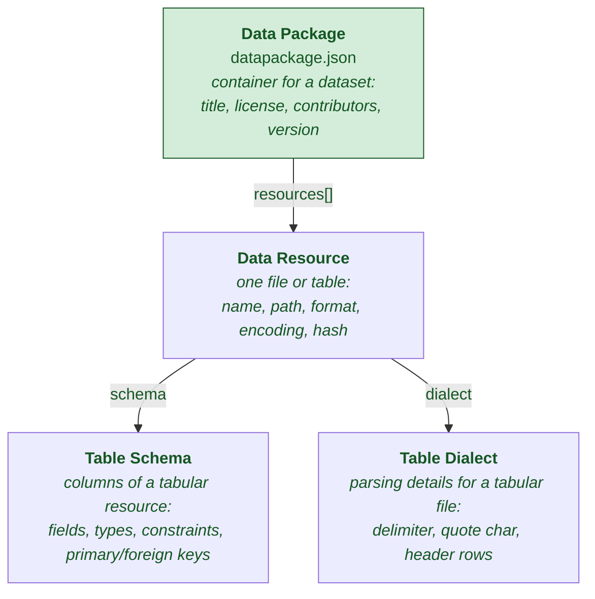
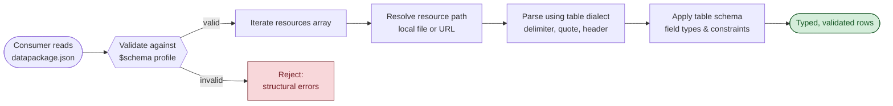

# Frictionless Specs — Profile

A profile of the **Data Package** standard (the canonical Frictionless specification) as it lives in this study (`studies/open-specs-and-standards/frictionless-specs/`). Read alongside [`Profile__OpenSpec.md`](./Profile__OpenSpec.md) and [`Profile__Spec-Kit.md`](./Profile__Spec-Kit.md) — but understand up front that **this is a different kind of spec**.

## TL;DR — and why it's not in the same category as OpenSpec or Spec Kit

OpenSpec and Spec Kit specify **software behavior**: "the system SHALL issue a JWT on login." Frictionless's Data Package specifies **datasets**: "this CSV has these columns, of these types, with these constraints, and this license." Both are called "specs" but they answer different questions.

> **OpenSpec / Spec Kit:** *what should this software do?*
> **Frictionless / Data Package:** *what is this data, and how do I read it?*

Data Package is a **standard** (`README.md:3`, `content/docs/index.mdx:1-12`) — a small set of interlocking JSON-Schema-defined formats published by the Open Knowledge Foundation and funded through the EU's NGI0 Entrust program (`README.md:6-9`). Its goal is **FAIR data**: Findability, Accessibility, Interoperability, Reusability (`docs/overview/introduction.md:7-8`). The artifact is a single file named `datapackage.json` that sits next to your CSVs/Parquet/JSON and tells anyone — human or machine — exactly what they're looking at.

It is **not** a workflow, a methodology, or a CLI for human + AI alignment. It's a **machine-validatable contract for datasets** that has been quietly winning since 2013, has 10+ language implementations, and powers things like the Open Data Editor (`content/docs/index.mdx:66-74`).

Why include it in this study at all? Because it's the worked reference for *what mature, open, machine-validatable specs look like* — and the agent ecosystem (MCP, Agent2Agent, AGENTS.md, design.md, llms.txt) is in roughly the same place Data Package was a decade ago. If you want to see where these formats might converge, study the one that already got there.

## What "spec" means here: a four-part composition

The Data Package standard isn't one document — it's four interlocking specs, each independently useful, that compose hierarchically (`content/docs/index.mdx:41-62`):



Each layer answers a different question:

| Spec | Question | Profile (JSON Schema) |
|------|----------|-----------------------|
| **Data Package** | What is this *dataset*? | `profiles/datapackage.json` |
| **Data Resource** | What is this *file or table*? | `profiles/dataresource.json` |
| **Table Schema** | What are the *columns* of this table? | `profiles/tableschema.json` |
| **Table Dialect** | How is this *CSV* delimited/quoted/encoded? | `profiles/tabledialect.json` |

That "Profile" column is load-bearing — every descriptor declares a `$schema` URL pointing to the JSON-Schema profile it claims to conform to (`docs/standard/data-package.mdx:128-136`). Validation is then a one-liner in any language with a JSON-Schema validator. This is the **single biggest win** of Data Package over hand-rolled data documentation: machine-checkability, baked in.

## Why this is better than "just write a README for your data"

A README explaining "the column `created_at` is in UTC and `status` can be `open`, `closed`, or `archived`" is unverifiable, unparseable, and inevitably drifts from the data. Data Package replaces it with four separable improvements:

### 1. Conventions: RFC 2119 + JSON Schema, all the way down

Every Data Package spec opens with the same paragraph:

> The key words `MUST`, `MUST NOT`, `REQUIRED`, `SHALL`, `SHALL NOT`, `SHOULD`, `SHOULD NOT`, `RECOMMENDED`, `MAY`, and `OPTIONAL` in this document are to be interpreted as described in [RFC 2119](https://www.ietf.org/rfc/rfc2119.txt). (`docs/standard/data-package.mdx:31-33`, identical in `data-resource.mdx:31-33`, `table-schema.mdx:34-36`)

This is the same RFC 2119 discipline OpenSpec uses, but applied to a *data contract* rather than a behavior contract. And every "MUST" clause maps onto a JSON-Schema constraint. Look at `frictionless-specs/profiles/dictionary/package.yaml`:

```yaml
dataPackage:
  type: object
  required:
    - resources           # ← matches "MUST contain resources" in prose
  properties:
    $schema: {...}
    name: {...}
    resources:
      "$ref": "#/definitions/dataResources"
```

The prose spec and the JSON Schema profile are kept in sync — the prose explains *why*, the schema enforces *that*. A consumer doesn't need to read the prose to validate; they point a JSON-Schema validator at the descriptor and get a yes/no plus error paths.

### 2. Data compression: one descriptor, many resources, schemas as references

A `datapackage.json` is dense — it can describe an arbitrarily large dataset in a few KB:

```json
{
  "name": "world-gdp",
  "title": "World GDP",
  "version": "1.0.0",
  "licenses": [{"name": "ODC-PDDL-1.0"}],
  "resources": [
    {
      "name": "gdp",
      "path": "data/gdp.csv",
      "format": "csv",
      "schema": {"$ref": "schemas/gdp.json"},
      "dialect": {"delimiter": ",", "header": true}
    }
  ]
}
```

Three compression mechanisms doing the work:

- **`resources` is an array.** One descriptor covers the whole dataset; you don't write four READMEs for four CSVs.
- **`schema` and `dialect` can be `$ref`-ed out** to separate files (`docs/standard/data-resource.mdx:84-95`, the `path` array pattern), so a 200-column schema doesn't bloat the package descriptor.
- **`path` can be a URL or a local path** (`docs/standard/data-resource.mdx:74-95`), and `path` arrays are allowed for resources split across multiple files — the spec promises consumers can concatenate them safely.

The result: one small file ships everything needed to *find*, *parse*, *validate*, and *cite* the data. That's the whole point of the FAIR acronym made concrete.

### 3. Navigation: descriptor → resources → schema/dialect

A consumer reads exactly one file (`datapackage.json`) and uses it to walk to everything else. Below is the resolution flow for a typical `datapackage.json` referencing a CSV:



The navigation is **declarative and machine-driven**. There's no agent runtime here — a Python or R or JS library (`docs/index.mdx:66-74`) walks this graph automatically. Compare to OpenSpec/Spec Kit, where the agent is the runtime; in Frictionless the runtime is your data tool.

### 4. Versioning, profiles, and extensions

Profiles are versioned (`v1.0` → `v2.0`, released June 2024 — `content/docs/index.mdx:28-33`). A descriptor can declare which version it conforms to via `$schema`, and a consumer can reject mismatches up front. Extensions add domain-specific rules without forking the core (`docs/standard/extensions.mdx`); the catalog includes:

- **Camtrap Data Package** (`docs/extensions/camtrap-data-package.md`) — camera-trap biodiversity data
- **Fiscal Data Package** (`docs/extensions/fiscal-data-package.md`) — government budget and spending data

This extension model is *closer to Spec Kit's preset/extension stack* than OpenSpec's schema-driven customization — both treat extensibility as a first-class concern.

## What's actually inside this submodule

Frictionless ships its docs site as Astro/Starlight markdown content alongside the canonical JSON Schema profiles:

| Path | What's there |
|------|--------------|
| `frictionless-specs/README.md` | One-paragraph pitch + funding (NLnet / NGI0 Entrust) |
| `frictionless-specs/profiles/datapackage.json` | The Data Package JSON Schema profile (the validatable contract) |
| `frictionless-specs/profiles/dataresource.json` | Data Resource profile |
| `frictionless-specs/profiles/tableschema.json` | Table Schema profile |
| `frictionless-specs/profiles/tabledialect.json` | Table Dialect profile |
| `frictionless-specs/profiles/dictionary/` | YAML source-of-truth dictionaries the JSON profiles are built from (`package.yaml`, `resource.yaml`, `schema.yaml`, `dialect.yaml`, `common.yaml`) |
| `frictionless-specs/content/docs/index.mdx` | Site landing page — start here if browsing |
| `frictionless-specs/content/docs/overview/` | `introduction.md`, `adoption.mdx`, `governance.md`, `software.mdx`, `changelog.md` |
| `frictionless-specs/content/docs/standard/` | The four canonical specs: `data-package.mdx`, `data-resource.mdx`, `table-schema.mdx`, `table-dialect.mdx`, plus `glossary.mdx`, `extensions.mdx`, `security.mdx` |
| `frictionless-specs/content/docs/guides/` | `using-data-package.md`, `extending-data-package.md`, `csvw-data-package.md`, `mediawiki-tabular-data.md` |
| `frictionless-specs/content/docs/recipes/` | Pragmatic patterns: caching, compression, dependencies, language support, foreign keys, archives — 13 recipes total |
| `frictionless-specs/content/docs/extensions/` | Domain extensions: `camtrap-data-package.md`, `fiscal-data-package.md` |
| `frictionless-specs/scripts/` | Build scripts for compiling the YAML dictionaries → JSON profiles |

If you only have time for two files: read `content/docs/standard/data-package.mdx` end-to-end (it's the canonical spec, ~290 lines), then skim `profiles/dictionary/package.yaml` to see the same constraints expressed as a schema. The contrast makes the prose↔schema discipline click.

## How to get started (if you actually wanted to use it)

There's no CLI to install, no agent to configure — Data Package is a **format**, not a tool. You write a `datapackage.json`, drop it next to your data, and validate it.

### Minimum viable Data Package

```text
my-dataset/
├── datapackage.json     # ← the descriptor
├── data/
│   └── gdp.csv
└── README.md            # optional, human-readable supplement
```

A minimal `datapackage.json`:

```json
{
  "$schema": "https://datapackage.org/profiles/2.0/datapackage.json",
  "name": "world-gdp",
  "title": "World GDP",
  "version": "1.0.0",
  "licenses": [{"name": "ODC-PDDL-1.0"}],
  "resources": [
    {
      "name": "gdp",
      "path": "data/gdp.csv",
      "format": "csv",
      "schema": {
        "fields": [
          {"name": "country", "type": "string", "constraints": {"required": true}},
          {"name": "year", "type": "integer"},
          {"name": "gdp_usd", "type": "number"}
        ],
        "primaryKey": ["country", "year"]
      }
    }
  ]
}
```

That's it. You now have a FAIR-compliant, machine-validatable, citable dataset.

### Validate it

Pick a language driver (`content/docs/overview/software.mdx` lists the official ones — Python, JavaScript, R, Go, Java, Ruby, PHP, Clojure, Julia, .NET):

```bash
# Python
pip install frictionless
frictionless validate datapackage.json

# JavaScript / Node
npx @frictionlessdata/datapackage-cli validate datapackage.json
```

A passing validation tells you: the descriptor is well-formed, every resource exists, every column declared in the schema is present in the data with the declared type, and primary/foreign-key constraints hold.

### When to extend vs. when to use a recipe

The canonical pattern (`content/docs/guides/extending-data-package.md`) when your data has needs the core specs don't cover:

- **Reach for a recipe first.** If the problem is "how do I version my data?" or "how do I express that one column references another?", check `content/docs/recipes/` — there are 13 community-blessed patterns that don't require touching the core spec.
- **Reach for an extension when your domain has a recurring schema shape.** Camtrap (camera-trap biology) and Fiscal Data Package both define vocabularies their communities reuse heavily — that's the bar for a full extension.
- **Reach for `private-properties` when you just need a one-off field.** The recipe at `content/docs/recipes/private-properties.md` shows the pattern: namespace-prefixed properties that the core spec ignores but your tooling can use.

## Mental model for using it well

- **Treat `datapackage.json` as the contract.** Anyone who consumes the data should be able to do so by reading exactly one file and trusting its claims will validate.
- **Keep prose for *why*, schema for *what*.** The README explains why the dataset exists and how it was collected. The descriptor declares column types, constraints, and provenance.
- **Lean on `$schema` and version pins.** A descriptor that doesn't declare its `$schema` is one downstream tool upgrade away from breaking. Pin to `https://datapackage.org/profiles/2.0/datapackage.json` (or whichever profile) and let the validator guard you.
- **Default to splitting schemas into separate files** for anything beyond ~10 fields. The `$ref` pattern keeps the descriptor readable and lets you reuse a schema across packages.
- **Use Table Dialect for messy CSVs, not in-band documentation.** If your CSV has weird quoting, semicolon delimiters, BOM, or 2-row headers — that goes in `dialect`, not in a README the consumer has to read.
- **Prefer recipes over extensions over private properties.** Extensions are durable but expensive. Recipes are cheap and discoverable. Private properties are escape hatches.

## When NOT to reach for this

- **Non-tabular, non-resource-oriented data.** If your "data" is a knowledge graph or a streaming pipeline, look at RDF/SHACL or AsyncAPI instead. Data Package is at its strongest for files-on-disk and tables.
- **Data that lives only inside a single application.** The overhead of writing and maintaining a descriptor only pays off when *someone else* (or future you, or a tool) needs to consume it.
- **Highly normalized relational data with many tables.** Data Package supports foreign keys, but if you're really shipping a relational schema, ship a SQL DDL dump or a `.sqlite` file alongside; the foreign-key story in Table Schema is intentionally minimal.
- **Specifying software behavior.** This is the OpenSpec / Spec Kit lane. Frictionless will not help you decide whether your auth flow needs 2FA.

## How this relates to OpenSpec, Spec Kit, and the rest of the study

The `studies/open-specs-and-standards/` study is broader than "spec frameworks for human+AI software development." It also tracks the open-spec ecosystem the agent world is converging toward — `agents-md`, `llms-txt`, `mcp-api`, `modelcontextprotocol`, `agent-2-agent`, `design-md`, `12-factor-agents`. Frictionless / Data Package is in the study because it's the **reference exemplar** for what these younger formats might grow into:

| Property | Data Package (mature) | Most "agent specs" (emerging) |
|----------|----------------------|------------------------------|
| Canonical JSON Schema profile | ✅ versioned (`v1` → `v2`) | usually no |
| RFC 2119 normative language | ✅ in every spec doc | sometimes |
| Independent multi-language implementations | ✅ 10+ official drivers | usually 1–2 |
| Public governance + funding model | ✅ NLnet / NGI0 Entrust + OKFN | varies wildly |
| Extension mechanism with adopted extensions | ✅ Camtrap, Fiscal | mostly absent |
| Decade of production use | ✅ since ~2013 | weeks to months |

If you're building or evaluating a new open spec for the agent era, Data Package is the artifact to study for "what does it look like when this is *done*?"

## Comparison to OpenSpec and Spec Kit

| Axis | OpenSpec | Spec Kit | Frictionless / Data Package |
|------|----------|----------|----------------------------|
| **What it specs** | Software behavior | Software behavior (executable) | Datasets and tabular data |
| **Primary artifact** | `openspec/specs/<domain>/spec.md` + change folders | `specs/NNN-feature/{spec,plan,tasks}.md` | `datapackage.json` |
| **Spec primitive** | `Requirement:` + `Scenario:` + RFC 2119 | User Story + Acceptance Scenarios + `[NEEDS CLARIFICATION]` | JSON Schema property + RFC 2119 prose |
| **Validation** | `openspec validate` (structural) | `/speckit.analyze` (cross-artifact) | JSON-Schema validator (any language) |
| **Runtime** | AI agent + CLI | AI agent + CLI | Your data library (Python, JS, R, ...) |
| **Change model** | Delta specs (`ADDED`/`MODIFIED`/`REMOVED`) | Full spec per feature, in branch | Profile versioning (`v1` → `v2`) |
| **Extensibility** | Custom artifact DAG via `schema.yaml` | Extensions + Presets + Overrides | Domain extensions + Recipes + Private properties |
| **Maturity** | New (2024) | New (2024) | Mature (since 2013, v2.0 in 2024) |
| **Best fit** | Brownfield human+AI iteration | Greenfield enterprise SDD | Publishing or consuming data |

The first two are workflow tools that produce specs as a side effect. Frictionless *is* the spec. Different category.

## One-line summary

> Data Package wins by collapsing dataset metadata into a single `datapackage.json` whose every "MUST" maps to a JSON-Schema constraint — making the contract human-readable, machine-validatable, and language-agnostic, with four composable sub-specs (Package → Resource → Schema + Dialect) that let you describe anything from a single CSV to a multi-file dataset with foreign keys and a citation.
