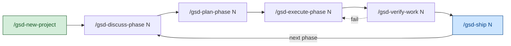
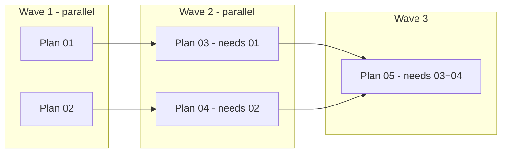

# GSD (Get Shit Done) — Profile

A profile of GSD as it lives in this study (`studies/open-specs-and-standards/get-shit-done/`). Cites pinned paths so you can jump to source rather than trust paraphrase. Read this alongside [`Profile__OpenSpec.md`](./Profile__OpenSpec.md) and [`Profile__Spec-Kit.md`](./Profile__Spec-Kit.md) — GSD targets the same problem space but takes a third design path: spec-driven *workflow orchestration*, not a spec format.

## TL;DR

GSD is a **context-engineering and multi-agent-orchestration framework** that ships as an installer (`npx get-shit-done-cc`) and writes a fleet of slash commands, skills, subagents, hooks, and references into your AI runtime's config directory. The thesis (`get-shit-done/README.md:9`) is that the limiting factor of AI coding is not spec rigor — it's **"context rot," the quality degradation that happens as the model fills its context window**. GSD's answer is to drive every non-trivial task through fresh-context subagents coordinated by thin orchestrators, with state persisted as plain files in `.planning/`.

It is **not** a markdown convention (OpenSpec) and **not** a methodology with phase gates (Spec Kit). It is a *runtime system*: 65 shipped slash commands, 33 specialized subagents, 11 hooks, and a CLI (`gsd-sdk`) that workflow files query for state — see `get-shit-done/docs/INVENTORY.md:1-13`. The author's framing (`README.md:64-77`) is solo-developer-anti-enterprise — "I don't write code — Claude Code does … no enterprise roleplay bullshit." The system is heavy *under the hood* so the user-facing surface can stay at a six-command loop.

If OpenSpec's pitch is "tree-of-requirements + deltas," and Spec Kit's pitch is "constitution + gates + executable spec," GSD's pitch is **"a runnable pipeline that keeps the model's context fresh while it does the work."**

## Why this is different from "just write a normal spec"

GSD doesn't replace prose with structured spec primitives — it replaces *driving the model yourself* with a workflow that drives it for you. Four interlocking improvements:

### 1. Conventions: artifacts as a typed file set, plus XML-formatted plans

GSD doesn't introduce a spec grammar. It introduces a **fixed inventory of named markdown files**, each with a fixed role — `get-shit-done/README.md:540-557`:

| File | Role |
|------|------|
| `PROJECT.md` | Project vision, always loaded |
| `REQUIREMENTS.md` | Scoped v1/v2 requirements with phase traceability |
| `ROADMAP.md` | Where you're going, what's done |
| `STATE.md` | Decisions, blockers, position — memory across sessions |
| `research/` | Ecosystem knowledge (stack, features, architecture, pitfalls) |
| `PLAN.md` | Atomic task with XML structure, verification steps |
| `SUMMARY.md` | What happened, what changed, committed to history |
| `todos/`, `threads/`, `seeds/` | Captured ideas and persistent cross-session context |

Two things worth noting:

- **The convention is the *layout*, not the prose.** Each file has a known location under `.planning/` and a known reader (a specific subagent or workflow). The agent doesn't have to discover where context lives — it queries `gsd-sdk query init.<workflow>` and gets a JSON payload of the relevant files (see `docs/ARCHITECTURE.md:80-89`).
- **Plans use XML, not Markdown.** Each `PLAN.md` task is wrapped in a typed XML block (`README.md:561-575`):

```xml
<task type="auto">
  <name>Create login endpoint</name>
  <files>src/app/api/auth/login/route.ts</files>
  <action>
    Use jose for JWT (not jsonwebtoken - CommonJS issues).
    Validate credentials against users table.
    Return httpOnly cookie on success.
  </action>
  <verify>curl -X POST localhost:3000/api/auth/login returns 200 + Set-Cookie</verify>
  <done>Valid credentials return cookie, invalid return 401</done>
</task>
```

The `<verify>` and `<done>` tags are the load-bearing parts: the agent has a runnable check and a done-condition baked into the same artifact. Compared to OpenSpec's `Requirement: / Scenario:` headings or Spec Kit's user-story acceptance scenarios, GSD's primitive is **the executable task**, not the behavioral requirement.

### 2. Data compression: fresh context per agent, not deltas

This is GSD's biggest divergence from both alternatives. Where OpenSpec compresses by *delta-spec* and Spec Kit compresses by *artifact split*, GSD compresses by **resetting the context window per unit of work** (`docs/ARCHITECTURE.md:72-75`):

> Every agent spawned by an orchestrator gets a clean context window (up to 200K tokens). This eliminates context rot — the quality degradation that happens as an AI fills its context window with accumulated conversation.

Concretely: a phase is decomposed into 2–3 atomic plans, each plan executes in a *fresh* subagent with a 200K window — see `README.md:386-394`. The orchestrator's main session never accumulates the implementation context; it spawns, waits, integrates. The README claims (`README.md:592`) you can run an entire phase with thousands of lines written and the *main* context stays at 30–40%.

The cost: GSD's *eager* skill listing — 86 skills + 33 subagent descriptions injected into the system prompt every turn — was ~12k tokens of fixed overhead until the recent fixes. Two mitigations now ship:

- **`--minimal` install** (`README.md:213-258`): 6 core skills, 0 subagents, ~700-token floor, ≥94% reduction. Aimed at local LLMs (32K–128K context) and token-billed APIs.
- **Two-stage hierarchical routing** (`docs/ARCHITECTURE.md:123-131`, issue #2792): six namespace meta-skills (`gsd-workflow`, `gsd-project`, `gsd-review`, `gsd-context`, `gsd-manage`, `gsd-ideate`) replace the flat 86-skill listing — ~120 tokens of router descriptions, then route to the concrete sub-skill on demand.

### 3. Navigation: a 6-step orchestrated loop, not a phase pipeline or DAG

GSD's organizing structure is a **linear loop of orchestrator commands**, each of which spawns specialized subagents and writes a known artifact — `README.md:331-499`:



| Command | Spawns | Artifact |
|---------|--------|----------|
| `/gsd-new-project` | 4× project researchers (parallel) → research-synthesizer → roadmapper | `PROJECT.md`, `REQUIREMENTS.md`, `ROADMAP.md`, `STATE.md`, `research/` |
| `/gsd-discuss-phase N` | advisor-researcher / assumptions-analyzer | `{N}-CONTEXT.md` |
| `/gsd-plan-phase N` | phase-researcher → planner → plan-checker (loop until pass) | `{N}-RESEARCH.md`, `{N}-{M}-PLAN.md` |
| `/gsd-execute-phase N` | wave-grouped executors (parallel within wave) → verifier | `{N}-{M}-SUMMARY.md`, `{N}-VERIFICATION.md` |
| `/gsd-verify-work N` | UAT walkthrough; debugger on failure | `{N}-UAT.md`, fix plans if issues |
| `/gsd-ship N` | PR creation + cross-AI review | GitHub PR |

The wave-execution model is the key parallelism primitive (`README.md:413-435`):



Plans with no shared dependencies run in parallel; later waves wait for earlier ones. Vertical slices (one plan = one feature end-to-end) parallelize better than horizontal layers (one plan = all models, another = all APIs) — the README is explicit about this (`README.md:443`).

Compared to OpenSpec's "dependencies are enablers, not gates" and Spec Kit's "gates are gates," GSD's stance is **"the orchestrator decides what runs in parallel, you don't think about it."** The agent model is a thin-orchestrator pattern (`docs/ARCHITECTURE.md:76-88`) that *never does heavy lifting* — it loads context, spawns agents, collects results, updates state.

### 4. Distinctive: multi-runtime, hooks, and atomic commits as an integration layer

GSD has three structural moves that neither OpenSpec nor Spec Kit ship:

**(a) 16-runtime installer** (`README.md:113`, `README.md:140-205`). The same core artifacts and workflows install into Claude Code, OpenCode, Gemini CLI, Kilo, Codex, Copilot, Cursor, Windsurf, Antigravity, Augment, Trae, Qwen Code, Hermes Agent, Cline, and CodeBuddy — each runtime's directory layout (`.claude/skills/`, `.codex/skills/`, `.cursor/`, `.clinerules`, etc.) is handled by `bin/install.js`. The installer rewrites slash-command syntax per-runtime (Gemini's `/gsd:cmd` vs Claude's `/gsd-cmd`) automatically. Spec Kit covers ~30 integrations; OpenSpec ~25. GSD's bet is on portability of the workflow, not the spec format.

**(b) Hook system as runtime guardrails** (`docs/ARCHITECTURE.md:249-267`). Eleven shipped hooks that fire on `PreToolUse` / `PostToolUse` / `SessionStart` / `statusLine`:

| Hook | Event | Purpose |
|------|-------|---------|
| `gsd-statusline.js` | `statusLine` | Model + task + directory + context-usage bar |
| `gsd-context-monitor.js` | `PostToolUse` | Injects context warnings at 35%/25% remaining |
| `gsd-prompt-guard.js` | `PreToolUse` | Scans `.planning/` writes for prompt injection (advisory) |
| `gsd-read-injection-scanner.js` | `PostToolUse` | Scans `Read` output for injected instructions in untrusted content |
| `gsd-workflow-guard.js` | `PreToolUse` | Detects edits outside GSD workflow context (advisory, opt-in) |
| `gsd-read-guard.js` | `PreToolUse` | Prevents Edit/Write on files not yet read in the session |
| `gsd-validate-commit.sh` | `PostToolUse` | Conventional-commit enforcement |
| `gsd-phase-boundary.sh` | `PostToolUse` | Phase boundary detection |
| `gsd-check-update.js` | `SessionStart` | Foreground trigger for background update check |

The point: the workflow doesn't just instruct the model, it *constrains* the model's tool calls in flight. Spec injection scanning (`security.cjs` module, `README.md:849-863`) is centralized because GSD's planning artifacts are themselves LLM system prompts — user-controlled text flowing into them is an indirect-prompt-injection vector by construction.

**(c) Atomic commits per task** (`README.md:594-608`). Each executor commits immediately after its task finishes:

```text
abc123f docs(08-02): complete user registration plan
def456g feat(08-02): add email confirmation flow
hij789k feat(08-02): implement password hashing
lmn012o feat(08-02): create registration endpoint
```

Plus a "parallel commit safety" layer (`docs/ARCHITECTURE.md:374-380`): parallel executors skip pre-commit hooks via `--no-verify` (the orchestrator runs them once after the wave), and `STATE.md` writes go through atomic file-locking (`STATE.md.lock` with `O_EXCL`, 10s stale-lock detection). This is the kind of detail you only build if you've watched two parallel agents stomp on each other's STATE.md edits.

## What's actually inside this submodule

Mapping the upstream layout you'll be reading:

| Path | What's there |
|------|--------------|
| `get-shit-done/README.md` | Pitch, install, full command reference, walkthrough (~1000 lines) |
| `get-shit-done/CONTEXT.md` | Internal domain glossary (Dispatch Policy Module, Query Runtime Context Module, etc.) |
| `get-shit-done/CHANGELOG.md` | Per-release change log |
| `get-shit-done/docs/USER-GUIDE.md` | End-to-end walkthrough + config reference (~1400 lines) |
| `get-shit-done/docs/ARCHITECTURE.md` | System architecture for contributors (read this if you want the *why*) |
| `get-shit-done/docs/AGENTS.md` | Per-agent role cards for the 21 primary agents + stubs for the 12 advanced ones |
| `get-shit-done/docs/COMMANDS.md` | Per-command reference for all 65 slash commands |
| `get-shit-done/docs/CONFIGURATION.md` | Full `.planning/config.json` schema |
| `get-shit-done/docs/CLI-TOOLS.md` | `gsd-sdk` CLI reference |
| `get-shit-done/docs/INVENTORY.md` | **Authoritative roster** of every shipped surface — agents, commands, workflows, references, CLI modules, hooks |
| `get-shit-done/docs/FEATURES.md` | Feature reference (~2700 lines) |
| `get-shit-done/docs/STATE-MD-LIFECYCLE.md` | How `STATE.md` evolves through a project |
| `get-shit-done/docs/issue-driven-orchestration.md` | Mapping `tasks.md` → GitHub issues |
| `get-shit-done/agents/` | 33 specialized subagent definitions (`gsd-planner.md`, `gsd-executor.md`, `gsd-verifier.md`, …) |
| `get-shit-done/commands/gsd/` | 65 slash-command prompt files |
| `get-shit-done/get-shit-done/workflows/` | Per-workflow orchestration logic |
| `get-shit-done/get-shit-done/references/` | Shared knowledge documents (`gates.md`, `model-profiles.md`, `tdd.md`, `questioning.md`, …) |
| `get-shit-done/get-shit-done/templates/` | Markdown templates for all planning artifacts |
| `get-shit-done/hooks/` | 11 runtime hooks (statusline, context monitor, prompt guards, validators) |
| `get-shit-done/sdk/` | `gsd-sdk` Node.js CLI — workflows query this for state |
| `get-shit-done/bin/install.js` | The 16-runtime installer |

If you only have time for two files: read `docs/ARCHITECTURE.md` end-to-end (it's the system architecture document) and skim `docs/INVENTORY.md` (it's the authoritative roster of every shipped surface).

## How to get started (if you actually wanted to use it)

### Install once

```bash
# Interactive — prompts for runtime + location
npx get-shit-done-cc@latest

# Non-interactive
npx get-shit-done-cc --claude --global             # Install to ~/.claude/
npx get-shit-done-cc --claude --local --minimal    # ~700-token floor, 6 core skills
```

The installer prompts for **runtime** (Claude Code, OpenCode, Gemini, …16 total — multi-select supported) and **location** (global / local) — `README.md:112-115`. The `gsd-sdk` CLI is auto-installed; `--no-sdk` skips it (`README.md:206`).

Recommended invocation per the docs (`README.md:281-289`):

```bash
claude --dangerously-skip-permissions
```

> "Stopping to approve `date` and `git commit` 50 times defeats the purpose." (`README.md:288`)

If that's not acceptable, the README ships a granular permissions block (`README.md:293-321`) that allowlists `Bash(date:*)`, `Bash(git commit:*)`, `Bash(grep:*)`, etc.

### The everyday loop

```text
/gsd-new-project                          # questions → research → REQUIREMENTS.md + ROADMAP.md
/gsd-discuss-phase 1                      # capture intent → 1-CONTEXT.md
/gsd-plan-phase 1                         # research + plan + verify → 1-{N}-PLAN.md
/gsd-execute-phase 1                      # wave-parallel execution → 1-{N}-SUMMARY.md, 1-VERIFICATION.md
/gsd-verify-work 1                        # human UAT → 1-UAT.md
/gsd-ship 1                               # PR with auto-generated body
... repeat for phase 2, 3, ...
/gsd-complete-milestone                   # archive + tag release
/gsd-new-milestone                        # next version
```

Two shortcuts when full ceremony is overkill (`README.md:504-533`, `README.md:629-634`):

- `/gsd-quick "<task>"` — same agents, skips research/plan-check/verify by default; flags `--discuss --research --validate --full` add them back composably. Lives in `.planning/quick/`.
- `/gsd-fast "<text>"` — inline trivial task, no subagents at all. For one-liner edits.

For brownfield work, `/gsd-map-codebase` runs *before* `/gsd-new-project` to spawn 4 parallel mappers (stack, architecture, conventions, concerns) so the planner has codebase awareness from turn one (`README.md:329`, `README.md:687-690`).

### When something breaks mid-phase

GSD's recovery surface is heavier than either competitor's:

- `/gsd-pause-work` writes a `HANDOFF.json` so a later session can resume cleanly.
- `/gsd-resume-work` restores from the last session.
- `/gsd-forensics` runs a post-mortem on a failed workflow run (stuck loops, missing artifacts, git anomalies) — `README.md:638`.
- `/gsd-debug` opens a persistent-state debugging session with `gsd-debugger` and `gsd-debug-session-manager`.
- `/gsd-health [--repair]` validates `.planning/` integrity and auto-repairs.

This is downstream of the design choice: because GSD ships a runtime, things can go wrong at runtime in ways an OpenSpec markdown convention can't.

## Mental model for using it well

- **The orchestrator is the product, not the spec.** Treat slash commands as the primary interface; the markdown files in `.planning/` are byproducts the agents read, not documents you author. If you're hand-editing PLAN.md mid-execution, you're fighting the system.
- **Stay under the file size limits.** "Size limits based on where Claude's quality degrades. Stay under, get consistent excellence." (`README.md:557`) The workflows enforce a tier system (`docs/ARCHITECTURE.md:144-170`): XL ≤1700 lines, LARGE ≤1500, DEFAULT ≤1000, with `discuss-phase.md` held to <500. When something crosses, the pattern is *extract into modes/ and references/*, not split arbitrarily.
- **`STATE.md` is the across-session brain, not a status report.** It tracks decisions, blockers, position. Treat it as the place a fresh subagent reads to pick up where you left off. (`docs/STATE-MD-LIFECYCLE.md` is the canonical reference.)
- **Use `--minimal` if you're token-conscious.** The 12k → 700-token reduction is real for local LLMs (32K–128K context) and metered APIs. **The savings disappear the moment you re-install without `--minimal`** (`README.md:236-241`) — every update needs the flag too.
- **Disable MCP servers you don't use.** GSD's docs explicitly call out that MCP tool schemas can cost 20k+ tokens per turn — often dwarfing what model-profile tuning saves (`docs/ARCHITECTURE.md:129-131`). The toggle is in Claude Code's `enabledMcpjsonServers` / `disabledMcpjsonServers`, *not* a GSD setting.
- **Trust the wave model.** Don't try to manually serialize plans the system has marked as parallel. The dependency analysis is in the planner's output; if it's wrong, fix the plan, don't fight execute-phase.
- **Atomic commits are non-negotiable.** Don't squash mid-phase. Git bisect over per-task commits is the debugging mechanism the whole system assumes.

## When NOT to reach for this

- **You want a spec format, not a workflow.** GSD doesn't *give* you a typed spec primitive (no `Requirement:` heading, no `[NEEDS CLARIFICATION]` marker, no `ADDED/MODIFIED/REMOVED` deltas). If your value is in the spec artifact itself — for review, for compliance, for handoff — OpenSpec or Spec Kit are better fits.
- **Heavy brownfield surgical edits.** GSD's "phase" unit assumes you can decompose the work into 2–3 atomic plans with verifiable goals. A one-line bug fix doesn't fit that shape — use `/gsd-fast` and accept that you're bypassing the system.
- **Single-runtime, hand-tuned setups.** If you've already invested in custom Claude Code skills/hooks, GSD's installer will write into the same directory and you'll need to manage overlap. The `--minimal` flag helps, but a heavily customized `.claude/` is friction.
- **You don't want a project-level token floor.** Even `--minimal` adds ~700 tokens of fixed system-prompt overhead on every turn. For ad-hoc one-shot work, plain Claude Code is lighter.
- **Compliance-heavy environments.** GSD has security hardening (`security.cjs`, prompt guards, deny-list recommendations — `README.md:849-887`) but it's not built around an immutable architectural constitution the way Spec Kit is. If you need an auditable paper trail of "we considered this and rejected it," Spec Kit's gates are designed for that and GSD's atomic-commit history is not the same artifact.
- **You don't trust unattended execution.** The README is explicit: "Walk away, come back to completed work" (`README.md:411`). If you want to review every step before it runs, GSD's intended cadence is wrong for you and you'll spend more time approving than building.

## GSD vs. Spec Kit vs. OpenSpec — the honest comparison

The three tools share a problem space (human + AI alignment) but make almost orthogonal bets.

| Axis | GSD | Spec Kit | OpenSpec |
|------|-----|----------|----------|
| **Primary artifact** | `.planning/` directory of typed files (PROJECT, REQUIREMENTS, ROADMAP, STATE, PLAN, SUMMARY) | `.specify/` + `specs/NNN-feature/` (spec.md, plan.md, tasks.md, contracts/, quickstart.md) | `openspec/specs/` + `openspec/changes/<name>/` (proposal, design, tasks, delta specs) |
| **Spec primitive** | XML `<task>` block with `<verify>` and `<done>` | User Story (priority) + Acceptance Scenario + `[NEEDS CLARIFICATION]` | `Requirement:` (RFC 2119) + `Scenario:` (Given/When/Then) |
| **Workflow** | 6-command loop driven by orchestrators that spawn fresh subagents | Linear phases gated by Constitution (`/speckit.constitution → specify → clarify → plan → tasks → implement`) | Fluid actions; dependency DAG enables but doesn't gate (`/opsx:propose → apply → archive`) |
| **Change model** | Phase = unit of work; plans within phase; atomic git commits per task | Full spec per feature in `specs/NNN-name/`; new feature = new branch + folder | Delta specs (`ADDED/MODIFIED/REMOVED`) merged into source-of-truth on archive |
| **Architectural discipline** | None encoded; size-budget tests on workflow files | Constitution with 9 articles + phase gates (Simplicity, Anti-Abstraction, Integration-First) | Convention-light; trust the human + agent loop |
| **Parallelism** | Wave-based: planner emits dependency graph, executor runs independent plans concurrently | None encoded; `[P]` markers in `tasks.md` flag parallelizability for the implementer | Schema DAG can be walked in parallel where artifacts are independent |
| **Token-cost awareness** | First-class: eager skill listing, `--minimal` install (94% reduction), namespace meta-skills (#2792), MCP-budget docs | Implicit: extension/preset system can trim what loads, but no explicit token budget | Implicit: lightweight by default |
| **Toolchain** | Node/npm (`get-shit-done-cc`), TypeScript SDK (`gsd-sdk`), shell hooks | Python (`uv` / `pipx`), shell scripts, DocFX site | Node/npm (`@fission-ai/openspec`) |
| **Runtime reach** | 16 AI tools (Claude Code, OpenCode, Gemini, Kilo, Codex, Copilot, Cursor, Windsurf, Antigravity, Augment, Trae, Qwen, Hermes, CodeBuddy, Cline) | 30+ integrations | 25+ integrations |
| **Extensibility** | None formal — fork or PR upstream | Formal: 4-level priority stack (overrides → presets → extensions → core), 80+ community extensions | Schema-driven: define your own artifact DAG in `schema.yaml` |
| **Recovery / state** | `/gsd-pause-work` + `HANDOFF.json` + `STATE.md` + `/gsd-resume-work` + `/gsd-forensics` + `/gsd-health --repair` | Manual — re-run the affected phase command | Manual — change folders are inherently resumable |
| **Best fit** | Solo or small-team delivery on greenfield + light brownfield, where unattended multi-hour runs are the goal | Greenfield enterprise work where alignment, compliance, and traceability matter | Brownfield iteration where you want spec discipline without ceremony |

GSD's own README puts it bluntly (`README.md:67-68`): "BMAD, Speckit … all seem to make things way more complicated than they need to be (sprint ceremonies, story points, stakeholder syncs, retrospectives, Jira workflows) or lack real big picture understanding of what you're building. … The complexity is in the system, not in your workflow." That framing is honest about the trade: GSD pushes the complexity into the runtime so the user-facing surface stays at six commands, where Spec Kit pushes it into the spec artifacts and OpenSpec keeps it minimal everywhere by sacrificing orchestration.

## One-line summary

> GSD wins by treating context-rot — not spec rigor — as the limiting factor of AI coding: it ships a 65-command, 33-subagent, 11-hook runtime that decomposes work into fresh-context wave-parallel executors, persists state in `.planning/`, and installs into 16 AI runtimes — and it pays for that with a token-floor and a heavy-under-the-hood surface that you mostly don't see until something breaks.
