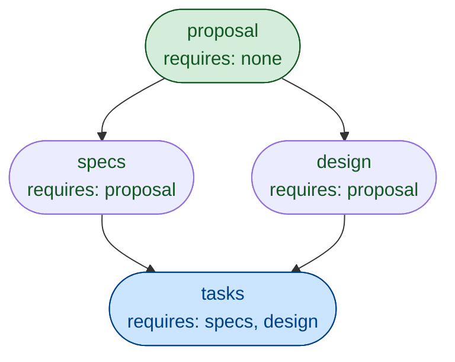
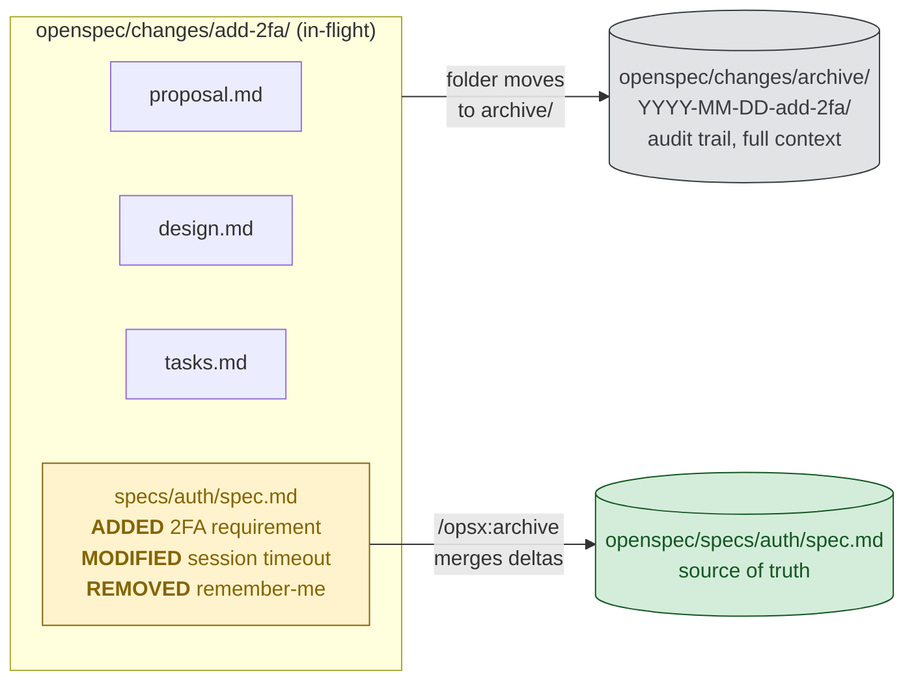
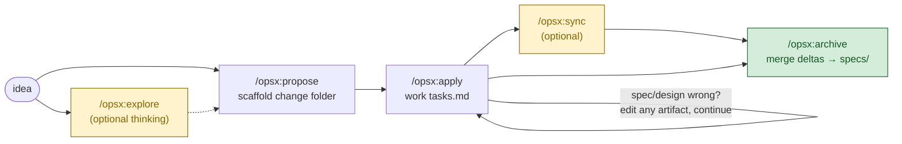

# OpenSpec — Profile

A profile of OpenSpec as it lives in this study (`studies/open-specs-and-standards/open-spec/`). Cites pinned paths so you can jump to source rather than trust paraphrase.

## TL;DR

OpenSpec is a **lightweight spec layer that sits between you and your AI coding assistant**. Instead of describing what you want in chat (where it's ephemeral and unverifiable) or in a heavyweight design doc (which the AI can't navigate), you write small, structured markdown files in a known shape. The CLI and a set of slash commands (`/opsx:*`) drive the AI through *create proposal → write delta specs → design → tasks → implement → archive*, and the spec format is engineered so an LLM can locate, read, and update exactly the right slice without re-reading the world.

It is **not** a methodology, a project tool, or a doc site. It is a markdown convention plus a CLI that produces machine-readable status (`openspec status --json`) and machine-readable instructions (`openspec instructions <artifact> --json`) so an agent can self-navigate.

## Why this is better than "just write a normal spec"

A normal spec is a single long markdown file with prose, written once, gone stale by week two, and unreadable by an LLM without loading the whole thing into context. OpenSpec replaces that with four separable improvements:

### 1. Conventions that an LLM can parse deterministically

Specs use a fixed structural grammar — see `studies/open-specs-and-standards/open-spec/docs/concepts.md:166-197`:

```markdown
# Auth Specification
## Purpose
## Requirements
### Requirement: <name>           ← parseable anchor
The system SHALL ...              ← RFC 2119 keyword
#### Scenario: <name>             ← parseable anchor
- GIVEN ... WHEN ... THEN ...     ← Given/When/Then
```

- `### Requirement:` and `#### Scenario:` are stable heading anchors. The CLI and the agent locate units of behavior by heading match, not by fuzzy search.
- RFC 2119 keywords (`MUST`, `SHALL`, `SHOULD`, `MAY`) carry intent in one word — see `concepts.md:217-220`. No "we should probably" ambiguity.
- Scenarios are written in Given/When/Then so they map 1:1 onto tests.

The point isn't ceremony — it's that **the spec is a tree of named, addressable nodes** instead of free prose.

### 2. Data compression: delta specs, not full rewrites

This is the single biggest win for brownfield work. Instead of editing the full `spec.md`, a change ships a *delta* — see `concepts.md:432-491`:

```markdown
# Delta for Auth
## ADDED Requirements
### Requirement: Two-Factor Authentication ...
## MODIFIED Requirements
### Requirement: Session Expiration ...   (Previously: 30 minutes)
## REMOVED Requirements
### Requirement: Remember Me              (Deprecated in favor of 2FA)
```

Three keywords — `ADDED`, `MODIFIED`, `REMOVED` — encode the diff. On `/opsx:archive`, OpenSpec merges the delta into the main spec automatically (`concepts.md:476-481`).

**What this buys you:**
- The agent never has to re-emit the whole spec to change one line.
- Two changes can touch the same spec file in parallel without conflicting (different requirements).
- Reviewers see *what changed*, not unchanged context.
- The archive (`changes/archive/<date>-<name>/`) preserves the full delta forever — audit trail without bloat in the active spec.

### 3. Navigation: a dependency graph the agent queries

A change is a **folder**, not a document — see `concepts.md:274-301`:

```
openspec/changes/add-dark-mode/
├── proposal.md      # why + scope + approach
├── design.md        # technical approach
├── tasks.md         # implementation checklist
└── specs/ui/spec.md # delta against the main UI spec
```

Each artifact is one file, with one job. A `schema.yaml` declares the dependency DAG between them — `concepts.md:497-518`:

```yaml
artifacts:
  - id: proposal   { requires: [] }
  - id: specs      { requires: [proposal] }
  - id: design     { requires: [proposal] }
  - id: tasks      { requires: [specs, design] }
```

> **DAG = Directed Acyclic Graph.** A set of nodes (here: artifacts) connected by one-way arrows (here: `requires`) where the arrows never form a loop.
>
> - **Directed** — `tasks` requires `specs`, but `specs` does not require `tasks`. Each arrow points one way.
> - **Acyclic** — no cycles. You can't have `A → B → C → A`. Following the arrows always terminates.
>
> Drawn out, the OpenSpec DAG looks like:



> Why the structure matters: because it's acyclic, OpenSpec can compute a valid order to walk through the artifacts (a *topological sort*). Because it's directed, finishing `proposal` *unlocks* `specs` and `design`, not the other way around. That's how `openspec status --json` correctly labels each node `done`, `ready`, or `blocked`. The same data structure powers build systems (Make, Bazel), task runners (Airflow), package resolvers, and git history.

The agent doesn't guess what to do next. It runs `openspec status --change <name> --json` and gets back which artifacts are `done`, `ready`, or `blocked` — see `docs/opsx.md:486-517`. Then `openspec instructions specs --change <name> --json` returns the template, the dependency paths to read, and what gets unlocked next.

**Dependencies are enablers, not gates** (`concepts.md:541`). You can skip `design.md` if it's a one-line change. You can edit `proposal.md` mid-implementation. The graph tells the agent what's *possible*, not what's *required*.

### 4. Separation: source-of-truth vs. proposed work

`openspec/specs/` is the merged, current truth. `openspec/changes/` is everything in-flight. See the diagram at `concepts.md:31-43`. This is the same idea as `main` vs. feature branches in git, applied to specs. Each change folder is a unit of review; archive is the merge:



The deltas merge into the main spec, the change folder is preserved date-stamped in `changes/archive/`, and `specs/auth/spec.md` now describes the new behavior — ready for the next change to delta against.

## What's actually inside this submodule

Mapping the upstream layout you'll be reading:

| Path | What's there |
|------|--------------|
| `open-spec/README.md` | Pitch, install, comparisons (vs. Spec Kit, vs. Kiro) |
| `open-spec/docs/concepts.md` | The spine. Read this first. Specs, changes, deltas, schemas, archive |
| `open-spec/docs/getting-started.md` | First-run walkthrough with a worked dark-mode example |
| `open-spec/docs/opsx.md` | The OPSX workflow — fluid actions, schema-driven, agent queries CLI for state |
| `open-spec/docs/commands.md` | Per-command reference for `/opsx:*` slash commands |
| `open-spec/docs/cli.md` | Terminal-side reference (`openspec init`, `status`, `validate`, `view`) |
| `open-spec/docs/customization.md` | How to define your own schema with custom artifacts |
| `open-spec/docs/multi-language.md` | Multi-language support |
| `open-spec/docs/supported-tools.md` | The 25+ AI tools the slash commands install into |
| `open-spec/openspec/specs/` | OpenSpec's *own* specs — dogfooded. ~35 capability specs, useful as exemplars |
| `open-spec/openspec/changes/` | OpenSpec's in-flight work. Real-world delta-spec examples |
| `open-spec/src/` | TypeScript implementation: `cli/`, `commands/`, `core/`, `prompts/` |
| `open-spec/schemas/` | Built-in schema definitions (`spec-driven` is default) |

Two artifacts to read in the dogfood folder for vivid examples:
- `open-spec/openspec/specs/artifact-graph/` — the DAG engine specced in its own format.
- `open-spec/openspec/changes/workspace-foundation/` — a real multi-artifact change folder.

## How to get started (if you actually wanted to use it)

### Install once

```bash
npm install -g @fission-ai/openspec@latest      # Node ≥ 20.19
```

### Initialize per-project

```bash
cd your-project
openspec init
```

This creates `openspec/` (with `specs/` + `changes/`) and writes slash-command/skill files into your AI tool's config directory (`.claude/skills/`, `.cursor/`, etc.). The agent now has the OpenSpec workflow available without any extra prompting.

Optional: switch from the default `core` profile (`propose`, `explore`, `apply`, `sync`, `archive`) to the expanded one (adds `new`, `continue`, `ff`, `verify`, `bulk-archive`, `onboard`) — see `docs/getting-started.md:21`:

```bash
openspec config profile        # pick "expanded"
openspec update                # regenerates skill files
```

### The everyday loop



| Command | Output |
|---------|--------|
| `/opsx:explore` *(optional)* | Investigation conversation — no artifacts created |
| `/opsx:propose <idea>` | `openspec/changes/<name>/` with all four artifacts |
| `/opsx:apply` | Works through `tasks.md`, ticking checkboxes |
| `/opsx:sync` *(optional)* | Pre-merges deltas into `specs/` for review |
| `/opsx:archive` | Merges deltas, moves change folder to `archive/` |

That's the happy path on the default `core` profile. The expanded profile splits `/opsx:propose` into `/opsx:new` (just scaffold) and `/opsx:continue` (one artifact at a time) for when you want to think more carefully — see `docs/opsx.md:174-178`.

The self-loop on `/opsx:apply` is the philosophical heart of OpenSpec: when implementation reveals the spec was wrong, you edit the artifact and keep going. There's no phase-lock to break.

### When you discover the spec was wrong mid-implementation

Just edit the artifact and keep going. There's no phase-lock to break. The whole reason OPSX exists is to drop the legacy "planning phase → implementation phase → archive phase" gating in favor of *actions you can take in any order* (`docs/opsx.md:48-58`, `319-360`).

## Mental model for using it well

- **Specs are behavior contracts, not implementation plans.** If the implementation can change without the externally observable behavior changing, it doesn't go in the spec — it goes in `design.md` (`concepts.md:222-240`).
- **Default to "Lite" specs.** A few requirements with a couple of scenarios each. Reserve full ceremony for cross-team API or migration work (`concepts.md:241-256`).
- **Let the agent draft, you provide intent.** The intended loop is: human gives intent + constraints, agent converts to behavior-first requirements, validation confirms structure (`concepts.md:257-266`).
- **Keep `proposal.md` short.** Intent / Scope / Approach. If it's growing, that's a signal the change is too big and should be split.
- **Treat `tasks.md` as the only mutable progress surface.** Checking boxes is how the agent and human stay in sync about what's done.

## When NOT to reach for this

- Pure greenfield prototyping where you're still finding the shape — the spec layer is overhead until requirements stabilize.
- One-shot scripts and throwaway tools — folder-per-change is too much ceremony.
- Domains where the value is in code-shaped artifacts (typed schemas, OpenAPI, protobuf). Use the right typed format and let OpenSpec wrap it only if humans need behavior-level requirements alongside.

## Comparisons (per the upstream README)

- **vs. GitHub Spec Kit** — Spec Kit is more thorough but enforces phase gates and Python tooling. OpenSpec is lighter and lets you iterate freely.
- **vs. AWS Kiro** — Kiro locks you into its IDE and Claude-only models. OpenSpec runs in any AI assistant via slash commands.
- **vs. nothing** — vague chat prompts produce unpredictable results. OpenSpec gets human + AI to agree on observable behavior before code is written.

(Source: `README.md:127-133`.)

## One-line summary

> OpenSpec wins by replacing prose specs with a parseable tree of *requirements* and *scenarios*, replacing edits with *deltas*, and exposing the artifact graph through a CLI the agent can query — so the LLM navigates and updates surgically instead of re-reading and re-emitting the whole document.
