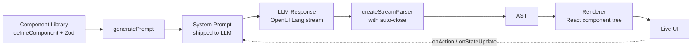

# OpenUI — Profile

A profile of OpenUI as it lives in this study (`studies/open-specs-and-standards/openui/`). Cites pinned paths so you can jump to source rather than trust paraphrase.

> **Disambiguation up front.** There are two open-source projects called "OpenUI." This profile is about **Thesys's OpenUI** — a generative-UI framework with its own little language. It is *not* the W3C OpenUI Community Group (which proposes new HTML controls), and it is *not* `wandb/openui` (an AI-driven UI sketching tool). The repo we have pinned is `thesysdev/openui`, originally trending in late 2025.

## TL;DR

OpenUI is a full-stack framework for **Generative UI** — interfaces that an LLM emits at runtime rather than a developer writing by hand. Its center of gravity is **OpenUI Lang**: a tiny, streaming-first declarative language designed to be (a) cheap for the model to emit, (b) safe against incomplete tokens mid-stream, and (c) confined to a typed component library so the model can't "make up" elements. On the published benchmarks it uses **47–67% fewer tokens** than equivalent JSON formats for the same UI (`benchmarks/README.md:36-45`).

The framework ships four npm packages, a React-based runtime that parses tokens *as they arrive* and updates the DOM progressively, a CLI that scaffolds a working Next.js chat app, and an Agent Skill so AI coding assistants can author OpenUI Lang correctly.

It is **not** a UI library, **not** a markdown extension, and **not** a JSON schema. It is a *language* with its own grammar, paired with a runtime that does three jobs that JSON-render formats cannot cleanly do: (1) handle interactivity (state, conditions, refs), (2) handle partial token streams, and (3) compress the wire-format below what JSON can mathematically reach.

## Why a new language? Four wins worth understanding

OpenUI's central argument is that JSON is the wrong medium for streamed, interactive, model-emitted UI. They explain this most directly in `docs/content/blog/stop-making-ai-write-json.mdx:8-14`:

> "JSON is a data format pretending to be a language. When you need a UI that can fetch data, manage state, and respond to user input, that distinction stops being theoretical. We learnt this the hard way. Thesys V1 shipped a JSON-based Generative UI SDK… Then we tried to make the UI interactive (state, live data, conditional rendering, form submissions) and JSON started fighting us at every step."

That essay is the single best primer on *why* OpenUI Lang exists. The four wins it claims, mapped to the code:

### 1. Token efficiency — measurable, not theoretical

Same UI, three formats, counted with `tiktoken` against the GPT-5 encoder (`benchmarks/run-benchmark.ts`):

| Scenario | YAML | Vercel JSON-Render | Thesys C1 JSON | OpenUI Lang | vs JSON-Render |
|---|---:|---:|---:|---:|---:|
| simple-table | 316 | 340 | 357 | **148** | **−56.5%** |
| chart-with-data | 464 | 520 | 516 | **231** | **−55.6%** |
| contact-form | 762 | 893 | 849 | **294** | **−67.1%** |
| dashboard | 2128 | 2247 | 2261 | **1226** | **−45.4%** |
| pricing-page | 2230 | 2487 | 2379 | **1195** | **−52.0%** |
| settings-panel | 1077 | 1244 | 1205 | **540** | **−56.6%** |
| e-commerce-product | 2145 | 2449 | 2381 | **1166** | **−52.4%** |
| **TOTAL** | **9122** | **10180** | **9948** | **4800** | **−52.8%** |

(Source: `benchmarks/README.md:36-45`.)

The "why" is structural, not tricks: JSON spends ~30% of its bytes on punctuation (`{`, `}`, `"`, `:`, `,`) that an LLM has no reason to emit. OpenUI Lang's syntax for the same simple-table looks like this (`benchmarks/samples/simple-table.oui:1-5`):

```
root = Stack([title, tbl])
title = TextContent("Employees (Sample)", "large-heavy")
tbl = Table(cols, rows)
cols = [Col("Name", "string"), Col("Department", "string"), Col("Salary", "number"), Col("YoY change (%)", "number")]
rows = [["Ava Patel", "Engineering", 132000, 6.5], ["Marcus Lee", "Sales", 98000, 4.2], …]
```

Same UI in Thesys's prior C1 JSON costs 357 tokens vs. 148 for OpenUI Lang — a 2.4× reduction (`benchmarks/samples/simple-table.c1.json:1-59`).

The wire-format wins compound. A model that can describe twice as much UI per token can either render twice as much before hitting a context limit, or pay half as much per render.

### 2. Streaming-safe by construction

The hard problem with model-generated UI isn't "render the final tree." It's "render the partial tree that arrives one token at a time, without crashing, and recover gracefully when the next token arrives."

OpenUI Lang's parser handles this with two cooperating mechanisms:

**(a) Auto-close on incomplete input.** The streaming parser tracks open brackets and string state, and when asked to render mid-stream it emits a synthetic close for anything still open (`packages/lang-core/src/parser/statements.ts:18-59`):

```typescript
export function autoClose(input: string): { text: string; wasIncomplete: boolean } {
  const stack: string[] = [];
  let inStr: false | '"' | "'" = false;
  // … tracks string context, escapes, and bracket depth …
  if (c === "(" || c === "[" || c === "{") stack.push(c);
  else if (c === ")" && stack[stack.length - 1] === "(") stack.pop();
  // … etc …
  // close anything still open
  if (inStr) out += inStr;
  for (let j = stack.length - 1; j >= 0; j--)
    out += stack[j] === "(" ? ")" : stack[j] === "[" ? "]" : "}";
  return { text: out, wasIncomplete: true };
}
```

This means a half-streamed `Card([Title("hel` renders as a `Card` containing a `Title` with the text `"hel"` — and updates *in place* when the rest of the tokens arrive.

Why "output tokens" matters more than input tokens

Three concrete reasons this column is the one to optimize:
  1. Cost. With most LLM APIs, output tokens are 3–5× the price of input tokens. GPT-5 today: roughly $1.25 per 1M input vs. $10 per 1M output. A 50% reduction on the output side is a real bill.
  2. Latency. Models generate at a fixed tokens-per-second. Half the tokens = roughly half the time-to-finish. The README acknowledges this directly — line 30 reports "estimated decode latency at a fixed 60 tokens/second." For a streaming chat UI, that's the difference between the table appearing in 2.5 seconds vs. 6 seconds.
  3. Context budget. Output tokens stay in the conversation. If you want a 20-message back-and-forth
     where each message renders UI, the format you choose compounds — bloated formats fill the context
     window faster, forcing summarization or truncation sooner.

**Mental model**
It's not "tokens to act on instructions." It's "tokens the model writes to describe a UI." 

> Roughly: shorter output language = cheaper, faster, and more headroom.
> A useful analogy: if you asked five people to describe the same chess position, one in standard algebraic notation (Nf3), one in long-form English ("the knight on g1 moves to f3"), one in coordinate format ("g1-f3"), and one in PGN with metadata — they'd all encode the same move, but the costs would differ by 3-5×. OpenUI Lang vs. JSON is the same shape of comparison: same content, different verbosity, and the verbose one charges more per move.

**(b) Ternary peek-ahead across newlines.** The parser also has to know when a newline ends a statement vs. when the next line is a continuation. The clever case is multi-line ternaries: a `?` on one line and a `:` on the next. The parser peeks past whitespace before splitting (`packages/lang-core/src/parser/parser.ts:433-485`):

```typescript
else if (c === "\n" && depth <= 0 && ternaryDepth <= 0) {
  // Before splitting, look ahead past whitespace
  let peek = i + 1;
  while (peek < buf.length && (buf[peek] === " " || buf[peek] === "\t" || …)) peek++;
  if (peek < buf.length && (buf[peek] === "?" || (buf[peek] === ":" && ternaryDepth > 0))) {
    continue; // ternary continuation — don't split
  }
  // Depth-0 newline = end of a statement
  …
}
```

This is the kind of detail that *cannot* exist in JSON: JSON can't have a "continued expression" because every value is self-contained. The OpenUI authors paid a real cost (a _hand-rolled streaming parser_) to buy a real feature (multi-line interactive logic).

**(c) Forward references resolve later.** A statement can refer to a variable that hasn't been defined yet, and the parser tracks the unresolved set rather than erroring (`packages/lang-core/src/parser/__tests__/parser.test.ts:109-131`):

```typescript
it("tracks unresolved refs mid-stream without errors", () => {
  const parser = createStreamParser(schema);
  const midResult = parser.push("root = Stack([tbl])\n");
  expect(midResult.meta.unresolved).toContain("tbl");
  expect(midResult.meta.errors).toHaveLength(0);
});

it("resolves automatically when ref is defined in a later chunk", () => {
  const parser = createStreamParser(schema);
  parser.push("root = Stack([tbl])\n");
  const result = parser.push('tbl = Title("hello")\n');
  expect(result.meta.unresolved).toHaveLength(0);
});
```

The model emits `root` first (the layout skeleton), then fills in details. The renderer always has *something* to show.

### 3. The component library *is* the system prompt

This is the single most generalizable idea in the project, even for people who'll never use the React runtime.

You define your components with `defineComponent()`, passing a Zod schema for props (`packages/react-lang/src/library.ts:40-47`):

```typescript
export function defineComponent<T extends $ZodObject>(config: {
  name: string;
  props: T;
  description: string;
  component: ComponentRenderer<z.infer<T>>;
}): DefinedComponent<T>
```

A real component definition from the built-in chat library (`packages/react-ui/src/genui-lib/openuiChatLibrary.tsx:81-100`):

```typescript
const ChatCard = defineComponent({
  name: "Card",
  props: z.object({ children: z.array(ChatCardChildUnion) }),
  description: "Vertical container for all content in a chat response. Children stack top to bottom automatically.",
  component: ({ props, renderNode }) => (
    <OpenUICard width="full" style={{ display: "flex", flexDirection: "column", … }}>
      {renderNode(props.children)}
    </OpenUICard>
  ),
});
```

A library is then turned into a **system prompt** by walking those Zod schemas and generating the syntax rules + signature list (`packages/lang-core/src/parser/prompt.ts:1-249`). The output looks like (from a generated prompt — `examples/openui-chat/src/generated/system-prompt.txt:1-12`):

```
You are an AI assistant that responds using openui-lang…

## Syntax Rules

1. Each statement is on its own line: `identifier = Expression`
2. `root` is the entry point — every program must define `root = Card(...)`
3. Expressions are: strings ("..."), numbers, booleans, null, arrays, objects,
   or component calls TypeName(arg1, arg2, ...)
…
```

The prompt is **derived** from the registered components, not hand-written. Add a component → its signature appears in the prompt automatically. Remove one → it disappears. The model can never ask for a component that isn't registered, because the prompt never mentions it.

This collapses three things that are normally separate — **the type system** (Zod), **the LLM contract** (the prompt), and **the renderer's input grammar** (parser + AST) — into one source of truth. Add a component once; it's typed, rendered, and prompt-described.

### 4. Constrained output

Because every accepted shape is registered in the library, output is bounded. The Renderer rejects (or treats as best-effort) anything that doesn't parse. The blog post is direct about this trade-off (`docs/content/blog/stop-making-ai-write-json.mdx:8-14` and following): you give up the freedom to say "make me anything" in exchange for a UI surface that is type-safe, brand-consistent, and won't render the model's hallucinated `<DancingPancake>` component.

The AST itself is a discriminated union — fewer node kinds than even JSON has (`packages/lang-core/src/parser/ast.ts:30-47`):

```typescript
export type ASTNode =
  | { k: "Comp"; name: string; args: ASTNode[]; mappedProps?: … }
  | { k: "Str"; v: string }
  | { k: "Num"; v: number }
  | { k: "Bool"; v: boolean }
  | { k: "Null" }
  | { k: "Arr"; els: ASTNode[] }
  | { k: "Obj"; entries: [string, ASTNode][] }
  | { k: "Ref"; n: string }
  | { k: "BinOp" | "UnaryOp" | "Ternary" | "Member" | "Index" | … };
```

The grammar is small enough to fit on a postcard, which is part of why the system prompt is short enough to leave the model real budget for the UI itself.

## What's actually inside this submodule

| Path | What's there |
|---|---|
| `openui/README.md` | Pitch, packages table, quickstart, benchmarks summary |
| `openui/packages/react-lang/` | Core runtime — `defineComponent`, `createLibrary`, `Renderer`, prompt generation |
| `openui/packages/react-headless/` | Headless chat state, streaming adapters (OpenAI, LangGraph, ag-UI), message format converters |
| `openui/packages/react-ui/` | Prebuilt chat layouts (Copilot, FullScreen, BottomTray) and two component libraries |
| `openui/packages/openui-cli/` | `npx @openuidev/cli@latest create …`, plus `generate` for system prompts |
| `openui/packages/lang-core/` | Internal — the actual parser, AST, prompt generator. This is where the language *lives*. |
| `openui/skills/openui/SKILL.md` | The Agent Skill — single file, 5.3k |
| `openui/examples/openui-chat/` | Working Next.js chat app — the canonical demo |
| `openui/benchmarks/` | Reproducible token-cost measurements with seven scenarios |
| `openui/docs/content/blog/stop-making-ai-write-json.mdx` | The manifesto — read this for the *why* |

Two artifacts to read in the upstream for vivid examples:
- `openui/packages/lang-core/src/parser/parser.ts` — the entire streaming parser is in one file. ~600 lines, very readable.
- `openui/benchmarks/samples/contact-form.oui` vs `contact-form.c1.json` — the same 12-line form costs 294 tokens in OpenUI Lang and 849 in JSON.

## How a real project uses it (the everyday loop)



### Quickstart (verified from `README.md:54-71`)

```bash
npx @openuidev/cli@latest create --name genui-chat-app
cd genui-chat-app
echo "OPENAI_API_KEY=sk-…" > .env
npm run dev
```

This scaffolds a Next.js app with:
- A pre-generated system prompt at `src/generated/system-prompt.txt` (~19k of text)
- A pre-wired `/api/chat` route streaming LLM tokens through the parser
- A `Renderer` mounted on the page rendering as tokens arrive
- The chat library (60+ components) imported from `@openuidev/react-ui`

The prompt is *not* regenerated at runtime — it's a build artifact. Add a component to `src/library.ts` → run `openui generate` → check in the regenerated prompt.

### Mental model for using it well

- **`root` is the entry point.** Every response begins with `root = …`. The model is trained-by-prompt to do this. (`examples/openui-chat/src/generated/system-prompt.txt:5`)
- **Variables are forward-referenceable.** Define `root` first as the layout skeleton, then fill in details. Streaming-friendly.
- **Component calls are positional, not named-arg.** `Card(children, title?)` not `Card({ children, title })`. This is part of the token saving.
- **Zod schemas are the contract.** If the model emits a prop the schema rejects, that prop is dropped (or the call errors, depending on validation mode). Keep schemas tight; let the parser do the policing.
- **The prompt is generated, not hand-written.** Don't edit `system-prompt.txt` by hand — change the library and regenerate.
- **Streaming is the default, not a feature.** Even the one-shot `parse()` shares code paths with `createStreamParser`. Test against partial input.

## The Agent Skill they ship

Inside the repo at `openui/skills/openui/SKILL.md` is a single-file skill — no `references/`, no `templates/`, no `scripts/`. Frontmatter verbatim (`skills/openui/SKILL.md:1-4`):

```yaml
---
name: openui
description: "Build generative UI apps with OpenUI and OpenUI Lang — the token-efficient open standard for LLM-generated interfaces. Use when mentioning OpenUI, @openuidev, generative UI, streaming UI from LLMs, component libraries for AI, or replacing json-render/A2UI. Covers scaffolding, defineComponent, system prompts, the Renderer, and debugging OpenUI Lang output."
---
```

Two notable patterns:

1. **The trigger keywords are listed explicitly in the description** — "OpenUI", "@openuidev", "generative UI", "streaming UI from LLMs", "component libraries for AI", "replacing json-render/A2UI". This is the same approach we settled on for our own skill descriptions (`pseudomonorepos`, `study-repos-first`).
2. **Single-file is enough.** The body of `SKILL.md` (97 lines) covers architecture, syntax rules, package usage, scaffolding, and debugging — no references folder needed for a skill of this scope.

That's worth filing away. We've been adding `references/` directories by default; OpenUI's working counterexample is that for a skill scoped to "use this one library," a single dense `SKILL.md` is plenty. Reach for `references/` only when the body has to fork by scenario.

## Comparisons (per the upstream)

The blog post `stop-making-ai-write-json.mdx` is the comparison document. Highlights:

**vs. JSON (general).** "JSON is a data format pretending to be a language." State binding requires `{"$bindState": "/path/to/var"}` wrapper objects; conditional rendering requires `{"$cond": …, "$then": …, "$else": …}`. OpenUI Lang has `cond ? then : else` (`docs/content/blog/stop-making-ai-write-json.mdx:56-129`).

**vs. Vercel `json-render`.** Acknowledged as "serious system." Cited as hitting the same ceiling: streaming works, interactivity doesn't compose. (`docs/content/blog/stop-making-ai-write-json.mdx:49-52`)

**vs. JSX directly.** Not addressed head-on in the docs, but the structural answer is: JSX is a *programming language* the model would have to write — no constraint on the component set, no streaming guarantees, no built-in token efficiency. OpenUI Lang gives up Turing-completeness in exchange for safety + brevity.

**vs. MDX / markdown.** Different problem space. MDX is for *content* with embedded UI. OpenUI is for *UI* generated from a prompt. Neither replaces the other.

## When NOT to reach for this

- **Static UI.** If the UI is fixed at build time, write it in your framework directly. OpenUI is for runtime generation.
- **Pure content / long-form text.** Use markdown (or LFM, or MDX). OpenUI's strength is structured, interactive UI; it's not built for prose.
- **Non-React stacks (today).** All the runtime packages are React-only. There is no Svelte, Vue, or Astro renderer. You could in principle write your own renderer over the AST, but it's not on the upstream roadmap.
- **Open-ended creative output.** A constrained component library is a feature, but it's also a ceiling. If you want the model to invent novel UI primitives, OpenUI's whole shape pushes the other way.

## Fit with our context (honest note)

This profile is a study, not an adoption recommendation. A few real tensions between OpenUI's shape and our standing conventions:

- **React-only.** OpenUI is built around React, which our `astro-knots` skill explicitly prohibits for our Astro sites. Adopting OpenUI as-is in any Astro Knots property would require a hard exception.
- **Generative UI vs. content-first sites.** Most of our work is content-first marketing/documentation sites where UI is authored, not generated. OpenUI's value proposition only kicks in when an LLM is producing UI live.
- **OpenUI Lang is a wire format, not a content format.** For our needs (LFM, AGENTS.md, content authoring), OpenUI Lang is downstream of the problem. It's the LLM-emit step, not the human-author step.

What's still worth learning from OpenUI even if we don't adopt the runtime:

1. **The "library = prompt" pattern** — registering components with typed schemas and *deriving* the LLM instructions from them. This pattern would translate to a Svelte equivalent if anyone wanted to build one. Closely related to how we think about LFM's syntax-trigger registry.
2. **Streaming-safe parsing as a first-class concern** — the auto-close + ternary peek-ahead mechanics. Worth stealing if we ever build a streaming markdown extension.
3. **Single-file `SKILL.md` ergonomics** — proof that a tightly-scoped skill doesn't need `references/`. Useful counterweight to our default of building out reference docs.
4. **Compact-language-as-LLM-output** — the structural argument that JSON is the wrong medium for streamed, interactive output. Aligns with our suspicion of JSON-everywhere conventions.

If the question on the table is "should we build something that lets an LLM generate UI in our stack?" — OpenUI is the most thoughtful prior art we've found. If the question is "should we adopt OpenUI directly?" — answer is almost certainly no, because of the React dependency.

## One-line summary

> OpenUI replaces "model emits JSON, we render it" with "model emits a tiny declarative language whose grammar is generated from your typed component library, parsed token-by-token by a streaming-safe parser, and rendered progressively in React" — for a 50%+ token reduction and the ability to express interactivity, conditions, and state that JSON-render formats cannot.
