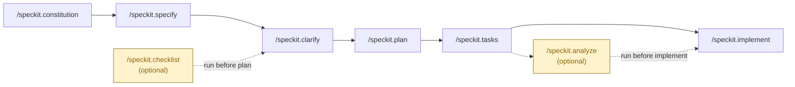
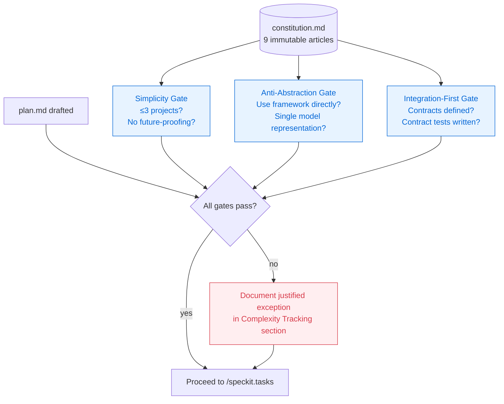
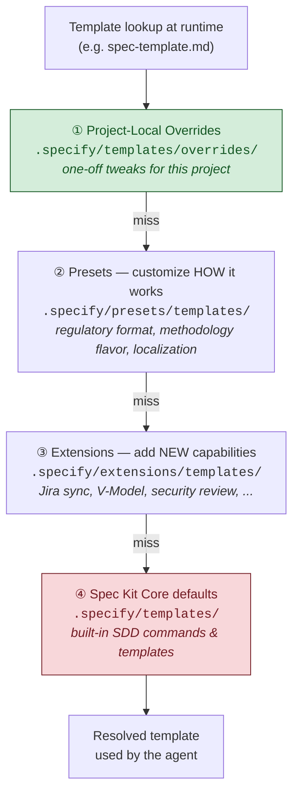

# Spec Kit — Profile

A profile of GitHub's Spec Kit as it lives in this study (`studies/open-specs-and-standards/spec-kit/`). Cites pinned paths so you can jump to source rather than trust paraphrase. Read this alongside [`Profile__OpenSpec.md`](./Profile__OpenSpec.md) — the two tools share a problem space but make almost opposite design choices.

## TL;DR

Spec Kit is GitHub's **opinionated, phase-gated, constitution-anchored framework for Spec-Driven Development (SDD)**. The core thesis (`spec-driven.md:1-17`) is that **specifications generate code, not the other way around** — code is the *output* of a sufficiently precise spec, not the source of truth. To make that real, Spec Kit ships a Python CLI (`specify`), a set of `/speckit.*` slash commands, and a stack of templates that *constrain* the LLM into producing complete, unambiguous, testable specs.

It is **not** a lightweight markdown convention. It's a methodology with teeth: a project "constitution" of immutable architectural principles (`spec-driven.md:278-348`), explicit phase gates (Simplicity, Anti-Abstraction, Integration-First) that the agent must pass or document why it's skipping, forced `[NEEDS CLARIFICATION]` markers wherever the LLM would otherwise guess, and an extension/preset system layered on top so organizations can encode their own standards.

If OpenSpec's pitch is "specs are behavior contracts, lightweight, iterate freely," Spec Kit's pitch is "specs are executable artifacts that generate the system — make them rigorous enough to actually do that."

## Why this is different from "just write a normal spec"

Spec Kit replaces a prose PRD with four interlocking improvements. They overlap with OpenSpec's wins but the *kind* of improvement differs.

### 1. Conventions: user stories, priorities, and forced clarifications

The spec template (`spec-kit/templates/spec-template.md:1-80`) imposes a fixed structure:

```markdown
# Feature Specification: [FEATURE NAME]
**Feature Branch**: `[###-feature-name]`     ← auto-numbered
**Status**: Draft
**Input**: User description: "$ARGUMENTS"

## User Scenarios & Testing *(mandatory)*

### User Story 1 - [Title] (Priority: P1)
**Why this priority**: ...
**Independent Test**: [must be MVP-viable on its own]
**Acceptance Scenarios**:
1. **Given** ..., **When** ..., **Then** ...
```

Three primitives carry the load:

- **User stories with explicit priorities** (`P1`, `P2`, `P3`...) where each story must be *independently testable and shippable as an MVP slice*. This isn't decorative — `/speckit.tasks` later turns each priority bucket into its own implementation phase with a checkpoint.
- **Given/When/Then acceptance scenarios** — same testable shape as OpenSpec's, but framed under stories rather than free-standing requirements.
- **`[NEEDS CLARIFICATION: <specific question>]` markers** are *mandatory* whenever the LLM would otherwise guess (`spec-driven.md:181-190`). The template explicitly forbids plausible assumptions: don't guess that login means email/password — flag it. Templates also include "no `[NEEDS CLARIFICATION]` markers remain" as a checklist item that must be cleared before planning (`spec-driven.md:194-204`).

Compared to OpenSpec's `Requirement: / Scenario:` headings with RFC 2119 keywords, Spec Kit pushes harder on **forcing the LLM to surface its uncertainty rather than fill it in** — which is the failure mode SDD is most worried about.

### 2. Data compression: feature-folder + branch, full specs (no deltas)

This is where Spec Kit and OpenSpec diverge most sharply. Spec Kit does **not** use delta specs. Each feature gets a full, freshly-generated spec, in its own auto-numbered branch and folder (`README.md:559-582`, `spec-driven.md:78-94`):

```text
specs/001-create-taskify/
├── spec.md          # User stories, acceptance scenarios, edge cases
├── plan.md          # Technical plan (after /speckit.plan)
├── research.md      # Phase 0: tech-stack research
├── data-model.md    # Phase 1: entities and schemas
├── contracts/       # Phase 1: API contracts (JSON, OpenAPI, etc.)
│   └── api-spec.json
├── quickstart.md    # Phase 1: validation scenarios
└── tasks.md         # Phase 2: ordered, parallelizable tasks
```

Two things to notice:

- **One folder per feature, one feature per branch.** `/speckit.specify` automatically scans existing specs to pick the next number (001, 002, ..., expanding past 3 digits) and creates the matching branch (`spec-driven.md:81-85`). The unit of work is a feature; the unit of review is a branch.
- **The "compression" is not in deltas — it's in the artifact split.** Instead of one bloated PRD, you get six focused files, each owned by a specific phase. `research.md` answers "are we sure about these libraries?" `data-model.md` answers "what are the entities?" `contracts/` is machine-readable enough to drive code generation. `quickstart.md` is the validation scenario you can hand to a tester.

The cost of skipping deltas: brownfield modifications restate more context than OpenSpec's `ADDED/MODIFIED/REMOVED` blocks would. The benefit: each feature folder is self-contained, archiveable, and links cleanly to a branch and (optionally) a PR.

### 3. Navigation: phases, gates, and the constitution

Spec Kit's organizing structure isn't a DAG between artifacts — it's a **linear pipeline of phase commands gated by a constitution**:



Each command writes a specific artifact:

| Command | Output |
|---------|--------|
| `/speckit.constitution` | `.specify/memory/constitution.md` |
| `/speckit.specify <prompt>` | `specs/NNN-feature/spec.md` (+ branch) |
| `/speckit.clarify` | adds Clarifications section, resolves `[NEEDS CLARIFICATION]`s |
| `/speckit.plan <tech stack>` | `plan.md` + `research.md` + `data-model.md` + `contracts/` + `quickstart.md` |
| `/speckit.tasks` | `tasks.md` (priorities ordered, `[P]` = parallelizable) |
| `/speckit.analyze` *(optional)* | cross-artifact consistency check |
| `/speckit.implement` | executes `tasks.md` |

The constitution (`spec-driven.md:274-407`) is the navigation backbone. Nine articles encode immutable architectural principles — Library-First, CLI Interface Mandate, Test-First Imperative ("NON-NEGOTIABLE"), Simplicity, Anti-Abstraction, Integration-First Testing. Each subsequent phase has **gates** (`spec-driven.md:208-224`) that route every plan through the constitution before it can proceed:



The agent cannot proceed unless it either passes each gate or writes a justified exception in the "Complexity Tracking" section. Compared to OpenSpec's "dependencies are enablers, not gates" (`Profile__OpenSpec.md` §3), Spec Kit's "gates are gates" — they're the whole point. The methodology assumes that LLMs over-engineer by default and that the way to fix it is to make over-engineering require an explicit, paper-trailed justification.

### 4. Extensibility: extensions + presets + project overrides

Spec Kit ships an explicit extensibility model that OpenSpec doesn't have an equivalent of (`README.md:341-398`). Four-level priority stack, resolved at runtime — Spec Kit walks top-down and uses the first match:



| Priority | Layer | Location |
|---------|-------|----------|
| 1 (highest) | Project-Local Overrides | `.specify/templates/overrides/` |
| 2 | Presets — customize *how* it works | `.specify/presets/templates/` |
| 3 | Extensions — add *new* capabilities | `.specify/extensions/templates/` |
| 4 (lowest) | Spec Kit Core defaults | `.specify/templates/` |

- **Extensions** add new commands and templates: think Jira sync, security review, V-Model test traceability, post-implementation drift detection. The community catalog has 80+ entries (see the table in `README.md:196-283`).
- **Presets** override existing templates without adding capabilities: enforce a regulatory format, swap terminology for an Agile/Kanban/Waterfall flavor, localize the workflow to another language.
- **Project-local overrides** are for one-off tweaks that don't deserve a full preset.

This is engineered for organizations that need to bend a methodology to their compliance and process world without forking the tool.

## What's actually inside this submodule

| Path | What's there |
|------|--------------|
| `spec-kit/README.md` | Pitch, install, full step-by-step walkthrough, command reference |
| `spec-kit/spec-driven.md` | The methodology essay. Read this if you want to understand *why* before *how*. The Constitution and gate model are here. |
| `spec-kit/AGENTS.md` | Instructions for AI coding agents |
| `spec-kit/DEVELOPMENT.md` | Contributor docs |
| `spec-kit/templates/spec-template.md` | The user-story-and-acceptance-scenarios skeleton |
| `spec-kit/templates/plan-template.md` | The implementation plan skeleton with Constitution Check + Phase 0/1/2 structure |
| `spec-kit/templates/tasks-template.md` | The task-list skeleton with `[P]` parallel markers |
| `spec-kit/templates/constitution-template.md` | The starting point for `.specify/memory/constitution.md` |
| `spec-kit/templates/checklist-template.md` | "Unit tests for English" — quality checklists for specs |
| `spec-kit/templates/commands/` | Per-command prompt files (`specify.md`, `plan.md`, `tasks.md`, `implement.md`, `clarify.md`, `analyze.md`, `checklist.md`, `constitution.md`, `taskstoissues.md`) |
| `spec-kit/src/specify_cli/` | The Python CLI implementation (entry point for `specify init`, `specify check`, etc.) |
| `spec-kit/extensions/` | Extension catalog (`catalog.community.json`) and publishing guide |
| `spec-kit/presets/` | Preset publishing guide and built-ins |
| `spec-kit/integrations/` | Per-AI-tool installer logic (30+ integrations) |
| `spec-kit/docs/` | DocFX-built reference site (CLI, integrations, extensions, presets) |
| `spec-kit/scripts/`, `spec-kit/workflows/` | Shell scripts the agent invokes (`create-new-feature.sh`, `setup-plan.sh`, `check-prerequisites.sh`) |

If you only have time for two files: read `spec-driven.md` end-to-end (it's the manifesto) and skim `templates/spec-template.md` (it's the artifact you'll actually fill in).

## How to get started (if you actually wanted to use it)

### Install once

```bash
# Pin a release tag (recommended)
uv tool install specify-cli --from git+https://github.com/github/spec-kit.git@vX.Y.Z

# Or via pipx if you don't use uv
pipx install git+https://github.com/github/spec-kit.git@vX.Y.Z

specify version    # verify
```

Prerequisites: Python 3.11+, `git`, and either `uv` or `pipx`.

### Initialize per-project

```bash
specify init <PROJECT_NAME>                       # new project
specify init . --integration claude               # in existing project
specify init . --integration codex --integration-options="--skills"   # skills mode
```

`init` prompts you to pick an AI agent integration (Claude Code, Copilot, Cursor, Gemini CLI, Codex, Qwen, opencode, Kiro, ~30 total) and writes the `/speckit.*` slash commands or skills into that agent's config directory. After it's done, your project has a `.specify/` folder with `memory/`, `templates/`, and `scripts/`.

### The opinionated 6-step loop

```text
/speckit.constitution <principles>     →  .specify/memory/constitution.md
/speckit.specify <what + why>          →  specs/NNN-feature/spec.md  (+ branch)
/speckit.clarify                       →  resolves [NEEDS CLARIFICATION] markers
/speckit.plan <tech stack>             →  plan.md + research.md + data-model.md + contracts/ + quickstart.md
/speckit.tasks                         →  tasks.md (ordered by user-story priority, [P] = parallel)
/speckit.implement                     →  executes tasks against the codebase
```

Optional sharpeners:

- `/speckit.analyze` after `/speckit.tasks`, before `/speckit.implement` — cross-artifact consistency and coverage check.
- `/speckit.checklist` — generates custom quality checklists ("unit tests for English") to validate the spec before planning.
- `/speckit.taskstoissues` — converts `tasks.md` into GitHub Issues for tracking.

### When you discover the spec was wrong mid-implementation

This is where the philosophy bites. Spec Kit's intended move is *not* "edit the artifact and continue" (that's OpenSpec's move). It's: **fix the spec, regenerate the affected downstream artifacts, re-run the gates, then implement**. The `spec-driven.md:43-46` framing is explicit — pivots become "systematic regenerations rather than manual rewrites." In practice users do edit in place, but the methodology pulls toward regeneration to keep the spec → code chain intact.

Community extensions like *Spec Refine*, *Reconcile*, and *Spec Sync* (see `README.md:247-264`) exist precisely because in-place updates can drift, and they automate the propagation back through `plan.md` → `tasks.md`.

## Mental model for using it well

- **The constitution is the primary artifact, not the spec.** Spend real time on `/speckit.constitution` *before* the first `/speckit.specify`. Every gate check and every architectural decision routes through it. A weak constitution produces toothless gates.
- **Treat `[NEEDS CLARIFICATION]` as a feature, not a defect.** When the agent surfaces uncertainty, that's the system working. Resolve it via `/speckit.clarify` rather than letting it fall through.
- **One feature = one branch = one folder.** Don't co-locate features. Spec Kit's whole "executable spec" model assumes the feature folder is a closed unit that drives a closed implementation.
- **Use phase gates as forcing functions, not bureaucracy.** "Using ≤3 projects?" feels arbitrary until you've watched an LLM happily generate a 7-microservice solution for a CLI tool. The point of the gate is to make over-engineering *require* a paper-trail.
- **Reach for presets before forking templates.** If your org needs FedRAMP traceability or domain-specific ceremony, that belongs in a preset (priority 2), not a fork of core templates (priority 4).
- **Reach for extensions for new capabilities, not new conventions.** Jira sync = extension. Reformatting the spec template = preset.

## When NOT to reach for this

- **Small bug fixes and one-line changes.** Six artifacts and a constitution check is overkill. The community ships a *TinySpec* extension (`README.md:273`) precisely to bypass this for small work.
- **Pure exploration / spike work.** The constitution and gates assume you know roughly where you're going. If you're prototyping to *find out* what to build, the methodology slows you down. Spec Kit's docs explicitly let you skip clarification for spikes (`README.md:594-595`).
- **Brownfield surgical edits.** Modifying one requirement in an existing system fits OpenSpec's delta-spec model far better. Spec Kit's "feature folder" model wants to treat changes as new features, which inflates ceremony.
- **Heterodox tech stacks the constitution forbids.** Article I (Library-First) and the ≤3 projects rule are real constraints. If your project legitimately needs a different shape, you'll be writing exception-tracking entries on every plan.

## Spec Kit vs. OpenSpec — the honest comparison

Same problem space (human + AI alignment via spec). Different bets at almost every design fork.

| Axis | Spec Kit | OpenSpec |
|------|----------|----------|
| **Philosophy** | Specs are *executable* — they generate code (`spec-driven.md:1-17`) | Specs are *behavior contracts* — orthogonal to implementation |
| **Workflow** | Linear phases with gates: constitution → specify → plan → tasks → implement | Fluid actions; dependencies enable but don't gate |
| **Spec primitive** | User Story (with priority) + Acceptance Scenarios + `[NEEDS CLARIFICATION]` markers | `Requirement:` (RFC 2119) + `Scenario:` (Given/When/Then) |
| **Change model** | Full spec per feature in `specs/NNN-name/`; new feature = new folder + branch | Delta specs (`ADDED`/`MODIFIED`/`REMOVED`) merged into a single source-of-truth spec on archive |
| **Architectural discipline** | Constitution with 9 articles + phase gates | Convention-light; trust the human + agent loop |
| **Brownfield fit** | Awkward — modifications inflate to new feature folders | First-class — deltas are the native shape |
| **Toolchain** | Python (`uv` / `pipx`), shell scripts, DocFX site | Node/npm (`npm install -g @fission-ai/openspec`) |
| **Extensibility** | Formal: 4-level priority stack (overrides → presets → extensions → core), 80+ community extensions | Schema-driven: define your own artifact DAG in `schema.yaml` |
| **AI-tool reach** | 30+ integrations | 25+ integrations |
| **Best fit** | Greenfield enterprise work where alignment, compliance, and traceability matter | Brownfield iteration where you want spec discipline without ceremony |

OpenSpec's own README puts it bluntly: "Thorough but heavyweight. Rigid phase gates, lots of Markdown, Python setup. OpenSpec is lighter and lets you iterate freely." That's accurate but framed by a competitor — Spec Kit would counter that the heaviness *is the point* when specs are meant to generate code, not just guide it.

## One-line summary

> Spec Kit wins by treating the spec as the executable source of truth: it constrains the LLM with user-story priorities, mandatory `[NEEDS CLARIFICATION]` markers, an immutable architectural constitution, and phase gates — and it pays for that rigor in heavier ceremony, full-spec-per-feature artifacts, and a Python toolchain.
