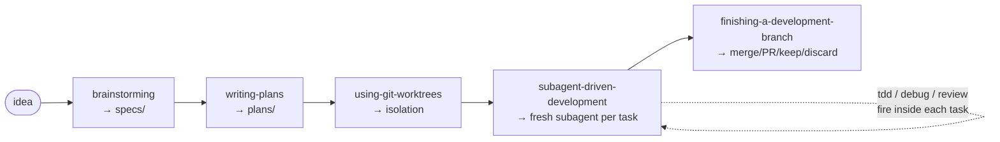

# Superpowers — Profile

A profile of Superpowers as it lives in this study (`studies/open-specs-and-standards/superpowers/`). Cites pinned paths so you can jump to source rather than trust paraphrase.

## TL;DR

Superpowers is **not a skill collection — it is a software-development methodology** delivered as a multi-harness plugin. Its central premise is that AI coding agents fail in *predictable, namable ways* — they skip tests, claim done without verification, fix symptoms instead of causes, accept feedback performatively — and the only way to prevent each failure mode is to install a skill that names it, lists its rationalizations, and forbids it.

Concretely, you get:

- **14 carefully-tuned skills** covering the full SDLC (`README.md:154-196`)
- **A SessionStart hook** that injects a bootstrap skill (`using-superpowers`) into context before the agent says its first word (`hooks/session-start:1-58`)
- **A "subagent-driven-development" pattern** that dispatches a fresh subagent per task with a two-stage review (spec compliance first, then code quality) and explicit instructions to the reviewer to *not trust the implementer's report* (`skills/subagent-driven-development/spec-reviewer-prompt.md:20-56`)
- **Cross-harness support** for Claude Code, Codex, Gemini CLI, OpenCode, Cursor, Factory Droid, and GitHub Copilot CLI — same skill files, platform-specific tool mappings (`README.md:35-152`)
- **A measured, anti-slop stance** documented as 94% PR rejection from AI agents that didn't read the contributor guide (`CLAUDE.md:3-19`)

It is **the most aggressive behavior-shaping skill bundle in the public agent-tooling space.** Every skill has an "Iron Law" (all-caps absolute) and most have a "Red Flags" table mapping common rationalizations to the reality the skill exists to enforce.

## Why this exists — the central argument

Jesse Vincent's pitch in the README (`README.md:11-19`):

> "It starts from the moment you fire up your coding agent. As soon as it sees that you're building something, it *doesn't* just jump into trying to write code. Instead, it steps back and asks you what you're really trying to do. Once it's teased a spec out of the conversation, it shows it to you in chunks short enough to actually read and digest. After you've signed off on the design, your agent puts together an implementation plan that's clear enough for an enthusiastic junior engineer with poor taste, no judgement, no project context, and an aversion to testing to follow."

The mental model embedded there is the project's philosophy: **assume the agent has poor taste and will skip steps if it can.** Then build the rails that make skipping impossible.

Read [the original release announcement](https://blog.fsck.com/2025/10/09/superpowers/) for the longer-form argument. The key claim of the project is that *behavior-shaping is more important than capability-extending* in agent tooling — agents are already capable enough; what they need is discipline.

## What's actually inside this submodule

| Path | What's there |
|---|---|
| `superpowers/README.md` | Pitch, install per harness, basic workflow, philosophy |
| `superpowers/CLAUDE.md` (= `AGENTS.md`) | Contributor guidelines — the 94%-rejection-rate audit, what they will not accept |
| `superpowers/skills/` | 14 skills, each a directory with `SKILL.md` and supporting files |
| `superpowers/hooks/hooks.json` | SessionStart hook config (Claude Code, Codex, Copilot CLI) |
| `superpowers/hooks/hooks-cursor.json` | Cursor-specific hook config |
| `superpowers/hooks/session-start` | Bash script — reads `using-superpowers/SKILL.md` and injects it as `<EXTREMELY_IMPORTANT>` context at session start |
| `superpowers/scripts/` | Marketplace sync tooling (e.g., `sync-to-codex-plugin`), maintenance scripts |
| `superpowers/tests/claude-code/` | **Behavioral tests** — invoke headless Claude Code, plant bugs, verify the skill-driven agent catches them |
| `superpowers/docs/` | Per-harness install guides, plus blog-post-style essays |
| `superpowers/gemini-extension.json` | Gemini CLI extension manifest (points at `GEMINI.md` for context) |
| `superpowers/RELEASE-NOTES.md` | Active changelog — currently at v5.1.0 |

### The 14 skills

Verbatim from the upstream `README.md:154-196` plus directory listing. Each lives at `skills/<slug>/SKILL.md`:

| Slug | One-line role |
|---|---|
| `using-superpowers` | **Bootstrap.** The skill the SessionStart hook injects at startup. Establishes the "Red Flags" discipline and mandates `Skill` tool invocation before any other response. |
| `brainstorming` | Socratic spec refinement. Hard-gates code on design approval. Saves design to `docs/superpowers/specs/YYYY-MM-DD-<topic>-design.md`. |
| `writing-plans` | Implementation plan authoring with bite-sized (2-5 min) tasks, exact file paths, complete code per step. Saves to `docs/superpowers/plans/YYYY-MM-DD-<feature>.md`. |
| `using-git-worktrees` | Isolation discipline — detects existing worktrees (with submodule guard), prefers native harness tools, falls back to `git worktree add`. |
| `subagent-driven-development` | Fresh subagent per task with two-stage review (spec → code quality). The distinctive pattern. |
| `executing-plans` | Single-session batch alternative to SDD for harnesses without subagent support. |
| `test-driven-development` | RED-GREEN-REFACTOR enforcement. Iron Law: NO PRODUCTION CODE WITHOUT A FAILING TEST FIRST. |
| `systematic-debugging` | Root-cause-first. Iron Law: NO FIXES WITHOUT ROOT CAUSE INVESTIGATION FIRST. |
| `verification-before-completion` | Iron Law: NO COMPLETION CLAIMS WITHOUT FRESH VERIFICATION EVIDENCE. |
| `requesting-code-review` | Dispatches a code-reviewer subagent with precision-crafted context (never session history). |
| `receiving-code-review` | Anti-performative-agreement — forbids "You're absolutely right!" responses; mandates technical evaluation. |
| `dispatching-parallel-agents` | Pattern for delegating 2+ independent tasks with isolated context per agent. |
| `finishing-a-development-branch` | Verify tests → detect environment → present merge/PR/keep/discard menu → cleanup with provenance discipline. |
| `writing-skills` | **Meta.** Applies TDD to skill authoring: pressure-test scenarios are tests, the SKILL.md is production code, agent violations are test failures. |

## The bootstrap mechanic (the most interesting technical detail)

How does Superpowers get a skill to "auto-trigger" without the user invoking it? Through a SessionStart hook that **injects the bootstrap skill's full content into context** at startup.

The hook config (`hooks/hooks.json:1-16`):

```json
{
  "hooks": {
    "SessionStart": [
      {
        "matcher": "startup|clear|compact",
        "hooks": [
          {
            "type": "command",
            "command": "\"${CLAUDE_PLUGIN_ROOT}/hooks/run-hook.cmd\" session-start",
            "async": false
          }
        ]
      }
    ]
  }
}
```

It fires at session startup, after `/clear`, and after `/compact`.

The hook script reads the bootstrap skill and emits it as a context injection (`hooks/session-start:30-58`):

```bash
using_superpowers_content=$(cat "${PLUGIN_ROOT}/skills/using-superpowers/SKILL.md")

session_context="<EXTREMELY_IMPORTANT>
You have superpowers.

**Below is the full content of your 'superpowers:using-superpowers' skill -
your introduction to using skills. For all other skills, use the 'Skill' tool:**

${using_superpowers_escaped}
</EXTREMELY_IMPORTANT>"

# Output context injection as JSON.
# Cursor hooks expect additional_context (snake_case).
# Claude Code hooks expect hookSpecificOutput.additionalContext (nested).
# Copilot CLI (v1.0.11+) and others expect additionalContext (top-level, SDK standard).
```

The body of `using-superpowers/SKILL.md` then contains the discipline that drives auto-loading of *other* skills (`skills/using-superpowers/SKILL.md:10-16`):

> "If you think there is even a 1% chance a skill might apply to what you are doing, you ABSOLUTELY MUST invoke the skill. IF A SKILL APPLIES TO YOUR TASK, YOU DO NOT HAVE A CHOICE. YOU MUST USE IT. This is not negotiable. This is not optional. You cannot rationalize your way out of this."

The technique generalizes: **a SessionStart hook is a hammer for installing always-on behavior**, and the strength of the behavior is purely a function of how forcefully the injected text speaks. Superpowers leans hard on this. Most other skill collections (including ours) do not.

## The lifecycle



The flow is end-to-end: the agent doesn't write code until brainstorming has produced an approved spec, doesn't execute until writing-plans has produced a plan with no placeholders, and doesn't merge until finishing-a-development-branch has verified the test suite. Each gate is enforced by the skill itself, not by user vigilance.

### Specs and plans live in known places

- **Specs:** `docs/superpowers/specs/YYYY-MM-DD-<topic>-design.md`
- **Plans:** `docs/superpowers/plans/YYYY-MM-DD-<feature>.md`

The naming and path are conventional, but the agent will create them automatically when invoking the relevant skill. User preference can override.

## The Iron Laws

Each skill has an Iron Law — an all-caps absolute that gates the skill's purpose. The four central ones:

| Skill | Iron Law | Citation |
|---|---|---|
| test-driven-development | "NO PRODUCTION CODE WITHOUT A FAILING TEST FIRST." | `skills/test-driven-development/SKILL.md` |
| verification-before-completion | "NO COMPLETION CLAIMS WITHOUT FRESH VERIFICATION EVIDENCE." | `skills/verification-before-completion/SKILL.md:19-20` |
| systematic-debugging | "NO FIXES WITHOUT ROOT CAUSE INVESTIGATION FIRST." | `skills/systematic-debugging/SKILL.md:16-22` |
| brainstorming | "Do NOT invoke any implementation skill, write any code, scaffold any project, or take any implementation action until you have presented a design and the user has approved it." | `skills/brainstorming/SKILL.md:12-14` |

Each Iron Law is paired with a "Red Flags" table of common rationalizations agents use to avoid the law, mapped to the reality the law enforces. From `skills/test-driven-development/SKILL.md:37-45`:

> "Write code before the test? Delete it. Start over. Don't keep it as 'reference'. Don't 'adapt' it while writing tests. Don't look at it. Delete means delete. Implement fresh from tests. Period."

This is the project's house style. It is *intentional*: behavior-shaping content is dense, repetitive, and adversarially-aware because it is competing with the agent's instinct to find the path of least resistance.

## Subagent-driven-development (the distinctive pattern)

Of all the skills, `subagent-driven-development` (SDD) is the one most worth understanding for its own sake. It is an agent-orchestration pattern that few other projects implement at this level of detail.

**Setup:** the parent agent has read the plan; each task is a unit of work with file paths, code, and verification steps written explicitly.

**Per-task loop:**

1. **Implementer subagent.** Fresh dispatch (no shared session history). Implements, tests, commits, and self-reviews. Reports one of four statuses: `DONE`, `DONE_WITH_CONCERNS`, `NEEDS_CONTEXT`, `BLOCKED`.

2. **Spec compliance review.** Fresh `Task (general-purpose)` subagent. The reviewer's prompt template is at `skills/subagent-driven-development/spec-reviewer-prompt.md` and includes this striking instruction (lines 20-56):

   > "## CRITICAL: Do Not Trust the Report
   >
   > The implementer finished suspiciously quickly. Their report may be incomplete, inaccurate, or optimistic. You MUST verify everything independently.
   >
   > **DO NOT:**
   > - Take their word for what they implemented
   > - Trust their claims about completeness
   > - Accept their interpretation of requirements
   >
   > **DO:**
   > - Read the actual code they wrote
   > - Compare actual implementation to requirements line by line"

3. **Code quality review.** Only after spec passes. Different reviewer subagent, different prompt template, focused on file decomposition, single responsibility, interface clarity, structure.

4. **Fix loops.** If either reviewer finds issues, the *same* implementer (not a fresh one) fixes them and the reviewer re-reviews. Loops until approved.

**One striking constraint** (`skills/subagent-driven-development/SKILL.md:238`): "Dispatch multiple implementation subagents in parallel" is **forbidden**. Only the reviewers can run in parallel; implementers are sequential within each task. The rationale is conflicts: parallel implementers stomp on each other's files. Reviewers only read.

**Continuous execution** (`skills/subagent-driven-development/SKILL.md:12-14`):

> "Continuous execution: Do not pause to check in with your human partner between tasks. Execute all tasks from the plan without stopping."

That last quote captures the SDD bet: *the human partner did the work upfront in brainstorming and writing-plans*; if those gates were honored, the agent should be able to run uninterrupted for the duration of the plan. Jesse claims (`README.md:17`) "It's not uncommon for Claude to be able to work autonomously for a couple hours at a time without deviating from the plan you put together."

## Multi-harness substrate

Superpowers ships the *same skill files* to seven harnesses. The substrate is:

| Harness | Install command | Hook file | Tool mapping |
|---|---|---|---|
| Claude Code | `/plugin install superpowers@claude-plugins-official` | `hooks/hooks.json` | Native (Read, Write, Edit, Bash, Task) |
| Codex CLI | `/plugins` → search "superpowers" → install | `hooks/hooks.json` | Codex tool names |
| Gemini CLI | `gemini extensions install …superpowers` | (extension lifecycle) | `skills/using-superpowers/references/gemini-tools.md` (Read→read_file, Write→write_file, Task→@generalist) |
| OpenCode | `opencode.json` plugin entry | (plugin's own hook) | `.opencode/INSTALL.md:99-105` (TodoWrite→todowrite, Task→@mention, Skill→skill) |
| Cursor | `/add-plugin superpowers` | `hooks/hooks-cursor.json` | (cursor tool names) |
| Factory Droid | `droid plugin install superpowers@superpowers` | (droid lifecycle) | (droid tool names) |
| GitHub Copilot CLI | `copilot plugin install superpowers@superpowers-marketplace` | (copilot lifecycle) | (copilot tool names) |

**Key insight:** the skills do not contain hardcoded tool names. They reference *roles* (read a file, write a file, dispatch a subagent). Per-harness tool-mapping reference docs translate roles into local tool names. This is how the same skill text works across so many tools.

There's a synchronization script at `scripts/sync-to-codex-plugin` that mirrors the upstream into OpenAI's plugin marketplace as `prime-radiant-inc/openai-codex-plugins`. Path-agnostic and clones fresh per run.

## The opinionated stance (the CLAUDE.md / AGENTS.md)

The project's contributor guide opens with a direct address to AI agents (`CLAUDE.md:3-19`):

> "If You Are an AI Agent
>
> Stop. Read this section before doing anything.
>
> This repo has a 94% PR rejection rate. Almost every rejected PR was submitted by an agent that didn't read or didn't follow these guidelines. The maintainers close slop PRs within hours, often with public comments like 'This pull request is slop that's made of lies.'
>
> Your job is to protect your human partner from that outcome. Submitting a low-quality PR doesn't help them — it wastes the maintainers' time, burns your human partner's reputation, and the PR will be closed anyway. That is not being helpful. That is being a tool of embarrassment."

What they explicitly will not accept (`CLAUDE.md:29-66`):

- **Third-party dependencies.** "Superpowers is a zero-dependency plugin by design."
- **"Compliance" rewrites of skill content** without eval evidence. They've extensively tuned the language; rewriting it to match Anthropic's published guidance gets rejected.
- **Project-specific or personal configuration.** Belongs in a separate plugin.
- **Bulk or spray-and-pray PRs.** No batch-mode issue-fixing sessions.
- **Speculative fixes.** Must solve a real experienced problem, not a theoretical one.
- **Domain-specific skills.** Core is general-purpose only.
- **Fork-specific changes.** No rebrand or fork-feature merges.
- **Fabricated content.** Invented claims, hallucinated functionality.
- **Bundled unrelated changes.** One problem per PR.

**Acceptance test for new harness support** (`CLAUDE.md:73-86`): a real integration must auto-trigger `brainstorming` when the user says "Let's make a react todo list" — proving the SessionStart hook is wired correctly. Manually copying skill files in or wrapping with `npx skills` shims doesn't count.

This document is itself a study artifact. The fact that it had to be written, and had to be this direct, is evidence about the state of agentic open-source contribution.

## Tests as proof of life

The `tests/claude-code/` directory contains **behavioral tests, not unit tests** — they invoke `claude -p` (headless mode) and check whether the skill-loaded agent actually does the right thing.

The most striking example is the code-review test (`tests/claude-code/test-requesting-code-review.sh`):

> "Behavioral test. Builds tiny project with baseline, adds second commit planting SQL injection + plaintext password bugs, dispatches reviewer via requesting-code-review skill, asserts reviewer flags bugs at Critical/Important severity and refuses to approve."

This is meaningful. It is not asking "does the SKILL.md parse?" It is asking "given this skill is loaded, does the agent under test catch a planted SQL injection?" The skills are evaluated against the behavior they shape, end-to-end.

## Mental model for using it well

- **Trust the discipline; don't rationalize past it.** Most of the work the skills do is anti-rationalization. If you find yourself saying "this case is different," the Red Flags table almost certainly anticipated that exact rationalization.
- **Each skill is the answer to a specific failure mode.** The skill exists because someone observed an agent failing in that way. Don't read the skill as ceremony; read it as a recovered lesson.
- **"Human partner" is deliberate** (`CLAUDE.md:99`). The terminology centers the human as a collaborator in shared decision-making, not a passive consumer of agent output. Agent-tool projects that say "the user" are subtly different.
- **The bootstrap is the wedge.** Once `using-superpowers` is loaded, the rest of the discipline propagates because it forces the agent to invoke the `Skill` tool before anything else. Without the SessionStart hook, the bundle is dead weight.
- **SDD is the differentiator.** If your harness has subagent support, prefer SDD. If not, executing-plans is the fallback (the executing-plans skill itself recommends installing on a subagent-capable harness — `skills/executing-plans/SKILL.md:14-15`).

## When NOT to reach for this

- **You already have a workflow you're satisfied with.** Superpowers is not subtle; it changes how the agent behaves at every step. If the changes you want are surgical, write a custom skill or two; don't adopt the whole methodology.
- **You prefer lightweight skill content.** The discipline-density of these skills is intentional but heavy. If your team's preference is lean SKILL.md files (like ours typically are), Superpowers will feel over-instrumented.
- **Your skills are domain-specific.** Superpowers core won't accept domain-specific contributions. You can fork or build alongside, but you can't merge.
- **You don't want SessionStart context injection.** The bootstrap mechanic loads ~5k of `<EXTREMELY_IMPORTANT>` text into every session. If your context budget is already tight, that's a real cost.

## Comparisons

**vs. Anthropic's `ai-skills` reference (also in this study).** Anthropic's skills repo is a *specification reference* — schema, examples, template. Superpowers is a *populated, opinionated bundle.* They aren't competing; they're at different layers of the stack. Anthropic defines what a skill is; Superpowers ships a curated set of them with a methodology wrapped around.

**vs. OpenSpec / Spec Kit (also in this study).** OpenSpec and Spec Kit are *spec-driven workflow frameworks* — they teach the agent to author specs in a structured format and drive implementation off them. Superpowers wraps a similar idea (the `brainstorming` and `writing-plans` skills) but inside a much larger methodology that also includes worktree management, subagent orchestration, code review, debugging, and finishing. Spec-driven dev is one phase of Superpowers; for OpenSpec it's the whole product.

**vs. a hand-curated `.claude/skills/` directory (e.g., ours).** Superpowers is a curated set with strong opinions about what belongs. A hand-curated set like ours can host domain-specific skills and lean SKILL.md content. Different scope, different velocity. You could in principle install Superpowers *alongside* a custom skills directory; they don't conflict.

**vs. nothing.** "Just write a CLAUDE.md and let the agent do its thing" is the baseline. Superpowers' bet is that ad-hoc instructions in a single CLAUDE.md decay quickly under pressure (the agent rationalizes past them) whereas a SessionStart-injected bootstrap with skill-tool gating doesn't.

## Fit with our context (honest note)

A few real tensions between Superpowers' shape and our standing conventions:

1. **They prohibit domain-specific skills upstream; we have several.** `astro-knots`, `lossless-flavored-markdown`, `theme-system` are highly domain-specific to The Lossless Group's work. Superpowers' contributor rules would reject every one of them. This isn't a problem — we'd never PR them upstream — but it does mean our skill bundle has a different shape: fewer, denser, narrower skills there; more, leaner, broader skills here.

2. **Their behavior-shaping content is dense; ours is lean.** A typical Superpowers skill SKILL.md is ~200-400 lines with Iron Laws, Red Flags tables, rationalization-prevention sections, and explicit anti-pattern lists. Our skills are typically 50-200 lines. Theirs is the right choice for adversarial pressure-testing across millions of agent sessions; ours is the right choice for a smaller, trusted team. Worth borrowing the *technique* of an Iron Law and a Red Flags table for skills that warrant it (e.g., `git-conventions` could use this) without adopting the volume.

3. **The SessionStart bootstrap is a serious mechanic we don't currently use.** Our skills load on demand via the harness's auto-discovery (description-matching). Superpowers loads its bootstrap unconditionally at every session start. The trade-off: their approach guarantees baseline discipline; ours preserves context budget. For specific high-stakes workflows we might consider a hook of our own.

4. **The "human partner" terminology is interesting.** We don't currently use it; we say "user" or "you" depending on the skill. Whether to adopt it is a small but real choice — language shapes how the agent thinks about the relationship.

What's worth learning from Superpowers regardless of whether we adopt it:

- **The SessionStart context-injection pattern.** A hammer for installing always-on behavior. Worth keeping in our toolkit.
- **The two-stage review with explicit reviewer skepticism.** Spec compliance first, then code quality. Tell the reviewer "don't trust the implementer's report." This is sophisticated subagent orchestration that we could lift directly.
- **TDD applied to skill authoring** (`writing-skills`). The pressure-scenario-as-test methodology is principled and we should consider it for high-stakes skills.
- **Behavioral tests** (plant SQL injection → verify reviewer catches it). Most skill repos test that the SKILL.md parses; Superpowers tests that the agent behaves correctly. Bar is higher.
- **Iron Laws as a writing technique.** When a skill has one absolute that must hold, name it in all caps and make it the load-bearing claim of the document.
- **The anti-slop posture.** Their CLAUDE.md is pointed and effective. We don't have the same scale problem (low-volume contributions, mostly internal), but if we ever did, this is the template.

This profile is a study, not an adoption recommendation. We are unlikely to install Superpowers wholesale — our skills are too domain-specific to coexist cleanly, and we'd lose more than we gained. But the techniques are worth knowing in detail.

## One-line summary

> Superpowers is a complete agent-development methodology delivered as a multi-harness plugin: a SessionStart hook injects a bootstrap skill that mandates `Skill`-tool invocation before any response, fourteen tightly-tuned skills enforce Iron Laws (no production code without failing tests, no completion claims without verification, no fixes without root cause investigation) via Red Flags rationalization tables, and a "subagent-driven-development" pattern dispatches a fresh subagent per task with a two-stage review whose spec reviewer is explicitly told *not to trust* the implementer's report.
