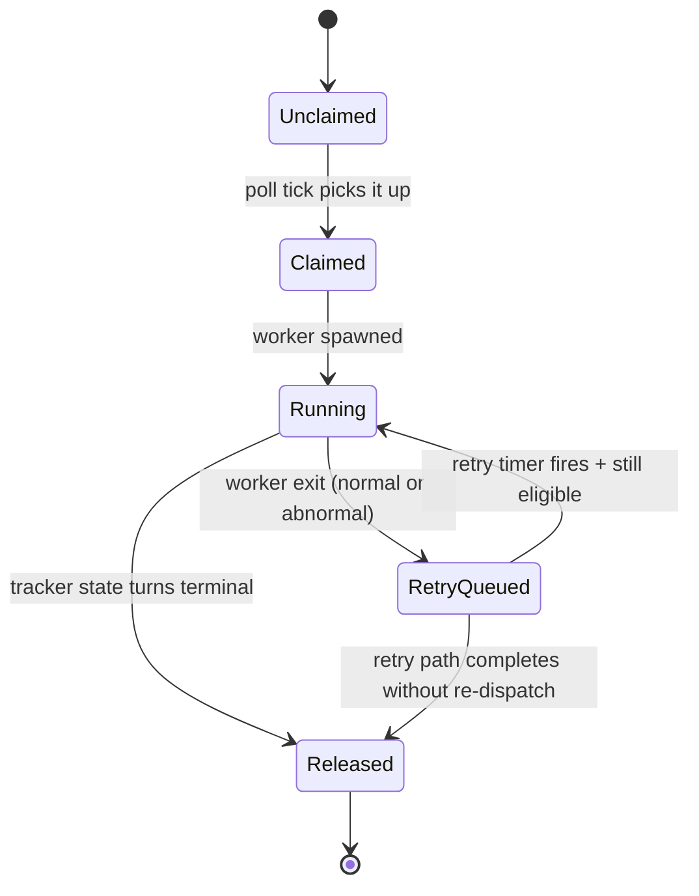

# Symphony — Profile

A profile of Symphony as it lives in this study (`studies/open-specs-and-standards/symphony/`). Cites pinned paths so you can jump to source rather than trust paraphrase. Read alongside the other profiles in this study — Symphony is structurally different from all of them: a **specification for a service**, written by OpenAI, that turns an issue tracker into the work queue for a fleet of coding agents.

## TL;DR

Symphony is **a normative service specification** (`SPEC.md`, 2169 lines, RFC-2119 keywords throughout — `SPEC.md:8-10`) plus a reference implementation in Elixir (`elixir/`) for a long-running daemon that turns an issue tracker into a queue of work for coding agents. The thesis (`README.md:3-4`):

> Symphony turns project work into isolated, autonomous implementation runs, allowing teams to manage work instead of supervising coding agents.

What it does (`SPEC.md:18-29`):

> Symphony is a long-running automation service that continuously reads work from an issue tracker (Linear in this specification version), creates an isolated workspace for each issue, and runs a coding agent session for that issue inside the workspace.

The four operational problems it solves:

1. **Turns issue execution into a repeatable daemon workflow** instead of manual scripts.
2. **Isolates agent execution in per-issue workspaces** so commands run only inside per-issue directories.
3. **Keeps the workflow policy in-repo** (`WORKFLOW.md`) so teams version the agent prompt and runtime settings with their code.
4. **Provides enough observability** to operate and debug multiple concurrent agent runs.

It is **not** a coding agent itself — it dispatches OpenAI Codex (in `app-server` mode) into workspaces and gets out of the way. Ticket writes (state transitions, comments, PR links) are typically performed by the agent using its own tools, not by Symphony (`SPEC.md:36-42`).

The README is explicit about how the spec is intended to be consumed (`README.md:21-27`):

> ### Option 1. Make your own
>
> Tell your favorite coding agent to build Symphony in a programming language of your choice:
>
> > Implement Symphony according to the following spec:
> > https://github.com/openai/symphony/blob/main/SPEC.md

That is the load-bearing framing: the spec is written *to be implemented by a coding agent*. Section 6.4 (`SPEC.md:567-571`) calls this out explicitly:

> This section is intentionally redundant so a coding agent can implement the config layer quickly.

If OpenSpec/Spec Kit/GSD/AGENTS.md govern how a developer drives an AI assistant on a single feature, A2A governs how agents talk to each other on the wire, and 12-Factor Agents governs how you architect agents — Symphony governs **how you take the developer out of the loop entirely** by wiring the issue tracker directly to a fleet of coding agents.

> [!WARNING]
> The README labels Symphony "a low-key engineering preview for testing in trusted environments" (`README.md:11`). Read the spec and reference impl with that posture; the safety invariants in §9.5 are real but the production-grade hardening is *your* job.

## Why a service spec instead of a tool?

Most artifacts in this study are *tools* (OpenSpec CLI, Spec Kit CLI, GSD installer) or *file conventions* (AGENTS.md). Symphony's published artifact is a **service specification** — a 2169-line RFC-2119 document that you implement. Three structural reasons:

### 1. The spec is the product

The Elixir implementation in `elixir/` is labeled "prototype software intended for evaluation only … presented as-is. We recommend implementing your own hardened version based on `SPEC.md`" (`elixir/README.md:6-9`). OpenAI is publishing the *idea* and a *reference*, not the production runtime.

This makes Symphony genuinely portable across stacks. The eight numbered components (`SPEC.md:73-113`) — Workflow Loader, Config Layer, Issue Tracker Client, Orchestrator, Workspace Manager, Agent Runner, Status Surface, Logging — are implementable in any language with subprocess control and HTTP. The spec is structured in six abstraction layers (`SPEC.md:118-136`) precisely to make porting easy: Policy / Configuration / Coordination / Execution / Integration / Observability.

### 2. The spec is written for a coding agent to implement

Multiple sections explicitly note their redundancy is for AI implementers — Section 6.4 ("Core Config Fields Summary (Cheat Sheet) — intentionally redundant so a coding agent can implement the config layer quickly", `SPEC.md:567-571`), Section 18 ("Implementation Checklist (Definition of Done)", `SPEC.md:2068-2092`). The spec is doing for service specifications what AGENTS.md does for repo conventions: optimizing for an LLM reader, not just a human reader.

### 3. The spec is in-repo policy, not central runtime config

The spec's most-emphasized design choice is `WORKFLOW.md`: a per-repository file with YAML front matter (config) + Markdown body (the agent's prompt template). It lives in the repo, gets versioned with the code, and is the single source of truth for how Symphony should behave for that project (`SPEC.md:301-302`):

> The workflow file is expected to be repository-owned and version-controlled.

Combined with mandatory dynamic reload (`SPEC.md:524-533`) — the daemon **MUST** detect `WORKFLOW.md` changes and re-apply config without restart — this means *changing how your agents work is a commit*, not a deploy. That's the inversion that makes Symphony a coherent ops model.

## The four primitives

You can grok the architecture from four entities and the lifecycle that connects them.

### 1. `WORKFLOW.md` — the repository contract

`SPEC.md:289-481`. A Markdown file with optional YAML front matter:

```markdown
---
tracker:
  kind: linear
  project_slug: "my-project-abc"
  active_states: [Todo, "In Progress"]
  terminal_states: [Done, Cancelled]
polling: { interval_ms: 30000 }
workspace: { root: ~/code/symphony-workspaces }
hooks:
  after_create: |
    git clone --depth 1 https://github.com/myorg/myrepo .
agent:
  max_concurrent_agents: 10
  max_turns: 20
codex:
  command: codex app-server
  approval_policy: never
  thread_sandbox: workspace-write
---

You are working on a Linear ticket {{ issue.identifier }}.

Issue context:
Title: {{ issue.title }}
Description: {{ issue.description }}

Instructions:
1. This is an unattended orchestration session. Never ask a human for follow-up.
2. ...
```

Two things load-bearing:

- **Front matter is the typed config.** Six top-level keys: `tracker`, `polling`, `workspace`, `hooks`, `agent`, `codex` (`SPEC.md:328-337`). Unknown keys are ignored for forward compatibility. Extensions may add top-level keys without changing the core schema.
- **Body is a strict template.** The Markdown body is the per-issue prompt template, rendered with Liquid-compatible semantics (`SPEC.md:457-466`). **Unknown variables MUST fail rendering. Unknown filters MUST fail rendering.** Template inputs are `issue` (full normalized issue record) and `attempt` (null on first run, integer on retry).

Look at `elixir/WORKFLOW.md:1-37` for the canonical example: it shows `after_create` hook cloning the Symphony repo itself (Symphony is dogfooded), a Codex command with `gpt-5.5`-class model + `xhigh` reasoning, and `approval_policy: never` for fully unattended runs.

### 2. `Issue` — the work item

`SPEC.md:148-177`. Normalized record fetched from the tracker:

```text
id              -- stable tracker-internal ID (used as map key)
identifier      -- human-readable ("ABC-123")
title, description
priority        -- lower = higher priority in dispatch sort
state           -- normalized lowercase
branch_name     -- if tracker provides
url, labels, blocked_by, created_at, updated_at
```

The protocol distinguishes:
- **`Issue ID`** for tracker lookups and internal map keys.
- **`Issue Identifier`** for human-readable logs and workspace naming.
- **`Workspace Key`** = sanitized `identifier` (any character not in `[A-Za-z0-9._-]` replaced with `_`).
- **`Normalized Issue State`** — compared after `lowercase`.

Linear is the only tracker spec'd in v1 (`tracker.kind: linear`, `SPEC.md:350-352`), but the abstraction is clean enough that adapters for GitHub Issues, Jira, etc., are explicitly listed as extension targets (`SPEC.md:2100`).

### 3. `Workspace` — the per-issue isolation boundary

`SPEC.md:201-210`, `SPEC.md:810-899`. One filesystem directory per issue:

```
<workspace.root>/<sanitized_issue_identifier>/
```

The two **safety invariants** are the most important portability constraints in the entire spec (`SPEC.md:886-899`):

> **Invariant 1:** Run the coding agent only in the per-issue workspace path. Before launching the coding-agent subprocess, validate `cwd == workspace_path`.
>
> **Invariant 2:** Workspace path MUST stay inside workspace root. Normalize both paths to absolute. Require `workspace_path` to have `workspace_root` as a prefix directory. Reject any path outside the workspace root.

These two checks are what makes "let an agent loose to run shell commands" tractable. Combined with Codex's own sandbox (`codex.thread_sandbox`, `codex.turn_sandbox_policy`), they're a defense-in-depth posture.

Workspaces persist across runs by default (`SPEC.md:824`); successful runs do not auto-delete. This lets continuation runs pick up from the previous attempt's state rather than re-cloning every time.

Four lifecycle hooks (`SPEC.md:384-406`, `SPEC.md:863-884`):

| Hook | When | Failure semantics |
|------|------|-------------------|
| `after_create` | Workspace newly created | **Fatal** — aborts workspace creation |
| `before_run` | Before each agent attempt | **Fatal** — aborts current attempt |
| `after_run` | After each agent attempt (any outcome) | Logged and ignored |
| `before_remove` | Before workspace deletion | Logged and ignored; cleanup proceeds |

Default hook timeout: `60000` ms. The `after_create` hook is where you typically `git clone` your repo into the workspace.

### 4. `Run Attempt` — the state machine

`SPEC.md:213-223`, `SPEC.md:639-654`. Each attempt walks through eleven explicit phases:

1. `PreparingWorkspace`
2. `BuildingPrompt`
3. `LaunchingAgentProcess`
4. `InitializingSession`
5. `StreamingTurn`
6. `Finishing`
7. `Succeeded` *(terminal)*
8. `Failed` *(terminal)*
9. `TimedOut` *(terminal)*
10. `Stalled` *(terminal)*
11. `CanceledByReconciliation` *(terminal)*

Distinct terminal reasons matter because retry logic and logs differ (`SPEC.md:655`).

Above the run-attempt machine sits the **issue orchestration state machine** (`SPEC.md:603-625`):



The crucial nuance (`SPEC.md:625-637`): **a successful worker exit does not mean the issue is done forever.** A worker may run multiple back-to-back Codex turns within its lifetime (capped at `agent.max_turns`, default 20). After each turn, the worker re-checks the tracker. If still active, it starts another turn on the *same live thread* in the *same workspace* — sending only continuation guidance, not the full original prompt. After worker exit, the orchestrator schedules a 1-second continuation retry to re-check whether the issue still needs work.

This is why "the agent finished" and "the ticket is done" are decoupled: only a tracker state change ends Symphony's interest in an issue.

## The orchestration loop

`SPEC.md:696-808`. Every poll tick (default `30000` ms, `5000` ms in the reference workflow):

1. **Reconcile running issues.** Two-part reconciliation:
   - **Stall detection** (`SPEC.md:783-789`). For each running issue, compute `elapsed_ms` since the last Codex event (or `started_at` if no event yet). If it exceeds `codex.stall_timeout_ms` (default `300000` / 5 minutes), terminate the worker and queue a retry.
   - **Tracker state refresh** (`SPEC.md:791-798`). Fetch current state for every running issue. If terminal → terminate worker + clean workspace. If still active → update snapshot. If neither → terminate without cleanup.
2. **Dispatch preflight validation.** `SPEC.md:553-565`. Check workflow file parses, `tracker.kind` is supported, `tracker.api_key` resolves to non-empty, project_slug exists when required, `codex.command` is non-empty. Failure: skip dispatch this tick, keep reconciliation, emit operator-visible error. Don't crash.
3. **Fetch candidate issues.** Tracker query for issues in `active_states`.
4. **Sort by dispatch priority.** (a) `priority` ascending, (b) `created_at` oldest first, (c) `identifier` lexicographic tie-breaker (`SPEC.md:730-733`).
5. **Dispatch eligible issues until slots are exhausted.** Eligibility (`SPEC.md:719-727`):
   - Has `id`, `identifier`, `title`, `state`.
   - State in `active_states`, not in `terminal_states`.
   - Not already in `running` or `claimed`.
   - Global concurrency slots available (`max_concurrent_agents`, default 10).
   - Per-state concurrency slots available (`max_concurrent_agents_by_state`).
   - **Blocker rule:** If state is `Todo`, do not dispatch when any blocker is non-terminal.
6. **Notify observability.**

### Retry and backoff

`SPEC.md:749-771`. Two backoff curves:

- **Continuation retry after clean worker exit:** fixed `1000` ms.
- **Failure-driven retry:** `delay = min(10000 * 2^(attempt - 1), agent.max_retry_backoff_ms)` — exponential backoff capped at `300000` ms (5 minutes) by default.

A retry timer fires → re-fetch active candidates → look up the specific issue by `issue_id` → dispatch if still eligible and slots available, else release claim.

### Recovery

The orchestrator state is **in-memory only** (`SPEC.md:48-56`):

> Support tracker/filesystem-driven restart recovery without requiring a persistent database; exact in-memory scheduler state is not restored.

Restart recovery is **tracker-driven** (re-poll, re-claim) and **filesystem-driven** (workspaces are preserved across runs and indexed by sanitized identifier). On startup, Symphony queries the tracker for issues in terminal states and removes their workspaces (`SPEC.md:800-808`) — preventing stale workspace accumulation.

This is a deliberate simplification: no Postgres, no Redis, no durable queue. The tracker is the source of truth for *what work exists*; the filesystem is the source of truth for *what work has happened*.

## Codex as the agent (and the soft coupling)

The spec is mostly agent-agnostic, but one component is Codex-specific: the `codex.*` config block (`SPEC.md:427-455`) and the agent-runner subprocess protocol (`SPEC.md:101-106`):

- `codex.command` — default `codex app-server`. Launched via `bash -lc` in the workspace.
- `codex.approval_policy` / `thread_sandbox` / `turn_sandbox_policy` — **pass-through values** whose enums are owned by Codex itself, not Symphony. The spec explicitly says (`SPEC.md:430-437`): inspect via `codex app-server generate-json-schema` rather than relying on a hand-maintained enum.
- `codex.turn_timeout_ms` (default `3600000` / 1h), `codex.read_timeout_ms` (default `5000`), `codex.stall_timeout_ms` (default `300000` / 5m).

The Agent Runner launches the Codex app-server as a subprocess, speaks a JSON-line protocol over stdio, and translates Codex events (turn starts, token counters, rate limits, errors) into orchestrator state updates. Live session metadata (`LiveSession`, `SPEC.md:225-245`) tracks `session_id = <thread_id>-<turn_id>`, PID, last event/timestamp/message, token counters (input/output/total + last reported), and `turn_count`.

In principle the protocol is replaceable. In practice, Symphony v1 ships with Codex assumed.

## What's actually inside this submodule

```text
symphony/
├── README.md                       # 41 lines — pitch, two paths to use it
├── SPEC.md                         # 2169 lines — the normative source of truth
├── NOTICE                          # Apache 2.0 + © 2025 OpenAI
├── LICENSE
└── elixir/                         # Reference implementation
    ├── README.md                   # Setup + run instructions
    ├── WORKFLOW.md                 # Canonical example workflow (used to develop Symphony itself)
    ├── AGENTS.md                   # Agent-facing instructions for THIS repo's contributors
    ├── mix.exs, mix.lock           # Elixir package manifest
    ├── mise.toml                   # Erlang/Elixir version manager config
    ├── Makefile
    ├── lib/                        # Elixir/OTP implementation
    ├── test/
    ├── config/
    ├── priv/                       # Static assets (Phoenix observability optional UI)
    └── docs/
```

If you only have time for three files: `SPEC.md` end-to-end (it is the canonical artifact), `elixir/WORKFLOW.md` as a worked example, and `README.md` for the framing.

The Elixir implementation is OTP-style — supervised processes, GenServers for orchestrator state, a Phoenix-based optional observability surface (`elixir/README.md:81`). It's a good idiomatic reference if you're porting to another concurrent runtime (Go's goroutines, Rust's tokio, Erlang/OTP itself), but per the warning at `elixir/README.md:6-9` it's not what OpenAI runs in production.

## How to get started

### Option A — implement it from the spec (the recommended path)

`README.md:21-27`. Hand the spec to a coding agent and ask it to build the implementation in your language of choice:

```text
Implement Symphony according to the following spec:
https://github.com/openai/symphony/blob/main/SPEC.md
```

The spec's redundancy and explicit Section 18 implementation checklist (`SPEC.md:2068-2092`) are designed for this workflow. The minimum required surface for **Core Conformance** (§18.1):

- Workflow path selection (explicit + cwd default)
- `WORKFLOW.md` loader with YAML front matter + prompt body split
- Typed config layer with defaults and `$VAR` resolution
- **Dynamic `WORKFLOW.md` watch/reload/re-apply** for both config and prompt
- Polling orchestrator with single-authority mutable state
- Issue tracker client (Linear) with candidate / state-refresh / terminal fetch
- Workspace manager with sanitized per-issue workspaces
- All four workspace lifecycle hooks
- Codex app-server subprocess client speaking JSON-line protocol
- Strict Liquid-compatible prompt rendering with `issue` + `attempt` variables
- Exponential retry queue with continuation retries after normal exit
- Reconciliation that stops runs on terminal/non-active tracker states
- Workspace cleanup for terminal issues (startup sweep + active transition)
- Structured logs with `issue_id`, `issue_identifier`, `session_id`

### Option B — run the Elixir reference

`README.md:28-36`, `elixir/README.md:46-66`:

```bash
# Prereqs: mise, Linear API key, harness-engineered codebase
git clone https://github.com/openai/symphony
cd symphony/elixir
mise trust
mise install
mise exec -- mix setup
mise exec -- mix build
mise exec -- ./bin/symphony ./WORKFLOW.md
```

The Elixir impl uses `mise` to manage Erlang/Elixir versions, requires a Linear personal API key as `LINEAR_API_KEY`, and expects a copy of `WORKFLOW.md` at the path you provide.

### Either way — set up your repo

Symphony works best on codebases that have adopted *harness engineering* (`README.md:17-19`) — a term OpenAI has its own write-up for. Concretely that means: deterministic build, tests that an agent can run unattended, lint/format that fail loudly on regression, and (in the canonical workflow) a Linear board with the agreed-upon states. The reference `WORKFLOW.md` adds custom Linear states `Rework`, `Human Review`, and `Merging` to the defaults (`elixir/README.md:42-44`).

## Mental model for using it well

- **The tracker is the queue.** Don't try to inject work via APIs or files — file a Linear issue, watch Symphony pick it up. This is the inversion that makes the model coherent.
- **`WORKFLOW.md` is policy, not config.** It encodes "what does success mean for this project" via the prompt body, plus the runtime knobs needed to enforce it. Treat changes to it like merging a change to your CI config — review, version, ship together with code.
- **Workspaces are persistent state.** A workspace from a previous attempt is a feature, not a leak. Continuation turns assume the workspace exists. Don't write hooks that wipe state on `before_run` unless you mean it.
- **Two safety invariants are the whole game.** §9.5: agent runs only in workspace path; workspace path stays inside workspace root. Encode both as explicit checks in your runner. Defense in depth: also rely on Codex's `thread_sandbox` and `turn_sandbox_policy`.
- **Continuation retries are not failure retries.** A clean worker exit followed by a 1-second continuation retry is the *normal* path for a long-running ticket. Backoff is only for failures. Logging and alerts should distinguish the two.
- **Stall detection is more important than timeouts.** Codex turns can legitimately run for an hour (default `turn_timeout_ms = 3600000`). What you actually want to detect is *no events flowing* — that's `stall_timeout_ms`. Tune it down if you have shorter expected turn cadence.
- **Dispatch validation should never crash the daemon.** Per-tick failures skip dispatch but keep reconciliation. The orchestrator runs forever; a bad `WORKFLOW.md` edit shouldn't take down the supervisor.
- **Keep `max_turns` finite and generous.** 20 is the default. Higher means longer continuation chains; lower forces the orchestrator to schedule new workers more often. The trade-off is "live thread context" vs. "fresh agent context."
- **`max_concurrent_agents_by_state` is a load-shedding lever.** You probably don't want 10 agents simultaneously in `Merging` — that's where collisions happen. Per-state caps let you pinch points where conflicts cluster.

## When NOT to reach for this

- **You don't have a tracker, or you don't want one to be authoritative.** Symphony's whole control loop is "tracker says active → run agent; tracker says terminal → stop." If you don't have Linear (or, eventually, an adapter for your tracker) being the source of truth for work, the model doesn't fit.
- **You need supervised, interactive coding sessions.** Symphony's intended posture is unattended (`elixir/WORKFLOW.md:67`: *"This is an unattended orchestration session. Never ask a human to perform follow-up actions"*). For human-in-the-loop pair programming, this is the wrong shape.
- **You're not on Codex.** v1 of the spec hard-codes Codex app-server's stdio protocol, sandbox policies, and event schema. The spec is structured for agent pluggability but the v1 conformance bar is Codex.
- **You can't tolerate "preview" software in your delivery loop.** The README's own warning (`README.md:11`) is explicit: *"Symphony is a low-key engineering preview for testing in trusted environments."* If a stuck agent or a rogue git operation would be career-ending, this is too early.
- **You want approvals, audit logs, or RBAC.** The spec mentions implementations targeting "trusted environments with a high-trust configuration" (`SPEC.md:33-34`). Approval policies, sandboxing strength, and operator confirmation are explicit non-goals in v1 — you build them on top.
- **You can't expose the tracker API surface to the daemon.** Symphony's process needs a Linear API key with broad read access (and the agent needs writes via Linear MCP or `linear_graphql`). If your security model can't extend that trust, the architecture doesn't fit.

## Symphony vs. the other six profiles — the honest comparison

Symphony lives at a different layer of the AI-assisted-development stack than every other artifact in this study. Below the row labeled "Layer," each profile describes what kind of artifact it is and what surface it constrains.

| Axis | Symphony | A2A | AGENTS.md | OpenSpec | Spec Kit | GSD | 12-Factor Agents |
|------|----------|-----|-----------|----------|----------|-----|------------------|
| **What it is** | Service spec + Elixir reference impl | Wire protocol | File convention | Markdown convention + CLI | Methodology + Python CLI | Multi-runtime installer + commands | Manifesto / principles |
| **Layer** | Operations — long-running daemon over a fleet of agents | Network — agent ↔ agent | Repo — context for the AI editing your code | Repo — feature specs | Repo — feature specs + phase gates | Repo — orchestrated build | App architecture |
| **Audience** | Platform/devops teams running unattended agent fleets | Engineers building interoperable agentic services | Developers using AI assistants in a codebase | Developers using AI assistants | Developers using AI assistants | Solo / small-team builders | Engineers building agent products |
| **Primary artifact** | `WORKFLOW.md` + the daemon's filesystem of per-issue workspaces | Wire messages over HTTP | `AGENTS.md` at root + nested | `openspec/specs/` + `openspec/changes/` | `specs/NNN-feature/` | `.planning/` directory | 13 essays |
| **Maintainer** | OpenAI | Linux Foundation (donated by Google) | Linux Foundation (Agentic AI Foundation) | Fission AI | GitHub | TÂCHES / gsd-build | HumanLayer / Dex Horthy |
| **Toolchain** | Elixir reference; intended to be reimplemented | Five SDKs (Python/Go/JS/Java/.NET) + any HTTP client | None | Node/npm | Python (uv/pipx) | Node/npm + 16-runtime install | None |
| **Loop primitive** | Tracker poll → workspace → Codex app-server session | RPC: Task lifecycle states | None | `/opsx:propose → apply → archive` | `/speckit.constitution → specify → plan → tasks → implement` | `discuss → plan → execute → verify → ship` | The 4-step agent loop (LLM → tool → result → repeat) |
| **Trigger** | Issue state change in tracker | Inbound HTTP | Editing a file with an agent | Developer running a slash command | Developer running a slash command | Developer running a slash command | The application's own event source |
| **Human in the loop?** | Optional — handoff state like `Human Review` | Optional — `INPUT_REQUIRED` task state | Always — chat | Always — author specs, run commands | Always — author specs, run gates | Always — drives the loop | Whatever you build |

A productive way to think about how they fit together at the limit:

- A team runs **Symphony** as their delivery daemon.
- Each repo Symphony manages has an **AGENTS.md** at root telling the Codex agent how to build/test/lint.
- Each ticket Symphony picks up references a feature specced via **OpenSpec / Spec Kit / GSD**, depending on team preference, so the Codex agent has structured intent to implement against.
- The agent product Symphony spawns is itself architected per **12-Factor Agents** principles.
- If that agent needs to delegate sub-work to *another* agentic service (a research bot, a data agent, a deployment bot), it does so via **A2A**.

All seven plug together. None are substitutes; they occupy different layers.

## One-line summary

> Symphony wins by inverting the developer-vs-agent loop entirely: instead of a developer driving an AI assistant feature-by-feature, a long-running daemon polls Linear, spins up Codex sessions in isolated per-issue workspaces, and runs them to ticket completion — all governed by a single in-repo `WORKFLOW.md` whose YAML frontmatter sets policy and whose Markdown body is the prompt — and OpenAI ships it as a 2169-line normative spec written explicitly to be reimplemented by the very coding agents it's designed to orchestrate.
