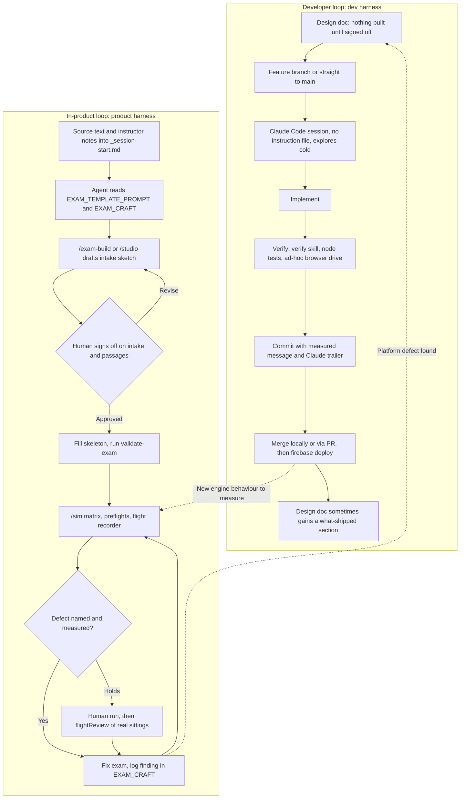

# Harness Evidence: dialogiq

Step 1 of 3. The plan is
[[Analyze-Harness-like-Evidence-in-Collaborator-Codebase]]
(`studies/context-v/plans/`). The method is in
[[Explore-Collaborator-Codebases-for-Insights-Comparative-Highlights]]
(`studies/context-v/explorations/`).

Every path below is relative to `dialogiq-codebase/` unless it says otherwise.
"Observed" means cited from a file or commit. "Inferred" means reasoned from
evidence, with the reasoning shown.

## 1. Snapshot

| | |
|---|---|
| Repo | `jdema-io/pub-interface` (private), mounted read-only at `studies/collaborations/dialogiq/dialogiq-codebase/` |
| SHA read | `eedd1353b6b765ec642d9762e255037c8adb8d8d` (detached; same as `origin/main`) |
| Last commit on `main` | 2026-10-01 15:44 +0200, "Merge pull request #8 from jdema-io/exams-25-minutes" |
| Commits | 280 reachable from HEAD; 284 across all refs; 263 non-merge |
| Remote branches | 25 (plus `origin/HEAD`). 24 are fully merged into `main`. One, `recorder-linux-mp4`, is 4 commits ahead (2026-10-02) |
| First commit | 2025-04-13, "Add files via upload" |
| Tracked files | 251 |

**What the system is.** Dialogiq is a spoken-dialogue platform for language
and discourse teaching. A teacher builds a *scenario*: a phased conversation
with an LLM interlocutor, with scoring criteria, guardrails and a final
assessment. Students speak to it through TTS and STT in the browser. The
current focus is **exam mode**, a proctored oral exam. Its first customer is a
university rhetorical-analysis course, with
five exams built from political speeches. Around exam mode the repo has grown
several things: integrity triage (speech rate, lexical jump, prosody,
cross-student similarity), invitation links, a teacher portal, an admin
console, an "exam studio" that generates exams, a `/sim` harness that plays
synthetic candidates against an exam, and a standalone presentation recorder
(`/record`). The stack is Firebase: static front end in `public/`, and an
Express API in `functions/` on Cloud Functions in `europe-west1` (`README.md`
lines 1–10).

**Size by top-level folder** (disk, excluding `node_modules`): `functions/`
36M (mostly installed deps and test fixtures), `public/` 9.5M,
`V2 Scenario Builder/` 1.5M, `docs/` 168K, `scripts/` 140K, `.claude/` 36K,
`Notes/` 12K.

## 2. Inventory table

Dates are the first and last commits touching the path (`git log --follow`).
Line counts are at the recorded SHA. **Layer** follows the plan's "Two
layers" rule and sorts by what the artifact is *for*:

- **dev** means it helps coding agents build the software.
- **product** means it shapes or checks what the product's own LLMs generate
  (exams, examiner turns, grades, reports).
- **both** gets a reason in the description.

Rows are grouped by layer.

**Count: 22 dev (3 of them absences: instruction file, CI, changelog), 4 both, 32 product. That is 58 rows.**

| Layer | Category | Path | Lines | First | Last | Description |
|---|---|---|---|---|---|---|
| dev | Instruction set | *(none)* | — | — | — | No `CLAUDE.md`, `AGENTS.md`, `GEMINI.md`, `.cursorrules`, or `.github/copilot-instructions.md` anywhere in the tree or its history |
| dev | Harness config | `.claude/settings.json` | 223 | 2026-08-20 | 2026-08-20 | Permission allowlist only, about 210 `allow` entries built up from click-approvals. No `deny`, no hooks, no MCP |
| dev | Skill | `.claude/skills/verify/SKILL.md` | 91 | 2026-08-20 | 2026-08-20 | How to start Firebase emulators safely and hit real routes with a minted auth token |
| dev | Context | `README.md` | 173 | 2026-10-01 | 2026-10-01 | Deploy line, then almost entirely the `/record` recorder |
| dev | Memory (to-do) | `TODO.md` | 21 | 2026-07-14 | 2026-07-18 | Deferred bugs from the V1 removal; not touched since 2026-07-18 |
| dev | Scratch | `Notes/` (2 `.rtf` files) | 83 | 2025-04-13 | 2026-07-18 | Pasted config advice and a one-line `.env` toggle recipe |
| dev | Plan | `V2 Scenario Builder/SCENARIO_SIMULATOR_ACTION_PLAN.md` | 358 | 2026-02-26 | 2026-02-26 | Phased build plan for the simulator, ends "Begin with Phase 1.1" |
| dev | Summary | `V2 Scenario Builder/UI_MODERNIZATION_SUMMARY.md` | 238 | 2026-02-26 | 2026-02-26 | After-action UI summary ("inspired by Claude's interface") |
| dev | Summary | `V2 Scenario Builder/VISUAL_CHANGES.md` | 283 | 2026-02-26 | 2026-02-26 | Before/after reference for the same UI pass |
| dev | Spec / measurement | `docs/exam-integrity-sprint2-b1-b4-measurement-design.md` | 586 | 2026-07-31 | 2026-07-31 | Prosody and lexical-jump measurement design, claims tagged `[EST]`/`[EXT]`/`[ASSERT]`. Mostly deterministic signals, so it is a build spec |
| dev | Spec / measurement | `docs/exam-integrity-sprint2lite-speechrate-lexical.md` | 354 | 2026-07-27 | 2026-07-27 | Sprint 2-lite design, with a dated "Update (built)" header |
| dev | Spec | `docs/exam-checkin-flow.md` | 202 | 2026-07-27 | 2026-07-27 | "Design doc for review. Nothing gets built until this is signed off." |
| dev | Reference | `docs/EXAM_PRIVACY.md` | 53 | 2026-07-18 | 2026-07-18 | GDPR-facing data-handling summary for exam mode |
| dev | Reference | `docs/invitations.md` | 78 | 2026-07-25 | 2026-07-25 | Feature doc with a code map |
| dev | Reference | `docs/tts-providers.md` | 108 | 2026-07-19 | 2026-07-19 | Feature doc ending in a "Files changed" list |
| dev | Verification | `docs/record-test-checklist.md` | 197 | 2026-10-01 | 2026-10-01 | Manual device and browser checklist for `/record` (no LLM in that feature) |
| dev | Verification | `scripts/check-deploy-drift.sh` | 75 | 2026-08-20 | 2026-08-20 | SHA-256 compares live hosting files against a git ref |
| dev | Stack | `functions/package.json` | 37 | 2025-04-13 | 2026-10-01 | Node 22, Express 5, `@anthropic-ai/sdk`, the chained test script |
| dev | Stack | `functions/.eslintrc.js` | 66 | 2025-04-13 | 2026-09-12 | Lint config ("a config that catches mistakes, and the 40 it found") |
| dev | Stack | `firebase.json` | 126 | 2025-04-13 | 2026-10-01 | Hosting, rewrites, per-route security headers, emulator ports |
| dev | CI | *(none)* | — | — | — | No `.github/` and no pipeline config |
| dev | Changelog | *(none)* | — | — | — | No changelog or decision log; git messages fill the role (§3.6) |
| both | Spec / architecture | `docs/exam-generator-architecture.md` | 1314 | 2026-09-07 | 2026-09-12 | Design for the exam studio, with "what shipped" sections 14–18. **Both:** a build spec with a "Start here in a fresh session" for coding agents (dev), and the design of the product's generation pipeline and its model routing (product) |
| both | Context (session kickoff) | `V2 Scenario Builder/exams/_session-start.md` | 47 | 2026-08-28 | 2026-09-10 | Paste-in opening prompt for an exam-building session. **Both:** mainly starts exam generation (product), but also carries platform deploy TODOs between sessions (dev handoff) |
| both | Verification | `functions/test/` (32 `*.test.js`, fixtures) | dir | 2026-07-19 | 2026-10-01 | Dependency-free Node tests; 27 chained in `npm test`; 54 commits. **Both:** half test the platform (`tts`, `connection`, `scenarioFolders`), half test the product's LLM machinery (`handoff`, `ladderHandoff`, `examStudio`, `simParity`, `flightReview`) |
| both | Verification | `functions/test/fixtures/README.md` | 34 | 2026-09-12 | 2026-09-12 | Why a frozen exam copy is used. **Both:** it exists to keep product content edits from breaking dev tests ("exam-craft edits must never break platform tests") |
| product | Command | `.claude/commands/exam-build.md` | 83 | 2026-08-28 | 2026-08-28 | `/exam-build <slug>`: generates an exam from a speech, with two human sign-off stops. A Claude Code command, but its output is product content |
| product | Rulebook | `V2 Scenario Builder/EXAM_TEMPLATE_PROMPT.md` | 381 | 2026-08-20 | 2026-10-01 | Instructor profile, ladder, branch, handoff and rubric authoring rules; how to read a sim matrix |
| product | Craft ledger | `V2 Scenario Builder/EXAM_CRAFT.md` | 2163 | 2026-09-10 | 2026-10-01 | Numbered, ID-stable findings (I/S/Q/R/B/P/M) plus a per-build log; 17 commits |
| product | Rulebook | `V2 Scenario Builder/DIALOGIQ_PEDAGOGY_REFERENCE.md` | 219 | 2026-02-26 | 2026-07-17 | "Should be included in any AI analysis of scenarios" |
| product | Output form | `V2 Scenario Builder/exams/_intake-template.md` | 102 | 2026-08-28 | 2026-08-28 | Per-speech intake form the agent fills and the human reviews |
| product | Output skeleton | `V2 Scenario Builder/exams/_template.json` | 544 | 2026-08-28 | 2026-10-01 | Exam skeleton with `<<SLOT>>` markers; structure is copied, never regenerated |
| product | Output (filled) | `V2 Scenario Builder/exams/mamdani/intake.md` | 283 | 2026-08-28 | 2026-08-28 | Worked intake sheet |
| product | Output (filled) | `V2 Scenario Builder/exams/aydemir/intake.md` | 448 | 2026-09-15 | 2026-09-15 | Worked intake sheet |
| product | Output (filled) | `V2 Scenario Builder/exams/dirty-rats/intake.md` | 308 | 2026-10-01 | 2026-10-01 | Intake with passages "still awaiting sign-off" |
| product | Output skeleton | `functions/lib/examShapes/rhetorical-5.json` | 246 | 2026-09-07 | 2026-10-01 | The studio's generated "shape" (parts model) |
| product | Generator | `scripts/build-exam-shapes.js` | 305 | 2026-09-07 | 2026-09-08 | Derives shape files from shipped exams |
| product | Generator | `functions/lib/examSketch.js` | 734 | 2026-09-07 | 2026-09-08 | Sketch schema and the two sign-off gates; "the scenario JSON is DERIVED" (header) |
| product | Generator | `functions/lib/examAssemble.js` | 213 | 2026-09-07 | 2026-09-08 | Deterministic assembler from sketch to exam JSON |
| product | Generator | `functions/routes/studio.js` | 679 | 2026-09-07 | 2026-09-12 | `/studio` API: the `/exam-build` flow as a teacher-facing feature |
| product | Runtime prompts | `public/js/09-prompts.js` | 1050 | 2026-07-17 | 2026-10-01 | Examiner and interlocutor prompt builders |
| product | Runtime prompts | `public/js/13-v2-conversation.js` | 2660 | 2026-07-17 | 2026-10-01 | Phase conductor, including `buildLadderDirective` (line 1171) |
| product | Runtime prompts | `public/js/22-handoff.js` | 368 | 2026-10-01 | 2026-10-01 | Handoff-phrase chooser prompt |
| product | Runtime prompts | `functions/lib/assessment.js` | 659 | 2026-07-17 | 2026-10-01 | Final grading prompt, three-pass averaged |
| product | Model routing | `functions/lib/llm.js`, `functions/lib/config.js` | 637 / 231 | 2026-07-17 | 2026-09-15 | Per-role provider routing and failover for the product's LLMs, with Firestore override |
| product | Validator | `scripts/validate-exam.js` → `functions/lib/examValidate.js` | 69 / 409 | 2026-08-28 | 2026-10-01 | Structural gate for exam JSON, shared by CLI and server |
| product | Ledger check | `scripts/check-craft-index.js` | 95 | 2026-09-15 | 2026-09-15 | Keeps `EXAM_CRAFT.md`'s index in sync with its headings; part of `npm test` |
| product | Evaluation | `scripts/handoff-preflight.js` | 320 | 2026-10-01 | 2026-10-01 | Runs the shipped handoff prompt against real Gemini, N passes |
| product | Evaluation | `scripts/profile-preflight.js` | 350 | 2026-09-14 | 2026-09-14 | Checks a synthetic candidate actually plays its brief; 8 commits in one day |
| product | Evaluation | `scripts/gate-replay.js` | 370 | 2026-09-13 | 2026-09-13 | Measures run-to-run reliability of the ladder gate |
| product | Evaluation | `scripts/reask-audit.js` | 126 | 2026-10-01 | 2026-10-01 | Audits examiner re-asks for verbatim repeats, pushback, restating |
| product | Evaluation | `scripts/check-rubric-gates.js` | 75 | 2026-09-14 | 2026-09-14 | Checks the grader actually opened each comment with a quotation |
| product | Simulation | `public/js/sim/` (`driver.js`, `dryrun.js`, `meter.js`) | dir | 2026-08-25 | 2026-10-01 | The `/sim` synthetic-candidate harness, LLM judge, and cost meter |
| product | Simulation | `public/sim/profiles.json` | 324 | 2026-08-25 | 2026-09-14 | Tiered candidate personas with target bands and status; 19 commits |
| product | Run memory | `public/js/20-flight-recorder.js` | 284 | 2026-08-23 | 2026-10-01 | Client half of the flight recorder: per-turn record of every LLM decision |
| product | Run memory | `functions/lib/flightReport.js` | 135 | 2026-10-01 | 2026-10-01 | Stores a flight report for every exam in Cloud Storage |
| product | Evaluation | `functions/lib/flightReview.js` | 484 | 2026-10-01 | 2026-10-01 | LLM review of a real exam for the teacher, adapted from the sim's judge prompt |
| product | Generator UI | `public/studio.html` | 1796 | 2026-09-07 | 2026-09-12 | Teacher UI for the studio: the `/exam-build` flow as a product screen |

## 3. Category findings

### 3.1 Instruction sets: absent as files, present as domain prompts

*Layer note:* the dev layer has no instruction file. Every instruction chain listed below is product: it tells an agent how to generate exams. The one exception is the architecture doc's §13, which is dev.

**Absent.** There is no `CLAUDE.md`, `AGENTS.md`, `GEMINI.md`, `.cursorrules`,
`.cursor/`, `.windsurfrules`, or `.github/copilot-instructions.md`, at any
depth or in any commit (`git log --all --name-only`). No file tells an agent
how to behave in the repo as a whole.

**What does the job instead.** Agent instructions are scoped to one workflow,
exam building, and spread across a small chain of files that point at each
other:

- `V2 Scenario Builder/exams/_session-start.md` is a paste-in opening prompt.
  It names the files to read "before doing anything; they carry the detail and
  they are more current than anything you might infer" (lines 4–5), then says
  "run `/exam-build <slug>` and follow it" (line 16).
- `V2 Scenario Builder/EXAM_TEMPLATE_PROMPT.md` is the rulebook. It names
  itself the single source of truth for the instructor's position: "When he
  gives further feedback, revise this section, not individual exams: it's the
  single source of truth" (lines 30–31).
- `docs/exam-generator-architecture.md` §13 "Start here in a fresh session"
  (lines 536–551) lists four files to read first and routes work by model:
  "Run the session on **Opus 5** for anything that sets an invariant … Volume
  work that follows an existing pattern … is Sonnet 5 work."
- `V2 Scenario Builder/DIALOGIQ_PEDAGOGY_REFERENCE.md` line 3: "It should be
  included in any AI analysis of scenarios."

**Layering and contradictions.** The layering is explicit and dated.
`EXAM_TEMPLATE_PROMPT.md` holds instructor-specific rules, and
`EXAM_CRAFT.md` holds cross-instructor findings ("Where a finding here refines
something there, it says so", lines 9–12). One live contradiction:
`_session-start.md` and `/exam-build` point to `_template.json` as the
skeleton. The latest build log says the newest exam was built "from
`exams/aydemir/exam.json` rather than `_template.json`, because the template
still lags the shipped papers" (`EXAM_CRAFT.md` lines 2144–2146).

### 3.2 Harness configuration: Claude Code only, permissions only

*Layer note:* this is all dev. The product's own model configuration lives in Firestore and `functions/lib/config.js`, not here (§3.9).

- **One harness: Claude Code.** `.claude/` is the only harness directory. A
  Finder artifact `.claude/Icon\r` was committed on 2026-02-26 (commit
  `8a4da45`) and removed on 2026-07-18 (`c8b4e31`). That means a `.claude/`
  folder existed locally by February 2026, five months before the first
  `Co-Authored-By` trailer (inferred).
- **`.claude/settings.json` is an accumulated allowlist, not a curated
  policy.** It holds about 210 `permissions.allow` entries and
  `additionalDirectories: ["/tmp"]`. There is no `deny` list, no hooks, no
  `env`, no `model`, and no MCP configuration. The entries read as
  "always allow" clicks recorded during sessions. They include one-off greps
  with hard-coded line numbers (`awk 'NR<=7320 && /^function /…' public/script.js`),
  numbered throwaway diagnostics (`node diag.js` … `node diag8.js`), exact
  `git commit -m '…'` messages, and absolute paths on the author's Mac.
- **Broad grants in the list:** `Bash(git push *)`, `Bash(git checkout *)`,
  `Bash(git stash *)`, `Bash(firebase deploy *)`, `Bash(brew install *)`,
  `Bash(npm i *)`, `Bash(gh auth *)`, `Bash(git credential *)`,
  `Bash(gcloud auth *)`, plus curl calls against production
  `pub-interface.web.app` and the Identity Toolkit admin API.
- **Committed once, never updated.** The file has a single commit, `55cbd85`
  on 2026-08-20. Its message says `.claude/` got "project skills + permission
  allowlists (settings.json, settings.local.json, skills/verify)", but
  `settings.local.json` is not tracked at any SHA. Inferred: it stayed local,
  as Claude Code intends.
- **Tool fingerprints in the allowlist:** `Skill(run)` and `Skill(run:*)`,
  reads of `/private/tmp/claude-501/bundled-skills/2.1.197/**`, and scratchpad
  paths under `/private/tmp/claude-501/…/scratchpad/` used for Puppeteer and
  Playwright drives (`npx playwright *`, `node test_exam.js`,
  `node test_admin_ui.js`).
- **MCP: absent.** No `.mcp.json` and no MCP server named anywhere.

### 3.3 Skills and commands: one of each, both about workflow

*Layer note:* this split is one each. `verify` is dev. `/exam-build` is product: it runs in Claude Code, but what it produces is the product's content, and §14 of the architecture doc ports it into the product as `/studio`.

**`.claude/skills/verify/SKILL.md`** is about the **stack and workflow**. It
teaches five steps for verifying a backend change against real emulated
routes instead of "import-and-call" (frontmatter `description`):

1. Put a Java 21 JDK on `PATH`.
2. Start the emulators *with* `firestore` and `auth`. "`--only functions`
   alone leaves Firestore calls pointed at **production** — never do that
   when the change writes data" (lines 21–23).
3. Seed data through the Admin SDK, because `firestore.rules` deny everything.
4. Mint a throwaway ID token against the Auth emulator.
5. Call routes at the doubled `/api/api/` path, which it explains (lines 72–74).

It reads as a lesson an agent learned the hard way, written down so the next
session doesn't repeat it.

**`.claude/commands/exam-build.md`** is about the **domain and workflow**. It
sets `allowed-tools: Read, Write, Edit, Bash, Grep, Glob, WebFetch`, then
gives a strict reading order and seven steps (0–6) with two hard stops:

- Step 0 drafts `intake.md`, then "Hand the sheet to the user and **stop**"
  (line 34). Unverified claims are marked `[CHECK]`, open items
  `[STILL OPEN]`.
- Step 2 proposes three passages, then "**Stop after step 2 and get
  sign-off.** Passage selection is the pedagogical decision and is the
  user's to make" (lines 47–48).
- Step 4 runs `scripts/validate-exam.js --flow`.
- Step 6 puts the JSON on the clipboard with
  `LANG=en_US.UTF-8 pbcopy`. The reason is written into the command: bare
  `pbcopy` turns em dashes into mojibake, and the JSON stays valid, so
  nothing catches it.
- It closes with: "Do not deploy, commit, or import anything into the
  builder. The user does that."

**Absent:** no agents (`.claude/agents/`), no hooks, no other commands. No
skill is shared across repos; both are per-repo.

### 3.4 Context engineering

*Layer note:* the deliberate, agent-facing context is product (exam work). Dev context is the flat `docs/`, a stale `TODO.md`, and a README that covers one feature.

What an agent reads before work depends on the task:

- **Exam work** has a deliberate entry point: the
  `_session-start.md` → `EXAM_TEMPLATE_PROMPT.md` → `EXAM_CRAFT.md` →
  `/exam-build` chain above (observed).
- **Platform work** has no entry point. `README.md` (173 lines) gives one
  deploy line, then documents only the `/record` recorder (lines 11–173).
  Nothing maps `functions/routes/`, `functions/lib/`, or the 23 ordered
  `public/js/NN-*.js` files. The closest thing is the per-feature code maps
  in `docs/invitations.md` ("Code map", from line 53) and
  `docs/tts-providers.md` ("Files changed", from line 101).
- **Written for an agent rather than a human:** `_session-start.md`
  addresses the agent in the second person ("Two things about how I work").
  `EXAM_CRAFT.md` says its findings are meant to become rules the exam studio
  applies and checks "the revision loop" applies (lines 3–6), with IDs
  "meant to be cited" by lint rules (line 15). The architecture doc's §13 is
  addressed to "a fresh session". Several script headers explain *why* in
  long prose meant to stop a later editor, for example
  `scripts/check-deploy-drift.sh` lines 11–13: "so don't 'simplify' this
  back to $(curl ...)".
- **Scratch:** `Notes/config note.rtf` is pasted advice about
  `firebase functions:config:set` and Secret Manager. Its "You could / You
  should" voice reads like an LLM chat answer copied in (inferred).
  `Notes/prompt test code.rtf` is a one-line `.env` toggle recipe.
- **Stale context:** `TODO.md` (last touched 2026-07-18) says
  "No automated test suite" and "`functions/index.js` (~4,600 lines)". By
  the recorded SHA, `functions/test/` has 32 test files (first added
  2026-07-19) and `functions/index.js` is 62 lines, after the API was split
  into `functions/routes/` and `functions/lib/`.

### 3.5 Specs and plans

*Layer note:* most of the specs here are dev (`docs/*` design docs with sign-off gates and "what shipped" updates). The intake sheets and `_template.json` are product output contracts, not build specs.

The specs are detailed, and most are updated after shipping:

- **Sign-off gates in the spec itself.** `docs/exam-checkin-flow.md` line 3:
  "Design doc for review. Nothing gets built until this is signed off."
  It ends in "Build order" and "Open decisions" sections.
- **Specs that record what shipped.**
  - `docs/exam-generator-architecture.md` started as a proposal. Its status
    block (lines 8–14) now says "phase 0 built (2026-09-07), then
    generalised … read §15 before §14, because §14 describes a shape format
    that no longer exists". §§14–18 are dated "what shipped" sections.
  - `docs/exam-integrity-sprint2lite-speechrate-lexical.md` opens with
    "Update (2026-07-27, built)" and marks tunable thresholds `// TUNE:`.
- **Epistemic tagging.**
  `docs/exam-integrity-sprint2-b1-b4-measurement-design.md` tags claims
  `[EST]`, `[EXT]` or `[ASSERT]`. It warns that literature citations are
  "cited from memory" and "must be re-verified against the source"
  (lines 10–13). It also points to a companion `dialogiq-exam-integrity-spec.md`
  that is **not in the repo** at any SHA.
- **Form-shaped specs per exam.** `exams/_intake-template.md` → filled
  `exams/<slug>/intake.md`. Its header says it is "the only thing written by
  hand per exam" (lines 3–4). In practice `/exam-build` step 0 has the agent
  draft it.
- **Older plans (Feb 2026).** `SCENARIO_SIMULATOR_ACTION_PLAN.md` gives
  phases, files to change, and "Starting Point" line ranges in `script.js`
  (lines 349–358). `UI_MODERNIZATION_SUMMARY.md` and `VISUAL_CHANGES.md` are
  after-action summaries. All three were committed together in `8a4da45`
  ("exam mode", 25,858 lines) and never touched again. Inferred: they are
  chat-session outputs saved into the repo.
- No "V2 Scenario Builder" spec for the builder itself. The folder is
  named for a Google Apps Script add-on (`code.gs`,
  `v2 scenario builder.html`) and has become the home of the exam pipeline.

### 3.6 Memory

*Layer note:* the deep memory is product (`EXAM_CRAFT.md`, the flight recorder). Dev memory is the git log alone, plus a few carried-over TODOs.

- **No changelog, no `decisions/`, no `memory/` folder.** Three things carry
  memory instead:
- **`EXAM_CRAFT.md` is the memory spine.** It has 2,163 lines in seven
  parts. Parts 1–5 hold findings with stable IDs, and each needs "an evidence
  line: which build, what was measured" (line 16). Part 6 holds "Candidate
  principles, not yet distilled". Part 7 is a build log, "Append one entry
  per build. Newest last" (line 1716). The update rule is written in: "After
  every exam build, append a Part 7 log entry, then fold anything durable
  into Parts 1–4 as a numbered finding. Keep the finding IDs stable"
  (lines 13–15). The index is machine-checked by
  `scripts/check-craft-index.js`, which runs in `npm test`.
- **The git log.** Commit bodies carry measurements and reasoning (see 3.7).
- **Hand-off TODOs.** `_session-start.md` lines 29–32 carry "Carried over
  from the last session, not yet done" checkboxes, such as "functions deploy —
  three-pass averaged assessment (built + tested, never deployed)". The
  intake sheets resolve to "what was actually decided rather than what was
  first proposed" (`/exam-build` step 5).
- **Machine memory of runs:** a "flight recorder" (`functions/lib/flightReport.js`,
  added in `1186722`, 2026-08-23) stores per-exam JSON that later sessions
  are told to read before tuning: "Don't tune on reasoning alone. Get the
  flight-recorder data first" (`_session-start.md` line 25).

### 3.7 Git as evidence

**Two eras, split at July 2026 (observed).**

- **Before July 2026:** 38 commits from 2025-04 to 2026-03. Subjects are
  terse ("updated prompt", "exam mode", "anti-throttle guardrails"). Commits
  are huge: 19k–38k lines changed in single commits (`687aa8a`, `f3cb192`,
  `8a4da45`, `0743a23`, `953c6d0`). There are no trailers.
- **From 2026-07-02:** 220 of the 263 non-merge commits (all refs, `git log --all --no-merges`) carry a
  `Co-Authored-By: Claude …` trailer:

  | Trailer | Commits | Date range |
  |---|---|---|
  | Sonnet 5 | 24 | 2026-07-02 → 2026-08-25 |
  | Fable 5 | 49 | 2026-07-14 → 2026-07-25 |
  | Opus 4.8 | 50 | 2026-07-19 → 2026-08-23 |
  | Opus 5 | 86 | 2026-08-28 → 2026-09-15 |
  | Fable 5.1 | 3 | 2026-09-08 |
  | Opus 5.5 | 8 | 2026-10-01 → 2026-10-02 |

  Counts are non-merge commits only, one trailer each, and they sum to 220.
  The earliest is `4c403cb` (2026-07-02 08:52). Note that
  `--since=2026-07-02` drops it, because git reads that date as the current
  time of day on 2026-07-02, which gives 219.

  Only a handful of commits from this era lack a trailer, for example the
  2026-07-27 check-in QA rounds and one `WIP:` commit (`4efa386`).
- **Cadence:** 110 commits in July 2026, 40 in August, 84 in September, and
  12 in October through the 2nd. Before that, 1–18 a month.
- **Message shape (agent era).** Subjects are declarative sentences, often a
  finding: "C4 was measuring engagement, not criticism. Give it an entry
  gate." (`5aa2e40`), "Fix the check, not the briefs: five of eight preflight
  failures were mine" (`19ca2f0`). The median subject is 62 characters. Bodies
  have a median of about 12 non-blank lines, and up to 58. They quote
  measurements, for example "Preflight 0/15 … scored 10/12 and 11/12"
  (`5aa2e40`). Inferred: the agent writes the messages, and they are written
  to be read as research notes.
- **Commit size (non-merge):** median 222 lines changed, p90 about 2,200.
  The outlier is `0e31688` (2026-10-01, 129k lines), "Local work since
  2026-09-15". Its body says the working copy "had been worked on outside
  git since main's last commit. The local files are taken as the source of
  truth", and that `.gitignore` and `.claude/` were "restored from main"
  because "the copy had lost" them. That leaves a 16-day gap in history
  (2026-09-15 → 2026-10-01).
- **Branches.** All 25 have kebab-case feature names (`exam-integrity-sprint1`,
  `connection-resilience`, `v2-ladder-phases`). None has an agent prefix
  such as `claude/`. Inferred: about 24 of 25 look like agent work sessions,
  since every branch tip after July carries a Claude trailer, each branch is
  one feature, and most were merged within days.
- **Merges.** Two patterns:
  - GitHub PRs #1–#3 (2026-07-09) and #5–#8 (all on 2026-10-01). #4 is not
    visible in history.
  - Local `--no-ff` merges with descriptive messages ("Merge
    intelligibility-calibration: continuous confidence curve, bad-segment
    penalty …", `66bb558`). There are 13 of these between 2026-07-14 and
    2026-08-23.
  - Since late August, much work has landed straight on `main`.
- **Unmerged:** `origin/recorder-linux-mp4` is 4 commits ahead, all from
  2026-10-02 (`0ca8951` … `c01de50`).

### 3.8 Verification

*Layer note:* layers 3–5 and the human exam runs are product. Unit tests are both. The emulator skill, the browser drives, deploy drift and lint are dev. Nothing in the dev layer runs automatically.

Verification is the densest category. It works in layers, and most layers
measure LLM behaviour rather than code.

1. **Unit tests, no framework.** There are 32 `functions/test/*.test.js`
   files run as plain `node` scripts. `functions/package.json` chains 27 of
   them, plus `scripts/check-craft-index.js`, into `npm test`. The five
   `examIntegrity*.test.js` files are **not** in the chain (observed). Tests
   pin behaviour against frozen fixtures. `functions/test/fixtures/README.md`
   explains why: "exam-craft edits must never break platform tests" (line 18).
   Fixtures include six sim matrices and three "acted pilot sittings"
   (`functions/test/fixtures/pilot/`).
2. **Structural gate.** `functions/lib/examValidate.js`, run from
   `scripts/validate-exam.js` and server-side in the studio, enforces
   invariants that "are silently violable" (`docs/exam-generator-architecture.md`
   §7). Examples: branch arms are positional, and a ladder rung with no
   `question` "makes the runtime read the answer key aloud".
3. **Synthetic-candidate simulation (`/sim`).** `public/js/sim/driver.js`
   plays `public/sim/profiles.json` personas (tiered from `native-phd` tier 0
   down to `stalled`) through a real exam. It reports a matrix, ρ against
   tier, per-candidate standard error, and the resolution floor. It also has
   a halo probe (`SimHarness.reassess`) and a frozen-transcript regrade diff
   (`SimHarness.regradeDiff`). Method rules live in `EXAM_CRAFT.md` Part 5
   (M1–M9).
4. **Preflight checks on the instrument itself.**
   - `scripts/profile-preflight.js`: does a persona play its brief?
   - `scripts/gate-replay.js`: is the ladder gate deterministic? It measured
     a "flip rate 2% (1/63)" (header line 17).
   - `scripts/handoff-preflight.js`: does the shipped prompt behave against
     live Gemini? "A result here is a statement about production" (line 7).
   - `scripts/check-rubric-gates.js` and `scripts/reask-audit.js`: did the
     grader and the examiner do what they were told?
5. **LLM-as-reviewer, with error bars.** A model reads each matrix (the
   "cross-report"). `EXAM_CRAFT.md` M6 records that the reviewer reported
   noise as findings until the payload carried standard errors and
   non-separable pairs.
6. **Emulator and browser drives.** The `verify` skill covers the emulator
   (3.3). The allowlist shows Puppeteer and Playwright scripts run from the
   Claude scratchpad (`test_exam.js`, `test_regression.js`,
   `test_admin_ui.js`, `repro.js`, `diag1–8.js`). None of these is
   committed, so this layer is not repeatable from the repo (inferred).
7. **Deploy drift.** `scripts/check-deploy-drift.sh` hashes live files
   against a git ref.
8. **Human runs.** `EXAM_CRAFT.md` Part 7 logs the author sitting exams
   himself ("deliberately under-prepared as a handicap", line 2101). It notes
   three findings that "could not have come from a matrix".
   `docs/record-test-checklist.md` is a manual pre-release checklist.
9. **Lint:** `functions/.eslintrc.js` (commit `9568fda`, "Lint: a config
   that catches mistakes, and the 40 it found").

**Absent:** CI. There is no `.github/` and no other pipeline config, so
every check runs only when someone, or an agent, runs it.

### 3.9 Stack choices that bear on agent work

- **Single repo, single app, plain JavaScript.** There is no TypeScript and
  no bundler. The front end is 23 classic scripts loaded in order
  (`public/index.html` lines 692–716). They were split from one 12,900-line
  `public/script.js` in `d09a3e1` (2026-07-17). The old `public/script.js`
  (12,897 lines) is still tracked. `public/index.html` mentions it only in
  a comment, and no page loads it (inferred: dead, but it is the file the
  allowlist's line-number greps target). The API was split from a
  ~4,600-line `functions/index.js` into `routes/` and `lib/`.
- **Agent-relevant guard rails in config.**
  - `firestore.rules` and `storage.rules` deny all client access, so every
    write goes through the API. The `verify` skill relies on this.
  - `firebase.json` scopes a strict CSP to `/record` only.
- **Secrets.** Server keys go through Firebase `secrets: [...]` and Secret
  Manager (`docs/invitations.md` line 33; `Notes/config note.rtf`). Provider
  and model choice is runtime config in Firestore (`config/models`), so
  "no redeploy needed" (`docs/tts-providers.md` line 34). Agents can switch
  models without a deploy.
- **Multi-provider LLM layer.** `functions/lib/llm.js` and
  `functions/lib/config.js` route Google, OpenAI, DeepSeek and (since
  `2ca7745`, 2026-09-12) Anthropic through the official SDK. The
  architecture doc's §8 is a written model-routing analysis.
- **Mac-specific tooling.** `pbcopy`, `/opt/homebrew/opt/openjdk`, and Finder
  `Icon\r` artifacts (cleaned in `c8b4e31`; `TODO.md` line 15).

## 4. How they work: the inferred workflow

There are two loops, one per layer: a **developer loop** (building the
platform) and an **in-product loop** (generating and tuning exams). Both
loops are driven from Claude Code and share commit habits. They differ
sharply in how much structure surrounds them. They cross in one place: a
finding from the in-product loop often becomes a platform change in the
developer loop. For example, the length ceiling in `public/js/sim/driver.js`
(`EXAM_CRAFT.md` I1) and the three-pass assessment (`_session-start.md`
lines 29–32).

### 4a. Developer loop (dev harness)

1. A design doc is written first, often marked "Nothing gets built until
   this is signed off" (**observed**, `docs/exam-checkin-flow.md` line 3).
   **Inferred:** the agent drafts these too, given their voice and the
   Claude trailers on the commits that add them.
2. A feature branch is cut, one feature per branch (**observed**, §3.7).
   Since late August, work often goes straight to `main`.
3. The agent starts with no repo-wide orientation file. It explores, or gets
   a pasted prompt (**inferred**, from the absence of any instruction file
   and the hard-coded line-number greps in `.claude/settings.json`).
4. The agent implements, then verifies against the emulator via the
   `verify` skill or an ad-hoc browser script in its scratchpad. It writes a
   dependency-free test and commits with a measured, explanatory message and
   a Claude trailer (**observed** in commits; scratchpad scripts
   **inferred** from the allowlist).
5. The branch is merged locally or via a PR, then deployed with
   `firebase deploy`. The allowlist lets the agent run `git push` and
   `firebase deploy` (**observed**). Whether it actually does is unknown.
6. The design doc sometimes gets an "Update (built)" or "what shipped"
   section (**observed**, the architecture and sprint 2-lite docs). Other
   dev memory lives only in the git log (§3.6).

### 4b. In-product loop (product harness)

1. A new exam starts with source text and the instructor's notes pasted
   into `_session-start.md`, which is handed to a fresh Claude Code session
   (**observed**, `_session-start.md` lines 41–47).
2. The agent reads the rulebook chain, runs `/exam-build <slug>`, drafts
   `intake.md`, and stops (**observed**, `exam-build.md` line 34).
3. The human corrects the sheet. The agent proposes three passages, and the
   human signs off (**observed**, lines 47–48).
4. The agent fills the skeleton (or, lately, copies a shipped exam), runs
   the validator, and puts the JSON on the clipboard. The human pastes it
   into the builder (**observed**, step 6). The same flow now also exists
   inside the product as `/studio`, with an LLM drafting the sketch
   (**observed**, `functions/lib/examSketch.js`, `functions/routes/studio.js`).
5. The exam runs through `/sim` matrices and preflights. The agent and the
   human read the flight-recorder JSON, not just transcripts (**observed**,
   `EXAM_TEMPLATE_PROMPT.md` "Reading a sim matrix").
6. Each change must "name the defect it fixes" (M5). It is tested on frozen
   transcripts when only the rubric changed (M9), and logged in
   `EXAM_CRAFT.md` Part 7. Durable lessons are promoted to numbered
   findings (**observed**, `EXAM_CRAFT.md` lines 13–17).
7. A human run (the author, then pilot students) catches what sims cannot.
   The flight recorder and `flightReview.js` then grade the real sittings
   for the teacher (**observed**, Part 7 "first human run" entries;
   `functions/lib/flightReview.js` header).

**Inferred, with reasoning:** in both loops the human is the editor and
the domain judge, not the typist. Three things point that way: 220 of 263
commits carry a Claude trailer; `/exam-build` stops at every pedagogical
decision; and the build log is written in the first person by a voice that
sits the exams itself.

### 4c. Layer profile

**Product harness: deep, measured, actively maintained.** There are 32
inventory rows. It has:

- a rulebook chain with a single-source-of-truth rule
- a 2,163-line findings ledger with stable IDs, evidence lines and a
  machine-checked index
- output skeletons, a shared validator and an assembler
- one generation command, ported into the product as `/studio`
- an 18-profile simulator with error bars, five preflight and audit
  scripts, a flight recorder, and an LLM reviewer of real sittings

Most of it was last touched on 2026-09-15 or 2026-10-01 (§2). The read
holds: it is comparable to, and more measured than, a memo-generation
pipeline.

**Developer harness: thin in its scaffolding, with two real strengths.**
The scaffolding has these gaps:

- no instruction file, CI or changelog
- a frozen click-approval allowlist with no deny rules or hooks
- one dev skill
- a flat `docs/` with no index
- a stale `TODO.md` and a single-feature README

Two strengths the "thin" label would hide (both **observed**):

1. **Specs before code, with sign-off gates and post-ship updates.** See
   `docs/exam-checkin-flow.md` line 3 and the architecture doc's §§14–18.
2. **Commit messages that work as a dated, measured record** (§3.7). The
   git log is the dev layer's memory.

**Correction to our read:** "no spec discipline" would be wrong. The specs
exist and are kept current. What is missing is the structure around them
(`docs/` is flat, unindexed, and has no plan/spec/issue roles) and any way
for an agent to find them without being told.

## 5. Standouts

Each standout is tagged by layer. The layer view sharpens one contrast in
particular: the depth is almost entirely in the product layer.

1. **[product] `EXAM_CRAFT.md` is a findings ledger with machine-checked
   structure.** Every finding has a stable ID and an evidence line.
   Unproven principles sit in a separate "not yet distilled" part. A script
   in `npm test` keeps the index honest. It is memory that a loop, or a lint
   rule, can cite.
2. **[product] They measure the agent and the instrument before trusting
   the result.** The fix order in M1 puts "the instrument" before "the
   exam". Preflights check that a synthetic persona plays its brief (18
   profiles in `public/sim/profiles.json`, in probe and calibration suites).
   The LLM reviewer is given error bars (M6). The principle "A number handed
   over without its error bar will be read as exact" is unusually rigorous
   for a single-developer app.
3. **[product] Hard human stops at the judgement points, and assemble,
   don't generate.**
   - `/exam-build` stops twice and forbids deploy and commit.
   - Structure lives in a slotted skeleton plus a validator, because a model
     "can, plausibly, at 25KB of nested JSON" break positional invariants
     (`docs/exam-generator-architecture.md` §7).
   - The architecture doc calls the sign-off rule "the single most important
     design decision" (lines 23–25).
4. **[crossover] A coding-agent command graduated into a product
   feature.** `/exam-build` began as a Claude Code command run by the
   developer (2026-08-28). Within ten days its sign-off flow, intake form
   and validator were ported into the product as `/studio`
   (`functions/routes/studio.js`, `functions/lib/examSketch.js`, from
   2026-09-07). Using the dev harness as the prototype for the product
   harness is the clearest bridge between the two layers, and worth asking
   about.
5. **[dev] Commit messages as lab notebook.** The agent-era history reads as
   dated, measured research notes (`5aa2e40`, `19ca2f0`, `ab0ce05`). With no
   changelog, this is the dev layer's main memory, and it is better than
   the label "thin" suggests.
6. **[dev] The developer harness's scaffolding is thin and unmaintained.**
   The allowlist is about 210 raw click-approvals frozen at 2026-08-20,
   including `git push *`, `firebase deploy *` and one-off line-number
   greps. There are no deny rules, hooks, CI or repo-wide instruction file.
   This contrasts sharply with the product layer, which carries the
   project's best context engineering (§4c).
7. **[both] Model routing is written down as a decision.**
   `docs/exam-generator-architecture.md` §8 and §13 route two different
   things:
   - **Product models:** Opus 5 against Fable 5 for drafting, weighed on
     capability, price and zero-data-retention, with "Do not settle this by
     argument — measure it".
   - **Coding-agent sessions:** "Opus 5 for anything that sets an invariant
     … Sonnet 5 work" for volume.
   The trailers show at least four Claude models used over three months.

## 6. Open questions

1. How does a platform session (not exam work) start? Is there a habitual
   opening prompt, or does the agent explore cold each time, given there is
   no `CLAUDE.md`?
2. Is `.claude/settings.json` meant to be shared policy, or was it committed
   by accident along with the skill? Do you want an agent to be able to
   `git push` and `firebase deploy` without asking?
3. Who writes the design docs and the `EXAM_CRAFT.md` findings: you, the
   agent, or the agent from your dictation? Who decides when a Part 6
   principle is promoted?
4. What happened between 2026-09-15 and 2026-10-01, when work ran "outside
   git"? Was it a second machine, a cloud sandbox, or another tool?
5. Which harness or model do you reach for, for what? The trailers show
   Sonnet 5, Fable 5, Opus 4.8, Opus 5 and Opus 5.5. Did you switch on
   purpose (§13's Opus-for-invariants, Sonnet-for-volume rule), or did it
   follow the defaults?
6. Do you use any MCP servers, Claude Code plugins, or other agents (Cursor,
   Codex, Gemini) that leave no trace in the repo?
7. Where do PR descriptions live, and do they carry anything the commit
   messages don't? What was PR #4?
8. Why are the five `examIntegrity*.test.js` files left out of `npm test`?
   Is that deliberate (slow, need data) or drift?
9. Do the ad-hoc browser drives (`test_exam.js`, `diag*.js`) ever get
   promoted into the repo, or are they disposable by design?
10. Where is `dialogiq-exam-integrity-spec.md`, which the Sprint 2 design
    cites as its parent?
