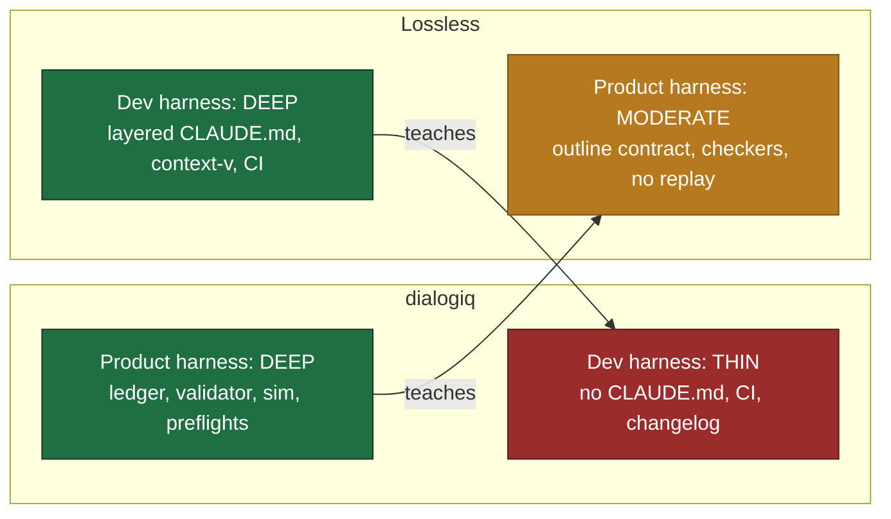
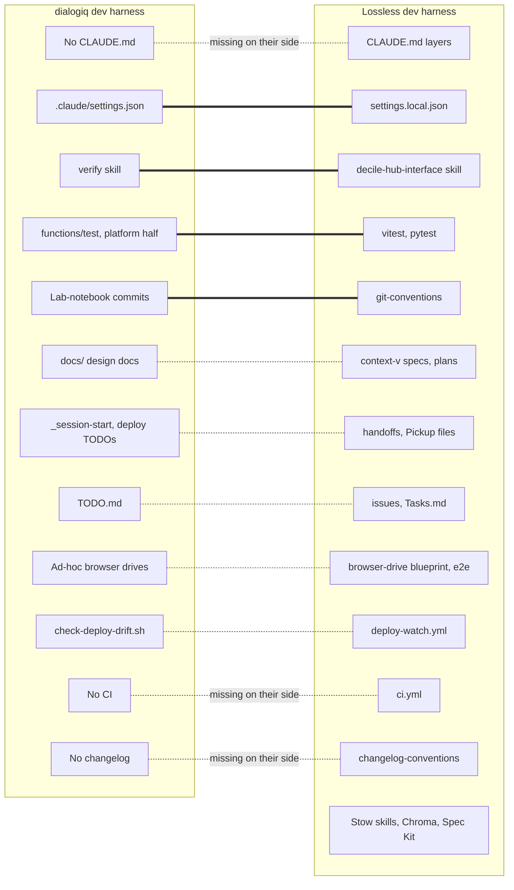
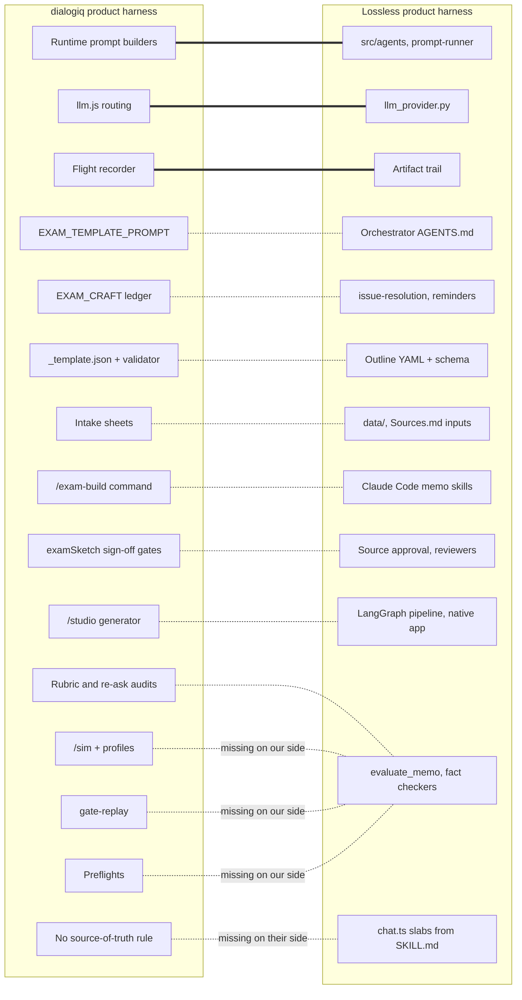
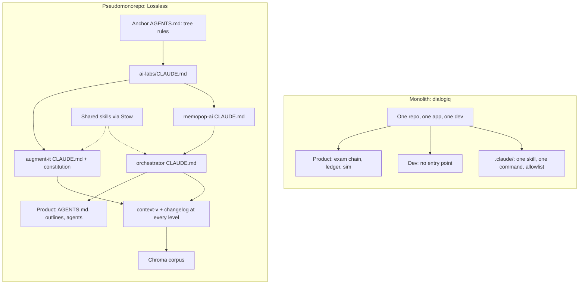
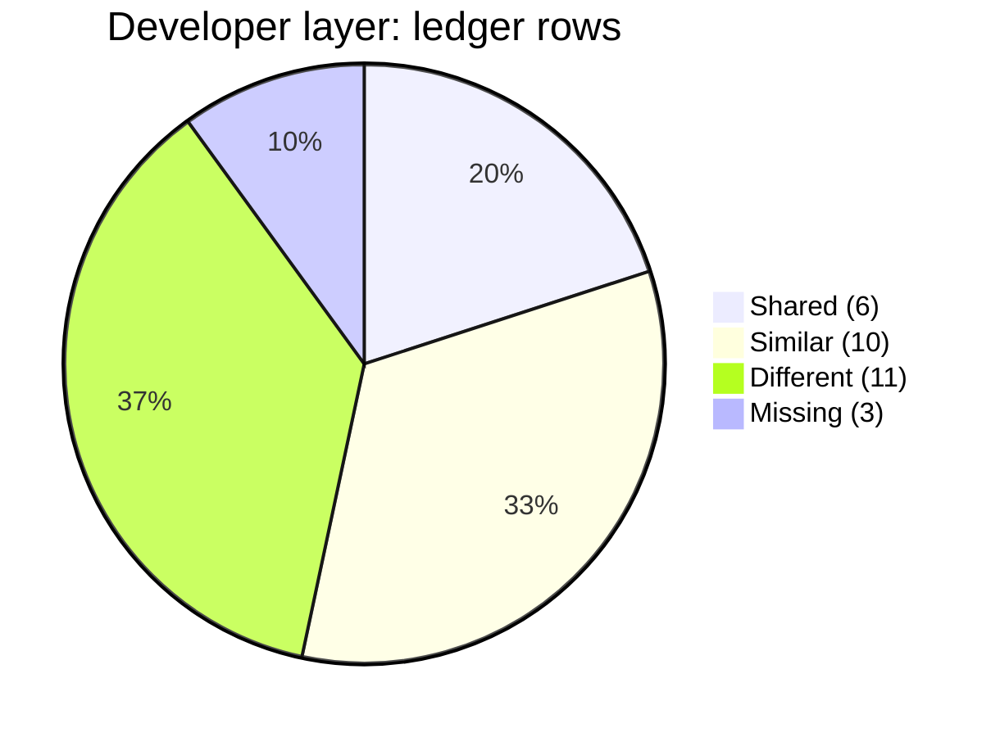
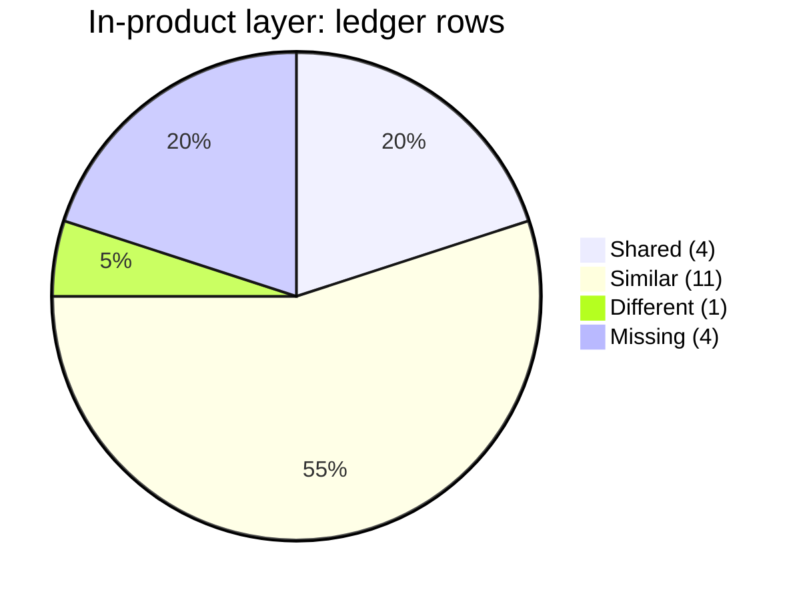

# Compare and Contrast Harness Artifacts: dialogiq and Lossless

Step 2 of 3. The plan is
[[Compare-Contrast-Harness-like-Artifacts-between-Lossless-&-Collaborator]]
(`studies/context-v/plans/`). The method, including "Two harnesses, not
one", is in
[[Explore-Collaborator-Codebases-for-Insights-Comparative-Highlights]]
(`studies/context-v/explorations/`). The evidence for dialogiq's side is
[[01-Harness-Evidence__dialogiq]] (step 1, in this folder, with its layer
column).

**Path conventions.** Their paths are relative to `dialogiq-codebase/`. Ours
are relative to `ai-labs/`, or start with `../` when they sit at the anchor
root (`lossless-monorepo/`). "Observed" means cited from a file or commit.
"Inferred" means reasoned, with the reasoning shown.

**Revision note (v0.0.2.0).** The first draft compared everything in one
pool. That paired artifacts across layers: `EXAM_CRAFT.md` (product) against
our `context-v/issues/` (dev), and `/exam-build` (product) against our
`context-v/loops/` (dev). Those pairings made depth in one layer look like
parity in the other. This version splits both inventories into a
**developer-agents harness** and an **in-product-agents harness**, and
compares only within a layer.

## 1. Highlights

- **The layer map is the headline, and it holds.** dialogiq's developer
  harness is **thin** and its in-product harness is **deep**. Ours is the
  mirror image: a **deep** developer harness and a **moderate** in-product
  harness. Stated plainly: **dialogiq can easily adopt our developer-agents
  techniques, and we can learn from their in-product harness to take ours
  to the next level.** The evidence supports both halves. Every gap in their
  dev layer has a small, worked example on our side. Every gap in our product
  layer has a working artifact on theirs.
- **Their dev gaps are cheap to close.** They have no repo-wide instruction
  file, no CI, no changelog, and a permission allowlist of about 210
  click-approvals that lets an agent push and deploy without asking, and
  that embeds credential values. Each fix is small (S) for a single-app
  repo, and none needs our tree machinery.
- **Their dev layer is thin in structure, not in discipline.** Their design
  docs carry sign-off gates ("Nothing gets built until this is signed off")
  and dated "what shipped" sections, and their commit bodies read like a
  measured lab notebook. What's missing is structure and discoverability:
  `docs/` is flat and an agent can't find it without being told.
- **Our product gap is measurement.** memopop-orchestrator has real
  structure: an outline YAML contract with a schema, a runtime `AGENTS.md`
  whose principles the code cites, and 46 agents including fact checkers
  and citation validators. But it has no run-to-run replay, no synthetic
  inputs in tiers, no preflight of a prompt against the live model, and no
  error bars. dialogiq has all four (`scripts/gate-replay.js`,
  `public/js/sim/`, `scripts/handoff-preflight.js`, `EXAM_CRAFT.md` M6).
- **Within the product layer, the silos converged on their own.** Both
  assemble rather than generate (`exams/_template.json` plus a validator,
  against outline YAML plus `sections-schema.json`). Both keep a runtime
  rulebook with addressable rules, write every run step to disk, route
  several model providers behind one module, and gate generation on human
  sign-off. Ideas two silos reach independently are this study's most
  trustworthy findings.
- **Both silos use the coding-agent harness as a prototype for the
  product.** `/exam-build` began as a Claude Code command and became the
  in-product `/studio` ten days later. augment-it's in-app agent, didi,
  runs on prompt slabs condensed from Claude Code `SKILL.md` files
  (`services/workspace/src/chat.ts`). Neither side has a check that keeps
  the source and the runtime copy in sync. Ours has a written "update
  together" rule (`chat.ts:154`); theirs has none. dialogiq's template already
  "lags the shipped papers".
- **We're overbuilt in places, and their thinness shows it.** Spec Kit
  runs beside `context-v/`. memopop-orchestrator has four instruction files,
  two stale since November 2025. Three domain skills exist as diverged
  copies. Project skills sit where no harness discovers them. Both sides
  also let to-do files rot (their `TODO.md`, our `memopop-ai/context-v/Tasks.md`).

## 2. Snapshot

| Repo | SHA | Branch | Last commit | What was compared |
|---|---|---|---|---|
| dialogiq (`jdema-io/pub-interface`) | `eedd1353b6b765ec642d9762e255037c8adb8d8d` | detached at `origin/main` | 2026-10-01 | All 58 rows of step 1's layered inventory, plus three items from its prose (git history, ad-hoc browser drives, database rules) |
| `augment-it` | `c825e8a83b11bd6b31b80cfe40714dfc331409f5` | `rebuild/turbo-rsbuild` (the active trunk, not `main`) | 2026-10-01 | Dev: `CLAUDE.md`, `.mcp.json`, `.specify/`, `context-v/` (240 files), `changelog/` (109), `.github/workflows/`, `scripts/`, `e2e/`, tests, `DESIGN.md`, git history (627 commits). Product: `services/workspace/src/chat.ts`, `services/prompt-runner/`, `services/prompt-store/`, `apps/chat/`, `apps/prompt-template-manager/`, `apps/request-reviewer/`, `apps/response-reviewer/`, the two runtime skills |
| `memopop-ai` | `1479db0f93135e419351971ce7450664203f8c75` | `main` | 2026-10-02 | `CLAUDE.md`, `.claude/`, `agent-skills/`, `context-v/`, `changelog/`, `.github/`, `apps/memopop-native/` as the run UI, git history (75 commits) |
| `memopop-ai/apps/memopop-orchestrator` | `4fbbb303893a7f78da2b641aa22c7b1abccab732` | `fix/timeseries-analyst-defects` | 2026-10-02 | Dev: `CLAUDE.md` (886 lines), `WARP.md`, `.claude/`, `context-v/` specs and plans, `changelog/` (86), `tests/`. Product: `AGENTS.md`, `templates/` (outlines, schema, scorecards), `data/`, `src/agents/` (46 entries), `src/workflow.py`, `src/llm_provider.py`, `src/artifacts.py`, `cli/evaluate_memo.py`, `cli/score_memo.py`, `docs/PIPELINE-REFERENCE.md`, `context-v/issue-resolution/` and `reminders/` |
| `ai-labs` | `7a10b56f63772f87fd49e3cf692dcab0abe7ddb3` | `main` | 2026-10-03 | `CLAUDE.md`, `studies/CLAUDE.md`, `.claude/`, `.mcp.json` |
| Anchor tree layer | `lossless-monorepo` `0b44635e` (`development`); `lossless-agent-skills` `2efb98a` (`main`) | | | `../AGENTS.md`, `../context-v/agent-skills/`, `../context-v/blueprints/Browser-Drive-Verification-For-Agent-Sessions.md`, `../context-v-corpus/README.md` |

**Not read:** augment-it's `clients/` submodules (client work, not cloned) and
memopop-orchestrator's firm-private `io/<firm>/` submodules. The Chroma MCP
server was down for this run, so the corpus is described from
`../context-v-corpus/README.md`, not queried.

**Rechecked in their codebase:** the section list of
`docs/exam-generator-architecture.md` (§13 "Start here in a fresh session" at
line 536; dated "what shipped" sections §14–§18), the seven parts of
`V2 Scenario Builder/EXAM_CRAFT.md`, and that `.claude/` holds the only
agent-facing files in `git ls-files` (no `CLAUDE.md`, `AGENTS.md` or
`.github/`). All matched step 1.

**Shape of each side.** dialogiq is one repo with one app: a static front end
in `public/` and an Express API in `functions/`, both on Firebase, in plain
JavaScript. The Lossless side is a nested tree. augment-it is a pnpm
workspace with 20 federated front ends, 12 services, 7 packages and a shell.
memopop-ai is a Bun workspace (Tauri desktop app, Astro site) that mounts the
Python and LangGraph orchestrator as a submodule, which in turn mounts
firm-private submodules. Both sit under `ai-labs/`, which sits under the
anchor monorepo. Most of the dev-layer differences follow from that shape.

## 3. Layer map

| | Developer-agents harness | In-product-agents harness |
|---|---|---|
| **dialogiq** | **Thin.** No instruction file, CI or changelog; a frozen 210-entry click-approval allowlist; one dev skill. Two real strengths: signed-off specs that get post-ship updates, and commit bodies that work as a dated, measured record. | **Deep.** A rulebook with a single-source rule, a 2,163-line ID-stable findings ledger with a checked index, skeleton plus validator plus assembler, `/exam-build` ported into the product as `/studio`, an 18-profile simulator with error bars, five preflight and audit scripts, a flight recorder and an LLM review of real sittings. |
| **Lossless** | **Deep, overbuilt in places.** Layered `AGENTS.md`/`CLAUDE.md` files from anchor to app, 240 `context-v/` files in augment-it alone, about 206 changelog entries across the four repos, 11 loops, handoffs, a shared skills library linked with Stow, CI plus a deploy watchdog, a browser-drive blueprint, and a Chroma corpus over past sessions. | **Moderate.** memopop-orchestrator: outline YAML contract with a JSON schema, runtime `AGENTS.md` principles cited in code, 46 agents including fact checkers and citation validators, closed-corpus citations, an artifact trail, scorecards. augment-it: an in-app agent (didi) with skill-sourced prompt slabs, a prompt store, human request and response reviewers. Missing: replay, synthetic inputs, preflights, error bars; craft findings are spread across 36 files. |

**Does the headline hold?** Yes, with two caveats.

1. *Their side adopting our dev techniques is easy* because the pieces they
   need are the small ones: one instruction file, one CI job, a permission
   policy, a handoff habit. The big pieces (pseudomonorepo rules, the
   skills library, the corpus) answer problems a single repo doesn't have,
   and they shouldn't adopt them (section 5.1, "Different").
2. *Our side learning from their product harness is real but not cheap.*
   Replay and preflights are a few hundred lines each (M). A tiered
   synthetic-input harness is harder for memos than for exams. An exam
   candidate can be scripted to a target level. A "weak deal" is harder to
   fabricate convincingly (L).

There are genuine exceptions running the other way in both layers. They are
labelled where they appear in sections 6 and 7.

## 4. Diagrams

### 4.1 Layer map

### 4.2 Harness map: developer-agents layer

Thick links join **shared** artifacts. Dotted links join **similar** ones.
Labelled links mark a **missing** counterpart.

### 4.3 Harness map: in-product-agents layer

### 4.4 Developer loops

**dialogiq** (from step 1 §4a) and **Lossless** (from
`augment-it/context-v/loops/Loop-through-Spec-Write-Plans-Implement-Test-Changelog-Commit.md`,
`../AGENTS.md`, and the `changelog-conventions` and `git-conventions` skills).

```mermaid
flowchart TD
  subgraph DQ["dialogiq developer loop"]
    D1["Design doc, signed off first"] --> D2["Branch or straight to main"]
    D2 --> D3["Session explores cold, no instruction file"]
    D3 --> D4["Implement"]
    D4 --> D5["verify skill, node tests, ad-hoc drive"]
    D5 --> D6["Commit: measured message + trailer"]
    D6 --> D7["Merge, firebase deploy"]
    D7 --> D8["Doc sometimes gains what-shipped section"]
  end
  subgraph LL["Lossless developer loop"]
    L1["Exploration or issue"] --> L2["Spec, Signed-Off"]
    L2 --> L3["Plan per phase, re-grounded on code"]
    L3 --> L4["Agent loads CLAUDE.md layers + skills"]
    L4 --> L5["Implement"]
    L5 --> L6{"Proof green?"}
    L6 -->|"No"| L7["Stop and surface it"]
    L6 -->|"Yes"| L8["Changelog entry, status flip"]
    L8 --> L9["Commit per git-conventions"]
    L9 --> L10["CI, deploy watch"]
    L10 --> L11["Handoff, submodule bump"]
    L11 --> L12["Chroma corpus ingest"]
    L12 --> L1
  end
```

### 4.5 In-product loops

**dialogiq** (from step 1 §4b) and **Lossless** (memopop-orchestrator, from
`AGENTS.md`, `src/workflow.py`, `docs/PIPELINE-REFERENCE.md` and `CLAUDE.md`).
The dashed node on our side is the step dialogiq has and we don't.

```mermaid
flowchart TD
  subgraph DQ["dialogiq exam generation"]
    P1["Source text + notes into session start"] --> P2["Read rulebook + EXAM_CRAFT"]
    P2 --> P3["/exam-build or /studio drafts sketch"]
    P3 --> P4{"Human signs off"}
    P4 -->|"Revise"| P3
    P4 -->|"Approved"| P5["Assemble skeleton, validate"]
    P5 --> P6["/sim matrix with error bars, preflights"]
    P6 --> P7{"Defect named and measured?"}
    P7 -->|"Yes"| P8["Fix, log finding in EXAM_CRAFT"]
    P8 --> P6
    P7 -->|"Holds"| P9["Human sitting, flightReview"]
    P9 --> P8
  end
  subgraph LL["Lossless memo generation"]
    Q1["Deal inputs: data, Sources.md, deck"] --> Q2["Outline YAML chosen"]
    Q2 --> Q3["Harvester fetches closed corpus"]
    Q3 --> Q4["Section writers, no search tool"]
    Q4 --> Q5["Citation + fact-check agents"]
    Q5 --> Q6["Assemble, evaluate_memo, score_memo"]
    Q6 --> Q7{"Analyst satisfied?"}
    Q7 -->|"No"| Q8["revise_section, adhoc sources"]
    Q8 --> Q6
    Q7 -->|"Yes"| Q9["Export"]
    Q6 -.-> QX["Missing: replay, tiers, error bars"]
    Q8 --> Q10["issue-resolution, AGENTS.md rule"]
  end
```

### 4.6 Shape against harness

Where dev instructions live follows where the boundaries are. One repo needs
one entry point. A tree needs a rule for each level and a way to share
across levels. The product harness sits inside one app on both sides.

### 4.7 Stack against harness

Added 2026-10-03 after the first share. Read from manifests and entry files
at the snapshot SHAs: `functions/package.json`, `firebase.json`,
`functions/index.js`, `functions/lib/config.js`, `public/index.html` on
their side; `augment-it/package.json`, `augment-it/services/*/package.json`,
`augment-it/docker-compose.yml`, `augment-it/DEPLOYMENT.md`,
`memopop-ai/package.json`, `memopop-ai/apps/*/package.json` and
`memopop-orchestrator/pyproject.toml` on ours.

| | dialogiq | augment-it | memopop-ai |
|---|---|---|---|
| Shape | One repo, one app | pnpm workspace: 20 apps, 12 services, 7 packages, a shell | Bun workspace of 4 apps, plus the Python orchestrator as a submodule |
| Front end | **No framework.** About 20k lines of plain JS: 23 numbered scripts in `public/js/` loaded in order by `public/index.html`, plus separate pages (`builder`, `portal`, `studio`, `sim`, `admin`). About 600 direct DOM lookups | Svelte 5, rsbuild, Module Federation into the shell | SvelteKit 2 (`memopop-web-app`, and `memopop-native` on Tauri 2), Astro 5 (`memopop-site`) |
| Back end | Express 5 on Cloud Functions, Node 22, `europe-west1`, 1 GiB, 300s (`functions/index.js` lines 41–48), about 20k lines in `routes/` and `lib/` | Fastify with WebSockets, NATS, SearXNG, Docker Compose | Python 3.11, LangGraph, LangChain, uv |
| Data | Firestore and Storage; `firestore.rules` and `storage.rules` deny all client access | SurrealDB | Files on disk (artifact trail) |
| Types | None | TypeScript 6, zod | pydantic; TypeScript in the apps |
| Hosting | Firebase Hosting and Functions; Firebase compat SDK 10.14.1 from `gstatic.com`, App Check | Railway (`DEPLOYMENT.md`) | Desktop and web |
| Models | `functions/lib/llm.js` routes Gemini flash-lite models, DeepSeek, GPT-4o-mini and Claude Haiku 4.5; the choice is runtime config in Firestore | Anthropic SDK, Claude Agent SDK, Composio | Anthropic via LangChain; Perplexity, Tavily, Firecrawl |
| Speech | Azure TTS (main), Google TTS, Google Speech-to-Text, Whisper | n/a | n/a |

**Where their stack wins.** No build and no toolchain, so an agent has no
bundler, type config or federation manifest to break. One deploy surface.
Deny-all data rules limit the damage of an agent's mistake. Model routing
as data makes model comparisons cheap. Everything scales to zero.

**Where it costs them.** No types and no imports: the 23 scripts share
globals and depend on load order, which explains the allowlist full of
line-number greps (step 1 §3.2). The 12,897-line dead `public/script.js`
is still tracked. Firebase lock-in and a fixed region. No CI.

**Where ours wins.** Types and module boundaries give agents contracts to
read. Independently deployable parts suit a multi-client platform. Python
and LangGraph suit a 46-agent pipeline.

**Where ours costs us.** Far more moving parts (federation, NATS,
SurrealDB, Railway, Docker); much of our dev-harness machinery exists to
manage them, so the stack is the root of the overbuilding in §5.1. A slow
first session for a fresh agent. Three languages across two monorepos. No
model routing as data, which replay and preflights (recommendations 1–2)
would need.

**Stack recommendations.** For them: types at the API boundary through
JSDoc and `// @ts-check` (no build step), and delete `public/script.js`.
For us: make model routing runtime config before building the replay
harness, then audit which moving parts earn their keep.

### 4.8 Database: Firestore against SurrealDB

Each fits its data. Theirs is document-shaped: sessions, transcripts, exams
and reports, each owned by a user. Ours is a graph of people,
organizations and affiliations shared across clients
(`RELATE $child->affiliations->$parent`,
`augment-it/services/record-surrealdb-resolver/src/org-relations.ts:124`).

| | Firestore (theirs) | SurrealDB Cloud (ours) |
|---|---|---|
| Data model | Documents and collections; no joins, no graph | Multi-model: documents, graph edges, relational-style queries, plus vector, full-text, geo, time-series and live queries in one engine |
| What's actually used | Transactions, collection-group queries, batched writes and counters (in 3, 3, 6 and 2 files) | Schemaless documents (`DEFINE TABLE` in 8 files) and graph edges (`RELATE` in 5 files). **No** vector indexes, full-text search, live queries, events or custom functions. Vector search lives separately in Chroma |
| Security | Rules enforced in the database; theirs deny all client access | Namespaces suit multi-client separation, but augment-it connects with dev-only credentials and a client-tagging write rule (`Connecting-To-And-Using-SurrealDB.md`) |
| Operations | Fully managed, scales to zero, emulator for tests | Managed cloud, younger, version jumps |
| Lock-in | High | Lower: open source, can self-host or run locally |
| Agent familiarity | High: years of examples in training data | Low: needed a blueprint, the `surrealdb-canonical-layer` skill and an MCP verification pass |

**Multi-model: the benefits.**
- One engine and one query language for documents and relationships. No
  second database to sync, no copied data drifting between stores.
- The graph is native. Affiliations are edges you traverse, not foreign
  keys or duplicated documents, which suits a people-and-organizations
  product.
- Room to grow without new infrastructure: vector, full-text and live
  queries are there when needed.
- Namespaces and databases map cleanly onto clients.

**Multi-model: the costs.**
- **Mostly unrealized so far.** We use two of the models. The vector work
  that could live in SurrealDB runs in a separate Chroma instance, so we
  pay for multi-model generality and still run two stores.
- **A broader surface for agents to get wrong.** SurrealQL spans several
  paradigms, and models know it least well of any database we use. That's
  harness cost (blueprints, skills, verification) a mainstream choice
  wouldn't need.
- **Less depth per model.** A specialist (Postgres plus pgvector, or a
  dedicated vector store) is usually more mature at any one job.
- **One engine, one failure domain.** If documents, graph and search all
  live in one database, its outage takes all of them down (see §4.10).

**Verdict.** Right choice on both sides. Firestore would make the
cross-client entity graph painful; SurrealDB would be overkill for
per-user sessions. On our side, either start using the other models
(moving vector search into SurrealDB would retire a store) or stop
counting them as a reason for the choice.

### 4.9 Architecture: monolith against monorepo of services

Lossless's stated rationale: as code, collaborators and agents scale,
boundaries let each agent load only the context it needs, and keep
parallel work from overwriting itself.

**Where the evidence supports it.**
- Smaller context per task. An agent changing one federated app reads that
  app and its contract. In their monolith, 23 scripts share globals, so
  any change could touch anything, and agents search by line number
  (`awk 'NR<=7320 …'` against a 12,897-line file, step 1 §3.2).
- Fewer collisions. Separate packages rarely put two agents in one file.
  Their monolith shows the failure mode: commit `0e31688` folded 16 days of
  work done outside git into one 129k-line commit.
- Ownership, tests and deploys per unit.

**Where it doesn't.**
- Cross-boundary work gets harder. A change to a NATS message or the
  federation contract needs context from several services at once, and
  errors move between services. That's why `scripts/verify-federation.mjs`
  exists.
- A slower first session for a fresh agent.
- Overwrites are mostly a git problem. Branches, worktrees, small commits
  and handoffs prevent them in any shape. Their big overwrite came from
  working outside git, not from being a monolith.
- Every boundary needs its own instructions, contract and checks: part of
  why our dev harness is deep, and part of why it's overbuilt.

**The nuance.** What helps agents is clear module boundaries with explicit
contracts. Microservices are one way to get them, and the most expensive.
A modular monolith (one repo, one deploy, real modules with imports, types
and a short instruction file each) gets most of the benefit. For them:
ES modules plus `// @ts-check` in place of 23 global scripts. For us: the
services shape is right for many collaborators and clients in parallel,
but it should be a deliberate cost, not a default.

### 4.10 Failure isolation

Lossless's second rationale: with microservices in containers, one part
failing doesn't take the others down.

**What isolation buys.** A crash stays in its process: if `xlsx-ingest`
dies, the shell and other apps keep running. Containers restart on their
own (`restart: on-failure`, `augment-it/docker-compose.yml`). A bad deploy
of one service leaves the rest alone. A federated app that fails to load
leaves the others rendering.

**Where it doesn't hold yet.**
- **A shared trunk.** Every federated app connects straight to
  `workspace-service` over WebSocket (`augment-it/DEPLOYMENT.md:16`), most
  services talk over NATS, and the data lives in SurrealDB. Any of the
  three going down takes nearly everything with it.
- **Invisible partial failure.**
  `augment-it/context-v/issues/Live-Not-Live-Indicator-Tooling-And-Cross-Service-Error-Surfacing.md`
  lists five different failures that all look the same to the user: "a
  dead click". The system keeps running, but nobody can tell what broke.
- **Isolation needs the rest to become resilience:** timeouts, retries,
  fallbacks, health checks, and a UI that says which part is down.
- **More parts, more failures.** Isolation shrinks how much breaks; more
  services increase how often something does.

**Their side gets more than "monolith" suggests.** Hosting is a static CDN,
separate from the API, so pages load when the API is down. They deploy
seven functions: one `api` behind every `/api/**` route, plus six triggers
and scheduled jobs (`functions/index.js` lines 38–62), so a bug in
integrity analysis can't stop an exam sitting. Cloud Functions contain a
crashing request to its instance. Their weak spot is the single `api`
function: a bad deploy takes every route down at once. The fix is
splitting it by surface, which is configuration, not microservices.

**For both sides.** Us: build the live/not-live indicators from that
issue, add timeouts and fallbacks on WebSocket and NATS calls, and plan
for the trunk (redundancy, or a read-only degraded mode). Them: split
`api` into a few functions by surface.

### 4.11 Bucket counts per layer

The shapes differ. The dev layer is dominated by **different**: our
machinery for scale, which a single repo doesn't need. The product layer is
dominated by **similar**: both sides build the same parts in different
forms, and the **missing** rows mostly run one way, toward us.

## 5. The four comparisons, layer by layer

### 5.0 The ledger

Every artifact in step 1's inventory, and every Lossless artifact
inventoried here, sits in exactly one row. Step 1's four "both" rows are
split into a dev facet and a product facet, and each facet sits in one row
of its own layer. Rows marked "step 1 prose" come from step 1's text rather
than its table. No row pairs across layers.

**Developer-agents layer**

| ID | Bucket | dialogiq | Lossless |
|---|---|---|---|
| D-SH1 | Shared | `.claude/settings.json` | `ai-labs/.claude/settings.local.json`, `memopop-ai/.claude/settings.local.json` (both tracked) |
| D-SH2 | Shared | `.claude/skills/verify/SKILL.md` | `augment-it/context-v/agent-skills/decile-hub-interface/` |
| D-SH3 | Shared | `functions/test/` (platform half) and `functions/test/fixtures/README.md` (dev facet) | augment-it vitest (48 `*.test.ts`), `scripts/test-all.sh`; `memopop-orchestrator/tests/` platform half (`test_server.py`, `test_export_cdn.py`, …) |
| D-SH4 | Shared | `README.md` | `augment-it/README.md`, `DEPLOYMENT.md`, `memopop-ai/README.md`, `memopop-orchestrator/README.md`, `PROJECT-STRUCTURE.md`, `docs/` user guides |
| D-SH5 | Shared | `functions/package.json`, `functions/.eslintrc.js`, `firebase.json` | `augment-it/package.json`, `tsconfig*.json`, `memopop-ai/package.json`, `memopop-orchestrator/pyproject.toml` |
| D-SH6 | Shared | Git history: agent-written commits with Claude trailers (step 1 prose, §3.7) | Git history under `../context-v/agent-skills/git-conventions/` |
| D-SI1 | Similar | `V2 Scenario Builder/exams/_session-start.md` (dev facet: carried-over platform TODOs) | `augment-it/context-v/handoffs/` (2), `reminders/Pickup-*.md` (6), `prompts/` (7); `memopop-ai/context-v/handoffs/` (2); orchestrator `context-v/handoffs/`, `prompts/` (2) |
| D-SI2 | Similar | `V2 Scenario Builder/SCENARIO_SIMULATOR_ACTION_PLAN.md` | `context-v/plans/` in augment-it (41), memopop-ai (11), orchestrator (10) |
| D-SI3 | Similar | `V2 Scenario Builder/UI_MODERNIZATION_SUMMARY.md`, `VISUAL_CHANGES.md` | `changelog/` in augment-it (109), memopop-ai (5), memopop-native (6), orchestrator (86) |
| D-SI4 | Similar | `docs/exam-checkin-flow.md`, `docs/exam-integrity-sprint2-b1-b4-measurement-design.md`, `docs/exam-integrity-sprint2lite-speechrate-lexical.md`, `docs/exam-generator-architecture.md` (dev facet: build spec, §13 "Start here") | `context-v/specs/` and `explorations/` in augment-it (38, 31), memopop-ai (incl. `MemoPop-Creative-Brief.md`), orchestrator (16 specs, explorations, top-level design docs) |
| D-SI5 | Similar | `docs/EXAM_PRIVACY.md`, `docs/invitations.md`, `docs/tts-providers.md` | augment-it `context-v/blueprints/` (9 of 10), `notes/`, `patterns/`, `decisions/`, `refactors/`, the three non-Pickup reminders; orchestrator `context-v/blueprints/` (9) |
| D-SI6 | Similar | `docs/record-test-checklist.md` | `augment-it/context-v/specs/Corpora-Builder-Harmony-Test-Registry.md` |
| D-SI7 | Similar | Ad-hoc Puppeteer and Playwright drives in the scratchpad (step 1 prose, §3.8) | `../context-v/blueprints/Browser-Drive-Verification-For-Agent-Sessions.md`, `augment-it/e2e/harness.mjs`, `scripts/prove-*.mjs`, `smoke-*.mjs`, `verify-federation.mjs` |
| D-SI8 | Similar | `TODO.md` (deferred bugs) | `augment-it/context-v/issues/` (55), `backlogs/2026-08-02_Hitlist-for-Sprint.md`; `memopop-ai/context-v/issues/`, `Tasks.md`; orchestrator `context-v/issues/` (6) |
| D-SI9 | Similar | `Notes/` (2 `.rtf`) | `context-v/extra/` (gitignored scratch, per `context-vigilance`) |
| D-SI10 | Similar | `scripts/check-deploy-drift.sh` | `augment-it/.github/workflows/deploy-watch.yml` |
| D-DF1 | Different | — | Pseudomonorepo rules: branch tiers, the HARD STOP on relocation, submodule bumps (`../AGENTS.md`, `../context-v/agent-skills/pseudomonorepos/`) |
| D-DF2 | Different | — | Shared skills library and its Stow linking (`../context-v/agent-skills/`, `.stow-local-ignore`) |
| D-DF3 | Different | — | Chroma corpus over context, changelogs and past sessions (`../context-v-corpus/`, `search-lossless-corpus` skill) |
| D-DF4 | Different | — | Spec Kit (`augment-it/.specify/`, including `memory/constitution.md`) |
| D-DF5 | Different | — | Design-system machinery: `augment-it/DESIGN.md` (1,685 lines), `design-manifest.json`, `design-organ-ledger.json`, `context-v/diagrams/`, and its drift scripts (`tokens:check`, `design:drift`, `organ:drift`) |
| D-DF6 | Different | — | Publishing: frontmatter (`site_uuid`, `hex_code`, `publish`), `augment-it/splash/`, `pages.yml`, `deploy-site.yml`, `deploy-pages.yml` |
| D-DF7 | Different | — | Legacy per-harness files: `memopop-orchestrator/WARP.md`, `.claude/project-instructions.md` |
| D-DF8 | Different | — | MCP wiring: `augment-it/.mcp.json` (SurrealDB, Playwright), `ai-labs/.mcp.json` (Chroma) |
| D-DF9 | Different | — | The `context-vigilance` convention (`../context-v/agent-skills/context-vigilance/`) |
| D-DF10 | Different | — | augment-it's dev loops (`context-v/loops/`, 11) |
| D-DF11 | Different | `firestore.rules`, `storage.rules` deny all client access (step 1 prose, §3.9) | — |
| D-MI1 | Missing, their side | *(no instruction file)* | `../AGENTS.md`, `ai-labs/CLAUDE.md`, `studies/CLAUDE.md`, `augment-it/CLAUDE.md`, `memopop-ai/CLAUDE.md`, `memopop-orchestrator/CLAUDE.md` |
| D-MI2 | Missing, their side | *(no CI)* | `augment-it/.github/workflows/ci.yml` |
| D-MI3 | Missing, their side | *(no changelog)* | `../context-v/agent-skills/changelog-conventions/` |

**In-product-agents layer**

| ID | Bucket | dialogiq | Lossless |
|---|---|---|---|
| P-SH1 | Shared | `public/js/09-prompts.js`, `public/js/13-v2-conversation.js`, `public/js/22-handoff.js`, `functions/lib/assessment.js` | `memopop-orchestrator/src/agents/` (writer, researcher, …); augment-it `services/prompt-runner/src/`, `services/prompt-store/data/prompts.json`, `apps/prompt-template-manager/` |
| P-SH2 | Shared | `functions/lib/llm.js`, `functions/lib/config.js` | `memopop-orchestrator/src/llm_provider.py` |
| P-SH3 | Shared | `public/js/20-flight-recorder.js`, `functions/lib/flightReport.js` | `memopop-orchestrator/src/artifacts.py` (artifact trail), `context-v/reminders/Every-Step-Writes-Its-Output-To-File.md` |
| P-SH4 | Shared | `functions/test/` (LLM-machinery half: `handoff`, `ladderHandoff`, `examStudio`, `simParity`, `flightReview`) and `fixtures/README.md` (product facet) | `memopop-orchestrator/tests/` product half (`test_preservation.py`, `test_thesis_frames.py`, `test_prompt_templates.py`, `test_membership_gate.py`, …) |
| P-SI1 | Similar | `V2 Scenario Builder/EXAM_TEMPLATE_PROMPT.md` | `memopop-orchestrator/AGENTS.md` (runtime contract) |
| P-SI2 | Similar | `V2 Scenario Builder/EXAM_CRAFT.md` | `memopop-orchestrator/context-v/issue-resolution/` (24), `context-v/reminders/` (11 of 12) |
| P-SI3 | Similar | `scripts/check-craft-index.js` | `memopop-orchestrator/scripts/gen_pipeline_reference.py --check` |
| P-SI4 | Similar | `docs/exam-generator-architecture.md` (product facet: pipeline §5, model routing §8) | `memopop-orchestrator/docs/PIPELINE-REFERENCE.md`, `docs/pipeline-reference.overlay.yaml` |
| P-SI5 | Similar | `exams/_template.json`, `functions/lib/examShapes/rhetorical-5.json`, `scripts/build-exam-shapes.js`, `scripts/validate-exam.js` → `functions/lib/examValidate.js` | `memopop-orchestrator/templates/outlines/*.yaml`, `outlines/sections-schema.json`, `memo-template*.md`, `style-guide.md` |
| P-SI6 | Similar | `exams/_intake-template.md`, three filled `exams/<slug>/intake.md`, `_session-start.md` (product facet: source text and notes) | `memopop-orchestrator/data/*.json`, `templates/brand-configs/`, `Sources-template.md`, `corrections-template.yaml` |
| P-SI7 | Similar | `.claude/commands/exam-build.md` | Claude Code memo skills: orchestrator `context-v/agent-skills/` (3), `memopop-ai/agent-skills/` (3), `memopop-ai/context-v/agent-skills/thesis-bleed-cleanup/` |
| P-SI8 | Similar | `functions/lib/examSketch.js` (sketch schema, two sign-off gates) | `memopop-ai/context-v/loops/Frontloaded-Source-Approval-Loop.md`; augment-it `apps/request-reviewer/`, `apps/response-reviewer/`, `context-v/blueprints/Why-Response-Reviewer-and-Highlight-Collector-Exist.md` |
| P-SI9 | Similar | `functions/lib/examAssemble.js`, `functions/routes/studio.js`, `public/studio.html` | `memopop-orchestrator/src/workflow.py`, `src/main.py`, `cli/`; `memopop-ai/apps/memopop-native/` |
| P-SI10 | Similar | `V2 Scenario Builder/DIALOGIQ_PEDAGOGY_REFERENCE.md` | Domain skills `competitive-analysis`, `market-capture-analysis`, `timeline-scenario-analysis` (in `../context-v/agent-skills/` and `memopop-ai/context-v/agent-skills/`) |
| P-SI11 | Similar | `scripts/check-rubric-gates.js`, `scripts/reask-audit.js`, `functions/lib/flightReview.js` | `cli/evaluate_memo.py`, `cli/score_memo.py`, `templates/scorecards/`; agents `validator.py`, `fact_checker.py`, `fact_verifier.py`, `citation_validator.py`, `attribution_audit.py` |
| P-DF1 | Different | — | Firm-private nested submodules under `memopop-orchestrator/io/` |
| P-MI1 | Missing, our side | `public/js/sim/` (`driver.js`, `dryrun.js`, `meter.js`), `public/sim/profiles.json` | — |
| P-MI2 | Missing, our side | `scripts/gate-replay.js` | — |
| P-MI3 | Missing, our side | `scripts/profile-preflight.js`, `scripts/handoff-preflight.js` | — |
| P-MI4 | Missing, their side | *(no declared source of truth between `/exam-build` and `/studio`)* | augment-it `services/workspace/src/chat.ts` slabs, `apps/chat/`, runtime skills `context-v/agent-skills/inbox-curation/`, `triage-inbox-w-suggestions/` |

**What augment-it has in the product layer.** We checked, as the brief
asked. augment-it does have in-product agents. didi, the in-app agent,
answers in `apps/chat/` and runs through `services/workspace/src/chat.ts`,
whose system prompt is built from "slabs". One slab is "the condensed
operational form of `context-v/agent-skills/triage-inbox-w-suggestions`",
with the rule "the SKILL.md is the source of truth, this slab is its
always-loaded condensation; update together". `services/prompt-runner/`
drafts and crawls from templates kept in `services/prompt-store/`, edited in
`apps/prompt-template-manager/`. `apps/request-reviewer/` and
`apps/response-reviewer/` put a human between the model and the record.
There is no evaluation of didi or the prompt runner. That is why the
Lossless product cell is rated moderate, with memopop-orchestrator carrying
most of the weight.

### 5.1 Developer-agents layer

**Shared.**

*Permission files (D-SH1).* Both sides commit a Claude Code settings file,
and neither treats it as a policy. Theirs, `.claude/settings.json`, is about
210 `allow` entries saved from click-approvals, committed once on
2026-08-20, never edited since. It grants `git push *`, `firebase deploy *`,
`gcloud auth *` and `git credential *`, and some entries embed credential
values (not reproduced here). Ours are tiny and odd in another way:
`ai-labs/.claude/settings.local.json` has two `allow` entries plus MCP
toggles, and `memopop-ai/.claude/settings.local.json` has only MCP toggles.
Both are tracked in git, though Claude Code means `settings.local.json` to
stay on one machine. dialogiq got this distinction right: per step 1, their
`settings.local.json` stayed local. Neither side has a `deny` list or a
hook. Our rules for push and deploy live as prose ("ask before pushing" in
`../AGENTS.md`).

*Dev skills (D-SH2).* Their one dev skill, `verify`, is a lesson learned the
hard way: start the emulators with Firestore and Auth, because "`--only
functions` alone leaves Firestore calls pointed at **production**". Our
closest per-repo dev skill, `decile-hub-interface`, is the same kind of
thing: an operating guide for a system where a careless agent touches real
data. There is one difference in mechanics. Theirs sits in `.claude/skills/`,
where Claude Code finds it with no setup. Ours sit in `context-v/agent-skills/`
and are found only once linked into `~/.claude/skills`. As of this snapshot,
none of augment-it's or memopop's project skills is linked there (observed:
`ls ~/.claude/skills`). On discoverability, their simple path wins.

*Tests (D-SH3).* Ordinary unit tests on both sides: framework-free `node`
tests for them, vitest and pytest for us. Both sides have tests outside the
main run. Their five `examIntegrity*.test.js` files aren't in `npm test`. Our
`scripts/test-all.sh` sits beside `pnpm -r test` with no note on which one
counts.

*READMEs (D-SH4) and manifests (D-SH5)* are ordinary. Their `README.md` has
drifted into a `/record` manual. Ours have drifted toward length: the
orchestrator's `README.md` is about 90 KB.

*Commit history (D-SH6).* The closest match in this layer. Since July 2026,
220 of their 263 non-merge commits carry a `Co-Authored-By: Claude …`
trailer. Subjects state findings ("Fix the check, not the briefs: five of
eight preflight failures were mine", `19ca2f0`) and bodies quote
measurements. Ours carry trailers too (augment-it: 526 of 602 non-merge
commits, across six model labels) and follow `git-conventions`: a typed
header, then why before how. They got lab-notebook commits without a written
convention. We wrote ours down so it holds across 27 repos and many
sessions. Both sides also write "why this exists" headers into scripts.
Compare their `scripts/check-deploy-drift.sh` ("so don't 'simplify' this
back to $(curl ...)") with our `augment-it/.github/workflows/ci.yml` ("WHY
THIS EXISTS. On 2026-08-15 we found …").

**Similar.**

*Session handoffs (D-SI1).* The dev half of their `_session-start.md` carries
platform TODOs between sessions ("functions deploy — three-pass averaged
assessment (built + tested, never deployed)"). Ours split by purpose:
`prompts/` for paste-in openers, `handoffs/` and `reminders/Pickup-*.md` for
end-of-session state. Our handoffs lead with git state ("Nothing is
uncommitted. Nothing is unpushed.",
`augment-it/context-v/handoffs/Pickup-2026-09-13-Retrofit-Arc-And-The-Services-Tsconfig.md`).
Theirs is one file and easy to find, but it exists for exam sessions, and
platform state only rides along. Ours leaves a dated trail but scatters
(six `Pickup-*.md` files in `reminders/`, two more in `handoffs/`).

*Plans (D-SI2) and after-action summaries (D-SI3).* Their February plan and
summaries read like chat outputs saved once and never touched again. Our
plans and changelogs are a habit: about 62 plans and 206 changelog entries
across the four repos.

*Specs (D-SI4).* Step 1's correction applies here: their dev layer is not
spec-less. `docs/exam-checkin-flow.md` opens "Design doc for review. Nothing
gets built until this is signed off." The architecture doc carries dated
"what shipped" sections, a "Start here in a fresh session" section (§13),
and the integrity design tags claims `[EST]`, `[EXT]` and `[ASSERT]`, with a
warning that citations are "cited from memory". Our specs run the same
lifecycle across `specs/` → `plans/` → `changelog/`, with `status`
frontmatter flipping from Signed-Off to Shipped. The discipline is the
same. The difference is structure. Their `docs/` is flat and unindexed, with
no roles for plan, spec or issue, and nothing points an agent at it. Ours
has roles, frontmatter and a corpus, at the cost of many more files. We
have no counterpart to their epistemic tags or their "start here" section.

*Reference docs (D-SI5) and test registries (D-SI6).* Their
`docs/invitations.md` ends in a "Code map" and `docs/tts-providers.md` in a
"Files changed" list. That is our blueprint idea at a smaller scale, and the
code map is exactly what a cold agent needs. Their manual
`docs/record-test-checklist.md` lines up with our test registry spec.

*Browser drives (D-SI7).* Same job, different maturity. Their allowlist shows
drive scripts (`test_exam.js`, `test_admin_ui.js`, `diag1.js` to `diag8.js`)
run from the scratchpad and never committed. We codified the practice: a
blueprint, Playwright MCP at project scope, a disposable-backend
`e2e/harness.mjs`, and `prove-*.mjs` acceptance scripts named in the plan.

*To-do lists and issues (D-SI8).* Both sides let these rot. `TODO.md` was last
touched 2026-07-18 and still says "No automated test suite".
`memopop-ai/context-v/Tasks.md` has two unchecked items, last touched
2026-08-18. Our 55 augment-it issue files are better kept, but they are still
a separate pile from the loop.

*Scratch (D-SI9) and deploy drift (D-SI10).* `Notes/*.rtf` are committed; our
`context-v/extra/` is gitignored by convention. `check-deploy-drift.sh`
answers "is prod what I think it is?" on demand. Our `deploy-watch.yml`
answers "did the deploy happen at all?" after every merge. It exists because
of a twelve-day silent failure (`augment-it/changelog/2026-08-15_01_…`).

**Different.** Each needs a reason.

- **Pseudomonorepo rules (D-DF1), the shared skills library (D-DF2), the
  Chroma corpus (D-DF3).** These exist because of our shape: 27 projects,
  nested submodules, parallel sessions, too much history to grep. In a
  single repo with 280 commits, `git log` does what the corpus does, and a
  cross-repo skills library has nothing to share across. *Judgement:
  different, not missing.* If the exam pipeline becomes its own repo, the
  skills library becomes relevant first.
- **Spec Kit (D-DF4).** augment-it runs it beside `context-v/`
  (`context-v/blueprints/Spec-Kit-and-Context-V-Coexistence.md`). *Judgement:
  different, but a candidate overbuild on our side.* The constitution has one
  commit (2026-05-18), and the block Spec Kit injected into
  `augment-it/CLAUDE.md` says "read the current plan" without naming one.
- **Design-system machinery (D-DF5).** Twenty federated front ends must look
  like one product. One front end of ordered scripts doesn't need this.
- **Publishing (D-DF6).** Our context is published to splash sites, so every
  file carries `site_uuid`, `hex_code` and `publish`. Their docs aren't
  published.
- **Legacy per-harness files (D-DF7).** `WARP.md` (last edited 2025-11-23) and
  `.claude/project-instructions.md` (2025-11-18) both repeat "use `uv`, not
  `pip`". *Judgement: listed as different only because nothing on their side
  corresponds. On our side this is leftover, not a choice. Their single place
  for instructions is the better state.*
- **MCP wiring (D-DF8).** augment-it gives the agent its database and a
  browser through MCP. Their `verify` skill reaches the database through the
  emulator and the API, which suits deny-all Firestore rules.
- **The context-vigilance convention (D-DF9).** Eight canonical folders and
  four-part versioning pay off across a corpus of 1,166 files. Their `docs/`
  holds eight. The smallest useful piece (a status line and a date at the top
  of each doc) is in the recommendations; the convention isn't.
- **augment-it's dev loops (D-DF10).** Eleven loop docs, most for repeating a
  component migration across 20 front ends. A single front end has few
  repeating dev workflows. *Judgement: different.* Note that when dialogiq
  did have a repeating workflow, exam building, they encoded it as a command,
  which is arguably better (section 6.1).
- **Deny-all database rules (D-DF11, theirs).** `firestore.rules` and
  `storage.rules` force every write, including an agent's, through the API.
  It's a structural guardrail where we would use a prose rule. Our stacks
  have no client-side rules layer, so there is no counterpart.

**Missing (all on their side).**

- **A repo-wide instruction file (D-MI1).** None at any SHA. Nothing maps
  `functions/routes/`, `functions/lib/` or the 23 ordered `public/js/NN-*.js`
  files. Nothing says the 12,897-line `public/script.js` is dead. The
  allowlist's line-number greps against it (`awk 'NR<=7320 && …'
  public/script.js`) suggest agents explore it cold. *Judgement: missing.*
  With 220 agent-trailered commits, the cost of a cold start recurs.
- **CI (D-MI2).** Their dev gates run only when remembered. `npm test` is
  dependency-free and fast, an ideal first CI job.
- **A changelog (D-MI3).** *Reconsidered from the first draft, which called
  this "similar".* That draft counted `EXAM_CRAFT.md` Part 7 as the
  changelog's counterpart, but Part 7 logs exam builds, which is the product
  layer. Within the dev layer, the substitutes are commit bodies, post-ship
  doc sections and two February summaries. The commit bodies are strong, but
  they are the dev layer's only running memory, and commit `0e31688` shows
  what happens when that breaks: 16 days of work folded into one 129k-line
  commit "outside git". *Judgement: missing, low priority.* It isn't in their
  top five, because a session-end handoff (recommendation 4) covers most of
  the risk for less effort.

### 5.2 In-product-agents layer

**Shared.**

*Runtime prompt builders (P-SH1).* Both sides build prompts in code: the
examiner, interlocutor, handoff and grader prompts on their side; the
section writer, researcher and other agents in `src/agents/`, plus
augment-it's prompt store, on ours. Both pin behaviour in prose comments next
to the prompt. Their `assessment.js` grades in three passes and averages the
result. Our `writer.py` pins prose generation to temperature 0, citing
`AGENTS.md`. Those are two different answers to the same worry about
variance. Theirs measures it. Ours suppresses it.

*Model routing (P-SH2).* Both route several providers behind one module
(`functions/lib/llm.js`, `src/llm_provider.py`). They keep the choice in
Firestore runtime config, so switching needs no redeploy. We keep it in code
and generate an inventory of it.

*Run records (P-SH3).* A real convergence. The flight recorder and our
artifact trail both write every step to disk so a later session tunes on
data. Their `_session-start.md` says it outright: "Don't tune on reasoning
alone. Get the flight-recorder data first."

*Tests of the LLM machinery (P-SH4).* Both sides unit-test the code around
the model (handoff parsing and studio assembly for them; preservation gates,
thesis frames and prompt templates for us). Their `fixtures/README.md` gives
the reason for frozen fixtures, "exam-craft edits must never break platform
tests", which marks the boundary between the two layers better than
anything on our side.

**Similar.** Most of the learning in this layer sits here.

*Runtime rulebooks (P-SI1).* `EXAM_TEMPLATE_PROMPT.md` names itself the single
source of truth: "revise this section, not individual exams".
`memopop-orchestrator/AGENTS.md` is "the contract every runtime LLM agent in
this pipeline operates under", with numbered principles a prompt can cite
("follow §2, §3, §5, §6"), and the code does cite them
(`src/artifacts.py`: "AGENTS.md §1: the outline is the contract"). Theirs is
written for the agent that authors exams. Ours is prepended to runtime
prompts. Ours has a naming hazard: in the anchor tree, `AGENTS.md` means
coding-agent instructions (`../AGENTS.md`, with `CLAUDE.md` symlinked to it).
A harness that reads `AGENTS.md` by default would load the memo writer's
rules as its coding instructions. Their filename can't be mistaken.

*Craft ledgers (P-SI2).* This is now a fair pairing: product craft against
product craft. Their `EXAM_CRAFT.md` is one 2,163-line file. Findings carry
stable IDs (I, S, Q, R, B, P, M) and an evidence line each. Part 6 holds
"Candidate principles, not yet distilled", Part 7 is an append-only build
log, and a script checks the index. Our product craft lives in
`memopop-orchestrator/context-v/issue-resolution/` (24 files, for example
`Faked-Sources-from-Perplexity.md`) and `reminders/` (`Citation-Reminders.md`,
`Long-Running-Is-Not-A-Reason-To-Fan-Out.md`), each with frontmatter. Ours is
easier to publish and link. Theirs does the job a craft ledger exists for:
an agent reads all of it in one pass, cites a finding by ID, and can tell
proven rules from hunches. We have no "not yet distilled" tier and no
per-run log.

*Ledger and pipeline-map checks (P-SI3, P-SI4).* Another convergence.
`check-craft-index.js` fails `npm test` when the ledger's index and headings
disagree. `gen_pipeline_reference.py --check` exits 1 when
`docs/PIPELINE-REFERENCE.md` no longer matches the pipeline's syntax tree.
Their pipeline design lives in prose in the architecture doc (§5, with model
routing in §8), and it is kept current by hand. Ours is generated, so it
can't drift, but it holds less judgement (the overlay YAML carries the
judgement).

*Assemble, don't generate (P-SI5).* The strongest convergence of all.
dialogiq copies structure from `_template.json` (and now generated shapes)
and validates invariants that "are silently violable"
(`docs/exam-generator-architecture.md` §7). The orchestrator fixes the
section taxonomy in an outline YAML with a JSON schema because
"cross-run drift in section taxonomy made merging seven ChromaDB runs
produce 26 best-of catalogs instead of 9" (`AGENTS.md` §1). Both sides also
show the same drift: their newest exam was built from a shipped exam
"because the template still lags the shipped papers" (`EXAM_CRAFT.md`).

*Run inputs (P-SI6).* Each exam starts from an intake sheet the agent drafts
and the human corrects, with `[CHECK]` and `[STILL OPEN]` markers. Each memo
starts from a per-company data file, a brand config and a `Sources.md`. Their
form tracks what is unverified. Ours doesn't.

*Generation commands run by the coding agent (P-SI7).* `/exam-build` is a
slash command with `allowed-tools`, a reading order, two hard stops for
sign-off, and a closing ban ("Do not deploy, commit, or import anything into
the builder. The user does that."). Our counterparts are Claude Code skills
that operate the memo pipeline: `manage-memo-citations`,
`adhoc-edits-workflow`, `user-adds-adhoc-sources`, `sources-md-curation`,
`thesis-bleed-cleanup`. Ours cover more situations. Theirs enforces its
stops and tool list. Ours describe them.

*Human sign-off in generation (P-SI8).* `examSketch.js` builds the two gates
into the product, after "the single most important design decision": "the
model drafts a reviewable sketch, the teacher signs off, and only then does
JSON exist". memopop's `Frontloaded-Source-Approval-Loop.md` puts the human
gate before writing (approve the sources), and augment-it's request and
response reviewers put it on each model call. Same principle, placed at
different points.

*In-product generators (P-SI9).* `/studio` (`studio.js`, `studio.html`,
`examAssemble.js`) is `/exam-build` as a teacher-facing feature. The
orchestrator's LangGraph pipeline (`src/workflow.py`) is driven from the CLI
or the memopop-native app. Their generator was prototyped as a dev command
first (step 1 standout 4). Ours grew the other way: pipeline first, Claude
Code skills around it later.

*Domain references (P-SI10).* `DIALOGIQ_PEDAGOGY_REFERENCE.md` "should be
included in any AI analysis of scenarios". We package the same kind of
know-how as skills that load on a trigger. But our three domain skills exist
twice, in the shared library and in `memopop-ai/context-v/agent-skills/`,
and the copies differ (observed with `diff`). That breaks our own
single-source rule.

*Grading the output (P-SI11).* `check-rubric-gates.js` checks the grader
opened each comment with a quotation. `reask-audit.js` checks the examiner
didn't repeat itself. `flightReview.js` reviews real sittings for the
teacher. Those check whether the model *did what it was told*. Our side is
deep in a different direction: five checking agents (fact checker, fact
verifier, citation validator, attribution audit, validator) and
`evaluate_memo.py` / `score_memo.py`, which check whether the output *is
true and good*. Our anti-hallucination tiers are richer than anything they
need for exams. What we lack is their next step: running those checks many
times and reporting the spread.

**Different.**

- **Firm-private submodules (P-DF1).** The orchestrator fences each client's
  inputs and outputs in its own private repo. dialogiq's customer content
  lives in the app repo, which is fine for one customer and would need
  rethinking at three.

**Missing.**

*On our side (the main lesson of this study):*

- **Synthetic inputs in tiers (P-MI1).** `public/js/sim/driver.js` plays 18
  personas from `public/sim/profiles.json`, from `native-phd` down to
  `stalled`, through a real exam. It reports a matrix, the correlation with
  tier, a standard error per candidate and a resolution floor. The memo
  question "does the scorecard rank a strong deal above a weak one,
  reliably?" has no harness on our side.
- **Run-to-run reliability (P-MI2).** `gate-replay.js` measures how often the
  ladder gate flips on identical input ("flip rate 2% (1/63)"). We have never
  measured how often a memo section's verdict or score flips between runs.
- **Preflighting the instrument (P-MI3).** `profile-preflight.js` checks that a
  persona plays its brief before its results are trusted.
  `handoff-preflight.js` runs the shipped prompt against the live model: "A
  result here is a statement about production." The principle behind both,
  the instrument before the exam (`EXAM_CRAFT.md` Part 1, M1), appears
  nowhere in our pipeline.

*On their side (a genuine exception: our product layer teaching theirs):*

- **A declared source of truth for a runtime copy (P-MI4).** `/exam-build` and
  `/studio` now implement the same flow twice, and the template both point at
  already lags the shipped exams. augment-it faced the same split (a Claude
  Code skill and its runtime condensation) and wrote the rule at the point of
  use: "the SKILL.md is the source of truth, this slab is its always-loaded
  condensation; update together" (`services/workspace/src/chat.ts`). That rule
  is honour-system, so a check like their own `check-craft-index.js` would
  make it stronger than ours.

## 6. Insights

### 6.1 Insights for Lossless

**In the in-product layer (learning from their depth):**

1. **We verify the code around the model, not the model.** Our checks ask
   whether a memo is true. Theirs also ask whether the system would say the
   same thing twice, and whether it ranks a known-strong input above a
   known-weak one. memopop is a judgement product, as dialogiq's examiner is.
   They built the measurement layer and we haven't.
2. **We suppress variance where they measure it.** Pinning the writer to
   temperature 0 hides variance without telling us how large it is. Three
   averaged grading passes, plus a flip rate, tell them.
3. **Craft knowledge compounds better in one ledger.** For engineering bugs,
   one file per issue is right. For product craft (how a memo section survives
   a partner's read), an ID-stable ledger with a "not yet distilled" tier and a
   per-run log makes knowledge compound in a way 36 scattered files don't.
4. **The convergences confirm our product bets.** Assemble, don't generate;
   a rulebook with addressable rules; run records on disk; human gates
   before generation. A silo with none of our conventions reached all four.

**In the developer layer (where we're deep, but they still teach):**

5. **Exception: a command enforces, a loop doc only describes.** Their best
   workflow, `/exam-build` (product layer), is one invocable file with a tool
   list and hard stops. Our dev loops are better written, but an agent has to
   be told to read them. Neither augment-it nor memopop-ai has a
   `.claude/commands/` directory.
6. **We're overbuilt where layers pile up without pruning.** Spec Kit beside
   `context-v/`. Four instruction files in the orchestrator, two stale. Diverged
   skill copies. Project skills no harness discovers. `ai-labs/CLAUDE.md` and
   `studies/CLAUDE.md` still give a macOS path to `context-v/skills/` and a
   sync script, while the anchor has moved to `context-v/agent-skills/` and
   Stow on Linux. `memopop-ai/CLAUDE.md` lists a `Links-for-Corpus.md` that
   doesn't exist. None of this is serious alone. Together it's the cost of a
   harness that grows faster than it's pruned. (Noted, not fixed, per the
   drift policy.)
7. **Committing `settings.local.json` is our hygiene slip, not theirs.**
8. **Our dev memory depends on infrastructure.** The Chroma server was down
   for this very run. Their memory (Markdown plus `git log`) can't go down.

**Across the layers:**

9. **Both silos prototype product agents in the coding harness.** `/exam-build`
   became `/studio`. Our triage skill became a slab in didi's prompt. That is a
   real pattern worth naming, and on both sides it lacks a sync rule.

### 6.2 Insights for the Collaborator

**In the developer layer (learning from our depth):**

1. **The harness around your best work is almost all defaults.** No repo-wide
   instruction file. A permission list nobody curated, frozen on 2026-08-20,
   that lets an agent push, deploy and touch credentials without asking, and
   that holds credential values in plain text.
2. **Two workflows, one front door.** Exam work opens with `_session-start.md`
   and runs through `/exam-build`. Platform work starts cold. That probably
   explains the exploratory greps in the allowlist.
3. **Your dev discipline is real, just hard to find.** Signed-off specs,
   post-ship sections and measured commits are all there. They need a map
   (a root `CLAUDE.md` that points at `docs/`), not a new system.
4. **The gates exist, but nothing makes them run.** 27 tests, a validator, a
   craft-index check and a deploy-drift check all run only when remembered.
5. **History has a hole, and stale context misleads.** Commit `0e31688` folds
   16 days of work done "outside git" into one commit, and the working copy
   "had lost" `.gitignore` and `.claude/`. `TODO.md` contradicts the repo. A
   short end-of-session habit prevents both.
6. **Your simplicity is an asset.** One repo, plain JavaScript, deny-all
   database rules, model choice in runtime config. Most of our dev machinery
   exists to manage complexity you don't have. Take only the small pieces.

**In the in-product layer (where you're deep):**

7. **Your product harness is ahead of ours, and of most we've seen.**
   Measuring the instrument before the exam, giving the reviewer error bars,
   and logging human sittings that "could not have come from a matrix" is
   rigorous evaluation practice. We plan to borrow it.
8. **Exception: the `/exam-build` → `/studio` port needs a source-of-truth
   rule.** Two implementations of one flow will drift, and the template has
   already started.

## 7. Recommendations

### 7.1 Recommendations for Lossless

Ranked by expected payoff. Most come from their in-product layer, as the
headline predicts. Exceptions are labelled.

| # | Layer | Recommendation | Inspired by (theirs) | Lands in (ours) | Effort |
|---|---|---|---|---|---|
| 1 | Product | **Measure run-to-run reliability.** Replay one section N times on frozen inputs and report verdict flip rate and score spread. Make `evaluate_memo.py` report a standard error, not just a score. | `scripts/gate-replay.js`, `EXAM_CRAFT.md` M6 | `memopop-orchestrator/cli/` (new `replay_section.py`), plus a `context-v/loops/` doc | M |
| 2 | Product | **Preflight prompt changes against the live model** before they ship, N passes, with the result recorded as "a statement about production". | `scripts/handoff-preflight.js` | `memopop-orchestrator/scripts/` | S–M |
| 3 | Product | **A craft ledger for memo writing.** Stable finding IDs, an evidence line each, a "candidate, not yet distilled" tier, an append-only run log, and an index checked in `tests/`. Point existing `issue-resolution/` files at it rather than moving them. | `V2 Scenario Builder/EXAM_CRAFT.md`, `scripts/check-craft-index.js` | `memopop-orchestrator/context-v/` (for example `MEMO_CRAFT.md`) | M |
| 4 | Product | **Synthetic inputs in tiers.** A small set of synthetic deals from clearly strong to clearly weak, with expected score bands, to check the scorecard ranks them in order. Preflight that each synthetic deal reads as its tier before trusting results. | `public/sim/profiles.json`, `public/js/sim/driver.js`, `scripts/profile-preflight.js` | `memopop-orchestrator/data/synthetic/`, `tests/` | L |
| 5 | Product | **Obedience audits.** Over a batch of runs, check that agents did what their rules say (every URL traces to the corpus, `AGENTS.md` §6 holds), separately from whether the memo is good. | `scripts/check-rubric-gates.js`, `scripts/reask-audit.js` | `memopop-orchestrator/cli/` | S |
| 6 | Product | **`[CHECK]` and `[STILL OPEN]` markers in run inputs**, so the human sees what is unverified. | `exams/_intake-template.md` | `templates/Sources-template.md`, `data/` input conventions | S |
| 7 | Both, exception | **Name the graduation path from Claude Code skill to product agent, with a sync rule and a check.** | `/exam-build` → `functions/routes/studio.js` | augment-it `chat.ts` slabs; memopop (for example `thesis-bleed-cleanup` as a post-generation agent) | M |
| 8 | Dev, exception | **Make our most-used loops invocable.** A `.claude/commands/` file with `allowed-tools`, a reading order, explicit stops and a "do not push or deploy" line. Keep the loop doc as the explanation. | `.claude/commands/exam-build.md` (a product artifact teaching our dev layer) | `augment-it/.claude/commands/`, `memopop-ai/.claude/commands/` | M |
| 9 | Dev, exception | **Epistemic tags in specs** (`[EST]` / `[EXT]` / `[ASSERT]`), a "start here in a fresh session" section in long specs, and a written model-routing rule for coding sessions. | `docs/exam-integrity-sprint2-b1-b4-measurement-design.md`; `docs/exam-generator-architecture.md` §8, §13 | `../context-v/agent-skills/context-vigilance/SKILL.md`; `ai-labs/CLAUDE.md` | S |
| 10 | Dev, exception | **A pruning pass on our dev harness**, in its own session: retire `WARP.md` and `.claude/project-instructions.md`, untrack `settings.local.json`, reconcile the diverged skill copies, link or relocate project skills, fix stale paths in `ai-labs/CLAUDE.md` and `studies/CLAUDE.md`, decide Spec Kit's future, consider renaming the orchestrator's runtime `AGENTS.md`. | dialogiq's one-place harness, by contrast | The files named | S–M |

Recommendations 1–7 come from their product layer, where they do better than
we do. 8–10 are dev-layer exceptions where their thinner setup still teaches
us something.

### 7.2 Recommendations for the Collaborator

Five, ranked by payoff for a single-app Firebase repo with one developer and
many agent sessions. Four come from our dev harness, as the headline
predicts. The fifth is a labelled exception from our product harness. Each
is the smallest version that helps.

1. **[Dev] Add a short root `CLAUDE.md` for platform work.** Size: S.
   - *Smallest version:* 40–80 lines. What the app is, in two sentences. A
     map of `functions/routes/`, `functions/lib/` and the `public/js/NN-*.js`
     load order. A line saying `public/script.js` is dead. How to test
     (`npm test` in `functions/`) and verify (the `verify` skill). The rule
     that must never break (no `--only functions` against production). A
     pointer to `docs/` for specs, and to `_session-start.md` for exam work.
     Who deploys and commits.
   - *Evidence:* no instruction file at any SHA; `README.md` lines 11–173
     cover only `/record`; the allowlist greps the dead `public/script.js`.
   - *Worked example:* `ai-labs/memopop-ai/CLAUDE.md` (166 lines: layout,
     boundaries, "do not" lines, a see-also list). Leave out its links to
     parent files and its tree rules.

2. **[Dev] Turn the allowlist into a policy, and rotate what leaked.**
   Size: S.
   - *Smallest version:* rotate the credentials that appear in
     `.claude/settings.json`. Cut the list to the 20–30 commands you're glad
     to have run without asking. Move `git push`, `firebase deploy`,
     `gcloud auth`, `gh auth` and `git credential` to `ask`, and add a `deny`
     for curl against production. Keep one-off approvals in
     `settings.local.json`, which you already keep out of git.
   - *Evidence:* about 210 entries, one commit on 2026-08-20, broad grants,
     embedded credential values (step 1 §3.2).
   - *Worked example:* honestly, we don't have a good one. Ours are small
     (`ai-labs/.claude/settings.local.json` has two entries) but lean on
     prose rules in `../AGENTS.md` ("ask before pushing") rather than `deny`
     entries. We plan to do this step too.

3. **[Dev] Run `npm test` in CI on every push.** Size: S.
   - *Smallest version:* one GitHub Actions workflow with Node 22, `npm ci`
     and `npm test` in `functions/`, plus `scripts/validate-exam.js` over the
     shipped exams. Add the five `examIntegrity*.test.js` files to the chain,
     or write down why they stay out. Keep the live-model preflights manual,
     because they cost money.
   - *Evidence:* no `.github/`; 27 dependency-free tests already chained.
   - *Worked example:* `ai-labs/augment-it/.github/workflows/ci.yml`. Copy
     the "WHY THIS EXISTS" header habit and ignore the 16-image matrix.

4. **[Dev] End every session with a handoff, platform sessions included.**
   Size: S.
   - *Smallest version:* make `_session-start.md` general, or add a sibling
     `docs/HANDOFF.md`. Its first line states git state ("committed and
     pushed", or exactly what isn't). Then where things stand and the next
     step. Fold `TODO.md` into it and delete the original. If a session's
     browser drive proved something, save it under `scripts/drives/` before
     closing.
   - *Evidence:* `_session-start.md` carries over to-dos, but only for exam
     sessions; `TODO.md` stale since 2026-07-18; commit `0e31688` records 16
     days of work outside git; drive scripts appear in the allowlist but not
     the repo.
   - *Worked example:*
     `ai-labs/augment-it/context-v/handoffs/Pickup-2026-09-13-Retrofit-Arc-And-The-Services-Tsconfig.md`
     (opens with a repo-state table and "Nothing is uncommitted. Nothing is
     unpushed.").

5. **[Product, exception] Name the source of truth between `/exam-build` and
   `/studio`.** Size: S.
   - *Smallest version:* one comment at the top of both
     `.claude/commands/exam-build.md` and `functions/routes/studio.js` saying
     which one leads and what must change together. Then a small test, in the
     style of your own `check-craft-index.js`, that fails when the two
     disagree on the intake fields or gate count, or when `_template.json`
     falls behind the newest shipped exam.
   - *Evidence:* the port happened within ten days (2026-08-28 → 2026-09-07);
     `EXAM_CRAFT.md` records building from a shipped exam "because the
     template still lags the shipped papers".
   - *Worked example:* `ai-labs/augment-it/services/workspace/src/chat.ts`
     ("the SKILL.md is the source of truth, this slab is its always-loaded
     condensation; update together"). Ours has the rule but no check, so
     yours would be better.

## 8. Open questions to ask them

1. Would a root `CLAUDE.md` clash with how you start platform sessions now?
   Do you paste a prompt, or let the agent explore?
2. Is `.claude/settings.json` meant to be a shared policy for future
   collaborators, or did it get committed along with the skill? Do you want
   agents to push and deploy without asking?
3. When `/exam-build` became `/studio`, which one did you treat as the
   source of truth? Do you still use the command?
4. Is the exam pipeline heading for its own repo? `V2 Scenario Builder/` has
   outgrown its name, and a second repo would change several judgement calls
   here (shared skills, findings memory).
5. How do you decide when a Part 6 "candidate principle" in `EXAM_CRAFT.md`
   gets promoted? We'd like to copy that rule, not just the structure.
6. How much does a full `/sim` matrix cost, in money and time? It would help
   us size the memo-pipeline version.
7. How did you build personas that reliably play a target level? That's the
   hard part for us: a convincing "weak deal" is harder to fabricate than a
   weak candidate.
8. Have you tried slash commands for platform work, or a second dev skill?
9. Would you run the same pass on our silo? Your view of where we're
   overbuilt, and of our product harness, is probably the most useful thing
   this study could produce.
10. Is there anything here you'd rather we leave out of the public version?
