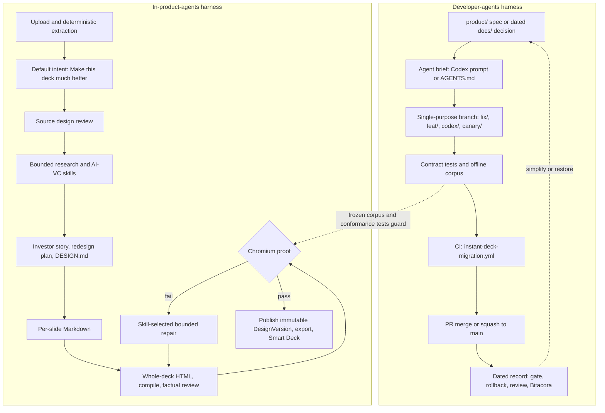

# Harness Evidence: phoenixcapera (Instadeck / DeckAiStack v2)

Step 1 of 3, following
[[Analyze-Harness-like-Evidence-in-Collaborator-Codebase]]. All paths are
relative to `studies/collaborations/phoenixcapera/instadeck-v2/` unless marked
otherwise. Claims are labelled **observed** (with a cited path) or **inferred**
(with the reasoning shown).

## 1. Snapshot

| Item | Value |
|---|---|
| HEAD | `e3c6e651409493489e4b9c6de9d72fe4c757158e` (`e3c6e65`) on `main`, same as `origin/main` |
| Last commit | 2026-10-02 21:39 +0100, "Fix Instant Deck end-to-end research lineage (#64)" |
| Commits on `main` | 364 (744 across all refs) |
| Remote branches | 70 (plus `origin/HEAD`) |
| Tracked files at HEAD | 1,453: `backend/` 954, `frontend/` 444, `docs/` 44 (mostly evidence PNGs), `product/` 6, plus root files |
| History floor | The first commit is `9e0237e` (2026-08-24), "chore: establish clean DeckAiStack main baseline". It imports 1,692 files from two earlier repos (`README.md` § "Imported baseline" records both source SHAs), so for any imported file, "first commit 2026-08-24" means the import date |

**What the system is.** DeckAiStack v2, whose product is Instadeck ("DDDecks"
inside the specs), is a full-stack web product for redesigning investor decks.
A user signs in with email and password and uploads a PDF or PPTX. From there,
a pipeline of durable jobs takes over: deterministic extraction, LLM source
review, bounded industry research, investor synthesis, a chain of Markdown
"working documents", whole-deck HTML authoring, deterministic compilation,
Chromium render proof, bounded repair, publication of an immutable
`DesignVersion`, and export. The front end is SvelteKit 2 with Svelte 5
(`frontend/`). The back end is FastAPI with SQLAlchemy and two Alembic lineages
(`backend/alembic/`, `backend/alembic_ai/`). Separate API, worker and renderer
services deploy to Railway (`backend/railway.toml`,
`backend/railway.worker.toml`, `backend/railway.renderer.toml`,
`frontend/railway.toml`). The specs define four surfaces over one shared Deck
record: Instant Deck, Smart Deck, Smart Edit and Due Diligence
(`product/DDDECKS_PRODUCT.md`). The repo says plainly that it descends from the
Lossless dididecks-ai workflow (`product/PRODUCT_GENESIS.md:3`): "Instant Deck
grew out of a practical problem observed in the Lossless AI Labs / DidiDecks
workflow."

## 2. Inventory table

### 2a. Artifacts present at HEAD `e3c6e65`

Line counts are from `wc -l`. Dates are the first and last commits touching
the path on `main`.

| # | Layer | Category | Path | Lines | First | Last | What it is |
|---|---|---|---|---:|---|---|---|
| 1 | dev | Context | `README.md` | 43 | 2026-08-24 | 2026-09-29 | Points to `product/` specs; records the imported-baseline SHAs and the "release safety" rule |
| 2 | both | Spec | `product/INSTANT_DECK_PRODUCT_SPEC.md` | 763 | 2026-09-29 | 2026-09-29 | "Specification of record": change control, stage contracts, embedded canonical runtime prompt, conformance ledger, definition of done |
| 3 | dev | Spec | `product/PRODUCT_GENESIS.md` | 98 | 2026-09-29 | 2026-09-29 | Why the product exists, and its lineage from the Lossless AI Labs / dididecks workflow |
| 4 | dev | Spec | `product/DDDECKS_PRODUCT.md` | 74 | 2026-09-29 | 2026-09-29 | Boundaries of the four-surface product family, plus an ownership rule for ambiguous code |
| 5 | dev | Spec | `product/SMART_DECK.md` | 619 | 2026-09-29 | 2026-09-29 | Smart Deck boundary, followed by long design notes ending in "The sentence I would give Codex as the new north star" |
| 6 | dev | Spec | `product/SMART_EDIT.md` | 138 | 2026-09-29 | 2026-09-29 | Smart Edit capability contract and definition of done |
| 7 | dev | Spec | `product/DUE_DILIGENCE.md` | 144 | 2026-09-29 | 2026-09-29 | Due Diligence capability contract and definition of done |
| 8 | dev | Verification / release | `docs/INSTANT_DECK_DEPLOYMENT_GATE.md` | 126 | 2026-08-24 | 2026-08-24 | Pre-deploy checklist with worker allowlists and coordinated service order |
| 9 | dev | Release / memory | `docs/INSTANT_DECK_ROLLBACK.md` | 55 | 2026-08-24 | 2026-08-24 | Rollback record: a Git rollback point, Railway deployment and image identities per service, data ownership |
| 10 | dev | Context | `docs/INSTANT_DECK_RUNTIME_INVENTORY.md` | 99 | 2026-08-24 | 2026-08-24 | Inventory of the mounted customer path (auth, upload, routes) that "does not claim browser acceptance" |
| 11 | dev | Decision record | `docs/INSTANT_DECK_PREMERGE_DECISION.md` | 117 | 2026-08-24 | 2026-08-24 | Pre-merge decision: "not approved for merge", root causes, findings |
| 12 | dev | Spec | `docs/INSTANT_DECK_PRODUCT_SCOPE.md` | 39 | 2026-08-24 | 2026-08-24 | Recovery-milestone scope, exclusions and acceptance rule |
| 13 | dev | Audit | `docs/INSTANT_DECK_RECOVERED_FIX_AUDIT.md` | 27 | 2026-08-24 | 2026-08-24 | Table of earlier fixes and how each is retained in the reduced baseline |
| 14 | dev | Audit / recovery | `docs/INSTANT_DECK_PR39_RECOVERY.md` | 158 | 2026-09-23 | 2026-09-25 | Why the "Instant Core" simplification (PR 40) was reversed and the richer path restored |
| 15 | both | Decision record | `docs/INSTANT_DECK_PROMPT_SYSTEM_ARCHITECTURE_2026-08-25.md` | 1,456 | 2026-08-25 | 2026-08-25 | "No-go" on another free-form HTML prompt; proposes a Structured-Output DeckSpec plus a deterministic compiler |
| 16 | both | Spec / evidence | `docs/INSTANT_DECK_OFFLINE_FOUNDATION_2026-08-25.md` | 104 | 2026-08-25 | 2026-08-25 | Offline DeckSpec-to-compiler slice; "Production status: disabled and unmounted" |
| 17 | product | Evaluation | `docs/INSTANT_DECK_SEVEN_PRIMITIVE_VISUAL_AUDIT_2026-08-25.md` | 146 | 2026-08-25 | 2026-08-25 | Per-slide 1–5 scorecard over eight visual-quality dimensions |
| 18 | product | Evaluation evidence | `docs/evidence/` | 23 files | 2026-08-25 | 2026-08-25 | Compiled HTML, Chromium reports, determinism manifests and slide PNGs, used by the acceptance corpus |
| 19 | both | Plan | `docs/instant-html-render-repair/README.md` | 913 | 2026-09-25 | 2026-09-25 | Plan to turn render failures into repairs, in six implementation slices, with required regression tests |
| 20 | both | Verification | `docs/instant-html-render-repair/LIVE_ACCEPTANCE.md` | 52 | 2026-09-25 | 2026-09-25 | Runbook for the read-only live production acceptance runner |
| 21 | dev | Review | `docs/reviews/investor-quality-integration/` | 9 files (README 75) | 2026-09-09 | 2026-09-09 | Independent review packet: README, acceptance, code map, redacted logs, screenshots; "unfinished implementation" |
| 22 | dev | CI | `.github/workflows/instant-deck-migration.yml` | 81 | 2026-09-23 | 2026-09-29 | The only active workflow: compile checks, about 27 named pytest files, offline repair corpus, a frontend node test and the build |
| 23 | dev | CI (inert) | `frontend/.github/workflows/instant-deck-production-acceptance.yml` | 44 | 2026-08-24 | 2026-08-24 | Manual browser gate against production; sits in a subfolder, so GitHub won't run it |
| 24 | dev | CI (inert) | `backend/.github/workflows/deck-extractor-stack.yml` | 28 | 2026-08-24 | 2026-08-24 | Extractor-stack check; same subfolder issue, and the script it calls is missing at HEAD |
| 25 | dev | Harness config | `.gitignore` | 69 | 2026-08-24 | 2026-09-29 | Ignores `/docs`, `/scripts`, `/reference/` and `/.local-work/`, plus "Bitácora" logs as "not product or agent context" |
| 26 | dev | Harness config | `backend/.gitignore` | 129 | 2026-08-24 | 2026-08-24 | Ignores `.codex/`, `.codex_tmp/` and `.codex-sessions/` under "Codex/local AI working files" |
| 27 | both | Verification | `backend/tests/` | 120 test files, ~21.5k lines | 2026-08-24 | 2026-10-02 | Pytest suite; no `skip` or `xfail` markers at HEAD |
| 28 | dev | Verification (doc contracts) | `backend/tests/test_product_surface_specs.py` | 48 | 2026-09-29 | 2026-09-29 | Asserts phrases in the product specs, and asserts that `context-v/` and `changelog/` do **not** exist |
| 29 | both | Verification (doc contracts) | `backend/tests/test_instant_deck_canonical_product_spec.py` | 61 | 2026-09-29 | 2026-09-29 | Asserts that the prompt embedded in the spec matches the runtime `MVP_UPLOAD_PROMPT` byte for byte |
| 30 | both | Verification | `backend/tests/test_bitacora_product_boundary.py` | 23 | 2026-09-18 | 2026-09-18 | Proves the knowledge loader excludes operator Bitácora logs from product context |
| 31 | both | Verification | `backend/scripts/audit_instant_deck_persistence.py`, `audit_live_instant_deck_acceptance.py`, `audit_render_repair_acceptance.py`, `run_controlled_deterministic_repair_acceptance.py` | 445 / 99 / 58 / 720 | 2026-09-23 | 2026-09-29 | Read-only audits of persisted lineage, plus the offline and live acceptance runners |
| 32 | product | Evaluation | `backend/tests/fixtures/render_repair_acceptance/corpus.v1.json` | 153 | 2026-09-25 | 2026-09-25 | Frozen, provider-free corpus of historical passes and representative render-failure shapes |
| 33 | product | Runtime prompt | `backend/app/services/llm/instant_deck_mvp_policy.py` | 72 | 2026-09-09 | 2026-09-29 | Application-owned default intent ("Make this deck much better.") and the canonical product prompt |
| 34 | product | Runtime prompts | `backend/app/llm/prompt_packages/` | 52 files, 1,571 lines | 2026-08-24 | 2026-09-29 | Nine prompt packages (`instant_deck`, `smart_deck`, `smart_edit`, `due_diligence`, `audience_diligence`, `shared`, …) with output schemas |
| 35 | product | Product skills | `backend/app/services/ai_vc/skills/builtins/` | 19 `SKILL.md`, 271 lines | 2026-09-19 | 2026-09-25 | Agent-Skills-format files (frontmatter: `name`, `description`, `phases`, `retrieval_purposes`, `allowed_tools`) for the AI-VC analyst |
| 36 | product | Product skills | `backend/app/products/instant_deck/skills.py` | 95 | 2026-09-23 | 2026-09-23 | Typed catalogue of about 30 "skills" by stage (context, research, analysis, narrative, …) |
| 37 | product | Product skills | `backend/app/services/llm/instant_html_render_repair_skills.py` | 100 | 2026-09-25 | 2026-09-25 | Maps measured Chromium failures to exact visual-repair skills |
| 38 | product | Output skeleton | `backend/app/products/instant_deck/working_documents.py`, `redesign_documents.py`, `source_design_review.py` | 204 / 384 / 99 | 2026-09-29 | 2026-09-29 | The persisted Markdown document chain (`01-source.md` … `06-DESIGN.md`, `slides/*.md`) |
| 39 | product | Orchestration / memory | `backend/app/services/ai_vc/` (`graph.py`, `memory.py`, `capability_router.py`, …) | e.g. 87 / 217 | 2026-09-18 | 2026-09-29 | LangGraph-backed AI-VC coordinator behind domain interfaces; operation-scoped memory |
| 40 | product | Generation engine | `backend/app/services/llm/full_html_generation_service.py` | 10,982 | 2026-08-24 | 2026-09-29 | Whole-deck HTML generation, compilation, validation and repair: the largest single file |
| 41 | product | Runtime knowledge | `backend/llm_knowledge/` | 195 files | 2026-08-24 | 2026-09-29 | Knowledge packs: deck archetypes, VC methodology and finance, due diligence, investor visual design |
| 42 | dev | Prompts (Codex) | `backend/llm_knowledge/dididecks_architecture_runtime_knowledge_pack/HOW_TO_USE_WITH_CODEX.md` and `prompts/` | 25 + 9 prompts (364 lines) | 2026-08-24 | 2026-08-24 | Nine "Codex Prompt" build briefs plus status templates; dev material sitting in the product knowledge mount |
| 43 | product | Eval / telemetry | `backend/app/services/admin/agent_regression.py`, `agent_telemetry.py`, `agent_learning_memory.py` | 418 / 630 / 231 | 2026-08-24 | 2026-08-24 | Imported admin services backed by migrations `0028`, `0030` and `0031` (learning memories, telemetry, regression cases) |
| 44 | dev | Stack / deploy | `backend/railway.toml` (+ `.worker`, `.renderer`), `frontend/railway.toml` | 12 / 9 / 10 / 10 | 2026-08-24 | — | Pre-deploy runs both Alembic lineages; health check at `/api/health/product-ready` |

**Layer counts (2a):** dev 22, product 13, both 9 (44 rows).

### 2b. Off-HEAD artifacts (deleted from `main`, or only on branches)

These matter for the harness story but don't exist at `e3c6e65`, so each one
is cited by commit.

| Layer | Category | Path @ ref | Size | Dates | What it is |
|---|---|---|---|---|---|
| dev | Instructions | `AGENTS.md`, `backend/AGENTS.md`, `frontend/AGENTS.md` @ `6ecac46^` | 41 / 249 / 122 | Present from 2026-08-24 baseline to 2026-09-29 | Layered agent instructions; deleted from `main` by `6ecac46` "docs: archive development agent instructions" |
| dev | Instructions | Same three files @ `origin/refactor/product-ai-openai-boundaries` | 96 / 47 / 35 (+ tweaks in `b410abf`) | 2026-09-29 | A rewritten "reset" set (`561632a`), not merged to `main` |
| dev | Verification of instructions | `backend/tests/test_repository_instruction_contract.py` @ same branch | 28 | 2026-09-29 | Pytest that asserts key sentences in the three `AGENTS.md` files |
| dev | Prompt (Codex) | `CODEX_DECK_REDESIGN_AUDIT_PROMPT.md` @ `95b4fd3` | 444 | 2026-09-18 → removed `3825adb` 2026-09-29 | Audit-first Codex brief: "Read the root `AGENTS.md` … Read the newest `BITACORA.md` entries" |
| dev | Memory | `BITACORA.md` @ `d3ea34e^` | 881 | to 2026-09-18 | Dated work log ("Persistent record requested by the user"), then made local-only and gitignored |
| dev | Context (Lossless-style) | `context-v/`, `changelog/`, `FILEMAP.md`, `scripts/maintain_instant_deck_context.py` @ `7b60159` … `48be330^` | ~794 lines removed | 2026-09-23 → 2026-09-29 | Lossless conventions adopted ("establish Lossless context discipline"), then removed by "refactor: productize creative memory" |
| dev | Archive | `origin/archive/pre-pivot` (`439f508`) | 4,277 files | 2026-09-23 | "preserve all session work before pivot": specs, audits, `.playwright-mcp/` logs, a copy of dididecks-ai dev material (incl. its `CLAUDE.md` and `context-v/agent-skills/`) |
| dev | Plan | `plan.md` @ `439f508` | — | last updated 2026-08-25 | "Instant Deck Production Recovery Plan … A box is checked only when …" |

## 3. Category findings

### 3.1 Instruction sets

- **At HEAD: none.** At `e3c6e65` there's no `CLAUDE.md`, `AGENTS.md`,
  `GEMINI.md`, `.cursorrules`, `.cursor/`, `.github/copilot-instructions.md` or
  `.windsurfrules` (observed: `git ls-tree -r HEAD`). `README.md` now acts as
  the entry point and routes readers to `product/`.
- **History: a three-level `AGENTS.md` set** (root, `backend/`, `frontend/`)
  lived from the baseline until 2026-09-29 (observed, `6ecac46^`). The root file
  layered several directives. One was product authority: "`INSTANT_DECK_CANONICAL_PRODUCT_SPEC.md`
  is the specification of record". One was a Git workflow: "Work on `main` …
  commit and push them to `main`". Another kept the logbook out of agent
  context: "Bitácora files are local-only operator notes. Product agents must
  not read … them". The root file also carried release-scope rules for the
  "LLM-first investor beta". `backend/AGENTS.md` (249 lines) covered the stack,
  provider routing, a full env-var block (names and defaults only), pipeline
  steps, "Canonical Architecture Rules" and an "Active Instant Deck beta path".
  `frontend/AGENTS.md` (122 lines) covered routes, Svelte 5 conventions and
  provider UI.
- **Contradictions inside that set** (observed). `frontend/AGENTS.md` says
  "Provider-first — Qwen/DashScope is the default LLM provider". At the same
  time, `backend/AGENTS.md` says "OpenAI is the default production provider."
  The root file says work goes straight to `main`. The reset version says:
  "Create a focused feature branch … The product owner decides when to merge."
- **The reset set** (observed, `origin/refactor/product-ai-openai-boundaries`,
  `561632a`/`b410abf`) is shorter and points everything at `product/`: "When
  code and a product specification differ, treat the specification as the
  intended product contract". It sets OpenAI as the only provider and pins one
  visible working copy: "Do not use `/tmp` worktrees, sibling clones, or
  GitHub-only edits". It hard-codes an absolute local path to that working copy
  (not reproduced here). A pytest asserts these sentences. As of the snapshot
  it isn't merged.
- **Inferred:** the instruction surface was deliberately emptied on `main`
  (09-29) while its replacement waited for review. Until that merges, an agent
  starting on `main` gets its orientation from `README.md` and `product/`
  rather than from an instruction file.

### 3.2 Harness configuration

- **No checked-in harness config at HEAD or in any ref's history** for
  `.claude/`, `.codex/`, `.cursor/` or `.mcp.json` (observed:
  `git log --all --name-only`).
- **Ignore rules show which tools are in use** (observed). `backend/.gitignore`
  lists `.codex/`, `.codex_tmp/` and `.codex-sessions/` under "Codex/local AI
  working files". The root `.gitignore` excludes `/reference/` ("Local
  reference repositories are not product source") and `/.local-work/`
  ("Local worktrees, private evidence, and deployment staging").
- **Archive evidence of MCP use** (observed, `origin/archive/pre-pivot`): about
  25 `.playwright-mcp/` console and page snapshots dated 2026-09-13 and
  2026-09-22. `ARCHIVE_README.md` there says the work came from "multiple AI
  agent sessions (Codex, OpenDeek, Playwright MCP, etc.)". It also lists
  `.agents/` and `.codex/` folders, but neither was committed.
- **Permission policy** lives in prose rather than in settings. Two examples:
  "Paid verification needs an explicit allowance" (`AGENTS.md` @ `6ecac46^`),
  and "Paid provider calls and deployments require explicit product-owner
  approval" (reset `AGENTS.md`).

### 3.3 Skills and commands

- **Dev skills: none at HEAD.** A Lossless-style
  `context-v/agent-skills/loops/maintain-filemap/SKILL.md` existed from
  2026-09-23 to 2026-09-29 (observed, `7b60159` → `48be330`). There are no slash
  commands anywhere.
- **Codex prompt packs act as dev "commands"** (observed).
  `backend/llm_knowledge/dididecks_architecture_runtime_knowledge_pack/HOW_TO_USE_WITH_CODEX.md`
  says: "Use one prompt at a time. Do not ask Codex to implement the entire
  product at once." The pack sets a recommended order across
  `prompts/02_…`–`09_codex_*.md`. Each prompt repeats a shared rule block that
  includes "Run build/typecheck and report results". `status/*_template.md`
  gives agents a fixed report format (`NOT_READY` / `PARTIAL` / `READY`). The
  pack's README is dated 2026-06-20 and describes "DidiDecks … a database-backed
  deck operating system". In other words, the pack is a translation of the
  dididecks-ai architecture (step 2 should compare it).
  `CODEX_DECK_REDESIGN_AUDIT_PROMPT.md` (`95b4fd3`, 444 lines) is a one-off
  audit brief in the same style.
- **Product skills: substantial** (observed). There are 19 `SKILL.md` files in
  `backend/app/services/ai_vc/skills/builtins/` (for example `ic-critique`,
  `saas-economics`, `visual-storytelling`, `why-now`), and their frontmatter
  matches the Agent Skills format. `ic-critique/SKILL.md` reads: "Treat even
  critical-for-fundraising findings as advisory." `registry.py` and
  `resolver.py` load them by phase. There are also two typed catalogues:
  `backend/app/products/instant_deck/skills.py` (stage-scoped analyst roles)
  and `backend/app/services/llm/instant_html_render_repair_skills.py` (repair
  skills chosen from measured failures; branch `feat/skill-assisted-render-repair`
  carries the commit "test: require exact skill hashes for repaired publication").
- **Domain, stack or workflow?** The product skills are domain know-how: VC
  analysis and slide craft. The Codex prompts are workflow and architecture
  know-how.

### 3.4 Context engineering

- **`product/` is the agent's starting point** (observed, `README.md`). The
  spec sets an explicit precedence order (`product/INSTANT_DECK_PRODUCT_SPEC.md:14–20`):
  source evidence, then the spec, then genesis, then versioned contracts, with
  "Git history and ignored local reference material as historical evidence only".
  Changing the spec needs "a concrete product or acceptance failure … updated
  conformance tests … explicit product-owner approval" (`:22–27`).
- **`docs/` holds dated operational records** (gate, rollback, inventory,
  pre-merge decision, audits, evidence), mostly from 2026-08-24/25 and
  2026-09-23/25. Root `.gitignore` ignores `/docs` and `/scripts`, yet `docs/`
  is tracked. **Inferred:** files were force-added on purpose, which keeps
  casual local notes out while letting chosen records in.
- **Some of it is written to an agent, not a human** (observed):
  `product/SMART_DECK.md:611` "The sentence I would give Codex as the new north
  star", and `:613ff` "Before adding a new schema, planner, selector, registry,
  or state object, prove that the same requirement cannot be represented
  clearly in the working Markdown documents". The surrounding text ("Your repo
  already points in that direction…") reads like pasted advice from a chat
  assistant (inferred from voice).
- **A deliberate wall between dev context and product context** (observed).
  The spec says: "Repository `context-v/` and changelog folders are not runtime
  architecture, product authority, or creative memory for customer decks"
  (`product/INSTANT_DECK_PRODUCT_SPEC.md:49`). The code enforces it:
  `backend/app/ai/instant_deck_knowledge_context.py:36` "Keep operator Bitácora
  files outside every product knowledge lane", tested in
  `backend/tests/test_bitacora_product_boundary.py`.
- **Self-graded doc marker** (observed): `<!-- Hallmark · pre-emit critique: P5 H5 E5 S5 R4 V5 -->`
  heads `docs/INSTANT_DECK_PROMPT_SYSTEM_ARCHITECTURE_2026-08-25.md`, and
  similar markers appear in the seven-primitive audit and
  `backend/app/instant_deck_spec/composition_renderers_v2.py`. **Inferred:**
  output from a writing or critique skill in her agent tooling. Its source
  isn't identifiable from the repo.

### 3.5 Specs and plans

- **Very detailed, and kept current by tests** (observed).
  `INSTANT_DECK_PRODUCT_SPEC.md` has 24 numbered sections, including §22
  "Conformance ledger as of 2026-09-29", which rates each requirement
  "Implemented", "Partial" or "Not proven". It includes this row: "Three
  unrelated live-deck quality acceptance runs | No current evidence in this
  specification | Not complete" (`:736`). §23 states: "Until those conditions
  are proven, the product may be deployable or partially functional, but it is
  not accepted as complete."
- **Plans written before code**, each with a status line: render repair
  ("Status: implementation plan only", `docs/instant-html-render-repair/README.md:3`,
  six slices then shipped as separate branches on 09-25), the prompt-system
  decision ("research complete; implementation not authorized"), and the
  offline foundation ("disabled and unmounted").
- **Specs are rewritten rather than appended to** (observed). Earlier
  "source of truth" files (`INSTANT_DECK_CANONICAL_PRODUCT_SOURCE_OF_TRUTH_2026-08-19.md`,
  `DECK_V2_AI_VC_FULL_PRODUCT_SPEC.md`, 1,837 lines) survive only on
  `archive/pre-pivot`. Commit `3825adb` "docs: archive competing root product
  documents" retired the rest from `main`.

### 3.6 Memory

- **No changelog at HEAD.** A Lossless-style `changelog/` (five entries) and a
  root `CHANGELOG.md` existed from 2026-09-23 to 2026-09-29 and were removed by
  `48be330`. `backend/CHANGELOG.md` went in `a4077ba`. A test now asserts their
  absence (`backend/tests/test_product_surface_specs.py`,
  `test_ai_labs_repository_memory_is_not_tracked_product_architecture`).
- **The Bitácora (logbook) is the session-memory habit** (observed). The last
  tracked version (`d3ea34e^:BITACORA.md`, 881 lines) opens: "Persistent record
  requested by the user … Entries describe completed work and observed results;
  planned actions are labelled." Entries record per-run costs and accepted
  canaries. On 2026-09-18 it became local-only (`d3ea34e` "chore: keep bitacora
  local-only"), so it still exists, just outside Git.
- **Creative memory moved into the product** (observed). `product/PRODUCT_GENESIS.md:90`
  says the "useful behavior belongs in operation-scoped database records". The
  commit that removed `context-v/` is titled "refactor: productize creative
  memory".
- **What else carries memory.** Dated `docs/` records; the
  `archive/pre-pivot` and `archive/multi-provider-orchestration-2026-09-29`
  branches; the rollback record; and PR squash bodies that list the
  constituent commits (e.g. `907b263`).

### 3.7 Git as evidence

- **Cadence** (observed, `main` by day): 66 commits on 08-24 (baseline day),
  then bursts on 09-10 (26), 09-19 (33), 09-23 (89), 09-28 (26) and 09-29 (41),
  with quiet gaps between. 329 non-merge commits added 400k lines and removed
  84k; 20 commits added over 1,000 lines each.
- **Two message styles.** One is lowercase Conventional Commits
  (`fix:`/`feat:`/`docs:`/`test:`/`ci:`), seen in most 08-24 and 09-28/29
  commits. The other is sentence-case imperative titles ("Persist failed
  Chromium diagnostics before Instant Deck terminalization"), seen 09-10 to
  09-25 and in squash merges. Only 34 of 329 non-merge commits on `main` have a
  body. Titles are long and specific, with recurring vocabulary: "truthful",
  "exact", "bounded", "durable", "lineage" (observed). **Inferred:**
  agent-written titles, with the two styles probably matching two agent
  surfaces or two configurations.
- **No `Co-Authored-By` trailers** on any of 744 commits (observed).
  Attribution shows up elsewhere: three author identities that appear to be
  hers; `github-actions[bot]` on 2 commits (see the patch transport below); one
  "Railway Agent" commit (`dab4c84` "fix: restore regex import in Instant Deck
  visual planning", 09-23); and one commit authored as "User" (`439f508`, the
  archive).
- **Branches** (70). By prefix: `fix/` 27, `feat/` 16, `recovery/` 7,
  `canary/` 4, `codex/` 3, `archive/` 2, and one each for `audit/`,
  `reduction/`, `simplify/`, `restore/`, `migration/`, `integration/`,
  `quality/`, `beta/`, `refactor/` and `docs/`. **Inferred:** nearly all are
  single-purpose agent sessions. Most hold 1–15 commits, created and finished
  within a day. 27 are ancestors of `main`. Many others show as "ahead" only
  because they were squash-merged: the 09-25 render-repair branches reappear
  as single commits on `main`.
- **Merge pattern.** PRs run up to #64. 35 merge commits on `main`, including
  "Merge PR #40: simplify Instant Deck to Instant Core" and, the same day, PR
  #41–#46 repairing it. Then "Merge PR #47: restore rich Instant Deck authoring
  path" (09-23). The last three main commits (09-30 to 10-02) are squash merges.
- **CI-applied patch transport** (observed, `origin/codex/instant-deck-v3-phase2-3`):
  four commits "build: stage checked migration patch part 1…4" add base64
  chunks. Then `983468f` changes the workflow to reassemble the chunks,
  LZMA-decompress them, check a SHA-256, `git apply` the result, run the tests
  and commit as `github-actions[bot]` (`0773af5`). `b005043` later removed it:
  "remove bootstrap transport". **Inferred:** a way around an agent
  environment that could write small files to GitHub but couldn't push a large
  diff directly.

### 3.8 Verification

- **Active CI** is one workflow (`.github/workflows/instant-deck-migration.yml`).
  It runs on `main` and on PRs: `compileall` of named modules, about 27 named
  pytest files ("no paid calls"), the offline repair corpus and a frontend
  `node --test`, then `npm run build`. It also still triggers on push to
  `codex/instant-deck-v3-phase2-3`. All its referenced files exist at HEAD.
- **Two inherited workflows can't fire** (observed), because GitHub only reads
  `.github/workflows/` at the repo root. `frontend/.github/workflows/instant-deck-production-acceptance.yml`
  calls `npm run test:e2e:instant-deck:production`, which isn't a script in
  `frontend/package.json`. `backend/.github/workflows/deck-extractor-stack.yml`
  calls `scripts/check_deck_extractor_stack.py`, which isn't in
  `backend/scripts/`.
- **Tests**: 120 backend test files (~21.5k lines), with no `skip` or `xfail`
  at HEAD, plus 3 frontend `.test.mjs` files. Notable kinds:
  doc-as-contract tests (#28–30 above); "proof" tests ("test: prove signed
  render capability security"); and replay and budget tests ("test: forbid paid
  research replay after durable handoff").
- **Layered acceptance, defined in her own words** (observed). Spec §21: "Unit
  tests, builds, health checks, HTTP 202 responses, schema-valid documents, and
  successful deployment are necessary evidence, never sufficient product
  acceptance." `docs/INSTANT_DECK_PRODUCT_SCOPE.md` lists what does not count:
  "Builds, unit tests, health responses, fixture providers … are not product
  acceptance evidence". `LIVE_ACCEPTANCE.md` lists 11 conditions that a
  read-only runner checks against production, and states: "Do not call the
  release complete unless the command exits zero."
- **Reliability and recovery material, as the repo states it** (observed):
  - The deployment gate is an unchecked checklist, "not deployment authorization"
    (`docs/INSTANT_DECK_DEPLOYMENT_GATE.md:5`).
  - The rollback record captures per-service Railway rollback targets and the
    rule "do not reset `main`" (`docs/INSTANT_DECK_ROLLBACK.md`).
  - The pre-merge decision reads "not approved for merge … the fresh production
    customer acceptance gate and visual-quality comparison remain open"
    (`docs/INSTANT_DECK_PREMERGE_DECISION.md:5`).
  - The recovered-fix audit says, "This repository is a reduced recovery
    copy", and lists the protections it keeps (mutex, replay safety, render-proof
    gate) (`docs/INSTANT_DECK_RECOVERED_FIX_AUDIT.md`).
  - The prompt-system decision reads "No-go on another paid free-form HTML
    generation", because the earlier contract "does not reliably produce a
    presentation comparable with" the reference decks
    (`docs/INSTANT_DECK_PROMPT_SYSTEM_ARCHITECTURE_2026-08-25.md`).
  - The independent review is headed "unfinished implementation. Do not merge
    or deploy this snapshot", and its "What works, and what does not" section
    records which checks passed and which failed
    (`docs/reviews/investor-quality-integration/README.md:3,22ff`).
  - The PR39 recovery note says PR 40 "deliberately replaced the richer Instant
    Deck product path … This branch restores the rich authoring path"
    (`docs/INSTANT_DECK_PR39_RECOVERY.md`).
  - The conformance ledger marks live three-deck acceptance "Not complete" (§22).
  - On the branches: `recovery/*` (7), `canary/*` (4), `archive/pre-pivot` ("before
    pivot … Changing direction") and `archive/multi-provider-orchestration-2026-09-29`.
- **Product-side evaluation**: the per-slide 1–5 visual scorecard (#17), frozen
  evidence plus the corpus (#18, #32), and the imported `agent_regression`,
  `agent_telemetry` and `agent_learning_memory` services (#43).

### 3.9 Stack choices that bear on agent work

- **Two apps in one repo**, each with its own build files, Dockerfile and Railway config (`README.md`
  "Run commands from the relevant application directory"). Workflow folders
  that came over inside each app silently stopped running (3.8).
- **Typed boundaries everywhere** (observed): Pydantic v2 `extra="forbid"` and
  SQLAlchemy 2 `Mapped` (`backend/AGENTS.md` @ `6ecac46^`); JSON Schemas for
  output (`prompt_packages/*/output_schema.json`); versioned contract names
  (`instant-deck-investor-mvp.v1`, `…acceptance-corpus.v1`).
- **One provider** is the stated direction (reset `AGENTS.md`: "OpenAI is the
  only active product provider"). The pre-reset history routed across four
  providers, and that history is kept on `archive/multi-provider-orchestration-2026-09-29`.
- **Very large modules**: `full_html_generation_service.py` is 10,982 lines.
  **Inferred:** that size costs agents a lot of context. The 09-29 commits
  "isolate instant deck runtime context" and "isolate instant deck from legacy
  agents" (−1,129 lines) point the other way.
- **Secrets handling**: names-only `.env.example` files at HEAD, and an
  extensive ignore list (`.env.*`, `.key.md`, `loadkey.md`, `*.pem`, …).
  Credential-shaped material was found on one archive branch and has been
  flagged privately to the study owner. It isn't described further here.

## 4. How they work: the inferred workflow

### Developer loop

1. **Spec first** (observed). A product rule is written or revised in
   `product/` or a dated `docs/` decision, often with an explicit status
   ("implementation plan only", "not authorized").
2. **Brief an agent** (observed for Codex; inferred for the general habit).
   She writes a one-off brief (`CODEX_DECK_REDESIGN_AUDIT_PROMPT.md`) or picks
   one from a prompt pack (`HOW_TO_USE_WITH_CODEX.md`). The instruction files
   tell the agent to read current `main` first and to "Preserve concurrent and
   uncommitted changes".
3. **One branch per narrow concern** (observed: about 70 single-purpose
   branches, many named after the invariant they protect, e.g.
   `fix/render-repair-publication-authority`). Codex-named branches show at
   least some sessions ran in Codex (inferred from `codex/*` names and the
   `.codex*` ignores).
4. **Prove it offline**, then on canaries (observed): pytest contract tests,
   the frozen corpus and `canary/*` branches. CI runs the named subset.
5. **PR, squash or merge, then a dated record** (observed): gate, rollback,
   review packet, then a Bitácora entry (local since 09-18).
6. **Simplify, then restore when needed** (observed): PR #40 "simplify to
   Instant Core", then PR #47 restoring the richer path; 09-29 retired
   `AGENTS.md`, `context-v/` and `changelog/` in favour of `product/`.

### In-product loop

1. Upload, then deterministic extraction (zero LLM calls; spec §19).
2. Default intent "Make this deck much better." (`instant_deck_mvp_policy.py`).
3. Stage chain: source design review → bounded research → investor story →
   redesign plan → `06-DESIGN.md` → `slides/*.md` (spec §8; `working_documents.py`,
   `redesign_documents.py`). The AI-VC graph and phase-scoped `SKILL.md`s steer
   the analysis.
4. Whole-deck HTML authoring, then deterministic compilation and factual review.
5. Chromium proof; on failure, a measured diagnostic, then a skill-selected
   bounded repair of the saved HTML (`docs/instant-html-render-repair/README.md`).
6. Publish the exact immutable `DesignVersion`, then reload, export and "Open
   in Smart Deck". Due Diligence findings stay off the investor slides.

### Layer profile

- **Developer-agents harness: mid-depth and in flux.** There's no instruction
  file on `main` today, and no checked-in harness config, dev skills or
  changelog. What carries the weight instead: a rigorous spec of record, dated
  decision, gate and rollback records, contract tests that pin the docs, and a
  disciplined branch-per-concern habit. The instruction layer was reset
  deliberately and its replacement waits on an open branch.
- **In-product-agents harness: deep.** It has an application-owned canonical
  prompt that a test keeps in sync with the spec, a persisted Markdown document
  chain, 19 product `SKILL.md`s plus two typed skill catalogues, failure-driven
  repair skills, a frozen acceptance corpus, a read-only live acceptance
  runner, and an explicit rule that technical validity is not creative success.

## 5. Standouts

1. **Specs that tests enforce.** `test_instant_deck_canonical_product_spec.py`
   fails if the runtime prompt and the prompt in the spec drift.
   `test_product_surface_specs.py` pins genesis sentences, and the
   reset-branch test pins `AGENTS.md`. Dididecks-ai has nothing like this today.
2. **She took the Lossless pattern in and then turned it into product.**
   `context-v/`, `changelog/` and a filemap skill were adopted on 09-23 and
   removed on 09-29. The idea ("persistent creative memory") was rebuilt as
   operation-scoped DB records (`product/PRODUCT_GENESIS.md:88–90`), and a test
   now forbids the folders. That makes a direct, deliberate point of difference
   for step 2.
3. **Agent Skills format used inside the product.** The `SKILL.md` files in
   `backend/app/services/ai_vc/skills/builtins/` use Claude-style frontmatter
   (with `allowed_tools`) as runtime configuration for the AI-VC analyst. They
   map onto dididecks' dev-side skills, but serve the other layer.
4. **"Technically valid is not success"** as a written invariant (spec §2.1).
   Acceptance is layered: contract gates → frozen corpus → read-only live
   runner → three-deck human judgement. The conformance ledger reports its own
   gaps honestly.
5. **Release-safety paperwork for agent-written changes.** Deployment gate,
   rollback identities, pre-merge decision and independent review packet, each
   with a status line saying what it does *not* authorize.
6. **Patch transport through CI** (`983468f`): checksum-verified chunks
   applied and committed by Actions. It's an unusual workaround for agent
   environments with limited push access.
7. **The Codex prompt pack is a translation of dididecks.**
   `dididecks_architecture_runtime_knowledge_pack/` (README dated 2026-06-20)
   restates the dididecks data model as Codex build briefs. Step 2 can use it
   to see exactly what she carried over.

## 6. Open questions

1. Which agents do you use day to day: Codex (cloud, CLI or both), ChatGPT,
   Railway's agent, Claude? Do the two commit-title styles map to different
   tools?
2. The reset `AGENTS.md` set on `refactor/product-ai-openai-boundaries` isn't
   on `main`. Is `main` intentionally without instruction files for now, or is
   that branch waiting on review?
3. What made you remove `context-v/` and `changelog/` six days after adopting
   them, and is the local Bitácora now doing the job a changelog would?
4. Does the Bitácora still get written every session, and do agents read it,
   given `CODEX_DECK_REDESIGN_AUDIT_PROMPT.md` told them to?
5. Are the two workflows under `frontend/.github/` and `backend/.github/`
   meant to run? As placed, GitHub won't pick them up.
6. Has the §21.2 three-deck live acceptance been run since the 09-29 ledger
   was written?
7. What does the "Hallmark · pre-emit critique" marker come from?
8. Why the patch-transport-through-CI approach on 09-23? Which environment
   couldn't push the diff directly?
9. Are `agent_regression` / `agent_learning_memory` (imported 08-24) still
   used, or superseded by the render-repair corpus and AI-VC memory?
