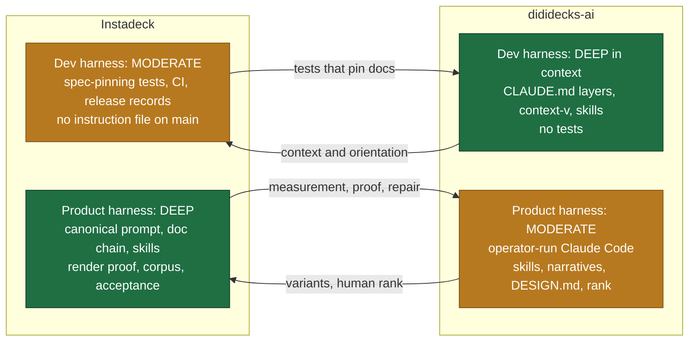
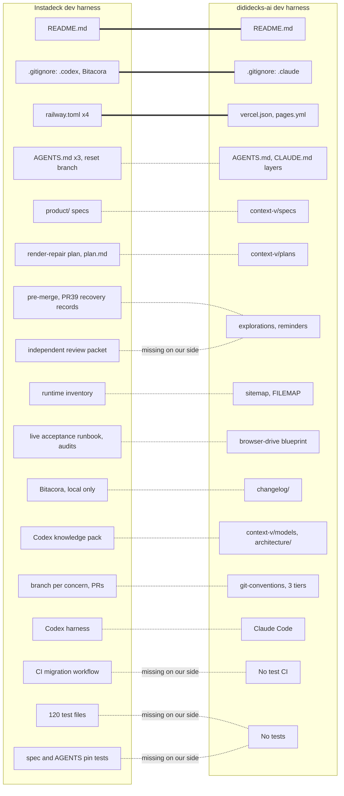
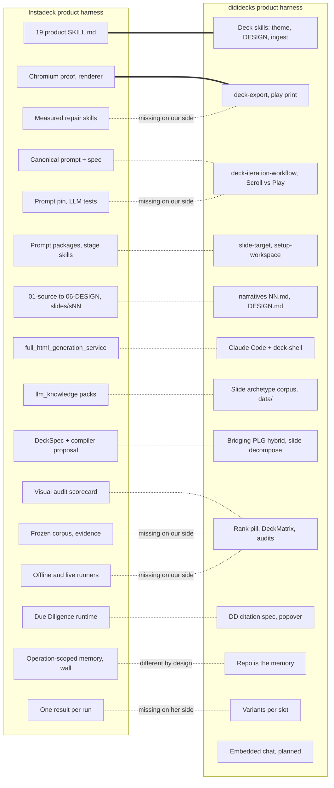
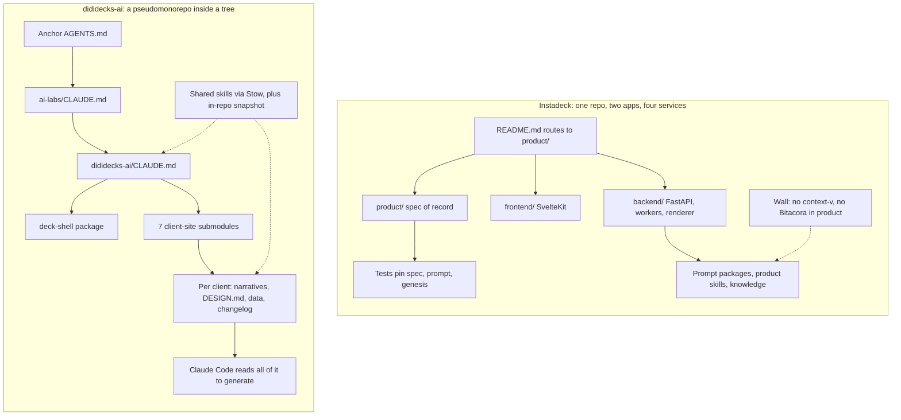
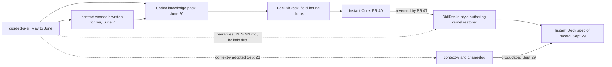
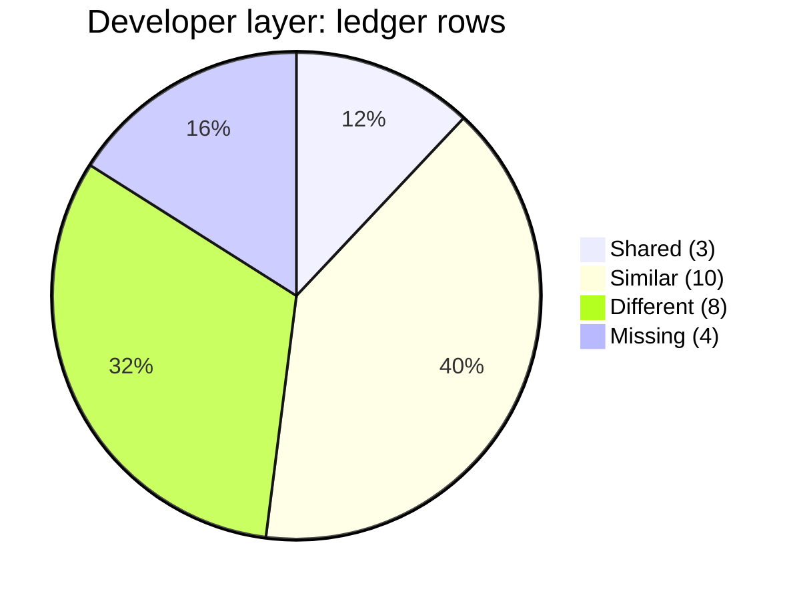
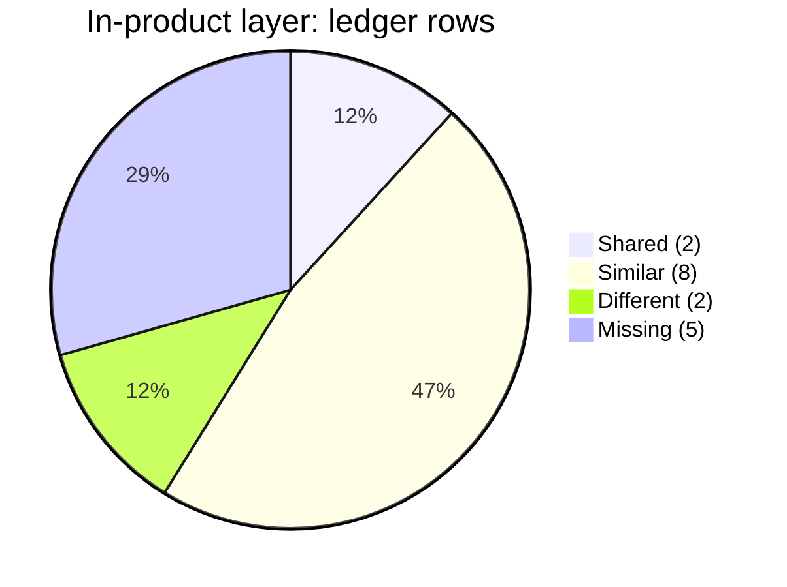

# Compare and Contrast Harness Artifacts: Instadeck and dididecks-ai

Step 2 of 3. The plan is
[[Compare-Contrast-Harness-like-Artifacts-between-Lossless-&-Collaborator]]
(`studies/context-v/plans/`). The method, including "Two harnesses, not
one", is in
[[Explore-Collaborator-Codebases-for-Insights-Comparative-Highlights]]
(`studies/context-v/explorations/`). The evidence for Instadeck's side is
[[01-Harness-Evidence__phoenixcapera]] (step 1, in this folder). Row numbers
such as "#38" refer to step 1's inventory table (§2a).

**Path conventions.** Instadeck paths are relative to `instadeck-v2/`.
Lossless paths are relative to `ai-labs/`, or start with `../` when they sit
at the anchor root (`lossless-monorepo/`). "Observed" means cited from a file
or commit. "Inferred" means reasoned, with the reasoning shown.

**The framing for this case.** Instadeck is phoenixcap's own full-stack
derivative of dididecks-ai. Michael asked for a version people could log into
and use, and she built one. Both products generate decks, so the in-product
comparison is direct: deck generation against deck generation. This document
analyzes the differences between the two approaches. It does **not** rank
them, and it doesn't say either product works better. For each difference it
says what each choice makes easier and what it makes harder. Lessons run both
ways, framed as what each side could borrow. Where a rating appears (the
layer map), it describes how much harness exists in a layer, not how good the
product is.

## 1. Highlights

- **The headline: each side put its depth where its generator lives.**
  dididecks-ai generates decks *inside a Claude Code session* run by an
  operator, so its developer harness is **deep** and doubles as most of its
  product harness, which is **moderate**: written method, no automated runs.
  Instadeck generates decks *inside a server pipeline* that a customer
  starts, so its product harness is **deep**. Its developer harness is
  **moderate**, and she walled it off from the product on purpose.
- **She turned our memory into product, deliberately.** Instadeck adopted
  Lossless's `context-v/` and `changelog/` on 2026-09-23 and removed them on
  09-29 in "refactor: productize creative memory". The useful part, persistent
  creative memory, became operation-scoped database records
  (`product/PRODUCT_GENESIS.md`), and a test now forbids the folders
  (`backend/tests/test_product_surface_specs.py`). On our side the repo *is*
  the generator's memory. Both choices are coherent. Ours makes the memory
  cheap to grow and easy for an agent to read; hers makes it per-customer,
  typed and safe to expose to strangers.
- **The two generators converged on the same creative method.** Both write
  the deck as Markdown before rendering it: per-slide files with typed
  frontmatter (`client-sites/calmstorm-decks/context-v/narratives/NN-*.md`
  against `slides/sNN.md`), and a per-deck `DESIGN.md` (ours via the
  `maintain-design-md` skill, hers as `06-DESIGN.md`). Both reason about the
  whole deck before any single slide. She tried a simpler path and reversed
  it: PR 40 "Instant Core" was undone by PR 47 because it "bypassed … the
  DidiDecks-style authoring kernel" (`docs/INSTANT_DECK_PR39_RECOVERY.md:5`).
- **Verification is where Instadeck goes deeper, in both layers.**
  dididecks-ai has no tests, and its only workflow deploys the splash page.
  Instadeck has 120 backend test files, tests that pin specs and the runtime
  prompt byte for byte, a frozen render corpus, a read-only live acceptance
  runner, and a written rule that "technically valid" is not success (spec
  §2.1, §21).
- **Context is where dididecks-ai goes deeper.** dididecks-ai has a
  133-line `CLAUDE.md`, 9 data-model docs written *for her* when she was
  designing the database, a 29-file living sitemap, 15 plans and 17 changelog
  entries, plus the tree's shared skills and corpus. Instadeck's `main` has
  had no instruction file since 2026-09-29; a shorter reset set waits on a
  branch with a test that pins it.
- **The stacks answer different users.** Instadeck is a multi-tenant SaaS
  (SvelteKit, FastAPI, Postgres with pgvector, durable workers, a separate
  Chromium renderer, Railway) where the *author* signs in. dididecks-ai is a
  set of per-client Astro sites on Vercel, plus a shared shell package, where
  the *reader* signs in and git is the content store. Section 4.7 onward
  covers what each makes easier and harder.
- **Skills cross layers in opposite directions.** We use `SKILL.md` files in
  the dev layer, and they also steer deck generation because the generator is
  Claude Code. She runs 19 `SKILL.md` files *inside the product*, loaded by a
  registry that whitelists tools
  (`backend/app/services/ai_vc/skills/registry.py`). Same format, different
  runtime.
- **Our own drift shows up here too.** Five of the 18 skills in
  dididecks-ai's in-repo snapshot differ from the anchor copies, and one
  (`setup-new-dddecks-workspace`) exists only in the snapshot. Her prompt
  test is a direct answer to that kind of drift (Recommendation L1).

## 2. Snapshot

| Repo | SHA | Branch | Last commit | What was compared |
|---|---|---|---|---|
| Instadeck (`instadeck-v2`) | `e3c6e65` | `main` (= `origin/main`) | 2026-10-02 | All 44 rows of step 1's inventory at HEAD and its 8 off-HEAD rows. Rechecked: `product/PRODUCT_GENESIS.md`, `product/INSTANT_DECK_PRODUCT_SPEC.md` §7–8, §12, §15, §21, `backend/tests/test_product_surface_specs.py`, `test_instant_deck_canonical_product_spec.py`, `backend/app/services/ai_vc/skills/`, `backend/pyproject.toml`, `backend/railway*.toml`, `backend/.env.example` (names only), `frontend/package.json`, `frontend/src/routes/`, the knowledge pack under `backend/llm_knowledge/dididecks_architecture_runtime_knowledge_pack/` |
| `dididecks-ai` | `6ed2a26` | `development` (clean) | 2026-10-02 | `CLAUDE.md`, `README.md`, `FILEMAP.md`, `package.json`, `pnpm-workspace.yaml`, `vercel.json`, `.gitignore`, `.github/workflows/pages.yml`, `architecture/`, `context-v/` (all 70 non-skill files by name; specs, models, explorations and sitemap read in part), `context-v/agent-skills/` (19 `SKILL.md`, README), `changelog/` (17), `apps/deck-shell/`, `apps/frontend/` (docs and server layer), `packages/deck-export/`, `packages/shared/`, git history (111 commits) and remote branch names |
| `client-sites/calmstorm-decks` | `3317749` | `development` | 2026-10-01 | `package.json`, `db/config.ts`, `DESIGN.md`, `context-v/narratives/` (17), `changelog/` (21), `scripts/` |
| `client-sites/chroma-decks` | `1e4d578` | detached | 2026-08-18 | `package.json`, `vercel.json`, `DESIGN.md`, `context-v/` |
| `ai-labs` | `8b8e129` | `main` | 2026-10-03 | `CLAUDE.md`, `studies/CLAUDE.md` |
| Anchor tree layer | `lossless-monorepo` `0b44635e` (`development`); `lossless-agent-skills` `2efb98a` | | | `../AGENTS.md`, `../context-v/agent-skills/` (diffed against the dididecks snapshot), `../context-v/blueprints/Browser-Drive-Verification-For-Agent-Sessions.md`, `../context-v-corpus/README.md` |

**Not read:** the five other dididecks client-sites and the `corpus`
submodule (`dddecks-corpus`) are not cloned, per the brief. The corpus is
described from `changelog/2026-06-09_01.md`. The Chroma MCP server was down
for this run, so the corpus over past sessions is described, not queried.
In `ai-labs`, the `dididecks-ai` gitlink shows as modified (recorded
`ebab591`, checked out `6ed2a26`); that was the state before this run.

**A shared history worth knowing first.** The two codebases are not strangers.

- On 2026-06-07, Michael added `context-v/models/` to dididecks-ai because "a
  collaborator is designing a remote database and has been guessing at
  shapes" (`context-v/models/README.md`). The same day,
  `context-v/explorations/Bridging-PLG-Self-Serve-with-Previous-Approach.md`
  recorded the core disagreement: her model, "slide = row in a database",
  against his, "slide = `.astro` component file, emitted by an agent", and
  proposed a hybrid: a structured spec row compiled deterministically into a
  component.
- On 2026-06-08 and 06-09, phoenixcap committed the SvelteKit product shell
  into dididecks-ai: `apps/frontend/` (308 files, an in-memory mock backend),
  `packages/shared/`, `architecture/DidiDecks-Frontend-And-Backend-Split.md`
  and the README's "Frontend / Backend Split" section (commits `3e6a58c` to
  `ef40a9e`). Nobody has touched those paths since.
- On 2026-06-20 she wrote the Codex knowledge pack that restates the
  dididecks model as build briefs (#42). On 2026-08-24 Instadeck's `main`
  starts from an import of two earlier repos.

So "the Lossless side" contains some of her work, and "her side" restates
some of ours. Section 4.11 maps what she carried over and what she changed.

**Shape of each side.** Instadeck is one repo holding two apps (a SvelteKit
`frontend/` and a FastAPI `backend/` with workers and a renderer), deployed as
separate Railway services. dididecks-ai is a pnpm workspace that sits inside
the `ai-labs` pseudomonorepo, which sits inside the anchor monorepo. It holds
an Astro integration (`apps/deck-shell`, published as
`@lossless-group/dididecks-shell` v0.4.0), her SvelteKit shell
(`apps/frontend`), an export CLI (`packages/deck-export`), and seven client
deck sites as submodules, each its own repo and its own Vercel deploy.

## 3. Layer map

| | Developer-agents harness | In-product-agents harness |
|---|---|---|
| **Instadeck** | **Moderate.** Rigorous where it bears on correctness: a spec of record with change control, contract tests that pin docs and the runtime prompt, one CI workflow running about 27 named test files, dated gate, rollback, pre-merge and review records, one branch per concern. Thin where it bears on orientation: no instruction file on `main` since 09-29 (a reset set waits on a branch), no checked-in session log, no dev skills, two inert workflows. | **Deep.** A canonical prompt that a test keeps identical to the spec, a persisted Markdown document chain with hashes, 19 product `SKILL.md`s plus two typed skill catalogues, failure-driven repair skills, a frozen render corpus, offline and live acceptance runners, durable jobs with lineage, and a written rule that technical validity is not creative success. |
| **dididecks-ai** | **Deep in context, thin in verification.** Inherits the tree's layered `AGENTS.md`/`CLAUDE.md`, shared skills (Stow), `context-v`, changelog and git conventions, and the corpus. Its own `CLAUDE.md` (133 lines), 70 `context-v` files (specs, 15 plans, 9 data models, a 29-file living sitemap), 17 changelog entries, a filemap loop. But no tests anywhere in the repo, and CI only deploys the splash. | **Moderate.** The generator is Claude Code run by an operator. Its method is written down: `deck-iteration-workflow`, `slide-target`, the Scroll-UI/Play-UI rule in `CLAUDE.md`, per-slide narratives and a `DESIGN.md` per client, a shell with an in-place ranking pill and a review matrix, an export CLI that drives Chromium, a slide-archetype corpus. Nothing runs without an operator, and nothing measures output. |

**Why "moderate" for our product layer and not "thin".** This is the main
judgement call in the map. dididecks-ai has no runtime prompt, no model
call, no evaluation and no tests in the product. By the standard of an
automated pipeline it is thin. But its product *is* a coding-agent session,
and that session's harness is substantial: about 4,500 lines of skills, a
per-deck design contract, a review surface and an export path. "Moderate"
credits the written method and flags the missing measurement. A reader who
counts only automation should read it as thin.

**Does the headline hold?** Yes, with a twist the dialogiq case didn't have.
On our side the two layers share a carrier. Claude Code, the skills and
`context-v/` serve both the developer and the deck generator, so sorting by
*purpose* matters more than usual: `git-conventions` is dev, while
`deck-iteration-workflow` is product, though both load the same way. On her
side the layers are separated by design, down to a test that keeps operator
notes out of product context (`backend/tests/test_bitacora_product_boundary.py`).

## 4. Diagrams

### 4.1 Layer map

### 4.2 Harness map: developer-agents layer

Thick links join **shared** artifacts. Dotted links join **similar** ones.
Labelled links mark a **missing** counterpart. Row IDs refer to §5.0.

### 4.3 Harness map: in-product-agents layer

### 4.4 Developer loops

**Instadeck** (from step 1 §4) and **dididecks-ai** (from `CLAUDE.md`,
`../AGENTS.md`, the `changelog-conventions` and `git-conventions` skills, and
the history: 111 commits on `development`, 99 `Co-Authored-By: Claude` trailers,
no PR merges).

```mermaid
flowchart TD
  subgraph IL["Instadeck developer loop"]
    I1["Spec or dated decision in product/ or docs/"] --> I2["Brief Codex: prompt pack or one-off brief"]
    I2 --> I3["One branch per concern"]
    I3 --> I4["Contract tests, frozen corpus"]
    I4 --> I5["CI: about 27 named test files, build"]
    I5 --> I6["PR, squash or merge to main"]
    I6 --> I7["Gate, rollback, review records"]
    I7 --> I8["Railway deploy, migrations first"]
    I8 -.->|"simplify or restore"| I1
  end
  subgraph DL["dididecks-ai developer loop"]
    D1["Exploration or spec in context-v"] --> D2["Plan per phase"]
    D2 --> D3["Claude Code loads CLAUDE.md layers + skills"]
    D3 --> D4["Implement in shell or client-site"]
    D4 --> D5["Browser walk, no automated tests"]
    D5 --> D6["Changelog entry, sitemap status flip"]
    D6 --> D7["Commit to development per git-conventions"]
    D7 --> D8["Bump client-site pointers, publish shell"]
    D8 --> D9["Vercel deploys each site, Pages deploys splash"]
    D9 --> D1
  end
```

### 4.5 In-product loops: two deck generators

**Instadeck** (step 1 §4, spec §5–§15) and **dididecks-ai**
(`deck-iteration-workflow`, `slide-target`, `CLAUDE.md` "The workflow this
implies", `/api/slide-rank`, `/api/slide-decompose`, `packages/deck-export`).
Nodes in the same row do the same job.

```mermaid
flowchart TD
  subgraph IG["Instadeck: customer uploads, pipeline generates"]
    G1["Upload PDF or PPTX, deterministic extraction"] --> G2["Source design review, BrandDNA"]
    G2 --> G3["Bounded research, AI-VC skills"]
    G3 --> G4["Investor story, redesign plan"]
    G4 --> G5["06-DESIGN.md"]
    G5 --> G6["slides/sNN.md"]
    G6 --> G7["Whole-deck HTML, compile"]
    G7 --> G8{"Chromium proof"}
    G8 -->|"fail"| G9["Measured failure, repair skill"]
    G9 --> G7
    G8 -->|"pass"| G10["Publish immutable DesignVersion, export"]
  end
  subgraph LG["dididecks-ai: operator drives Claude Code"]
    L1["Source deck, brief, call notes into corpus"] --> L2["Brand import, DESIGN.md"]
    L2 --> L3["crawl-fetch-ingest: people, companies"]
    L3 --> L4["Narrative per slide: NN-slug.md"]
    L4 --> L5["Phase 1: whole deck as one Scroll-UI page"]
    L5 --> L6{"Human ranks each slot in place"}
    L6 -->|"weak"| L7["New variant, slide-target pass"]
    L7 --> L5
    L6 -->|"strong"| L8["Phase 2: recreate as Play-UI 16:9 file"]
    L8 --> L9["deck-export: PNG, PDF, PPTX, Keynote"]
  end
```

The two loops have the same spine: source, brand, research, narrative,
design contract, whole deck, per-slide files, render, export. They differ in
who closes the loop. Hers closes on a machine measurement (Chromium proof)
and a bounded repair. Ours closes on a human verdict (the rank pill) and a
new variant.

### 4.6 Shape against harness

On her side the instructions converge on one file of record per surface, and
tests keep code and docs from drifting apart. On ours, instructions are
layered by tree level, and the per-client folders are both documentation and
the generator's working memory.

### 4.7 Stack against harness

Read from manifests and entry files at the snapshot SHAs. Theirs:
`frontend/package.json`, `backend/pyproject.toml`, `backend/railway.toml`,
`railway.worker.toml`, `railway.renderer.toml`, `frontend/railway.toml`,
`backend/alembic/versions/` (83 files), `backend/alembic_ai/versions/` (6),
`backend/app/workers/` (about 19 worker modules),
`backend/app/services/deck_processing/workflow_jobs.py`, `.env.example`
(names only). Ours: `package.json`, `pnpm-workspace.yaml`, `vercel.json`,
`apps/deck-shell/package.json`, `apps/frontend/package.json` and
`svelte.config.js`, `packages/*/package.json`, the two client-sites'
`package.json` and `db/config.ts`.

| | Instadeck | dididecks-ai |
|---|---|---|
| Shape | One repo, two apps; API, worker, renderer and frontend as separate Railway services | pnpm workspace: Astro integration, SvelteKit shell, export CLI, shared types, seven client sites as submodules |
| Front end | SvelteKit 2, Svelte 5, `adapter-node`, zod; routes for sign-up, sign-in, dashboard, decks, versions, export, shared decks | Client sites: Astro 6, Tailwind 4, `@astrojs/vercel`. Shell: Astro 7 integration on GitHub Packages. Her `apps/frontend`: SvelteKit 2 on Vercel with an in-memory mock backend ("Data may reset between server restarts", `src/lib/server/dididecks/repository.ts`) |
| Back end | FastAPI, SQLAlchemy 2, Pydantic 2, two Alembic lineages, LangGraph and LangChain, PyMuPDF, Playwright, OpenTelemetry | None as a service. Dev-only Astro routes (`/api/slide-rank`, `/api/slide-decompose`) write into the client site's working tree; client-site middleware for auth |
| Data | Postgres with pgvector; a job queue on Postgres (`with_for_update(skip_locked=True)`, `workflow_jobs.py:877`); S3-compatible object storage | Git is the content store: TypeScript registries, Markdown with frontmatter, `data/audits/slides.json`. Auth and reader telemetry in `astro:db` (libSQL locally, Turso remote). Migration off `astro:db` is planned (`context-v/plans/Migrate-Off-AstroDB-and-Bump-Shell-to-Astro7.md`, Draft) |
| Auth | Accounts with email and password, JWT, workspaces, admin bootstrap; author-facing | Per-deck reader gating: passcode tiers, minted single-use links, OAuth through `arctic`, magic links (`Identity`, `Session`, `MintedToken` tables). Authors are operators with repo access |
| Hosting and deploy | Railway: pre-deploy runs both migration lineages, health check at `/api/health/product-ready`, restart on failure; a written deployment gate and rollback record | Vercel per client site from a git push; GitHub Pages for the splash; shell versions published to a private registry and bumped per consumer |
| Models | OpenAI as the single product provider (reset `AGENTS.md`); earlier routing across four providers kept on an archive branch | Claude through Claude Code, at author time. The spec plans embedded Claude chat with bring-your-own keys (`Dididecks-AI-Slide-Decks-as-Code.md`, "Embedded Claude Chat") |
| Export | Render-proven HTML, publication of an exact `DesignVersion`, export service | `packages/deck-export`: Playwright drives a running site to @2x PNG, outlined SVG, vector-text PDF, PPTX and real Keynote (`changelog/2026-08-22_01.md`) |

**What her stack makes easier.** *For users:* anyone can sign up, upload a
deck and come back to it; results persist per account and per version, and
nobody needs a repo, a terminal or an operator. *For agents:* typed
boundaries everywhere (Pydantic `extra="forbid"`, JSON Schemas for model
output, versioned contract names) give an agent contracts to read and tests
to run; a migration history tells it what the data looks like.

**What it makes harder.** *For users:* the product decides the pipeline; a
user who wants a slide that no stage contract anticipates waits for Smart
Edit or Smart Deck. *For agents:* four services, two migration lineages and
coordinated deploy order are a lot to hold at once, which is why the
deployment gate and rollback record exist. A 10,982-line generation service
(#40) is expensive for an agent to load. Every product change has to be
safe for strangers' data, so many changes need paperwork.

**What our stack makes easier.** *For users:* each deck is its own site, with
its own brand, URL and access rules; a reader gets a link and a passcode, not
an account. Anything a designer can build in Astro can appear on a slide.
*For agents:* Astro components and Markdown are what models write well; the
whole deck is plain files an agent can read, diff and revert; there are no
migrations for content and no shared database to break.

**What it makes harder.** *For users:* nobody outside the team can make a
deck alone. The spec says it directly: the managing partner "will not open a
terminal" (`Dididecks-AI-Slide-Decks-as-Code.md`). Authoring needs an
operator and a build. *For agents:* seven consumers of one shell across Astro
6 and 7, submodule pointers to bump, and a published package to version; and
Play-UI, the surface that ships, is the one `CLAUDE.md` says Claude is "bad
at".

### 4.8 Data: Postgres records against files in git

Each fits who owns the content. Hers is multi-tenant: many users, each
uploading private decks, each run producing immutable versions with lineage.
Ours is engagement-shaped: a handful of clients, each with a team that
iterates on a few decks for weeks.

| | Postgres (Instadeck) | Files in git, plus libSQL for auth (dididecks-ai) |
|---|---|---|
| Unit of content | A row: deck, operation, working document (with a SHA-256 of its Markdown), `DesignVersion` | A file: `src/data/slides.ts` slot, `context-v/narratives/NN-slug.md`, `src/components/slides/{variant}/{slot}-{slug}.astro` |
| History | Explicit lineage records; publication never rewrites a prior version (spec §15) | Git history; variants kept side by side; `/api/slide-decompose` refuses to overwrite (409) |
| Isolation between customers | Workspaces in one database | One repo and one deploy per client |
| What an agent sees | Whatever the API and tests expose; production data is out of reach by design | Everything in the client folder, including prior decisions |
| Search | pgvector in the same database; a bounded design-memory retrieval is specified (spec §12) | The Chroma corpus outside the product, for the operator's agent |
| Cost of change | Migrations, deploy order, rollback planning | Edit a file, commit, push |

**What each makes easier.** Records make per-user persistence, sharing,
quotas and audit natural, and they make it possible to prove what produced a
given slide. Files make iteration cheap, let an agent work with full context,
and keep every abandoned idea one `git log` away.

**What each makes harder.** Records make ad hoc creative work harder to
express: every new kind of artifact needs a schema, a migration and a test.
Her own spec warns against this: "Before adding a new schema, planner,
selector, registry, or state object, prove that the same requirement cannot
be represented clearly in the working Markdown documents"
(`product/SMART_DECK.md:613ff`). Files make multi-tenancy, self-serve and
access control harder, which is why our auth already lives in a database and
why `context-v/models/` sketches a remote one.

### 4.9 Architecture: one repo of services against a tree of client sites

Her repo is a modular monolith in source and a set of services at runtime.
Ours is a tree: a shared shell, many thin client repos, conventions above.

**What hers makes easier.** One place to look; one spec of record; one CI;
one PR shows everything a change touched. Tests can reach across the
front-end and back-end boundary (`test_product_surface_specs.py` reads specs,
routes and services in one test).

**What it makes harder.** Some files grow without a natural boundary (#40).
Workflows copied in with each app stopped running without anyone noticing
(#23, #24), because GitHub reads only the root `.github/workflows/`.

**What ours makes easier.** Client work stays isolated (separate repos,
access and deploys); the shell's generic parts are lifted out only after a
second client needs them (`context-v/plans/Lift-Chroma-Decks-Generic-Code-into-Shared-Shell.md`);
an agent working on one client loads only that client.

**What it makes harder.** A change to the shell reaches seven consumers
through a package version and seven pointer bumps. Instructions repeat at
each level and drift (section 5.1, "Drift noted"). Cross-cutting checks have
no single home, which is part of why there are none.

### 4.10 Failure isolation

**Hers.** API, worker and renderer are separate services, and the renderer
holds only a dedicated render key ("The preview-render service receives only
the dedicated render key, never WORKSPACE_AI_FERNET_KEY or provider keys",
`backend/.env.example`). Durable jobs survive restarts, a stale-job rescuer
exists (`backend/app/workers/stale_job_rescuer_worker.py`), and the spec
requires terminal failures to be visible (§21.1). The shared trunk is Postgres:
API, queue and lineage all depend on it.

**Ours.** Each client site is its own deploy, so one client's outage or bad
build doesn't touch another. The shell is a shared dependency, but each
consumer pins a version. There is no server-side generator to fail; the
failure mode is human: generation stops when no operator is at the keyboard,
and a deck can only be as current as the last session. Auth depends on
libSQL per site.

**For both sides.** Her trunk risk is one database; ours is one operator.
Neither is wrong for its stage. Each side's next step is the other's
strength: her product could keep a "last good" static export per deck that
serves when the API is down (our Vercel sites do that by construction), and
ours could let a reader-facing deck regenerate a slide without an operator
(her pipeline does that by construction).

### 4.11 Lineage: what she carried over and what she changed

From the Codex knowledge pack (#42, dated 2026-06-20) and Instadeck's spec,
against dididecks-ai at the time.

| Idea | dididecks-ai | Knowledge pack (June) | Instadeck (Sept) |
|---|---|---|---|
| Scroll and Play are different implementations, coupled by slot identity | `CLAUDE.md` "Naming is fuzzy here" | Carried over: "coordinated implementations, not the same implementation rendered twice" (`docs/07_review_surfaces_scroll_play_print.md`) | Changed: one render path (whole-deck HTML), proven in Chromium |
| Review matrix: slots by variants, surface status per cell; no "vacuous ready" | `DeckMatrix`, commit `257148a` "vacuous-Ready bug fixed" | Carried over almost word for word ("A variant cannot be marked ready if it has zero slides", `docs/07`) | Changed: a visual scorecard (#17) and a conformance ledger (spec §22) |
| Status taxonomy | sitemap status discipline (`changelog/2026-05-16_01.md`) | Carried over: Draft, Implementing, Partially-Shipped, Shipped (`json/status_taxonomy.json`), plus "Frontend shells with mock data are Partially-Shipped, not Shipped" | Changed: Implemented, Partial, Not proven (spec §22) |
| People and companies as data assets | `/data-assets/*` routes, `crawl-fetch-ingest` | Carried over (`docs/09_data_assets_layer.md`) | Changed: "real people remain real" as an acceptance check (spec §21.2) |
| Gated access to private decks | Passcodes, minted links, OAuth per site | Carried over (`docs/08_access_and_private_deck_safety.md`) | Changed: author accounts and workspaces |
| Frontend and backend split | Her `architecture/` doc and README section inside dididecks-ai | Carried over (`docs/02`, `docs/03`) | Built: SvelteKit plus FastAPI on Railway |
| Storage | Filesystem as database (`context-v/models/README.md`) | Changed: "a database-backed deck operating system" | Postgres, records per operation |
| Business fields | none | New: blocks bound to persistent fields, a field-usage map and rebuild jobs (pack README) | Not in Instant Deck's canonical path; the spec retires "historical complex RAG and architecture packs" from it (§12) |
| Authoring method | Holistic-first, Markdown narratives, `DESIGN.md` | Not in the pack | Re-converged: the Markdown document chain and `06-DESIGN.md` (spec §7–8), after PR 47 restored "the DidiDecks-style authoring kernel" |
| Memory | `context-v/`, changelogs, prior sessions | Not in the pack | Changed on purpose: "operation-scoped database records" (`PRODUCT_GENESIS.md`) |
| Agents | Claude Code, skills | Codex prompts, one at a time (`HOW_TO_USE_WITH_CODEX.md`) | Codex for dev; OpenAI for the product; 19 product `SKILL.md`s |

The arc is the most interesting finding of the study. The data model she
designed in June (business fields, rebuild jobs) is not what Instant Deck
runs. What it runs is closer to how dididecks decks are actually made:
Markdown per slide, a design contract per deck, whole-deck reasoning first.
She arrived there by building the simpler path, measuring it, and
reversing it.

### 4.12 Bucket counts per layer

Both layers are dominated by **similar**, which fits a shared lineage: the
same jobs, done in different forms. The **missing** rows run almost entirely
toward us (8 of 9), and all of them concern verification. The **different**
rows split evenly in the dev layer, four each way, which is where the two
silos' contexts differ most (her live multi-service SaaS, our tree of client
repos).

## 5. The four comparisons, layer by layer

### 5.0 The ledger

Every artifact in step 1's inventory (44 at HEAD, 8 off-HEAD) and every
Lossless artifact inventoried here sits in exactly one row. Step 1's nine
"both" rows (#2, #15, #16, #19, #20, #27, #29, #30, #31) are split into a dev
facet and a product facet, each placed in its own layer; three Lossless files
are split the same way (`dididecks-ai/CLAUDE.md`, the main spec, and the
Bridging-PLG exploration). Product code that isn't harness (her `frontend/`,
our `apps/frontend/`, `packages/shared/`, client-site auth scripts) is
covered in §4.7 rather than the ledger. No row pairs across layers.

**Developer-agents layer**

| ID | Bucket | Instadeck | dididecks-ai and the tree |
|---|---|---|---|
| D-SH1 | Shared | `README.md` (#1) | `dididecks-ai/README.md` |
| D-SH2 | Shared | `.gitignore` (#25), `backend/.gitignore` (#26): `.codex*`, `/.local-work/`, Bitácora | `dididecks-ai/.gitignore` (`.claude/`, `.env*`); `context-v/extra/` (gitignored by `context-vigilance`) |
| D-SH3 | Shared | `backend/railway*.toml`, `frontend/railway.toml` (#44) | `vercel.json` (root and client sites), `package.json`, `pnpm-workspace.yaml`, `.github/workflows/pages.yml` |
| D-SI1 | Similar | `AGENTS.md`, `backend/AGENTS.md`, `frontend/AGENTS.md` (to 09-29), the reset set on `refactor/product-ai-openai-boundaries` | `../AGENTS.md`, `ai-labs/CLAUDE.md`, `dididecks-ai/CLAUDE.md` (dev facet) |
| D-SI2 | Similar | `product/INSTANT_DECK_PRODUCT_SPEC.md` (#2, dev facet), `PRODUCT_GENESIS.md` (#3), `DDDECKS_PRODUCT.md` (#4), `SMART_DECK.md` (#5), `SMART_EDIT.md` (#6), `DUE_DILIGENCE.md` (#7), `docs/INSTANT_DECK_PRODUCT_SCOPE.md` (#12) | `context-v/specs/` (6, dev facets), `explorations/Dididecks-AI-Business-Model.md`; client-site `context-v/specs/` |
| D-SI3 | Similar | `docs/INSTANT_DECK_OFFLINE_FOUNDATION_2026-08-25.md` (#16, dev), `docs/instant-html-render-repair/README.md` (#19, dev), `plan.md` (off-HEAD) | `context-v/plans/` (15); `chroma-decks/context-v/plans/` (3) |
| D-SI4 | Similar | `docs/INSTANT_DECK_PREMERGE_DECISION.md` (#11), `RECOVERED_FIX_AUDIT.md` (#13), `PR39_RECOVERY.md` (#14), `PROMPT_SYSTEM_ARCHITECTURE_2026-08-25.md` (#15, dev) | `context-v/explorations/` (Plans-Inventory ×2, Chroma-Parity, Structural-Frontend, Chroma-Brand notes, Bridging-PLG dev facet), `reminders/` (2), `blueprints/` (2); client-site explorations |
| D-SI5 | Similar | `docs/INSTANT_DECK_RUNTIME_INVENTORY.md` (#10) | `context-v/sitemap/` (29), `FILEMAP.md`, `context-v/agent-skills/loops/maintain-filemap/` |
| D-SI6 | Similar | `docs/instant-html-render-repair/LIVE_ACCEPTANCE.md` (#20, dev), `backend/scripts/audit_*` and acceptance runners (#31, dev) | `../context-v/blueprints/Browser-Drive-Verification-For-Agent-Sessions.md`, the browser-drive block in `dididecks-ai/CLAUDE.md` |
| D-SI7 | Similar | `BITACORA.md` (tracked to 09-18, now local) | `changelog/` (17); `calmstorm-decks/changelog/` (21), `chroma-decks/changelog/` (7) |
| D-SI8 | Similar | `backend/llm_knowledge/dididecks_architecture_runtime_knowledge_pack/` prompts and `HOW_TO_USE_WITH_CODEX.md` (#42); `CODEX_DECK_REDESIGN_AUDIT_PROMPT.md` (off-HEAD) | `context-v/models/` (9), `architecture/DidiDecks-Frontend-And-Backend-Split.md`, `apps/frontend/docs/` (14; both of the last two authored by phoenixcap) |
| D-SI9 | Similar | Git history: about 70 single-purpose branches, PRs to #64, two title styles, 34 of 329 commits with bodies, no trailers (step 1 §3.7) | `../context-v/agent-skills/git-conventions/`; three tiers `development` → `main` → `master`; 111 commits, 99 Claude co-author trailers, no PR merges |
| D-SI10 | Similar | Codex as the coding agent (`codex/*` branches, `.codex*` ignores, the prompt pack), plus Railway's agent once (step 1 §3.2, §3.7) | Claude Code (trailers from Opus 4.7 to Opus 5.5 and Sonnet 5; skills via `~/.claude/skills`); no `.mcp.json` in dididecks-ai |
| D-DF1 | Different | `backend/tests/test_product_surface_specs.py` (#28); `test_bitacora_product_boundary.py` (#30, dev); `context-v/`, `changelog/`, `FILEMAP.md`, `scripts/maintain_instant_deck_context.py` (adopted 09-23, removed 09-29) | `../context-v/agent-skills/context-vigilance/`, `changelog-conventions/` (the conventions themselves) |
| D-DF2 | Different (hers) | `docs/INSTANT_DECK_DEPLOYMENT_GATE.md` (#8), `docs/INSTANT_DECK_ROLLBACK.md` (#9) | — |
| D-DF3 | Different (hers) | Patch transport through CI (step 1 §3.7) | — |
| D-DF4 | Different (hers) | Archive branches: `archive/pre-pivot`, `archive/multi-provider-orchestration-2026-09-29` | — |
| D-DF5 | Different (ours) | — | Pseudomonorepo rules: branch tiers, the relocation HARD STOP, submodule bumps (`../AGENTS.md`, `pseudomonorepos` skill); `.gitmodules` with seven client sites and the corpus |
| D-DF6 | Different (ours) | — | Shared skills library and Stow linking (`../context-v/agent-skills/`); the in-repo snapshot and its README (`context-v/agent-skills/README.md`) with the dev skills `git-conventions`, `pseudomonorepos`, `study-repos-first`, `maintain-splash-pages`, `open-graph-share-seo-geo`, `lossless-flavored-markdown`, `astro-knots` |
| D-DF7 | Different (ours) | — | Chroma corpus over context, changelogs and past sessions (`../context-v-corpus/`, `search-lossless-corpus`) |
| D-DF8 | Different (ours) | — | Publishing: frontmatter (`site_uuid`, `hex_code`, `publish`), `splash/` |
| D-MI1 | Missing, our side | `.github/workflows/instant-deck-migration.yml` (#22); inert `frontend/.github/…` (#23), `backend/.github/…` (#24) | *(only `pages.yml`, which deploys the splash)* |
| D-MI2 | Missing, our side | `backend/tests/` (#27, platform half) | *(no tests in dididecks-ai; `apps/deck-shell` has a `typecheck` script)* |
| D-MI3 | Missing, our side | `test_instant_deck_canonical_product_spec.py` (#29, dev); `test_repository_instruction_contract.py` (reset branch) | — |
| D-MI4 | Missing, our side | `docs/reviews/investor-quality-integration/` (#21) | — |

**In-product-agents layer**

| ID | Bucket | Instadeck | dididecks-ai |
|---|---|---|---|
| P-SH1 | Shared | `backend/app/services/ai_vc/skills/builtins/` (#35, 19 `SKILL.md`) | Deck skills in `context-v/agent-skills/`: `theme-system`, `loops/maintain-design-md`, `crawl-fetch-ingest`, `generate-consistent-og-images`, `overlay-svg-text` |
| P-SH2 | Shared | Chromium proof and renderer (`backend/app/instant_html_renderer.py`; step 1 §4 step 5) | `packages/deck-export/` (Playwright), `/play/[deck]/[variant]/print`, `SlideCanvas` |
| P-SI1 | Similar | `product/INSTANT_DECK_PRODUCT_SPEC.md` (#2, product facet: canonical prompt, stage contracts), `instant_deck_mvp_policy.py` (#33) | `deck-iteration-workflow/SKILL.md`; `dididecks-ai/CLAUDE.md` "Scroll-UI vs. Play-UI" (product facet) |
| P-SI2 | Similar | `backend/app/llm/prompt_packages/` (#34), `backend/app/products/instant_deck/skills.py` (#36) | `slide-target/SKILL.md` (first of a planned `slide-*` family), `setup-new-dddecks-workspace/SKILL.md` (stub) |
| P-SI3 | Similar | `working_documents.py`, `redesign_documents.py`, `source_design_review.py` (#38) | `calmstorm-decks/context-v/narratives/` (17) and `DESIGN.md` (592 lines); `chroma-decks/context-v/narratives/` and `DESIGN.md` |
| P-SI4 | Similar | `full_html_generation_service.py` (#40) | Claude Code under the deck skills, plus `apps/deck-shell/` (registry loader, Play runtime, `ScrollDeckPage`) |
| P-SI5 | Similar | `backend/llm_knowledge/` (#41) | `corpus` submodule (27 slide archetypes, `changelog/2026-06-09_01.md`); client `data/` people and companies; `/data-assets/*` routes |
| P-SI6 | Similar | `PROMPT_SYSTEM_ARCHITECTURE_2026-08-25.md` (#15, product: DeckSpec plus compiler), `OFFLINE_FOUNDATION_2026-08-25.md` (#16, product) | `explorations/Bridging-PLG-Self-Serve-with-Previous-Approach.md` (product facet: spec row compiled to a component); `/api/slide-decompose` ("recreate, don't extract") |
| P-SI7 | Similar | `docs/INSTANT_DECK_SEVEN_PRIMITIVE_VISUAL_AUDIT_2026-08-25.md` (#17) | `SlideRankPill`, `DeckMatrix`, `data/audits/slides.json`, `/api/slide-rank` |
| P-SI8 | Similar | `backend/app/workers/runtime/due_diligence_runtime.py`, `backend/app/services/deck_processing/due_diligence_warnings.py` (rechecked; not step 1 rows) | `specs/Dididecks-AI-DD-Ready-Citation-and-Source-Access.md` (product facet); shell citation popover (`ceb05d8`) |
| P-DF1 | Different | `test_bitacora_product_boundary.py` (#30, product: loader excludes operator logs); `backend/app/services/ai_vc/` operation-scoped memory (#39) | *(by design, the generator's context is the repo: see P-SI1, P-SI3)* |
| P-DF2 | Different (ours) | — | Embedded Claude chat in a local-first native app with a bundled skill pack (`Dididecks-AI-Slide-Decks-as-Code.md`, product facet); `specs/Cloud-Workspace-for-Dididecks.md` |
| P-MI1 | Missing, our side | `docs/evidence/` (#18), `backend/tests/fixtures/render_repair_acceptance/corpus.v1.json` (#32), `agent_regression.py` and related (#43) | — |
| P-MI2 | Missing, our side | `LIVE_ACCEPTANCE.md` (#20, product: 11 conditions), acceptance runners (#31, product) | — |
| P-MI3 | Missing, our side | Render-repair design (#19, product), `instant_html_render_repair_skills.py` (#37) | — |
| P-MI4 | Missing, our side | LLM-machinery tests (#27, product half), prompt pin (#29, product) | — |
| P-MI5 | Missing, her side | *(Instant Deck publishes one result per run; alternate treatments are a Smart Deck idea, `product/SMART_DECK.md`)* | Variants kept side by side per slot: client `src/data/decks.ts`, `src/data/slides.ts`; spec design principles 3 and 5 |

### 5.1 Developer-agents layer

**Shared.**

*READMEs (D-SH1).* Both route the reader elsewhere quickly. Hers sends
agents and people to `product/` and records the imported baseline SHAs and a
"release safety" rule. Ours lists the specs, the splash, the client sites and
the skills snapshot. Ours has drifted: it says "Website frontend active" of
`apps/frontend`, which is a mock-backed shell untouched since 2026-06-09.

*Agent scratch kept out of git (D-SH2).* Both ignore the coding agent's local
folder: `.codex/`, `.codex_tmp/` and `.codex-sessions/` on her side, `.claude/`
on ours. Hers goes further and ignores `/docs` and `/scripts` by default,
force-adding only the records she wants tracked, and labels Bitácora logs
"not product or agent context". That is a cleaner line than ours between
notes and record.

*Deploy config (D-SH3).* Ordinary on both sides. Hers carries policy in the
config: pre-deploy migrations, health checks and restart policy, with the
comment "API startup must not race migration" (`backend/railway.toml`).
Ours is small because static sites need little.

**Similar.**

*Instruction files (D-SI1).* Both built three levels. Hers were root,
`backend/` and `frontend/`; ours are anchor, `ai-labs` and `dididecks-ai`.
Her set contradicted itself (Qwen as default in `frontend/AGENTS.md`, OpenAI
in `backend/AGENTS.md`; "push to `main`" at the root). She removed it from
`main` on 09-29 and wrote a shorter reset that points everything at
`product/` and is pinned by a test. Ours contradicts itself in a different
way: `ai-labs/CLAUDE.md` and `studies/CLAUDE.md` still give a macOS path to
`context-v/skills/` and a sync script, while the anchor uses
`context-v/agent-skills/` and Stow on Linux. *Judgement: similar, not
missing.* Her `main` has no instruction file today, but that is a reset in
progress with its replacement on a branch, not an absence of the practice.
What each form gains: ours orients a cold agent in one read, including *why*
the work is shaped as it is ("Why we work this way"). Hers is shorter and
can't silently drift, because a test asserts its key sentences.

*Specs (D-SI2).* The richest pair in this layer. Her
`INSTANT_DECK_PRODUCT_SPEC.md` is a specification of record: a precedence
order for authority (§1), change control that requires "a concrete product
or acceptance failure … updated conformance tests … explicit product-owner
approval", a conformance ledger that rates each requirement "Implemented",
"Partial" or "Not proven" (§22), and a definition of done (§23). Our main
spec, `Dididecks-AI-Slide-Decks-as-Code.md`, is a north-star document:
design principles, the user, positioning, open questions, and placeholder
sections ("What This Spec Will Eventually Cover"). It is `status: Draft`,
`publish: false`, last updated 2026-05-11. Each form fits a stage. Ours keeps
the question open while the product is still being discovered across client
engagements. Hers closes questions so an agent can't reopen them by accident.
What hers costs: specs get rewritten rather than appended to, so earlier
reasoning survives only in archive branches. What ours costs: an agent can't
tell from the spec what has been decided.

*Plans (D-SI3).* Both write plans before code. Hers carry a status line in
the first lines ("Status: implementation plan only"), and the render-repair
plan names the regression tests each slice must add. Ours carry status in
frontmatter and phase structure, and several are tracked as done in later
explorations (`Plans-Inventory-2026-05-16.md`).

*Decision and audit records (D-SI4).* Her `docs/` holds dated records whose
first line says what they do **not** authorize: "not approved for merge",
"not deployment authorization", "research complete; implementation not
authorized". Our explorations and reminders record reasoning and loose ends
(`reminders/Auth-Loose-Ends.md`) but don't say what they withhold. Her
`PR39_RECOVERY.md` is a candid account of a reversal; we have no equivalent
record of a reversal in dididecks-ai.

*Living maps (D-SI5).* Her runtime inventory lists the mounted customer path
and says it "does not claim browser acceptance". Our `context-v/sitemap/` has
a file per route and component with typed frontmatter (`status`,
`mutates_files`, `consumed_by`, `plan_of_record`), and `FILEMAP.md` is
regenerated by a loop skill. Ours is far more detailed. Its last regeneration
was 2026-06-07, so it predates `packages/deck-export/` (2026-10-01).

*Verification runbooks (D-SI6).* Same job: tell an agent how to prove a
change in a real environment. Ours is a tree-wide blueprint for browser
drives with rules ("reads are unrestricted; writes only against the repo's
designated safe target"). Hers is product-specific and stricter: a read-only
runner against production with a hard exit rule ("Do not call the release
complete unless the command exits zero").

*Session memory (D-SI7).* Her Bitácora was a dated work log, "Persistent
record requested by the user", with costs per run and accepted canaries. It
went local-only on 09-18. Our changelog is checked in, structured and rolled
up into splash pages. Hers kept the log close to the operator and out of
every agent's context; ours makes it shared and searchable, and also makes
it part of what the deck agent reads.

*Architecture briefs for a builder (D-SI8).* A mirror image. We wrote
`context-v/models/` (9 files) so the collaborator designing the database
"stops guessing at shapes". She wrote the Codex pack (#42) to brief Codex on
the dididecks model, with schemas, a SQL blueprint, drift rules, verifier
scripts and status templates. She also wrote `architecture/` and
`apps/frontend/docs/` inside dididecks-ai. These documents were the real
interface between the two silos. Ours describe what exists; hers prescribe
what to build and include scripts to check it.

*Git history (D-SI9).* Both are agent-written. Hers uses one branch per
narrow concern, PRs and squash merges, with long specific titles and few
bodies. Ours commits straight to `development` with typed headers
(`feat(deck-shell): …`, `bump(submodule, …)`) and bodies per
`git-conventions`, and records the model in a trailer. Hers makes a change
reviewable as a unit; ours makes the reasoning readable in `git log`.

*Coding harness (D-SI10).* Codex on her side, Claude Code on ours. Her
artifacts show Codex-specific habits: "Use one prompt at a time. Do not ask
Codex to implement the entire product at once" (`HOW_TO_USE_WITH_CODEX.md`),
fixed status templates for reports, and a CI patch-transport workaround for
an environment that couldn't push a large diff. Ours show Claude Code habits:
skills loaded by description, `CLAUDE.md` layering, MCP for the corpus and
browser. Neither is tied to its tool: her pack would brief Claude Code as
well, and our skills follow the open Agent Skills format.

**Different.** Each needs a reason.

- **Repo memory as product memory, refused (D-DF1).** The deliberate
  counter-choice of this study. She adopted `context-v/`, `changelog/` and a
  filemap skill on 09-23 ("establish Lossless context discipline") and
  removed them on 09-29. Her reasons, in her words: these "were techniques
  accumulated while trying to make LLM redesigns more consistent. They were
  not all first-class SaaS product requirements" and "Instant Deck inherits
  the spirit of AI Labs' context discipline, not its full local-agent
  infrastructure" (`PRODUCT_GENESIS.md`). The test enforces it.
  *What her choice makes easier:* customer runs can't be steered by operator
  notes; the product's memory is per customer and typed; a new agent can't
  mistake history for authority (her spec ranks "Git history and ignored
  local reference material as historical evidence only"). *What it makes
  harder:* development reasoning now lives in PR titles, dated `docs/` and a
  local log; a cold coding agent has less to read. *What ours makes easier:*
  one place for both kinds of memory, cheap to add, readable by any agent,
  and it compounds across clients. *What ours makes harder:* an agent can
  treat an old exploration as current, and nothing separates a customer's
  confidential notes from the method. *Judgement: different, both fit.*
  Hers serves strangers' data; ours serves a team's own engagements.
- **Release paperwork (D-DF2, hers).** A deployment gate and a rollback
  record with per-service image identities. Her product runs migrations and
  four services against customer data; ours deploys static sites with
  one-click rollback on Vercel. *Different.*
- **Patch transport through CI (D-DF3, hers).** A workaround for her agent
  environment. We push directly. *Different.*
- **Archive branches (D-DF4, hers).** Pivots preserved as branches rather
  than files. We keep abandoned designs in the tree as variants. *Different.*
- **Pseudomonorepo rules, shared skills library, corpus, publishing (D-DF5 to
  D-DF8, ours).** These exist because of our shape: seven client repos under
  one product, inside a 27-project tree, with parallel sessions and public
  splash pages. A single repo with one product owner doesn't need them.
  *Different.* Note one cost they impose on us here: the in-repo skills
  snapshot exists so collaborators "make sure their skills are current", and
  it has drifted (below).

**Missing (all on our side).**

- **CI that runs tests (D-MI1) and tests at all (D-MI2).** dididecks-ai has
  none. The shell has shipped at least four versions (v0.1.0, v0.2.0, v0.3.1,
  v0.4.0) to seven consumers with typecheck as the only automated check. Her one workflow
  runs about 27 named test files with "no paid calls", the offline repair
  corpus, a frontend test and the build. *Judgement: missing.* A shared
  package with seven consumers is exactly where a test pays.
- **Tests that pin documents (D-MI3).** Her tests assert that the spec, the
  genesis doc and (on the reset branch) the instruction files still say what
  they must, and that the prompt in the spec equals the runtime prompt. We
  rely on discipline and frontmatter. *Judgement: missing.* Our drift (below)
  is the evidence.
- **An independent review packet (D-MI4).** A folder with acceptance, a code
  map, redacted logs and screenshots, headed "unfinished implementation. Do
  not merge or deploy this snapshot". dididecks-ai has no handoff or review
  folder. *Judgement: missing, low priority.* It matters most when a second
  person or agent picks up unfinished work, which is the situation this study
  is about.

**Drift noted in dididecks-ai (not fixed, per the drift policy).**

- `CLAUDE.md` lists two submodules; `.gitmodules` has seven client sites and
  the corpus. It also says the canonical skills are at
  `lossless-monorepo/context-v/skills/` (now `context-v/agent-skills/`).
- `README.md` says "Website frontend active" of a mock-backed shell untouched
  since 06-09.
- `architecture/DidiDecks-Frontend-And-Backend-Split.md` links to
  `../deck-saas/docs/…`, `backend.md` and `api/didideckapi.md`, none of which
  exist in this repo.
- The skills snapshot differs from the anchor in five skills
  (`changelog-conventions` 128 changed lines, `context-vigilance` 167,
  `pseudomonorepos` 25, `git-conventions` 25,
  `generate-consistent-og-images` 2). `setup-new-dddecks-workspace` exists
  only in the snapshot and isn't linked into `~/.claude/skills`, so no
  session on this machine can load it.
- `FILEMAP.md` was last regenerated 2026-06-07.
- The root `frontend/` folder (an `index.html` and `public/`) and
  `apps/frontend/requirements.txt` have no clear role.

### 5.2 In-product-agents layer

**Shared.**

*Agent Skills as domain know-how (P-SH1).* Both use the `SKILL.md` format with
YAML frontmatter, and both use it for craft rather than plumbing: hers for VC
analysis and slide craft (`ic-critique`, `saas-economics`,
`visual-storytelling`, `why-now`), ours for brand, design contract, ingest and
imagery. The difference is the runtime. Hers are loaded by her own registry,
which caps size at 64 KB, requires the name to match the folder and rejects
any tool outside a whitelist of five
(`backend/app/services/ai_vc/skills/registry.py`), and are scoped to pipeline
phases (`phases: [narrative, visual]`). Ours are loaded by Claude Code when
the description matches the request. Hers are short (271 lines for 19) and
imperative ("Never visualize an unsupported number"); ours are long and
explain why. Hers can't wander; ours can adapt to a request nobody planned
for.

*Chromium as the judge of a slide (P-SH2).* Both treat a headless browser as
the final word on what a slide looks like. Hers proves every render before
publication and measures geometry and asset visibility (spec §14, §21.1).
Ours uses Playwright to export: `deck-export` drives a running site to PNG,
SVG, PDF, PPTX and Keynote, and the Play-UI rule ("No responsive CSS. No JS
in the slide itself") exists so that export is faithful. Hers uses the
browser to *check*; ours uses it to *produce*.

**Similar.** Most of this layer, which fits a shared lineage.

*The generator's contract (P-SI1).* Her canonical prompt lives in the spec
and in `instant_deck_mvp_policy.py`, and a test keeps them identical. The
default user intent is one line: "Make this deck much better." Our
equivalent is `deck-iteration-workflow` plus the Scroll-UI/Play-UI section of
`CLAUDE.md`, which together tell Claude how to build a deck: whole narrative
on one page first ("Holistic before piecewise"), then per-slide Play-UI
files, recreated rather than extracted. Hers is fixed per release and
customer-safe. Ours is a method an operator adapts per client, and it
explains its reasons, including the model's weakness ("This is the surface
Claude is **bad at**").

*Per-task prompts (P-SI2).* Her prompt packages (nine, each with an output
schema) and a typed catalogue of about 30 stage roles map onto our
`slide-target` (assemble the context for one slide and keep work scoped to
it) and the `setup-new-dddecks-workspace` stub. Hers are complete and
typed. Ours are the start of a family (`slide-improve`, `slide-rank`,
`slide-decompose` are named but not built).

*The Markdown document chain (P-SI3).* The strongest convergence. Her chain:
`01-source.md`, `02-source-design-notes.md`, `03-industry-research.md`,
`04-investor-story.md`, `05-redesign-plan.md`, `06-DESIGN.md`, then
`slides/sNN.md`, where each slide file is "creative source plus typed front
matter" (spec §7.7). Ours: per-slide narrative files with typed frontmatter
(`calmstorm-decks/context-v/narratives/05-problem-intro.md` has
`slide_number`, `slug`, `section`, `headline`, `subhead`, `columns`) and a
per-client `DESIGN.md` (Google Stitch format with Lossless extensions, 592
lines for calmstorm). Her spec names the principle we never wrote down:
"Markdown is not factual authority … Strong typing is required at
safety/execution boundaries" (§8). What hers adds: earlier stages as named
files (source notes, research, story, plan), hashes, and evidence IDs per
slide. What ours adds: the files persist across weeks of iteration and many
variants, not one run. *Inferred:* the name `06-DESIGN.md` echoes our
`DESIGN.md` convention; the repo doesn't say so.

*The generator (P-SI4).* Hers is a service: `full_html_generation_service.py`
(10,982 lines) authors whole-deck HTML, compiles, validates and repairs. Ours
is Claude Code working in a client repo, with `apps/deck-shell` providing the
registry, Play runtime and review chrome. Hers runs unattended for any
customer at any hour, and costs a large, hard-to-load file. Ours can do
anything Astro can render, and needs an operator for every change.

*Knowledge (P-SI5).* Her `llm_knowledge/` holds 195 files of deck
archetypes, VC methodology, due diligence and investor visual design. Ours
holds 27 slide archetypes with aliases and a sequencing graph in the corpus
submodule, plus per-client people and company data from `crawl-fetch-ingest`.
Hers is broad and pre-written; ours is narrower and grows from engagements.

*Unit of authoring and the compiler (P-SI6).* In June our exploration
proposed: "Unit of authoring = a structured spec row … The build step is a
**deterministic transform** from `spec` → `.astro` component file". In
August her prompt-system decision proposed "a Structured-Output DeckSpec plus
a deterministic compiler", built it offline, and left it "disabled and
unmounted". Both silos reached the same hybrid independently of each other's
documents (*inferred*: her decision doc doesn't cite ours). Neither has made
it the main path. Her main path today authors HTML freely and compiles it;
ours has the agent write Play-UI files directly, with `/api/slide-decompose`
scaffolding an empty stub and refusing to overwrite.

*Human judgement of slides (P-SI7).* Her seven-primitive visual audit scored
slides 1 to 5 on eight dimensions, once, in a document. Our shell records a
four-state rank per slot and surface, in place, as the reader scrolls
(`SlideRankPill`, persisted to `data/audits/slides.json` through
`/api/slide-rank`), and `DeckMatrix` rolls it up per variant. Hers has richer
dimensions; ours is continuous and lives with the deck.

*Due-diligence material (P-SI8).* Both separate investor-facing slides from
diligence evidence. Her Due Diligence surface runs as a durable job and its
warnings are explicitly non-blocking (`"publicationBlocking": False`), and
"Due Diligence findings stay off the investor slides". Our DD-ready citation
spec and the shell's citation popover keep sources one click away on the
slide itself. Hers protects the slide's clarity; ours makes the slide
defensible in the room.

**Different.**

- **Where the generator's memory lives (P-DF1).** The product-layer facet of
  D-DF1. Her knowledge loader excludes operator notes from "every product
  knowledge lane", and memory is scoped to an operation. Our generator reads
  the client folder, including prior decisions, design notes and changelogs,
  because the generator is the operator's agent. Each fits who is generating
  for whom. *Different.*
- **Where generation will run (P-DF2, ours).** Our spec bets on a local-first
  native app with embedded Claude chat, MCP and a bundled skill pack, because
  the paying user "will not open a terminal" and confidential material stays
  local. Her product bets on a hosted web app. Both answer the same user from
  opposite ends: ours keeps the agent's flexibility and moves it closer to
  the user; hers keeps the user's simplicity and constrains the agent.
  *Different, and the deepest strategic difference in the study.*

**Missing.**

*On our side (the main lesson of this layer):*

- **A frozen corpus for regression (P-MI1).** Her
  `corpus.v1.json` is a provider-free set of past passes and failure shapes,
  with evidence PNGs and determinism manifests. We have 51 exported calmstorm
  slides (`changelog/2026-08-22_01.md`) and nothing that checks a shell
  change against them.
- **Acceptance runners (P-MI2).** Her live acceptance lists 11 conditions and
  a read-only runner checks them against production. Our acceptance is a
  human walk-through.
- **Measured failure, then a bounded repair (P-MI3).** Her pipeline turns a
  Chromium failure (overflow, clipping, missing asset) into a diagnostic and
  picks a repair skill from it. Our Play-UI step is the one `CLAUDE.md` says
  Claude is bad at, and nothing measures it.
- **Tests of the machinery and a pinned prompt (P-MI4).** Her tests keep the
  runtime prompt equal to the spec. Our equivalent "prompt" is the skill
  pack, and five of its copies have drifted.

*On her side (a genuine flow from our product layer to hers):*

- **Variants side by side (P-MI5).** Her genesis doc names the problem:
  "Sometimes the LLM produced an excellent redesign. Sometimes it produced
  generic layouts …". Her answer is constraint and measurement around one
  result per run. Ours is optionality: every slot can have several variants,
  kept side by side and ranked by a human, and "Optionality is a deliverable"
  (design principle 3). *Judgement: missing, not different,* because her own
  §21.2 acceptance is a human judgement, and sampling two or three
  treatments for the weakest slides is a cheap way to give that judgement
  something to choose between. The cost is paid model calls, which her spec
  rightly guards.

## 6. Insights

### 6.1 Insights for Lossless

**In the in-product layer (learning from her depth):**

1. **We never wrote down what "good" means for a deck.** Her spec does: a
   result "must be materially better than the original deck in narrative,
   visual quality, brand expression, and investor clarity—not merely valid,
   complete, or render-safe", and "If the output is only a reformatted
   version of the source, Instant Deck has failed even if all technical
   checks pass." Our design principles describe the job; they don't define
   success or failure.
2. **Our "prompt" is our skill pack, and it has drifted.** Her test keeps the
   prompt of record and the runtime prompt identical. Our snapshot exists to
   keep collaborators in sync and is itself out of sync in five places.
3. **The step we call hardest is the one we don't measure.** Play-UI
   conversion is where Claude is "bad", and her pipeline shows how to make
   that step self-checking: measure the render, name the failure, repair
   only what failed.
4. **She validated our method by trying to leave it.** PR 40 simplified the
   pipeline; PR 47 restored "the DidiDecks-style authoring kernel". Markdown
   per slide, a design contract, whole-deck first: a silo under different
   pressure (one-click, strangers' decks) kept all three.
5. **She stated the principle behind our narratives better than we have.**
   Markdown for creative coordination, strong types only at safety
   boundaries (spec §8). Her `SMART_DECK.md` turns it into a rule against
   overbuilding: prove the Markdown can't hold it before adding a schema.

**In the developer layer (where we're deep in context, thin in proof):**

6. **Context without checks drifts.** dididecks-ai has more orientation for
   an agent than her repo does, and more drift: stale submodule list, stale
   skill path, a README claim about a mock, broken architecture links, a
   four-month-old filemap. Her repo has less to drift, and tests guard what
   it has.
7. **Our status lines say what's done, not what's withheld.** "Not approved
   for merge", "not deployment authorization", "implementation not
   authorized" are cheap and prevent an agent from treating a plan as
   permission.
8. **The real interface between our silos was translation documents.** We
   wrote `context-v/models/` for her; she wrote a Codex pack from ours. That
   pattern (describe the system for the other side's builder) is worth
   naming in `context-vigilance`.

**Across the layers:**

9. **Our dev harness is our product harness, and that's a choice with a
   cost.** Because Claude Code generates the decks, everything in
   `context-v/` is potential generator input. Her wall makes the cost
   visible: we have no line between method, history and a client's
   confidential notes.

### 6.2 Insights for the Collaborator

**In the developer layer (learning from our depth):**

1. **`main` has no front door for a coding agent right now.** Since 09-29 an
   agent starting on `main` gets `README.md` and `product/`, which are
   excellent on *what* but say little about how to work in the repo. The
   reset set exists, is shorter than the old one, and is pinned by a test.
2. **The "why" of development has thinned out.** With `changelog/` removed
   and the Bitácora local, the checked-in reasons for a change are mostly in
   dated `docs/` and PR titles; 34 of 329 non-merge commits on `main` have a
   body. That's fine for you; it's thin for the next agent or collaborator.
3. **Two workflows look active and aren't** (#23, #24). They sit under
   `frontend/.github/` and `backend/.github/`, where GitHub doesn't look, and
   call scripts that no longer exist.
4. **Your instruction set contradicted itself before the reset** (provider
   defaults, where to push). Tests now keep it honest; layered files, ours
   included, need a rule for which level wins.

**In the in-product layer (where you're deep):**

5. **Your product harness is the most complete deck-generation harness
   we've read**, and it keeps the creative method that made the original
   workflow work. The acceptance contract and the conformance ledger are
   honest in a way that's rare: they say "Not complete" where it isn't.
6. **The last mile of acceptance is a human, and the human's verdict has no
   home.** §21.2 needs three live decks judged by a person, and §22 records
   "No current evidence". Our in-place rank pill is a small, continuous way
   to capture that verdict per slide.
7. **One result per run makes every run carry the whole quality risk.**
   Your genesis names inconsistency as the reason the product exists.
   Offering a second treatment for the weakest slides turns inconsistency
   into choice.
8. **The wall is right, and the door you left is the valuable part.** Spec
   §12 keeps a bounded, provenance-bearing design memory (prior `DESIGN.md`
   artifacts, redesign decisions). That's the part of our `context-v` that
   compounds across clients.

## 7. Recommendations

### 7.1 Recommendations for Lossless

Ranked by expected payoff. Most come from her product layer, where her
harness is deep and ours is thin on measurement. Exceptions are labelled.

| # | Layer | Recommendation | Inspired by (hers) | Lands in (ours) | Effort |
|---|---|---|---|---|---|
| L1 | Product | **Pin the deck skill pack.** A check that fails when a skill in `dididecks-ai/context-v/agent-skills/` differs from `../context-v/agent-skills/`, or retire the snapshot and link instead. Upstream `setup-new-dddecks-workspace` and link it. | `backend/tests/test_instant_deck_canonical_product_spec.py` | `dididecks-ai/scripts/` (new check) and CI from L3 | S |
| L2 | Product | **Write a material-quality invariant, an acceptance contract and a conformance ledger into the deck spec.** Name what counts as failure ("only reformatted"), what evidence counts as acceptance, and mark each requirement Implemented, Partial or Not proven. | `product/INSTANT_DECK_PRODUCT_SPEC.md` §2.1, §21, §22 | `dididecks-ai/context-v/specs/Dididecks-AI-Slide-Decks-as-Code.md` | S |
| L3 | Dev | **First CI for dididecks-ai:** typecheck the shell and frontend, run L1, build one client site against the local shell. | `.github/workflows/instant-deck-migration.yml` | `dididecks-ai/.github/workflows/ci.yml` | S |
| L4 | Product | **A render-proof tier in `deck-export`.** For each Play-UI slide at 1920×1080, fail on overflow, clipping, missing assets and off-canvas elements, and write a diagnostic an agent can act on. Later, map each failure shape to a repair instruction in `deck-iteration-workflow`. | Render-repair plan (#19), `instant_html_render_repair_skills.py` (#37), spec §14 | `packages/deck-export/src/tiers/` | M |
| L5 | Product | **A frozen slide corpus.** Snapshot a few dozen shipped Play-UI slides with their render metrics, and run L4 against them when the shell changes. | `backend/tests/fixtures/render_repair_acceptance/corpus.v1.json` | `packages/deck-export/fixtures/` | M |
| L6 | Product | **Name the document chain.** Add the early stages as files per engagement (source notes, research, investor story, redesign plan) ahead of the narratives and `DESIGN.md`, and state that Markdown is creative coordination, not factual authority. | `working_documents.py` (#38), spec §7–8 | `setup-new-dddecks-workspace`, `deck-iteration-workflow` (a Phase 0) | M |
| L7 | Dev, exception | **Say what a doc does not authorize.** One line under the title of plans and explorations: "plan only", "not approved to ship". | `docs/INSTANT_DECK_DEPLOYMENT_GATE.md:5`, `PREMERGE_DECISION.md:5`, #21 | `../context-v/agent-skills/context-vigilance/SKILL.md` | S |
| L8 | Across | **Draw a line between method, history and client-confidential notes** in what the deck agent reads, with a precedence order like hers ("Git history … as historical evidence only"). | `PRODUCT_GENESIS.md`, spec §1, `test_bitacora_product_boundary.py` | `dididecks-ai/CLAUDE.md` "Read these before working here" | S |
| L9 | Dev | **A pruning pass on dididecks-ai drift** (section 5.1 list), in its own session. | Her reset of `AGENTS.md`, by contrast | The files named | S |

L1, L2, L4, L5 and L6 come from her product layer. L3 and L7 come from her
developer layer, where her verification habits run deeper than ours. L8
crosses layers.

### 7.2 Recommendations for the Collaborator

Five, ranked by payoff for a single repo with two apps, one product owner
and many Codex sessions. Each is the smallest version that helps, with a
worked example on our side.

1. **[Dev] Land the reset instruction set on `main`, with its test.** Size: S.
   - *Smallest version:* merge the three short `AGENTS.md` files from
     `refactor/product-ai-openai-boundaries` (or just the root one). Add two
     things ours has and yours lacks: a "read these first" list in order, and
     a short "why we work this way" paragraph for the rule an agent is most
     likely to break (for example the dev-context wall). Keep the absolute
     local path out of it.
   - *Evidence:* no instruction file at `e3c6e65`; the reset set and
     `test_repository_instruction_contract.py` exist only on the branch.
   - *Worked example:* `ai-labs/dididecks-ai/CLAUDE.md` ("Read these before
     working here", then "Why we work this way"). Leave out its tree rules
     and skills lists.

2. **[Dev] Move or delete the two nested workflows.** Size: S.
   - *Smallest version:* move them to the root `.github/workflows/` with
     `paths:` filters for `frontend/**` and `backend/**`, and fix or drop the
     missing scripts; or delete them and note it in the CI workflow.
   - *Evidence:* #23 and #24 can't run where they are; one calls
     `npm run test:e2e:instant-deck:production`, which isn't defined.
   - *Worked example:* `ai-labs/dididecks-ai/.github/workflows/pages.yml`,
     which uses a root workflow with `paths: ['splash/**']` to scope itself
     to one folder.

3. **[Dev] Put the "why" in squash-merge bodies.** Size: S.
   - *Smallest version:* a `.github/pull_request_template.md` with three
     headings (Why, Evidence, What this does not authorize). Squash merges
     carry the PR body into `main`, so the reasons land in `git log` without
     reviving `changelog/`, which your test forbids.
   - *Evidence:* 34 of 329 non-merge commits have a body; the Bitácora went
     local on 09-18; `changelog/` removed on 09-29.
   - *Worked example:* the body structure in
     `lossless-monorepo/context-v/agent-skills/git-conventions/SKILL.md`
     (impact before implementation, then riders).

4. **[Product] Give the human verdict a home.** Size: M.
   - *Smallest version:* a per-slide verdict on a published `DesignVersion`
     (four states, for example strong, usable, weak, broken, plus a note),
     stored with lineage, and a ledger row in §22 that counts verdicts from
     the three-deck acceptance runs.
   - *Evidence:* §21.2 requires a human judgement on each quality dimension;
     §22 says "No current evidence"; the seven-primitive audit (#17) was a
     one-off document.
   - *Worked example:* `ai-labs/dididecks-ai/apps/deck-shell/src/routes/api/slide-rank.ts`
     and `context-v/models/Slide-Audit-Registry-Data-Model.md` (four states,
     per slot and per surface, written in place while reading).

5. **[Product] Offer a second treatment for the weakest slides.** Size: M.
   - *Smallest version:* after Chromium proof, for the two or three slides
     with the weakest scores, generate one alternate treatment from the same
     `06-DESIGN.md` and slide document, and let the user pick. Count the
     cost against the run budget, and keep it off by default for paid runs.
   - *Evidence:* `PRODUCT_GENESIS.md` names inconsistency as the reason the
     product exists; Instant Deck publishes one result per run.
   - *Worked example:* the variant registry in a client site
     (`client-sites/calmstorm-decks/src/data/slides.ts`, `SLOTS[variant]`)
     and the rolled-up view in `apps/deck-shell` `DeckMatrix`.

## 8. Open questions to ask them

1. Why remove `context-v/` and `changelog/` six days after adopting them: was
   it the product boundary alone, or did they also cost too much in Codex
   sessions?
2. Is the Bitácora still written every session, and does any agent read it
   now?
3. Is `main` without instruction files on purpose until the reset branch is
   reviewed, or did it just not get merged?
4. Did your Structured-Output DeckSpec (08-25) draw on our June
   "spec row compiled to a component" idea, or did you reach it separately?
   And what made you keep it disabled?
5. What did PR 40 "Instant Core" lose that you could see in the output? That
   answer is the best evidence we have for why whole-deck, Markdown-first
   authoring works.
6. Does `06-DESIGN.md` come from our `DESIGN.md` convention, and does it
   follow the Stitch format at all?
7. Has the three-deck live acceptance (§21.2) been run since 09-29? How do
   you record the human judgement?
8. Would a second treatment per weak slide fit your cost model?
9. Which parts of dididecks-ai did you find hardest to use when you started
   (the submodules, Astro, the skills)? We'd like to fix what got in your
   way.
10. Do you still want `apps/frontend` and `architecture/` in dididecks-ai, or
    should they move to your repo?
11. Would you run the same pass on our silo? Your view of our product harness
    is probably the most useful thing this study could produce.
12. Is there anything here you'd rather we leave out of the public version?
